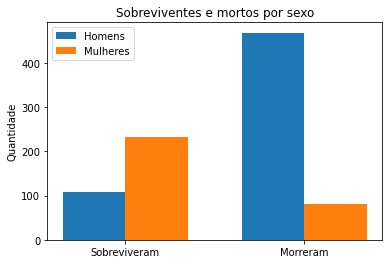
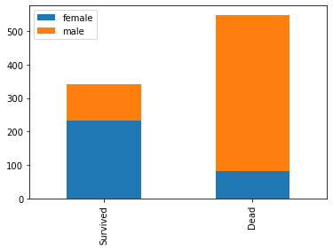
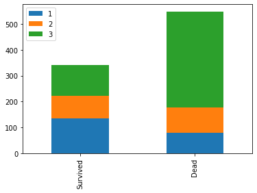
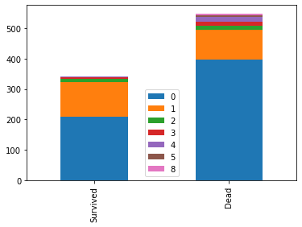
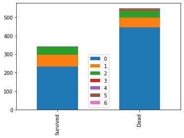
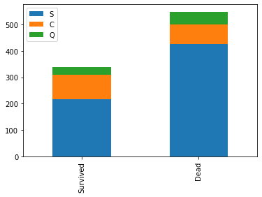
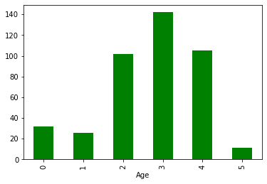
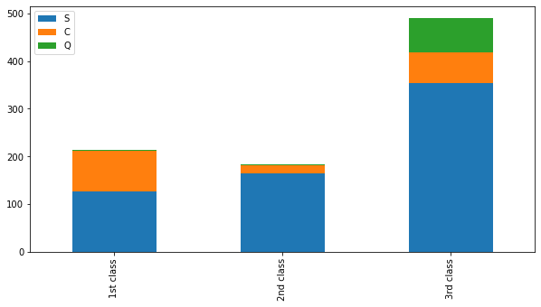
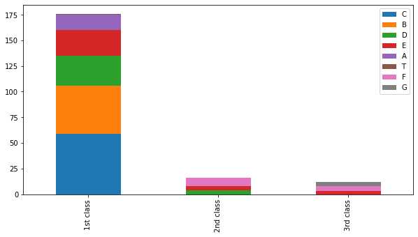

# Titanic: Machine Learning from Disaster

#### Utilizando Machine Learning para prever quais pessoas sobreviveram ao desastre
A resolução do problema segue os seguintes passos:
* Definição do problema;
* Coletando os dados;
* Análise exploratória dos dados;
* Tratamento dos dados e valores missing;
* Modelagem;
* Previsão;

Vale ressaltar que minha referência total para este notebook veio a partir deste material: https://github.com/minsuk-heo/kaggle-titanic
O meu foco principal aqui é iniciar meus estudos no tema de análise de dados, machine learning e ciência de dados.

### 1. Definição do problema

Esta é uma competição disponível no Kaggle, o foco desta competição é introduzir estudantes no mundo da análise de dados. É uma competição simples, cujos dados para treino e teste estão disponíveis no site do Kaggle.
A idéia do desafio é a partir do conjunto de dados de treino, criar um modelo capaz de prever quais foram os sobreviventes no naufrágio do Titanic que ocorreu entre os dias de 14 e 15 de abril no ano de 1912, no atlântico norte.

### 2. Coletando os dados

A primeira etapa é carregar o conjunto de dados para uma estrutura em Python que seja capaz de manipulá-los com facilidade e flexibilidade. O pacote escolhido foi o Pandas por se tratar do pacote mais famoso e mais utilizado no mercado, principalmente para quem está iniciando os estudos agora.
Os dados estão disponíveis nesse link: https://www.kaggle.com/c/titanic/data


```python
import pandas as pd

treino = pd.read_csv('data/train.csv', sep = ',')
teste = pd.read_csv('data/test.csv', sep = ',')

type(treino), type(teste)
```


    (pandas.core.frame.DataFrame, pandas.core.frame.DataFrame)


### 3. Análise exploratória dos dados
A primeira análise a ser feita é uma análise mais com teor de ver informações gerais mais superficiais sobre os dados, sem muito compromisso.


```python
treino.head()
#Alguns valores são inteiros, outros são strings, o sexo está em string, a idade é float.
#De cara da para ver que existem dados missing ali no campo 'Cabin'.
```


<div>
<style scoped>
    .dataframe tbody tr th:only-of-type {
        vertical-align: middle;
    }

    .dataframe tbody tr th {
        vertical-align: top;
    }

    .dataframe thead th {
        text-align: right;
    }
</style>
<table border="1" class="dataframe">
  <thead>
    <tr style="text-align: right;">
      <th></th>
      <th>PassengerId</th>
      <th>Survived</th>
      <th>Pclass</th>
      <th>Name</th>
      <th>Sex</th>
      <th>Age</th>
      <th>SibSp</th>
      <th>Parch</th>
      <th>Ticket</th>
      <th>Fare</th>
      <th>Cabin</th>
      <th>Embarked</th>
    </tr>
  </thead>
  <tbody>
    <tr>
      <th>0</th>
      <td>1</td>
      <td>0</td>
      <td>3</td>
      <td>Braund, Mr. Owen Harris</td>
      <td>male</td>
      <td>22.0</td>
      <td>1</td>
      <td>0</td>
      <td>A/5 21171</td>
      <td>7.2500</td>
      <td>NaN</td>
      <td>S</td>
    </tr>
    <tr>
      <th>1</th>
      <td>2</td>
      <td>1</td>
      <td>1</td>
      <td>Cumings, Mrs. John Bradley (Florence Briggs Th...</td>
      <td>female</td>
      <td>38.0</td>
      <td>1</td>
      <td>0</td>
      <td>PC 17599</td>
      <td>71.2833</td>
      <td>C85</td>
      <td>C</td>
    </tr>
    <tr>
      <th>2</th>
      <td>3</td>
      <td>1</td>
      <td>3</td>
      <td>Heikkinen, Miss. Laina</td>
      <td>female</td>
      <td>26.0</td>
      <td>0</td>
      <td>0</td>
      <td>STON/O2. 3101282</td>
      <td>7.9250</td>
      <td>NaN</td>
      <td>S</td>
    </tr>
    <tr>
      <th>3</th>
      <td>4</td>
      <td>1</td>
      <td>1</td>
      <td>Futrelle, Mrs. Jacques Heath (Lily May Peel)</td>
      <td>female</td>
      <td>35.0</td>
      <td>1</td>
      <td>0</td>
      <td>113803</td>
      <td>53.1000</td>
      <td>C123</td>
      <td>S</td>
    </tr>
    <tr>
      <th>4</th>
      <td>5</td>
      <td>0</td>
      <td>3</td>
      <td>Allen, Mr. William Henry</td>
      <td>male</td>
      <td>35.0</td>
      <td>0</td>
      <td>0</td>
      <td>373450</td>
      <td>8.0500</td>
      <td>NaN</td>
      <td>S</td>
    </tr>
  </tbody>
</table>
</div>


```python
treino.columns #Aqui vemos todas as colunas, é importante saber o nome delas.
```


    Index(['PassengerId', 'Survived', 'Pclass', 'Name', 'Sex', 'Age', 'SibSp',
           'Parch', 'Ticket', 'Fare', 'Cabin', 'Embarked'],
          dtype='object')


#### Dicionário de dados
* PassengerId
* Survived: 0 = Não; 1 = Sim
* Pclass: Classe, igual em aviões: 1st class, 2nd class e 3rd class.
* Name: Nome do indivíduo: Dá para pegar informações com o nome também.
* Sexo: Male or Female: É interessante substituir por 0 e 1, para facilitar no processo de aprendizagem.
* Age: Idade do indivíduo: Ao invés de usar o próprio valor da idade por ser interessante utilizar informações como criança, adolescente, adulto, idosos por exemplo.
* Sibsp: Quantidade de irmãs(os) e esposos/esposas.
* Parch: Quantidade de pais e filhos.
* Ticket: Número do ticket: De cara parece ser uma informação meio sem sentido.
* Fare: Seria taxa, valor do ticket.
* Cabin: Cabine.
* Embarked: Informação interessante, é o porto de embarcação: C = Cherbourg; Q = Queenstown; S = Southampton


```python
treino.shape, teste.shape #Quantidade de linhas e colunas nos conjuntos de treino e teste, respectivamente.
```


    ((891, 12), (418, 11))


```python
treino.isnull().sum() #Quantidade de valores missing (NAN) no conjunto de dados treino
```


    PassengerId      0
    Survived         0
    Pclass           0
    Name             0
    Sex              0
    Age            177
    SibSp            0
    Parch            0
    Ticket           0
    Fare             0
    Cabin          687
    Embarked         2
    dtype: int64


```python
teste.isnull().sum() #Quantidade de valores missing (NAN) no conjunto de dados teste
```


    PassengerId      0
    Pclass           0
    Name             0
    Sex              0
    Age             86
    SibSp            0
    Parch            0
    Ticket           0
    Fare             1
    Cabin          327
    Embarked         0
    dtype: int64


#### Utilizando gráficos visuais para mostrar os dados


```python
import matplotlib.pyplot as plt
import numpy as np
```


```python
labels = ['Sobreviveram', 'Morreram'] #As duas possibilidades, ou sobreviveram ou morreram.
#Pegando somente os homens e mulheres que sobreviveramm
homensSobreviveram = treino.loc[(treino['Survived'] == 1) & (treino['Sex'] == 'male'), 'Sex']
mulhereSobreviveram = treino.loc[(treino['Survived'] == 1) & (treino['Sex'] == 'female'), 'Sex']

#Pegando somente os homens e mulheres que morreram
homensMorreram = treino.loc[(treino['Survived'] == 0) & (treino['Sex'] == 'male'), 'Sex']
mulheresMorreram = treino.loc[(treino['Survived'] == 0) & (treino['Sex'] == 'female'), 'Sex']

#Fazendo um array com dois elementos com as qantidades dos valores acima 
homens = np.array([len(homensSobreviveram), len(homensMorreram)])
mulheres = np.array([len(mulhereSobreviveram), len(mulheresMorreram)])
```


```python
x = np.arange(len(labels))  # the label locations
width = 0.35  # the width of the bars

fig, ax = plt.subplots()
rects1 = ax.bar(x - width/2, homens, width, label='Homens')
rects2 = ax.bar(x + width/2, mulheres, width, label='Mulheres')

ax.set_ylabel('Quantidade')
ax.set_title('Sobreviventes e mortos por sexo')
ax.set_xticks(x)
ax.set_xticklabels(labels)
ax.legend()
```


    <matplotlib.legend.Legend at 0x23d343df8b0>


    

    


Esse gráfico mostra que a quantidade de mulheres que sobreviveram foi muito maior que os homens.


```python
#Outra forma de fazer o calculo acima de maneira mais simples e mais automatizada 
#é criar uma função que recebe somente o nome da coluna como parâmetro
def bar_chart(coluna):
    sobreviveram = treino[treino['Survived']==1][coluna].value_counts()
    morreram = treino[treino['Survived']==0][coluna].value_counts()
    df = pd.DataFrame([sobreviveram, morreram])
    df.index = ['Survived','Dead']
    df.plot(kind='bar',stacked=True, figsize=(6,4))
```


```python
bar_chart('Sex') #O gráfico confirma que mais mulheres sobreviveram do que homens.
```


    

    


```python
bar_chart('Pclass') 
#É possível notar que proporcionalmente as pessoas da primeira classe sobreviveram mais.
#Seguido da segunda classe e depois da terceira.
```


    

    


```python
bar_chart('SibSp')
#As pessoas com um irmão ou esposa mais comumente sobreviveram.
#As pessoas com mais do que um irmão, esposa ou sem ninguém mais comumente morreram.
```


    

    


```python
bar_chart('Parch')
#Praticamente metade das pessoas com pais/filhos abordo sobreviveram.
#Enquanto pessoas sem ninguém mais comumente morreram.
```


    

    


```python
bar_chart('Embarked')
```


    

    


### 4. Tratando dos dados e valores missing

Essa etapa consiste em manipular os dados para que passem de dados strings e numéricos para dados categoricos, bem como aplicar técnicas para tratar dos dados com valores NAN (Missing).


```python
from IPython.display import Image

Image(url= "https://static1.squarespace.com/static/5006453fe4b09ef2252ba068/t/5090b249e4b047ba54dfd258/1351660113175/TItanic-Survival-Infographic.jpg?format=1500w")
```


Com essa imagem é possível observar que as pessoas que ficaram na primeira classe ficaram em posições mais privilegiadas no momento do naufrágio, com isso é possível concluir que Pclass é um atributo muito importante para o classificador.

#### 4.1 Title e Name


```python
treino_teste = [treino, teste] #Uma lista com o Dataframe de treino e teste.

#Para cada dataframe na lista, insira a coluna Título com a string extraída da coluna Name utilizando expressão regular
#Essa expressão regular extrai qualquer string antes de um ponto. 
#Exemplo: "Braund, Mr. Owen Harris" será extraído somente o "Mr." nesse caso.
for df in treino_teste:
    df['Title'] = df['Name'].str.extract('([A-Za-z]+)\.', expand=False)
```


```python
treino['Title'].value_counts()
```


    Mr          517
    Miss        182
    Mrs         125
    Master       40
    Dr            7
    Rev           6
    Mlle          2
    Major         2
    Col           2
    Countess      1
    Capt          1
    Ms            1
    Sir           1
    Lady          1
    Mme           1
    Don           1
    Jonkheer      1
    Name: Title, dtype: int64


```python
teste['Title'].value_counts()
```


    Mr        240
    Miss       78
    Mrs        72
    Master     21
    Col         2
    Rev         2
    Ms          1
    Dr          1
    Dona        1
    Name: Title, dtype: int64


Nota-se que a quantidade de Mr, Miss, Mrs e Master estão bem acima das outras categorias, logo, é possível fazer um mapeamento como sendo:
* Mr: 0;
* Miss: 1;
* Mrs: 2;
* Master: 3;
* Others: 4;


```python
title_mapping = {
    'Mr':0,
    'Miss':1,
    'Mrs':2,
    'Master':3,
    'Dr':4, 'Rev':4, 'Major':4, 'Mlle':4, 'Col':4, 'Don':4, 'Sir':4,
    'Countess':4, 'Lady':4, 'Ms':4, 'Capt':4, 'Jonkheer':4, 'Mme':4
}

for df in treino_teste:
    df['Title'] = df['Title'].map(title_mapping)
```


```python
#Preenchendo os valores que ficaram como nulos.
treino['Title'].fillna(4, inplace=True)
teste['Title'].fillna(4, inplace=True)
```


```python
#excluindo a coluna name, pois a mesma não se faz mais relevante para o treinamento do modelo.
treino.drop('Name', axis=1, inplace=True)
teste.drop('Name', axis=1, inplace=True)
```

#### 4.2 Sex
Os valores do atributo Sex são male e female, é mais interessante trabalhar com dados categoricos numéricos, isto é 0 e 1, portanto:
* 0: Male
* 1: Female


```python
teste.Sex.unique()
```


    array(['male', 'female'], dtype=object)


```python
teste.Sex.value_counts()
```


    male      266
    female    152
    Name: Sex, dtype: int64


```python
sex_mapping = {
    'male': 0,
    'female': 1
}

for df in treino_teste:
    df['Sex'] = df['Sex'].map(sex_mapping)
```

#### 4.3 Age


```python
treino['Age'].isnull().sum(), teste['Age'].isnull().sum()
```


    (177, 86)


```python
treino['Age'].fillna(treino.groupby('Title')['Age'].transform('median'), inplace=True)
teste['Age'].fillna(teste.groupby('Title')['Age'].transform('median'), inplace=True)
```


```python
treino.head(30)
treino.groupby("Title")["Age"].transform("median")
```


    0      30.0
    1      35.0
    2      21.0
    3      35.0
    4      30.0
           ... 
    886    44.5
    887    21.0
    888    21.0
    889    30.0
    890    30.0
    Name: Age, Length: 891, dtype: float64


O próximo passo vai ser converter a variável Age de um dado numérico para um dado categórico. Vai ficar:
* Criança: 0,
* Adolescente: 1,
* Jovem: 2
* Adulto: 3,
* Meia idade: 4,
* Idoso: 5


```python
for df in treino_teste:
    df['Age'] = pd.cut(df['Age'], [0, 13, 18, 25, 35, 60,130], labels=[0,1,2,3,4,5])
```


```python
teste.Age.unique()
```


    [3, 4, 5, 2, 1, 0]
    Categories (6, int64): [0 < 1 < 2 < 3 < 4 < 5]


```python
teste.Age.value_counts()
```


    3    142
    4    105
    2    102
    0     32
    1     26
    5     11
    Name: Age, dtype: int64


```python
teste.groupby(['Age']).size().plot.bar(color = 'green')
```


    <AxesSubplot:xlabel='Age'>


    

    


#### 4.4 Embarked
Informação referente ao porto de embarcação. Dá para trabalhar nessa informação.


```python
Pclass1 = treino[treino['Pclass']==1]['Embarked'].value_counts()
Pclass2 = treino[treino['Pclass']==2]['Embarked'].value_counts()
Pclass3 = treino[treino['Pclass']==3]['Embarked'].value_counts()
df = pd.DataFrame([Pclass1, Pclass2, Pclass3])
df.index = ['1st class','2nd class', '3rd class']
df.plot(kind='bar',stacked=True, figsize=(10,5))
```


    <AxesSubplot:>


    

    


* S = Southampton
* C = Cherbourg;
* Q = Queenstown; 
<br> Pelo fato de a maioria das pessoas terem embarcado no porto de Southampton, vamos assumir que os valores nulos nesta coluna também embarcaram em Southampton.


```python
for df in treino_teste:
    df['Embarked'] = df['Embarked'].fillna('S')
```


```python
#Mapeamento dos dados, transformando valores char em números.
embarked_mapping = {
    'S': 0,
    'C': 1,
    'Q': 2
}

for df in treino_teste:
    df['Embarked'] = df['Embarked'].map(embarked_mapping)
```

#### 4.5 Fare
Fare é a taxa do ticket, tem alguns valores missing, vamos preencher com a mediana do conjunto.


```python
treino['Fare'].describe()
```


    count    891.000000
    mean      32.204208
    std       49.693429
    min        0.000000
    25%        7.910400
    50%       14.454200
    75%       31.000000
    max      512.329200
    Name: Fare, dtype: float64


```python
treino['Fare'].fillna(treino.groupby('Pclass')['Fare'].transform('median'), inplace=True)
teste['Fare'].fillna(teste.groupby('Pclass')['Fare'].transform('median'), inplace=True)
```


```python
tempTeste = teste.copy()
tempTreino = treino.copy()
tempTeste.fillna(tempTeste.groupby('Pclass')['Fare'].transform('median'), inplace=True)
tempTreino.fillna(tempTreino.groupby('Pclass')['Fare'].transform('median'), inplace=True)
```


```python
#Transformando a variável Fare em variável categórica
for df in treino_teste:
    df['Fare'] = pd.cut(df['Fare'], [-1, 17, 30, 100, 9999], labels=[0,1,2,3])
```

#### Cabin


```python
#Vamos pegar somente a primeira letra da frase Cabin
for df in treino_teste:
    df['Cabin'] = df['Cabin'].str[:1]
```


```python
Pclass1 = treino[treino['Pclass']==1]['Cabin'].value_counts()
Pclass2 = treino[treino['Pclass']==2]['Cabin'].value_counts()
Pclass3 = treino[treino['Pclass']==3]['Cabin'].value_counts()
df = pd.DataFrame([Pclass1, Pclass2, Pclass3])
df.index = ['1st class','2nd class', '3rd class']
df.plot(kind='bar',stacked=True, figsize=(10,5))
```


    <AxesSubplot:>


    

    


```python
#Fazendo o mapeamento das cabines também.
cabin_mapping = {"A": 0, "B": 0.4, "C": 0.8, "D": 1.2, "E": 1.6, "F": 2, "G": 2.4, "T": 2.8}
for df in treino_teste:
    df['Cabin'] = df['Cabin'].map(cabin_mapping)
```


```python
#É possível notar que ainda existem muitos valores nulos nesta informação
treino.Cabin.isnull().sum(), teste.Cabin.isnull().sum()
```


    (687, 327)


```python
#Preenchendo os valores nulos do atributo
treino['Cabin'].fillna(treino.groupby('Pclass')['Cabin'].transform('median'), inplace=True)
teste['Cabin'].fillna(teste.groupby('Pclass')['Cabin'].transform('median'), inplace=True)
```


```python
treino.head()
```


<div>
<style scoped>
    .dataframe tbody tr th:only-of-type {
        vertical-align: middle;
    }

    .dataframe tbody tr th {
        vertical-align: top;
    }

    .dataframe thead th {
        text-align: right;
    }
</style>
<table border="1" class="dataframe">
  <thead>
    <tr style="text-align: right;">
      <th></th>
      <th>PassengerId</th>
      <th>Survived</th>
      <th>Pclass</th>
      <th>Sex</th>
      <th>Age</th>
      <th>SibSp</th>
      <th>Parch</th>
      <th>Ticket</th>
      <th>Fare</th>
      <th>Cabin</th>
      <th>Embarked</th>
      <th>Title</th>
    </tr>
  </thead>
  <tbody>
    <tr>
      <th>0</th>
      <td>1</td>
      <td>0</td>
      <td>3</td>
      <td>0</td>
      <td>2</td>
      <td>1</td>
      <td>0</td>
      <td>A/5 21171</td>
      <td>0</td>
      <td>2.0</td>
      <td>0</td>
      <td>0</td>
    </tr>
    <tr>
      <th>1</th>
      <td>2</td>
      <td>1</td>
      <td>1</td>
      <td>1</td>
      <td>4</td>
      <td>1</td>
      <td>0</td>
      <td>PC 17599</td>
      <td>2</td>
      <td>0.8</td>
      <td>1</td>
      <td>2</td>
    </tr>
    <tr>
      <th>2</th>
      <td>3</td>
      <td>1</td>
      <td>3</td>
      <td>1</td>
      <td>3</td>
      <td>0</td>
      <td>0</td>
      <td>STON/O2. 3101282</td>
      <td>0</td>
      <td>2.0</td>
      <td>0</td>
      <td>1</td>
    </tr>
    <tr>
      <th>3</th>
      <td>4</td>
      <td>1</td>
      <td>1</td>
      <td>1</td>
      <td>3</td>
      <td>1</td>
      <td>0</td>
      <td>113803</td>
      <td>2</td>
      <td>0.8</td>
      <td>0</td>
      <td>2</td>
    </tr>
    <tr>
      <th>4</th>
      <td>5</td>
      <td>0</td>
      <td>3</td>
      <td>0</td>
      <td>3</td>
      <td>0</td>
      <td>0</td>
      <td>373450</td>
      <td>0</td>
      <td>2.0</td>
      <td>0</td>
      <td>0</td>
    </tr>
  </tbody>
</table>
</div>


#### 4.6 FamilySize
Os outros atributos que também dá para trabalhar são SibSp e Parch
* SibSp: Número de irmãos e esposa(o)s
* Parch: O Parch é o número de pais e filhos
<br>Como ambos os atriutos se tratam de familiares, é possível juntar em um único atributo.


```python
treino['FamilySize'] = treino['SibSp'] + treino['Parch'] + 1
teste['FamilySize'] = teste['SibSp'] + teste['Parch'] + 1
#Mais um porque se trata do próprio indivíduo.
```


```python
#A família com maior quantidade de membros a bordo tinha 11 pessoas.
#Para não trabalhar com valores muito grandes, vamos categorizar em valores mais baixos
treino.FamilySize.max(), teste.FamilySize.max()
```


    (11, 11)


```python
family_mapping = {
    1 : 0.0, 2 : 0.3, 3 : 0.6, 4 : 0.9,
    5 : 1.2, 6 : 1.5, 7 : 1.8, 8 : 2.1,
    9 : 2.4, 10: 2.7, 11: 3.0,
}

for df in treino_teste:
    df['FamilySize'] = df['FamilySize'].map(family_mapping)
```

#### 4.7 Removendo atributos desnecessários
* Ticket: Atributo que não segue nenhuma lógica, portanto é dispensável;
* SibSp e Parch: Esses atributos foram unificados no atributo FamilySize, portanto podem ser excluídos;
* PassengerId: No conjunto de treino essa coluna não se faz necessária.


```python
features_drop = ['Ticket', 'SibSp', 'Parch']
treino = treino.drop(features_drop, axis=1)
teste = teste.drop(features_drop, axis=1)
treino = treino.drop(['PassengerId'], axis=1)
```


```python
#Vamos separar o conjunto de treinos em atributos e classe.
#Treino_data é o Pandas.DataFrame que vai servir de entrada para o modelo.
#Target é do tipo Pandas.Series que será a variável cujo modelo vai tentar prever o valor.

treino_data = treino.drop('Survived', axis=1)
target = treino['Survived']

type(treino_data), type(target)
```


    (pandas.core.frame.DataFrame, pandas.core.series.Series)


### 5. Modelagem


```python
import tensorflow as tf
from sklearn.neighbors import KNeighborsClassifier
from sklearn.tree import DecisionTreeClassifier
from sklearn.ensemble import RandomForestClassifier
from sklearn.naive_bayes import GaussianNB
from sklearn.svm import SVC

import numpy as np
```

##### 5.1 Utilizando Tensorflow
A minha primeira alternativa é tentar realizar o treinamento utilizando redes neurais profundas. Para isso vou utilizar o Tensorflow 2.x


```python
import sklearn
import numpy as np
import tensorflow as tf
from sklearn.preprocessing import LabelEncoder
from sklearn.model_selection import train_test_split
from tensorflow.keras.optimizers import Adam
from tensorflow.keras.metrics import Precision
from tensorflow.keras.metrics import Recall
```


```python
npTreino = treino_data.to_numpy()
npTarget = target.to_numpy()
# Create a object
encoder = LabelEncoder()
# Apply the fit_transform
target_encoded = encoder.fit_transform(npTarget)
# Apply the One-Hot-Encoding on labels
target_encoded = tf.keras.utils.to_categorical(target_encoded)
```


```python
# We split the training data into two samples, training and validation
X_train, X_valid, y_train, y_valid = train_test_split(npTreino, npTarget)
```

#### _Preparing the Data_


```python
# Hyperparameters
batch_size = 32
autotune = tf.data.experimental.AUTOTUNE
```

#### _Model Building_


```python
#Pre trained model?
```


```python
model = tf.keras.models.Sequential()
```


```python
target_encoded
```


    array([[1., 0.],
           [0., 1.],
           [0., 1.],
           ...,
           [1., 0.],
           [0., 1.],
           [1., 0.]], dtype=float32)


```python
#model.add(tf.keras.Input(shape=(8,)))
model.add(tf.keras.layers.Dense(units=8, activation='relu', input_shape=(8, )))
model.add(tf.keras.layers.Dropout(0.2))
model.add(tf.keras.layers.Dense(units=10, activation='relu'))
model.add(tf.keras.layers.Dense(units=10, activation='relu'))
model.add(tf.keras.layers.Dense(units=10, activation='relu'))
model.add(tf.keras.layers.Dense(units=10, activation='relu'))
model.add(tf.keras.layers.Dense(units=10, activation='relu'))
model.add(tf.keras.layers.Dropout(0.2))
model.add(tf.keras.layers.Dense(units=8, activation='relu'))
model.add(tf.keras.layers.Dropout(0.2))
model.add(tf.keras.layers.Dense(units=2, activation='softmax'))        
```


```python
model.summary()
```

    Model: "sequential_9"
    _________________________________________________________________
     Layer (type)                Output Shape              Param #   
    =================================================================
     dense_37 (Dense)            (None, 8)                 72        
                                                                     
     dropout_21 (Dropout)        (None, 8)                 0         
                                                                     
     dense_38 (Dense)            (None, 10)                90        
                                                                     
     dense_39 (Dense)            (None, 10)                110       
                                                                     
     dense_40 (Dense)            (None, 10)                110       
                                                                     
     dense_41 (Dense)            (None, 10)                110       
                                                                     
     dense_42 (Dense)            (None, 10)                110       
                                                                     
     dropout_22 (Dropout)        (None, 10)                0         
                                                                     
     dense_43 (Dense)            (None, 8)                 88        
                                                                     
     dropout_23 (Dropout)        (None, 8)                 0         
                                                                     
     dense_44 (Dense)            (None, 2)                 18        
                                                                     
    =================================================================
    Total params: 708
    Trainable params: 708
    Non-trainable params: 0
    _________________________________________________________________
    


```python
#model.compile(optimizer='adam', loss='sparse_categorical_crossentropy', metrics=['sparse_categorical_accuracy'])
```


```python
# Hyperparameters
batch_size = 32
epochs = 500
lr = 0.01
beta1 = 0.9
beta2 = 0.9
ep = 1e-08
```


```python
# Model compilation
model.compile(optimizer = Adam(learning_rate = lr, 
                                beta_1 = beta1, 
                                beta_2 = beta2, 
                                epsilon = ep),
               loss = 'sparse_categorical_crossentropy', 
               metrics=['sparse_categorical_accuracy'])
```


```python
checkpoint1 = tf.keras.callbacks.ModelCheckpoint("best_model.h5", 
                                                verbose = 1, 
                                                save_best_only = True, 
                                                save_weights_only = True)

# Checkpoint
checkpoint2 = tf.keras.callbacks.ModelCheckpoint("last_model.h5", 
                                                verbose = 0, 
                                                save_best_only = False,
                                                save_weights_only = True,
                                                save_freq='epoch')

# Early stop
early_stop = tf.keras.callbacks.EarlyStopping(patience = 50) 
```


```python
history = model.fit(npTreino, npTarget, 
                    steps_per_epoch = len(npTreino)//batch_size, 
                    epochs = epochs, 
                    callbacks = [checkpoint1, checkpoint2, early_stop]) 
```

    Epoch 1/500
    24/27 [=========================>....] - ETA: 0s - loss: 0.6486 - sparse_categorical_accuracy: 0.6288WARNING:tensorflow:Can save best model only with val_loss available, skipping.
    WARNING:tensorflow:Early stopping conditioned on metric `val_loss` which is not available. Available metrics are: loss,sparse_categorical_accuracy
    27/27 [==============================] - 1s 8ms/step - loss: 0.6500 - sparse_categorical_accuracy: 0.6207
    Epoch 2/500
    23/27 [========================>.....] - ETA: 0s - loss: 0.6018 - sparse_categorical_accuracy: 0.6324WARNING:tensorflow:Can save best model only with val_loss available, skipping.
    WARNING:tensorflow:Early stopping conditioned on metric `val_loss` which is not available. Available metrics are: loss,sparse_categorical_accuracy
    27/27 [==============================] - 0s 8ms/step - loss: 0.5965 - sparse_categorical_accuracy: 0.6498
    Epoch 3/500
    26/27 [===========================>..] - ETA: 0s - loss: 0.5628 - sparse_categorical_accuracy: 0.7191WARNING:tensorflow:Can save best model only with val_loss available, skipping.
    WARNING:tensorflow:Early stopping conditioned on metric `val_loss` which is not available. Available metrics are: loss,sparse_categorical_accuracy
    27/27 [==============================] - 0s 7ms/step - loss: 0.5609 - sparse_categorical_accuracy: 0.7160
    Epoch 4/500
    22/27 [=======================>......] - ETA: 0s - loss: 0.5575 - sparse_categorical_accuracy: 0.7107WARNING:tensorflow:Can save best model only with val_loss available, skipping.
    WARNING:tensorflow:Early stopping conditioned on metric `val_loss` which is not available. Available metrics are: loss,sparse_categorical_accuracy
    27/27 [==============================] - 0s 8ms/step - loss: 0.5616 - sparse_categorical_accuracy: 0.7093
    Epoch 5/500
    27/27 [==============================] - ETA: 0s - loss: 0.5465 - sparse_categorical_accuracy: 0.7542WARNING:tensorflow:Can save best model only with val_loss available, skipping.
    WARNING:tensorflow:Early stopping conditioned on metric `val_loss` which is not available. Available metrics are: loss,sparse_categorical_accuracy
    27/27 [==============================] - 0s 7ms/step - loss: 0.5465 - sparse_categorical_accuracy: 0.7542
    Epoch 6/500
    27/27 [==============================] - ETA: 0s - loss: 0.5312 - sparse_categorical_accuracy: 0.7789WARNING:tensorflow:Can save best model only with val_loss available, skipping.
    WARNING:tensorflow:Early stopping conditioned on metric `val_loss` which is not available. Available metrics are: loss,sparse_categorical_accuracy
    27/27 [==============================] - 0s 7ms/step - loss: 0.5312 - sparse_categorical_accuracy: 0.7789
    Epoch 7/500
    27/27 [==============================] - ETA: 0s - loss: 0.5212 - sparse_categorical_accuracy: 0.7677WARNING:tensorflow:Can save best model only with val_loss available, skipping.
    WARNING:tensorflow:Early stopping conditioned on metric `val_loss` which is not available. Available metrics are: loss,sparse_categorical_accuracy
    27/27 [==============================] - 0s 7ms/step - loss: 0.5212 - sparse_categorical_accuracy: 0.7677
    Epoch 8/500
    23/27 [========================>.....] - ETA: 0s - loss: 0.5072 - sparse_categorical_accuracy: 0.7971WARNING:tensorflow:Can save best model only with val_loss available, skipping.
    WARNING:tensorflow:Early stopping conditioned on metric `val_loss` which is not available. Available metrics are: loss,sparse_categorical_accuracy
    27/27 [==============================] - 0s 9ms/step - loss: 0.5139 - sparse_categorical_accuracy: 0.7901
    Epoch 9/500
    26/27 [===========================>..] - ETA: 0s - loss: 0.5105 - sparse_categorical_accuracy: 0.7797WARNING:tensorflow:Can save best model only with val_loss available, skipping.
    WARNING:tensorflow:Early stopping conditioned on metric `val_loss` which is not available. Available metrics are: loss,sparse_categorical_accuracy
    27/27 [==============================] - 0s 7ms/step - loss: 0.5135 - sparse_categorical_accuracy: 0.7800
    Epoch 10/500
    19/27 [====================>.........] - ETA: 0s - loss: 0.5310 - sparse_categorical_accuracy: 0.7751WARNING:tensorflow:Can save best model only with val_loss available, skipping.
    WARNING:tensorflow:Early stopping conditioned on metric `val_loss` which is not available. Available metrics are: loss,sparse_categorical_accuracy
    27/27 [==============================] - 0s 7ms/step - loss: 0.5228 - sparse_categorical_accuracy: 0.7755
    Epoch 11/500
    27/27 [==============================] - ETA: 0s - loss: 0.5106 - sparse_categorical_accuracy: 0.7901WARNING:tensorflow:Can save best model only with val_loss available, skipping.
    WARNING:tensorflow:Early stopping conditioned on metric `val_loss` which is not available. Available metrics are: loss,sparse_categorical_accuracy
    27/27 [==============================] - 0s 7ms/step - loss: 0.5106 - sparse_categorical_accuracy: 0.7901
    Epoch 12/500
    19/27 [====================>.........] - ETA: 0s - loss: 0.5083 - sparse_categorical_accuracy: 0.7751WARNING:tensorflow:Can save best model only with val_loss available, skipping.
    WARNING:tensorflow:Early stopping conditioned on metric `val_loss` which is not available. Available metrics are: loss,sparse_categorical_accuracy
    27/27 [==============================] - 0s 7ms/step - loss: 0.5150 - sparse_categorical_accuracy: 0.7688
    Epoch 13/500
    20/27 [=====================>........] - ETA: 0s - loss: 0.4986 - sparse_categorical_accuracy: 0.8000WARNING:tensorflow:Can save best model only with val_loss available, skipping.
    WARNING:tensorflow:Early stopping conditioned on metric `val_loss` which is not available. Available metrics are: loss,sparse_categorical_accuracy
    27/27 [==============================] - 0s 7ms/step - loss: 0.5015 - sparse_categorical_accuracy: 0.7935
    Epoch 14/500
    27/27 [==============================] - ETA: 0s - loss: 0.4985 - sparse_categorical_accuracy: 0.7755WARNING:tensorflow:Can save best model only with val_loss available, skipping.
    WARNING:tensorflow:Early stopping conditioned on metric `val_loss` which is not available. Available metrics are: loss,sparse_categorical_accuracy
    27/27 [==============================] - 0s 7ms/step - loss: 0.4985 - sparse_categorical_accuracy: 0.7755
    Epoch 15/500
    27/27 [==============================] - ETA: 0s - loss: 0.5017 - sparse_categorical_accuracy: 0.8058WARNING:tensorflow:Can save best model only with val_loss available, skipping.
    WARNING:tensorflow:Early stopping conditioned on metric `val_loss` which is not available. Available metrics are: loss,sparse_categorical_accuracy
    27/27 [==============================] - 0s 7ms/step - loss: 0.5017 - sparse_categorical_accuracy: 0.8058
    Epoch 16/500
    19/27 [====================>.........] - ETA: 0s - loss: 0.4816 - sparse_categorical_accuracy: 0.7990WARNING:tensorflow:Can save best model only with val_loss available, skipping.
    WARNING:tensorflow:Early stopping conditioned on metric `val_loss` which is not available. Available metrics are: loss,sparse_categorical_accuracy
    27/27 [==============================] - 0s 7ms/step - loss: 0.4924 - sparse_categorical_accuracy: 0.7924
    Epoch 17/500
    18/27 [===================>..........] - ETA: 0s - loss: 0.4847 - sparse_categorical_accuracy: 0.8098WARNING:tensorflow:Can save best model only with val_loss available, skipping.
    WARNING:tensorflow:Early stopping conditioned on metric `val_loss` which is not available. Available metrics are: loss,sparse_categorical_accuracy
    27/27 [==============================] - 0s 7ms/step - loss: 0.4829 - sparse_categorical_accuracy: 0.8058
    Epoch 18/500
    27/27 [==============================] - ETA: 0s - loss: 0.4939 - sparse_categorical_accuracy: 0.7868WARNING:tensorflow:Can save best model only with val_loss available, skipping.
    WARNING:tensorflow:Early stopping conditioned on metric `val_loss` which is not available. Available metrics are: loss,sparse_categorical_accuracy
    27/27 [==============================] - 0s 7ms/step - loss: 0.4939 - sparse_categorical_accuracy: 0.7868
    Epoch 19/500
    23/27 [========================>.....] - ETA: 0s - loss: 0.5053 - sparse_categorical_accuracy: 0.7931WARNING:tensorflow:Can save best model only with val_loss available, skipping.
    WARNING:tensorflow:Early stopping conditioned on metric `val_loss` which is not available. Available metrics are: loss,sparse_categorical_accuracy
    27/27 [==============================] - 0s 9ms/step - loss: 0.4983 - sparse_categorical_accuracy: 0.7991
    Epoch 20/500
    24/27 [=========================>....] - ETA: 0s - loss: 0.4950 - sparse_categorical_accuracy: 0.8056WARNING:tensorflow:Can save best model only with val_loss available, skipping.
    WARNING:tensorflow:Early stopping conditioned on metric `val_loss` which is not available. Available metrics are: loss,sparse_categorical_accuracy
    27/27 [==============================] - 0s 8ms/step - loss: 0.4924 - sparse_categorical_accuracy: 0.8047
    Epoch 21/500
    24/27 [=========================>....] - ETA: 0s - loss: 0.4816 - sparse_categorical_accuracy: 0.8093WARNING:tensorflow:Can save best model only with val_loss available, skipping.
    WARNING:tensorflow:Early stopping conditioned on metric `val_loss` which is not available. Available metrics are: loss,sparse_categorical_accuracy
    27/27 [==============================] - 0s 8ms/step - loss: 0.4766 - sparse_categorical_accuracy: 0.8070
    Epoch 22/500
    25/27 [==========================>...] - ETA: 0s - loss: 0.4780 - sparse_categorical_accuracy: 0.8182WARNING:tensorflow:Can save best model only with val_loss available, skipping.
    WARNING:tensorflow:Early stopping conditioned on metric `val_loss` which is not available. Available metrics are: loss,sparse_categorical_accuracy
    27/27 [==============================] - 0s 8ms/step - loss: 0.4863 - sparse_categorical_accuracy: 0.8137
    Epoch 23/500
    26/27 [===========================>..] - ETA: 0s - loss: 0.4760 - sparse_categorical_accuracy: 0.7949WARNING:tensorflow:Can save best model only with val_loss available, skipping.
    WARNING:tensorflow:Early stopping conditioned on metric `val_loss` which is not available. Available metrics are: loss,sparse_categorical_accuracy
    27/27 [==============================] - 0s 8ms/step - loss: 0.4748 - sparse_categorical_accuracy: 0.7935
    Epoch 24/500
    26/27 [===========================>..] - ETA: 0s - loss: 0.4769 - sparse_categorical_accuracy: 0.7937WARNING:tensorflow:Can save best model only with val_loss available, skipping.
    WARNING:tensorflow:Early stopping conditioned on metric `val_loss` which is not available. Available metrics are: loss,sparse_categorical_accuracy
    27/27 [==============================] - 0s 8ms/step - loss: 0.4755 - sparse_categorical_accuracy: 0.7957
    Epoch 25/500
    27/27 [==============================] - ETA: 0s - loss: 0.4912 - sparse_categorical_accuracy: 0.7778WARNING:tensorflow:Can save best model only with val_loss available, skipping.
    WARNING:tensorflow:Early stopping conditioned on metric `val_loss` which is not available. Available metrics are: loss,sparse_categorical_accuracy
    27/27 [==============================] - 0s 7ms/step - loss: 0.4912 - sparse_categorical_accuracy: 0.7778
    Epoch 26/500
    25/27 [==========================>...] - ETA: 0s - loss: 0.4796 - sparse_categorical_accuracy: 0.8109WARNING:tensorflow:Can save best model only with val_loss available, skipping.
    WARNING:tensorflow:Early stopping conditioned on metric `val_loss` which is not available. Available metrics are: loss,sparse_categorical_accuracy
    27/27 [==============================] - 0s 8ms/step - loss: 0.4813 - sparse_categorical_accuracy: 0.8058
    Epoch 27/500
    19/27 [====================>.........] - ETA: 0s - loss: 0.4452 - sparse_categorical_accuracy: 0.8230WARNING:tensorflow:Can save best model only with val_loss available, skipping.
    WARNING:tensorflow:Early stopping conditioned on metric `val_loss` which is not available. Available metrics are: loss,sparse_categorical_accuracy
    27/27 [==============================] - 0s 7ms/step - loss: 0.4646 - sparse_categorical_accuracy: 0.8103
    Epoch 28/500
    25/27 [==========================>...] - ETA: 0s - loss: 0.4819 - sparse_categorical_accuracy: 0.7939WARNING:tensorflow:Can save best model only with val_loss available, skipping.
    WARNING:tensorflow:Early stopping conditioned on metric `val_loss` which is not available. Available metrics are: loss,sparse_categorical_accuracy
    27/27 [==============================] - 0s 8ms/step - loss: 0.4837 - sparse_categorical_accuracy: 0.7946
    Epoch 29/500
    19/27 [====================>.........] - ETA: 0s - loss: 0.4667 - sparse_categorical_accuracy: 0.8150WARNING:tensorflow:Can save best model only with val_loss available, skipping.
    WARNING:tensorflow:Early stopping conditioned on metric `val_loss` which is not available. Available metrics are: loss,sparse_categorical_accuracy
    27/27 [==============================] - 0s 7ms/step - loss: 0.4578 - sparse_categorical_accuracy: 0.8126
    Epoch 30/500
    27/27 [==============================] - ETA: 0s - loss: 0.4652 - sparse_categorical_accuracy: 0.8114WARNING:tensorflow:Can save best model only with val_loss available, skipping.
    WARNING:tensorflow:Early stopping conditioned on metric `val_loss` which is not available. Available metrics are: loss,sparse_categorical_accuracy
    27/27 [==============================] - 0s 7ms/step - loss: 0.4652 - sparse_categorical_accuracy: 0.8114
    Epoch 31/500
    27/27 [==============================] - ETA: 0s - loss: 0.4775 - sparse_categorical_accuracy: 0.8002WARNING:tensorflow:Can save best model only with val_loss available, skipping.
    WARNING:tensorflow:Early stopping conditioned on metric `val_loss` which is not available. Available metrics are: loss,sparse_categorical_accuracy
    27/27 [==============================] - 0s 7ms/step - loss: 0.4775 - sparse_categorical_accuracy: 0.8002
    Epoch 32/500
    21/27 [======================>.......] - ETA: 0s - loss: 0.4863 - sparse_categorical_accuracy: 0.7893WARNING:tensorflow:Can save best model only with val_loss available, skipping.
    WARNING:tensorflow:Early stopping conditioned on metric `val_loss` which is not available. Available metrics are: loss,sparse_categorical_accuracy
    27/27 [==============================] - 0s 7ms/step - loss: 0.4700 - sparse_categorical_accuracy: 0.8058
    Epoch 33/500
    19/27 [====================>.........] - ETA: 0s - loss: 0.4841 - sparse_categorical_accuracy: 0.8006WARNING:tensorflow:Can save best model only with val_loss available, skipping.
    WARNING:tensorflow:Early stopping conditioned on metric `val_loss` which is not available. Available metrics are: loss,sparse_categorical_accuracy
    27/27 [==============================] - 0s 7ms/step - loss: 0.4896 - sparse_categorical_accuracy: 0.8013
    Epoch 34/500
    20/27 [=====================>........] - ETA: 0s - loss: 0.4830 - sparse_categorical_accuracy: 0.7939WARNING:tensorflow:Can save best model only with val_loss available, skipping.
    WARNING:tensorflow:Early stopping conditioned on metric `val_loss` which is not available. Available metrics are: loss,sparse_categorical_accuracy
    27/27 [==============================] - 0s 7ms/step - loss: 0.4757 - sparse_categorical_accuracy: 0.7969
    Epoch 35/500
    19/27 [====================>.........] - ETA: 0s - loss: 0.4789 - sparse_categorical_accuracy: 0.7943WARNING:tensorflow:Can save best model only with val_loss available, skipping.
    WARNING:tensorflow:Early stopping conditioned on metric `val_loss` which is not available. Available metrics are: loss,sparse_categorical_accuracy
    27/27 [==============================] - 0s 7ms/step - loss: 0.4709 - sparse_categorical_accuracy: 0.8070
    Epoch 36/500
    26/27 [===========================>..] - ETA: 0s - loss: 0.4780 - sparse_categorical_accuracy: 0.7914WARNING:tensorflow:Can save best model only with val_loss available, skipping.
    WARNING:tensorflow:Early stopping conditioned on metric `val_loss` which is not available. Available metrics are: loss,sparse_categorical_accuracy
    27/27 [==============================] - 0s 7ms/step - loss: 0.4710 - sparse_categorical_accuracy: 0.7969
    Epoch 37/500
    21/27 [======================>.......] - ETA: 0s - loss: 0.4825 - sparse_categorical_accuracy: 0.8052WARNING:tensorflow:Can save best model only with val_loss available, skipping.
    WARNING:tensorflow:Early stopping conditioned on metric `val_loss` which is not available. Available metrics are: loss,sparse_categorical_accuracy
    27/27 [==============================] - 0s 7ms/step - loss: 0.4949 - sparse_categorical_accuracy: 0.7890
    Epoch 38/500
    27/27 [==============================] - ETA: 0s - loss: 0.4753 - sparse_categorical_accuracy: 0.7823WARNING:tensorflow:Can save best model only with val_loss available, skipping.
    WARNING:tensorflow:Early stopping conditioned on metric `val_loss` which is not available. Available metrics are: loss,sparse_categorical_accuracy
    27/27 [==============================] - 0s 7ms/step - loss: 0.4753 - sparse_categorical_accuracy: 0.7823
    Epoch 39/500
    20/27 [=====================>........] - ETA: 0s - loss: 0.4911 - sparse_categorical_accuracy: 0.7924WARNING:tensorflow:Can save best model only with val_loss available, skipping.
    WARNING:tensorflow:Early stopping conditioned on metric `val_loss` which is not available. Available metrics are: loss,sparse_categorical_accuracy
    27/27 [==============================] - 0s 7ms/step - loss: 0.4799 - sparse_categorical_accuracy: 0.8025
    Epoch 40/500
    27/27 [==============================] - ETA: 0s - loss: 0.4734 - sparse_categorical_accuracy: 0.8036WARNING:tensorflow:Can save best model only with val_loss available, skipping.
    WARNING:tensorflow:Early stopping conditioned on metric `val_loss` which is not available. Available metrics are: loss,sparse_categorical_accuracy
    27/27 [==============================] - 0s 7ms/step - loss: 0.4734 - sparse_categorical_accuracy: 0.8036
    Epoch 41/500
    20/27 [=====================>........] - ETA: 0s - loss: 0.4649 - sparse_categorical_accuracy: 0.8076WARNING:tensorflow:Can save best model only with val_loss available, skipping.
    WARNING:tensorflow:Early stopping conditioned on metric `val_loss` which is not available. Available metrics are: loss,sparse_categorical_accuracy
    27/27 [==============================] - 0s 7ms/step - loss: 0.4706 - sparse_categorical_accuracy: 0.8092
    Epoch 42/500
    19/27 [====================>.........] - ETA: 0s - loss: 0.4465 - sparse_categorical_accuracy: 0.7990WARNING:tensorflow:Can save best model only with val_loss available, skipping.
    WARNING:tensorflow:Early stopping conditioned on metric `val_loss` which is not available. Available metrics are: loss,sparse_categorical_accuracy
    27/27 [==============================] - 0s 7ms/step - loss: 0.4671 - sparse_categorical_accuracy: 0.7912
    Epoch 43/500
    27/27 [==============================] - ETA: 0s - loss: 0.4583 - sparse_categorical_accuracy: 0.8002WARNING:tensorflow:Can save best model only with val_loss available, skipping.
    WARNING:tensorflow:Early stopping conditioned on metric `val_loss` which is not available. Available metrics are: loss,sparse_categorical_accuracy
    27/27 [==============================] - 0s 7ms/step - loss: 0.4583 - sparse_categorical_accuracy: 0.8002
    Epoch 44/500
    18/27 [===================>..........] - ETA: 0s - loss: 0.4917 - sparse_categorical_accuracy: 0.8064WARNING:tensorflow:Can save best model only with val_loss available, skipping.
    WARNING:tensorflow:Early stopping conditioned on metric `val_loss` which is not available. Available metrics are: loss,sparse_categorical_accuracy
    27/27 [==============================] - 0s 7ms/step - loss: 0.4750 - sparse_categorical_accuracy: 0.8215
    Epoch 45/500
    21/27 [======================>.......] - ETA: 0s - loss: 0.4622 - sparse_categorical_accuracy: 0.7965WARNING:tensorflow:Can save best model only with val_loss available, skipping.
    WARNING:tensorflow:Early stopping conditioned on metric `val_loss` which is not available. Available metrics are: loss,sparse_categorical_accuracy
    27/27 [==============================] - 0s 6ms/step - loss: 0.4758 - sparse_categorical_accuracy: 0.7969
    Epoch 46/500
    26/27 [===========================>..] - ETA: 0s - loss: 0.4737 - sparse_categorical_accuracy: 0.7972WARNING:tensorflow:Can save best model only with val_loss available, skipping.
    WARNING:tensorflow:Early stopping conditioned on metric `val_loss` which is not available. Available metrics are: loss,sparse_categorical_accuracy
    27/27 [==============================] - 0s 9ms/step - loss: 0.4712 - sparse_categorical_accuracy: 0.8002
    Epoch 47/500
    20/27 [=====================>........] - ETA: 0s - loss: 0.4669 - sparse_categorical_accuracy: 0.8000WARNING:tensorflow:Can save best model only with val_loss available, skipping.
    WARNING:tensorflow:Early stopping conditioned on metric `val_loss` which is not available. Available metrics are: loss,sparse_categorical_accuracy
    27/27 [==============================] - 0s 7ms/step - loss: 0.4760 - sparse_categorical_accuracy: 0.7991
    Epoch 48/500
    19/27 [====================>.........] - ETA: 0s - loss: 0.4725 - sparse_categorical_accuracy: 0.8038WARNING:tensorflow:Can save best model only with val_loss available, skipping.
    WARNING:tensorflow:Early stopping conditioned on metric `val_loss` which is not available. Available metrics are: loss,sparse_categorical_accuracy
    27/27 [==============================] - 0s 7ms/step - loss: 0.4678 - sparse_categorical_accuracy: 0.8081
    Epoch 49/500
    27/27 [==============================] - ETA: 0s - loss: 0.4722 - sparse_categorical_accuracy: 0.8103WARNING:tensorflow:Can save best model only with val_loss available, skipping.
    WARNING:tensorflow:Early stopping conditioned on metric `val_loss` which is not available. Available metrics are: loss,sparse_categorical_accuracy
    27/27 [==============================] - 0s 7ms/step - loss: 0.4722 - sparse_categorical_accuracy: 0.8103
    Epoch 50/500
    19/27 [====================>.........] - ETA: 0s - loss: 0.4887 - sparse_categorical_accuracy: 0.7927WARNING:tensorflow:Can save best model only with val_loss available, skipping.
    WARNING:tensorflow:Early stopping conditioned on metric `val_loss` which is not available. Available metrics are: loss,sparse_categorical_accuracy
    27/27 [==============================] - 0s 7ms/step - loss: 0.4868 - sparse_categorical_accuracy: 0.7912
    Epoch 51/500
    21/27 [======================>.......] - ETA: 0s - loss: 0.4933 - sparse_categorical_accuracy: 0.7994WARNING:tensorflow:Can save best model only with val_loss available, skipping.
    WARNING:tensorflow:Early stopping conditioned on metric `val_loss` which is not available. Available metrics are: loss,sparse_categorical_accuracy
    27/27 [==============================] - 0s 6ms/step - loss: 0.4847 - sparse_categorical_accuracy: 0.8036
    Epoch 52/500
    19/27 [====================>.........] - ETA: 0s - loss: 0.4648 - sparse_categorical_accuracy: 0.8038WARNING:tensorflow:Can save best model only with val_loss available, skipping.
    WARNING:tensorflow:Early stopping conditioned on metric `val_loss` which is not available. Available metrics are: loss,sparse_categorical_accuracy
    27/27 [==============================] - 0s 7ms/step - loss: 0.4640 - sparse_categorical_accuracy: 0.8058
    Epoch 53/500
    18/27 [===================>..........] - ETA: 0s - loss: 0.4300 - sparse_categorical_accuracy: 0.8300- ETA: 0s - loss: 0.4034 - sparse_categorical_accuracy: 0.841WARNING:tensorflow:Can save best model only with val_loss available, skipping.
    WARNING:tensorflow:Early stopping conditioned on metric `val_loss` which is not available. Available metrics are: loss,sparse_categorical_accuracy
    27/27 [==============================] - 0s 7ms/step - loss: 0.4578 - sparse_categorical_accuracy: 0.8137
    Epoch 54/500
    19/27 [====================>.........] - ETA: 0s - loss: 0.4545 - sparse_categorical_accuracy: 0.8150WARNING:tensorflow:Can save best model only with val_loss available, skipping.
    WARNING:tensorflow:Early stopping conditioned on metric `val_loss` which is not available. Available metrics are: loss,sparse_categorical_accuracy
    27/27 [==============================] - 0s 7ms/step - loss: 0.4429 - sparse_categorical_accuracy: 0.8103
    Epoch 55/500
    20/27 [=====================>........] - ETA: 0s - loss: 0.4973 - sparse_categorical_accuracy: 0.7939WARNING:tensorflow:Can save best model only with val_loss available, skipping.
    WARNING:tensorflow:Early stopping conditioned on metric `val_loss` which is not available. Available metrics are: loss,sparse_categorical_accuracy
    27/27 [==============================] - 0s 7ms/step - loss: 0.4760 - sparse_categorical_accuracy: 0.8025
    Epoch 56/500
    21/27 [======================>.......] - ETA: 0s - loss: 0.4868 - sparse_categorical_accuracy: 0.8124WARNING:tensorflow:Can save best model only with val_loss available, skipping.
    WARNING:tensorflow:Early stopping conditioned on metric `val_loss` which is not available. Available metrics are: loss,sparse_categorical_accuracy
    27/27 [==============================] - 0s 7ms/step - loss: 0.4924 - sparse_categorical_accuracy: 0.8025
    Epoch 57/500
    19/27 [====================>.........] - ETA: 0s - loss: 0.4824 - sparse_categorical_accuracy: 0.7831WARNING:tensorflow:Can save best model only with val_loss available, skipping.
    WARNING:tensorflow:Early stopping conditioned on metric `val_loss` which is not available. Available metrics are: loss,sparse_categorical_accuracy
    27/27 [==============================] - 0s 7ms/step - loss: 0.4682 - sparse_categorical_accuracy: 0.8025
    Epoch 58/500
    20/27 [=====================>........] - ETA: 0s - loss: 0.4366 - sparse_categorical_accuracy: 0.8152WARNING:tensorflow:Can save best model only with val_loss available, skipping.
    WARNING:tensorflow:Early stopping conditioned on metric `val_loss` which is not available. Available metrics are: loss,sparse_categorical_accuracy
    27/27 [==============================] - 0s 7ms/step - loss: 0.4472 - sparse_categorical_accuracy: 0.8092
    Epoch 59/500
    26/27 [===========================>..] - ETA: 0s - loss: 0.4804 - sparse_categorical_accuracy: 0.8065WARNING:tensorflow:Can save best model only with val_loss available, skipping.
    WARNING:tensorflow:Early stopping conditioned on metric `val_loss` which is not available. Available metrics are: loss,sparse_categorical_accuracy
    27/27 [==============================] - 0s 8ms/step - loss: 0.4832 - sparse_categorical_accuracy: 0.8047
    Epoch 60/500
    22/27 [=======================>......] - ETA: 0s - loss: 0.4502 - sparse_categorical_accuracy: 0.8237WARNING:tensorflow:Can save best model only with val_loss available, skipping.
    WARNING:tensorflow:Early stopping conditioned on metric `val_loss` which is not available. Available metrics are: loss,sparse_categorical_accuracy
    27/27 [==============================] - 0s 6ms/step - loss: 0.4524 - sparse_categorical_accuracy: 0.8316
    Epoch 61/500
    20/27 [=====================>........] - ETA: 0s - loss: 0.4711 - sparse_categorical_accuracy: 0.8000WARNING:tensorflow:Can save best model only with val_loss available, skipping.
    WARNING:tensorflow:Early stopping conditioned on metric `val_loss` which is not available. Available metrics are: loss,sparse_categorical_accuracy
    27/27 [==============================] - 0s 7ms/step - loss: 0.4625 - sparse_categorical_accuracy: 0.8070
    Epoch 62/500
    19/27 [====================>.........] - ETA: 0s - loss: 0.4408 - sparse_categorical_accuracy: 0.8118WARNING:tensorflow:Can save best model only with val_loss available, skipping.
    WARNING:tensorflow:Early stopping conditioned on metric `val_loss` which is not available. Available metrics are: loss,sparse_categorical_accuracy
    27/27 [==============================] - 0s 7ms/step - loss: 0.4656 - sparse_categorical_accuracy: 0.7980
    Epoch 63/500
    21/27 [======================>.......] - ETA: 0s - loss: 0.4557 - sparse_categorical_accuracy: 0.8066WARNING:tensorflow:Can save best model only with val_loss available, skipping.
    WARNING:tensorflow:Early stopping conditioned on metric `val_loss` which is not available. Available metrics are: loss,sparse_categorical_accuracy
    27/27 [==============================] - 0s 6ms/step - loss: 0.4478 - sparse_categorical_accuracy: 0.8159
    Epoch 64/500
    21/27 [======================>.......] - ETA: 0s - loss: 0.4499 - sparse_categorical_accuracy: 0.8225WARNING:tensorflow:Can save best model only with val_loss available, skipping.
    WARNING:tensorflow:Early stopping conditioned on metric `val_loss` which is not available. Available metrics are: loss,sparse_categorical_accuracy
    27/27 [==============================] - 0s 6ms/step - loss: 0.4582 - sparse_categorical_accuracy: 0.8126
    Epoch 65/500
    20/27 [=====================>........] - ETA: 0s - loss: 0.4535 - sparse_categorical_accuracy: 0.8152WARNING:tensorflow:Can save best model only with val_loss available, skipping.
    WARNING:tensorflow:Early stopping conditioned on metric `val_loss` which is not available. Available metrics are: loss,sparse_categorical_accuracy
    27/27 [==============================] - 0s 7ms/step - loss: 0.4579 - sparse_categorical_accuracy: 0.8137
    Epoch 66/500
    19/27 [====================>.........] - ETA: 0s - loss: 0.5112 - sparse_categorical_accuracy: 0.7656WARNING:tensorflow:Can save best model only with val_loss available, skipping.
    WARNING:tensorflow:Early stopping conditioned on metric `val_loss` which is not available. Available metrics are: loss,sparse_categorical_accuracy
    27/27 [==============================] - 0s 7ms/step - loss: 0.4902 - sparse_categorical_accuracy: 0.7879
    Epoch 67/500
    21/27 [======================>.......] - ETA: 0s - loss: 0.4597 - sparse_categorical_accuracy: 0.8254WARNING:tensorflow:Can save best model only with val_loss available, skipping.
    WARNING:tensorflow:Early stopping conditioned on metric `val_loss` which is not available. Available metrics are: loss,sparse_categorical_accuracy
    27/27 [==============================] - 0s 6ms/step - loss: 0.4584 - sparse_categorical_accuracy: 0.8260
    Epoch 68/500
    19/27 [====================>.........] - ETA: 0s - loss: 0.4700 - sparse_categorical_accuracy: 0.8038WARNING:tensorflow:Can save best model only with val_loss available, skipping.
    WARNING:tensorflow:Early stopping conditioned on metric `val_loss` which is not available. Available metrics are: loss,sparse_categorical_accuracy
    27/27 [==============================] - 0s 7ms/step - loss: 0.4487 - sparse_categorical_accuracy: 0.8137
    Epoch 69/500
    21/27 [======================>.......] - ETA: 0s - loss: 0.4276 - sparse_categorical_accuracy: 0.8153WARNING:tensorflow:Can save best model only with val_loss available, skipping.
    WARNING:tensorflow:Early stopping conditioned on metric `val_loss` which is not available. Available metrics are: loss,sparse_categorical_accuracy
    27/27 [==============================] - 0s 7ms/step - loss: 0.4368 - sparse_categorical_accuracy: 0.8171
    Epoch 70/500
    19/27 [====================>.........] - ETA: 0s - loss: 0.4827 - sparse_categorical_accuracy: 0.8118WARNING:tensorflow:Can save best model only with val_loss available, skipping.
    WARNING:tensorflow:Early stopping conditioned on metric `val_loss` which is not available. Available metrics are: loss,sparse_categorical_accuracy
    27/27 [==============================] - 0s 7ms/step - loss: 0.4646 - sparse_categorical_accuracy: 0.8204
    Epoch 71/500
    19/27 [====================>.........] - ETA: 0s - loss: 0.4808 - sparse_categorical_accuracy: 0.7943WARNING:tensorflow:Can save best model only with val_loss available, skipping.
    WARNING:tensorflow:Early stopping conditioned on metric `val_loss` which is not available. Available metrics are: loss,sparse_categorical_accuracy
    27/27 [==============================] - 0s 7ms/step - loss: 0.4739 - sparse_categorical_accuracy: 0.8025
    Epoch 72/500
    21/27 [======================>.......] - ETA: 0s - loss: 0.4616 - sparse_categorical_accuracy: 0.8110WARNING:tensorflow:Can save best model only with val_loss available, skipping.
    WARNING:tensorflow:Early stopping conditioned on metric `val_loss` which is not available. Available metrics are: loss,sparse_categorical_accuracy
    27/27 [==============================] - 0s 6ms/step - loss: 0.4531 - sparse_categorical_accuracy: 0.8103
    Epoch 73/500
    21/27 [======================>.......] - ETA: 0s - loss: 0.4505 - sparse_categorical_accuracy: 0.8038WARNING:tensorflow:Can save best model only with val_loss available, skipping.
    WARNING:tensorflow:Early stopping conditioned on metric `val_loss` which is not available. Available metrics are: loss,sparse_categorical_accuracy
    27/27 [==============================] - 0s 7ms/step - loss: 0.4529 - sparse_categorical_accuracy: 0.8058
    Epoch 74/500
    19/27 [====================>.........] - ETA: 0s - loss: 0.4536 - sparse_categorical_accuracy: 0.8182WARNING:tensorflow:Can save best model only with val_loss available, skipping.
    WARNING:tensorflow:Early stopping conditioned on metric `val_loss` which is not available. Available metrics are: loss,sparse_categorical_accuracy
    27/27 [==============================] - 0s 7ms/step - loss: 0.4605 - sparse_categorical_accuracy: 0.8092
    Epoch 75/500
    20/27 [=====================>........] - ETA: 0s - loss: 0.4791 - sparse_categorical_accuracy: 0.8015WARNING:tensorflow:Can save best model only with val_loss available, skipping.
    WARNING:tensorflow:Early stopping conditioned on metric `val_loss` which is not available. Available metrics are: loss,sparse_categorical_accuracy
    27/27 [==============================] - 0s 6ms/step - loss: 0.4661 - sparse_categorical_accuracy: 0.8081
    Epoch 76/500
    20/27 [=====================>........] - ETA: 0s - loss: 0.5185 - sparse_categorical_accuracy: 0.7924WARNING:tensorflow:Can save best model only with val_loss available, skipping.
    WARNING:tensorflow:Early stopping conditioned on metric `val_loss` which is not available. Available metrics are: loss,sparse_categorical_accuracy
    27/27 [==============================] - 0s 7ms/step - loss: 0.4978 - sparse_categorical_accuracy: 0.8047
    Epoch 77/500
    20/27 [=====================>........] - ETA: 0s - loss: 0.4495 - sparse_categorical_accuracy: 0.8045WARNING:tensorflow:Can save best model only with val_loss available, skipping.
    WARNING:tensorflow:Early stopping conditioned on metric `val_loss` which is not available. Available metrics are: loss,sparse_categorical_accuracy
    27/27 [==============================] - 0s 6ms/step - loss: 0.4585 - sparse_categorical_accuracy: 0.8013
    Epoch 78/500
    22/27 [=======================>......] - ETA: 0s - loss: 0.4537 - sparse_categorical_accuracy: 0.8044WARNING:tensorflow:Can save best model only with val_loss available, skipping.
    WARNING:tensorflow:Early stopping conditioned on metric `val_loss` which is not available. Available metrics are: loss,sparse_categorical_accuracy
    27/27 [==============================] - 0s 6ms/step - loss: 0.4605 - sparse_categorical_accuracy: 0.8002
    Epoch 79/500
    25/27 [==========================>...] - ETA: 0s - loss: 0.4621 - sparse_categorical_accuracy: 0.8036WARNING:tensorflow:Can save best model only with val_loss available, skipping.
    WARNING:tensorflow:Early stopping conditioned on metric `val_loss` which is not available. Available metrics are: loss,sparse_categorical_accuracy
    27/27 [==============================] - 0s 8ms/step - loss: 0.4631 - sparse_categorical_accuracy: 0.8036
    Epoch 80/500
    21/27 [======================>.......] - ETA: 0s - loss: 0.4639 - sparse_categorical_accuracy: 0.8110WARNING:tensorflow:Can save best model only with val_loss available, skipping.
    WARNING:tensorflow:Early stopping conditioned on metric `val_loss` which is not available. Available metrics are: loss,sparse_categorical_accuracy
    27/27 [==============================] - 0s 6ms/step - loss: 0.4556 - sparse_categorical_accuracy: 0.8103
    Epoch 81/500
    21/27 [======================>.......] - ETA: 0s - loss: 0.4621 - sparse_categorical_accuracy: 0.8038WARNING:tensorflow:Can save best model only with val_loss available, skipping.
    WARNING:tensorflow:Early stopping conditioned on metric `val_loss` which is not available. Available metrics are: loss,sparse_categorical_accuracy
    27/27 [==============================] - 0s 7ms/step - loss: 0.4700 - sparse_categorical_accuracy: 0.8002
    Epoch 82/500
    19/27 [====================>.........] - ETA: 0s - loss: 0.4425 - sparse_categorical_accuracy: 0.8182WARNING:tensorflow:Can save best model only with val_loss available, skipping.
    WARNING:tensorflow:Early stopping conditioned on metric `val_loss` which is not available. Available metrics are: loss,sparse_categorical_accuracy
    27/27 [==============================] - 0s 7ms/step - loss: 0.4648 - sparse_categorical_accuracy: 0.8058
    Epoch 83/500
    21/27 [======================>.......] - ETA: 0s - loss: 0.4695 - sparse_categorical_accuracy: 0.8196WARNING:tensorflow:Can save best model only with val_loss available, skipping.
    WARNING:tensorflow:Early stopping conditioned on metric `val_loss` which is not available. Available metrics are: loss,sparse_categorical_accuracy
    27/27 [==============================] - 0s 6ms/step - loss: 0.4654 - sparse_categorical_accuracy: 0.8204
    Epoch 84/500
    21/27 [======================>.......] - ETA: 0s - loss: 0.4755 - sparse_categorical_accuracy: 0.8023WARNING:tensorflow:Can save best model only with val_loss available, skipping.
    WARNING:tensorflow:Early stopping conditioned on metric `val_loss` which is not available. Available metrics are: loss,sparse_categorical_accuracy
    27/27 [==============================] - 0s 6ms/step - loss: 0.4646 - sparse_categorical_accuracy: 0.8114
    Epoch 85/500
    19/27 [====================>.........] - ETA: 0s - loss: 0.4308 - sparse_categorical_accuracy: 0.8230WARNING:tensorflow:Can save best model only with val_loss available, skipping.
    WARNING:tensorflow:Early stopping conditioned on metric `val_loss` which is not available. Available metrics are: loss,sparse_categorical_accuracy
    27/27 [==============================] - 0s 7ms/step - loss: 0.4431 - sparse_categorical_accuracy: 0.8204
    Epoch 86/500
    20/27 [=====================>........] - ETA: 0s - loss: 0.4336 - sparse_categorical_accuracy: 0.8242WARNING:tensorflow:Can save best model only with val_loss available, skipping.
    WARNING:tensorflow:Early stopping conditioned on metric `val_loss` which is not available. Available metrics are: loss,sparse_categorical_accuracy
    27/27 [==============================] - 0s 6ms/step - loss: 0.4543 - sparse_categorical_accuracy: 0.8148
    Epoch 87/500
    27/27 [==============================] - ETA: 0s - loss: 0.4623 - sparse_categorical_accuracy: 0.8036WARNING:tensorflow:Can save best model only with val_loss available, skipping.
    WARNING:tensorflow:Early stopping conditioned on metric `val_loss` which is not available. Available metrics are: loss,sparse_categorical_accuracy
    27/27 [==============================] - 0s 7ms/step - loss: 0.4623 - sparse_categorical_accuracy: 0.8036
    Epoch 88/500
    19/27 [====================>.........] - ETA: 0s - loss: 0.4754 - sparse_categorical_accuracy: 0.7990WARNING:tensorflow:Can save best model only with val_loss available, skipping.
    WARNING:tensorflow:Early stopping conditioned on metric `val_loss` which is not available. Available metrics are: loss,sparse_categorical_accuracy
    27/27 [==============================] - 0s 7ms/step - loss: 0.4778 - sparse_categorical_accuracy: 0.7957
    Epoch 89/500
    22/27 [=======================>......] - ETA: 0s - loss: 0.4354 - sparse_categorical_accuracy: 0.8347WARNING:tensorflow:Can save best model only with val_loss available, skipping.
    WARNING:tensorflow:Early stopping conditioned on metric `val_loss` which is not available. Available metrics are: loss,sparse_categorical_accuracy
    27/27 [==============================] - 0s 6ms/step - loss: 0.4441 - sparse_categorical_accuracy: 0.8249
    Epoch 90/500
    19/27 [====================>.........] - ETA: 0s - loss: 0.4658 - sparse_categorical_accuracy: 0.8086WARNING:tensorflow:Can save best model only with val_loss available, skipping.
    WARNING:tensorflow:Early stopping conditioned on metric `val_loss` which is not available. Available metrics are: loss,sparse_categorical_accuracy
    27/27 [==============================] - 0s 7ms/step - loss: 0.4683 - sparse_categorical_accuracy: 0.8081
    Epoch 91/500
    19/27 [====================>.........] - ETA: 0s - loss: 0.4537 - sparse_categorical_accuracy: 0.8134WARNING:tensorflow:Can save best model only with val_loss available, skipping.
    WARNING:tensorflow:Early stopping conditioned on metric `val_loss` which is not available. Available metrics are: loss,sparse_categorical_accuracy
    27/27 [==============================] - 0s 6ms/step - loss: 0.4529 - sparse_categorical_accuracy: 0.8204
    Epoch 92/500
    22/27 [=======================>......] - ETA: 0s - loss: 0.4730 - sparse_categorical_accuracy: 0.8044WARNING:tensorflow:Can save best model only with val_loss available, skipping.
    WARNING:tensorflow:Early stopping conditioned on metric `val_loss` which is not available. Available metrics are: loss,sparse_categorical_accuracy
    27/27 [==============================] - 0s 6ms/step - loss: 0.4792 - sparse_categorical_accuracy: 0.8013
    Epoch 93/500
    21/27 [======================>.......] - ETA: 0s - loss: 0.5047 - sparse_categorical_accuracy: 0.7879WARNING:tensorflow:Can save best model only with val_loss available, skipping.
    WARNING:tensorflow:Early stopping conditioned on metric `val_loss` which is not available. Available metrics are: loss,sparse_categorical_accuracy
    27/27 [==============================] - 0s 6ms/step - loss: 0.4777 - sparse_categorical_accuracy: 0.8070
    Epoch 94/500
    21/27 [======================>.......] - ETA: 0s - loss: 0.4540 - sparse_categorical_accuracy: 0.8240WARNING:tensorflow:Can save best model only with val_loss available, skipping.
    WARNING:tensorflow:Early stopping conditioned on metric `val_loss` which is not available. Available metrics are: loss,sparse_categorical_accuracy
    27/27 [==============================] - 0s 6ms/step - loss: 0.4428 - sparse_categorical_accuracy: 0.8204
    Epoch 95/500
    21/27 [======================>.......] - ETA: 0s - loss: 0.4635 - sparse_categorical_accuracy: 0.8153WARNING:tensorflow:Can save best model only with val_loss available, skipping.
    WARNING:tensorflow:Early stopping conditioned on metric `val_loss` which is not available. Available metrics are: loss,sparse_categorical_accuracy
    27/27 [==============================] - 0s 6ms/step - loss: 0.4678 - sparse_categorical_accuracy: 0.8081
    Epoch 96/500
    22/27 [=======================>......] - ETA: 0s - loss: 0.4657 - sparse_categorical_accuracy: 0.8140WARNING:tensorflow:Can save best model only with val_loss available, skipping.
    WARNING:tensorflow:Early stopping conditioned on metric `val_loss` which is not available. Available metrics are: loss,sparse_categorical_accuracy
    27/27 [==============================] - 0s 6ms/step - loss: 0.4716 - sparse_categorical_accuracy: 0.8137
    Epoch 97/500
    27/27 [==============================] - ETA: 0s - loss: 0.4602 - sparse_categorical_accuracy: 0.8081WARNING:tensorflow:Can save best model only with val_loss available, skipping.
    WARNING:tensorflow:Early stopping conditioned on metric `val_loss` which is not available. Available metrics are: loss,sparse_categorical_accuracy
    27/27 [==============================] - 0s 8ms/step - loss: 0.4602 - sparse_categorical_accuracy: 0.8081
    Epoch 98/500
    21/27 [======================>.......] - ETA: 0s - loss: 0.4763 - sparse_categorical_accuracy: 0.7965WARNING:tensorflow:Can save best model only with val_loss available, skipping.
    WARNING:tensorflow:Early stopping conditioned on metric `val_loss` which is not available. Available metrics are: loss,sparse_categorical_accuracy
    27/27 [==============================] - 0s 7ms/step - loss: 0.4607 - sparse_categorical_accuracy: 0.8036
    Epoch 99/500
    21/27 [======================>.......] - ETA: 0s - loss: 0.4911 - sparse_categorical_accuracy: 0.7879WARNING:tensorflow:Can save best model only with val_loss available, skipping.
    WARNING:tensorflow:Early stopping conditioned on metric `val_loss` which is not available. Available metrics are: loss,sparse_categorical_accuracy
    27/27 [==============================] - 0s 7ms/step - loss: 0.4759 - sparse_categorical_accuracy: 0.8013
    Epoch 100/500
    19/27 [====================>.........] - ETA: 0s - loss: 0.4675 - sparse_categorical_accuracy: 0.8086WARNING:tensorflow:Can save best model only with val_loss available, skipping.
    WARNING:tensorflow:Early stopping conditioned on metric `val_loss` which is not available. Available metrics are: loss,sparse_categorical_accuracy
    27/27 [==============================] - 0s 7ms/step - loss: 0.4637 - sparse_categorical_accuracy: 0.8081
    Epoch 101/500
    21/27 [======================>.......] - ETA: 0s - loss: 0.4512 - sparse_categorical_accuracy: 0.8095WARNING:tensorflow:Can save best model only with val_loss available, skipping.
    WARNING:tensorflow:Early stopping conditioned on metric `val_loss` which is not available. Available metrics are: loss,sparse_categorical_accuracy
    27/27 [==============================] - 0s 6ms/step - loss: 0.4608 - sparse_categorical_accuracy: 0.8081
    Epoch 102/500
    21/27 [======================>.......] - ETA: 0s - loss: 0.4752 - sparse_categorical_accuracy: 0.8081WARNING:tensorflow:Can save best model only with val_loss available, skipping.
    WARNING:tensorflow:Early stopping conditioned on metric `val_loss` which is not available. Available metrics are: loss,sparse_categorical_accuracy
    27/27 [==============================] - 0s 6ms/step - loss: 0.4513 - sparse_categorical_accuracy: 0.8227
    Epoch 103/500
    19/27 [====================>.........] - ETA: 0s - loss: 0.4380 - sparse_categorical_accuracy: 0.8341WARNING:tensorflow:Can save best model only with val_loss available, skipping.
    WARNING:tensorflow:Early stopping conditioned on metric `val_loss` which is not available. Available metrics are: loss,sparse_categorical_accuracy
    27/27 [==============================] - 0s 7ms/step - loss: 0.4526 - sparse_categorical_accuracy: 0.8171
    Epoch 104/500
    22/27 [=======================>......] - ETA: 0s - loss: 0.4543 - sparse_categorical_accuracy: 0.8196WARNING:tensorflow:Can save best model only with val_loss available, skipping.
    WARNING:tensorflow:Early stopping conditioned on metric `val_loss` which is not available. Available metrics are: loss,sparse_categorical_accuracy
    27/27 [==============================] - 0s 6ms/step - loss: 0.4385 - sparse_categorical_accuracy: 0.8215
    Epoch 105/500
    19/27 [====================>.........] - ETA: 0s - loss: 0.4705 - sparse_categorical_accuracy: 0.8006WARNING:tensorflow:Can save best model only with val_loss available, skipping.
    WARNING:tensorflow:Early stopping conditioned on metric `val_loss` which is not available. Available metrics are: loss,sparse_categorical_accuracy
    27/27 [==============================] - 0s 7ms/step - loss: 0.4803 - sparse_categorical_accuracy: 0.7980
    Epoch 106/500
    20/27 [=====================>........] - ETA: 0s - loss: 0.4582 - sparse_categorical_accuracy: 0.8121WARNING:tensorflow:Can save best model only with val_loss available, skipping.
    WARNING:tensorflow:Early stopping conditioned on metric `val_loss` which is not available. Available metrics are: loss,sparse_categorical_accuracy
    27/27 [==============================] - 0s 6ms/step - loss: 0.4715 - sparse_categorical_accuracy: 0.8036
    Epoch 107/500
    21/27 [======================>.......] - ETA: 0s - loss: 0.4935 - sparse_categorical_accuracy: 0.7908WARNING:tensorflow:Can save best model only with val_loss available, skipping.
    WARNING:tensorflow:Early stopping conditioned on metric `val_loss` which is not available. Available metrics are: loss,sparse_categorical_accuracy
    27/27 [==============================] - 0s 6ms/step - loss: 0.4886 - sparse_categorical_accuracy: 0.7901
    Epoch 108/500
    20/27 [=====================>........] - ETA: 0s - loss: 0.4884 - sparse_categorical_accuracy: 0.8076WARNING:tensorflow:Can save best model only with val_loss available, skipping.
    WARNING:tensorflow:Early stopping conditioned on metric `val_loss` which is not available. Available metrics are: loss,sparse_categorical_accuracy
    27/27 [==============================] - 0s 7ms/step - loss: 0.4836 - sparse_categorical_accuracy: 0.8047
    Epoch 109/500
    22/27 [=======================>......] - ETA: 0s - loss: 0.4507 - sparse_categorical_accuracy: 0.8264WARNING:tensorflow:Can save best model only with val_loss available, skipping.
    WARNING:tensorflow:Early stopping conditioned on metric `val_loss` which is not available. Available metrics are: loss,sparse_categorical_accuracy
    27/27 [==============================] - 0s 6ms/step - loss: 0.4536 - sparse_categorical_accuracy: 0.8215
    Epoch 110/500
    23/27 [========================>.....] - ETA: 0s - loss: 0.4558 - sparse_categorical_accuracy: 0.8169WARNING:tensorflow:Can save best model only with val_loss available, skipping.
    WARNING:tensorflow:Early stopping conditioned on metric `val_loss` which is not available. Available metrics are: loss,sparse_categorical_accuracy
    27/27 [==============================] - 0s 6ms/step - loss: 0.4711 - sparse_categorical_accuracy: 0.8047
    Epoch 111/500
    22/27 [=======================>......] - ETA: 0s - loss: 0.5091 - sparse_categorical_accuracy: 0.7906WARNING:tensorflow:Can save best model only with val_loss available, skipping.
    WARNING:tensorflow:Early stopping conditioned on metric `val_loss` which is not available. Available metrics are: loss,sparse_categorical_accuracy
    27/27 [==============================] - 0s 6ms/step - loss: 0.4950 - sparse_categorical_accuracy: 0.7946
    Epoch 112/500
    21/27 [======================>.......] - ETA: 0s - loss: 0.4566 - sparse_categorical_accuracy: 0.8110WARNING:tensorflow:Can save best model only with val_loss available, skipping.
    WARNING:tensorflow:Early stopping conditioned on metric `val_loss` which is not available. Available metrics are: loss,sparse_categorical_accuracy
    27/27 [==============================] - 0s 6ms/step - loss: 0.4579 - sparse_categorical_accuracy: 0.8081
    Epoch 113/500
    21/27 [======================>.......] - ETA: 0s - loss: 0.4638 - sparse_categorical_accuracy: 0.8153WARNING:tensorflow:Can save best model only with val_loss available, skipping.
    WARNING:tensorflow:Early stopping conditioned on metric `val_loss` which is not available. Available metrics are: loss,sparse_categorical_accuracy
    27/27 [==============================] - 0s 6ms/step - loss: 0.4564 - sparse_categorical_accuracy: 0.8103
    Epoch 114/500
    21/27 [======================>.......] - ETA: 0s - loss: 0.4327 - sparse_categorical_accuracy: 0.8283WARNING:tensorflow:Can save best model only with val_loss available, skipping.
    WARNING:tensorflow:Early stopping conditioned on metric `val_loss` which is not available. Available metrics are: loss,sparse_categorical_accuracy
    27/27 [==============================] - 0s 6ms/step - loss: 0.4529 - sparse_categorical_accuracy: 0.8159
    Epoch 115/500
    20/27 [=====================>........] - ETA: 0s - loss: 0.4581 - sparse_categorical_accuracy: 0.8076WARNING:tensorflow:Can save best model only with val_loss available, skipping.
    WARNING:tensorflow:Early stopping conditioned on metric `val_loss` which is not available. Available metrics are: loss,sparse_categorical_accuracy
    27/27 [==============================] - 0s 6ms/step - loss: 0.4664 - sparse_categorical_accuracy: 0.7980
    Epoch 116/500
    20/27 [=====================>........] - ETA: 0s - loss: 0.4373 - sparse_categorical_accuracy: 0.8409WARNING:tensorflow:Can save best model only with val_loss available, skipping.
    WARNING:tensorflow:Early stopping conditioned on metric `val_loss` which is not available. Available metrics are: loss,sparse_categorical_accuracy
    27/27 [==============================] - 0s 7ms/step - loss: 0.4564 - sparse_categorical_accuracy: 0.8215
    Epoch 117/500
    19/27 [====================>.........] - ETA: 0s - loss: 0.4746 - sparse_categorical_accuracy: 0.8038WARNING:tensorflow:Can save best model only with val_loss available, skipping.
    WARNING:tensorflow:Early stopping conditioned on metric `val_loss` which is not available. Available metrics are: loss,sparse_categorical_accuracy
    27/27 [==============================] - 0s 7ms/step - loss: 0.4726 - sparse_categorical_accuracy: 0.8058
    Epoch 118/500
    23/27 [========================>.....] - ETA: 0s - loss: 0.4479 - sparse_categorical_accuracy: 0.8169WARNING:tensorflow:Can save best model only with val_loss available, skipping.
    WARNING:tensorflow:Early stopping conditioned on metric `val_loss` which is not available. Available metrics are: loss,sparse_categorical_accuracy
    27/27 [==============================] - 0s 6ms/step - loss: 0.4594 - sparse_categorical_accuracy: 0.8114
    Epoch 119/500
    21/27 [======================>.......] - ETA: 0s - loss: 0.4723 - sparse_categorical_accuracy: 0.7893WARNING:tensorflow:Can save best model only with val_loss available, skipping.
    WARNING:tensorflow:Early stopping conditioned on metric `val_loss` which is not available. Available metrics are: loss,sparse_categorical_accuracy
    27/27 [==============================] - 0s 6ms/step - loss: 0.4670 - sparse_categorical_accuracy: 0.7946
    Epoch 120/500
    27/27 [==============================] - ETA: 0s - loss: 0.4635 - sparse_categorical_accuracy: 0.8182WARNING:tensorflow:Can save best model only with val_loss available, skipping.
    WARNING:tensorflow:Early stopping conditioned on metric `val_loss` which is not available. Available metrics are: loss,sparse_categorical_accuracy
    27/27 [==============================] - 0s 7ms/step - loss: 0.4635 - sparse_categorical_accuracy: 0.8182
    Epoch 121/500
    22/27 [=======================>......] - ETA: 0s - loss: 0.4616 - sparse_categorical_accuracy: 0.8127WARNING:tensorflow:Can save best model only with val_loss available, skipping.
    WARNING:tensorflow:Early stopping conditioned on metric `val_loss` which is not available. Available metrics are: loss,sparse_categorical_accuracy
    27/27 [==============================] - 0s 6ms/step - loss: 0.4620 - sparse_categorical_accuracy: 0.8126
    Epoch 122/500
    22/27 [=======================>......] - ETA: 0s - loss: 0.4823 - sparse_categorical_accuracy: 0.8072WARNING:tensorflow:Can save best model only with val_loss available, skipping.
    WARNING:tensorflow:Early stopping conditioned on metric `val_loss` which is not available. Available metrics are: loss,sparse_categorical_accuracy
    27/27 [==============================] - 0s 6ms/step - loss: 0.4752 - sparse_categorical_accuracy: 0.8058
    Epoch 123/500
    21/27 [======================>.......] - ETA: 0s - loss: 0.4465 - sparse_categorical_accuracy: 0.8312WARNING:tensorflow:Can save best model only with val_loss available, skipping.
    WARNING:tensorflow:Early stopping conditioned on metric `val_loss` which is not available. Available metrics are: loss,sparse_categorical_accuracy
    27/27 [==============================] - 0s 6ms/step - loss: 0.4507 - sparse_categorical_accuracy: 0.8215
    Epoch 124/500
    22/27 [=======================>......] - ETA: 0s - loss: 0.4673 - sparse_categorical_accuracy: 0.8209WARNING:tensorflow:Can save best model only with val_loss available, skipping.
    WARNING:tensorflow:Early stopping conditioned on metric `val_loss` which is not available. Available metrics are: loss,sparse_categorical_accuracy
    27/27 [==============================] - 0s 6ms/step - loss: 0.4683 - sparse_categorical_accuracy: 0.8159
    Epoch 125/500
    22/27 [=======================>......] - ETA: 0s - loss: 0.4761 - sparse_categorical_accuracy: 0.8003WARNING:tensorflow:Can save best model only with val_loss available, skipping.
    WARNING:tensorflow:Early stopping conditioned on metric `val_loss` which is not available. Available metrics are: loss,sparse_categorical_accuracy
    27/27 [==============================] - 0s 9ms/step - loss: 0.4888 - sparse_categorical_accuracy: 0.7890
    Epoch 126/500
    19/27 [====================>.........] - ETA: 0s - loss: 0.4919 - sparse_categorical_accuracy: 0.8086WARNING:tensorflow:Can save best model only with val_loss available, skipping.
    WARNING:tensorflow:Early stopping conditioned on metric `val_loss` which is not available. Available metrics are: loss,sparse_categorical_accuracy
    27/27 [==============================] - 0s 6ms/step - loss: 0.4859 - sparse_categorical_accuracy: 0.8081
    Epoch 127/500
    20/27 [=====================>........] - ETA: 0s - loss: 0.4734 - sparse_categorical_accuracy: 0.8015WARNING:tensorflow:Can save best model only with val_loss available, skipping.
    WARNING:tensorflow:Early stopping conditioned on metric `val_loss` which is not available. Available metrics are: loss,sparse_categorical_accuracy
    27/27 [==============================] - 0s 7ms/step - loss: 0.4744 - sparse_categorical_accuracy: 0.7980
    Epoch 128/500
    27/27 [==============================] - ETA: 0s - loss: 0.4719 - sparse_categorical_accuracy: 0.8070WARNING:tensorflow:Can save best model only with val_loss available, skipping.
    WARNING:tensorflow:Early stopping conditioned on metric `val_loss` which is not available. Available metrics are: loss,sparse_categorical_accuracy
    27/27 [==============================] - 0s 7ms/step - loss: 0.4719 - sparse_categorical_accuracy: 0.8070
    Epoch 129/500
    20/27 [=====================>........] - ETA: 0s - loss: 0.4745 - sparse_categorical_accuracy: 0.7955WARNING:tensorflow:Can save best model only with val_loss available, skipping.
    WARNING:tensorflow:Early stopping conditioned on metric `val_loss` which is not available. Available metrics are: loss,sparse_categorical_accuracy
    27/27 [==============================] - 0s 6ms/step - loss: 0.4830 - sparse_categorical_accuracy: 0.7946
    Epoch 130/500
    21/27 [======================>.......] - ETA: 0s - loss: 0.4586 - sparse_categorical_accuracy: 0.8268WARNING:tensorflow:Can save best model only with val_loss available, skipping.
    WARNING:tensorflow:Early stopping conditioned on metric `val_loss` which is not available. Available metrics are: loss,sparse_categorical_accuracy
    27/27 [==============================] - 0s 6ms/step - loss: 0.4553 - sparse_categorical_accuracy: 0.8238
    Epoch 131/500
    21/27 [======================>.......] - ETA: 0s - loss: 0.4643 - sparse_categorical_accuracy: 0.8240WARNING:tensorflow:Can save best model only with val_loss available, skipping.
    WARNING:tensorflow:Early stopping conditioned on metric `val_loss` which is not available. Available metrics are: loss,sparse_categorical_accuracy
    27/27 [==============================] - 0s 6ms/step - loss: 0.4551 - sparse_categorical_accuracy: 0.8227
    Epoch 132/500
    20/27 [=====================>........] - ETA: 0s - loss: 0.4758 - sparse_categorical_accuracy: 0.8015WARNING:tensorflow:Can save best model only with val_loss available, skipping.
    WARNING:tensorflow:Early stopping conditioned on metric `val_loss` which is not available. Available metrics are: loss,sparse_categorical_accuracy
    27/27 [==============================] - 0s 6ms/step - loss: 0.4760 - sparse_categorical_accuracy: 0.8081
    Epoch 133/500
    21/27 [======================>.......] - ETA: 0s - loss: 0.4601 - sparse_categorical_accuracy: 0.8110WARNING:tensorflow:Can save best model only with val_loss available, skipping.
    WARNING:tensorflow:Early stopping conditioned on metric `val_loss` which is not available. Available metrics are: loss,sparse_categorical_accuracy
    27/27 [==============================] - 0s 6ms/step - loss: 0.4661 - sparse_categorical_accuracy: 0.8070
    Epoch 134/500
    22/27 [=======================>......] - ETA: 0s - loss: 0.4368 - sparse_categorical_accuracy: 0.8361WARNING:tensorflow:Can save best model only with val_loss available, skipping.
    WARNING:tensorflow:Early stopping conditioned on metric `val_loss` which is not available. Available metrics are: loss,sparse_categorical_accuracy
    27/27 [==============================] - 0s 6ms/step - loss: 0.4464 - sparse_categorical_accuracy: 0.8294
    Epoch 135/500
    27/27 [==============================] - ETA: 0s - loss: 0.4529 - sparse_categorical_accuracy: 0.819 - ETA: 0s - loss: 0.4644 - sparse_categorical_accuracy: 0.8081WARNING:tensorflow:Can save best model only with val_loss available, skipping.
    WARNING:tensorflow:Early stopping conditioned on metric `val_loss` which is not available. Available metrics are: loss,sparse_categorical_accuracy
    27/27 [==============================] - 0s 7ms/step - loss: 0.4644 - sparse_categorical_accuracy: 0.8081
    Epoch 136/500
    21/27 [======================>.......] - ETA: 0s - loss: 0.4791 - sparse_categorical_accuracy: 0.7893WARNING:tensorflow:Can save best model only with val_loss available, skipping.
    WARNING:tensorflow:Early stopping conditioned on metric `val_loss` which is not available. Available metrics are: loss,sparse_categorical_accuracy
    27/27 [==============================] - 0s 6ms/step - loss: 0.4773 - sparse_categorical_accuracy: 0.7924
    Epoch 137/500
    20/27 [=====================>........] - ETA: 0s - loss: 0.4290 - sparse_categorical_accuracy: 0.8227WARNING:tensorflow:Can save best model only with val_loss available, skipping.
    WARNING:tensorflow:Early stopping conditioned on metric `val_loss` which is not available. Available metrics are: loss,sparse_categorical_accuracy
    27/27 [==============================] - 0s 7ms/step - loss: 0.4403 - sparse_categorical_accuracy: 0.8193
    Epoch 138/500
    19/27 [====================>.........] - ETA: 0s - loss: 0.4414 - sparse_categorical_accuracy: 0.8262WARNING:tensorflow:Can save best model only with val_loss available, skipping.
    WARNING:tensorflow:Early stopping conditioned on metric `val_loss` which is not available. Available metrics are: loss,sparse_categorical_accuracy
    27/27 [==============================] - 0s 7ms/step - loss: 0.4539 - sparse_categorical_accuracy: 0.8193
    Epoch 139/500
    21/27 [======================>.......] - ETA: 0s - loss: 0.4623 - sparse_categorical_accuracy: 0.8095WARNING:tensorflow:Can save best model only with val_loss available, skipping.
    WARNING:tensorflow:Early stopping conditioned on metric `val_loss` which is not available. Available metrics are: loss,sparse_categorical_accuracy
    27/27 [==============================] - 0s 6ms/step - loss: 0.4639 - sparse_categorical_accuracy: 0.8148
    Epoch 140/500
    19/27 [====================>.........] - ETA: 0s - loss: 0.4423 - sparse_categorical_accuracy: 0.8230WARNING:tensorflow:Can save best model only with val_loss available, skipping.
    WARNING:tensorflow:Early stopping conditioned on metric `val_loss` which is not available. Available metrics are: loss,sparse_categorical_accuracy
    27/27 [==============================] - 0s 7ms/step - loss: 0.4636 - sparse_categorical_accuracy: 0.8148
    Epoch 141/500
    22/27 [=======================>......] - ETA: 0s - loss: 0.4861 - sparse_categorical_accuracy: 0.7948WARNING:tensorflow:Can save best model only with val_loss available, skipping.
    WARNING:tensorflow:Early stopping conditioned on metric `val_loss` which is not available. Available metrics are: loss,sparse_categorical_accuracy
    27/27 [==============================] - 0s 6ms/step - loss: 0.4698 - sparse_categorical_accuracy: 0.8013
    Epoch 142/500
    20/27 [=====================>........] - ETA: 0s - loss: 0.4549 - sparse_categorical_accuracy: 0.8318WARNING:tensorflow:Can save best model only with val_loss available, skipping.
    WARNING:tensorflow:Early stopping conditioned on metric `val_loss` which is not available. Available metrics are: loss,sparse_categorical_accuracy
    27/27 [==============================] - 0s 7ms/step - loss: 0.4526 - sparse_categorical_accuracy: 0.8238
    Epoch 143/500
    19/27 [====================>.........] - ETA: 0s - loss: 0.4411 - sparse_categorical_accuracy: 0.8293WARNING:tensorflow:Can save best model only with val_loss available, skipping.
    WARNING:tensorflow:Early stopping conditioned on metric `val_loss` which is not available. Available metrics are: loss,sparse_categorical_accuracy
    27/27 [==============================] - 0s 7ms/step - loss: 0.4574 - sparse_categorical_accuracy: 0.8260
    Epoch 144/500
    20/27 [=====================>........] - ETA: 0s - loss: 0.4307 - sparse_categorical_accuracy: 0.8258WARNING:tensorflow:Can save best model only with val_loss available, skipping.
    WARNING:tensorflow:Early stopping conditioned on metric `val_loss` which is not available. Available metrics are: loss,sparse_categorical_accuracy
    27/27 [==============================] - 0s 7ms/step - loss: 0.4668 - sparse_categorical_accuracy: 0.8047
    Epoch 145/500
    19/27 [====================>.........] - ETA: 0s - loss: 0.4568 - sparse_categorical_accuracy: 0.8262WARNING:tensorflow:Can save best model only with val_loss available, skipping.
    WARNING:tensorflow:Early stopping conditioned on metric `val_loss` which is not available. Available metrics are: loss,sparse_categorical_accuracy
    27/27 [==============================] - 0s 7ms/step - loss: 0.4676 - sparse_categorical_accuracy: 0.8159
    Epoch 146/500
    22/27 [=======================>......] - ETA: 0s - loss: 0.4552 - sparse_categorical_accuracy: 0.8223WARNING:tensorflow:Can save best model only with val_loss available, skipping.
    WARNING:tensorflow:Early stopping conditioned on metric `val_loss` which is not available. Available metrics are: loss,sparse_categorical_accuracy
    27/27 [==============================] - 0s 6ms/step - loss: 0.4637 - sparse_categorical_accuracy: 0.8171
    Epoch 147/500
    24/27 [=========================>....] - ETA: 0s - loss: 0.4654 - sparse_categorical_accuracy: 0.8081WARNING:tensorflow:Can save best model only with val_loss available, skipping.
    WARNING:tensorflow:Early stopping conditioned on metric `val_loss` which is not available. Available metrics are: loss,sparse_categorical_accuracy
    27/27 [==============================] - 0s 8ms/step - loss: 0.4619 - sparse_categorical_accuracy: 0.8092
    Epoch 148/500
    20/27 [=====================>........] - ETA: 0s - loss: 0.4880 - sparse_categorical_accuracy: 0.7985WARNING:tensorflow:Can save best model only with val_loss available, skipping.
    WARNING:tensorflow:Early stopping conditioned on metric `val_loss` which is not available. Available metrics are: loss,sparse_categorical_accuracy
    27/27 [==============================] - 0s 6ms/step - loss: 0.4814 - sparse_categorical_accuracy: 0.7957
    Epoch 149/500
    21/27 [======================>.......] - ETA: 0s - loss: 0.5034 - sparse_categorical_accuracy: 0.7994WARNING:tensorflow:Can save best model only with val_loss available, skipping.
    WARNING:tensorflow:Early stopping conditioned on metric `val_loss` which is not available. Available metrics are: loss,sparse_categorical_accuracy
    27/27 [==============================] - 0s 6ms/step - loss: 0.4857 - sparse_categorical_accuracy: 0.8081
    Epoch 150/500
    27/27 [==============================] - ETA: 0s - loss: 0.4592 - sparse_categorical_accuracy: 0.8103WARNING:tensorflow:Can save best model only with val_loss available, skipping.
    WARNING:tensorflow:Early stopping conditioned on metric `val_loss` which is not available. Available metrics are: loss,sparse_categorical_accuracy
    27/27 [==============================] - 0s 7ms/step - loss: 0.4592 - sparse_categorical_accuracy: 0.8103
    Epoch 151/500
    22/27 [=======================>......] - ETA: 0s - loss: 0.4737 - sparse_categorical_accuracy: 0.8168WARNING:tensorflow:Can save best model only with val_loss available, skipping.
    WARNING:tensorflow:Early stopping conditioned on metric `val_loss` which is not available. Available metrics are: loss,sparse_categorical_accuracy
    27/27 [==============================] - 0s 6ms/step - loss: 0.4789 - sparse_categorical_accuracy: 0.8036
    Epoch 152/500
    21/27 [======================>.......] - ETA: 0s - loss: 0.4916 - sparse_categorical_accuracy: 0.7965WARNING:tensorflow:Can save best model only with val_loss available, skipping.
    WARNING:tensorflow:Early stopping conditioned on metric `val_loss` which is not available. Available metrics are: loss,sparse_categorical_accuracy
    27/27 [==============================] - 0s 7ms/step - loss: 0.4807 - sparse_categorical_accuracy: 0.7957
    Epoch 153/500
    27/27 [==============================] - ETA: 0s - loss: 0.4609 - sparse_categorical_accuracy: 0.8171WARNING:tensorflow:Can save best model only with val_loss available, skipping.
    WARNING:tensorflow:Early stopping conditioned on metric `val_loss` which is not available. Available metrics are: loss,sparse_categorical_accuracy
    27/27 [==============================] - 0s 10ms/step - loss: 0.4609 - sparse_categorical_accuracy: 0.8171
    Epoch 154/500
    25/27 [==========================>...] - ETA: 0s - loss: 0.4976 - sparse_categorical_accuracy: 0.7794WARNING:tensorflow:Can save best model only with val_loss available, skipping.
    WARNING:tensorflow:Early stopping conditioned on metric `val_loss` which is not available. Available metrics are: loss,sparse_categorical_accuracy
    27/27 [==============================] - 0s 8ms/step - loss: 0.4876 - sparse_categorical_accuracy: 0.7868
    Epoch 155/500
    20/27 [=====================>........] - ETA: 0s - loss: 0.4750 - sparse_categorical_accuracy: 0.8076WARNING:tensorflow:Can save best model only with val_loss available, skipping.
    WARNING:tensorflow:Early stopping conditioned on metric `val_loss` which is not available. Available metrics are: loss,sparse_categorical_accuracy
    27/27 [==============================] - 0s 7ms/step - loss: 0.4666 - sparse_categorical_accuracy: 0.8081
    Epoch 156/500
    21/27 [======================>.......] - ETA: 0s - loss: 0.4889 - sparse_categorical_accuracy: 0.8009WARNING:tensorflow:Can save best model only with val_loss available, skipping.
    WARNING:tensorflow:Early stopping conditioned on metric `val_loss` which is not available. Available metrics are: loss,sparse_categorical_accuracy
    27/27 [==============================] - 0s 7ms/step - loss: 0.4740 - sparse_categorical_accuracy: 0.8081
    Epoch 157/500
    21/27 [======================>.......] - ETA: 0s - loss: 0.4556 - sparse_categorical_accuracy: 0.8182WARNING:tensorflow:Can save best model only with val_loss available, skipping.
    WARNING:tensorflow:Early stopping conditioned on metric `val_loss` which is not available. Available metrics are: loss,sparse_categorical_accuracy
    27/27 [==============================] - 0s 7ms/step - loss: 0.4655 - sparse_categorical_accuracy: 0.8092
    Epoch 158/500
    24/27 [=========================>....] - ETA: 0s - loss: 0.4525 - sparse_categorical_accuracy: 0.8081WARNING:tensorflow:Can save best model only with val_loss available, skipping.
    WARNING:tensorflow:Early stopping conditioned on metric `val_loss` which is not available. Available metrics are: loss,sparse_categorical_accuracy
    27/27 [==============================] - 0s 11ms/step - loss: 0.4531 - sparse_categorical_accuracy: 0.8058
    Epoch 159/500
    24/27 [=========================>....] - ETA: 0s - loss: 0.4424 - sparse_categorical_accuracy: 0.8232WARNING:tensorflow:Can save best model only with val_loss available, skipping.
    WARNING:tensorflow:Early stopping conditioned on metric `val_loss` which is not available. Available metrics are: loss,sparse_categorical_accuracy
    27/27 [==============================] - 0s 9ms/step - loss: 0.4530 - sparse_categorical_accuracy: 0.8204
    Epoch 160/500
    24/27 [=========================>....] - ETA: 0s - loss: 0.4577 - sparse_categorical_accuracy: 0.8144WARNING:tensorflow:Can save best model only with val_loss available, skipping.
    WARNING:tensorflow:Early stopping conditioned on metric `val_loss` which is not available. Available metrics are: loss,sparse_categorical_accuracy
    27/27 [==============================] - 0s 9ms/step - loss: 0.4639 - sparse_categorical_accuracy: 0.8081
    Epoch 161/500
    27/27 [==============================] - ETA: 0s - loss: 0.4593 - sparse_categorical_accuracy: 0.8103WARNING:tensorflow:Can save best model only with val_loss available, skipping.
    WARNING:tensorflow:Early stopping conditioned on metric `val_loss` which is not available. Available metrics are: loss,sparse_categorical_accuracy
    27/27 [==============================] - 0s 8ms/step - loss: 0.4593 - sparse_categorical_accuracy: 0.8103
    Epoch 162/500
    19/27 [====================>.........] - ETA: 0s - loss: 0.4551 - sparse_categorical_accuracy: 0.8118WARNING:tensorflow:Can save best model only with val_loss available, skipping.
    WARNING:tensorflow:Early stopping conditioned on metric `val_loss` which is not available. Available metrics are: loss,sparse_categorical_accuracy
    27/27 [==============================] - 0s 7ms/step - loss: 0.4584 - sparse_categorical_accuracy: 0.8114
    Epoch 163/500
    27/27 [==============================] - ETA: 0s - loss: 0.4641 - sparse_categorical_accuracy: 0.8103WARNING:tensorflow:Can save best model only with val_loss available, skipping.
    WARNING:tensorflow:Early stopping conditioned on metric `val_loss` which is not available. Available metrics are: loss,sparse_categorical_accuracy
    27/27 [==============================] - 0s 8ms/step - loss: 0.4641 - sparse_categorical_accuracy: 0.8103
    Epoch 164/500
    18/27 [===================>..........] - ETA: 0s - loss: 0.4308 - sparse_categorical_accuracy: 0.8165WARNING:tensorflow:Can save best model only with val_loss available, skipping.
    WARNING:tensorflow:Early stopping conditioned on metric `val_loss` which is not available. Available metrics are: loss,sparse_categorical_accuracy
    27/27 [==============================] - 0s 7ms/step - loss: 0.4557 - sparse_categorical_accuracy: 0.8036
    Epoch 165/500
    25/27 [==========================>...] - ETA: 0s - loss: 0.4872 - sparse_categorical_accuracy: 0.7988WARNING:tensorflow:Can save best model only with val_loss available, skipping.
    WARNING:tensorflow:Early stopping conditioned on metric `val_loss` which is not available. Available metrics are: loss,sparse_categorical_accuracy
    27/27 [==============================] - 0s 8ms/step - loss: 0.4843 - sparse_categorical_accuracy: 0.8025
    Epoch 166/500
    27/27 [==============================] - ETA: 0s - loss: 0.4416 - sparse_categorical_accuracy: 0.8182WARNING:tensorflow:Can save best model only with val_loss available, skipping.
    WARNING:tensorflow:Early stopping conditioned on metric `val_loss` which is not available. Available metrics are: loss,sparse_categorical_accuracy
    27/27 [==============================] - 0s 9ms/step - loss: 0.4416 - sparse_categorical_accuracy: 0.8182
    Epoch 167/500
    23/27 [========================>.....] - ETA: 0s - loss: 0.4561 - sparse_categorical_accuracy: 0.8182WARNING:tensorflow:Can save best model only with val_loss available, skipping.
    WARNING:tensorflow:Early stopping conditioned on metric `val_loss` which is not available. Available metrics are: loss,sparse_categorical_accuracy
    27/27 [==============================] - 0s 8ms/step - loss: 0.4642 - sparse_categorical_accuracy: 0.8193
    Epoch 168/500
    23/27 [========================>.....] - ETA: 0s - loss: 0.4580 - sparse_categorical_accuracy: 0.8129WARNING:tensorflow:Can save best model only with val_loss available, skipping.
    WARNING:tensorflow:Early stopping conditioned on metric `val_loss` which is not available. Available metrics are: loss,sparse_categorical_accuracy
    27/27 [==============================] - 0s 6ms/step - loss: 0.4605 - sparse_categorical_accuracy: 0.8092
    Epoch 169/500
    19/27 [====================>.........] - ETA: 0s - loss: 0.4517 - sparse_categorical_accuracy: 0.8134WARNING:tensorflow:Can save best model only with val_loss available, skipping.
    WARNING:tensorflow:Early stopping conditioned on metric `val_loss` which is not available. Available metrics are: loss,sparse_categorical_accuracy
    27/27 [==============================] - 0s 7ms/step - loss: 0.4619 - sparse_categorical_accuracy: 0.8092
    Epoch 170/500
    21/27 [======================>.......] - ETA: 0s - loss: 0.4538 - sparse_categorical_accuracy: 0.8254WARNING:tensorflow:Can save best model only with val_loss available, skipping.
    WARNING:tensorflow:Early stopping conditioned on metric `val_loss` which is not available. Available metrics are: loss,sparse_categorical_accuracy
    27/27 [==============================] - 0s 6ms/step - loss: 0.4530 - sparse_categorical_accuracy: 0.8272
    Epoch 171/500
    22/27 [=======================>......] - ETA: 0s - loss: 0.4607 - sparse_categorical_accuracy: 0.8154WARNING:tensorflow:Can save best model only with val_loss available, skipping.
    WARNING:tensorflow:Early stopping conditioned on metric `val_loss` which is not available. Available metrics are: loss,sparse_categorical_accuracy
    27/27 [==============================] - 0s 6ms/step - loss: 0.4535 - sparse_categorical_accuracy: 0.8193
    Epoch 172/500
    21/27 [======================>.......] - ETA: 0s - loss: 0.4782 - sparse_categorical_accuracy: 0.8052WARNING:tensorflow:Can save best model only with val_loss available, skipping.
    WARNING:tensorflow:Early stopping conditioned on metric `val_loss` which is not available. Available metrics are: loss,sparse_categorical_accuracy
    27/27 [==============================] - 0s 7ms/step - loss: 0.4709 - sparse_categorical_accuracy: 0.8114
    Epoch 173/500
    20/27 [=====================>........] - ETA: 0s - loss: 0.4683 - sparse_categorical_accuracy: 0.8182WARNING:tensorflow:Can save best model only with val_loss available, skipping.
    WARNING:tensorflow:Early stopping conditioned on metric `val_loss` which is not available. Available metrics are: loss,sparse_categorical_accuracy
    27/27 [==============================] - 0s 7ms/step - loss: 0.4630 - sparse_categorical_accuracy: 0.8148
    Epoch 174/500
    21/27 [======================>.......] - ETA: 0s - loss: 0.4569 - sparse_categorical_accuracy: 0.8240WARNING:tensorflow:Can save best model only with val_loss available, skipping.
    WARNING:tensorflow:Early stopping conditioned on metric `val_loss` which is not available. Available metrics are: loss,sparse_categorical_accuracy
    27/27 [==============================] - 0s 6ms/step - loss: 0.4628 - sparse_categorical_accuracy: 0.8148
    Epoch 175/500
    22/27 [=======================>......] - ETA: 0s - loss: 0.4569 - sparse_categorical_accuracy: 0.8044WARNING:tensorflow:Can save best model only with val_loss available, skipping.
    WARNING:tensorflow:Early stopping conditioned on metric `val_loss` which is not available. Available metrics are: loss,sparse_categorical_accuracy
    27/27 [==============================] - 0s 6ms/step - loss: 0.4407 - sparse_categorical_accuracy: 0.8070
    Epoch 176/500
    23/27 [========================>.....] - ETA: 0s - loss: 0.4554 - sparse_categorical_accuracy: 0.8103WARNING:tensorflow:Can save best model only with val_loss available, skipping.
    WARNING:tensorflow:Early stopping conditioned on metric `val_loss` which is not available. Available metrics are: loss,sparse_categorical_accuracy
    27/27 [==============================] - 0s 6ms/step - loss: 0.4531 - sparse_categorical_accuracy: 0.8159
    Epoch 177/500
    19/27 [====================>.........] - ETA: 0s - loss: 0.4828 - sparse_categorical_accuracy: 0.8182WARNING:tensorflow:Can save best model only with val_loss available, skipping.
    WARNING:tensorflow:Early stopping conditioned on metric `val_loss` which is not available. Available metrics are: loss,sparse_categorical_accuracy
    27/27 [==============================] - 0s 7ms/step - loss: 0.4710 - sparse_categorical_accuracy: 0.8283
    Epoch 178/500
    21/27 [======================>.......] - ETA: 0s - loss: 0.4618 - sparse_categorical_accuracy: 0.8139WARNING:tensorflow:Can save best model only with val_loss available, skipping.
    WARNING:tensorflow:Early stopping conditioned on metric `val_loss` which is not available. Available metrics are: loss,sparse_categorical_accuracy
    27/27 [==============================] - 0s 6ms/step - loss: 0.4528 - sparse_categorical_accuracy: 0.8148
    Epoch 179/500
    21/27 [======================>.......] - ETA: 0s - loss: 0.4404 - sparse_categorical_accuracy: 0.8254WARNING:tensorflow:Can save best model only with val_loss available, skipping.
    WARNING:tensorflow:Early stopping conditioned on metric `val_loss` which is not available. Available metrics are: loss,sparse_categorical_accuracy
    27/27 [==============================] - 0s 7ms/step - loss: 0.4437 - sparse_categorical_accuracy: 0.8148
    Epoch 180/500
    19/27 [====================>.........] - ETA: 0s - loss: 0.4283 - sparse_categorical_accuracy: 0.8182WARNING:tensorflow:Can save best model only with val_loss available, skipping.
    WARNING:tensorflow:Early stopping conditioned on metric `val_loss` which is not available. Available metrics are: loss,sparse_categorical_accuracy
    27/27 [==============================] - 0s 7ms/step - loss: 0.4383 - sparse_categorical_accuracy: 0.8047
    Epoch 181/500
    21/27 [======================>.......] - ETA: 0s - loss: 0.4618 - sparse_categorical_accuracy: 0.8081WARNING:tensorflow:Can save best model only with val_loss available, skipping.
    WARNING:tensorflow:Early stopping conditioned on metric `val_loss` which is not available. Available metrics are: loss,sparse_categorical_accuracy
    27/27 [==============================] - 0s 7ms/step - loss: 0.4724 - sparse_categorical_accuracy: 0.8070
    Epoch 182/500
    19/27 [====================>.........] - ETA: 0s - loss: 0.4675 - sparse_categorical_accuracy: 0.8293WARNING:tensorflow:Can save best model only with val_loss available, skipping.
    WARNING:tensorflow:Early stopping conditioned on metric `val_loss` which is not available. Available metrics are: loss,sparse_categorical_accuracy
    27/27 [==============================] - 0s 7ms/step - loss: 0.4727 - sparse_categorical_accuracy: 0.8227
    Epoch 183/500
    21/27 [======================>.......] - ETA: 0s - loss: 0.4702 - sparse_categorical_accuracy: 0.8023WARNING:tensorflow:Can save best model only with val_loss available, skipping.
    WARNING:tensorflow:Early stopping conditioned on metric `val_loss` which is not available. Available metrics are: loss,sparse_categorical_accuracy
    27/27 [==============================] - 0s 7ms/step - loss: 0.4639 - sparse_categorical_accuracy: 0.8002
    Epoch 184/500
    20/27 [=====================>........] - ETA: 0s - loss: 0.4572 - sparse_categorical_accuracy: 0.8197WARNING:tensorflow:Can save best model only with val_loss available, skipping.
    WARNING:tensorflow:Early stopping conditioned on metric `val_loss` which is not available. Available metrics are: loss,sparse_categorical_accuracy
    27/27 [==============================] - 0s 7ms/step - loss: 0.4733 - sparse_categorical_accuracy: 0.8081
    Epoch 185/500
    22/27 [=======================>......] - ETA: 0s - loss: 0.4640 - sparse_categorical_accuracy: 0.7975WARNING:tensorflow:Can save best model only with val_loss available, skipping.
    WARNING:tensorflow:Early stopping conditioned on metric `val_loss` which is not available. Available metrics are: loss,sparse_categorical_accuracy
    27/27 [==============================] - 0s 7ms/step - loss: 0.4608 - sparse_categorical_accuracy: 0.8013
    Epoch 186/500
    21/27 [======================>.......] - ETA: 0s - loss: 0.4674 - sparse_categorical_accuracy: 0.8023WARNING:tensorflow:Can save best model only with val_loss available, skipping.
    WARNING:tensorflow:Early stopping conditioned on metric `val_loss` which is not available. Available metrics are: loss,sparse_categorical_accuracy
    27/27 [==============================] - 0s 7ms/step - loss: 0.4654 - sparse_categorical_accuracy: 0.7980
    Epoch 187/500
    21/27 [======================>.......] - ETA: 0s - loss: 0.4626 - sparse_categorical_accuracy: 0.8182WARNING:tensorflow:Can save best model only with val_loss available, skipping.
    WARNING:tensorflow:Early stopping conditioned on metric `val_loss` which is not available. Available metrics are: loss,sparse_categorical_accuracy
    27/27 [==============================] - 0s 6ms/step - loss: 0.4592 - sparse_categorical_accuracy: 0.8193
    Epoch 188/500
    19/27 [====================>.........] - ETA: 0s - loss: 0.4655 - sparse_categorical_accuracy: 0.8086WARNING:tensorflow:Can save best model only with val_loss available, skipping.
    WARNING:tensorflow:Early stopping conditioned on metric `val_loss` which is not available. Available metrics are: loss,sparse_categorical_accuracy
    27/27 [==============================] - 0s 7ms/step - loss: 0.4646 - sparse_categorical_accuracy: 0.8148
    Epoch 189/500
    20/27 [=====================>........] - ETA: 0s - loss: 0.4544 - sparse_categorical_accuracy: 0.8227WARNING:tensorflow:Can save best model only with val_loss available, skipping.
    WARNING:tensorflow:Early stopping conditioned on metric `val_loss` which is not available. Available metrics are: loss,sparse_categorical_accuracy
    27/27 [==============================] - 0s 6ms/step - loss: 0.4613 - sparse_categorical_accuracy: 0.8137
    Epoch 190/500
    22/27 [=======================>......] - ETA: 0s - loss: 0.4743 - sparse_categorical_accuracy: 0.8085WARNING:tensorflow:Can save best model only with val_loss available, skipping.
    WARNING:tensorflow:Early stopping conditioned on metric `val_loss` which is not available. Available metrics are: loss,sparse_categorical_accuracy
    27/27 [==============================] - 0s 6ms/step - loss: 0.4746 - sparse_categorical_accuracy: 0.8081
    Epoch 191/500
    27/27 [==============================] - ETA: 0s - loss: 0.4538 - sparse_categorical_accuracy: 0.8092WARNING:tensorflow:Can save best model only with val_loss available, skipping.
    WARNING:tensorflow:Early stopping conditioned on metric `val_loss` which is not available. Available metrics are: loss,sparse_categorical_accuracy
    27/27 [==============================] - 0s 7ms/step - loss: 0.4538 - sparse_categorical_accuracy: 0.8092
    Epoch 192/500
    22/27 [=======================>......] - ETA: 0s - loss: 0.4812 - sparse_categorical_accuracy: 0.7975WARNING:tensorflow:Can save best model only with val_loss available, skipping.
    WARNING:tensorflow:Early stopping conditioned on metric `val_loss` which is not available. Available metrics are: loss,sparse_categorical_accuracy
    27/27 [==============================] - 0s 6ms/step - loss: 0.4700 - sparse_categorical_accuracy: 0.8025
    Epoch 193/500
    22/27 [=======================>......] - ETA: 0s - loss: 0.4702 - sparse_categorical_accuracy: 0.8237WARNING:tensorflow:Can save best model only with val_loss available, skipping.
    WARNING:tensorflow:Early stopping conditioned on metric `val_loss` which is not available. Available metrics are: loss,sparse_categorical_accuracy
    27/27 [==============================] - 0s 6ms/step - loss: 0.4559 - sparse_categorical_accuracy: 0.8294
    Epoch 194/500
    27/27 [==============================] - ETA: 0s - loss: 0.4572 - sparse_categorical_accuracy: 0.8081WARNING:tensorflow:Can save best model only with val_loss available, skipping.
    WARNING:tensorflow:Early stopping conditioned on metric `val_loss` which is not available. Available metrics are: loss,sparse_categorical_accuracy
    27/27 [==============================] - 0s 7ms/step - loss: 0.4572 - sparse_categorical_accuracy: 0.8081
    Epoch 195/500
    26/27 [===========================>..] - ETA: 0s - loss: 0.4462 - sparse_categorical_accuracy: 0.8100WARNING:tensorflow:Can save best model only with val_loss available, skipping.
    WARNING:tensorflow:Early stopping conditioned on metric `val_loss` which is not available. Available metrics are: loss,sparse_categorical_accuracy
    27/27 [==============================] - 0s 8ms/step - loss: 0.4459 - sparse_categorical_accuracy: 0.8114
    Epoch 196/500
    19/27 [====================>.........] - ETA: 0s - loss: 0.4115 - sparse_categorical_accuracy: 0.8421WARNING:tensorflow:Can save best model only with val_loss available, skipping.
    WARNING:tensorflow:Early stopping conditioned on metric `val_loss` which is not available. Available metrics are: loss,sparse_categorical_accuracy
    27/27 [==============================] - 0s 7ms/step - loss: 0.4496 - sparse_categorical_accuracy: 0.8159
    Epoch 197/500
    22/27 [=======================>......] - ETA: 0s - loss: 0.4464 - sparse_categorical_accuracy: 0.8278WARNING:tensorflow:Can save best model only with val_loss available, skipping.
    WARNING:tensorflow:Early stopping conditioned on metric `val_loss` which is not available. Available metrics are: loss,sparse_categorical_accuracy
    27/27 [==============================] - 0s 6ms/step - loss: 0.4433 - sparse_categorical_accuracy: 0.8283
    Epoch 198/500
    20/27 [=====================>........] - ETA: 0s - loss: 0.4439 - sparse_categorical_accuracy: 0.8288WARNING:tensorflow:Can save best model only with val_loss available, skipping.
    WARNING:tensorflow:Early stopping conditioned on metric `val_loss` which is not available. Available metrics are: loss,sparse_categorical_accuracy
    27/27 [==============================] - 0s 7ms/step - loss: 0.4383 - sparse_categorical_accuracy: 0.8260
    Epoch 199/500
    21/27 [======================>.......] - ETA: 0s - loss: 0.4551 - sparse_categorical_accuracy: 0.8124WARNING:tensorflow:Can save best model only with val_loss available, skipping.
    WARNING:tensorflow:Early stopping conditioned on metric `val_loss` which is not available. Available metrics are: loss,sparse_categorical_accuracy
    27/27 [==============================] - 0s 6ms/step - loss: 0.4608 - sparse_categorical_accuracy: 0.8114
    Epoch 200/500
    22/27 [=======================>......] - ETA: 0s - loss: 0.4450 - sparse_categorical_accuracy: 0.8320WARNING:tensorflow:Can save best model only with val_loss available, skipping.
    WARNING:tensorflow:Early stopping conditioned on metric `val_loss` which is not available. Available metrics are: loss,sparse_categorical_accuracy
    27/27 [==============================] - 0s 6ms/step - loss: 0.4478 - sparse_categorical_accuracy: 0.8227
    Epoch 201/500
    20/27 [=====================>........] - ETA: 0s - loss: 0.4422 - sparse_categorical_accuracy: 0.8288WARNING:tensorflow:Can save best model only with val_loss available, skipping.
    WARNING:tensorflow:Early stopping conditioned on metric `val_loss` which is not available. Available metrics are: loss,sparse_categorical_accuracy
    27/27 [==============================] - 0s 7ms/step - loss: 0.4253 - sparse_categorical_accuracy: 0.8395
    Epoch 202/500
    21/27 [======================>.......] - ETA: 0s - loss: 0.4120 - sparse_categorical_accuracy: 0.8384WARNING:tensorflow:Can save best model only with val_loss available, skipping.
    WARNING:tensorflow:Early stopping conditioned on metric `val_loss` which is not available. Available metrics are: loss,sparse_categorical_accuracy
    27/27 [==============================] - 0s 6ms/step - loss: 0.4406 - sparse_categorical_accuracy: 0.8294
    Epoch 203/500
    21/27 [======================>.......] - ETA: 0s - loss: 0.4730 - sparse_categorical_accuracy: 0.8081WARNING:tensorflow:Can save best model only with val_loss available, skipping.
    WARNING:tensorflow:Early stopping conditioned on metric `val_loss` which is not available. Available metrics are: loss,sparse_categorical_accuracy
    27/27 [==============================] - 0s 6ms/step - loss: 0.4504 - sparse_categorical_accuracy: 0.8215
    Epoch 204/500
    23/27 [========================>.....] - ETA: 0s - loss: 0.4825 - sparse_categorical_accuracy: 0.8024WARNING:tensorflow:Can save best model only with val_loss available, skipping.
    WARNING:tensorflow:Early stopping conditioned on metric `val_loss` which is not available. Available metrics are: loss,sparse_categorical_accuracy
    27/27 [==============================] - 0s 6ms/step - loss: 0.4887 - sparse_categorical_accuracy: 0.8081
    Epoch 205/500
    21/27 [======================>.......] - ETA: 0s - loss: 0.4453 - sparse_categorical_accuracy: 0.8081WARNING:tensorflow:Can save best model only with val_loss available, skipping.
    WARNING:tensorflow:Early stopping conditioned on metric `val_loss` which is not available. Available metrics are: loss,sparse_categorical_accuracy
    27/27 [==============================] - 0s 6ms/step - loss: 0.4443 - sparse_categorical_accuracy: 0.8058
    Epoch 206/500
    19/27 [====================>.........] - ETA: 0s - loss: 0.4694 - sparse_categorical_accuracy: 0.8102WARNING:tensorflow:Can save best model only with val_loss available, skipping.
    WARNING:tensorflow:Early stopping conditioned on metric `val_loss` which is not available. Available metrics are: loss,sparse_categorical_accuracy
    27/27 [==============================] - 0s 7ms/step - loss: 0.4775 - sparse_categorical_accuracy: 0.8070
    Epoch 207/500
    20/27 [=====================>........] - ETA: 0s - loss: 0.4421 - sparse_categorical_accuracy: 0.8152WARNING:tensorflow:Can save best model only with val_loss available, skipping.
    WARNING:tensorflow:Early stopping conditioned on metric `val_loss` which is not available. Available metrics are: loss,sparse_categorical_accuracy
    27/27 [==============================] - 0s 7ms/step - loss: 0.4507 - sparse_categorical_accuracy: 0.8081
    Epoch 208/500
    20/27 [=====================>........] - ETA: 0s - loss: 0.4755 - sparse_categorical_accuracy: 0.7955WARNING:tensorflow:Can save best model only with val_loss available, skipping.
    WARNING:tensorflow:Early stopping conditioned on metric `val_loss` which is not available. Available metrics are: loss,sparse_categorical_accuracy
    27/27 [==============================] - 0s 6ms/step - loss: 0.4686 - sparse_categorical_accuracy: 0.8036
    Epoch 209/500
    20/27 [=====================>........] - ETA: 0s - loss: 0.4680 - sparse_categorical_accuracy: 0.8212WARNING:tensorflow:Can save best model only with val_loss available, skipping.
    WARNING:tensorflow:Early stopping conditioned on metric `val_loss` which is not available. Available metrics are: loss,sparse_categorical_accuracy
    27/27 [==============================] - 0s 6ms/step - loss: 0.4543 - sparse_categorical_accuracy: 0.8204
    Epoch 210/500
    23/27 [========================>.....] - ETA: 0s - loss: 0.4659 - sparse_categorical_accuracy: 0.8129WARNING:tensorflow:Can save best model only with val_loss available, skipping.
    WARNING:tensorflow:Early stopping conditioned on metric `val_loss` which is not available. Available metrics are: loss,sparse_categorical_accuracy
    27/27 [==============================] - 0s 6ms/step - loss: 0.4529 - sparse_categorical_accuracy: 0.8148
    Epoch 211/500
    22/27 [=======================>......] - ETA: 0s - loss: 0.4787 - sparse_categorical_accuracy: 0.8030WARNING:tensorflow:Can save best model only with val_loss available, skipping.
    WARNING:tensorflow:Early stopping conditioned on metric `val_loss` which is not available. Available metrics are: loss,sparse_categorical_accuracy
    27/27 [==============================] - 0s 6ms/step - loss: 0.4799 - sparse_categorical_accuracy: 0.7980
    Epoch 212/500
    24/27 [=========================>....] - ETA: 0s - loss: 0.4698 - sparse_categorical_accuracy: 0.8068WARNING:tensorflow:Can save best model only with val_loss available, skipping.
    WARNING:tensorflow:Early stopping conditioned on metric `val_loss` which is not available. Available metrics are: loss,sparse_categorical_accuracy
    27/27 [==============================] - 0s 8ms/step - loss: 0.4628 - sparse_categorical_accuracy: 0.8114
    Epoch 213/500
    21/27 [======================>.......] - ETA: 0s - loss: 0.4620 - sparse_categorical_accuracy: 0.8095WARNING:tensorflow:Can save best model only with val_loss available, skipping.
    WARNING:tensorflow:Early stopping conditioned on metric `val_loss` which is not available. Available metrics are: loss,sparse_categorical_accuracy
    27/27 [==============================] - 0s 6ms/step - loss: 0.4556 - sparse_categorical_accuracy: 0.8103
    Epoch 214/500
    22/27 [=======================>......] - ETA: 0s - loss: 0.4552 - sparse_categorical_accuracy: 0.8154WARNING:tensorflow:Can save best model only with val_loss available, skipping.
    WARNING:tensorflow:Early stopping conditioned on metric `val_loss` which is not available. Available metrics are: loss,sparse_categorical_accuracy
    27/27 [==============================] - 0s 6ms/step - loss: 0.4632 - sparse_categorical_accuracy: 0.8036
    Epoch 215/500
    21/27 [======================>.......] - ETA: 0s - loss: 0.4491 - sparse_categorical_accuracy: 0.8182WARNING:tensorflow:Can save best model only with val_loss available, skipping.
    WARNING:tensorflow:Early stopping conditioned on metric `val_loss` which is not available. Available metrics are: loss,sparse_categorical_accuracy
    27/27 [==============================] - 0s 7ms/step - loss: 0.4552 - sparse_categorical_accuracy: 0.8171
    Epoch 216/500
    22/27 [=======================>......] - ETA: 0s - loss: 0.4777 - sparse_categorical_accuracy: 0.8209WARNING:tensorflow:Can save best model only with val_loss available, skipping.
    WARNING:tensorflow:Early stopping conditioned on metric `val_loss` which is not available. Available metrics are: loss,sparse_categorical_accuracy
    27/27 [==============================] - 0s 6ms/step - loss: 0.4582 - sparse_categorical_accuracy: 0.8305
    Epoch 217/500
    24/27 [=========================>....] - ETA: 0s - loss: 0.4350 - sparse_categorical_accuracy: 0.8106WARNING:tensorflow:Can save best model only with val_loss available, skipping.
    WARNING:tensorflow:Early stopping conditioned on metric `val_loss` which is not available. Available metrics are: loss,sparse_categorical_accuracy
    27/27 [==============================] - 0s 6ms/step - loss: 0.4423 - sparse_categorical_accuracy: 0.8058
    Epoch 218/500
    24/27 [=========================>....] - ETA: 0s - loss: 0.4552 - sparse_categorical_accuracy: 0.8106WARNING:tensorflow:Can save best model only with val_loss available, skipping.
    WARNING:tensorflow:Early stopping conditioned on metric `val_loss` which is not available. Available metrics are: loss,sparse_categorical_accuracy
    27/27 [==============================] - 0s 6ms/step - loss: 0.4501 - sparse_categorical_accuracy: 0.8126
    Epoch 219/500
    21/27 [======================>.......] - ETA: 0s - loss: 0.4728 - sparse_categorical_accuracy: 0.8139WARNING:tensorflow:Can save best model only with val_loss available, skipping.
    WARNING:tensorflow:Early stopping conditioned on metric `val_loss` which is not available. Available metrics are: loss,sparse_categorical_accuracy
    27/27 [==============================] - 0s 6ms/step - loss: 0.4645 - sparse_categorical_accuracy: 0.8126
    Epoch 220/500
    27/27 [==============================] - ETA: 0s - loss: 0.4746 - sparse_categorical_accuracy: 0.8148WARNING:tensorflow:Can save best model only with val_loss available, skipping.
    WARNING:tensorflow:Early stopping conditioned on metric `val_loss` which is not available. Available metrics are: loss,sparse_categorical_accuracy
    27/27 [==============================] - 0s 7ms/step - loss: 0.4746 - sparse_categorical_accuracy: 0.8148
    Epoch 221/500
    23/27 [========================>.....] - ETA: 0s - loss: 0.4567 - sparse_categorical_accuracy: 0.8050WARNING:tensorflow:Can save best model only with val_loss available, skipping.
    WARNING:tensorflow:Early stopping conditioned on metric `val_loss` which is not available. Available metrics are: loss,sparse_categorical_accuracy
    27/27 [==============================] - 0s 8ms/step - loss: 0.4506 - sparse_categorical_accuracy: 0.8047
    Epoch 222/500
    21/27 [======================>.......] - ETA: 0s - loss: 0.4604 - sparse_categorical_accuracy: 0.8196WARNING:tensorflow:Can save best model only with val_loss available, skipping.
    WARNING:tensorflow:Early stopping conditioned on metric `val_loss` which is not available. Available metrics are: loss,sparse_categorical_accuracy
    27/27 [==============================] - 0s 6ms/step - loss: 0.4698 - sparse_categorical_accuracy: 0.8092
    Epoch 223/500
    22/27 [=======================>......] - ETA: 0s - loss: 0.4541 - sparse_categorical_accuracy: 0.8003WARNING:tensorflow:Can save best model only with val_loss available, skipping.
    WARNING:tensorflow:Early stopping conditioned on metric `val_loss` which is not available. Available metrics are: loss,sparse_categorical_accuracy
    27/27 [==============================] - 0s 6ms/step - loss: 0.4564 - sparse_categorical_accuracy: 0.7969
    Epoch 224/500
    20/27 [=====================>........] - ETA: 0s - loss: 0.4710 - sparse_categorical_accuracy: 0.7955WARNING:tensorflow:Can save best model only with val_loss available, skipping.
    WARNING:tensorflow:Early stopping conditioned on metric `val_loss` which is not available. Available metrics are: loss,sparse_categorical_accuracy
    27/27 [==============================] - 0s 7ms/step - loss: 0.4507 - sparse_categorical_accuracy: 0.8058
    Epoch 225/500
    22/27 [=======================>......] - ETA: 0s - loss: 0.4607 - sparse_categorical_accuracy: 0.8058WARNING:tensorflow:Can save best model only with val_loss available, skipping.
    WARNING:tensorflow:Early stopping conditioned on metric `val_loss` which is not available. Available metrics are: loss,sparse_categorical_accuracy
    27/27 [==============================] - 0s 6ms/step - loss: 0.4652 - sparse_categorical_accuracy: 0.8025
    Epoch 226/500
    23/27 [========================>.....] - ETA: 0s - loss: 0.4510 - sparse_categorical_accuracy: 0.8182WARNING:tensorflow:Can save best model only with val_loss available, skipping.
    WARNING:tensorflow:Early stopping conditioned on metric `val_loss` which is not available. Available metrics are: loss,sparse_categorical_accuracy
    27/27 [==============================] - 0s 6ms/step - loss: 0.4568 - sparse_categorical_accuracy: 0.8137
    Epoch 227/500
    21/27 [======================>.......] - ETA: 0s - loss: 0.4435 - sparse_categorical_accuracy: 0.8139WARNING:tensorflow:Can save best model only with val_loss available, skipping.
    WARNING:tensorflow:Early stopping conditioned on metric `val_loss` which is not available. Available metrics are: loss,sparse_categorical_accuracy
    27/27 [==============================] - 0s 6ms/step - loss: 0.4586 - sparse_categorical_accuracy: 0.8126
    Epoch 228/500
    21/27 [======================>.......] - ETA: 0s - loss: 0.4721 - sparse_categorical_accuracy: 0.8038WARNING:tensorflow:Can save best model only with val_loss available, skipping.
    WARNING:tensorflow:Early stopping conditioned on metric `val_loss` which is not available. Available metrics are: loss,sparse_categorical_accuracy
    27/27 [==============================] - 0s 6ms/step - loss: 0.4691 - sparse_categorical_accuracy: 0.8025
    Epoch 229/500
    20/27 [=====================>........] - ETA: 0s - loss: 0.4543 - sparse_categorical_accuracy: 0.8000WARNING:tensorflow:Can save best model only with val_loss available, skipping.
    WARNING:tensorflow:Early stopping conditioned on metric `val_loss` which is not available. Available metrics are: loss,sparse_categorical_accuracy
    27/27 [==============================] - 0s 7ms/step - loss: 0.4612 - sparse_categorical_accuracy: 0.8047
    Epoch 230/500
    20/27 [=====================>........] - ETA: 0s - loss: 0.4802 - sparse_categorical_accuracy: 0.7970WARNING:tensorflow:Can save best model only with val_loss available, skipping.
    WARNING:tensorflow:Early stopping conditioned on metric `val_loss` which is not available. Available metrics are: loss,sparse_categorical_accuracy
    27/27 [==============================] - 0s 6ms/step - loss: 0.4802 - sparse_categorical_accuracy: 0.7924
    Epoch 231/500
    19/27 [====================>.........] - ETA: 0s - loss: 0.4732 - sparse_categorical_accuracy: 0.8006WARNING:tensorflow:Can save best model only with val_loss available, skipping.
    WARNING:tensorflow:Early stopping conditioned on metric `val_loss` which is not available. Available metrics are: loss,sparse_categorical_accuracy
    27/27 [==============================] - 0s 7ms/step - loss: 0.4566 - sparse_categorical_accuracy: 0.8114
    Epoch 232/500
    22/27 [=======================>......] - ETA: 0s - loss: 0.4497 - sparse_categorical_accuracy: 0.7920WARNING:tensorflow:Can save best model only with val_loss available, skipping.
    WARNING:tensorflow:Early stopping conditioned on metric `val_loss` which is not available. Available metrics are: loss,sparse_categorical_accuracy
    27/27 [==============================] - 0s 6ms/step - loss: 0.4484 - sparse_categorical_accuracy: 0.7980
    Epoch 233/500
    22/27 [=======================>......] - ETA: 0s - loss: 0.4745 - sparse_categorical_accuracy: 0.8085WARNING:tensorflow:Can save best model only with val_loss available, skipping.
    WARNING:tensorflow:Early stopping conditioned on metric `val_loss` which is not available. Available metrics are: loss,sparse_categorical_accuracy
    27/27 [==============================] - 0s 6ms/step - loss: 0.4698 - sparse_categorical_accuracy: 0.8137
    Epoch 234/500
    24/27 [=========================>....] - ETA: 0s - loss: 0.4376 - sparse_categorical_accuracy: 0.8220WARNING:tensorflow:Can save best model only with val_loss available, skipping.
    WARNING:tensorflow:Early stopping conditioned on metric `val_loss` which is not available. Available metrics are: loss,sparse_categorical_accuracy
    27/27 [==============================] - 0s 6ms/step - loss: 0.4452 - sparse_categorical_accuracy: 0.8182
    Epoch 235/500
    21/27 [======================>.......] - ETA: 0s - loss: 0.4577 - sparse_categorical_accuracy: 0.8081WARNING:tensorflow:Can save best model only with val_loss available, skipping.
    WARNING:tensorflow:Early stopping conditioned on metric `val_loss` which is not available. Available metrics are: loss,sparse_categorical_accuracy
    27/27 [==============================] - 0s 7ms/step - loss: 0.4640 - sparse_categorical_accuracy: 0.8092
    Epoch 236/500
    27/27 [==============================] - ETA: 0s - loss: 0.4405 - sparse_categorical_accuracy: 0.8171WARNING:tensorflow:Can save best model only with val_loss available, skipping.
    WARNING:tensorflow:Early stopping conditioned on metric `val_loss` which is not available. Available metrics are: loss,sparse_categorical_accuracy
    27/27 [==============================] - 0s 7ms/step - loss: 0.4405 - sparse_categorical_accuracy: 0.8171
    Epoch 237/500
    23/27 [========================>.....] - ETA: 0s - loss: 0.4670 - sparse_categorical_accuracy: 0.7905WARNING:tensorflow:Can save best model only with val_loss available, skipping.
    WARNING:tensorflow:Early stopping conditioned on metric `val_loss` which is not available. Available metrics are: loss,sparse_categorical_accuracy
    27/27 [==============================] - 0s 6ms/step - loss: 0.4725 - sparse_categorical_accuracy: 0.7912
    Epoch 238/500
    23/27 [========================>.....] - ETA: 0s - loss: 0.4628 - sparse_categorical_accuracy: 0.8076WARNING:tensorflow:Can save best model only with val_loss available, skipping.
    WARNING:tensorflow:Early stopping conditioned on metric `val_loss` which is not available. Available metrics are: loss,sparse_categorical_accuracy
    27/27 [==============================] - 0s 6ms/step - loss: 0.4586 - sparse_categorical_accuracy: 0.8159
    Epoch 239/500
    22/27 [=======================>......] - ETA: 0s - loss: 0.4496 - sparse_categorical_accuracy: 0.8099WARNING:tensorflow:Can save best model only with val_loss available, skipping.
    WARNING:tensorflow:Early stopping conditioned on metric `val_loss` which is not available. Available metrics are: loss,sparse_categorical_accuracy
    27/27 [==============================] - 0s 6ms/step - loss: 0.4605 - sparse_categorical_accuracy: 0.8070
    Epoch 240/500
    23/27 [========================>.....] - ETA: 0s - loss: 0.4697 - sparse_categorical_accuracy: 0.7918WARNING:tensorflow:Can save best model only with val_loss available, skipping.
    WARNING:tensorflow:Early stopping conditioned on metric `val_loss` which is not available. Available metrics are: loss,sparse_categorical_accuracy
    27/27 [==============================] - 0s 6ms/step - loss: 0.4759 - sparse_categorical_accuracy: 0.7890
    Epoch 241/500
    23/27 [========================>.....] - ETA: 0s - loss: 0.4439 - sparse_categorical_accuracy: 0.8327WARNING:tensorflow:Can save best model only with val_loss available, skipping.
    WARNING:tensorflow:Early stopping conditioned on metric `val_loss` which is not available. Available metrics are: loss,sparse_categorical_accuracy
    27/27 [==============================] - 0s 6ms/step - loss: 0.4542 - sparse_categorical_accuracy: 0.8249
    Epoch 242/500
    19/27 [====================>.........] - ETA: 0s - loss: 0.4549 - sparse_categorical_accuracy: 0.8166WARNING:tensorflow:Can save best model only with val_loss available, skipping.
    WARNING:tensorflow:Early stopping conditioned on metric `val_loss` which is not available. Available metrics are: loss,sparse_categorical_accuracy
    27/27 [==============================] - 0s 7ms/step - loss: 0.4478 - sparse_categorical_accuracy: 0.8171
    Epoch 243/500
    21/27 [======================>.......] - ETA: 0s - loss: 0.4387 - sparse_categorical_accuracy: 0.8167WARNING:tensorflow:Can save best model only with val_loss available, skipping.
    WARNING:tensorflow:Early stopping conditioned on metric `val_loss` which is not available. Available metrics are: loss,sparse_categorical_accuracy
    27/27 [==============================] - 0s 6ms/step - loss: 0.4459 - sparse_categorical_accuracy: 0.8092
    Epoch 244/500
    23/27 [========================>.....] - ETA: 0s - loss: 0.4675 - sparse_categorical_accuracy: 0.8024WARNING:tensorflow:Can save best model only with val_loss available, skipping.
    WARNING:tensorflow:Early stopping conditioned on metric `val_loss` which is not available. Available metrics are: loss,sparse_categorical_accuracy
    27/27 [==============================] - 0s 6ms/step - loss: 0.4621 - sparse_categorical_accuracy: 0.8047
    Epoch 245/500
    22/27 [=======================>......] - ETA: 0s - loss: 0.4309 - sparse_categorical_accuracy: 0.8196WARNING:tensorflow:Can save best model only with val_loss available, skipping.
    WARNING:tensorflow:Early stopping conditioned on metric `val_loss` which is not available. Available metrics are: loss,sparse_categorical_accuracy
    27/27 [==============================] - 0s 6ms/step - loss: 0.4395 - sparse_categorical_accuracy: 0.8182
    Epoch 246/500
    23/27 [========================>.....] - ETA: 0s - loss: 0.4485 - sparse_categorical_accuracy: 0.8129WARNING:tensorflow:Can save best model only with val_loss available, skipping.
    WARNING:tensorflow:Early stopping conditioned on metric `val_loss` which is not available. Available metrics are: loss,sparse_categorical_accuracy
    27/27 [==============================] - 0s 6ms/step - loss: 0.4567 - sparse_categorical_accuracy: 0.8070
    Epoch 247/500
    21/27 [======================>.......] - ETA: 0s - loss: 0.4497 - sparse_categorical_accuracy: 0.8182WARNING:tensorflow:Can save best model only with val_loss available, skipping.
    WARNING:tensorflow:Early stopping conditioned on metric `val_loss` which is not available. Available metrics are: loss,sparse_categorical_accuracy
    27/27 [==============================] - 0s 6ms/step - loss: 0.4507 - sparse_categorical_accuracy: 0.8137
    Epoch 248/500
    22/27 [=======================>......] - ETA: 0s - loss: 0.5192 - sparse_categorical_accuracy: 0.7700WARNING:tensorflow:Can save best model only with val_loss available, skipping.
    WARNING:tensorflow:Early stopping conditioned on metric `val_loss` which is not available. Available metrics are: loss,sparse_categorical_accuracy
    27/27 [==============================] - 0s 6ms/step - loss: 0.4992 - sparse_categorical_accuracy: 0.7789
    Epoch 249/500
    23/27 [========================>.....] - ETA: 0s - loss: 0.4674 - sparse_categorical_accuracy: 0.7971WARNING:tensorflow:Can save best model only with val_loss available, skipping.
    WARNING:tensorflow:Early stopping conditioned on metric `val_loss` which is not available. Available metrics are: loss,sparse_categorical_accuracy
    27/27 [==============================] - 0s 6ms/step - loss: 0.4591 - sparse_categorical_accuracy: 0.8081
    Epoch 250/500
    23/27 [========================>.....] - ETA: 0s - loss: 0.4710 - sparse_categorical_accuracy: 0.8090WARNING:tensorflow:Can save best model only with val_loss available, skipping.
    WARNING:tensorflow:Early stopping conditioned on metric `val_loss` which is not available. Available metrics are: loss,sparse_categorical_accuracy
    27/27 [==============================] - 0s 6ms/step - loss: 0.4524 - sparse_categorical_accuracy: 0.8137
    Epoch 251/500
    21/27 [======================>.......] - ETA: 0s - loss: 0.4576 - sparse_categorical_accuracy: 0.8124WARNING:tensorflow:Can save best model only with val_loss available, skipping.
    WARNING:tensorflow:Early stopping conditioned on metric `val_loss` which is not available. Available metrics are: loss,sparse_categorical_accuracy
    27/27 [==============================] - 0s 6ms/step - loss: 0.4829 - sparse_categorical_accuracy: 0.8036
    Epoch 252/500
    23/27 [========================>.....] - ETA: 0s - loss: 0.4600 - sparse_categorical_accuracy: 0.8155WARNING:tensorflow:Can save best model only with val_loss available, skipping.
    WARNING:tensorflow:Early stopping conditioned on metric `val_loss` which is not available. Available metrics are: loss,sparse_categorical_accuracy
    27/27 [==============================] - 0s 6ms/step - loss: 0.4567 - sparse_categorical_accuracy: 0.8204
    Epoch 253/500
    27/27 [==============================] - ETA: 0s - loss: 0.4307 - sparse_categorical_accuracy: 0.8249WARNING:tensorflow:Can save best model only with val_loss available, skipping.
    WARNING:tensorflow:Early stopping conditioned on metric `val_loss` which is not available. Available metrics are: loss,sparse_categorical_accuracy
    27/27 [==============================] - 0s 7ms/step - loss: 0.4307 - sparse_categorical_accuracy: 0.8249
    Epoch 254/500
    18/27 [===================>..........] - ETA: 0s - loss: 0.4813 - sparse_categorical_accuracy: 0.7997WARNING:tensorflow:Can save best model only with val_loss available, skipping.
    WARNING:tensorflow:Early stopping conditioned on metric `val_loss` which is not available. Available metrics are: loss,sparse_categorical_accuracy
    27/27 [==============================] - 0s 7ms/step - loss: 0.4787 - sparse_categorical_accuracy: 0.8081
    Epoch 255/500
    22/27 [=======================>......] - ETA: 0s - loss: 0.4727 - sparse_categorical_accuracy: 0.8085WARNING:tensorflow:Can save best model only with val_loss available, skipping.
    WARNING:tensorflow:Early stopping conditioned on metric `val_loss` which is not available. Available metrics are: loss,sparse_categorical_accuracy
    27/27 [==============================] - 0s 6ms/step - loss: 0.4554 - sparse_categorical_accuracy: 0.8171
    Epoch 256/500
    22/27 [=======================>......] - ETA: 0s - loss: 0.4189 - sparse_categorical_accuracy: 0.8347WARNING:tensorflow:Can save best model only with val_loss available, skipping.
    WARNING:tensorflow:Early stopping conditioned on metric `val_loss` which is not available. Available metrics are: loss,sparse_categorical_accuracy
    27/27 [==============================] - 0s 6ms/step - loss: 0.4203 - sparse_categorical_accuracy: 0.8294
    Epoch 257/500
    22/27 [=======================>......] - ETA: 0s - loss: 0.4600 - sparse_categorical_accuracy: 0.8072WARNING:tensorflow:Can save best model only with val_loss available, skipping.
    WARNING:tensorflow:Early stopping conditioned on metric `val_loss` which is not available. Available metrics are: loss,sparse_categorical_accuracy
    27/27 [==============================] - 0s 6ms/step - loss: 0.4471 - sparse_categorical_accuracy: 0.8182
    Epoch 258/500
    21/27 [======================>.......] - ETA: 0s - loss: 0.4392 - sparse_categorical_accuracy: 0.8225WARNING:tensorflow:Can save best model only with val_loss available, skipping.
    WARNING:tensorflow:Early stopping conditioned on metric `val_loss` which is not available. Available metrics are: loss,sparse_categorical_accuracy
    27/27 [==============================] - 0s 6ms/step - loss: 0.4501 - sparse_categorical_accuracy: 0.8171
    Epoch 259/500
    18/27 [===================>..........] - ETA: 0s - loss: 0.4374 - sparse_categorical_accuracy: 0.8232WARNING:tensorflow:Can save best model only with val_loss available, skipping.
    WARNING:tensorflow:Early stopping conditioned on metric `val_loss` which is not available. Available metrics are: loss,sparse_categorical_accuracy
    27/27 [==============================] - 0s 7ms/step - loss: 0.4599 - sparse_categorical_accuracy: 0.8126
    Epoch 260/500
    21/27 [======================>.......] - ETA: 0s - loss: 0.4832 - sparse_categorical_accuracy: 0.8081WARNING:tensorflow:Can save best model only with val_loss available, skipping.
    WARNING:tensorflow:Early stopping conditioned on metric `val_loss` which is not available. Available metrics are: loss,sparse_categorical_accuracy
    27/27 [==============================] - 0s 6ms/step - loss: 0.4662 - sparse_categorical_accuracy: 0.8137
    Epoch 261/500
    22/27 [=======================>......] - ETA: 0s - loss: 0.4670 - sparse_categorical_accuracy: 0.7989WARNING:tensorflow:Can save best model only with val_loss available, skipping.
    WARNING:tensorflow:Early stopping conditioned on metric `val_loss` which is not available. Available metrics are: loss,sparse_categorical_accuracy
    27/27 [==============================] - 0s 6ms/step - loss: 0.4588 - sparse_categorical_accuracy: 0.8013
    Epoch 262/500
    20/27 [=====================>........] - ETA: 0s - loss: 0.4604 - sparse_categorical_accuracy: 0.8197WARNING:tensorflow:Can save best model only with val_loss available, skipping.
    WARNING:tensorflow:Early stopping conditioned on metric `val_loss` which is not available. Available metrics are: loss,sparse_categorical_accuracy
    27/27 [==============================] - 0s 7ms/step - loss: 0.4470 - sparse_categorical_accuracy: 0.8204
    Epoch 263/500
    21/27 [======================>.......] - ETA: 0s - loss: 0.4739 - sparse_categorical_accuracy: 0.8023WARNING:tensorflow:Can save best model only with val_loss available, skipping.
    WARNING:tensorflow:Early stopping conditioned on metric `val_loss` which is not available. Available metrics are: loss,sparse_categorical_accuracy
    27/27 [==============================] - 0s 6ms/step - loss: 0.4674 - sparse_categorical_accuracy: 0.8013
    Epoch 264/500
    23/27 [========================>.....] - ETA: 0s - loss: 0.4481 - sparse_categorical_accuracy: 0.8037WARNING:tensorflow:Can save best model only with val_loss available, skipping.
    WARNING:tensorflow:Early stopping conditioned on metric `val_loss` which is not available. Available metrics are: loss,sparse_categorical_accuracy
    27/27 [==============================] - 0s 6ms/step - loss: 0.4561 - sparse_categorical_accuracy: 0.8025
    Epoch 265/500
    22/27 [=======================>......] - ETA: 0s - loss: 0.4708 - sparse_categorical_accuracy: 0.7906WARNING:tensorflow:Can save best model only with val_loss available, skipping.
    WARNING:tensorflow:Early stopping conditioned on metric `val_loss` which is not available. Available metrics are: loss,sparse_categorical_accuracy
    27/27 [==============================] - 0s 6ms/step - loss: 0.4556 - sparse_categorical_accuracy: 0.7946
    Epoch 266/500
    23/27 [========================>.....] - ETA: 0s - loss: 0.4667 - sparse_categorical_accuracy: 0.8063WARNING:tensorflow:Can save best model only with val_loss available, skipping.
    WARNING:tensorflow:Early stopping conditioned on metric `val_loss` which is not available. Available metrics are: loss,sparse_categorical_accuracy
    27/27 [==============================] - 0s 6ms/step - loss: 0.4680 - sparse_categorical_accuracy: 0.8070
    Epoch 267/500
    24/27 [=========================>....] - ETA: 0s - loss: 0.4541 - sparse_categorical_accuracy: 0.8068WARNING:tensorflow:Can save best model only with val_loss available, skipping.
    WARNING:tensorflow:Early stopping conditioned on metric `val_loss` which is not available. Available metrics are: loss,sparse_categorical_accuracy
    27/27 [==============================] - 0s 6ms/step - loss: 0.4452 - sparse_categorical_accuracy: 0.8137
    Epoch 268/500
    22/27 [=======================>......] - ETA: 0s - loss: 0.4259 - sparse_categorical_accuracy: 0.8306WARNING:tensorflow:Can save best model only with val_loss available, skipping.
    WARNING:tensorflow:Early stopping conditioned on metric `val_loss` which is not available. Available metrics are: loss,sparse_categorical_accuracy
    27/27 [==============================] - 0s 6ms/step - loss: 0.4436 - sparse_categorical_accuracy: 0.8215
    Epoch 269/500
    22/27 [=======================>......] - ETA: 0s - loss: 0.4541 - sparse_categorical_accuracy: 0.8085WARNING:tensorflow:Can save best model only with val_loss available, skipping.
    WARNING:tensorflow:Early stopping conditioned on metric `val_loss` which is not available. Available metrics are: loss,sparse_categorical_accuracy
    27/27 [==============================] - 0s 6ms/step - loss: 0.4588 - sparse_categorical_accuracy: 0.8070
    Epoch 270/500
    24/27 [=========================>....] - ETA: 0s - loss: 0.4384 - sparse_categorical_accuracy: 0.8169WARNING:tensorflow:Can save best model only with val_loss available, skipping.
    WARNING:tensorflow:Early stopping conditioned on metric `val_loss` which is not available. Available metrics are: loss,sparse_categorical_accuracy
    27/27 [==============================] - 0s 6ms/step - loss: 0.4511 - sparse_categorical_accuracy: 0.8058
    Epoch 271/500
    21/27 [======================>.......] - ETA: 0s - loss: 0.4611 - sparse_categorical_accuracy: 0.8095WARNING:tensorflow:Can save best model only with val_loss available, skipping.
    WARNING:tensorflow:Early stopping conditioned on metric `val_loss` which is not available. Available metrics are: loss,sparse_categorical_accuracy
    27/27 [==============================] - 0s 6ms/step - loss: 0.4605 - sparse_categorical_accuracy: 0.8103
    Epoch 272/500
    25/27 [==========================>...] - ETA: 0s - loss: 0.4552 - sparse_categorical_accuracy: 0.8182WARNING:tensorflow:Can save best model only with val_loss available, skipping.
    WARNING:tensorflow:Early stopping conditioned on metric `val_loss` which is not available. Available metrics are: loss,sparse_categorical_accuracy
    27/27 [==============================] - 0s 8ms/step - loss: 0.4529 - sparse_categorical_accuracy: 0.8193
    Epoch 273/500
    24/27 [=========================>....] - ETA: 0s - loss: 0.4706 - sparse_categorical_accuracy: 0.8056WARNING:tensorflow:Can save best model only with val_loss available, skipping.
    WARNING:tensorflow:Early stopping conditioned on metric `val_loss` which is not available. Available metrics are: loss,sparse_categorical_accuracy
    27/27 [==============================] - 0s 8ms/step - loss: 0.4671 - sparse_categorical_accuracy: 0.8070
    Epoch 274/500
    27/27 [==============================] - ETA: 0s - loss: 0.4576 - sparse_categorical_accuracy: 0.8025WARNING:tensorflow:Can save best model only with val_loss available, skipping.
    WARNING:tensorflow:Early stopping conditioned on metric `val_loss` which is not available. Available metrics are: loss,sparse_categorical_accuracy
    27/27 [==============================] - 0s 7ms/step - loss: 0.4576 - sparse_categorical_accuracy: 0.8025
    Epoch 275/500
    27/27 [==============================] - ETA: 0s - loss: 0.4462 - sparse_categorical_accuracy: 0.8126WARNING:tensorflow:Can save best model only with val_loss available, skipping.
    WARNING:tensorflow:Early stopping conditioned on metric `val_loss` which is not available. Available metrics are: loss,sparse_categorical_accuracy
    27/27 [==============================] - 0s 7ms/step - loss: 0.4462 - sparse_categorical_accuracy: 0.8126
    Epoch 276/500
    19/27 [====================>.........] - ETA: 0s - loss: 0.4501 - sparse_categorical_accuracy: 0.8293WARNING:tensorflow:Can save best model only with val_loss available, skipping.
    WARNING:tensorflow:Early stopping conditioned on metric `val_loss` which is not available. Available metrics are: loss,sparse_categorical_accuracy
    27/27 [==============================] - 0s 7ms/step - loss: 0.4449 - sparse_categorical_accuracy: 0.8260
    Epoch 277/500
    20/27 [=====================>........] - ETA: 0s - loss: 0.4723 - sparse_categorical_accuracy: 0.8197WARNING:tensorflow:Can save best model only with val_loss available, skipping.
    WARNING:tensorflow:Early stopping conditioned on metric `val_loss` which is not available. Available metrics are: loss,sparse_categorical_accuracy
    27/27 [==============================] - 0s 7ms/step - loss: 0.4608 - sparse_categorical_accuracy: 0.8193
    Epoch 278/500
    25/27 [==========================>...] - ETA: 0s - loss: 0.4366 - sparse_categorical_accuracy: 0.8218WARNING:tensorflow:Can save best model only with val_loss available, skipping.
    WARNING:tensorflow:Early stopping conditioned on metric `val_loss` which is not available. Available metrics are: loss,sparse_categorical_accuracy
    27/27 [==============================] - 0s 8ms/step - loss: 0.4426 - sparse_categorical_accuracy: 0.8171
    Epoch 279/500
    20/27 [=====================>........] - ETA: 0s - loss: 0.4426 - sparse_categorical_accuracy: 0.8167WARNING:tensorflow:Can save best model only with val_loss available, skipping.
    WARNING:tensorflow:Early stopping conditioned on metric `val_loss` which is not available. Available metrics are: loss,sparse_categorical_accuracy
    27/27 [==============================] - 0s 7ms/step - loss: 0.4607 - sparse_categorical_accuracy: 0.8137
    Epoch 280/500
    23/27 [========================>.....] - ETA: 0s - loss: 0.4794 - sparse_categorical_accuracy: 0.7931WARNING:tensorflow:Can save best model only with val_loss available, skipping.
    WARNING:tensorflow:Early stopping conditioned on metric `val_loss` which is not available. Available metrics are: loss,sparse_categorical_accuracy
    27/27 [==============================] - 0s 6ms/step - loss: 0.4768 - sparse_categorical_accuracy: 0.7924
    Epoch 281/500
    27/27 [==============================] - ETA: 0s - loss: 0.4509 - sparse_categorical_accuracy: 0.8092WARNING:tensorflow:Can save best model only with val_loss available, skipping.
    WARNING:tensorflow:Early stopping conditioned on metric `val_loss` which is not available. Available metrics are: loss,sparse_categorical_accuracy
    27/27 [==============================] - 0s 8ms/step - loss: 0.4509 - sparse_categorical_accuracy: 0.8092
    Epoch 282/500
    20/27 [=====================>........] - ETA: 0s - loss: 0.4744 - sparse_categorical_accuracy: 0.7955WARNING:tensorflow:Can save best model only with val_loss available, skipping.
    WARNING:tensorflow:Early stopping conditioned on metric `val_loss` which is not available. Available metrics are: loss,sparse_categorical_accuracy
    27/27 [==============================] - 0s 7ms/step - loss: 0.4589 - sparse_categorical_accuracy: 0.8058
    Epoch 283/500
    23/27 [========================>.....] - ETA: 0s - loss: 0.4741 - sparse_categorical_accuracy: 0.8024WARNING:tensorflow:Can save best model only with val_loss available, skipping.
    WARNING:tensorflow:Early stopping conditioned on metric `val_loss` which is not available. Available metrics are: loss,sparse_categorical_accuracy
    27/27 [==============================] - 0s 7ms/step - loss: 0.4706 - sparse_categorical_accuracy: 0.8036
    Epoch 284/500
    22/27 [=======================>......] - ETA: 0s - loss: 0.4374 - sparse_categorical_accuracy: 0.8347WARNING:tensorflow:Can save best model only with val_loss available, skipping.
    WARNING:tensorflow:Early stopping conditioned on metric `val_loss` which is not available. Available metrics are: loss,sparse_categorical_accuracy
    27/27 [==============================] - 0s 7ms/step - loss: 0.4420 - sparse_categorical_accuracy: 0.8339
    Epoch 285/500
    26/27 [===========================>..] - ETA: 0s - loss: 0.4599 - sparse_categorical_accuracy: 0.8089WARNING:tensorflow:Can save best model only with val_loss available, skipping.
    WARNING:tensorflow:Early stopping conditioned on metric `val_loss` which is not available. Available metrics are: loss,sparse_categorical_accuracy
    27/27 [==============================] - 0s 7ms/step - loss: 0.4548 - sparse_categorical_accuracy: 0.8126
    Epoch 286/500
    22/27 [=======================>......] - ETA: 0s - loss: 0.4463 - sparse_categorical_accuracy: 0.7879WARNING:tensorflow:Can save best model only with val_loss available, skipping.
    WARNING:tensorflow:Early stopping conditioned on metric `val_loss` which is not available. Available metrics are: loss,sparse_categorical_accuracy
    27/27 [==============================] - 0s 6ms/step - loss: 0.4591 - sparse_categorical_accuracy: 0.7856
    Epoch 287/500
    23/27 [========================>.....] - ETA: 0s - loss: 0.4565 - sparse_categorical_accuracy: 0.7945WARNING:tensorflow:Can save best model only with val_loss available, skipping.
    WARNING:tensorflow:Early stopping conditioned on metric `val_loss` which is not available. Available metrics are: loss,sparse_categorical_accuracy
    27/27 [==============================] - 0s 6ms/step - loss: 0.4669 - sparse_categorical_accuracy: 0.7957
    Epoch 288/500
    23/27 [========================>.....] - ETA: 0s - loss: 0.4441 - sparse_categorical_accuracy: 0.8037WARNING:tensorflow:Can save best model only with val_loss available, skipping.
    WARNING:tensorflow:Early stopping conditioned on metric `val_loss` which is not available. Available metrics are: loss,sparse_categorical_accuracy
    27/27 [==============================] - 0s 6ms/step - loss: 0.4461 - sparse_categorical_accuracy: 0.8058
    Epoch 289/500
    26/27 [===========================>..] - ETA: 0s - loss: 0.4667 - sparse_categorical_accuracy: 0.7949WARNING:tensorflow:Can save best model only with val_loss available, skipping.
    WARNING:tensorflow:Early stopping conditioned on metric `val_loss` which is not available. Available metrics are: loss,sparse_categorical_accuracy
    27/27 [==============================] - 0s 7ms/step - loss: 0.4662 - sparse_categorical_accuracy: 0.7935
    Epoch 290/500
    23/27 [========================>.....] - ETA: 0s - loss: 0.4880 - sparse_categorical_accuracy: 0.7708WARNING:tensorflow:Can save best model only with val_loss available, skipping.
    WARNING:tensorflow:Early stopping conditioned on metric `val_loss` which is not available. Available metrics are: loss,sparse_categorical_accuracy
    27/27 [==============================] - 0s 6ms/step - loss: 0.4747 - sparse_categorical_accuracy: 0.7811
    Epoch 291/500
    23/27 [========================>.....] - ETA: 0s - loss: 0.4463 - sparse_categorical_accuracy: 0.8103WARNING:tensorflow:Can save best model only with val_loss available, skipping.
    WARNING:tensorflow:Early stopping conditioned on metric `val_loss` which is not available. Available metrics are: loss,sparse_categorical_accuracy
    27/27 [==============================] - 0s 6ms/step - loss: 0.4520 - sparse_categorical_accuracy: 0.8126
    Epoch 292/500
    23/27 [========================>.....] - ETA: 0s - loss: 0.4474 - sparse_categorical_accuracy: 0.8208WARNING:tensorflow:Can save best model only with val_loss available, skipping.
    WARNING:tensorflow:Early stopping conditioned on metric `val_loss` which is not available. Available metrics are: loss,sparse_categorical_accuracy
    27/27 [==============================] - 0s 6ms/step - loss: 0.4457 - sparse_categorical_accuracy: 0.8159
    Epoch 293/500
    26/27 [===========================>..] - ETA: 0s - loss: 0.4533 - sparse_categorical_accuracy: 0.8124WARNING:tensorflow:Can save best model only with val_loss available, skipping.
    WARNING:tensorflow:Early stopping conditioned on metric `val_loss` which is not available. Available metrics are: loss,sparse_categorical_accuracy
    27/27 [==============================] - 0s 8ms/step - loss: 0.4508 - sparse_categorical_accuracy: 0.8148
    Epoch 294/500
    24/27 [=========================>....] - ETA: 0s - loss: 0.4489 - sparse_categorical_accuracy: 0.8258WARNING:tensorflow:Can save best model only with val_loss available, skipping.
    WARNING:tensorflow:Early stopping conditioned on metric `val_loss` which is not available. Available metrics are: loss,sparse_categorical_accuracy
    27/27 [==============================] - 0s 8ms/step - loss: 0.4616 - sparse_categorical_accuracy: 0.8148
    Epoch 295/500
    17/27 [=================>............] - ETA: 0s - loss: 0.4272 - sparse_categorical_accuracy: 0.8217WARNING:tensorflow:Can save best model only with val_loss available, skipping.
    WARNING:tensorflow:Early stopping conditioned on metric `val_loss` which is not available. Available metrics are: loss,sparse_categorical_accuracy
    27/27 [==============================] - 0s 7ms/step - loss: 0.4434 - sparse_categorical_accuracy: 0.8159
    Epoch 296/500
    25/27 [==========================>...] - ETA: 0s - loss: 0.4541 - sparse_categorical_accuracy: 0.8194WARNING:tensorflow:Can save best model only with val_loss available, skipping.
    WARNING:tensorflow:Early stopping conditioned on metric `val_loss` which is not available. Available metrics are: loss,sparse_categorical_accuracy
    27/27 [==============================] - 0s 8ms/step - loss: 0.4544 - sparse_categorical_accuracy: 0.8171
    Epoch 297/500
    21/27 [======================>.......] - ETA: 0s - loss: 0.4838 - sparse_categorical_accuracy: 0.8110WARNING:tensorflow:Can save best model only with val_loss available, skipping.
    WARNING:tensorflow:Early stopping conditioned on metric `val_loss` which is not available. Available metrics are: loss,sparse_categorical_accuracy
    27/27 [==============================] - 0s 7ms/step - loss: 0.4744 - sparse_categorical_accuracy: 0.8126
    Epoch 298/500
    20/27 [=====================>........] - ETA: 0s - loss: 0.4502 - sparse_categorical_accuracy: 0.8288WARNING:tensorflow:Can save best model only with val_loss available, skipping.
    WARNING:tensorflow:Early stopping conditioned on metric `val_loss` which is not available. Available metrics are: loss,sparse_categorical_accuracy
    27/27 [==============================] - 0s 7ms/step - loss: 0.4827 - sparse_categorical_accuracy: 0.8025
    Epoch 299/500
    22/27 [=======================>......] - ETA: 0s - loss: 0.5038 - sparse_categorical_accuracy: 0.7796WARNING:tensorflow:Can save best model only with val_loss available, skipping.
    WARNING:tensorflow:Early stopping conditioned on metric `val_loss` which is not available. Available metrics are: loss,sparse_categorical_accuracy
    27/27 [==============================] - 0s 6ms/step - loss: 0.4882 - sparse_categorical_accuracy: 0.7912
    Epoch 300/500
    20/27 [=====================>........] - ETA: 0s - loss: 0.4728 - sparse_categorical_accuracy: 0.8045WARNING:tensorflow:Can save best model only with val_loss available, skipping.
    WARNING:tensorflow:Early stopping conditioned on metric `val_loss` which is not available. Available metrics are: loss,sparse_categorical_accuracy
    27/27 [==============================] - 0s 7ms/step - loss: 0.4815 - sparse_categorical_accuracy: 0.7969
    Epoch 301/500
    21/27 [======================>.......] - ETA: 0s - loss: 0.4773 - sparse_categorical_accuracy: 0.7763WARNING:tensorflow:Can save best model only with val_loss available, skipping.
    WARNING:tensorflow:Early stopping conditioned on metric `val_loss` which is not available. Available metrics are: loss,sparse_categorical_accuracy
    27/27 [==============================] - 0s 6ms/step - loss: 0.4799 - sparse_categorical_accuracy: 0.7755
    Epoch 302/500
    21/27 [======================>.......] - ETA: 0s - loss: 0.4735 - sparse_categorical_accuracy: 0.7835WARNING:tensorflow:Can save best model only with val_loss available, skipping.
    WARNING:tensorflow:Early stopping conditioned on metric `val_loss` which is not available. Available metrics are: loss,sparse_categorical_accuracy
    27/27 [==============================] - 0s 7ms/step - loss: 0.4685 - sparse_categorical_accuracy: 0.7890
    Epoch 303/500
    20/27 [=====================>........] - ETA: 0s - loss: 0.4767 - sparse_categorical_accuracy: 0.7970WARNING:tensorflow:Can save best model only with val_loss available, skipping.
    WARNING:tensorflow:Early stopping conditioned on metric `val_loss` which is not available. Available metrics are: loss,sparse_categorical_accuracy
    27/27 [==============================] - 0s 7ms/step - loss: 0.4662 - sparse_categorical_accuracy: 0.8092
    Epoch 304/500
    23/27 [========================>.....] - ETA: 0s - loss: 0.4797 - sparse_categorical_accuracy: 0.8129WARNING:tensorflow:Can save best model only with val_loss available, skipping.
    WARNING:tensorflow:Early stopping conditioned on metric `val_loss` which is not available. Available metrics are: loss,sparse_categorical_accuracy
    27/27 [==============================] - 0s 6ms/step - loss: 0.4839 - sparse_categorical_accuracy: 0.8070
    Epoch 305/500
    23/27 [========================>.....] - ETA: 0s - loss: 0.4507 - sparse_categorical_accuracy: 0.8235WARNING:tensorflow:Can save best model only with val_loss available, skipping.
    WARNING:tensorflow:Early stopping conditioned on metric `val_loss` which is not available. Available metrics are: loss,sparse_categorical_accuracy
    27/27 [==============================] - 0s 6ms/step - loss: 0.4514 - sparse_categorical_accuracy: 0.8215
    Epoch 306/500
    25/27 [==========================>...] - ETA: 0s - loss: 0.4394 - sparse_categorical_accuracy: 0.8073WARNING:tensorflow:Can save best model only with val_loss available, skipping.
    WARNING:tensorflow:Early stopping conditioned on metric `val_loss` which is not available. Available metrics are: loss,sparse_categorical_accuracy
    27/27 [==============================] - 0s 8ms/step - loss: 0.4423 - sparse_categorical_accuracy: 0.8047
    Epoch 307/500
    19/27 [====================>.........] - ETA: 0s - loss: 0.4659 - sparse_categorical_accuracy: 0.8054WARNING:tensorflow:Can save best model only with val_loss available, skipping.
    WARNING:tensorflow:Early stopping conditioned on metric `val_loss` which is not available. Available metrics are: loss,sparse_categorical_accuracy
    27/27 [==============================] - 0s 6ms/step - loss: 0.4596 - sparse_categorical_accuracy: 0.8047
    Epoch 308/500
    23/27 [========================>.....] - ETA: 0s - loss: 0.4513 - sparse_categorical_accuracy: 0.8248WARNING:tensorflow:Can save best model only with val_loss available, skipping.
    WARNING:tensorflow:Early stopping conditioned on metric `val_loss` which is not available. Available metrics are: loss,sparse_categorical_accuracy
    27/27 [==============================] - 0s 6ms/step - loss: 0.4491 - sparse_categorical_accuracy: 0.8215
    Epoch 309/500
    24/27 [=========================>....] - ETA: 0s - loss: 0.4693 - sparse_categorical_accuracy: 0.8119WARNING:tensorflow:Can save best model only with val_loss available, skipping.
    WARNING:tensorflow:Early stopping conditioned on metric `val_loss` which is not available. Available metrics are: loss,sparse_categorical_accuracy
    27/27 [==============================] - 0s 6ms/step - loss: 0.4682 - sparse_categorical_accuracy: 0.8081
    Epoch 310/500
    23/27 [========================>.....] - ETA: 0s - loss: 0.4358 - sparse_categorical_accuracy: 0.8090WARNING:tensorflow:Can save best model only with val_loss available, skipping.
    WARNING:tensorflow:Early stopping conditioned on metric `val_loss` which is not available. Available metrics are: loss,sparse_categorical_accuracy
    27/27 [==============================] - 0s 6ms/step - loss: 0.4540 - sparse_categorical_accuracy: 0.7969
    Epoch 311/500
    22/27 [=======================>......] - ETA: 0s - loss: 0.4847 - sparse_categorical_accuracy: 0.8030WARNING:tensorflow:Can save best model only with val_loss available, skipping.
    WARNING:tensorflow:Early stopping conditioned on metric `val_loss` which is not available. Available metrics are: loss,sparse_categorical_accuracy
    27/27 [==============================] - 0s 6ms/step - loss: 0.4755 - sparse_categorical_accuracy: 0.8036
    Epoch 312/500
    22/27 [=======================>......] - ETA: 0s - loss: 0.4648 - sparse_categorical_accuracy: 0.8030WARNING:tensorflow:Can save best model only with val_loss available, skipping.
    WARNING:tensorflow:Early stopping conditioned on metric `val_loss` which is not available. Available metrics are: loss,sparse_categorical_accuracy
    27/27 [==============================] - 0s 6ms/step - loss: 0.4603 - sparse_categorical_accuracy: 0.8103
    Epoch 313/500
    21/27 [======================>.......] - ETA: 0s - loss: 0.4638 - sparse_categorical_accuracy: 0.8110WARNING:tensorflow:Can save best model only with val_loss available, skipping.
    WARNING:tensorflow:Early stopping conditioned on metric `val_loss` which is not available. Available metrics are: loss,sparse_categorical_accuracy
    27/27 [==============================] - 0s 6ms/step - loss: 0.4500 - sparse_categorical_accuracy: 0.8171
    Epoch 314/500
    21/27 [======================>.......] - ETA: 0s - loss: 0.4278 - sparse_categorical_accuracy: 0.8355WARNING:tensorflow:Can save best model only with val_loss available, skipping.
    WARNING:tensorflow:Early stopping conditioned on metric `val_loss` which is not available. Available metrics are: loss,sparse_categorical_accuracy
    27/27 [==============================] - 0s 6ms/step - loss: 0.4353 - sparse_categorical_accuracy: 0.8294
    Epoch 315/500
    20/27 [=====================>........] - ETA: 0s - loss: 0.4405 - sparse_categorical_accuracy: 0.8091WARNING:tensorflow:Can save best model only with val_loss available, skipping.
    WARNING:tensorflow:Early stopping conditioned on metric `val_loss` which is not available. Available metrics are: loss,sparse_categorical_accuracy
    27/27 [==============================] - 0s 6ms/step - loss: 0.4451 - sparse_categorical_accuracy: 0.8114
    Epoch 316/500
    21/27 [======================>.......] - ETA: 0s - loss: 0.4634 - sparse_categorical_accuracy: 0.8066WARNING:tensorflow:Can save best model only with val_loss available, skipping.
    WARNING:tensorflow:Early stopping conditioned on metric `val_loss` which is not available. Available metrics are: loss,sparse_categorical_accuracy
    27/27 [==============================] - 0s 6ms/step - loss: 0.4656 - sparse_categorical_accuracy: 0.8070
    Epoch 317/500
    20/27 [=====================>........] - ETA: 0s - loss: 0.4604 - sparse_categorical_accuracy: 0.8030WARNING:tensorflow:Can save best model only with val_loss available, skipping.
    WARNING:tensorflow:Early stopping conditioned on metric `val_loss` which is not available. Available metrics are: loss,sparse_categorical_accuracy
    27/27 [==============================] - 0s 7ms/step - loss: 0.4633 - sparse_categorical_accuracy: 0.8002
    Epoch 318/500
    20/27 [=====================>........] - ETA: 0s - loss: 0.4709 - sparse_categorical_accuracy: 0.8318WARNING:tensorflow:Can save best model only with val_loss available, skipping.
    WARNING:tensorflow:Early stopping conditioned on metric `val_loss` which is not available. Available metrics are: loss,sparse_categorical_accuracy
    27/27 [==============================] - 0s 7ms/step - loss: 0.4661 - sparse_categorical_accuracy: 0.8249
    Epoch 319/500
    22/27 [=======================>......] - ETA: 0s - loss: 0.4697 - sparse_categorical_accuracy: 0.8209WARNING:tensorflow:Can save best model only with val_loss available, skipping.
    WARNING:tensorflow:Early stopping conditioned on metric `val_loss` which is not available. Available metrics are: loss,sparse_categorical_accuracy
    27/27 [==============================] - 0s 6ms/step - loss: 0.4673 - sparse_categorical_accuracy: 0.8182
    Epoch 320/500
    21/27 [======================>.......] - ETA: 0s - loss: 0.4712 - sparse_categorical_accuracy: 0.7835WARNING:tensorflow:Can save best model only with val_loss available, skipping.
    WARNING:tensorflow:Early stopping conditioned on metric `val_loss` which is not available. Available metrics are: loss,sparse_categorical_accuracy
    27/27 [==============================] - 0s 6ms/step - loss: 0.4587 - sparse_categorical_accuracy: 0.7969
    Epoch 321/500
    22/27 [=======================>......] - ETA: 0s - loss: 0.4426 - sparse_categorical_accuracy: 0.8127WARNING:tensorflow:Can save best model only with val_loss available, skipping.
    WARNING:tensorflow:Early stopping conditioned on metric `val_loss` which is not available. Available metrics are: loss,sparse_categorical_accuracy
    27/27 [==============================] - 0s 6ms/step - loss: 0.4489 - sparse_categorical_accuracy: 0.8092
    Epoch 322/500
    22/27 [=======================>......] - ETA: 0s - loss: 0.4330 - sparse_categorical_accuracy: 0.8306WARNING:tensorflow:Can save best model only with val_loss available, skipping.
    WARNING:tensorflow:Early stopping conditioned on metric `val_loss` which is not available. Available metrics are: loss,sparse_categorical_accuracy
    27/27 [==============================] - 0s 6ms/step - loss: 0.4476 - sparse_categorical_accuracy: 0.8238
    Epoch 323/500
    19/27 [====================>.........] - ETA: 0s - loss: 0.4489 - sparse_categorical_accuracy: 0.8166WARNING:tensorflow:Can save best model only with val_loss available, skipping.
    WARNING:tensorflow:Early stopping conditioned on metric `val_loss` which is not available. Available metrics are: loss,sparse_categorical_accuracy
    27/27 [==============================] - 0s 6ms/step - loss: 0.4666 - sparse_categorical_accuracy: 0.8092
    Epoch 324/500
    22/27 [=======================>......] - ETA: 0s - loss: 0.4737 - sparse_categorical_accuracy: 0.8072WARNING:tensorflow:Can save best model only with val_loss available, skipping.
    WARNING:tensorflow:Early stopping conditioned on metric `val_loss` which is not available. Available metrics are: loss,sparse_categorical_accuracy
    27/27 [==============================] - 0s 6ms/step - loss: 0.4709 - sparse_categorical_accuracy: 0.8103
    Epoch 325/500
    22/27 [=======================>......] - ETA: 0s - loss: 0.4816 - sparse_categorical_accuracy: 0.7975WARNING:tensorflow:Can save best model only with val_loss available, skipping.
    WARNING:tensorflow:Early stopping conditioned on metric `val_loss` which is not available. Available metrics are: loss,sparse_categorical_accuracy
    27/27 [==============================] - 0s 6ms/step - loss: 0.4752 - sparse_categorical_accuracy: 0.8025
    Epoch 326/500
    21/27 [======================>.......] - ETA: 0s - loss: 0.4723 - sparse_categorical_accuracy: 0.8167WARNING:tensorflow:Can save best model only with val_loss available, skipping.
    WARNING:tensorflow:Early stopping conditioned on metric `val_loss` which is not available. Available metrics are: loss,sparse_categorical_accuracy
    27/27 [==============================] - 0s 6ms/step - loss: 0.5328 - sparse_categorical_accuracy: 0.8182
    Epoch 327/500
    20/27 [=====================>........] - ETA: 0s - loss: 0.4616 - sparse_categorical_accuracy: 0.8030WARNING:tensorflow:Can save best model only with val_loss available, skipping.
    WARNING:tensorflow:Early stopping conditioned on metric `val_loss` which is not available. Available metrics are: loss,sparse_categorical_accuracy
    27/27 [==============================] - 0s 6ms/step - loss: 0.4637 - sparse_categorical_accuracy: 0.8114
    Epoch 328/500
    21/27 [======================>.......] - ETA: 0s - loss: 0.4568 - sparse_categorical_accuracy: 0.8167WARNING:tensorflow:Can save best model only with val_loss available, skipping.
    WARNING:tensorflow:Early stopping conditioned on metric `val_loss` which is not available. Available metrics are: loss,sparse_categorical_accuracy
    27/27 [==============================] - 0s 6ms/step - loss: 0.4690 - sparse_categorical_accuracy: 0.8148
    Epoch 329/500
    21/27 [======================>.......] - ETA: 0s - loss: 0.4869 - sparse_categorical_accuracy: 0.8009WARNING:tensorflow:Can save best model only with val_loss available, skipping.
    WARNING:tensorflow:Early stopping conditioned on metric `val_loss` which is not available. Available metrics are: loss,sparse_categorical_accuracy
    27/27 [==============================] - 0s 6ms/step - loss: 0.4776 - sparse_categorical_accuracy: 0.8070
    Epoch 330/500
    19/27 [====================>.........] - ETA: 0s - loss: 0.4584 - sparse_categorical_accuracy: 0.8230WARNING:tensorflow:Can save best model only with val_loss available, skipping.
    WARNING:tensorflow:Early stopping conditioned on metric `val_loss` which is not available. Available metrics are: loss,sparse_categorical_accuracy
    27/27 [==============================] - 0s 7ms/step - loss: 0.4719 - sparse_categorical_accuracy: 0.8148
    Epoch 331/500
    20/27 [=====================>........] - ETA: 0s - loss: 0.4469 - sparse_categorical_accuracy: 0.8212WARNING:tensorflow:Can save best model only with val_loss available, skipping.
    WARNING:tensorflow:Early stopping conditioned on metric `val_loss` which is not available. Available metrics are: loss,sparse_categorical_accuracy
    27/27 [==============================] - 0s 6ms/step - loss: 0.4904 - sparse_categorical_accuracy: 0.7912
    Epoch 332/500
    22/27 [=======================>......] - ETA: 0s - loss: 0.4809 - sparse_categorical_accuracy: 0.7948WARNING:tensorflow:Can save best model only with val_loss available, skipping.
    WARNING:tensorflow:Early stopping conditioned on metric `val_loss` which is not available. Available metrics are: loss,sparse_categorical_accuracy
    27/27 [==============================] - 0s 6ms/step - loss: 0.4898 - sparse_categorical_accuracy: 0.7901
    Epoch 333/500
    22/27 [=======================>......] - ETA: 0s - loss: 0.5099 - sparse_categorical_accuracy: 0.7672WARNING:tensorflow:Can save best model only with val_loss available, skipping.
    WARNING:tensorflow:Early stopping conditioned on metric `val_loss` which is not available. Available metrics are: loss,sparse_categorical_accuracy
    27/27 [==============================] - 0s 6ms/step - loss: 0.5058 - sparse_categorical_accuracy: 0.7722
    Epoch 334/500
    22/27 [=======================>......] - ETA: 0s - loss: 0.4665 - sparse_categorical_accuracy: 0.8058WARNING:tensorflow:Can save best model only with val_loss available, skipping.
    WARNING:tensorflow:Early stopping conditioned on metric `val_loss` which is not available. Available metrics are: loss,sparse_categorical_accuracy
    27/27 [==============================] - 0s 6ms/step - loss: 0.4673 - sparse_categorical_accuracy: 0.8013
    Epoch 335/500
    21/27 [======================>.......] - ETA: 0s - loss: 0.4792 - sparse_categorical_accuracy: 0.8052WARNING:tensorflow:Can save best model only with val_loss available, skipping.
    WARNING:tensorflow:Early stopping conditioned on metric `val_loss` which is not available. Available metrics are: loss,sparse_categorical_accuracy
    27/27 [==============================] - 0s 6ms/step - loss: 0.4760 - sparse_categorical_accuracy: 0.8070
    Epoch 336/500
    22/27 [=======================>......] - ETA: 0s - loss: 0.5256 - sparse_categorical_accuracy: 0.7837WARNING:tensorflow:Can save best model only with val_loss available, skipping.
    WARNING:tensorflow:Early stopping conditioned on metric `val_loss` which is not available. Available metrics are: loss,sparse_categorical_accuracy
    27/27 [==============================] - 0s 6ms/step - loss: 0.5064 - sparse_categorical_accuracy: 0.7912
    Epoch 337/500
    20/27 [=====================>........] - ETA: 0s - loss: 0.4697 - sparse_categorical_accuracy: 0.7985WARNING:tensorflow:Can save best model only with val_loss available, skipping.
    WARNING:tensorflow:Early stopping conditioned on metric `val_loss` which is not available. Available metrics are: loss,sparse_categorical_accuracy
    27/27 [==============================] - 0s 6ms/step - loss: 0.4617 - sparse_categorical_accuracy: 0.8013
    Epoch 338/500
    20/27 [=====================>........] - ETA: 0s - loss: 0.4358 - sparse_categorical_accuracy: 0.8212WARNING:tensorflow:Can save best model only with val_loss available, skipping.
    WARNING:tensorflow:Early stopping conditioned on metric `val_loss` which is not available. Available metrics are: loss,sparse_categorical_accuracy
    27/27 [==============================] - 0s 6ms/step - loss: 0.4499 - sparse_categorical_accuracy: 0.8137
    Epoch 339/500
    22/27 [=======================>......] - ETA: 0s - loss: 0.4693 - sparse_categorical_accuracy: 0.8072WARNING:tensorflow:Can save best model only with val_loss available, skipping.
    WARNING:tensorflow:Early stopping conditioned on metric `val_loss` which is not available. Available metrics are: loss,sparse_categorical_accuracy
    27/27 [==============================] - 0s 6ms/step - loss: 0.4855 - sparse_categorical_accuracy: 0.7957
    Epoch 340/500
    22/27 [=======================>......] - ETA: 0s - loss: 0.4516 - sparse_categorical_accuracy: 0.8168WARNING:tensorflow:Can save best model only with val_loss available, skipping.
    WARNING:tensorflow:Early stopping conditioned on metric `val_loss` which is not available. Available metrics are: loss,sparse_categorical_accuracy
    27/27 [==============================] - 0s 6ms/step - loss: 0.4457 - sparse_categorical_accuracy: 0.8193
    Epoch 341/500
    22/27 [=======================>......] - ETA: 0s - loss: 0.4537 - sparse_categorical_accuracy: 0.8044WARNING:tensorflow:Can save best model only with val_loss available, skipping.
    WARNING:tensorflow:Early stopping conditioned on metric `val_loss` which is not available. Available metrics are: loss,sparse_categorical_accuracy
    27/27 [==============================] - 0s 6ms/step - loss: 0.4522 - sparse_categorical_accuracy: 0.8081
    Epoch 342/500
    22/27 [=======================>......] - ETA: 0s - loss: 0.4624 - sparse_categorical_accuracy: 0.8113WARNING:tensorflow:Can save best model only with val_loss available, skipping.
    WARNING:tensorflow:Early stopping conditioned on metric `val_loss` which is not available. Available metrics are: loss,sparse_categorical_accuracy
    27/27 [==============================] - 0s 9ms/step - loss: 0.4562 - sparse_categorical_accuracy: 0.8103
    Epoch 343/500
    25/27 [==========================>...] - ETA: 0s - loss: 0.4663 - sparse_categorical_accuracy: 0.8024WARNING:tensorflow:Can save best model only with val_loss available, skipping.
    WARNING:tensorflow:Early stopping conditioned on metric `val_loss` which is not available. Available metrics are: loss,sparse_categorical_accuracy
    27/27 [==============================] - 0s 8ms/step - loss: 0.4727 - sparse_categorical_accuracy: 0.8002
    Epoch 344/500
    19/27 [====================>.........] - ETA: 0s - loss: 0.4469 - sparse_categorical_accuracy: 0.8166WARNING:tensorflow:Can save best model only with val_loss available, skipping.
    WARNING:tensorflow:Early stopping conditioned on metric `val_loss` which is not available. Available metrics are: loss,sparse_categorical_accuracy
    27/27 [==============================] - 0s 7ms/step - loss: 0.4491 - sparse_categorical_accuracy: 0.8215
    Epoch 345/500
    24/27 [=========================>....] - ETA: 0s - loss: 0.4127 - sparse_categorical_accuracy: 0.8460WARNING:tensorflow:Can save best model only with val_loss available, skipping.
    WARNING:tensorflow:Early stopping conditioned on metric `val_loss` which is not available. Available metrics are: loss,sparse_categorical_accuracy
    27/27 [==============================] - 0s 8ms/step - loss: 0.4251 - sparse_categorical_accuracy: 0.8361
    Epoch 346/500
    27/27 [==============================] - ETA: 0s - loss: 0.4556 - sparse_categorical_accuracy: 0.8047WARNING:tensorflow:Can save best model only with val_loss available, skipping.
    WARNING:tensorflow:Early stopping conditioned on metric `val_loss` which is not available. Available metrics are: loss,sparse_categorical_accuracy
    27/27 [==============================] - 0s 7ms/step - loss: 0.4556 - sparse_categorical_accuracy: 0.8047
    Epoch 347/500
    21/27 [======================>.......] - ETA: 0s - loss: 0.4623 - sparse_categorical_accuracy: 0.8081WARNING:tensorflow:Can save best model only with val_loss available, skipping.
    WARNING:tensorflow:Early stopping conditioned on metric `val_loss` which is not available. Available metrics are: loss,sparse_categorical_accuracy
    27/27 [==============================] - 0s 7ms/step - loss: 0.4695 - sparse_categorical_accuracy: 0.8002
    Epoch 348/500
    26/27 [===========================>..] - ETA: 0s - loss: 0.4575 - sparse_categorical_accuracy: 0.8100WARNING:tensorflow:Can save best model only with val_loss available, skipping.
    WARNING:tensorflow:Early stopping conditioned on metric `val_loss` which is not available. Available metrics are: loss,sparse_categorical_accuracy
    27/27 [==============================] - 0s 8ms/step - loss: 0.4561 - sparse_categorical_accuracy: 0.8114
    Epoch 349/500
    19/27 [====================>.........] - ETA: 0s - loss: 0.4661 - sparse_categorical_accuracy: 0.8022WARNING:tensorflow:Can save best model only with val_loss available, skipping.
    WARNING:tensorflow:Early stopping conditioned on metric `val_loss` which is not available. Available metrics are: loss,sparse_categorical_accuracy
    27/27 [==============================] - 0s 7ms/step - loss: 0.4662 - sparse_categorical_accuracy: 0.8070
    Epoch 350/500
    21/27 [======================>.......] - ETA: 0s - loss: 0.4646 - sparse_categorical_accuracy: 0.8182WARNING:tensorflow:Can save best model only with val_loss available, skipping.
    WARNING:tensorflow:Early stopping conditioned on metric `val_loss` which is not available. Available metrics are: loss,sparse_categorical_accuracy
    27/27 [==============================] - 0s 7ms/step - loss: 0.4611 - sparse_categorical_accuracy: 0.8182
    Epoch 351/500
    26/27 [===========================>..] - ETA: 0s - loss: 0.4396 - sparse_categorical_accuracy: 0.8147WARNING:tensorflow:Can save best model only with val_loss available, skipping.
    WARNING:tensorflow:Early stopping conditioned on metric `val_loss` which is not available. Available metrics are: loss,sparse_categorical_accuracy
    27/27 [==============================] - 0s 7ms/step - loss: 0.4405 - sparse_categorical_accuracy: 0.8126
    Epoch 352/500
    25/27 [==========================>...] - ETA: 0s - loss: 0.4440 - sparse_categorical_accuracy: 0.8097WARNING:tensorflow:Can save best model only with val_loss available, skipping.
    WARNING:tensorflow:Early stopping conditioned on metric `val_loss` which is not available. Available metrics are: loss,sparse_categorical_accuracy
    27/27 [==============================] - 0s 8ms/step - loss: 0.4499 - sparse_categorical_accuracy: 0.8081
    Epoch 353/500
    21/27 [======================>.......] - ETA: 0s - loss: 0.4890 - sparse_categorical_accuracy: 0.8196WARNING:tensorflow:Can save best model only with val_loss available, skipping.
    WARNING:tensorflow:Early stopping conditioned on metric `val_loss` which is not available. Available metrics are: loss,sparse_categorical_accuracy
    27/27 [==============================] - 0s 6ms/step - loss: 0.4856 - sparse_categorical_accuracy: 0.8126
    Epoch 354/500
    21/27 [======================>.......] - ETA: 0s - loss: 0.4340 - sparse_categorical_accuracy: 0.8196WARNING:tensorflow:Can save best model only with val_loss available, skipping.
    WARNING:tensorflow:Early stopping conditioned on metric `val_loss` which is not available. Available metrics are: loss,sparse_categorical_accuracy
    27/27 [==============================] - 0s 7ms/step - loss: 0.4406 - sparse_categorical_accuracy: 0.8114
    Epoch 355/500
    25/27 [==========================>...] - ETA: 0s - loss: 0.4512 - sparse_categorical_accuracy: 0.8267WARNING:tensorflow:Can save best model only with val_loss available, skipping.
    WARNING:tensorflow:Early stopping conditioned on metric `val_loss` which is not available. Available metrics are: loss,sparse_categorical_accuracy
    27/27 [==============================] - 0s 8ms/step - loss: 0.4547 - sparse_categorical_accuracy: 0.8215
    Epoch 356/500
    21/27 [======================>.......] - ETA: 0s - loss: 0.4625 - sparse_categorical_accuracy: 0.8225WARNING:tensorflow:Can save best model only with val_loss available, skipping.
    WARNING:tensorflow:Early stopping conditioned on metric `val_loss` which is not available. Available metrics are: loss,sparse_categorical_accuracy
    27/27 [==============================] - 0s 6ms/step - loss: 0.4720 - sparse_categorical_accuracy: 0.8114
    Epoch 357/500
    25/27 [==========================>...] - ETA: 0s - loss: 0.4741 - sparse_categorical_accuracy: 0.8048WARNING:tensorflow:Can save best model only with val_loss available, skipping.
    WARNING:tensorflow:Early stopping conditioned on metric `val_loss` which is not available. Available metrics are: loss,sparse_categorical_accuracy
    27/27 [==============================] - 0s 8ms/step - loss: 0.4682 - sparse_categorical_accuracy: 0.8070
    Epoch 358/500
    20/27 [=====================>........] - ETA: 0s - loss: 0.4283 - sparse_categorical_accuracy: 0.8212WARNING:tensorflow:Can save best model only with val_loss available, skipping.
    WARNING:tensorflow:Early stopping conditioned on metric `val_loss` which is not available. Available metrics are: loss,sparse_categorical_accuracy
    27/27 [==============================] - 0s 6ms/step - loss: 0.4512 - sparse_categorical_accuracy: 0.8002
    Epoch 359/500
    22/27 [=======================>......] - ETA: 0s - loss: 0.4558 - sparse_categorical_accuracy: 0.7893WARNING:tensorflow:Can save best model only with val_loss available, skipping.
    WARNING:tensorflow:Early stopping conditioned on metric `val_loss` which is not available. Available metrics are: loss,sparse_categorical_accuracy
    27/27 [==============================] - 0s 6ms/step - loss: 0.4477 - sparse_categorical_accuracy: 0.8036
    Epoch 360/500
    25/27 [==========================>...] - ETA: 0s - loss: 0.4628 - sparse_categorical_accuracy: 0.8036WARNING:tensorflow:Can save best model only with val_loss available, skipping.
    WARNING:tensorflow:Early stopping conditioned on metric `val_loss` which is not available. Available metrics are: loss,sparse_categorical_accuracy
    27/27 [==============================] - 0s 8ms/step - loss: 0.4587 - sparse_categorical_accuracy: 0.8058
    Epoch 361/500
    22/27 [=======================>......] - ETA: 0s - loss: 0.4624 - sparse_categorical_accuracy: 0.8003WARNING:tensorflow:Can save best model only with val_loss available, skipping.
    WARNING:tensorflow:Early stopping conditioned on metric `val_loss` which is not available. Available metrics are: loss,sparse_categorical_accuracy
    27/27 [==============================] - 0s 6ms/step - loss: 0.4541 - sparse_categorical_accuracy: 0.8047
    Epoch 362/500
    27/27 [==============================] - ETA: 0s - loss: 0.4393 - sparse_categorical_accuracy: 0.8070WARNING:tensorflow:Can save best model only with val_loss available, skipping.
    WARNING:tensorflow:Early stopping conditioned on metric `val_loss` which is not available. Available metrics are: loss,sparse_categorical_accuracy
    27/27 [==============================] - 0s 7ms/step - loss: 0.4393 - sparse_categorical_accuracy: 0.8070
    Epoch 363/500
    19/27 [====================>.........] - ETA: 0s - loss: 0.5136 - sparse_categorical_accuracy: 0.8102WARNING:tensorflow:Can save best model only with val_loss available, skipping.
    WARNING:tensorflow:Early stopping conditioned on metric `val_loss` which is not available. Available metrics are: loss,sparse_categorical_accuracy
    27/27 [==============================] - 0s 7ms/step - loss: 0.4888 - sparse_categorical_accuracy: 0.8171
    Epoch 364/500
    25/27 [==========================>...] - ETA: 0s - loss: 0.4866 - sparse_categorical_accuracy: 0.7794WARNING:tensorflow:Can save best model only with val_loss available, skipping.
    WARNING:tensorflow:Early stopping conditioned on metric `val_loss` which is not available. Available metrics are: loss,sparse_categorical_accuracy
    27/27 [==============================] - 0s 8ms/step - loss: 0.4844 - sparse_categorical_accuracy: 0.7823
    Epoch 365/500
    23/27 [========================>.....] - ETA: 0s - loss: 0.4711 - sparse_categorical_accuracy: 0.7971WARNING:tensorflow:Can save best model only with val_loss available, skipping.
    WARNING:tensorflow:Early stopping conditioned on metric `val_loss` which is not available. Available metrics are: loss,sparse_categorical_accuracy
    27/27 [==============================] - 0s 6ms/step - loss: 0.4700 - sparse_categorical_accuracy: 0.8013
    Epoch 366/500
    20/27 [=====================>........] - ETA: 0s - loss: 0.4347 - sparse_categorical_accuracy: 0.8182WARNING:tensorflow:Can save best model only with val_loss available, skipping.
    WARNING:tensorflow:Early stopping conditioned on metric `val_loss` which is not available. Available metrics are: loss,sparse_categorical_accuracy
    27/27 [==============================] - 0s 6ms/step - loss: 0.4567 - sparse_categorical_accuracy: 0.8058
    Epoch 367/500
    21/27 [======================>.......] - ETA: 0s - loss: 0.4929 - sparse_categorical_accuracy: 0.8153WARNING:tensorflow:Can save best model only with val_loss available, skipping.
    WARNING:tensorflow:Early stopping conditioned on metric `val_loss` which is not available. Available metrics are: loss,sparse_categorical_accuracy
    27/27 [==============================] - 0s 6ms/step - loss: 0.4843 - sparse_categorical_accuracy: 0.8137
    Epoch 368/500
    21/27 [======================>.......] - ETA: 0s - loss: 0.4560 - sparse_categorical_accuracy: 0.8095WARNING:tensorflow:Can save best model only with val_loss available, skipping.
    WARNING:tensorflow:Early stopping conditioned on metric `val_loss` which is not available. Available metrics are: loss,sparse_categorical_accuracy
    27/27 [==============================] - 0s 6ms/step - loss: 0.4598 - sparse_categorical_accuracy: 0.8092
    Epoch 369/500
    21/27 [======================>.......] - ETA: 0s - loss: 0.4550 - sparse_categorical_accuracy: 0.8124WARNING:tensorflow:Can save best model only with val_loss available, skipping.
    WARNING:tensorflow:Early stopping conditioned on metric `val_loss` which is not available. Available metrics are: loss,sparse_categorical_accuracy
    27/27 [==============================] - 0s 6ms/step - loss: 0.4473 - sparse_categorical_accuracy: 0.8159
    Epoch 370/500
    22/27 [=======================>......] - ETA: 0s - loss: 0.4824 - sparse_categorical_accuracy: 0.7906WARNING:tensorflow:Can save best model only with val_loss available, skipping.
    WARNING:tensorflow:Early stopping conditioned on metric `val_loss` which is not available. Available metrics are: loss,sparse_categorical_accuracy
    27/27 [==============================] - 0s 6ms/step - loss: 0.4597 - sparse_categorical_accuracy: 0.8013
    Epoch 371/500
    21/27 [======================>.......] - ETA: 0s - loss: 0.4804 - sparse_categorical_accuracy: 0.7994WARNING:tensorflow:Can save best model only with val_loss available, skipping.
    WARNING:tensorflow:Early stopping conditioned on metric `val_loss` which is not available. Available metrics are: loss,sparse_categorical_accuracy
    27/27 [==============================] - 0s 6ms/step - loss: 0.4703 - sparse_categorical_accuracy: 0.8081
    Epoch 372/500
    20/27 [=====================>........] - ETA: 0s - loss: 0.4648 - sparse_categorical_accuracy: 0.8076WARNING:tensorflow:Can save best model only with val_loss available, skipping.
    WARNING:tensorflow:Early stopping conditioned on metric `val_loss` which is not available. Available metrics are: loss,sparse_categorical_accuracy
    27/27 [==============================] - 0s 6ms/step - loss: 0.4655 - sparse_categorical_accuracy: 0.8058
    Epoch 373/500
    21/27 [======================>.......] - ETA: 0s - loss: 0.4764 - sparse_categorical_accuracy: 0.7994WARNING:tensorflow:Can save best model only with val_loss available, skipping.
    WARNING:tensorflow:Early stopping conditioned on metric `val_loss` which is not available. Available metrics are: loss,sparse_categorical_accuracy
    27/27 [==============================] - 0s 7ms/step - loss: 0.4744 - sparse_categorical_accuracy: 0.8036
    Epoch 374/500
    22/27 [=======================>......] - ETA: 0s - loss: 0.4501 - sparse_categorical_accuracy: 0.8072WARNING:tensorflow:Can save best model only with val_loss available, skipping.
    WARNING:tensorflow:Early stopping conditioned on metric `val_loss` which is not available. Available metrics are: loss,sparse_categorical_accuracy
    27/27 [==============================] - 0s 7ms/step - loss: 0.4525 - sparse_categorical_accuracy: 0.8114
    Epoch 375/500
    22/27 [=======================>......] - ETA: 0s - loss: 0.4533 - sparse_categorical_accuracy: 0.8017WARNING:tensorflow:Can save best model only with val_loss available, skipping.
    WARNING:tensorflow:Early stopping conditioned on metric `val_loss` which is not available. Available metrics are: loss,sparse_categorical_accuracy
    27/27 [==============================] - 0s 6ms/step - loss: 0.4475 - sparse_categorical_accuracy: 0.8148
    Epoch 376/500
    21/27 [======================>.......] - ETA: 0s - loss: 0.4469 - sparse_categorical_accuracy: 0.8211WARNING:tensorflow:Can save best model only with val_loss available, skipping.
    WARNING:tensorflow:Early stopping conditioned on metric `val_loss` which is not available. Available metrics are: loss,sparse_categorical_accuracy
    27/27 [==============================] - 0s 6ms/step - loss: 0.4514 - sparse_categorical_accuracy: 0.8171
    Epoch 377/500
    20/27 [=====================>........] - ETA: 0s - loss: 0.4917 - sparse_categorical_accuracy: 0.7818WARNING:tensorflow:Can save best model only with val_loss available, skipping.
    WARNING:tensorflow:Early stopping conditioned on metric `val_loss` which is not available. Available metrics are: loss,sparse_categorical_accuracy
    27/27 [==============================] - 0s 6ms/step - loss: 0.4706 - sparse_categorical_accuracy: 0.7980
    Epoch 378/500
    22/27 [=======================>......] - ETA: 0s - loss: 0.4855 - sparse_categorical_accuracy: 0.7948WARNING:tensorflow:Can save best model only with val_loss available, skipping.
    WARNING:tensorflow:Early stopping conditioned on metric `val_loss` which is not available. Available metrics are: loss,sparse_categorical_accuracy
    27/27 [==============================] - 0s 6ms/step - loss: 0.4711 - sparse_categorical_accuracy: 0.8047
    Epoch 379/500
    22/27 [=======================>......] - ETA: 0s - loss: 0.4505 - sparse_categorical_accuracy: 0.8127WARNING:tensorflow:Can save best model only with val_loss available, skipping.
    WARNING:tensorflow:Early stopping conditioned on metric `val_loss` which is not available. Available metrics are: loss,sparse_categorical_accuracy
    27/27 [==============================] - 0s 6ms/step - loss: 0.4462 - sparse_categorical_accuracy: 0.8159
    Epoch 380/500
    22/27 [=======================>......] - ETA: 0s - loss: 0.4666 - sparse_categorical_accuracy: 0.8154WARNING:tensorflow:Can save best model only with val_loss available, skipping.
    WARNING:tensorflow:Early stopping conditioned on metric `val_loss` which is not available. Available metrics are: loss,sparse_categorical_accuracy
    27/27 [==============================] - 0s 6ms/step - loss: 0.4573 - sparse_categorical_accuracy: 0.8182
    Epoch 381/500
    21/27 [======================>.......] - ETA: 0s - loss: 0.4738 - sparse_categorical_accuracy: 0.7965WARNING:tensorflow:Can save best model only with val_loss available, skipping.
    WARNING:tensorflow:Early stopping conditioned on metric `val_loss` which is not available. Available metrics are: loss,sparse_categorical_accuracy
    27/27 [==============================] - 0s 6ms/step - loss: 0.4636 - sparse_categorical_accuracy: 0.8103
    Epoch 382/500
    22/27 [=======================>......] - ETA: 0s - loss: 0.4709 - sparse_categorical_accuracy: 0.8168WARNING:tensorflow:Can save best model only with val_loss available, skipping.
    WARNING:tensorflow:Early stopping conditioned on metric `val_loss` which is not available. Available metrics are: loss,sparse_categorical_accuracy
    27/27 [==============================] - 0s 6ms/step - loss: 0.4651 - sparse_categorical_accuracy: 0.8204
    Epoch 383/500
    22/27 [=======================>......] - ETA: 0s - loss: 0.4767 - sparse_categorical_accuracy: 0.7989WARNING:tensorflow:Can save best model only with val_loss available, skipping.
    WARNING:tensorflow:Early stopping conditioned on metric `val_loss` which is not available. Available metrics are: loss,sparse_categorical_accuracy
    27/27 [==============================] - 0s 6ms/step - loss: 0.4637 - sparse_categorical_accuracy: 0.8013
    Epoch 384/500
    23/27 [========================>.....] - ETA: 0s - loss: 0.4723 - sparse_categorical_accuracy: 0.8037WARNING:tensorflow:Can save best model only with val_loss available, skipping.
    WARNING:tensorflow:Early stopping conditioned on metric `val_loss` which is not available. Available metrics are: loss,sparse_categorical_accuracy
    27/27 [==============================] - 0s 6ms/step - loss: 0.4638 - sparse_categorical_accuracy: 0.8092
    Epoch 385/500
    21/27 [======================>.......] - ETA: 0s - loss: 0.4552 - sparse_categorical_accuracy: 0.8066WARNING:tensorflow:Can save best model only with val_loss available, skipping.
    WARNING:tensorflow:Early stopping conditioned on metric `val_loss` which is not available. Available metrics are: loss,sparse_categorical_accuracy
    27/27 [==============================] - 0s 7ms/step - loss: 0.4699 - sparse_categorical_accuracy: 0.8171
    Epoch 386/500
    20/27 [=====================>........] - ETA: 0s - loss: 0.4368 - sparse_categorical_accuracy: 0.8258WARNING:tensorflow:Can save best model only with val_loss available, skipping.
    WARNING:tensorflow:Early stopping conditioned on metric `val_loss` which is not available. Available metrics are: loss,sparse_categorical_accuracy
    27/27 [==============================] - 0s 7ms/step - loss: 0.4600 - sparse_categorical_accuracy: 0.8126
    Epoch 387/500
    23/27 [========================>.....] - ETA: 0s - loss: 0.4715 - sparse_categorical_accuracy: 0.8300WARNING:tensorflow:Can save best model only with val_loss available, skipping.
    WARNING:tensorflow:Early stopping conditioned on metric `val_loss` which is not available. Available metrics are: loss,sparse_categorical_accuracy
    27/27 [==============================] - 0s 6ms/step - loss: 0.4727 - sparse_categorical_accuracy: 0.8294
    Epoch 388/500
    22/27 [=======================>......] - ETA: 0s - loss: 0.4442 - sparse_categorical_accuracy: 0.8237WARNING:tensorflow:Can save best model only with val_loss available, skipping.
    WARNING:tensorflow:Early stopping conditioned on metric `val_loss` which is not available. Available metrics are: loss,sparse_categorical_accuracy
    27/27 [==============================] - 0s 6ms/step - loss: 0.4477 - sparse_categorical_accuracy: 0.8204
    Epoch 389/500
    19/27 [====================>.........] - ETA: 0s - loss: 0.4442 - sparse_categorical_accuracy: 0.8262WARNING:tensorflow:Can save best model only with val_loss available, skipping.
    WARNING:tensorflow:Early stopping conditioned on metric `val_loss` which is not available. Available metrics are: loss,sparse_categorical_accuracy
    27/27 [==============================] - 0s 6ms/step - loss: 0.4420 - sparse_categorical_accuracy: 0.8193
    Epoch 390/500
    20/27 [=====================>........] - ETA: 0s - loss: 0.4605 - sparse_categorical_accuracy: 0.8030WARNING:tensorflow:Can save best model only with val_loss available, skipping.
    WARNING:tensorflow:Early stopping conditioned on metric `val_loss` which is not available. Available metrics are: loss,sparse_categorical_accuracy
    27/27 [==============================] - 0s 6ms/step - loss: 0.4578 - sparse_categorical_accuracy: 0.8013
    Epoch 391/500
    21/27 [======================>.......] - ETA: 0s - loss: 0.4440 - sparse_categorical_accuracy: 0.8066WARNING:tensorflow:Can save best model only with val_loss available, skipping.
    WARNING:tensorflow:Early stopping conditioned on metric `val_loss` which is not available. Available metrics are: loss,sparse_categorical_accuracy
    27/27 [==============================] - 0s 6ms/step - loss: 0.4463 - sparse_categorical_accuracy: 0.8171
    Epoch 392/500
    20/27 [=====================>........] - ETA: 0s - loss: 0.4526 - sparse_categorical_accuracy: 0.8076WARNING:tensorflow:Can save best model only with val_loss available, skipping.
    WARNING:tensorflow:Early stopping conditioned on metric `val_loss` which is not available. Available metrics are: loss,sparse_categorical_accuracy
    27/27 [==============================] - 0s 7ms/step - loss: 0.4412 - sparse_categorical_accuracy: 0.8114
    Epoch 393/500
    23/27 [========================>.....] - ETA: 0s - loss: 0.4500 - sparse_categorical_accuracy: 0.8261WARNING:tensorflow:Can save best model only with val_loss available, skipping.
    WARNING:tensorflow:Early stopping conditioned on metric `val_loss` which is not available. Available metrics are: loss,sparse_categorical_accuracy
    27/27 [==============================] - 0s 6ms/step - loss: 0.4574 - sparse_categorical_accuracy: 0.8171
    Epoch 394/500
    23/27 [========================>.....] - ETA: 0s - loss: 0.4754 - sparse_categorical_accuracy: 0.8050WARNING:tensorflow:Can save best model only with val_loss available, skipping.
    WARNING:tensorflow:Early stopping conditioned on metric `val_loss` which is not available. Available metrics are: loss,sparse_categorical_accuracy
    27/27 [==============================] - 0s 6ms/step - loss: 0.4675 - sparse_categorical_accuracy: 0.8114
    Epoch 395/500
    20/27 [=====================>........] - ETA: 0s - loss: 0.4820 - sparse_categorical_accuracy: 0.8152WARNING:tensorflow:Can save best model only with val_loss available, skipping.
    WARNING:tensorflow:Early stopping conditioned on metric `val_loss` which is not available. Available metrics are: loss,sparse_categorical_accuracy
    27/27 [==============================] - 0s 6ms/step - loss: 0.4649 - sparse_categorical_accuracy: 0.8204
    Epoch 396/500
    21/27 [======================>.......] - ETA: 0s - loss: 0.4370 - sparse_categorical_accuracy: 0.8297WARNING:tensorflow:Can save best model only with val_loss available, skipping.
    WARNING:tensorflow:Early stopping conditioned on metric `val_loss` which is not available. Available metrics are: loss,sparse_categorical_accuracy
    27/27 [==============================] - 0s 6ms/step - loss: 0.4352 - sparse_categorical_accuracy: 0.8316
    Epoch 397/500
    22/27 [=======================>......] - ETA: 0s - loss: 0.4690 - sparse_categorical_accuracy: 0.8072WARNING:tensorflow:Can save best model only with val_loss available, skipping.
    WARNING:tensorflow:Early stopping conditioned on metric `val_loss` which is not available. Available metrics are: loss,sparse_categorical_accuracy
    27/27 [==============================] - 0s 6ms/step - loss: 0.4685 - sparse_categorical_accuracy: 0.8070
    Epoch 398/500
    18/27 [===================>..........] - ETA: 0s - loss: 0.4422 - sparse_categorical_accuracy: 0.8333WARNING:tensorflow:Can save best model only with val_loss available, skipping.
    WARNING:tensorflow:Early stopping conditioned on metric `val_loss` which is not available. Available metrics are: loss,sparse_categorical_accuracy
    27/27 [==============================] - 0s 7ms/step - loss: 0.4557 - sparse_categorical_accuracy: 0.8238
    Epoch 399/500
    18/27 [===================>..........] - ETA: 0s - loss: 0.4470 - sparse_categorical_accuracy: 0.8232- ETA: 0s - loss: 0.4409 - sparse_categorical_accuracy: 0.824WARNING:tensorflow:Can save best model only with val_loss available, skipping.
    WARNING:tensorflow:Early stopping conditioned on metric `val_loss` which is not available. Available metrics are: loss,sparse_categorical_accuracy
    27/27 [==============================] - 0s 7ms/step - loss: 0.4527 - sparse_categorical_accuracy: 0.8272
    Epoch 400/500
    21/27 [======================>.......] - ETA: 0s - loss: 0.4496 - sparse_categorical_accuracy: 0.8167WARNING:tensorflow:Can save best model only with val_loss available, skipping.
    WARNING:tensorflow:Early stopping conditioned on metric `val_loss` which is not available. Available metrics are: loss,sparse_categorical_accuracy
    27/27 [==============================] - 0s 7ms/step - loss: 0.4511 - sparse_categorical_accuracy: 0.8204
    Epoch 401/500
    27/27 [==============================] - ETA: 0s - loss: 0.4819 - sparse_categorical_accuracy: 0.8171WARNING:tensorflow:Can save best model only with val_loss available, skipping.
    WARNING:tensorflow:Early stopping conditioned on metric `val_loss` which is not available. Available metrics are: loss,sparse_categorical_accuracy
    27/27 [==============================] - 0s 7ms/step - loss: 0.4819 - sparse_categorical_accuracy: 0.8171
    Epoch 402/500
    22/27 [=======================>......] - ETA: 0s - loss: 0.4428 - sparse_categorical_accuracy: 0.8264WARNING:tensorflow:Can save best model only with val_loss available, skipping.
    WARNING:tensorflow:Early stopping conditioned on metric `val_loss` which is not available. Available metrics are: loss,sparse_categorical_accuracy
    27/27 [==============================] - 0s 6ms/step - loss: 0.4543 - sparse_categorical_accuracy: 0.8238
    Epoch 403/500
    20/27 [=====================>........] - ETA: 0s - loss: 0.4286 - sparse_categorical_accuracy: 0.8364WARNING:tensorflow:Can save best model only with val_loss available, skipping.
    WARNING:tensorflow:Early stopping conditioned on metric `val_loss` which is not available. Available metrics are: loss,sparse_categorical_accuracy
    27/27 [==============================] - 0s 6ms/step - loss: 0.4457 - sparse_categorical_accuracy: 0.8294
    Epoch 404/500
    22/27 [=======================>......] - ETA: 0s - loss: 0.4802 - sparse_categorical_accuracy: 0.7989WARNING:tensorflow:Can save best model only with val_loss available, skipping.
    WARNING:tensorflow:Early stopping conditioned on metric `val_loss` which is not available. Available metrics are: loss,sparse_categorical_accuracy
    27/27 [==============================] - 0s 6ms/step - loss: 0.4665 - sparse_categorical_accuracy: 0.8081
    Epoch 405/500
    20/27 [=====================>........] - ETA: 0s - loss: 0.4776 - sparse_categorical_accuracy: 0.8076WARNING:tensorflow:Can save best model only with val_loss available, skipping.
    WARNING:tensorflow:Early stopping conditioned on metric `val_loss` which is not available. Available metrics are: loss,sparse_categorical_accuracy
    27/27 [==============================] - 0s 6ms/step - loss: 0.4614 - sparse_categorical_accuracy: 0.8171
    Epoch 406/500
    22/27 [=======================>......] - ETA: 0s - loss: 0.4520 - sparse_categorical_accuracy: 0.8278WARNING:tensorflow:Can save best model only with val_loss available, skipping.
    WARNING:tensorflow:Early stopping conditioned on metric `val_loss` which is not available. Available metrics are: loss,sparse_categorical_accuracy
    27/27 [==============================] - 0s 6ms/step - loss: 0.4676 - sparse_categorical_accuracy: 0.8193
    Epoch 407/500
    23/27 [========================>.....] - ETA: 0s - loss: 0.4502 - sparse_categorical_accuracy: 0.8182WARNING:tensorflow:Can save best model only with val_loss available, skipping.
    WARNING:tensorflow:Early stopping conditioned on metric `val_loss` which is not available. Available metrics are: loss,sparse_categorical_accuracy
    27/27 [==============================] - 0s 6ms/step - loss: 0.4579 - sparse_categorical_accuracy: 0.8159
    Epoch 408/500
    21/27 [======================>.......] - ETA: 0s - loss: 0.4704 - sparse_categorical_accuracy: 0.8153WARNING:tensorflow:Can save best model only with val_loss available, skipping.
    WARNING:tensorflow:Early stopping conditioned on metric `val_loss` which is not available. Available metrics are: loss,sparse_categorical_accuracy
    27/27 [==============================] - 0s 6ms/step - loss: 0.4641 - sparse_categorical_accuracy: 0.8204
    Epoch 409/500
    20/27 [=====================>........] - ETA: 0s - loss: 0.4833 - sparse_categorical_accuracy: 0.8182WARNING:tensorflow:Can save best model only with val_loss available, skipping.
    WARNING:tensorflow:Early stopping conditioned on metric `val_loss` which is not available. Available metrics are: loss,sparse_categorical_accuracy
    27/27 [==============================] - 0s 6ms/step - loss: 0.4810 - sparse_categorical_accuracy: 0.8126
    Epoch 410/500
    23/27 [========================>.....] - ETA: 0s - loss: 0.4839 - sparse_categorical_accuracy: 0.8169WARNING:tensorflow:Can save best model only with val_loss available, skipping.
    WARNING:tensorflow:Early stopping conditioned on metric `val_loss` which is not available. Available metrics are: loss,sparse_categorical_accuracy
    27/27 [==============================] - 0s 6ms/step - loss: 0.4743 - sparse_categorical_accuracy: 0.8204
    Epoch 411/500
    22/27 [=======================>......] - ETA: 0s - loss: 0.4672 - sparse_categorical_accuracy: 0.8154WARNING:tensorflow:Can save best model only with val_loss available, skipping.
    WARNING:tensorflow:Early stopping conditioned on metric `val_loss` which is not available. Available metrics are: loss,sparse_categorical_accuracy
    27/27 [==============================] - 0s 6ms/step - loss: 0.4679 - sparse_categorical_accuracy: 0.8137
    Epoch 412/500
    20/27 [=====================>........] - ETA: 0s - loss: 0.4567 - sparse_categorical_accuracy: 0.8227WARNING:tensorflow:Can save best model only with val_loss available, skipping.
    WARNING:tensorflow:Early stopping conditioned on metric `val_loss` which is not available. Available metrics are: loss,sparse_categorical_accuracy
    27/27 [==============================] - 0s 6ms/step - loss: 0.4687 - sparse_categorical_accuracy: 0.8182
    Epoch 413/500
    21/27 [======================>.......] - ETA: 0s - loss: 0.4422 - sparse_categorical_accuracy: 0.8268WARNING:tensorflow:Can save best model only with val_loss available, skipping.
    WARNING:tensorflow:Early stopping conditioned on metric `val_loss` which is not available. Available metrics are: loss,sparse_categorical_accuracy
    27/27 [==============================] - 0s 6ms/step - loss: 0.4630 - sparse_categorical_accuracy: 0.8148
    Epoch 414/500
    21/27 [======================>.......] - ETA: 0s - loss: 0.4915 - sparse_categorical_accuracy: 0.8052WARNING:tensorflow:Can save best model only with val_loss available, skipping.
    WARNING:tensorflow:Early stopping conditioned on metric `val_loss` which is not available. Available metrics are: loss,sparse_categorical_accuracy
    27/27 [==============================] - 0s 6ms/step - loss: 0.4975 - sparse_categorical_accuracy: 0.7980
    Epoch 415/500
    22/27 [=======================>......] - ETA: 0s - loss: 0.4529 - sparse_categorical_accuracy: 0.8196WARNING:tensorflow:Can save best model only with val_loss available, skipping.
    WARNING:tensorflow:Early stopping conditioned on metric `val_loss` which is not available. Available metrics are: loss,sparse_categorical_accuracy
    27/27 [==============================] - 0s 6ms/step - loss: 0.4598 - sparse_categorical_accuracy: 0.8137
    Epoch 416/500
    21/27 [======================>.......] - ETA: 0s - loss: 0.4638 - sparse_categorical_accuracy: 0.8124WARNING:tensorflow:Can save best model only with val_loss available, skipping.
    WARNING:tensorflow:Early stopping conditioned on metric `val_loss` which is not available. Available metrics are: loss,sparse_categorical_accuracy
    27/27 [==============================] - 0s 6ms/step - loss: 0.4560 - sparse_categorical_accuracy: 0.8215
    Epoch 417/500
    22/27 [=======================>......] - ETA: 0s - loss: 0.4667 - sparse_categorical_accuracy: 0.8140WARNING:tensorflow:Can save best model only with val_loss available, skipping.
    WARNING:tensorflow:Early stopping conditioned on metric `val_loss` which is not available. Available metrics are: loss,sparse_categorical_accuracy
    27/27 [==============================] - 0s 6ms/step - loss: 0.4584 - sparse_categorical_accuracy: 0.8215
    Epoch 418/500
    21/27 [======================>.......] - ETA: 0s - loss: 0.5950 - sparse_categorical_accuracy: 0.8066WARNING:tensorflow:Can save best model only with val_loss available, skipping.
    WARNING:tensorflow:Early stopping conditioned on metric `val_loss` which is not available. Available metrics are: loss,sparse_categorical_accuracy
    27/27 [==============================] - 0s 6ms/step - loss: 0.5616 - sparse_categorical_accuracy: 0.8126
    Epoch 419/500
    23/27 [========================>.....] - ETA: 0s - loss: 0.4461 - sparse_categorical_accuracy: 0.8248WARNING:tensorflow:Can save best model only with val_loss available, skipping.
    WARNING:tensorflow:Early stopping conditioned on metric `val_loss` which is not available. Available metrics are: loss,sparse_categorical_accuracy
    27/27 [==============================] - 0s 6ms/step - loss: 0.4570 - sparse_categorical_accuracy: 0.8159
    Epoch 420/500
    21/27 [======================>.......] - ETA: 0s - loss: 0.4714 - sparse_categorical_accuracy: 0.8167WARNING:tensorflow:Can save best model only with val_loss available, skipping.
    WARNING:tensorflow:Early stopping conditioned on metric `val_loss` which is not available. Available metrics are: loss,sparse_categorical_accuracy
    27/27 [==============================] - 0s 6ms/step - loss: 0.4820 - sparse_categorical_accuracy: 0.8047
    Epoch 421/500
    19/27 [====================>.........] - ETA: 0s - loss: 0.4800 - sparse_categorical_accuracy: 0.8054WARNING:tensorflow:Can save best model only with val_loss available, skipping.
    WARNING:tensorflow:Early stopping conditioned on metric `val_loss` which is not available. Available metrics are: loss,sparse_categorical_accuracy
    27/27 [==============================] - 0s 7ms/step - loss: 0.4844 - sparse_categorical_accuracy: 0.8047
    Epoch 422/500
    22/27 [=======================>......] - ETA: 0s - loss: 0.4811 - sparse_categorical_accuracy: 0.8058WARNING:tensorflow:Can save best model only with val_loss available, skipping.
    WARNING:tensorflow:Early stopping conditioned on metric `val_loss` which is not available. Available metrics are: loss,sparse_categorical_accuracy
    27/27 [==============================] - 0s 7ms/step - loss: 0.4825 - sparse_categorical_accuracy: 0.8058
    Epoch 423/500
    22/27 [=======================>......] - ETA: 0s - loss: 0.4684 - sparse_categorical_accuracy: 0.8044WARNING:tensorflow:Can save best model only with val_loss available, skipping.
    WARNING:tensorflow:Early stopping conditioned on metric `val_loss` which is not available. Available metrics are: loss,sparse_categorical_accuracy
    27/27 [==============================] - 0s 6ms/step - loss: 0.4784 - sparse_categorical_accuracy: 0.8002
    Epoch 424/500
    21/27 [======================>.......] - ETA: 0s - loss: 0.5428 - sparse_categorical_accuracy: 0.7720WARNING:tensorflow:Can save best model only with val_loss available, skipping.
    WARNING:tensorflow:Early stopping conditioned on metric `val_loss` which is not available. Available metrics are: loss,sparse_categorical_accuracy
    27/27 [==============================] - 0s 6ms/step - loss: 0.5268 - sparse_categorical_accuracy: 0.7778
    Epoch 425/500
    21/27 [======================>.......] - ETA: 0s - loss: 0.5157 - sparse_categorical_accuracy: 0.7633WARNING:tensorflow:Can save best model only with val_loss available, skipping.
    WARNING:tensorflow:Early stopping conditioned on metric `val_loss` which is not available. Available metrics are: loss,sparse_categorical_accuracy
    27/27 [==============================] - 0s 6ms/step - loss: 0.5076 - sparse_categorical_accuracy: 0.7733
    Epoch 426/500
    22/27 [=======================>......] - ETA: 0s - loss: 0.4987 - sparse_categorical_accuracy: 0.7879WARNING:tensorflow:Can save best model only with val_loss available, skipping.
    WARNING:tensorflow:Early stopping conditioned on metric `val_loss` which is not available. Available metrics are: loss,sparse_categorical_accuracy
    27/27 [==============================] - 0s 6ms/step - loss: 0.4947 - sparse_categorical_accuracy: 0.7957
    Epoch 427/500
    22/27 [=======================>......] - ETA: 0s - loss: 0.4768 - sparse_categorical_accuracy: 0.8140WARNING:tensorflow:Can save best model only with val_loss available, skipping.
    WARNING:tensorflow:Early stopping conditioned on metric `val_loss` which is not available. Available metrics are: loss,sparse_categorical_accuracy
    27/27 [==============================] - 0s 6ms/step - loss: 0.4743 - sparse_categorical_accuracy: 0.8148
    Epoch 428/500
    22/27 [=======================>......] - ETA: 0s - loss: 0.5775 - sparse_categorical_accuracy: 0.8072WARNING:tensorflow:Can save best model only with val_loss available, skipping.
    WARNING:tensorflow:Early stopping conditioned on metric `val_loss` which is not available. Available metrics are: loss,sparse_categorical_accuracy
    27/27 [==============================] - 0s 6ms/step - loss: 0.5686 - sparse_categorical_accuracy: 0.8047
    Epoch 429/500
    23/27 [========================>.....] - ETA: 0s - loss: 0.4799 - sparse_categorical_accuracy: 0.8037WARNING:tensorflow:Can save best model only with val_loss available, skipping.
    WARNING:tensorflow:Early stopping conditioned on metric `val_loss` which is not available. Available metrics are: loss,sparse_categorical_accuracy
    27/27 [==============================] - 0s 6ms/step - loss: 0.4776 - sparse_categorical_accuracy: 0.8092
    Epoch 430/500
    22/27 [=======================>......] - ETA: 0s - loss: 0.4859 - sparse_categorical_accuracy: 0.8017WARNING:tensorflow:Can save best model only with val_loss available, skipping.
    WARNING:tensorflow:Early stopping conditioned on metric `val_loss` which is not available. Available metrics are: loss,sparse_categorical_accuracy
    27/27 [==============================] - 0s 6ms/step - loss: 0.4794 - sparse_categorical_accuracy: 0.8070
    Epoch 431/500
    21/27 [======================>.......] - ETA: 0s - loss: 0.4695 - sparse_categorical_accuracy: 0.8312WARNING:tensorflow:Can save best model only with val_loss available, skipping.
    WARNING:tensorflow:Early stopping conditioned on metric `val_loss` which is not available. Available metrics are: loss,sparse_categorical_accuracy
    27/27 [==============================] - 0s 6ms/step - loss: 0.4801 - sparse_categorical_accuracy: 0.8171
    Epoch 432/500
    20/27 [=====================>........] - ETA: 0s - loss: 0.4493 - sparse_categorical_accuracy: 0.8227WARNING:tensorflow:Can save best model only with val_loss available, skipping.
    WARNING:tensorflow:Early stopping conditioned on metric `val_loss` which is not available. Available metrics are: loss,sparse_categorical_accuracy
    27/27 [==============================] - 0s 6ms/step - loss: 0.4757 - sparse_categorical_accuracy: 0.8092
    Epoch 433/500
    22/27 [=======================>......] - ETA: 0s - loss: 0.5507 - sparse_categorical_accuracy: 0.7920WARNING:tensorflow:Can save best model only with val_loss available, skipping.
    WARNING:tensorflow:Early stopping conditioned on metric `val_loss` which is not available. Available metrics are: loss,sparse_categorical_accuracy
    27/27 [==============================] - 0s 6ms/step - loss: 0.5338 - sparse_categorical_accuracy: 0.7969
    Epoch 434/500
    19/27 [====================>.........] - ETA: 0s - loss: 0.4957 - sparse_categorical_accuracy: 0.7911WARNING:tensorflow:Can save best model only with val_loss available, skipping.
    WARNING:tensorflow:Early stopping conditioned on metric `val_loss` which is not available. Available metrics are: loss,sparse_categorical_accuracy
    27/27 [==============================] - 0s 7ms/step - loss: 0.4985 - sparse_categorical_accuracy: 0.7957
    Epoch 435/500
    18/27 [===================>..........] - ETA: 0s - loss: 0.4950 - sparse_categorical_accuracy: 0.8098WARNING:tensorflow:Can save best model only with val_loss available, skipping.
    WARNING:tensorflow:Early stopping conditioned on metric `val_loss` which is not available. Available metrics are: loss,sparse_categorical_accuracy
    27/27 [==============================] - 0s 7ms/step - loss: 0.4953 - sparse_categorical_accuracy: 0.8047
    Epoch 436/500
    22/27 [=======================>......] - ETA: 0s - loss: 0.4743 - sparse_categorical_accuracy: 0.8113WARNING:tensorflow:Can save best model only with val_loss available, skipping.
    WARNING:tensorflow:Early stopping conditioned on metric `val_loss` which is not available. Available metrics are: loss,sparse_categorical_accuracy
    27/27 [==============================] - 0s 6ms/step - loss: 0.4837 - sparse_categorical_accuracy: 0.8025
    Epoch 437/500
    22/27 [=======================>......] - ETA: 0s - loss: 0.4875 - sparse_categorical_accuracy: 0.8099WARNING:tensorflow:Can save best model only with val_loss available, skipping.
    WARNING:tensorflow:Early stopping conditioned on metric `val_loss` which is not available. Available metrics are: loss,sparse_categorical_accuracy
    27/27 [==============================] - 0s 6ms/step - loss: 0.4852 - sparse_categorical_accuracy: 0.8126
    Epoch 438/500
    21/27 [======================>.......] - ETA: 0s - loss: 0.4592 - sparse_categorical_accuracy: 0.8211WARNING:tensorflow:Can save best model only with val_loss available, skipping.
    WARNING:tensorflow:Early stopping conditioned on metric `val_loss` which is not available. Available metrics are: loss,sparse_categorical_accuracy
    27/27 [==============================] - 0s 6ms/step - loss: 0.4810 - sparse_categorical_accuracy: 0.8070
    Epoch 439/500
    21/27 [======================>.......] - ETA: 0s - loss: 0.4963 - sparse_categorical_accuracy: 0.7908WARNING:tensorflow:Can save best model only with val_loss available, skipping.
    WARNING:tensorflow:Early stopping conditioned on metric `val_loss` which is not available. Available metrics are: loss,sparse_categorical_accuracy
    27/27 [==============================] - 0s 6ms/step - loss: 0.4731 - sparse_categorical_accuracy: 0.7991
    Epoch 440/500
    21/27 [======================>.......] - ETA: 0s - loss: 0.4646 - sparse_categorical_accuracy: 0.8240WARNING:tensorflow:Can save best model only with val_loss available, skipping.
    WARNING:tensorflow:Early stopping conditioned on metric `val_loss` which is not available. Available metrics are: loss,sparse_categorical_accuracy
    27/27 [==============================] - 0s 6ms/step - loss: 0.4784 - sparse_categorical_accuracy: 0.8137
    Epoch 441/500
    22/27 [=======================>......] - ETA: 0s - loss: 0.4833 - sparse_categorical_accuracy: 0.8030WARNING:tensorflow:Can save best model only with val_loss available, skipping.
    WARNING:tensorflow:Early stopping conditioned on metric `val_loss` which is not available. Available metrics are: loss,sparse_categorical_accuracy
    27/27 [==============================] - 0s 6ms/step - loss: 0.4868 - sparse_categorical_accuracy: 0.8070
    Epoch 442/500
    22/27 [=======================>......] - ETA: 0s - loss: 0.4835 - sparse_categorical_accuracy: 0.8127WARNING:tensorflow:Can save best model only with val_loss available, skipping.
    WARNING:tensorflow:Early stopping conditioned on metric `val_loss` which is not available. Available metrics are: loss,sparse_categorical_accuracy
    27/27 [==============================] - 0s 6ms/step - loss: 0.4881 - sparse_categorical_accuracy: 0.8148
    Epoch 443/500
    22/27 [=======================>......] - ETA: 0s - loss: 0.4686 - sparse_categorical_accuracy: 0.8113WARNING:tensorflow:Can save best model only with val_loss available, skipping.
    WARNING:tensorflow:Early stopping conditioned on metric `val_loss` which is not available. Available metrics are: loss,sparse_categorical_accuracy
    27/27 [==============================] - 0s 6ms/step - loss: 0.4653 - sparse_categorical_accuracy: 0.8137
    Epoch 444/500
    21/27 [======================>.......] - ETA: 0s - loss: 0.4896 - sparse_categorical_accuracy: 0.8124WARNING:tensorflow:Can save best model only with val_loss available, skipping.
    WARNING:tensorflow:Early stopping conditioned on metric `val_loss` which is not available. Available metrics are: loss,sparse_categorical_accuracy
    27/27 [==============================] - 0s 6ms/step - loss: 0.5068 - sparse_categorical_accuracy: 0.8025
    Epoch 445/500
    23/27 [========================>.....] - ETA: 0s - loss: 0.4789 - sparse_categorical_accuracy: 0.8011WARNING:tensorflow:Can save best model only with val_loss available, skipping.
    WARNING:tensorflow:Early stopping conditioned on metric `val_loss` which is not available. Available metrics are: loss,sparse_categorical_accuracy
    27/27 [==============================] - 0s 6ms/step - loss: 0.4784 - sparse_categorical_accuracy: 0.8036
    Epoch 446/500
    21/27 [======================>.......] - ETA: 0s - loss: 0.4538 - sparse_categorical_accuracy: 0.8139WARNING:tensorflow:Can save best model only with val_loss available, skipping.
    WARNING:tensorflow:Early stopping conditioned on metric `val_loss` which is not available. Available metrics are: loss,sparse_categorical_accuracy
    27/27 [==============================] - 0s 7ms/step - loss: 0.4649 - sparse_categorical_accuracy: 0.8159
    Epoch 447/500
    23/27 [========================>.....] - ETA: 0s - loss: 0.4890 - sparse_categorical_accuracy: 0.8090WARNING:tensorflow:Can save best model only with val_loss available, skipping.
    WARNING:tensorflow:Early stopping conditioned on metric `val_loss` which is not available. Available metrics are: loss,sparse_categorical_accuracy
    27/27 [==============================] - 0s 6ms/step - loss: 0.4860 - sparse_categorical_accuracy: 0.8092
    Epoch 448/500
    22/27 [=======================>......] - ETA: 0s - loss: 0.4600 - sparse_categorical_accuracy: 0.8003WARNING:tensorflow:Can save best model only with val_loss available, skipping.
    WARNING:tensorflow:Early stopping conditioned on metric `val_loss` which is not available. Available metrics are: loss,sparse_categorical_accuracy
    27/27 [==============================] - 0s 6ms/step - loss: 0.4658 - sparse_categorical_accuracy: 0.8025
    Epoch 449/500
    22/27 [=======================>......] - ETA: 0s - loss: 0.4724 - sparse_categorical_accuracy: 0.8017WARNING:tensorflow:Can save best model only with val_loss available, skipping.
    WARNING:tensorflow:Early stopping conditioned on metric `val_loss` which is not available. Available metrics are: loss,sparse_categorical_accuracy
    27/27 [==============================] - 0s 6ms/step - loss: 0.4830 - sparse_categorical_accuracy: 0.7980
    Epoch 450/500
    23/27 [========================>.....] - ETA: 0s - loss: 0.4848 - sparse_categorical_accuracy: 0.8116WARNING:tensorflow:Can save best model only with val_loss available, skipping.
    WARNING:tensorflow:Early stopping conditioned on metric `val_loss` which is not available. Available metrics are: loss,sparse_categorical_accuracy
    27/27 [==============================] - 0s 6ms/step - loss: 0.4898 - sparse_categorical_accuracy: 0.8036
    Epoch 451/500
    21/27 [======================>.......] - ETA: 0s - loss: 0.4590 - sparse_categorical_accuracy: 0.8153WARNING:tensorflow:Can save best model only with val_loss available, skipping.
    WARNING:tensorflow:Early stopping conditioned on metric `val_loss` which is not available. Available metrics are: loss,sparse_categorical_accuracy
    27/27 [==============================] - 0s 6ms/step - loss: 0.4633 - sparse_categorical_accuracy: 0.8114
    Epoch 452/500
    22/27 [=======================>......] - ETA: 0s - loss: 0.4403 - sparse_categorical_accuracy: 0.8292WARNING:tensorflow:Can save best model only with val_loss available, skipping.
    WARNING:tensorflow:Early stopping conditioned on metric `val_loss` which is not available. Available metrics are: loss,sparse_categorical_accuracy
    27/27 [==============================] - 0s 6ms/step - loss: 0.4586 - sparse_categorical_accuracy: 0.8137
    Epoch 453/500
    22/27 [=======================>......] - ETA: 0s - loss: 0.4607 - sparse_categorical_accuracy: 0.8251WARNING:tensorflow:Can save best model only with val_loss available, skipping.
    WARNING:tensorflow:Early stopping conditioned on metric `val_loss` which is not available. Available metrics are: loss,sparse_categorical_accuracy
    27/27 [==============================] - 0s 6ms/step - loss: 0.4597 - sparse_categorical_accuracy: 0.8204
    Epoch 454/500
    21/27 [======================>.......] - ETA: 0s - loss: 0.4704 - sparse_categorical_accuracy: 0.8081WARNING:tensorflow:Can save best model only with val_loss available, skipping.
    WARNING:tensorflow:Early stopping conditioned on metric `val_loss` which is not available. Available metrics are: loss,sparse_categorical_accuracy
    27/27 [==============================] - 0s 6ms/step - loss: 0.4687 - sparse_categorical_accuracy: 0.8126
    Epoch 455/500
    21/27 [======================>.......] - ETA: 0s - loss: 0.5033 - sparse_categorical_accuracy: 0.8052WARNING:tensorflow:Can save best model only with val_loss available, skipping.
    WARNING:tensorflow:Early stopping conditioned on metric `val_loss` which is not available. Available metrics are: loss,sparse_categorical_accuracy
    27/27 [==============================] - 0s 6ms/step - loss: 0.5009 - sparse_categorical_accuracy: 0.8081
    Epoch 456/500
    22/27 [=======================>......] - ETA: 0s - loss: 0.4739 - sparse_categorical_accuracy: 0.8072WARNING:tensorflow:Can save best model only with val_loss available, skipping.
    WARNING:tensorflow:Early stopping conditioned on metric `val_loss` which is not available. Available metrics are: loss,sparse_categorical_accuracy
    27/27 [==============================] - 0s 6ms/step - loss: 0.4791 - sparse_categorical_accuracy: 0.8025
    Epoch 457/500
    22/27 [=======================>......] - ETA: 0s - loss: 0.4621 - sparse_categorical_accuracy: 0.8223WARNING:tensorflow:Can save best model only with val_loss available, skipping.
    WARNING:tensorflow:Early stopping conditioned on metric `val_loss` which is not available. Available metrics are: loss,sparse_categorical_accuracy
    27/27 [==============================] - 0s 6ms/step - loss: 0.4702 - sparse_categorical_accuracy: 0.8137
    Epoch 458/500
    22/27 [=======================>......] - ETA: 0s - loss: 0.4951 - sparse_categorical_accuracy: 0.7879WARNING:tensorflow:Can save best model only with val_loss available, skipping.
    WARNING:tensorflow:Early stopping conditioned on metric `val_loss` which is not available. Available metrics are: loss,sparse_categorical_accuracy
    27/27 [==============================] - 0s 7ms/step - loss: 0.4761 - sparse_categorical_accuracy: 0.8002
    Epoch 459/500
    21/27 [======================>.......] - ETA: 0s - loss: 0.4597 - sparse_categorical_accuracy: 0.8254WARNING:tensorflow:Can save best model only with val_loss available, skipping.
    WARNING:tensorflow:Early stopping conditioned on metric `val_loss` which is not available. Available metrics are: loss,sparse_categorical_accuracy
    27/27 [==============================] - 0s 6ms/step - loss: 0.4684 - sparse_categorical_accuracy: 0.8148
    Epoch 460/500
    22/27 [=======================>......] - ETA: 0s - loss: 0.4809 - sparse_categorical_accuracy: 0.8044WARNING:tensorflow:Can save best model only with val_loss available, skipping.
    WARNING:tensorflow:Early stopping conditioned on metric `val_loss` which is not available. Available metrics are: loss,sparse_categorical_accuracy
    27/27 [==============================] - 0s 6ms/step - loss: 0.4840 - sparse_categorical_accuracy: 0.8070
    Epoch 461/500
    21/27 [======================>.......] - ETA: 0s - loss: 0.4884 - sparse_categorical_accuracy: 0.8009WARNING:tensorflow:Can save best model only with val_loss available, skipping.
    WARNING:tensorflow:Early stopping conditioned on metric `val_loss` which is not available. Available metrics are: loss,sparse_categorical_accuracy
    27/27 [==============================] - 0s 6ms/step - loss: 0.4861 - sparse_categorical_accuracy: 0.8070
    Epoch 462/500
    21/27 [======================>.......] - ETA: 0s - loss: 0.4911 - sparse_categorical_accuracy: 0.8095WARNING:tensorflow:Can save best model only with val_loss available, skipping.
    WARNING:tensorflow:Early stopping conditioned on metric `val_loss` which is not available. Available metrics are: loss,sparse_categorical_accuracy
    27/27 [==============================] - 0s 6ms/step - loss: 0.4825 - sparse_categorical_accuracy: 0.8148
    Epoch 463/500
    22/27 [=======================>......] - ETA: 0s - loss: 0.4732 - sparse_categorical_accuracy: 0.8072WARNING:tensorflow:Can save best model only with val_loss available, skipping.
    WARNING:tensorflow:Early stopping conditioned on metric `val_loss` which is not available. Available metrics are: loss,sparse_categorical_accuracy
    27/27 [==============================] - 0s 6ms/step - loss: 0.4783 - sparse_categorical_accuracy: 0.8013
    Epoch 464/500
    22/27 [=======================>......] - ETA: 0s - loss: 0.4549 - sparse_categorical_accuracy: 0.8168WARNING:tensorflow:Can save best model only with val_loss available, skipping.
    WARNING:tensorflow:Early stopping conditioned on metric `val_loss` which is not available. Available metrics are: loss,sparse_categorical_accuracy
    27/27 [==============================] - 0s 6ms/step - loss: 0.4635 - sparse_categorical_accuracy: 0.8159
    Epoch 465/500
    22/27 [=======================>......] - ETA: 0s - loss: 0.4625 - sparse_categorical_accuracy: 0.8154WARNING:tensorflow:Can save best model only with val_loss available, skipping.
    WARNING:tensorflow:Early stopping conditioned on metric `val_loss` which is not available. Available metrics are: loss,sparse_categorical_accuracy
    27/27 [==============================] - 0s 6ms/step - loss: 0.4725 - sparse_categorical_accuracy: 0.8137
    Epoch 466/500
    21/27 [======================>.......] - ETA: 0s - loss: 0.4909 - sparse_categorical_accuracy: 0.7951WARNING:tensorflow:Can save best model only with val_loss available, skipping.
    WARNING:tensorflow:Early stopping conditioned on metric `val_loss` which is not available. Available metrics are: loss,sparse_categorical_accuracy
    27/27 [==============================] - 0s 6ms/step - loss: 0.5011 - sparse_categorical_accuracy: 0.7879
    Epoch 467/500
    21/27 [======================>.......] - ETA: 0s - loss: 0.4962 - sparse_categorical_accuracy: 0.7908WARNING:tensorflow:Can save best model only with val_loss available, skipping.
    WARNING:tensorflow:Early stopping conditioned on metric `val_loss` which is not available. Available metrics are: loss,sparse_categorical_accuracy
    27/27 [==============================] - 0s 6ms/step - loss: 0.4893 - sparse_categorical_accuracy: 0.7924
    Epoch 468/500
    23/27 [========================>.....] - ETA: 0s - loss: 0.4635 - sparse_categorical_accuracy: 0.8090WARNING:tensorflow:Can save best model only with val_loss available, skipping.
    WARNING:tensorflow:Early stopping conditioned on metric `val_loss` which is not available. Available metrics are: loss,sparse_categorical_accuracy
    27/27 [==============================] - 0s 6ms/step - loss: 0.4590 - sparse_categorical_accuracy: 0.8137
    Epoch 469/500
    22/27 [=======================>......] - ETA: 0s - loss: 0.4733 - sparse_categorical_accuracy: 0.8154WARNING:tensorflow:Can save best model only with val_loss available, skipping.
    WARNING:tensorflow:Early stopping conditioned on metric `val_loss` which is not available. Available metrics are: loss,sparse_categorical_accuracy
    27/27 [==============================] - 0s 7ms/step - loss: 0.4814 - sparse_categorical_accuracy: 0.8092
    Epoch 470/500
    22/27 [=======================>......] - ETA: 0s - loss: 0.4992 - sparse_categorical_accuracy: 0.8003WARNING:tensorflow:Can save best model only with val_loss available, skipping.
    WARNING:tensorflow:Early stopping conditioned on metric `val_loss` which is not available. Available metrics are: loss,sparse_categorical_accuracy
    27/27 [==============================] - 0s 7ms/step - loss: 0.4856 - sparse_categorical_accuracy: 0.8047
    Epoch 471/500
    21/27 [======================>.......] - ETA: 0s - loss: 0.4647 - sparse_categorical_accuracy: 0.8326WARNING:tensorflow:Can save best model only with val_loss available, skipping.
    WARNING:tensorflow:Early stopping conditioned on metric `val_loss` which is not available. Available metrics are: loss,sparse_categorical_accuracy
    27/27 [==============================] - 0s 6ms/step - loss: 0.4633 - sparse_categorical_accuracy: 0.8350
    Epoch 472/500
    20/27 [=====================>........] - ETA: 0s - loss: 0.4690 - sparse_categorical_accuracy: 0.8273WARNING:tensorflow:Can save best model only with val_loss available, skipping.
    WARNING:tensorflow:Early stopping conditioned on metric `val_loss` which is not available. Available metrics are: loss,sparse_categorical_accuracy
    27/27 [==============================] - 0s 6ms/step - loss: 0.4786 - sparse_categorical_accuracy: 0.8148
    Epoch 473/500
    21/27 [======================>.......] - ETA: 0s - loss: 0.4600 - sparse_categorical_accuracy: 0.8283WARNING:tensorflow:Can save best model only with val_loss available, skipping.
    WARNING:tensorflow:Early stopping conditioned on metric `val_loss` which is not available. Available metrics are: loss,sparse_categorical_accuracy
    27/27 [==============================] - 0s 6ms/step - loss: 0.4706 - sparse_categorical_accuracy: 0.8227
    Epoch 474/500
    23/27 [========================>.....] - ETA: 0s - loss: 0.4698 - sparse_categorical_accuracy: 0.8129WARNING:tensorflow:Can save best model only with val_loss available, skipping.
    WARNING:tensorflow:Early stopping conditioned on metric `val_loss` which is not available. Available metrics are: loss,sparse_categorical_accuracy
    27/27 [==============================] - 0s 6ms/step - loss: 0.4672 - sparse_categorical_accuracy: 0.8114
    Epoch 475/500
    22/27 [=======================>......] - ETA: 0s - loss: 0.4607 - sparse_categorical_accuracy: 0.8237WARNING:tensorflow:Can save best model only with val_loss available, skipping.
    WARNING:tensorflow:Early stopping conditioned on metric `val_loss` which is not available. Available metrics are: loss,sparse_categorical_accuracy
    27/27 [==============================] - 0s 6ms/step - loss: 0.4594 - sparse_categorical_accuracy: 0.8238
    Epoch 476/500
    21/27 [======================>.......] - ETA: 0s - loss: 0.4617 - sparse_categorical_accuracy: 0.7980WARNING:tensorflow:Can save best model only with val_loss available, skipping.
    WARNING:tensorflow:Early stopping conditioned on metric `val_loss` which is not available. Available metrics are: loss,sparse_categorical_accuracy
    27/27 [==============================] - 0s 6ms/step - loss: 0.4608 - sparse_categorical_accuracy: 0.8025
    Epoch 477/500
    23/27 [========================>.....] - ETA: 0s - loss: 0.4854 - sparse_categorical_accuracy: 0.8142WARNING:tensorflow:Can save best model only with val_loss available, skipping.
    WARNING:tensorflow:Early stopping conditioned on metric `val_loss` which is not available. Available metrics are: loss,sparse_categorical_accuracy
    27/27 [==============================] - 0s 6ms/step - loss: 0.4844 - sparse_categorical_accuracy: 0.8103
    Epoch 478/500
    21/27 [======================>.......] - ETA: 0s - loss: 0.4794 - sparse_categorical_accuracy: 0.7980WARNING:tensorflow:Can save best model only with val_loss available, skipping.
    WARNING:tensorflow:Early stopping conditioned on metric `val_loss` which is not available. Available metrics are: loss,sparse_categorical_accuracy
    27/27 [==============================] - 0s 6ms/step - loss: 0.4599 - sparse_categorical_accuracy: 0.8092
    Epoch 479/500
    21/27 [======================>.......] - ETA: 0s - loss: 0.4597 - sparse_categorical_accuracy: 0.8167WARNING:tensorflow:Can save best model only with val_loss available, skipping.
    WARNING:tensorflow:Early stopping conditioned on metric `val_loss` which is not available. Available metrics are: loss,sparse_categorical_accuracy
    27/27 [==============================] - 0s 6ms/step - loss: 0.4746 - sparse_categorical_accuracy: 0.8081
    Epoch 480/500
    22/27 [=======================>......] - ETA: 0s - loss: 0.4381 - sparse_categorical_accuracy: 0.8182WARNING:tensorflow:Can save best model only with val_loss available, skipping.
    WARNING:tensorflow:Early stopping conditioned on metric `val_loss` which is not available. Available metrics are: loss,sparse_categorical_accuracy
    27/27 [==============================] - 0s 6ms/step - loss: 0.4429 - sparse_categorical_accuracy: 0.8182
    Epoch 481/500
    21/27 [======================>.......] - ETA: 0s - loss: 0.4362 - sparse_categorical_accuracy: 0.8254WARNING:tensorflow:Can save best model only with val_loss available, skipping.
    WARNING:tensorflow:Early stopping conditioned on metric `val_loss` which is not available. Available metrics are: loss,sparse_categorical_accuracy
    27/27 [==============================] - 0s 7ms/step - loss: 0.4437 - sparse_categorical_accuracy: 0.8249
    Epoch 482/500
    21/27 [======================>.......] - ETA: 0s - loss: 0.5007 - sparse_categorical_accuracy: 0.8326WARNING:tensorflow:Can save best model only with val_loss available, skipping.
    WARNING:tensorflow:Early stopping conditioned on metric `val_loss` which is not available. Available metrics are: loss,sparse_categorical_accuracy
    27/27 [==============================] - 0s 7ms/step - loss: 0.5141 - sparse_categorical_accuracy: 0.8159
    Epoch 483/500
    21/27 [======================>.......] - ETA: 0s - loss: 0.4925 - sparse_categorical_accuracy: 0.7965WARNING:tensorflow:Can save best model only with val_loss available, skipping.
    WARNING:tensorflow:Early stopping conditioned on metric `val_loss` which is not available. Available metrics are: loss,sparse_categorical_accuracy
    27/27 [==============================] - 0s 6ms/step - loss: 0.4830 - sparse_categorical_accuracy: 0.8081
    Epoch 484/500
    20/27 [=====================>........] - ETA: 0s - loss: 0.4496 - sparse_categorical_accuracy: 0.8258WARNING:tensorflow:Can save best model only with val_loss available, skipping.
    WARNING:tensorflow:Early stopping conditioned on metric `val_loss` which is not available. Available metrics are: loss,sparse_categorical_accuracy
    27/27 [==============================] - 0s 6ms/step - loss: 0.4558 - sparse_categorical_accuracy: 0.8215
    Epoch 485/500
    21/27 [======================>.......] - ETA: 0s - loss: 0.4710 - sparse_categorical_accuracy: 0.8110WARNING:tensorflow:Can save best model only with val_loss available, skipping.
    WARNING:tensorflow:Early stopping conditioned on metric `val_loss` which is not available. Available metrics are: loss,sparse_categorical_accuracy
    27/27 [==============================] - 0s 6ms/step - loss: 0.4588 - sparse_categorical_accuracy: 0.8159
    Epoch 486/500
    23/27 [========================>.....] - ETA: 0s - loss: 0.4561 - sparse_categorical_accuracy: 0.8208WARNING:tensorflow:Can save best model only with val_loss available, skipping.
    WARNING:tensorflow:Early stopping conditioned on metric `val_loss` which is not available. Available metrics are: loss,sparse_categorical_accuracy
    27/27 [==============================] - 0s 6ms/step - loss: 0.4594 - sparse_categorical_accuracy: 0.8148
    Epoch 487/500
    22/27 [=======================>......] - ETA: 0s - loss: 0.4719 - sparse_categorical_accuracy: 0.8182WARNING:tensorflow:Can save best model only with val_loss available, skipping.
    WARNING:tensorflow:Early stopping conditioned on metric `val_loss` which is not available. Available metrics are: loss,sparse_categorical_accuracy
    27/27 [==============================] - 0s 6ms/step - loss: 0.4588 - sparse_categorical_accuracy: 0.8227
    Epoch 488/500
    20/27 [=====================>........] - ETA: 0s - loss: 0.4778 - sparse_categorical_accuracy: 0.8106WARNING:tensorflow:Can save best model only with val_loss available, skipping.
    WARNING:tensorflow:Early stopping conditioned on metric `val_loss` which is not available. Available metrics are: loss,sparse_categorical_accuracy
    27/27 [==============================] - 0s 6ms/step - loss: 0.4659 - sparse_categorical_accuracy: 0.8159
    Epoch 489/500
    22/27 [=======================>......] - ETA: 0s - loss: 0.4641 - sparse_categorical_accuracy: 0.8030WARNING:tensorflow:Can save best model only with val_loss available, skipping.
    WARNING:tensorflow:Early stopping conditioned on metric `val_loss` which is not available. Available metrics are: loss,sparse_categorical_accuracy
    27/27 [==============================] - 0s 6ms/step - loss: 0.4533 - sparse_categorical_accuracy: 0.8070
    Epoch 490/500
    21/27 [======================>.......] - ETA: 0s - loss: 0.4806 - sparse_categorical_accuracy: 0.8182WARNING:tensorflow:Can save best model only with val_loss available, skipping.
    WARNING:tensorflow:Early stopping conditioned on metric `val_loss` which is not available. Available metrics are: loss,sparse_categorical_accuracy
    27/27 [==============================] - 0s 6ms/step - loss: 0.4730 - sparse_categorical_accuracy: 0.8193
    Epoch 491/500
    27/27 [==============================] - ETA: 0s - loss: 0.4717 - sparse_categorical_accuracy: 0.8025WARNING:tensorflow:Can save best model only with val_loss available, skipping.
    WARNING:tensorflow:Early stopping conditioned on metric `val_loss` which is not available. Available metrics are: loss,sparse_categorical_accuracy
    27/27 [==============================] - 0s 7ms/step - loss: 0.4717 - sparse_categorical_accuracy: 0.8025
    Epoch 492/500
    18/27 [===================>..........] - ETA: 0s - loss: 0.4544 - sparse_categorical_accuracy: 0.8249WARNING:tensorflow:Can save best model only with val_loss available, skipping.
    WARNING:tensorflow:Early stopping conditioned on metric `val_loss` which is not available. Available metrics are: loss,sparse_categorical_accuracy
    27/27 [==============================] - 0s 8ms/step - loss: 0.4608 - sparse_categorical_accuracy: 0.8159
    Epoch 493/500
    26/27 [===========================>..] - ETA: 0s - loss: 0.4745 - sparse_categorical_accuracy: 0.7995WARNING:tensorflow:Can save best model only with val_loss available, skipping.
    WARNING:tensorflow:Early stopping conditioned on metric `val_loss` which is not available. Available metrics are: loss,sparse_categorical_accuracy
    27/27 [==============================] - 0s 8ms/step - loss: 0.4790 - sparse_categorical_accuracy: 0.7980
    Epoch 494/500
    26/27 [===========================>..] - ETA: 0s - loss: 0.4577 - sparse_categorical_accuracy: 0.8228WARNING:tensorflow:Can save best model only with val_loss available, skipping.
    WARNING:tensorflow:Early stopping conditioned on metric `val_loss` which is not available. Available metrics are: loss,sparse_categorical_accuracy
    27/27 [==============================] - 0s 8ms/step - loss: 0.4609 - sparse_categorical_accuracy: 0.8204
    Epoch 495/500
    19/27 [====================>.........] - ETA: 0s - loss: 0.4599 - sparse_categorical_accuracy: 0.8006WARNING:tensorflow:Can save best model only with val_loss available, skipping.
    WARNING:tensorflow:Early stopping conditioned on metric `val_loss` which is not available. Available metrics are: loss,sparse_categorical_accuracy
    27/27 [==============================] - 0s 7ms/step - loss: 0.4564 - sparse_categorical_accuracy: 0.8070
    Epoch 496/500
    20/27 [=====================>........] - ETA: 0s - loss: 0.5079 - sparse_categorical_accuracy: 0.7894WARNING:tensorflow:Can save best model only with val_loss available, skipping.
    WARNING:tensorflow:Early stopping conditioned on metric `val_loss` which is not available. Available metrics are: loss,sparse_categorical_accuracy
    27/27 [==============================] - 0s 7ms/step - loss: 0.4939 - sparse_categorical_accuracy: 0.7957
    Epoch 497/500
    21/27 [======================>.......] - ETA: 0s - loss: 0.4520 - sparse_categorical_accuracy: 0.8254WARNING:tensorflow:Can save best model only with val_loss available, skipping.
    WARNING:tensorflow:Early stopping conditioned on metric `val_loss` which is not available. Available metrics are: loss,sparse_categorical_accuracy
    27/27 [==============================] - 0s 6ms/step - loss: 0.4720 - sparse_categorical_accuracy: 0.8171
    Epoch 498/500
    19/27 [====================>.........] - ETA: 0s - loss: 0.4596 - sparse_categorical_accuracy: 0.8198WARNING:tensorflow:Can save best model only with val_loss available, skipping.
    WARNING:tensorflow:Early stopping conditioned on metric `val_loss` which is not available. Available metrics are: loss,sparse_categorical_accuracy
    27/27 [==============================] - 0s 7ms/step - loss: 0.4777 - sparse_categorical_accuracy: 0.8092
    Epoch 499/500
    20/27 [=====================>........] - ETA: 0s - loss: 0.4616 - sparse_categorical_accuracy: 0.8076WARNING:tensorflow:Can save best model only with val_loss available, skipping.
    WARNING:tensorflow:Early stopping conditioned on metric `val_loss` which is not available. Available metrics are: loss,sparse_categorical_accuracy
    27/27 [==============================] - 0s 7ms/step - loss: 0.4747 - sparse_categorical_accuracy: 0.8036
    Epoch 500/500
    22/27 [=======================>......] - ETA: 0s - loss: 0.4853 - sparse_categorical_accuracy: 0.8113WARNING:tensorflow:Can save best model only with val_loss available, skipping.
    WARNING:tensorflow:Early stopping conditioned on metric `val_loss` which is not available. Available metrics are: loss,sparse_categorical_accuracy
    27/27 [==============================] - 0s 6ms/step - loss: 0.4961 - sparse_categorical_accuracy: 0.8058
    


```python
#model.fit(npTreino, npTarget, epochs=100)
```

    Epoch 1/100
    28/28 [==============================] - 0s 4ms/step - loss: 0.9510 - sparse_categorical_accuracy: 0.6251
    Epoch 2/100
    28/28 [==============================] - 0s 4ms/step - loss: 0.7797 - sparse_categorical_accuracy: 0.6128
    Epoch 3/100
    28/28 [==============================] - 0s 4ms/step - loss: 0.6825 - sparse_categorical_accuracy: 0.6442
    Epoch 4/100
    28/28 [==============================] - 0s 4ms/step - loss: 0.6552 - sparse_categorical_accuracy: 0.6128
    Epoch 5/100
    28/28 [==============================] - 0s 4ms/step - loss: 0.6439 - sparse_categorical_accuracy: 0.6341
    Epoch 6/100
    28/28 [==============================] - 0s 4ms/step - loss: 0.6128 - sparse_categorical_accuracy: 0.6734
    Epoch 7/100
    28/28 [==============================] - 0s 4ms/step - loss: 0.6119 - sparse_categorical_accuracy: 0.6779
    Epoch 8/100
    28/28 [==============================] - 0s 4ms/step - loss: 0.5886 - sparse_categorical_accuracy: 0.6981
    Epoch 9/100
    28/28 [==============================] - 0s 4ms/step - loss: 0.5868 - sparse_categorical_accuracy: 0.6936A: 0s - loss: 0.6015 - sparse_categorical_accuracy: 0.67
    Epoch 10/100
    28/28 [==============================] - 0s 4ms/step - loss: 0.5792 - sparse_categorical_accuracy: 0.7172
    Epoch 11/100
    28/28 [==============================] - 0s 4ms/step - loss: 0.5664 - sparse_categorical_accuracy: 0.7205
    Epoch 12/100
    28/28 [==============================] - 0s 4ms/step - loss: 0.5561 - sparse_categorical_accuracy: 0.7273
    Epoch 13/100
    28/28 [==============================] - 0s 4ms/step - loss: 0.5666 - sparse_categorical_accuracy: 0.7318
    Epoch 14/100
    28/28 [==============================] - 0s 4ms/step - loss: 0.5681 - sparse_categorical_accuracy: 0.7228
    Epoch 15/100
    28/28 [==============================] - 0s 4ms/step - loss: 0.5540 - sparse_categorical_accuracy: 0.7284
    Epoch 16/100
    28/28 [==============================] - 0s 4ms/step - loss: 0.5298 - sparse_categorical_accuracy: 0.7587
    Epoch 17/100
    28/28 [==============================] - 0s 4ms/step - loss: 0.5377 - sparse_categorical_accuracy: 0.7452
    Epoch 18/100
    28/28 [==============================] - 0s 4ms/step - loss: 0.5488 - sparse_categorical_accuracy: 0.7542
    Epoch 19/100
    28/28 [==============================] - 0s 4ms/step - loss: 0.5297 - sparse_categorical_accuracy: 0.7363
    Epoch 20/100
    28/28 [==============================] - 0s 4ms/step - loss: 0.5239 - sparse_categorical_accuracy: 0.7531
    Epoch 21/100
    28/28 [==============================] - 0s 4ms/step - loss: 0.5057 - sparse_categorical_accuracy: 0.7677
    Epoch 22/100
    28/28 [==============================] - 0s 4ms/step - loss: 0.5318 - sparse_categorical_accuracy: 0.7497
    Epoch 23/100
    28/28 [==============================] - 0s 4ms/step - loss: 0.5265 - sparse_categorical_accuracy: 0.7688
    Epoch 24/100
    28/28 [==============================] - 0s 4ms/step - loss: 0.5088 - sparse_categorical_accuracy: 0.7722
    Epoch 25/100
    28/28 [==============================] - 0s 4ms/step - loss: 0.5153 - sparse_categorical_accuracy: 0.7722
    Epoch 26/100
    28/28 [==============================] - 0s 5ms/step - loss: 0.4856 - sparse_categorical_accuracy: 0.7823
    Epoch 27/100
    28/28 [==============================] - 0s 4ms/step - loss: 0.4992 - sparse_categorical_accuracy: 0.7868
    Epoch 28/100
    28/28 [==============================] - 0s 4ms/step - loss: 0.5020 - sparse_categorical_accuracy: 0.7856
    Epoch 29/100
    28/28 [==============================] - 0s 4ms/step - loss: 0.4956 - sparse_categorical_accuracy: 0.7733
    Epoch 30/100
    28/28 [==============================] - 0s 4ms/step - loss: 0.4916 - sparse_categorical_accuracy: 0.7834
    Epoch 31/100
    28/28 [==============================] - 0s 4ms/step - loss: 0.4705 - sparse_categorical_accuracy: 0.7856
    Epoch 32/100
    28/28 [==============================] - 0s 4ms/step - loss: 0.4856 - sparse_categorical_accuracy: 0.7969
    Epoch 33/100
    28/28 [==============================] - 0s 4ms/step - loss: 0.4788 - sparse_categorical_accuracy: 0.7879
    Epoch 34/100
    28/28 [==============================] - 0s 4ms/step - loss: 0.4785 - sparse_categorical_accuracy: 0.7890
    Epoch 35/100
    28/28 [==============================] - 0s 4ms/step - loss: 0.4785 - sparse_categorical_accuracy: 0.7991
    Epoch 36/100
    28/28 [==============================] - 0s 4ms/step - loss: 0.4798 - sparse_categorical_accuracy: 0.8002
    Epoch 37/100
    28/28 [==============================] - 0s 4ms/step - loss: 0.4701 - sparse_categorical_accuracy: 0.7845
    Epoch 38/100
    28/28 [==============================] - 0s 4ms/step - loss: 0.4616 - sparse_categorical_accuracy: 0.8013
    Epoch 39/100
    28/28 [==============================] - 0s 4ms/step - loss: 0.4682 - sparse_categorical_accuracy: 0.7935
    Epoch 40/100
    28/28 [==============================] - 0s 4ms/step - loss: 0.4561 - sparse_categorical_accuracy: 0.8070
    Epoch 41/100
    28/28 [==============================] - 0s 4ms/step - loss: 0.4678 - sparse_categorical_accuracy: 0.8103
    Epoch 42/100
    28/28 [==============================] - 0s 4ms/step - loss: 0.4571 - sparse_categorical_accuracy: 0.8013
    Epoch 43/100
    28/28 [==============================] - 0s 4ms/step - loss: 0.4566 - sparse_categorical_accuracy: 0.8036
    Epoch 44/100
    28/28 [==============================] - 0s 4ms/step - loss: 0.4692 - sparse_categorical_accuracy: 0.7991
    Epoch 45/100
    28/28 [==============================] - 0s 4ms/step - loss: 0.4687 - sparse_categorical_accuracy: 0.8047
    Epoch 46/100
    28/28 [==============================] - 0s 4ms/step - loss: 0.4682 - sparse_categorical_accuracy: 0.8103
    Epoch 47/100
    28/28 [==============================] - 0s 4ms/step - loss: 0.4620 - sparse_categorical_accuracy: 0.8036
    Epoch 48/100
    28/28 [==============================] - 0s 4ms/step - loss: 0.4554 - sparse_categorical_accuracy: 0.8148
    Epoch 49/100
    28/28 [==============================] - 0s 4ms/step - loss: 0.4542 - sparse_categorical_accuracy: 0.8013
    Epoch 50/100
    28/28 [==============================] - 0s 4ms/step - loss: 0.4469 - sparse_categorical_accuracy: 0.8294
    Epoch 51/100
    28/28 [==============================] - 0s 4ms/step - loss: 0.4443 - sparse_categorical_accuracy: 0.8204
    Epoch 52/100
    28/28 [==============================] - 0s 5ms/step - loss: 0.4521 - sparse_categorical_accuracy: 0.8070
    Epoch 53/100
    28/28 [==============================] - 0s 5ms/step - loss: 0.4478 - sparse_categorical_accuracy: 0.8103
    Epoch 54/100
    28/28 [==============================] - 0s 5ms/step - loss: 0.4551 - sparse_categorical_accuracy: 0.8103
    Epoch 55/100
    28/28 [==============================] - 0s 5ms/step - loss: 0.4493 - sparse_categorical_accuracy: 0.8092
    Epoch 56/100
    28/28 [==============================] - 0s 5ms/step - loss: 0.4573 - sparse_categorical_accuracy: 0.8092
    Epoch 57/100
    28/28 [==============================] - 0s 4ms/step - loss: 0.4332 - sparse_categorical_accuracy: 0.8238
    Epoch 58/100
    28/28 [==============================] - 0s 5ms/step - loss: 0.4431 - sparse_categorical_accuracy: 0.8227
    Epoch 59/100
    28/28 [==============================] - 0s 5ms/step - loss: 0.4484 - sparse_categorical_accuracy: 0.8137
    Epoch 60/100
    28/28 [==============================] - 0s 4ms/step - loss: 0.4420 - sparse_categorical_accuracy: 0.8238
    Epoch 61/100
    28/28 [==============================] - 0s 4ms/step - loss: 0.4428 - sparse_categorical_accuracy: 0.8238
    Epoch 62/100
    28/28 [==============================] - 0s 6ms/step - loss: 0.4402 - sparse_categorical_accuracy: 0.8294
    Epoch 63/100
    28/28 [==============================] - 0s 5ms/step - loss: 0.4571 - sparse_categorical_accuracy: 0.7991
    Epoch 64/100
    28/28 [==============================] - 0s 4ms/step - loss: 0.4357 - sparse_categorical_accuracy: 0.8171
    Epoch 65/100
    28/28 [==============================] - 0s 5ms/step - loss: 0.4294 - sparse_categorical_accuracy: 0.8272
    Epoch 66/100
    28/28 [==============================] - 0s 5ms/step - loss: 0.4344 - sparse_categorical_accuracy: 0.8204
    Epoch 67/100
    28/28 [==============================] - 0s 5ms/step - loss: 0.4401 - sparse_categorical_accuracy: 0.8103
    Epoch 68/100
    28/28 [==============================] - 0s 5ms/step - loss: 0.4294 - sparse_categorical_accuracy: 0.8316
    Epoch 69/100
    28/28 [==============================] - 0s 5ms/step - loss: 0.4293 - sparse_categorical_accuracy: 0.8249
    Epoch 70/100
    28/28 [==============================] - 0s 5ms/step - loss: 0.4294 - sparse_categorical_accuracy: 0.8182
    Epoch 71/100
    28/28 [==============================] - 0s 5ms/step - loss: 0.4411 - sparse_categorical_accuracy: 0.8081
    Epoch 72/100
    28/28 [==============================] - 0s 5ms/step - loss: 0.4618 - sparse_categorical_accuracy: 0.8159
    Epoch 73/100
    28/28 [==============================] - 0s 5ms/step - loss: 0.4298 - sparse_categorical_accuracy: 0.8215
    Epoch 74/100
    28/28 [==============================] - 0s 5ms/step - loss: 0.4306 - sparse_categorical_accuracy: 0.8316
    Epoch 75/100
    28/28 [==============================] - 0s 4ms/step - loss: 0.4412 - sparse_categorical_accuracy: 0.8148
    Epoch 76/100
    28/28 [==============================] - 0s 5ms/step - loss: 0.4341 - sparse_categorical_accuracy: 0.8148
    Epoch 77/100
    28/28 [==============================] - 0s 5ms/step - loss: 0.4303 - sparse_categorical_accuracy: 0.8260
    Epoch 78/100
    28/28 [==============================] - 0s 4ms/step - loss: 0.4446 - sparse_categorical_accuracy: 0.8137
    Epoch 79/100
    28/28 [==============================] - 0s 4ms/step - loss: 0.4375 - sparse_categorical_accuracy: 0.8238
    Epoch 80/100
    28/28 [==============================] - 0s 5ms/step - loss: 0.4366 - sparse_categorical_accuracy: 0.8249
    Epoch 81/100
    28/28 [==============================] - 0s 4ms/step - loss: 0.4304 - sparse_categorical_accuracy: 0.8316
    Epoch 82/100
    28/28 [==============================] - 0s 4ms/step - loss: 0.4295 - sparse_categorical_accuracy: 0.8260
    Epoch 83/100
    28/28 [==============================] - 0s 4ms/step - loss: 0.4234 - sparse_categorical_accuracy: 0.8204
    Epoch 84/100
    28/28 [==============================] - 0s 5ms/step - loss: 0.4401 - sparse_categorical_accuracy: 0.8092
    Epoch 85/100
    28/28 [==============================] - 0s 5ms/step - loss: 0.4201 - sparse_categorical_accuracy: 0.8260
    Epoch 86/100
    28/28 [==============================] - 0s 4ms/step - loss: 0.4391 - sparse_categorical_accuracy: 0.8171
    Epoch 87/100
    28/28 [==============================] - 0s 5ms/step - loss: 0.4177 - sparse_categorical_accuracy: 0.8215
    Epoch 88/100
    28/28 [==============================] - 0s 4ms/step - loss: 0.4193 - sparse_categorical_accuracy: 0.8260
    Epoch 89/100
    28/28 [==============================] - 0s 5ms/step - loss: 0.4208 - sparse_categorical_accuracy: 0.8316
    Epoch 90/100
    28/28 [==============================] - 0s 5ms/step - loss: 0.4169 - sparse_categorical_accuracy: 0.8305
    Epoch 91/100
    28/28 [==============================] - 0s 4ms/step - loss: 0.4192 - sparse_categorical_accuracy: 0.8227
    Epoch 92/100
    28/28 [==============================] - 0s 5ms/step - loss: 0.4261 - sparse_categorical_accuracy: 0.8137
    Epoch 93/100
    28/28 [==============================] - 0s 4ms/step - loss: 0.4302 - sparse_categorical_accuracy: 0.8171
    Epoch 94/100
    28/28 [==============================] - 0s 4ms/step - loss: 0.4314 - sparse_categorical_accuracy: 0.8294
    Epoch 95/100
    28/28 [==============================] - 0s 4ms/step - loss: 0.4193 - sparse_categorical_accuracy: 0.8272
    Epoch 96/100
    28/28 [==============================] - 0s 4ms/step - loss: 0.4294 - sparse_categorical_accuracy: 0.8283
    Epoch 97/100
    28/28 [==============================] - 0s 4ms/step - loss: 0.4327 - sparse_categorical_accuracy: 0.8283
    Epoch 98/100
    28/28 [==============================] - 0s 5ms/step - loss: 0.4159 - sparse_categorical_accuracy: 0.8373
    Epoch 99/100
    28/28 [==============================] - 0s 4ms/step - loss: 0.4219 - sparse_categorical_accuracy: 0.8249
    Epoch 100/100
    28/28 [==============================] - 0s 4ms/step - loss: 0.4079 - sparse_categorical_accuracy: 0.8305
    


    <keras.callbacks.History at 0x23dfa705fa0>


```python
npTeste = teste.to_numpy()
npTreino.shape, npTeste.shape
```


    ((891, 8), (418, 9))


```python
npTeste = teste.drop(['PassengerId'], axis=1)
npTeste = npTeste.to_numpy()
```


```python
previsoes = model.predict(npTeste)
pred = np.argmax(previsoes, axis = 1) 
```


```python
submission = pd.DataFrame({
        "PassengerId": teste["PassengerId"],
        "Survived": pred
    })

submission.to_csv('submissionTensorflow.csv', index=False)
```

<p style="color: red; font-weight: bold; font-size:20px">Ainda não trabalhei muito bem com o Tensorflow, vou voltar aqui mais para frente</p>

##### 5.2 Cross Validation (K-Fold)


```python
from sklearn.model_selection import KFold
from sklearn.model_selection import cross_val_score
k_fold = KFold(n_splits=10, shuffle=True, random_state=0)
```

###### 5.2.1 KNN
Tutorial sobre o algoritmo KNN <br>
* Link: https://inferir.com.br/artigos/algoritimo-knn-para-classificacao/ <br>

O algoritmo KNN diferentemente dos outros algoritmos que criam um modelo para a previsão, ele faz a previsão baseado na semelhança com o vizinho mais próximo, ou seja, é em tempo real. Este vizinho mais próximo é dado pela distância euclidiana dos atributos.


```python
clf = KNeighborsClassifier(n_neighbors = 13)
scoring = 'accuracy'
score = cross_val_score(clf, treino_data, target, cv=k_fold, n_jobs=1, scoring=scoring)
print(score)
```


```python
# kNN Score
round(np.mean(score)*100, 2)
```

###### 5.2.2 Decision Tree


É um tipo de algoritmo que cria uma estrutura de árvore até que uma decisão seja feita para um determinado registro. Inicia sempre de um nó raiz, a partir daí selecionando os outros atributos e tomando decisões. 


```python
clf = DecisionTreeClassifier()
scoring = 'accuracy'
score = cross_val_score(clf, treino_data, target, cv=k_fold, n_jobs=1, scoring=scoring)
print(score)
```


```python
# decision tree Score
round(np.mean(score)*100, 2)
```

###### 5.2.3 Random Forest

Modelos compostos por múltiplos modelos mais fracos que são independentemente treinados e a previsão combina esse modelos de alguma forma; Criam vários modelos de árvores diferentes, selecionando diferentes atributos com diferentes configurações. A partir daí o melhor modelo será selecionado através de um processo de votação.


```python
clf = RandomForestClassifier(n_estimators=13)
scoring = 'accuracy'
score = cross_val_score(clf, treino_data, target, cv=k_fold, n_jobs=1, scoring=scoring)
print(score)
```


```python
# Random Forest Score
round(np.mean(score)*100, 2)
```

###### 5.2.4 Naive Bayes

O Naive Bayes é um tipo de classificador que desconsidera a correlação entre os atributos, cada atributo é tratado individualmente.

A resolução de problemas relacionados a texto é muito bem resolvida com a utilização do Naive Bayes. Classificação de textos, filtragem de SPAM e análise de sentimento em redes sociais são algumas das muitas aplicações para o algoritmo.


```python
clf = GaussianNB()
scoring = 'accuracy'
score = cross_val_score(clf, treino_data, target, cv=k_fold, n_jobs=1, scoring=scoring)
print(score)
```


```python
# Naive Bayes Score
round(np.mean(score)*100, 2)
```

###### 5.2.5 SVM

O algoritmo Support Vector Machine traça uma reta e tenta separar linearmente e classificar o conjunto de dados. O algoritmo tenta encontrar a reta que tenha maior distância dentre as classes prevista.


Para aplicar o SVC em conjuntos de dados não linearmente separáveis é necessário configurar o parâmetro Kernel. Este parâmetro é responsável por traçar não somente retas, mas também outros tipos de linhas no conjunto de dados.
>Possibilidades: kernel{‘linear’, ‘poly’, ‘rbf’, ‘sigmoid’, ‘precomputed’} 


```python
clf = SVC(kernel='poly')
scoring = 'accuracy'
score = cross_val_score(clf, treino_data, target, cv=k_fold, n_jobs=1, scoring=scoring)
print(score)
```


```python
round(np.mean(score)*100,2)
```

### 6. Testando


```python
clf = SVC(kernel='poly')
clf.fit(treino_data, target)

teste_data = teste.drop("PassengerId", axis=1).copy()
prediction = clf.predict(teste_data)
```


```python
submission = pd.DataFrame({
        "PassengerId": teste["PassengerId"],
        "Survived": prediction
    })

submission.to_csv('submission.csv', index=False)
```


```python
submission = pd.read_csv('submission.csv')
submission.head()
```

### 7. Referências

Como citado no começo deste notebook, eu fiz baseado nos seguintes trabalhos:
* https://github.com/minsuk-heo/kaggle-titanic/blob/master/titanic-solution.ipynb
* https://www.kaggle.com/chapagain/titanic-solution-a-beginner-s-guide?scriptVersionId=1473689
* https://olegleyz.github.io/titanic_factors.html
* https://www.codeastar.com/data-wrangling/
* https://www.ahmedbesbes.com/blog/kaggle-titanic-competition
