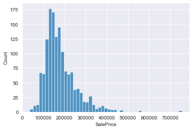
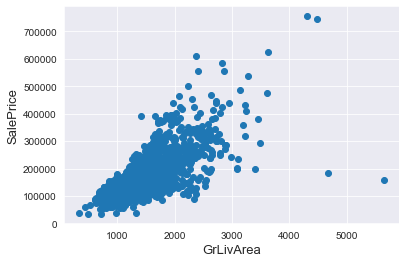
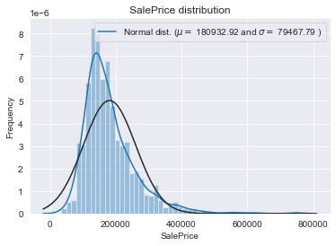
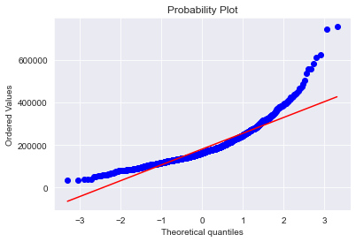
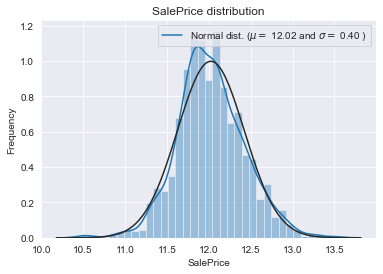
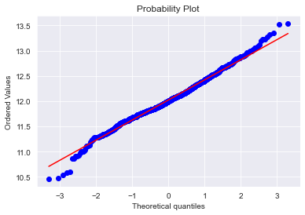
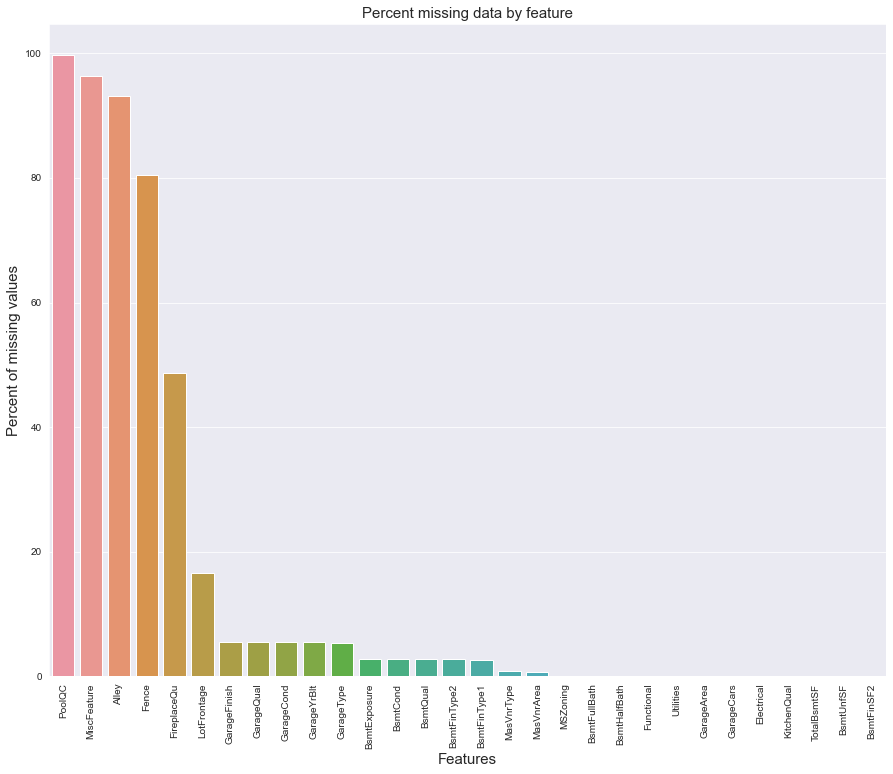
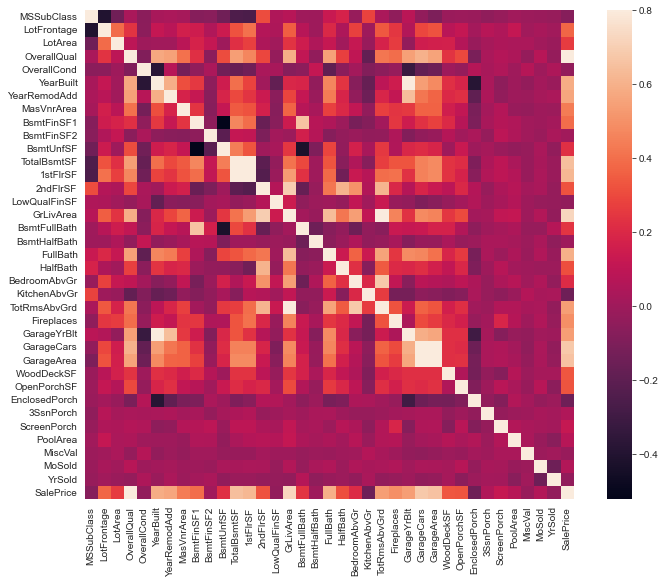
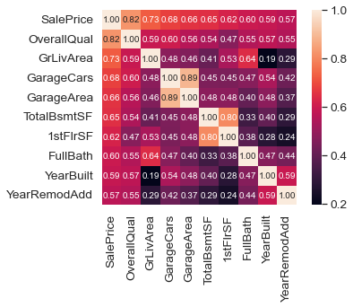

# House Prices - Advanced Regression Techniques

Ask a home buyer to describe their dream house, and they probably won't begin with the height of the basement ceiling or the proximity to an east-west railroad. But this playground competition's dataset proves that much more influences price negotiations than the number of bedrooms or a white-picket fence.
<br/> <br/>
With 79 explanatory variables describing (almost) every aspect of residential homes in Ames, Iowa, this competition challenges you to predict the final price of each home.

### _1. Problem Definition_
There is a Kaggle competition whose purpose of the challenge is to predict the price of houses. For each Id in the test set, you must predict the value of the SalePrice variable.
<br>
#### Metrics
Submissions are evaluated on Root-Mean-Squared-Error (RMSE) between the logarithm of the predicted value and the logarithm of the observed sales price. (Taking logs means that errors in predicting expensive houses and cheap houses will affect the result equally.)
##### Submission File Format
The file should contain a header and have the following format:
<blockquote>
Id,SalePrice<br/>
1461,169000.1<br/>
1462,187724.1233<br/>
1463,175221<br/>
etc.<br/>
</blockquote>


```python
#import some necessary librairies
import numpy as np # linear algebra
import pandas as pd # data processing, CSV file I/O (e.g. pd.read_csv)
#%matplotlib inline
import matplotlib.pyplot as plt  # Matlab-style plotting
import seaborn as sns
color = sns.color_palette()
sns.set_style('darkgrid')
import warnings
def ignore_warn(*args, **kwargs):
    pass
warnings.warn = ignore_warn #ignore annoying warning (from sklearn and seaborn)


from scipy import stats
from scipy.stats import norm, skew #for some statistics


pd.set_option('display.float_format', lambda x: '{:.3f}'.format(x)) #Limiting floats output to 3 decimal points
```

### _2. Collecting the data_


```python
df_train = pd.read_csv('data/train.csv', sep=',')
df_test = pd.read_csv('data/test.csv', sep=',')
```

### _3. Exploratory data analysis_


```python
display(df_train.head(5))
```


<div>

<table border="1" class="dataframe">
  <thead>
    <tr style="text-align: right;">
      <th></th>
      <th>Id</th>
      <th>MSSubClass</th>
      <th>MSZoning</th>
      <th>LotFrontage</th>
      <th>LotArea</th>
      <th>Street</th>
      <th>Alley</th>
      <th>LotShape</th>
      <th>LandContour</th>
      <th>Utilities</th>
      <th>...</th>
      <th>PoolArea</th>
      <th>PoolQC</th>
      <th>Fence</th>
      <th>MiscFeature</th>
      <th>MiscVal</th>
      <th>MoSold</th>
      <th>YrSold</th>
      <th>SaleType</th>
      <th>SaleCondition</th>
      <th>SalePrice</th>
    </tr>
  </thead>
  <tbody>
    <tr>
      <th>0</th>
      <td>1</td>
      <td>60</td>
      <td>RL</td>
      <td>65.000</td>
      <td>8450</td>
      <td>Pave</td>
      <td>NaN</td>
      <td>Reg</td>
      <td>Lvl</td>
      <td>AllPub</td>
      <td>...</td>
      <td>0</td>
      <td>NaN</td>
      <td>NaN</td>
      <td>NaN</td>
      <td>0</td>
      <td>2</td>
      <td>2008</td>
      <td>WD</td>
      <td>Normal</td>
      <td>208500</td>
    </tr>
    <tr>
      <th>1</th>
      <td>2</td>
      <td>20</td>
      <td>RL</td>
      <td>80.000</td>
      <td>9600</td>
      <td>Pave</td>
      <td>NaN</td>
      <td>Reg</td>
      <td>Lvl</td>
      <td>AllPub</td>
      <td>...</td>
      <td>0</td>
      <td>NaN</td>
      <td>NaN</td>
      <td>NaN</td>
      <td>0</td>
      <td>5</td>
      <td>2007</td>
      <td>WD</td>
      <td>Normal</td>
      <td>181500</td>
    </tr>
    <tr>
      <th>2</th>
      <td>3</td>
      <td>60</td>
      <td>RL</td>
      <td>68.000</td>
      <td>11250</td>
      <td>Pave</td>
      <td>NaN</td>
      <td>IR1</td>
      <td>Lvl</td>
      <td>AllPub</td>
      <td>...</td>
      <td>0</td>
      <td>NaN</td>
      <td>NaN</td>
      <td>NaN</td>
      <td>0</td>
      <td>9</td>
      <td>2008</td>
      <td>WD</td>
      <td>Normal</td>
      <td>223500</td>
    </tr>
    <tr>
      <th>3</th>
      <td>4</td>
      <td>70</td>
      <td>RL</td>
      <td>60.000</td>
      <td>9550</td>
      <td>Pave</td>
      <td>NaN</td>
      <td>IR1</td>
      <td>Lvl</td>
      <td>AllPub</td>
      <td>...</td>
      <td>0</td>
      <td>NaN</td>
      <td>NaN</td>
      <td>NaN</td>
      <td>0</td>
      <td>2</td>
      <td>2006</td>
      <td>WD</td>
      <td>Abnorml</td>
      <td>140000</td>
    </tr>
    <tr>
      <th>4</th>
      <td>5</td>
      <td>60</td>
      <td>RL</td>
      <td>84.000</td>
      <td>14260</td>
      <td>Pave</td>
      <td>NaN</td>
      <td>IR1</td>
      <td>Lvl</td>
      <td>AllPub</td>
      <td>...</td>
      <td>0</td>
      <td>NaN</td>
      <td>NaN</td>
      <td>NaN</td>
      <td>0</td>
      <td>12</td>
      <td>2008</td>
      <td>WD</td>
      <td>Normal</td>
      <td>250000</td>
    </tr>
  </tbody>
</table>
<p>5 rows × 81 columns</p>
</div>


```python
display(df_test.head(5))
```


<div>

<table border="1" class="dataframe">
  <thead>
    <tr style="text-align: right;">
      <th></th>
      <th>Id</th>
      <th>MSSubClass</th>
      <th>MSZoning</th>
      <th>LotFrontage</th>
      <th>LotArea</th>
      <th>Street</th>
      <th>Alley</th>
      <th>LotShape</th>
      <th>LandContour</th>
      <th>Utilities</th>
      <th>...</th>
      <th>ScreenPorch</th>
      <th>PoolArea</th>
      <th>PoolQC</th>
      <th>Fence</th>
      <th>MiscFeature</th>
      <th>MiscVal</th>
      <th>MoSold</th>
      <th>YrSold</th>
      <th>SaleType</th>
      <th>SaleCondition</th>
    </tr>
  </thead>
  <tbody>
    <tr>
      <th>0</th>
      <td>1461</td>
      <td>20</td>
      <td>RH</td>
      <td>80.000</td>
      <td>11622</td>
      <td>Pave</td>
      <td>NaN</td>
      <td>Reg</td>
      <td>Lvl</td>
      <td>AllPub</td>
      <td>...</td>
      <td>120</td>
      <td>0</td>
      <td>NaN</td>
      <td>MnPrv</td>
      <td>NaN</td>
      <td>0</td>
      <td>6</td>
      <td>2010</td>
      <td>WD</td>
      <td>Normal</td>
    </tr>
    <tr>
      <th>1</th>
      <td>1462</td>
      <td>20</td>
      <td>RL</td>
      <td>81.000</td>
      <td>14267</td>
      <td>Pave</td>
      <td>NaN</td>
      <td>IR1</td>
      <td>Lvl</td>
      <td>AllPub</td>
      <td>...</td>
      <td>0</td>
      <td>0</td>
      <td>NaN</td>
      <td>NaN</td>
      <td>Gar2</td>
      <td>12500</td>
      <td>6</td>
      <td>2010</td>
      <td>WD</td>
      <td>Normal</td>
    </tr>
    <tr>
      <th>2</th>
      <td>1463</td>
      <td>60</td>
      <td>RL</td>
      <td>74.000</td>
      <td>13830</td>
      <td>Pave</td>
      <td>NaN</td>
      <td>IR1</td>
      <td>Lvl</td>
      <td>AllPub</td>
      <td>...</td>
      <td>0</td>
      <td>0</td>
      <td>NaN</td>
      <td>MnPrv</td>
      <td>NaN</td>
      <td>0</td>
      <td>3</td>
      <td>2010</td>
      <td>WD</td>
      <td>Normal</td>
    </tr>
    <tr>
      <th>3</th>
      <td>1464</td>
      <td>60</td>
      <td>RL</td>
      <td>78.000</td>
      <td>9978</td>
      <td>Pave</td>
      <td>NaN</td>
      <td>IR1</td>
      <td>Lvl</td>
      <td>AllPub</td>
      <td>...</td>
      <td>0</td>
      <td>0</td>
      <td>NaN</td>
      <td>NaN</td>
      <td>NaN</td>
      <td>0</td>
      <td>6</td>
      <td>2010</td>
      <td>WD</td>
      <td>Normal</td>
    </tr>
    <tr>
      <th>4</th>
      <td>1465</td>
      <td>120</td>
      <td>RL</td>
      <td>43.000</td>
      <td>5005</td>
      <td>Pave</td>
      <td>NaN</td>
      <td>IR1</td>
      <td>HLS</td>
      <td>AllPub</td>
      <td>...</td>
      <td>144</td>
      <td>0</td>
      <td>NaN</td>
      <td>NaN</td>
      <td>NaN</td>
      <td>0</td>
      <td>1</td>
      <td>2010</td>
      <td>WD</td>
      <td>Normal</td>
    </tr>
  </tbody>
</table>
<p>5 rows × 80 columns</p>
</div>


```python
#Save the 'Id' column
train_ID = df_train['Id']
test_ID = df_test['Id']

#Now drop the  'Id' colum since it's unnecessary for  the prediction process.
df_train.drop("Id", axis = 1, inplace = True)
df_test.drop("Id", axis = 1, inplace = True)
```


```python
list_columns = df_train.columns
```


```python
list_columns
```


    Index(['MSSubClass', 'MSZoning', 'LotFrontage', 'LotArea', 'Street', 'Alley',
           'LotShape', 'LandContour', 'Utilities', 'LotConfig', 'LandSlope',
           'Neighborhood', 'Condition1', 'Condition2', 'BldgType', 'HouseStyle',
           'OverallQual', 'OverallCond', 'YearBuilt', 'YearRemodAdd', 'RoofStyle',
           'RoofMatl', 'Exterior1st', 'Exterior2nd', 'MasVnrType', 'MasVnrArea',
           'ExterQual', 'ExterCond', 'Foundation', 'BsmtQual', 'BsmtCond',
           'BsmtExposure', 'BsmtFinType1', 'BsmtFinSF1', 'BsmtFinType2',
           'BsmtFinSF2', 'BsmtUnfSF', 'TotalBsmtSF', 'Heating', 'HeatingQC',
           'CentralAir', 'Electrical', '1stFlrSF', '2ndFlrSF', 'LowQualFinSF',
           'GrLivArea', 'BsmtFullBath', 'BsmtHalfBath', 'FullBath', 'HalfBath',
           'BedroomAbvGr', 'KitchenAbvGr', 'KitchenQual', 'TotRmsAbvGrd',
           'Functional', 'Fireplaces', 'FireplaceQu', 'GarageType', 'GarageYrBlt',
           'GarageFinish', 'GarageCars', 'GarageArea', 'GarageQual', 'GarageCond',
           'PavedDrive', 'WoodDeckSF', 'OpenPorchSF', 'EnclosedPorch', '3SsnPorch',
           'ScreenPorch', 'PoolArea', 'PoolQC', 'Fence', 'MiscFeature', 'MiscVal',
           'MoSold', 'YrSold', 'SaleType', 'SaleCondition', 'SalePrice'],
          dtype='object')


```python
for column in list_columns:
    _len = df_train[column].isnull().sum()
    if _len > 0:
        print('Column: {}, Lenght {}'.format(column, _len))
```

    Column: LotFrontage, Lenght 259
    Column: Alley, Lenght 1369
    Column: MasVnrType, Lenght 8
    Column: MasVnrArea, Lenght 8
    Column: BsmtQual, Lenght 37
    Column: BsmtCond, Lenght 37
    Column: BsmtExposure, Lenght 38
    Column: BsmtFinType1, Lenght 37
    Column: BsmtFinType2, Lenght 38
    Column: Electrical, Lenght 1
    Column: FireplaceQu, Lenght 690
    Column: GarageType, Lenght 81
    Column: GarageYrBlt, Lenght 81
    Column: GarageFinish, Lenght 81
    Column: GarageQual, Lenght 81
    Column: GarageCond, Lenght 81
    Column: PoolQC, Lenght 1453
    Column: Fence, Lenght 1179
    Column: MiscFeature, Lenght 1406
    


```python
df_train.shape, df_test.shape
```


    ((1460, 80), (1459, 79))


```python
df_train['SalePrice'].describe()
```


    count     1460.000
    mean    180921.196
    std      79442.503
    min      34900.000
    25%     129975.000
    50%     163000.000
    75%     214000.000
    max     755000.000
    Name: SalePrice, dtype: float64


```python
sns.histplot(df_train['SalePrice'])
```


    <AxesSubplot:xlabel='SalePrice', ylabel='Count'>


    

    


>Skewness
> * In probability theory and statistics, skewness is a measure of the asymmetry of the probability distribution of a real-valued random variable about its mean. The skewness value can be positive, zero, negative, or undefined.
> * If v>0, then the distribution has a heavier right tail (values above the mean)
> * If v<0, then the distribution has a heavier left tail (values below the mean)
> * If v=0, then the distribution is approximately symmetrical (at the third power of the deviation from the mean).


```python
#skewness and kurtosis
print("Skewness: %f" % df_train['SalePrice'].skew())
```

    Skewness: 1.882876
    

> Kurtosis
> * In probability theory and statistics, kurtosis is a measure of the "tailedness" of the probability distribution of a real-valued random variable. Like skewness, kurtosis describes the shape of a probability distribution and there are different ways of quantifying it for a theoretical distribution and corresponding ways of estimating it from a sample from a population. Different measures of kurtosis may have different interpretations.


```python
print("Kurtosis: %f" % df_train['SalePrice'].kurt())
```

    Kurtosis: 6.536282
    

### 4. Data Processing


```python
fig, ax = plt.subplots()
ax.scatter(x = df_train['GrLivArea'], y = df_train['SalePrice'])
plt.ylabel('SalePrice', fontsize=13)
plt.xlabel('GrLivArea', fontsize=13)
plt.show()
```


    

    


We can see at the bottom right two with extremely large GrLivArea that are of a low price. These values are huge oultliers. Therefore, we can safely delete them.


```python
#Deleting outliers
df_train = df_train.drop(df_train[(df_train['GrLivArea']>4000) & (df_train['SalePrice']<300000)].index)

#Check the graphic again
fig, ax = plt.subplots()
ax.scatter(df_train['GrLivArea'], df_train['SalePrice'])
plt.ylabel('SalePrice', fontsize=13)
plt.xlabel('GrLivArea', fontsize=13)
plt.show()
```


    

    


**Note :**<br/>
Outliers removal is note always safe. We decided to delete these two as they are very huge and really bad ( extremely large areas for very low prices).

There are probably others outliers in the training data. However, removing all them may affect badly our models if ever there were also outliers in the test data. That's why , instead of removing them all, we will just manage to make some of our models robust on them. You can refer to the modelling part of this notebook for that.

**Target Variable**<br/>
*SalePrice* is the variable we need to predict. So let's do some analysis on this variable first.


```python
sns.distplot(df_train['SalePrice'] , fit=norm);

# Get the fitted parameters used by the function
(mu, sigma) = norm.fit(df_train['SalePrice'])
print( '\n mu = {:.2f} and sigma = {:.2f}\n'.format(mu, sigma))

#Now plot the distribution
plt.legend(['Normal dist. ($\mu=$ {:.2f} and $\sigma=$ {:.2f} )'.format(mu, sigma)],
            loc='best')
plt.ylabel('Frequency')
plt.title('SalePrice distribution')

#Get also the QQ-plot
fig = plt.figure()
res = stats.probplot(df_train['SalePrice'], plot=plt)
plt.show()
```

    
     mu = 180932.92 and sigma = 79467.79
    
    


    

    


    

    


The target variable is right skewed. As (linear) models love normally distributed data , we need to transform this variable and make it more normally distributed.

**Log-transformation of the target variable**


```python
#We use the numpy fuction log1p which  applies log(1+x) to all elements of the column
df_train["SalePrice"] = np.log1p(df_train["SalePrice"])

#Check the new distribution 
sns.distplot(df_train['SalePrice'] , fit=norm);

# Get the fitted parameters used by the function
(mu, sigma) = norm.fit(df_train['SalePrice'])
print( '\n mu = {:.2f} and sigma = {:.2f}\n'.format(mu, sigma))

#Now plot the distribution
plt.legend(['Normal dist. ($\mu=$ {:.2f} and $\sigma=$ {:.2f} )'.format(mu, sigma)],
            loc='best')
plt.ylabel('Frequency')
plt.title('SalePrice distribution')

#Get also the QQ-plot
fig = plt.figure()
res = stats.probplot(df_train['SalePrice'], plot=plt)
plt.show()
```

    
     mu = 12.02 and sigma = 0.40
    
    


    

    


    

    


The skew seems now corrected and the data appears more normally distributed.

### 5. Features engineering


```python
ntrain = df_train.shape[0]
ntest = df_test.shape[0]
y_train = df_train.SalePrice.values
all_data = pd.concat((df_train, df_test)).reset_index(drop=True)
all_data.drop(['SalePrice'], axis=1, inplace=True)
print("all_data size is : {}".format(all_data.shape))
```

    all_data size is : (2917, 79)
    

**Missing Data**


```python
all_data_na = (all_data.isnull().sum() / len(all_data)) * 100
all_data_na = all_data_na.drop(all_data_na[all_data_na == 0].index).sort_values(ascending=False)[:30]
missing_data = pd.DataFrame({'Missing Ratio' :all_data_na})
missing_data.head(20)
```


<div>

<table border="1" class="dataframe">
  <thead>
    <tr style="text-align: right;">
      <th></th>
      <th>Missing Ratio</th>
    </tr>
  </thead>
  <tbody>
    <tr>
      <th>PoolQC</th>
      <td>99.691</td>
    </tr>
    <tr>
      <th>MiscFeature</th>
      <td>96.400</td>
    </tr>
    <tr>
      <th>Alley</th>
      <td>93.212</td>
    </tr>
    <tr>
      <th>Fence</th>
      <td>80.425</td>
    </tr>
    <tr>
      <th>FireplaceQu</th>
      <td>48.680</td>
    </tr>
    <tr>
      <th>LotFrontage</th>
      <td>16.661</td>
    </tr>
    <tr>
      <th>GarageFinish</th>
      <td>5.451</td>
    </tr>
    <tr>
      <th>GarageQual</th>
      <td>5.451</td>
    </tr>
    <tr>
      <th>GarageCond</th>
      <td>5.451</td>
    </tr>
    <tr>
      <th>GarageYrBlt</th>
      <td>5.451</td>
    </tr>
    <tr>
      <th>GarageType</th>
      <td>5.382</td>
    </tr>
    <tr>
      <th>BsmtExposure</th>
      <td>2.811</td>
    </tr>
    <tr>
      <th>BsmtCond</th>
      <td>2.811</td>
    </tr>
    <tr>
      <th>BsmtQual</th>
      <td>2.777</td>
    </tr>
    <tr>
      <th>BsmtFinType2</th>
      <td>2.743</td>
    </tr>
    <tr>
      <th>BsmtFinType1</th>
      <td>2.708</td>
    </tr>
    <tr>
      <th>MasVnrType</th>
      <td>0.823</td>
    </tr>
    <tr>
      <th>MasVnrArea</th>
      <td>0.788</td>
    </tr>
    <tr>
      <th>MSZoning</th>
      <td>0.137</td>
    </tr>
    <tr>
      <th>BsmtFullBath</th>
      <td>0.069</td>
    </tr>
  </tbody>
</table>
</div>


```python
f, ax = plt.subplots(figsize=(15, 12))
plt.xticks(rotation='90')
sns.barplot(x=all_data_na.index, y=all_data_na)
plt.xlabel('Features', fontsize=15)
plt.ylabel('Percent of missing values', fontsize=15)
plt.title('Percent missing data by feature', fontsize=15)
```


    Text(0.5, 1.0, 'Percent missing data by feature')


    

    


#### _Correlation matrix (heatmap style)_

Now I'm going to use a more automated method to find the correlations and analyze to see if they match the correlations found manually.


```python
#correlation matrix
corrmat = df_train.corr()
f, ax = plt.subplots(figsize=(12, 9))
sns.heatmap(corrmat, vmax=.8, square=True);
```


    

    


```python
#saleprice correlation matrix
k = 10 #number of variables for heatmap
cols = corrmat.nlargest(k, 'SalePrice')['SalePrice'].index
cm = np.corrcoef(df_train[cols].values.T)
sns.set(font_scale=1.25)
hm = sns.heatmap(cm, cbar=True, annot=True, square=True, fmt='.2f', annot_kws={'size': 10}, yticklabels=cols.values, xticklabels=cols.values)
plt.show()
```


    

    


**Imputing missing values**<br/>
We impute them by proceeding sequentially through features with missing values

* **PoolQC** : data description says NA means "No Pool". That make sense, given the huge ratio of missing value (+99%) and majority of houses have no Pool at all in general.


```python
all_data["PoolQC"] = all_data["PoolQC"].fillna("None")
```

* **MiscFeature** : data description says NA means "no misc feature"


```python
all_data["MiscFeature"] = all_data["MiscFeature"].fillna("None")
```

* **Alley** : data description says NA means "no alley access"


```python
all_data["Alley"] = all_data["Alley"].fillna("None")
```

* **Fence** : data description says NA means "no fence"


```python
all_data["Fence"] = all_data["Fence"].fillna("None")
```

* **FireplaceQu** : data description says NA means "no fireplace"


```python
all_data["FireplaceQu"] = all_data["FireplaceQu"].fillna("None")
```

* **LotFrontage** : Since the area of each street connected to the house property most likely have a similar area to other houses in its neighborhood , we can fill in missing values by the median LotFrontage of the neighborhood.


```python
#Group by neighborhood and fill in missing value by the median LotFrontage of all the neighborhood
all_data["LotFrontage"] = all_data.groupby("Neighborhood")["LotFrontage"].transform(
    lambda x: x.fillna(x.median()))
```

* **GarageType, GarageFinish, GarageQual and GarageCond** : Replacing missing data with None


```python
for col in ('GarageType', 'GarageFinish', 'GarageQual', 'GarageCond'):
    all_data[col] = all_data[col].fillna('None')
```

* **GarageYrBlt, GarageArea and GarageCars** : Replacing missing data with 0 (Since No garage = no cars in such garage.)


```python
for col in ('GarageYrBlt', 'GarageArea', 'GarageCars'):
    all_data[col] = all_data[col].fillna(0)
```

* **BsmtFinSF1, BsmtFinSF2, BsmtUnfSF, TotalBsmtSF, BsmtFullBath and BsmtHalfBath** : missing values are likely zero for having no basement


```python
for col in ('BsmtFinSF1', 'BsmtFinSF2', 'BsmtUnfSF','TotalBsmtSF', 'BsmtFullBath', 'BsmtHalfBath'):
    all_data[col] = all_data[col].fillna(0)
```

* **BsmtQual, BsmtCond, BsmtExposure, BsmtFinType1 and BsmtFinType2** : For all these categorical basement-related features, NaN means that there is no basement.


```python
for col in ('BsmtQual', 'BsmtCond', 'BsmtExposure', 'BsmtFinType1', 'BsmtFinType2'):
    all_data[col] = all_data[col].fillna('None')
```

* **MasVnrArea and MasVnrType** : NA most likely means no masonry veneer for these houses. We can fill 0 for the area and None for the type.


```python
all_data["MasVnrType"] = all_data["MasVnrType"].fillna("None")
all_data["MasVnrArea"] = all_data["MasVnrArea"].fillna(0)
```

* **MSZoning (The general zoning classification)** : 'RL' is by far the most common value. So we can fill in missing values with 'RL'


```python
all_data['MSZoning'] = all_data['MSZoning'].fillna(all_data['MSZoning'].mode()[0])
```

* **Utilities** : For this categorical feature all records are "AllPub", except for one "NoSeWa" and 2 NA . Since the house with 'NoSewa' is in the training set, **this feature won't help in predictive modelling**. We can then safely remove it.


```python
all_data = all_data.drop(['Utilities'], axis=1)
```

* **Functional** : data description says NA means typical


```python
all_data["Functional"] = all_data["Functional"].fillna("Typ")
```

* **Electrical** : It has one NA value. Since this feature has mostly 'SBrkr', we can set that for the missing value.


```python
all_data['Electrical'] = all_data['Electrical'].fillna(all_data['Electrical'].mode()[0])
```

* **KitchenQual**: Only one NA value, and same as Electrical, we set 'TA' (which is the most frequent) for the missing value in KitchenQual.


```python
all_data['KitchenQual'] = all_data['KitchenQual'].fillna(all_data['KitchenQual'].mode()[0])
```

* **Exterior1st and Exterior2nd** : Again Both Exterior 1 & 2 have only one missing value. We will just substitute in the most common string


```python
all_data['Exterior1st'] = all_data['Exterior1st'].fillna(all_data['Exterior1st'].mode()[0])
all_data['Exterior2nd'] = all_data['Exterior2nd'].fillna(all_data['Exterior2nd'].mode()[0])
```

* **SaleType** : Fill in again with most frequent which is "WD"


```python
all_data['SaleType'] = all_data['SaleType'].fillna(all_data['SaleType'].mode()[0])
```

* **MSSubClass** : Na most likely means No building class. We can replace missing values with None


```python
all_data['MSSubClass'] = all_data['MSSubClass'].fillna("None")
```

Is there any remaining missing value ?


```python
#Check remaining missing values if any 
all_data_na = (all_data.isnull().sum() / len(all_data)) * 100
all_data_na = all_data_na.drop(all_data_na[all_data_na == 0].index).sort_values(ascending=False)
missing_data = pd.DataFrame({'Missing Ratio' :all_data_na})
missing_data.head()
```


<div>

<table border="1" class="dataframe">
  <thead>
    <tr style="text-align: right;">
      <th></th>
      <th>Missing Ratio</th>
    </tr>
  </thead>
  <tbody>
  </tbody>
</table>
</div>


*It remains no missing value*

**More features engeneering**<br/>
Transforming some numerical variables that are really categorical


```python
#MSSubClass=The building class
all_data['MSSubClass'] = all_data['MSSubClass'].apply(str)


#Changing OverallCond into a categorical variable
all_data['OverallCond'] = all_data['OverallCond'].astype(str)


#Year and month sold are transformed into categorical features.
all_data['YrSold'] = all_data['YrSold'].astype(str)
all_data['MoSold'] = all_data['MoSold'].astype(str)
```

**Label Encoding some categorical variables that may contain information in their ordering set**


```python
from sklearn.preprocessing import LabelEncoder
cols = ('FireplaceQu', 'BsmtQual', 'BsmtCond', 'GarageQual', 'GarageCond', 
        'ExterQual', 'ExterCond','HeatingQC', 'PoolQC', 'KitchenQual', 'BsmtFinType1', 
        'BsmtFinType2', 'Functional', 'Fence', 'BsmtExposure', 'GarageFinish', 'LandSlope',
        'LotShape', 'PavedDrive', 'Street', 'Alley', 'CentralAir', 'MSSubClass', 'OverallCond', 
        'YrSold', 'MoSold')
# process columns, apply LabelEncoder to categorical features
for c in cols:
    lbl = LabelEncoder() 
    lbl.fit(list(all_data[c].values)) 
    all_data[c] = lbl.transform(list(all_data[c].values))

# shape        
print('Shape all_data: {}'.format(all_data.shape))
```

    Shape all_data: (2917, 78)
    

**Adding one more important feature**<br/>
Since area related features are very important to determine house prices, we add one more feature which is the total area of basement, first and second floor areas of each house


```python
# Adding total sqfootage feature 
all_data['TotalSF'] = all_data['TotalBsmtSF'] + all_data['1stFlrSF'] + all_data['2ndFlrSF']
```

**Skewed features**


```python
numeric_feats = all_data.dtypes[all_data.dtypes != "object"].index

# Check the skew of all numerical features
skewed_feats = all_data[numeric_feats].apply(lambda x: skew(x.dropna())).sort_values(ascending=False)
print("\nSkew in numerical features: \n")
skewness = pd.DataFrame({'Skew' :skewed_feats})
skewness.head(10)
```

    
    Skew in numerical features: 
    
    


<div>

<table border="1" class="dataframe">
  <thead>
    <tr style="text-align: right;">
      <th></th>
      <th>Skew</th>
    </tr>
  </thead>
  <tbody>
    <tr>
      <th>MiscVal</th>
      <td>21.940</td>
    </tr>
    <tr>
      <th>PoolArea</th>
      <td>17.689</td>
    </tr>
    <tr>
      <th>LotArea</th>
      <td>13.109</td>
    </tr>
    <tr>
      <th>LowQualFinSF</th>
      <td>12.085</td>
    </tr>
    <tr>
      <th>3SsnPorch</th>
      <td>11.372</td>
    </tr>
    <tr>
      <th>LandSlope</th>
      <td>4.973</td>
    </tr>
    <tr>
      <th>KitchenAbvGr</th>
      <td>4.301</td>
    </tr>
    <tr>
      <th>BsmtFinSF2</th>
      <td>4.145</td>
    </tr>
    <tr>
      <th>EnclosedPorch</th>
      <td>4.002</td>
    </tr>
    <tr>
      <th>ScreenPorch</th>
      <td>3.945</td>
    </tr>
  </tbody>
</table>
</div>


**Box Cox Transformation of (highly) skewed features**<br/>
We use the scipy function boxcox1p which computes the Box-Cox transformation of  1+x . <br/>

Note that setting  λ=0  is equivalent to log1p used above for the target variable. <br/>

See this page for more details on Box Cox Transformation as well as the scipy function's page. <br/>


```python
skewness = skewness[abs(skewness) > 0.75]
print("There are {} skewed numerical features to Box Cox transform".format(skewness.shape[0]))

from scipy.special import boxcox1p
skewed_features = skewness.index
lam = 0.15
for feat in skewed_features:
    #all_data[feat] += 1
    all_data[feat] = boxcox1p(all_data[feat], lam)
    
#all_data[skewed_features] = np.log1p(all_data[skewed_features])
```

    There are 59 skewed numerical features to Box Cox transform
    

**Getting dummy categorical features**


```python
all_data = pd.get_dummies(all_data)
print(all_data.shape)
```

    (2917, 220)
    

**Getting the new train and test sets.**


```python
train = all_data[:ntrain]
test = all_data[ntrain:]
```

### 6. Modelling

Import librairies


```python
from sklearn.linear_model import ElasticNet, Lasso,  BayesianRidge, LassoLarsIC
from sklearn.ensemble import RandomForestRegressor,  GradientBoostingRegressor
from sklearn.kernel_ridge import KernelRidge
from sklearn.pipeline import make_pipeline
from sklearn.preprocessing import RobustScaler
from sklearn.base import BaseEstimator, TransformerMixin, RegressorMixin, clone
from sklearn.model_selection import KFold, cross_val_score, train_test_split
from sklearn.metrics import mean_squared_error
import xgboost as xgb
import lightgbm as lgb
```

**Define a cross validation strategy**

We use the cross_val_score function of Sklearn. However this function has not a shuffle attribut, we add then one line of code, in order to shuffle the dataset prior to cross-validation


```python
#Validation function
n_folds = 5

def rmsle_cv(model):
    kf = KFold(n_folds, shuffle=True, random_state=42).get_n_splits(train.values)
    rmse= np.sqrt(-cross_val_score(model, train.values, y_train, scoring="neg_mean_squared_error", cv = kf))
    return(rmse)
```

**Base models**

* **LASSO Regression** :
This model may be very sensitive to outliers. So we need to made it more robust on them. For that we use the sklearn's **Robustscaler()** method on pipeline


```python
lasso = make_pipeline(RobustScaler(), Lasso(alpha =0.0005, random_state=1))
```

* **Elastic Net Regression** :
again made robust to outliers


```python
ENet = make_pipeline(RobustScaler(), ElasticNet(alpha=0.0005, l1_ratio=.9, random_state=3))
```

* **Kernel Ridge Regression** :


```python
KRR = KernelRidge(alpha=0.6, kernel='polynomial', degree=2, coef0=2.5)
```

* **Gradient Boosting Regression** :
With huber loss that makes it robust to outliers


```python
GBoost = GradientBoostingRegressor(n_estimators=3000, learning_rate=0.05,
                                   max_depth=4, max_features='sqrt',
                                   min_samples_leaf=15, min_samples_split=10, 
                                   loss='huber', random_state =5)
```

* **XGBoost:**


```python
model_xgb = xgb.XGBRegressor(colsample_bytree=0.4603, gamma=0.0468, 
                             learning_rate=0.05, max_depth=3, 
                             min_child_weight=1.7817, n_estimators=2200,
                             reg_alpha=0.4640, reg_lambda=0.8571,
                             subsample=0.5213, silent=1,
                             random_state =7, nthread = -1)
```

* **LightGBM:** 


```python
model_lgb = lgb.LGBMRegressor(objective='regression',num_leaves=5,
                              learning_rate=0.05, n_estimators=720,
                              max_bin = 55, bagging_fraction = 0.8,
                              bagging_freq = 5, feature_fraction = 0.2319,
                              feature_fraction_seed=9, bagging_seed=9,
                              min_data_in_leaf =6, min_sum_hessian_in_leaf = 11)
```

**Base models scores:**<br/>
Let's see how these base models perform on the data by evaluating the cross-validation rmsle error


```python
score = rmsle_cv(lasso)
print("\nLasso score: {:.4f} ({:.4f})\n".format(score.mean(), score.std()))
```

    
    Lasso score: 0.1115 (0.0074)
    
    


```python
score = rmsle_cv(ENet)
print("ElasticNet score: {:.4f} ({:.4f})\n".format(score.mean(), score.std()))
```

    ElasticNet score: 0.1116 (0.0074)
    
    


```python
score = rmsle_cv(KRR)
print("Kernel Ridge score: {:.4f} ({:.4f})\n".format(score.mean(), score.std()))
```

    Kernel Ridge score: 0.1153 (0.0075)
    
    


```python
score = rmsle_cv(GBoost)
print("Gradient Boosting score: {:.4f} ({:.4f})\n".format(score.mean(), score.std()))
```

    Gradient Boosting score: 0.1167 (0.0083)
    
    


```python
score = rmsle_cv(model_xgb)
print("Xgboost score: {:.4f} ({:.4f})\n".format(score.mean(), score.std()))
```

    [15:39:30] WARNING: C:/Users/Administrator/workspace/xgboost-win64_release_1.5.1/src/learner.cc:576: 
    Parameters: { "silent" } might not be used.
    
      This could be a false alarm, with some parameters getting used by language bindings but
      then being mistakenly passed down to XGBoost core, or some parameter actually being used
      but getting flagged wrongly here. Please open an issue if you find any such cases.
    
    
    [15:39:34] WARNING: C:/Users/Administrator/workspace/xgboost-win64_release_1.5.1/src/learner.cc:576: 
    Parameters: { "silent" } might not be used.
    
      This could be a false alarm, with some parameters getting used by language bindings but
      then being mistakenly passed down to XGBoost core, or some parameter actually being used
      but getting flagged wrongly here. Please open an issue if you find any such cases.
    
    
    [15:39:38] WARNING: C:/Users/Administrator/workspace/xgboost-win64_release_1.5.1/src/learner.cc:576: 
    Parameters: { "silent" } might not be used.
    
      This could be a false alarm, with some parameters getting used by language bindings but
      then being mistakenly passed down to XGBoost core, or some parameter actually being used
      but getting flagged wrongly here. Please open an issue if you find any such cases.
    
    
    [15:39:41] WARNING: C:/Users/Administrator/workspace/xgboost-win64_release_1.5.1/src/learner.cc:576: 
    Parameters: { "silent" } might not be used.
    
      This could be a false alarm, with some parameters getting used by language bindings but
      then being mistakenly passed down to XGBoost core, or some parameter actually being used
      but getting flagged wrongly here. Please open an issue if you find any such cases.
    
    
    [15:39:45] WARNING: C:/Users/Administrator/workspace/xgboost-win64_release_1.5.1/src/learner.cc:576: 
    Parameters: { "silent" } might not be used.
    
      This could be a false alarm, with some parameters getting used by language bindings but
      then being mistakenly passed down to XGBoost core, or some parameter actually being used
      but getting flagged wrongly here. Please open an issue if you find any such cases.
    
    
    Xgboost score: 0.1164 (0.0070)
    
    


```python
score = rmsle_cv(model_lgb)
print("LGBM score: {:.4f} ({:.4f})\n" .format(score.mean(), score.std()))
```

    [LightGBM] [Warning] feature_fraction is set=0.2319, colsample_bytree=1.0 will be ignored. Current value: feature_fraction=0.2319
    [LightGBM] [Warning] min_data_in_leaf is set=6, min_child_samples=20 will be ignored. Current value: min_data_in_leaf=6
    [LightGBM] [Warning] min_sum_hessian_in_leaf is set=11, min_child_weight=0.001 will be ignored. Current value: min_sum_hessian_in_leaf=11
    [LightGBM] [Warning] bagging_fraction is set=0.8, subsample=1.0 will be ignored. Current value: bagging_fraction=0.8
    [LightGBM] [Warning] bagging_freq is set=5, subsample_freq=0 will be ignored. Current value: bagging_freq=5
    [LightGBM] [Warning] feature_fraction is set=0.2319, colsample_bytree=1.0 will be ignored. Current value: feature_fraction=0.2319
    [LightGBM] [Warning] min_data_in_leaf is set=6, min_child_samples=20 will be ignored. Current value: min_data_in_leaf=6
    [LightGBM] [Warning] min_sum_hessian_in_leaf is set=11, min_child_weight=0.001 will be ignored. Current value: min_sum_hessian_in_leaf=11
    [LightGBM] [Warning] bagging_fraction is set=0.8, subsample=1.0 will be ignored. Current value: bagging_fraction=0.8
    [LightGBM] [Warning] bagging_freq is set=5, subsample_freq=0 will be ignored. Current value: bagging_freq=5
    [LightGBM] [Warning] feature_fraction is set=0.2319, colsample_bytree=1.0 will be ignored. Current value: feature_fraction=0.2319
    [LightGBM] [Warning] min_data_in_leaf is set=6, min_child_samples=20 will be ignored. Current value: min_data_in_leaf=6
    [LightGBM] [Warning] min_sum_hessian_in_leaf is set=11, min_child_weight=0.001 will be ignored. Current value: min_sum_hessian_in_leaf=11
    [LightGBM] [Warning] bagging_fraction is set=0.8, subsample=1.0 will be ignored. Current value: bagging_fraction=0.8
    [LightGBM] [Warning] bagging_freq is set=5, subsample_freq=0 will be ignored. Current value: bagging_freq=5
    [LightGBM] [Warning] feature_fraction is set=0.2319, colsample_bytree=1.0 will be ignored. Current value: feature_fraction=0.2319
    [LightGBM] [Warning] min_data_in_leaf is set=6, min_child_samples=20 will be ignored. Current value: min_data_in_leaf=6
    [LightGBM] [Warning] min_sum_hessian_in_leaf is set=11, min_child_weight=0.001 will be ignored. Current value: min_sum_hessian_in_leaf=11
    [LightGBM] [Warning] bagging_fraction is set=0.8, subsample=1.0 will be ignored. Current value: bagging_fraction=0.8
    [LightGBM] [Warning] bagging_freq is set=5, subsample_freq=0 will be ignored. Current value: bagging_freq=5
    [LightGBM] [Warning] feature_fraction is set=0.2319, colsample_bytree=1.0 will be ignored. Current value: feature_fraction=0.2319
    [LightGBM] [Warning] min_data_in_leaf is set=6, min_child_samples=20 will be ignored. Current value: min_data_in_leaf=6
    [LightGBM] [Warning] min_sum_hessian_in_leaf is set=11, min_child_weight=0.001 will be ignored. Current value: min_sum_hessian_in_leaf=11
    [LightGBM] [Warning] bagging_fraction is set=0.8, subsample=1.0 will be ignored. Current value: bagging_fraction=0.8
    [LightGBM] [Warning] bagging_freq is set=5, subsample_freq=0 will be ignored. Current value: bagging_freq=5
    LGBM score: 0.1167 (0.0059)
    
    

#### Stacking models

**Simplest Stacking approach** : Averaging base models <br/>
We begin with this simple approach of averaging base models. We build a new class to extend scikit-learn with our model and also to laverage encapsulation and code reuse (inheritance)

* **Averaged base models class:**


```python
class AveragingModels(BaseEstimator, RegressorMixin, TransformerMixin):
    def __init__(self, models):
        self.models = models
        
    # we define clones of the original models to fit the data in
    def fit(self, X, y):
        self.models_ = [clone(x) for x in self.models]
        
        # Train cloned base models
        for model in self.models_:
            model.fit(X, y)

        return self
    
    #Now we do the predictions for cloned models and average them
    def predict(self, X):
        predictions = np.column_stack([
            model.predict(X) for model in self.models_
        ])
        return np.mean(predictions, axis=1)
```

**Averaged base models score:**

We just average four models here **ENet**, **GBoost**, **KRR** and **lasso**. Of course we could easily add more models in the mix.


```python
averaged_models = AveragingModels(models = (ENet, GBoost, KRR, lasso))

score = rmsle_cv(averaged_models)
print(" Averaged base models score: {:.4f} ({:.4f})\n".format(score.mean(), score.std()))
```

     Averaged base models score: 0.1087 (0.0077)
    
    

It seems even the simplest stacking approach really improve the score . This encourages us to go further and explore a less simple stacking approch.

**Less simple Stacking : Adding a Meta-model**<br/>
In this approach, we add a meta-model on averaged base models and use the out-of-folds predictions of these base models to train our meta-model.

The procedure, for the training part, may be described as follows:

1. Split the total training set into two disjoint sets (here train and .holdout )

2. Train several base models on the first part (train)

3. Test these base models on the second part (holdout)

4. Use the predictions from 3) (called out-of-folds predictions) as the inputs, and the correct responses (target variable) as the outputs to train a higher level learner called meta-model.

The first three steps are done iteratively . If we take for example a 5-fold stacking , we first split the training data into 5 folds. Then we will do 5 iterations. In each iteration, we train every base model on 4 folds and predict on the remaining fold (holdout fold).

So, we will be sure, after 5 iterations , that the entire data is used to get out-of-folds predictions that we will then use as new feature to train our meta-model in the step 4.

For the prediction part , We average the predictions of all base models on the test data and used them as meta-features on which, the final prediction is done with the meta-model.

**Stacking averaged Models Class**


```python
class StackingAveragedModels(BaseEstimator, RegressorMixin, TransformerMixin):
    def __init__(self, base_models, meta_model, n_folds=5):
        self.base_models = base_models
        self.meta_model = meta_model
        self.n_folds = n_folds
   
    # We again fit the data on clones of the original models
    def fit(self, X, y):
        self.base_models_ = [list() for x in self.base_models]
        self.meta_model_ = clone(self.meta_model)
        kfold = KFold(n_splits=self.n_folds, shuffle=True, random_state=156)
        
        # Train cloned base models then create out-of-fold predictions
        # that are needed to train the cloned meta-model
        out_of_fold_predictions = np.zeros((X.shape[0], len(self.base_models)))
        for i, model in enumerate(self.base_models):
            for train_index, holdout_index in kfold.split(X, y):
                instance = clone(model)
                self.base_models_[i].append(instance)
                instance.fit(X[train_index], y[train_index])
                y_pred = instance.predict(X[holdout_index])
                out_of_fold_predictions[holdout_index, i] = y_pred
                
        # Now train the cloned  meta-model using the out-of-fold predictions as new feature
        self.meta_model_.fit(out_of_fold_predictions, y)
        return self
   
    #Do the predictions of all base models on the test data and use the averaged predictions as 
    #meta-features for the final prediction which is done by the meta-model
    def predict(self, X):
        meta_features = np.column_stack([
            np.column_stack([model.predict(X) for model in base_models]).mean(axis=1)
            for base_models in self.base_models_ ])
        return self.meta_model_.predict(meta_features)
```

**Stacking Averaged models Score**

To make the two approaches comparable (by using the same number of models) , we just average **Enet KRR** and **Gboost**, then we add **lasso** as meta-model.


```python
stacked_averaged_models = StackingAveragedModels(base_models = (ENet, GBoost, KRR),
                                                 meta_model = lasso)

score = rmsle_cv(stacked_averaged_models)
print("Stacking Averaged models score: {:.4f} ({:.4f})".format(score.mean(), score.std()))
```

    Stacking Averaged models score: 0.1081 (0.0073)
    

**Ensembling StackedRegressor, XGBoost and LightGBM**

We add XGBoost and LightGBM to the StackedRegressor defined previously.<br/>
We first define a rmsle evaluation function


```python
def rmsle(y, y_pred):
    return np.sqrt(mean_squared_error(y, y_pred))
```

**Final Training and Prediction**
* **StackedRegressor:**


```python
stacked_averaged_models.fit(train.values, y_train)
stacked_train_pred = stacked_averaged_models.predict(train.values)
stacked_pred = np.expm1(stacked_averaged_models.predict(test.values))
print(rmsle(y_train, stacked_train_pred))
```

    0.07839506096664972
    

* **XGBoost:**


```python
model_xgb.fit(train, y_train)
xgb_train_pred = model_xgb.predict(train)
xgb_pred = np.expm1(model_xgb.predict(test))
print(rmsle(y_train, xgb_train_pred))
```

    [15:53:09] WARNING: C:/Users/Administrator/workspace/xgboost-win64_release_1.5.1/src/learner.cc:576: 
    Parameters: { "silent" } might not be used.
    
      This could be a false alarm, with some parameters getting used by language bindings but
      then being mistakenly passed down to XGBoost core, or some parameter actually being used
      but getting flagged wrongly here. Please open an issue if you find any such cases.
    
    
    0.07876050033097799
    

* **LightGBM:**


```python
model_lgb.fit(train, y_train)
lgb_train_pred = model_lgb.predict(train)
lgb_pred = np.expm1(model_lgb.predict(test.values))
print(rmsle(y_train, lgb_train_pred))
```

    [LightGBM] [Warning] feature_fraction is set=0.2319, colsample_bytree=1.0 will be ignored. Current value: feature_fraction=0.2319
    [LightGBM] [Warning] min_data_in_leaf is set=6, min_child_samples=20 will be ignored. Current value: min_data_in_leaf=6
    [LightGBM] [Warning] min_sum_hessian_in_leaf is set=11, min_child_weight=0.001 will be ignored. Current value: min_sum_hessian_in_leaf=11
    [LightGBM] [Warning] bagging_fraction is set=0.8, subsample=1.0 will be ignored. Current value: bagging_fraction=0.8
    [LightGBM] [Warning] bagging_freq is set=5, subsample_freq=0 will be ignored. Current value: bagging_freq=5
    0.07169383068991829
    


```python
'''RMSE on the entire Train data when averaging'''

print('RMSLE score on train data:')
print(rmsle(y_train,stacked_train_pred*0.70 +
               xgb_train_pred*0.15 + lgb_train_pred*0.15 ))
```

    RMSLE score on train data:
    0.07542469074309811
    

* **Ensemble prediction:**


```python
ensemble = stacked_pred*0.70 + xgb_pred*0.15 + lgb_pred*0.15
```

**Submission**


```python
sub = pd.DataFrame()
sub['Id'] = test_ID
sub['SalePrice'] = ensemble
sub.to_csv('submission.csv',index=False)
```


```python

```
