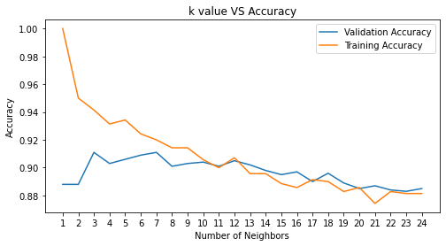

# Data Science London + Scikit-learn

Scikit-learn is an open-source machine learning library for Python. Give it a try here!

## 1. Problem Definition

This is a binary classification task, You are evaluated on classification accuracy (the percentage of labels you predict correctly).  The training set has 1000 samples and the testing set has 9000.  Your prediction should be a 9000 x 1 vector of ones or zeros. You also need an Id column (1 to 9000) and should include a header. The format looks like this:
> Id, Solution <br/>
> 1, 0 <br/>
> 2, 1 <br/>
> ... <br/>
> 9000, 0 <br/>

## 2. Collecting the data


```python
import pandas as pd
import numpy as np
import matplotlib.pyplot as plt
import seaborn as sns
```


```python
df_train = pd.read_csv('data/train.csv', sep=',', header=None)
df_test = pd.read_csv('data/test.csv', sep=',', header=None)
df_labels = pd.read_csv('data/trainLabels.csv', sep=',', header=None)
```

## 3. Exploratory data analysis


```python
df_train.shape, df_test.shape, df_labels.shape
```


    ((1000, 40), (9000, 40), (1000, 1))


```python
df_labels.head(5)
```


<div>

<table border="1" class="dataframe">
  <thead>
    <tr style="text-align: right;">
      <th></th>
      <th>0</th>
    </tr>
  </thead>
  <tbody>
    <tr>
      <th>0</th>
      <td>1</td>
    </tr>
    <tr>
      <th>1</th>
      <td>0</td>
    </tr>
    <tr>
      <th>2</th>
      <td>0</td>
    </tr>
    <tr>
      <th>3</th>
      <td>1</td>
    </tr>
    <tr>
      <th>4</th>
      <td>0</td>
    </tr>
  </tbody>
</table>
</div>


```python
df_train.head(5)
```


<div>

<table border="1" class="dataframe">
  <thead>
    <tr style="text-align: right;">
      <th></th>
      <th>0</th>
      <th>1</th>
      <th>2</th>
      <th>3</th>
      <th>4</th>
      <th>5</th>
      <th>6</th>
      <th>7</th>
      <th>8</th>
      <th>9</th>
      <th>...</th>
      <th>30</th>
      <th>31</th>
      <th>32</th>
      <th>33</th>
      <th>34</th>
      <th>35</th>
      <th>36</th>
      <th>37</th>
      <th>38</th>
      <th>39</th>
    </tr>
  </thead>
  <tbody>
    <tr>
      <th>0</th>
      <td>0.299403</td>
      <td>-1.226624</td>
      <td>1.498425</td>
      <td>-1.176150</td>
      <td>5.289853</td>
      <td>0.208297</td>
      <td>2.404498</td>
      <td>1.594506</td>
      <td>-0.051608</td>
      <td>0.663234</td>
      <td>...</td>
      <td>-0.850465</td>
      <td>-0.622990</td>
      <td>-1.833057</td>
      <td>0.293024</td>
      <td>3.552681</td>
      <td>0.717611</td>
      <td>3.305972</td>
      <td>-2.715559</td>
      <td>-2.682409</td>
      <td>0.101050</td>
    </tr>
    <tr>
      <th>1</th>
      <td>-1.174176</td>
      <td>0.332157</td>
      <td>0.949919</td>
      <td>-1.285328</td>
      <td>2.199061</td>
      <td>-0.151268</td>
      <td>-0.427039</td>
      <td>2.619246</td>
      <td>-0.765884</td>
      <td>-0.093780</td>
      <td>...</td>
      <td>-0.819750</td>
      <td>0.012037</td>
      <td>2.038836</td>
      <td>0.468579</td>
      <td>-0.517657</td>
      <td>0.422326</td>
      <td>0.803699</td>
      <td>1.213219</td>
      <td>1.382932</td>
      <td>-1.817761</td>
    </tr>
    <tr>
      <th>2</th>
      <td>1.192222</td>
      <td>-0.414371</td>
      <td>0.067054</td>
      <td>-2.233568</td>
      <td>3.658881</td>
      <td>0.089007</td>
      <td>0.203439</td>
      <td>-4.219054</td>
      <td>-1.184919</td>
      <td>-1.240310</td>
      <td>...</td>
      <td>-0.604501</td>
      <td>0.750054</td>
      <td>-3.360521</td>
      <td>0.856988</td>
      <td>-2.751451</td>
      <td>-1.582735</td>
      <td>1.672246</td>
      <td>0.656438</td>
      <td>-0.932473</td>
      <td>2.987436</td>
    </tr>
    <tr>
      <th>3</th>
      <td>1.573270</td>
      <td>-0.580318</td>
      <td>-0.866332</td>
      <td>-0.603812</td>
      <td>3.125716</td>
      <td>0.870321</td>
      <td>-0.161992</td>
      <td>4.499666</td>
      <td>1.038741</td>
      <td>-1.092716</td>
      <td>...</td>
      <td>1.022959</td>
      <td>1.275598</td>
      <td>-3.480110</td>
      <td>-1.065252</td>
      <td>2.153133</td>
      <td>1.563539</td>
      <td>2.767117</td>
      <td>0.215748</td>
      <td>0.619645</td>
      <td>1.883397</td>
    </tr>
    <tr>
      <th>4</th>
      <td>-0.613071</td>
      <td>-0.644204</td>
      <td>1.112558</td>
      <td>-0.032397</td>
      <td>3.490142</td>
      <td>-0.011935</td>
      <td>1.443521</td>
      <td>-4.290282</td>
      <td>-1.761308</td>
      <td>0.807652</td>
      <td>...</td>
      <td>0.513906</td>
      <td>-1.803473</td>
      <td>0.518579</td>
      <td>-0.205029</td>
      <td>-4.744566</td>
      <td>-1.520015</td>
      <td>1.830651</td>
      <td>0.870772</td>
      <td>-1.894609</td>
      <td>0.408332</td>
    </tr>
  </tbody>
</table>
<p>5 rows × 40 columns</p>
</div>


```python
df_train.describe()
```


<div>

<table border="1" class="dataframe">
  <thead>
    <tr style="text-align: right;">
      <th></th>
      <th>0</th>
      <th>1</th>
      <th>2</th>
      <th>3</th>
      <th>4</th>
      <th>5</th>
      <th>6</th>
      <th>7</th>
      <th>8</th>
      <th>9</th>
      <th>...</th>
      <th>30</th>
      <th>31</th>
      <th>32</th>
      <th>33</th>
      <th>34</th>
      <th>35</th>
      <th>36</th>
      <th>37</th>
      <th>38</th>
      <th>39</th>
    </tr>
  </thead>
  <tbody>
    <tr>
      <th>count</th>
      <td>1000.000000</td>
      <td>1000.000000</td>
      <td>1000.000000</td>
      <td>1000.000000</td>
      <td>1000.000000</td>
      <td>1000.000000</td>
      <td>1000.000000</td>
      <td>1000.000000</td>
      <td>1000.000000</td>
      <td>1000.000000</td>
      <td>...</td>
      <td>1000.000000</td>
      <td>1000.000000</td>
      <td>1000.000000</td>
      <td>1000.000000</td>
      <td>1000.000000</td>
      <td>1000.000000</td>
      <td>1000.000000</td>
      <td>1000.000000</td>
      <td>1000.000000</td>
      <td>1000.000000</td>
    </tr>
    <tr>
      <th>mean</th>
      <td>0.025596</td>
      <td>-0.024526</td>
      <td>-0.024088</td>
      <td>-0.002271</td>
      <td>1.092329</td>
      <td>-0.006250</td>
      <td>0.497342</td>
      <td>-0.037883</td>
      <td>0.026391</td>
      <td>-0.003597</td>
      <td>...</td>
      <td>0.030651</td>
      <td>0.022951</td>
      <td>-0.542491</td>
      <td>-0.011608</td>
      <td>-0.483507</td>
      <td>0.033371</td>
      <td>0.567185</td>
      <td>0.006849</td>
      <td>-0.892659</td>
      <td>0.609451</td>
    </tr>
    <tr>
      <th>std</th>
      <td>1.008282</td>
      <td>1.016298</td>
      <td>0.979109</td>
      <td>0.970575</td>
      <td>4.538834</td>
      <td>0.989128</td>
      <td>2.118819</td>
      <td>2.232256</td>
      <td>1.001064</td>
      <td>1.013520</td>
      <td>...</td>
      <td>1.011645</td>
      <td>1.001375</td>
      <td>2.239939</td>
      <td>1.022456</td>
      <td>2.121281</td>
      <td>1.007044</td>
      <td>2.227876</td>
      <td>0.997635</td>
      <td>2.022022</td>
      <td>2.045439</td>
    </tr>
    <tr>
      <th>min</th>
      <td>-3.365711</td>
      <td>-3.492086</td>
      <td>-2.695602</td>
      <td>-3.460471</td>
      <td>-16.421901</td>
      <td>-3.041250</td>
      <td>-7.224761</td>
      <td>-6.509084</td>
      <td>-3.145588</td>
      <td>-2.749812</td>
      <td>...</td>
      <td>-3.379194</td>
      <td>-2.971125</td>
      <td>-7.840890</td>
      <td>-2.999564</td>
      <td>-7.124105</td>
      <td>-2.952358</td>
      <td>-5.452254</td>
      <td>-3.473913</td>
      <td>-8.051722</td>
      <td>-7.799086</td>
    </tr>
    <tr>
      <th>25%</th>
      <td>-0.669010</td>
      <td>-0.693937</td>
      <td>-0.698830</td>
      <td>-0.617557</td>
      <td>-1.801997</td>
      <td>-0.732265</td>
      <td>-0.838619</td>
      <td>-1.604037</td>
      <td>-0.677562</td>
      <td>-0.682220</td>
      <td>...</td>
      <td>-0.659457</td>
      <td>-0.696032</td>
      <td>-2.121943</td>
      <td>-0.664550</td>
      <td>-1.879247</td>
      <td>-0.642861</td>
      <td>-1.059786</td>
      <td>-0.691162</td>
      <td>-2.220126</td>
      <td>-0.565041</td>
    </tr>
    <tr>
      <th>50%</th>
      <td>0.027895</td>
      <td>-0.033194</td>
      <td>0.008145</td>
      <td>0.002327</td>
      <td>0.862818</td>
      <td>0.027041</td>
      <td>0.582321</td>
      <td>0.018809</td>
      <td>0.022092</td>
      <td>-0.036110</td>
      <td>...</td>
      <td>0.049416</td>
      <td>0.049778</td>
      <td>-0.568262</td>
      <td>-0.028097</td>
      <td>-0.493575</td>
      <td>0.037732</td>
      <td>0.455474</td>
      <td>0.038284</td>
      <td>-0.855470</td>
      <td>0.779944</td>
    </tr>
    <tr>
      <th>75%</th>
      <td>0.762520</td>
      <td>0.682753</td>
      <td>0.661434</td>
      <td>0.640743</td>
      <td>3.843172</td>
      <td>0.671456</td>
      <td>1.913664</td>
      <td>1.438304</td>
      <td>0.741310</td>
      <td>0.665364</td>
      <td>...</td>
      <td>0.747031</td>
      <td>0.699917</td>
      <td>0.939348</td>
      <td>0.651374</td>
      <td>1.005795</td>
      <td>0.691800</td>
      <td>2.122157</td>
      <td>0.693535</td>
      <td>0.388698</td>
      <td>1.992193</td>
    </tr>
    <tr>
      <th>max</th>
      <td>3.326246</td>
      <td>3.583870</td>
      <td>2.546507</td>
      <td>3.088738</td>
      <td>17.565345</td>
      <td>3.102997</td>
      <td>7.592666</td>
      <td>7.130097</td>
      <td>3.145258</td>
      <td>3.919426</td>
      <td>...</td>
      <td>2.844792</td>
      <td>3.688047</td>
      <td>7.160379</td>
      <td>3.353631</td>
      <td>6.005818</td>
      <td>3.420561</td>
      <td>6.603499</td>
      <td>3.492548</td>
      <td>5.774120</td>
      <td>6.803984</td>
    </tr>
  </tbody>
</table>
<p>8 rows × 40 columns</p>
</div>


## 4. Missing data and Missing values


```python
df_train.isnull().sum()
```


    0     0
    1     0
    2     0
    3     0
    4     0
    5     0
    6     0
    7     0
    8     0
    9     0
    10    0
    11    0
    12    0
    13    0
    14    0
    15    0
    16    0
    17    0
    18    0
    19    0
    20    0
    21    0
    22    0
    23    0
    24    0
    25    0
    26    0
    27    0
    28    0
    29    0
    30    0
    31    0
    32    0
    33    0
    34    0
    35    0
    36    0
    37    0
    38    0
    39    0
    dtype: int64


```python
df_test.isnull().sum()
```


    0     0
    1     0
    2     0
    3     0
    4     0
    5     0
    6     0
    7     0
    8     0
    9     0
    10    0
    11    0
    12    0
    13    0
    14    0
    15    0
    16    0
    17    0
    18    0
    19    0
    20    0
    21    0
    22    0
    23    0
    24    0
    25    0
    26    0
    27    0
    28    0
    29    0
    30    0
    31    0
    32    0
    33    0
    34    0
    35    0
    36    0
    37    0
    38    0
    39    0
    dtype: int64


## 5. Modeling


```python
import tensorflow as tf
from sklearn.neighbors import KNeighborsClassifier
from sklearn.tree import DecisionTreeClassifier
from sklearn.ensemble import RandomForestClassifier
from sklearn.naive_bayes import GaussianNB
from sklearn.svm import SVC
```


```python
import sklearn
import numpy as np
import tensorflow as tf
from sklearn.preprocessing import LabelEncoder
from sklearn.model_selection import train_test_split
from tensorflow.keras.optimizers import Adam
from tensorflow.keras.metrics import Precision
from tensorflow.keras.metrics import Recall
```


```python
from sklearn.neighbors import KNeighborsClassifier
from sklearn.model_selection import cross_val_score, train_test_split
from sklearn.model_selection import KFold
```

#### Cross Validation


```python
k_fold = KFold(n_splits=10, shuffle=True, random_state=0)
```

#### Using KNN for classification


```python
X, y = df_train, np.ravel(df_labels)
X_train, X_test, y_train, y_test = train_test_split(X, y, test_size=0.3)
```


```python
# Model complexity
neig = np.arange(1, 25)
kfold = 10
train_accuracy = []
val_accuracy = []
bestKnn = None
bestAcc = 0.0
```


```python
# Loop over different values of k
for i, k in enumerate(neig):
    # k from 1 to 25(exclude)
    knn = KNeighborsClassifier(n_neighbors=k)
    # Fit with knn
    knn.fit(X_train,y_train)
    #train accuracy
    train_accuracy.append(knn.score(X_train, y_train))
    # test accuracy
    val_accuracy.append(np.mean(cross_val_score(knn, X, y, cv=kfold)))
    if np.mean(cross_val_score(knn, X, y, cv=kfold)) > bestAcc:
        bestAcc = np.mean(cross_val_score(knn, X, y, cv=10))
        bestKnn = knn
```


```python
# Plot
plt.figure(figsize=[8,4])
plt.plot(neig, val_accuracy, label = 'Validation Accuracy')
plt.plot(neig, train_accuracy, label = 'Training Accuracy')
plt.legend()
plt.title('k value VS Accuracy')
plt.xlabel('Number of Neighbors')
plt.ylabel('Accuracy')
plt.xticks(neig)
plt.show()
```


    

    


```python
print('Best Accuracy without feature scaling:', bestAcc)
print(bestKnn)
```

    Best Accuracy without feature scaling: 0.9109999999999999
    KNeighborsClassifier(n_neighbors=3)
    

#### KNN 2


```python
clf = KNeighborsClassifier(n_neighbors = 13)
scoring = 'accuracy'
score = cross_val_score(clf, df_train, np.ravel(df_labels), cv=k_fold, n_jobs=1, scoring=scoring)
print(score)
```

    [0.9  0.91 0.88 0.91 0.82 0.94 0.92 0.92 0.87 0.94]
    


```python
# kNN Score
round(np.mean(score)*100, 2)
```


    90.1


#### Decision Tree


```python
clf = DecisionTreeClassifier()
scoring = 'accuracy'
score = cross_val_score(clf, df_train, np.ravel(df_labels), cv=k_fold, n_jobs=2, scoring=scoring)
print(score)
```

    [0.73 0.8  0.75 0.76 0.75 0.8  0.74 0.73 0.8  0.81]
    


```python
# decision tree Score
round(np.mean(score)*100, 2)
```


    83.6


#### Random Forest


```python
clf = RandomForestClassifier(n_estimators=13)
scoring = 'accuracy'
score = cross_val_score(clf, df_train, np.ravel(df_labels), cv=k_fold, n_jobs=1, scoring=scoring)
print(score)
```

    [0.86 0.83 0.86 0.82 0.78 0.87 0.83 0.77 0.84 0.9 ]
    


```python
# Random Forest Score
round(np.mean(score)*100, 2)
```


    83.6


#### Naive Bayes


```python
clf = GaussianNB()
scoring = 'accuracy'
score = cross_val_score(clf, df_train, np.ravel(df_labels), cv=k_fold, n_jobs=1, scoring=scoring)
print(score)
```

    [0.82 0.81 0.81 0.77 0.78 0.86 0.81 0.79 0.79 0.87]
    


```python
# Naive Bayes Score
round(np.mean(score)*100, 2)
```


    83.6


#### SVM


```python
clf = SVC(kernel='poly')
scoring = 'accuracy'
score = cross_val_score(clf, df_train, np.ravel(df_labels), cv=k_fold, n_jobs=1, scoring=scoring)
print(score)
```

    [0.87 0.86 0.88 0.87 0.85 0.92 0.92 0.86 0.88 0.9 ]
    


```python
round(np.mean(score)*100,2)
```


    88.1


## 6. Testing


```python

```
