# Wine Dataset for Clustering

O Wine dataset consiste em uma base de dados contendo vários atributos sobre vinhos. O objetivo é utilizar algoritmos de agrupamento e clusterização para classificar estes dados de alguma forma.<br/>
O dataset contém 13 atributos, são eles: 
* Alcohol
* Malic acid
* Ash
* Alcalinity of ash
* Magnesium
* Total phenols
* Flavanoids
* Nonflavanoid phenols
* Proanthocyanins
* Color intensity
* Hue
* OD280/OD315 of diluted wines
* Proline

## 1. Análise exploratória


```python
import pandas as pd
pd.set_option('display.max_columns', None)
pd.options.display.float_format = "{:.2f}".format

import numpy as np

import seaborn as sns
import matplotlib.pyplot as plt

from tqdm import tqdm
```


```python
data = pd.read_csv('data/wine-clustering.csv')
```


```python
data.head()
```


<div>

<table border="1" class="dataframe">
  <thead>
    <tr style="text-align: right;">
      <th></th>
      <th>Alcohol</th>
      <th>Malic_Acid</th>
      <th>Ash</th>
      <th>Ash_Alcanity</th>
      <th>Magnesium</th>
      <th>Total_Phenols</th>
      <th>Flavanoids</th>
      <th>Nonflavanoid_Phenols</th>
      <th>Proanthocyanins</th>
      <th>Color_Intensity</th>
      <th>Hue</th>
      <th>OD280</th>
      <th>Proline</th>
    </tr>
  </thead>
  <tbody>
    <tr>
      <th>0</th>
      <td>14.23</td>
      <td>1.71</td>
      <td>2.43</td>
      <td>15.60</td>
      <td>127</td>
      <td>2.80</td>
      <td>3.06</td>
      <td>0.28</td>
      <td>2.29</td>
      <td>5.64</td>
      <td>1.04</td>
      <td>3.92</td>
      <td>1065</td>
    </tr>
    <tr>
      <th>1</th>
      <td>13.20</td>
      <td>1.78</td>
      <td>2.14</td>
      <td>11.20</td>
      <td>100</td>
      <td>2.65</td>
      <td>2.76</td>
      <td>0.26</td>
      <td>1.28</td>
      <td>4.38</td>
      <td>1.05</td>
      <td>3.40</td>
      <td>1050</td>
    </tr>
    <tr>
      <th>2</th>
      <td>13.16</td>
      <td>2.36</td>
      <td>2.67</td>
      <td>18.60</td>
      <td>101</td>
      <td>2.80</td>
      <td>3.24</td>
      <td>0.30</td>
      <td>2.81</td>
      <td>5.68</td>
      <td>1.03</td>
      <td>3.17</td>
      <td>1185</td>
    </tr>
    <tr>
      <th>3</th>
      <td>14.37</td>
      <td>1.95</td>
      <td>2.50</td>
      <td>16.80</td>
      <td>113</td>
      <td>3.85</td>
      <td>3.49</td>
      <td>0.24</td>
      <td>2.18</td>
      <td>7.80</td>
      <td>0.86</td>
      <td>3.45</td>
      <td>1480</td>
    </tr>
    <tr>
      <th>4</th>
      <td>13.24</td>
      <td>2.59</td>
      <td>2.87</td>
      <td>21.00</td>
      <td>118</td>
      <td>2.80</td>
      <td>2.69</td>
      <td>0.39</td>
      <td>1.82</td>
      <td>4.32</td>
      <td>1.04</td>
      <td>2.93</td>
      <td>735</td>
    </tr>
  </tbody>
</table>
</div>


```python
data.shape
```


    (178, 13)


```python
data.isnull().sum()
```


    Alcohol                 0
    Malic_Acid              0
    Ash                     0
    Ash_Alcanity            0
    Magnesium               0
    Total_Phenols           0
    Flavanoids              0
    Nonflavanoid_Phenols    0
    Proanthocyanins         0
    Color_Intensity         0
    Hue                     0
    OD280                   0
    Proline                 0
    dtype: int64


```python
data.info()
```

    <class 'pandas.core.frame.DataFrame'>
    RangeIndex: 178 entries, 0 to 177
    Data columns (total 13 columns):
     #   Column                Non-Null Count  Dtype  
    ---  ------                --------------  -----  
     0   Alcohol               178 non-null    float64
     1   Malic_Acid            178 non-null    float64
     2   Ash                   178 non-null    float64
     3   Ash_Alcanity          178 non-null    float64
     4   Magnesium             178 non-null    int64  
     5   Total_Phenols         178 non-null    float64
     6   Flavanoids            178 non-null    float64
     7   Nonflavanoid_Phenols  178 non-null    float64
     8   Proanthocyanins       178 non-null    float64
     9   Color_Intensity       178 non-null    float64
     10  Hue                   178 non-null    float64
     11  OD280                 178 non-null    float64
     12  Proline               178 non-null    int64  
    dtypes: float64(11), int64(2)
    memory usage: 18.2 KB
    


```python
data.describe()
```


<div>

<table border="1" class="dataframe">
  <thead>
    <tr style="text-align: right;">
      <th></th>
      <th>Alcohol</th>
      <th>Malic_Acid</th>
      <th>Ash</th>
      <th>Ash_Alcanity</th>
      <th>Magnesium</th>
      <th>Total_Phenols</th>
      <th>Flavanoids</th>
      <th>Nonflavanoid_Phenols</th>
      <th>Proanthocyanins</th>
      <th>Color_Intensity</th>
      <th>Hue</th>
      <th>OD280</th>
      <th>Proline</th>
    </tr>
  </thead>
  <tbody>
    <tr>
      <th>count</th>
      <td>178.00</td>
      <td>178.00</td>
      <td>178.00</td>
      <td>178.00</td>
      <td>178.00</td>
      <td>178.00</td>
      <td>178.00</td>
      <td>178.00</td>
      <td>178.00</td>
      <td>178.00</td>
      <td>178.00</td>
      <td>178.00</td>
      <td>178.00</td>
    </tr>
    <tr>
      <th>mean</th>
      <td>13.00</td>
      <td>2.34</td>
      <td>2.37</td>
      <td>19.49</td>
      <td>99.74</td>
      <td>2.30</td>
      <td>2.03</td>
      <td>0.36</td>
      <td>1.59</td>
      <td>5.06</td>
      <td>0.96</td>
      <td>2.61</td>
      <td>746.89</td>
    </tr>
    <tr>
      <th>std</th>
      <td>0.81</td>
      <td>1.12</td>
      <td>0.27</td>
      <td>3.34</td>
      <td>14.28</td>
      <td>0.63</td>
      <td>1.00</td>
      <td>0.12</td>
      <td>0.57</td>
      <td>2.32</td>
      <td>0.23</td>
      <td>0.71</td>
      <td>314.91</td>
    </tr>
    <tr>
      <th>min</th>
      <td>11.03</td>
      <td>0.74</td>
      <td>1.36</td>
      <td>10.60</td>
      <td>70.00</td>
      <td>0.98</td>
      <td>0.34</td>
      <td>0.13</td>
      <td>0.41</td>
      <td>1.28</td>
      <td>0.48</td>
      <td>1.27</td>
      <td>278.00</td>
    </tr>
    <tr>
      <th>25%</th>
      <td>12.36</td>
      <td>1.60</td>
      <td>2.21</td>
      <td>17.20</td>
      <td>88.00</td>
      <td>1.74</td>
      <td>1.21</td>
      <td>0.27</td>
      <td>1.25</td>
      <td>3.22</td>
      <td>0.78</td>
      <td>1.94</td>
      <td>500.50</td>
    </tr>
    <tr>
      <th>50%</th>
      <td>13.05</td>
      <td>1.87</td>
      <td>2.36</td>
      <td>19.50</td>
      <td>98.00</td>
      <td>2.35</td>
      <td>2.13</td>
      <td>0.34</td>
      <td>1.56</td>
      <td>4.69</td>
      <td>0.96</td>
      <td>2.78</td>
      <td>673.50</td>
    </tr>
    <tr>
      <th>75%</th>
      <td>13.68</td>
      <td>3.08</td>
      <td>2.56</td>
      <td>21.50</td>
      <td>107.00</td>
      <td>2.80</td>
      <td>2.88</td>
      <td>0.44</td>
      <td>1.95</td>
      <td>6.20</td>
      <td>1.12</td>
      <td>3.17</td>
      <td>985.00</td>
    </tr>
    <tr>
      <th>max</th>
      <td>14.83</td>
      <td>5.80</td>
      <td>3.23</td>
      <td>30.00</td>
      <td>162.00</td>
      <td>3.88</td>
      <td>5.08</td>
      <td>0.66</td>
      <td>3.58</td>
      <td>13.00</td>
      <td>1.71</td>
      <td>4.00</td>
      <td>1680.00</td>
    </tr>
  </tbody>
</table>
</div>


#### Vamos iniciar uma análise mais estatística
A primeira coisa será checar o skewness. O skewness próximo de zero indica que os dados estão normalmenete distribuídos. Caso o valor seja maior que zero significa que os dados estão mais a esquerda da distribuição normal, caso seja negativo, os dados estão mais a direita.


```python
data.skew()
```


    Alcohol                -0.05
    Malic_Acid              1.04
    Ash                    -0.18
    Ash_Alcanity            0.21
    Magnesium               1.10
    Total_Phenols           0.09
    Flavanoids              0.03
    Nonflavanoid_Phenols    0.45
    Proanthocyanins         0.52
    Color_Intensity         0.87
    Hue                     0.02
    OD280                  -0.31
    Proline                 0.77
    dtype: float64


Vamos exibir um histograma de distribuição para cada variável numérica.


```python
sns.set(style='white',font_scale=1.0, rc={'figure.figsize':(10,10)})
ax=data.hist(bins=10,color='#8f1a4a' )
```


    
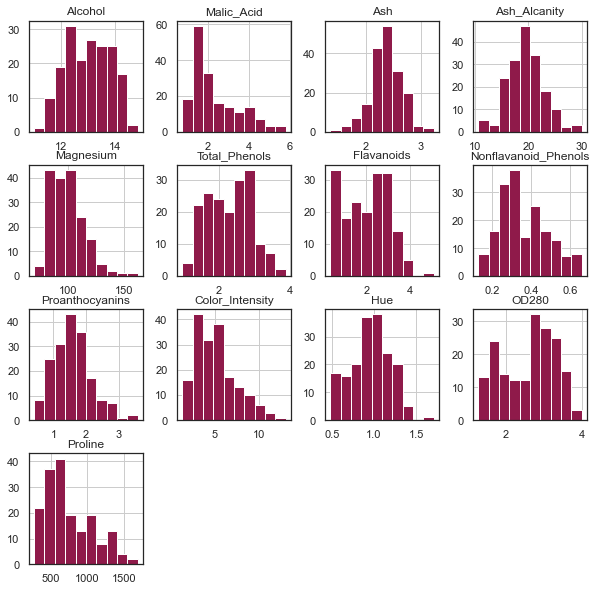
    


```python
data.plot(kind = 'box', subplots = True, layout = (4,4), sharex = False, sharey = False, color='black')
plt.show()
```


    
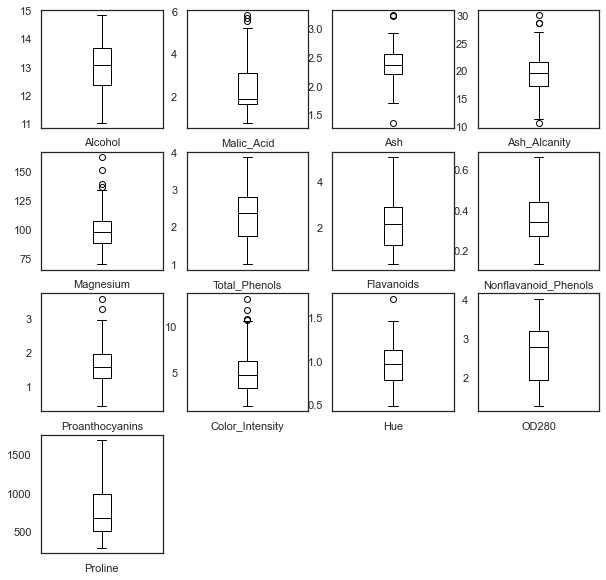
    


## 2. Processamento dos dados

Nós vamos utilizar o algoritmo K-means, o algoritmo utiliza a métrica de distância para alocar o dado em seu respectivo grupo.


```python
from sklearn.preprocessing import StandardScaler

std_scaler = StandardScaler()
data_cluster=data.copy()
data_cluster[data_cluster.columns]=std_scaler.fit_transform(data_cluster)
```

Checando se a padronização foi feita corretamente, olhando para a média igual a zero e o std igual a 1.


```python
data_cluster.describe()
```


<div>

<table border="1" class="dataframe">
  <thead>
    <tr style="text-align: right;">
      <th></th>
      <th>Alcohol</th>
      <th>Malic_Acid</th>
      <th>Ash</th>
      <th>Ash_Alcanity</th>
      <th>Magnesium</th>
      <th>Total_Phenols</th>
      <th>Flavanoids</th>
      <th>Nonflavanoid_Phenols</th>
      <th>Proanthocyanins</th>
      <th>Color_Intensity</th>
      <th>Hue</th>
      <th>OD280</th>
      <th>Proline</th>
    </tr>
  </thead>
  <tbody>
    <tr>
      <th>count</th>
      <td>178.00</td>
      <td>178.00</td>
      <td>178.00</td>
      <td>178.00</td>
      <td>178.00</td>
      <td>178.00</td>
      <td>178.00</td>
      <td>178.00</td>
      <td>178.00</td>
      <td>178.00</td>
      <td>178.00</td>
      <td>178.00</td>
      <td>178.00</td>
    </tr>
    <tr>
      <th>mean</th>
      <td>-0.00</td>
      <td>-0.00</td>
      <td>-0.00</td>
      <td>-0.00</td>
      <td>-0.00</td>
      <td>-0.00</td>
      <td>-0.00</td>
      <td>0.00</td>
      <td>-0.00</td>
      <td>-0.00</td>
      <td>0.00</td>
      <td>0.00</td>
      <td>-0.00</td>
    </tr>
    <tr>
      <th>std</th>
      <td>1.00</td>
      <td>1.00</td>
      <td>1.00</td>
      <td>1.00</td>
      <td>1.00</td>
      <td>1.00</td>
      <td>1.00</td>
      <td>1.00</td>
      <td>1.00</td>
      <td>1.00</td>
      <td>1.00</td>
      <td>1.00</td>
      <td>1.00</td>
    </tr>
    <tr>
      <th>min</th>
      <td>-2.43</td>
      <td>-1.43</td>
      <td>-3.68</td>
      <td>-2.67</td>
      <td>-2.09</td>
      <td>-2.11</td>
      <td>-1.70</td>
      <td>-1.87</td>
      <td>-2.07</td>
      <td>-1.63</td>
      <td>-2.09</td>
      <td>-1.90</td>
      <td>-1.49</td>
    </tr>
    <tr>
      <th>25%</th>
      <td>-0.79</td>
      <td>-0.66</td>
      <td>-0.57</td>
      <td>-0.69</td>
      <td>-0.82</td>
      <td>-0.89</td>
      <td>-0.83</td>
      <td>-0.74</td>
      <td>-0.60</td>
      <td>-0.80</td>
      <td>-0.77</td>
      <td>-0.95</td>
      <td>-0.78</td>
    </tr>
    <tr>
      <th>50%</th>
      <td>0.06</td>
      <td>-0.42</td>
      <td>-0.02</td>
      <td>0.00</td>
      <td>-0.12</td>
      <td>0.10</td>
      <td>0.11</td>
      <td>-0.18</td>
      <td>-0.06</td>
      <td>-0.16</td>
      <td>0.03</td>
      <td>0.24</td>
      <td>-0.23</td>
    </tr>
    <tr>
      <th>75%</th>
      <td>0.84</td>
      <td>0.67</td>
      <td>0.70</td>
      <td>0.60</td>
      <td>0.51</td>
      <td>0.81</td>
      <td>0.85</td>
      <td>0.61</td>
      <td>0.63</td>
      <td>0.49</td>
      <td>0.71</td>
      <td>0.79</td>
      <td>0.76</td>
    </tr>
    <tr>
      <th>max</th>
      <td>2.26</td>
      <td>3.11</td>
      <td>3.16</td>
      <td>3.15</td>
      <td>4.37</td>
      <td>2.54</td>
      <td>3.06</td>
      <td>2.40</td>
      <td>3.49</td>
      <td>3.44</td>
      <td>3.30</td>
      <td>1.96</td>
      <td>2.97</td>
    </tr>
  </tbody>
</table>
</div>


Como estamos trabalhando com um n-dimensional dataset nós iremos utilizar o Principal Component Analysis para reduzie a dimensão e tornar "plotável" no plano cartesiano. Nós provavelmente vamos perder informação/variância neste processo, mas é apenas para visualização.


```python
from sklearn.decomposition import PCA
pca_2 = PCA(2)
pca_2_result = pca_2.fit_transform(data_cluster)

print ('Variância explicada por 2 principais componentes: {:.2%}'.format(np.sum(pca_2.explained_variance_ratio_)))
```

    Variância explicada por 2 principais componentes: 55.41%
    


```python
sns.set(style='white', rc={'figure.figsize':(6,4)},font_scale=1.1)

plt.scatter(x=pca_2_result[:, 0], y=pca_2_result[:, 1], color='#8f1a4a',lw=0.1)
plt.xlabel('Componente principal 1')
plt.ylabel('Componente principal 2')
plt.title('Dados representados pelos 2 principais componentes',fontweight='bold')
plt.show()
```


    
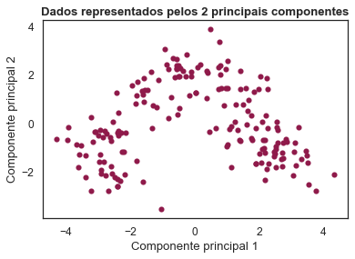
    


## 3. Modelagem dos dados

Vamos utilizar o algoritmo K-means para escolher K (quantidade de clusters). Iremos combinar duas técnicas: O score de silhoueta e K-means Inertia (com elbow analysis).

Primeiro, vamos computar todas as inertias. Basicamente quanto menor a Inertia, melhor a clusterização.


```python
import sklearn.cluster as cluster

inertia = []
for i in tqdm(range(2,10)):
    kmeans = cluster.KMeans(n_clusters=i, init='k-means++', n_init=15, max_iter=500, random_state=17)
    kmeans.fit(data_cluster)
    inertia.append(kmeans.inertia_)
```

    100%|████████████████████████████████████████████████████████████████████████████████████| 8/8 [00:00<00:00, 20.34it/s]
    

Agora vamos computar o score de silhoueta. Aqui quanto maior o score, melhor.


```python
from sklearn.metrics import silhouette_score

silhouette = {}
for i in tqdm(range(2,10)):
    kmeans = cluster.KMeans(n_clusters=i, init='k-means++', n_init=15, max_iter=500, random_state=17)
    kmeans.fit(data_cluster)
    silhouette[i] = silhouette_score(data_cluster, kmeans.labels_, metric='euclidean')
```

    100%|████████████████████████████████████████████████████████████████████████████████████| 8/8 [00:00<00:00, 18.96it/s]
    


```python
sns.set(style='white',font_scale=1.1, rc={'figure.figsize':(10,5)})

plt.subplot(1, 2, 1)

plt.plot(range(2,len(inertia)+2), inertia, marker='o',lw=2,ms=8,color='#8f1a4a')
plt.xlabel('Número de clusters')
plt.title('K-means Inertia',fontweight='bold')
plt.grid(True)

plt.subplot(1, 2, 2)

plt.bar(range(len(silhouette)), list(silhouette.values()), align='center',color= '#8f1a4a',width=0.5)
plt.xticks(range(len(silhouette)), list(silhouette.keys()))
plt.grid()
plt.title('Silhouette Score',fontweight='bold')
plt.xlabel('Número de clusters')


plt.show()
```


    
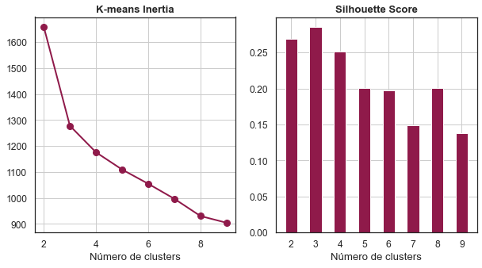
    


Podemos ver que de acordo com o score, 3 grupos indica o melhor número de clusters.


```python
kmeans = cluster.KMeans(n_clusters=3,random_state=17,init='k-means++')
kmeans_labels = kmeans.fit_predict(data_cluster)

centroids = kmeans.cluster_centers_
centroids_pca = pca_2.transform(centroids)

pd.Series(kmeans_labels).value_counts()
```


    2    65
    1    62
    0    51
    dtype: int64


Aqui nós podemos visualizar cada distribuição de feature de acordo com cada cluster. Neste passo nós vamos definir algumas características para cada grupo.


```python
aux[0:len(aux)-1]
```


    ['Alcohol',
     'Malic_Acid',
     'Ash',
     'Ash_Alcanity',
     'Magnesium',
     'Total_Phenols',
     'Flavanoids',
     'Nonflavanoid_Phenols',
     'Proanthocyanins',
     'Color_Intensity',
     'Hue',
     'OD280',
     'Proline']


```python
data2=data.copy()
data2['Cluster']=kmeans_labels

aux=data2.columns.tolist()

for cluster in aux[0:len(aux)-1]:
    grid = sns.FacetGrid(data2, col='Cluster')
    grid.map(plt.hist, cluster,color='#8f1a4a')
```


    
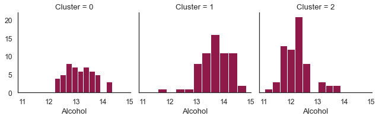
    


    

    


    
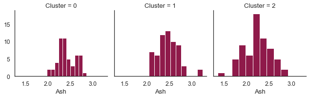
    


    
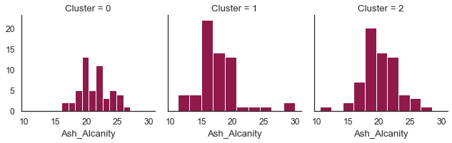
    


    
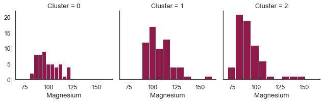
    


    
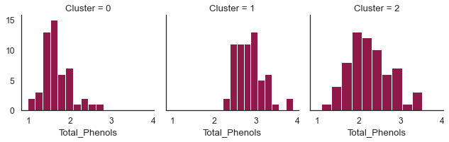
    


    
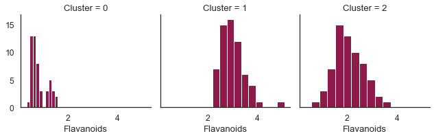
    


    
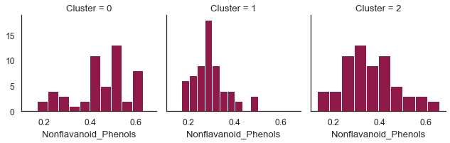
    


    
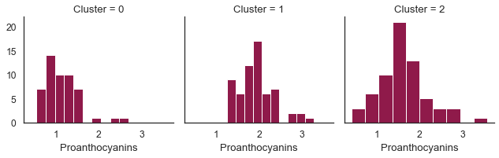
    


    
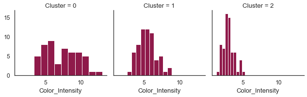
    


    
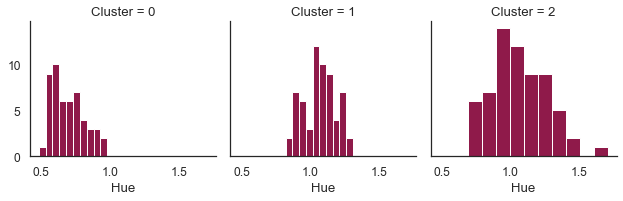
    


    
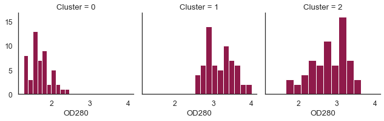
    


    
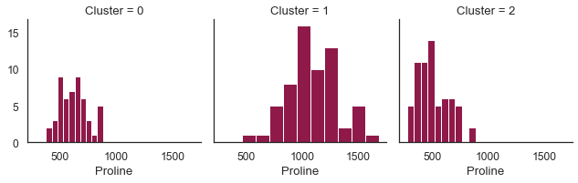
    


Outra abordagem é olhar para os centróides de cada cluster e definir características.


```python
centroids_data=pd.DataFrame(data=std_scaler.inverse_transform(centroids), columns=data.columns)
centroids_data.head()
```


<div>

<table border="1" class="dataframe">
  <thead>
    <tr style="text-align: right;">
      <th></th>
      <th>Alcohol</th>
      <th>Malic_Acid</th>
      <th>Ash</th>
      <th>Ash_Alcanity</th>
      <th>Magnesium</th>
      <th>Total_Phenols</th>
      <th>Flavanoids</th>
      <th>Nonflavanoid_Phenols</th>
      <th>Proanthocyanins</th>
      <th>Color_Intensity</th>
      <th>Hue</th>
      <th>OD280</th>
      <th>Proline</th>
    </tr>
  </thead>
  <tbody>
    <tr>
      <th>0</th>
      <td>13.13</td>
      <td>3.31</td>
      <td>2.42</td>
      <td>21.24</td>
      <td>98.67</td>
      <td>1.68</td>
      <td>0.82</td>
      <td>0.45</td>
      <td>1.15</td>
      <td>7.23</td>
      <td>0.69</td>
      <td>1.70</td>
      <td>619.06</td>
    </tr>
    <tr>
      <th>1</th>
      <td>13.68</td>
      <td>2.00</td>
      <td>2.47</td>
      <td>17.46</td>
      <td>107.97</td>
      <td>2.85</td>
      <td>3.00</td>
      <td>0.29</td>
      <td>1.92</td>
      <td>5.45</td>
      <td>1.07</td>
      <td>3.16</td>
      <td>1100.23</td>
    </tr>
    <tr>
      <th>2</th>
      <td>12.25</td>
      <td>1.90</td>
      <td>2.23</td>
      <td>20.06</td>
      <td>92.74</td>
      <td>2.25</td>
      <td>2.05</td>
      <td>0.36</td>
      <td>1.62</td>
      <td>2.97</td>
      <td>1.06</td>
      <td>2.80</td>
      <td>510.17</td>
    </tr>
  </tbody>
</table>
</div>


## 4. Visualização dos Clusters utilizando PCA


```python
sns.set(style='white', rc={'figure.figsize':(9,6)},font_scale=1.1)

plt.scatter(x=pca_2_result[:, 0], y=pca_2_result[:, 1], c=kmeans_labels, cmap='autumn')
plt.scatter(centroids_pca[:, 0], centroids_pca[:, 1], marker='x', s=169, linewidths=3, color='black', zorder=10,lw=3)
plt.xlabel('Componente Principal 1')
plt.ylabel('Componente Principal 2')
plt.title('Clustered Data (Visualização PCA)',fontweight='bold')
plt.show()
```


    
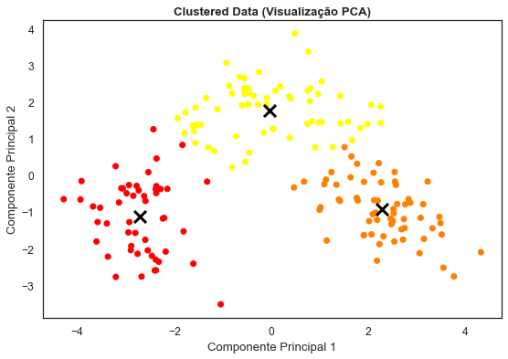
    


```python

```
