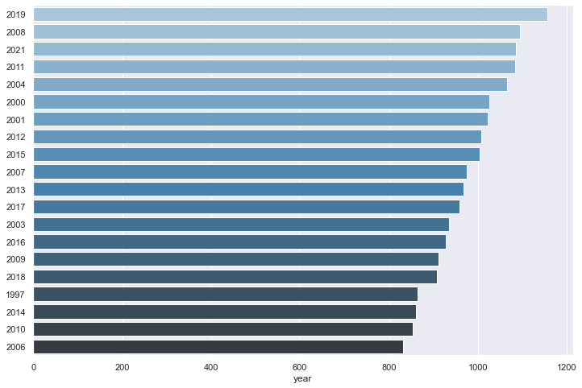

# International football results from 1872 to 2021

### Conteúdo do dataset
Este dataset contém 43.170 resultados de partidas de futebol iniciando desde os primeiros jogos oficiais até os jogos atuais. O dataset abrange partidas oficiais e também partidas amistosas.O dataset não contém resultados dos jogos olímpicos.

### Objetivo desde notebook
Este notebook tem o objetivo de fazer uma análise exploratória dos dados, vamos responder algumas perguntas como:


## 1. Análise exploratória


```python
import pandas as pd
import numpy as np
import seaborn as sns
```


```python
data = pd.read_csv('dados/results.csv')
```


```python
data.head(5)
```


<div>
<style scoped>
    .dataframe tbody tr th:only-of-type {
        vertical-align: middle;
    }

    .dataframe tbody tr th {
        vertical-align: top;
    }

    .dataframe thead th {
        text-align: right;
    }
</style>
<table border="1" class="dataframe">
  <thead>
    <tr style="text-align: right;">
      <th></th>
      <th>date</th>
      <th>home_team</th>
      <th>away_team</th>
      <th>home_score</th>
      <th>away_score</th>
      <th>tournament</th>
      <th>city</th>
      <th>country</th>
      <th>neutral</th>
    </tr>
  </thead>
  <tbody>
    <tr>
      <th>0</th>
      <td>1872-11-30</td>
      <td>Scotland</td>
      <td>England</td>
      <td>0</td>
      <td>0</td>
      <td>Friendly</td>
      <td>Glasgow</td>
      <td>Scotland</td>
      <td>False</td>
    </tr>
    <tr>
      <th>1</th>
      <td>1873-03-08</td>
      <td>England</td>
      <td>Scotland</td>
      <td>4</td>
      <td>2</td>
      <td>Friendly</td>
      <td>London</td>
      <td>England</td>
      <td>False</td>
    </tr>
    <tr>
      <th>2</th>
      <td>1874-03-07</td>
      <td>Scotland</td>
      <td>England</td>
      <td>2</td>
      <td>1</td>
      <td>Friendly</td>
      <td>Glasgow</td>
      <td>Scotland</td>
      <td>False</td>
    </tr>
    <tr>
      <th>3</th>
      <td>1875-03-06</td>
      <td>England</td>
      <td>Scotland</td>
      <td>2</td>
      <td>2</td>
      <td>Friendly</td>
      <td>London</td>
      <td>England</td>
      <td>False</td>
    </tr>
    <tr>
      <th>4</th>
      <td>1876-03-04</td>
      <td>Scotland</td>
      <td>England</td>
      <td>3</td>
      <td>0</td>
      <td>Friendly</td>
      <td>Glasgow</td>
      <td>Scotland</td>
      <td>False</td>
    </tr>
  </tbody>
</table>
</div>


```python
data['year'] = data['date'].str.extract('([0-9]+)\-', expand=False)
```


```python
data.head(5)
```


<div>
<style scoped>
    .dataframe tbody tr th:only-of-type {
        vertical-align: middle;
    }

    .dataframe tbody tr th {
        vertical-align: top;
    }

    .dataframe thead th {
        text-align: right;
    }
</style>
<table border="1" class="dataframe">
  <thead>
    <tr style="text-align: right;">
      <th></th>
      <th>date</th>
      <th>home_team</th>
      <th>away_team</th>
      <th>home_score</th>
      <th>away_score</th>
      <th>tournament</th>
      <th>city</th>
      <th>country</th>
      <th>neutral</th>
      <th>year</th>
    </tr>
  </thead>
  <tbody>
    <tr>
      <th>0</th>
      <td>1872-11-30</td>
      <td>Scotland</td>
      <td>England</td>
      <td>0</td>
      <td>0</td>
      <td>Friendly</td>
      <td>Glasgow</td>
      <td>Scotland</td>
      <td>False</td>
      <td>1872</td>
    </tr>
    <tr>
      <th>1</th>
      <td>1873-03-08</td>
      <td>England</td>
      <td>Scotland</td>
      <td>4</td>
      <td>2</td>
      <td>Friendly</td>
      <td>London</td>
      <td>England</td>
      <td>False</td>
      <td>1873</td>
    </tr>
    <tr>
      <th>2</th>
      <td>1874-03-07</td>
      <td>Scotland</td>
      <td>England</td>
      <td>2</td>
      <td>1</td>
      <td>Friendly</td>
      <td>Glasgow</td>
      <td>Scotland</td>
      <td>False</td>
      <td>1874</td>
    </tr>
    <tr>
      <th>3</th>
      <td>1875-03-06</td>
      <td>England</td>
      <td>Scotland</td>
      <td>2</td>
      <td>2</td>
      <td>Friendly</td>
      <td>London</td>
      <td>England</td>
      <td>False</td>
      <td>1875</td>
    </tr>
    <tr>
      <th>4</th>
      <td>1876-03-04</td>
      <td>Scotland</td>
      <td>England</td>
      <td>3</td>
      <td>0</td>
      <td>Friendly</td>
      <td>Glasgow</td>
      <td>Scotland</td>
      <td>False</td>
      <td>1876</td>
    </tr>
  </tbody>
</table>
</div>


```python
data = data.sort_values(by='date')
```


```python
data.iloc[0:50]
```


<div>
<style scoped>
    .dataframe tbody tr th:only-of-type {
        vertical-align: middle;
    }

    .dataframe tbody tr th {
        vertical-align: top;
    }

    .dataframe thead th {
        text-align: right;
    }
</style>
<table border="1" class="dataframe">
  <thead>
    <tr style="text-align: right;">
      <th></th>
      <th>date</th>
      <th>home_team</th>
      <th>away_team</th>
      <th>home_score</th>
      <th>away_score</th>
      <th>tournament</th>
      <th>city</th>
      <th>country</th>
      <th>neutral</th>
      <th>year</th>
    </tr>
  </thead>
  <tbody>
    <tr>
      <th>0</th>
      <td>1872-11-30</td>
      <td>Scotland</td>
      <td>England</td>
      <td>0</td>
      <td>0</td>
      <td>Friendly</td>
      <td>Glasgow</td>
      <td>Scotland</td>
      <td>False</td>
      <td>1872</td>
    </tr>
    <tr>
      <th>1</th>
      <td>1873-03-08</td>
      <td>England</td>
      <td>Scotland</td>
      <td>4</td>
      <td>2</td>
      <td>Friendly</td>
      <td>London</td>
      <td>England</td>
      <td>False</td>
      <td>1873</td>
    </tr>
    <tr>
      <th>2</th>
      <td>1874-03-07</td>
      <td>Scotland</td>
      <td>England</td>
      <td>2</td>
      <td>1</td>
      <td>Friendly</td>
      <td>Glasgow</td>
      <td>Scotland</td>
      <td>False</td>
      <td>1874</td>
    </tr>
    <tr>
      <th>3</th>
      <td>1875-03-06</td>
      <td>England</td>
      <td>Scotland</td>
      <td>2</td>
      <td>2</td>
      <td>Friendly</td>
      <td>London</td>
      <td>England</td>
      <td>False</td>
      <td>1875</td>
    </tr>
    <tr>
      <th>4</th>
      <td>1876-03-04</td>
      <td>Scotland</td>
      <td>England</td>
      <td>3</td>
      <td>0</td>
      <td>Friendly</td>
      <td>Glasgow</td>
      <td>Scotland</td>
      <td>False</td>
      <td>1876</td>
    </tr>
    <tr>
      <th>5</th>
      <td>1876-03-25</td>
      <td>Scotland</td>
      <td>Wales</td>
      <td>4</td>
      <td>0</td>
      <td>Friendly</td>
      <td>Glasgow</td>
      <td>Scotland</td>
      <td>False</td>
      <td>1876</td>
    </tr>
    <tr>
      <th>6</th>
      <td>1877-03-03</td>
      <td>England</td>
      <td>Scotland</td>
      <td>1</td>
      <td>3</td>
      <td>Friendly</td>
      <td>London</td>
      <td>England</td>
      <td>False</td>
      <td>1877</td>
    </tr>
    <tr>
      <th>7</th>
      <td>1877-03-05</td>
      <td>Wales</td>
      <td>Scotland</td>
      <td>0</td>
      <td>2</td>
      <td>Friendly</td>
      <td>Wrexham</td>
      <td>Wales</td>
      <td>False</td>
      <td>1877</td>
    </tr>
    <tr>
      <th>8</th>
      <td>1878-03-02</td>
      <td>Scotland</td>
      <td>England</td>
      <td>7</td>
      <td>2</td>
      <td>Friendly</td>
      <td>Glasgow</td>
      <td>Scotland</td>
      <td>False</td>
      <td>1878</td>
    </tr>
    <tr>
      <th>9</th>
      <td>1878-03-23</td>
      <td>Scotland</td>
      <td>Wales</td>
      <td>9</td>
      <td>0</td>
      <td>Friendly</td>
      <td>Glasgow</td>
      <td>Scotland</td>
      <td>False</td>
      <td>1878</td>
    </tr>
    <tr>
      <th>10</th>
      <td>1879-01-18</td>
      <td>England</td>
      <td>Wales</td>
      <td>2</td>
      <td>1</td>
      <td>Friendly</td>
      <td>London</td>
      <td>England</td>
      <td>False</td>
      <td>1879</td>
    </tr>
    <tr>
      <th>11</th>
      <td>1879-04-05</td>
      <td>England</td>
      <td>Scotland</td>
      <td>5</td>
      <td>4</td>
      <td>Friendly</td>
      <td>London</td>
      <td>England</td>
      <td>False</td>
      <td>1879</td>
    </tr>
    <tr>
      <th>12</th>
      <td>1879-04-07</td>
      <td>Wales</td>
      <td>Scotland</td>
      <td>0</td>
      <td>3</td>
      <td>Friendly</td>
      <td>Wrexham</td>
      <td>Wales</td>
      <td>False</td>
      <td>1879</td>
    </tr>
    <tr>
      <th>13</th>
      <td>1880-03-13</td>
      <td>Scotland</td>
      <td>England</td>
      <td>5</td>
      <td>4</td>
      <td>Friendly</td>
      <td>Glasgow</td>
      <td>Scotland</td>
      <td>False</td>
      <td>1880</td>
    </tr>
    <tr>
      <th>14</th>
      <td>1880-03-15</td>
      <td>Wales</td>
      <td>England</td>
      <td>2</td>
      <td>3</td>
      <td>Friendly</td>
      <td>Wrexham</td>
      <td>Wales</td>
      <td>False</td>
      <td>1880</td>
    </tr>
    <tr>
      <th>15</th>
      <td>1880-03-27</td>
      <td>Scotland</td>
      <td>Wales</td>
      <td>5</td>
      <td>1</td>
      <td>Friendly</td>
      <td>Glasgow</td>
      <td>Scotland</td>
      <td>False</td>
      <td>1880</td>
    </tr>
    <tr>
      <th>16</th>
      <td>1881-02-26</td>
      <td>England</td>
      <td>Wales</td>
      <td>0</td>
      <td>1</td>
      <td>Friendly</td>
      <td>Blackburn</td>
      <td>England</td>
      <td>False</td>
      <td>1881</td>
    </tr>
    <tr>
      <th>17</th>
      <td>1881-03-12</td>
      <td>England</td>
      <td>Scotland</td>
      <td>1</td>
      <td>6</td>
      <td>Friendly</td>
      <td>London</td>
      <td>England</td>
      <td>False</td>
      <td>1881</td>
    </tr>
    <tr>
      <th>18</th>
      <td>1881-03-14</td>
      <td>Wales</td>
      <td>Scotland</td>
      <td>1</td>
      <td>5</td>
      <td>Friendly</td>
      <td>Wrexham</td>
      <td>Wales</td>
      <td>False</td>
      <td>1881</td>
    </tr>
    <tr>
      <th>19</th>
      <td>1882-02-18</td>
      <td>Northern Ireland</td>
      <td>England</td>
      <td>0</td>
      <td>13</td>
      <td>Friendly</td>
      <td>Belfast</td>
      <td>Ireland</td>
      <td>False</td>
      <td>1882</td>
    </tr>
    <tr>
      <th>20</th>
      <td>1882-02-25</td>
      <td>Wales</td>
      <td>Northern Ireland</td>
      <td>7</td>
      <td>1</td>
      <td>Friendly</td>
      <td>Wrexham</td>
      <td>Wales</td>
      <td>False</td>
      <td>1882</td>
    </tr>
    <tr>
      <th>21</th>
      <td>1882-03-11</td>
      <td>Scotland</td>
      <td>England</td>
      <td>5</td>
      <td>1</td>
      <td>Friendly</td>
      <td>Glasgow</td>
      <td>Scotland</td>
      <td>False</td>
      <td>1882</td>
    </tr>
    <tr>
      <th>22</th>
      <td>1882-03-13</td>
      <td>Wales</td>
      <td>England</td>
      <td>5</td>
      <td>3</td>
      <td>Friendly</td>
      <td>Wrexham</td>
      <td>Wales</td>
      <td>False</td>
      <td>1882</td>
    </tr>
    <tr>
      <th>23</th>
      <td>1882-03-25</td>
      <td>Scotland</td>
      <td>Wales</td>
      <td>5</td>
      <td>0</td>
      <td>Friendly</td>
      <td>Glasgow</td>
      <td>Scotland</td>
      <td>False</td>
      <td>1882</td>
    </tr>
    <tr>
      <th>24</th>
      <td>1883-02-03</td>
      <td>England</td>
      <td>Wales</td>
      <td>5</td>
      <td>0</td>
      <td>Friendly</td>
      <td>London</td>
      <td>England</td>
      <td>False</td>
      <td>1883</td>
    </tr>
    <tr>
      <th>25</th>
      <td>1883-02-24</td>
      <td>England</td>
      <td>Northern Ireland</td>
      <td>7</td>
      <td>0</td>
      <td>Friendly</td>
      <td>Liverpool</td>
      <td>England</td>
      <td>False</td>
      <td>1883</td>
    </tr>
    <tr>
      <th>26</th>
      <td>1883-03-10</td>
      <td>England</td>
      <td>Scotland</td>
      <td>2</td>
      <td>3</td>
      <td>Friendly</td>
      <td>Sheffield</td>
      <td>England</td>
      <td>False</td>
      <td>1883</td>
    </tr>
    <tr>
      <th>27</th>
      <td>1883-03-12</td>
      <td>Wales</td>
      <td>Scotland</td>
      <td>0</td>
      <td>3</td>
      <td>Friendly</td>
      <td>Wrexham</td>
      <td>Wales</td>
      <td>False</td>
      <td>1883</td>
    </tr>
    <tr>
      <th>28</th>
      <td>1883-03-17</td>
      <td>Northern Ireland</td>
      <td>Wales</td>
      <td>1</td>
      <td>1</td>
      <td>Friendly</td>
      <td>Belfast</td>
      <td>Ireland</td>
      <td>False</td>
      <td>1883</td>
    </tr>
    <tr>
      <th>29</th>
      <td>1884-01-26</td>
      <td>Northern Ireland</td>
      <td>Scotland</td>
      <td>0</td>
      <td>5</td>
      <td>British Championship</td>
      <td>Belfast</td>
      <td>Ireland</td>
      <td>False</td>
      <td>1884</td>
    </tr>
    <tr>
      <th>30</th>
      <td>1884-02-09</td>
      <td>Wales</td>
      <td>Northern Ireland</td>
      <td>6</td>
      <td>0</td>
      <td>British Championship</td>
      <td>Wrexham</td>
      <td>Wales</td>
      <td>False</td>
      <td>1884</td>
    </tr>
    <tr>
      <th>31</th>
      <td>1884-02-23</td>
      <td>Northern Ireland</td>
      <td>England</td>
      <td>1</td>
      <td>8</td>
      <td>British Championship</td>
      <td>Belfast</td>
      <td>Ireland</td>
      <td>False</td>
      <td>1884</td>
    </tr>
    <tr>
      <th>32</th>
      <td>1884-03-15</td>
      <td>Scotland</td>
      <td>England</td>
      <td>1</td>
      <td>0</td>
      <td>British Championship</td>
      <td>Glasgow</td>
      <td>Scotland</td>
      <td>False</td>
      <td>1884</td>
    </tr>
    <tr>
      <th>33</th>
      <td>1884-03-17</td>
      <td>Wales</td>
      <td>England</td>
      <td>0</td>
      <td>4</td>
      <td>British Championship</td>
      <td>Wrexham</td>
      <td>Wales</td>
      <td>False</td>
      <td>1884</td>
    </tr>
    <tr>
      <th>34</th>
      <td>1884-03-29</td>
      <td>Scotland</td>
      <td>Wales</td>
      <td>4</td>
      <td>1</td>
      <td>British Championship</td>
      <td>Glasgow</td>
      <td>Scotland</td>
      <td>False</td>
      <td>1884</td>
    </tr>
    <tr>
      <th>35</th>
      <td>1885-02-28</td>
      <td>England</td>
      <td>Northern Ireland</td>
      <td>4</td>
      <td>0</td>
      <td>British Championship</td>
      <td>Manchester</td>
      <td>England</td>
      <td>False</td>
      <td>1885</td>
    </tr>
    <tr>
      <th>36</th>
      <td>1885-03-14</td>
      <td>England</td>
      <td>Wales</td>
      <td>1</td>
      <td>1</td>
      <td>British Championship</td>
      <td>Blackburn</td>
      <td>England</td>
      <td>False</td>
      <td>1885</td>
    </tr>
    <tr>
      <th>37</th>
      <td>1885-03-14</td>
      <td>Scotland</td>
      <td>Northern Ireland</td>
      <td>8</td>
      <td>2</td>
      <td>British Championship</td>
      <td>Glasgow</td>
      <td>Scotland</td>
      <td>False</td>
      <td>1885</td>
    </tr>
    <tr>
      <th>38</th>
      <td>1885-03-21</td>
      <td>England</td>
      <td>Scotland</td>
      <td>1</td>
      <td>1</td>
      <td>British Championship</td>
      <td>London</td>
      <td>England</td>
      <td>False</td>
      <td>1885</td>
    </tr>
    <tr>
      <th>39</th>
      <td>1885-03-23</td>
      <td>Wales</td>
      <td>Scotland</td>
      <td>1</td>
      <td>8</td>
      <td>British Championship</td>
      <td>Wrexham</td>
      <td>Wales</td>
      <td>False</td>
      <td>1885</td>
    </tr>
    <tr>
      <th>40</th>
      <td>1885-04-11</td>
      <td>Northern Ireland</td>
      <td>Wales</td>
      <td>2</td>
      <td>8</td>
      <td>British Championship</td>
      <td>Belfast</td>
      <td>Ireland</td>
      <td>False</td>
      <td>1885</td>
    </tr>
    <tr>
      <th>41</th>
      <td>1885-11-28</td>
      <td>United States</td>
      <td>Canada</td>
      <td>0</td>
      <td>1</td>
      <td>Friendly</td>
      <td>Newark</td>
      <td>United States</td>
      <td>False</td>
      <td>1885</td>
    </tr>
    <tr>
      <th>42</th>
      <td>1886-02-27</td>
      <td>Wales</td>
      <td>Northern Ireland</td>
      <td>5</td>
      <td>0</td>
      <td>British Championship</td>
      <td>Wrexham</td>
      <td>Wales</td>
      <td>False</td>
      <td>1886</td>
    </tr>
    <tr>
      <th>43</th>
      <td>1886-03-13</td>
      <td>Northern Ireland</td>
      <td>England</td>
      <td>1</td>
      <td>6</td>
      <td>British Championship</td>
      <td>Belfast</td>
      <td>Ireland</td>
      <td>False</td>
      <td>1886</td>
    </tr>
    <tr>
      <th>44</th>
      <td>1886-03-20</td>
      <td>Northern Ireland</td>
      <td>Scotland</td>
      <td>2</td>
      <td>7</td>
      <td>British Championship</td>
      <td>Belfast</td>
      <td>Ireland</td>
      <td>False</td>
      <td>1886</td>
    </tr>
    <tr>
      <th>45</th>
      <td>1886-03-27</td>
      <td>Scotland</td>
      <td>England</td>
      <td>1</td>
      <td>1</td>
      <td>British Championship</td>
      <td>Glasgow</td>
      <td>Scotland</td>
      <td>False</td>
      <td>1886</td>
    </tr>
    <tr>
      <th>46</th>
      <td>1886-03-29</td>
      <td>Wales</td>
      <td>England</td>
      <td>1</td>
      <td>3</td>
      <td>British Championship</td>
      <td>Wrexham</td>
      <td>Wales</td>
      <td>False</td>
      <td>1886</td>
    </tr>
    <tr>
      <th>47</th>
      <td>1886-04-10</td>
      <td>Scotland</td>
      <td>Wales</td>
      <td>4</td>
      <td>1</td>
      <td>British Championship</td>
      <td>Glasgow</td>
      <td>Scotland</td>
      <td>False</td>
      <td>1886</td>
    </tr>
    <tr>
      <th>48</th>
      <td>1886-11-25</td>
      <td>United States</td>
      <td>Canada</td>
      <td>3</td>
      <td>2</td>
      <td>Friendly</td>
      <td>Newark</td>
      <td>United States</td>
      <td>False</td>
      <td>1886</td>
    </tr>
    <tr>
      <th>49</th>
      <td>1887-02-05</td>
      <td>England</td>
      <td>Northern Ireland</td>
      <td>7</td>
      <td>0</td>
      <td>British Championship</td>
      <td>Sheffield</td>
      <td>England</td>
      <td>False</td>
      <td>1887</td>
    </tr>
  </tbody>
</table>
</div>


Os primeiros cinco jogos oficiais foram disputados entre Scotland e England. Somente a partir do jogo 42 que aconteceu outra partida que não envolvesse Nothern Ireland, England, Scotland e Wales.

#### 1. Os países que mais jogaram na história


```python
home = data.home_team.value_counts().to_frame()
away = data.away_team.value_counts().to_frame()
```


```python
home['away_qtd'] = away
total = home
```


```python
total.reset_index(inplace=True)
total.rename(columns={'index': 'country', 'home_team': 'home_qtd'}, inplace = True)
```


```python
total.away_qtd.fillna(0, inplace=True)
```


```python
# Estes são os países que mais jogaram jogos como mandantes na história.
total.head(15)
```


<div>
<style scoped>
    .dataframe tbody tr th:only-of-type {
        vertical-align: middle;
    }

    .dataframe tbody tr th {
        vertical-align: top;
    }

    .dataframe thead th {
        text-align: right;
    }
</style>
<table border="1" class="dataframe">
  <thead>
    <tr style="text-align: right;">
      <th></th>
      <th>country</th>
      <th>home_qtd</th>
      <th>away_qtd</th>
    </tr>
  </thead>
  <tbody>
    <tr>
      <th>0</th>
      <td>Brazil</td>
      <td>586</td>
      <td>421.0</td>
    </tr>
    <tr>
      <th>1</th>
      <td>Argentina</td>
      <td>561</td>
      <td>442.0</td>
    </tr>
    <tr>
      <th>2</th>
      <td>Mexico</td>
      <td>529</td>
      <td>369.0</td>
    </tr>
    <tr>
      <th>3</th>
      <td>Germany</td>
      <td>521</td>
      <td>453.0</td>
    </tr>
    <tr>
      <th>4</th>
      <td>England</td>
      <td>516</td>
      <td>520.0</td>
    </tr>
    <tr>
      <th>5</th>
      <td>Sweden</td>
      <td>501</td>
      <td>542.0</td>
    </tr>
    <tr>
      <th>6</th>
      <td>France</td>
      <td>496</td>
      <td>368.0</td>
    </tr>
    <tr>
      <th>7</th>
      <td>South Korea</td>
      <td>489</td>
      <td>401.0</td>
    </tr>
    <tr>
      <th>8</th>
      <td>Hungary</td>
      <td>470</td>
      <td>486.0</td>
    </tr>
    <tr>
      <th>9</th>
      <td>Italy</td>
      <td>461</td>
      <td>366.0</td>
    </tr>
    <tr>
      <th>10</th>
      <td>United States</td>
      <td>438</td>
      <td>274.0</td>
    </tr>
    <tr>
      <th>11</th>
      <td>Austria</td>
      <td>434</td>
      <td>377.0</td>
    </tr>
    <tr>
      <th>12</th>
      <td>Netherlands</td>
      <td>433</td>
      <td>376.0</td>
    </tr>
    <tr>
      <th>13</th>
      <td>Belgium</td>
      <td>425</td>
      <td>368.0</td>
    </tr>
    <tr>
      <th>14</th>
      <td>Switzerland</td>
      <td>418</td>
      <td>404.0</td>
    </tr>
  </tbody>
</table>
</div>


```python
#Estes são os países que mais jogaram jogos como visitantes na história
total.sort_values(by='away_qtd', ascending=False).head(15)
```


<div>
<style scoped>
    .dataframe tbody tr th:only-of-type {
        vertical-align: middle;
    }

    .dataframe tbody tr th {
        vertical-align: top;
    }

    .dataframe thead th {
        text-align: right;
    }
</style>
<table border="1" class="dataframe">
  <thead>
    <tr style="text-align: right;">
      <th></th>
      <th>country</th>
      <th>home_qtd</th>
      <th>away_qtd</th>
    </tr>
  </thead>
  <tbody>
    <tr>
      <th>26</th>
      <td>Uruguay</td>
      <td>355</td>
      <td>551.0</td>
    </tr>
    <tr>
      <th>5</th>
      <td>Sweden</td>
      <td>501</td>
      <td>542.0</td>
    </tr>
    <tr>
      <th>4</th>
      <td>England</td>
      <td>516</td>
      <td>520.0</td>
    </tr>
    <tr>
      <th>8</th>
      <td>Hungary</td>
      <td>470</td>
      <td>486.0</td>
    </tr>
    <tr>
      <th>65</th>
      <td>Paraguay</td>
      <td>272</td>
      <td>466.0</td>
    </tr>
    <tr>
      <th>3</th>
      <td>Germany</td>
      <td>521</td>
      <td>453.0</td>
    </tr>
    <tr>
      <th>18</th>
      <td>Poland</td>
      <td>397</td>
      <td>442.0</td>
    </tr>
    <tr>
      <th>1</th>
      <td>Argentina</td>
      <td>561</td>
      <td>442.0</td>
    </tr>
    <tr>
      <th>42</th>
      <td>Zambia</td>
      <td>310</td>
      <td>431.0</td>
    </tr>
    <tr>
      <th>31</th>
      <td>Finland</td>
      <td>340</td>
      <td>428.0</td>
    </tr>
    <tr>
      <th>0</th>
      <td>Brazil</td>
      <td>586</td>
      <td>421.0</td>
    </tr>
    <tr>
      <th>16</th>
      <td>Norway</td>
      <td>409</td>
      <td>415.0</td>
    </tr>
    <tr>
      <th>20</th>
      <td>Scotland</td>
      <td>391</td>
      <td>413.0</td>
    </tr>
    <tr>
      <th>41</th>
      <td>Russia</td>
      <td>311</td>
      <td>406.0</td>
    </tr>
    <tr>
      <th>14</th>
      <td>Switzerland</td>
      <td>418</td>
      <td>404.0</td>
    </tr>
  </tbody>
</table>
</div>


```python
total['total'] = total.loc[total['home_qtd'] >= 0,['home_qtd','away_qtd']].sum(axis=1)
```


```python
#Estes são os países que mais jogaram jogos na história
total.sort_values(by='total', ascending=False).head(15)
```


<div>
<style scoped>
    .dataframe tbody tr th:only-of-type {
        vertical-align: middle;
    }

    .dataframe tbody tr th {
        vertical-align: top;
    }

    .dataframe thead th {
        text-align: right;
    }
</style>
<table border="1" class="dataframe">
  <thead>
    <tr style="text-align: right;">
      <th></th>
      <th>country</th>
      <th>home_qtd</th>
      <th>away_qtd</th>
      <th>total</th>
    </tr>
  </thead>
  <tbody>
    <tr>
      <th>5</th>
      <td>Sweden</td>
      <td>501</td>
      <td>542.0</td>
      <td>1043.0</td>
    </tr>
    <tr>
      <th>4</th>
      <td>England</td>
      <td>516</td>
      <td>520.0</td>
      <td>1036.0</td>
    </tr>
    <tr>
      <th>0</th>
      <td>Brazil</td>
      <td>586</td>
      <td>421.0</td>
      <td>1007.0</td>
    </tr>
    <tr>
      <th>1</th>
      <td>Argentina</td>
      <td>561</td>
      <td>442.0</td>
      <td>1003.0</td>
    </tr>
    <tr>
      <th>3</th>
      <td>Germany</td>
      <td>521</td>
      <td>453.0</td>
      <td>974.0</td>
    </tr>
    <tr>
      <th>8</th>
      <td>Hungary</td>
      <td>470</td>
      <td>486.0</td>
      <td>956.0</td>
    </tr>
    <tr>
      <th>26</th>
      <td>Uruguay</td>
      <td>355</td>
      <td>551.0</td>
      <td>906.0</td>
    </tr>
    <tr>
      <th>2</th>
      <td>Mexico</td>
      <td>529</td>
      <td>369.0</td>
      <td>898.0</td>
    </tr>
    <tr>
      <th>7</th>
      <td>South Korea</td>
      <td>489</td>
      <td>401.0</td>
      <td>890.0</td>
    </tr>
    <tr>
      <th>6</th>
      <td>France</td>
      <td>496</td>
      <td>368.0</td>
      <td>864.0</td>
    </tr>
    <tr>
      <th>18</th>
      <td>Poland</td>
      <td>397</td>
      <td>442.0</td>
      <td>839.0</td>
    </tr>
    <tr>
      <th>9</th>
      <td>Italy</td>
      <td>461</td>
      <td>366.0</td>
      <td>827.0</td>
    </tr>
    <tr>
      <th>16</th>
      <td>Norway</td>
      <td>409</td>
      <td>415.0</td>
      <td>824.0</td>
    </tr>
    <tr>
      <th>14</th>
      <td>Switzerland</td>
      <td>418</td>
      <td>404.0</td>
      <td>822.0</td>
    </tr>
    <tr>
      <th>15</th>
      <td>Denmark</td>
      <td>418</td>
      <td>403.0</td>
      <td>821.0</td>
    </tr>
  </tbody>
</table>
</div>


#### 2. Os anos que mais tiverem partidas de futebol


```python
sns.set(rc={'figure.figsize':(12,8)})
dfYear = data['year'].value_counts()[0:20]
ax = sns.barplot(x=data['year'].value_counts()[0:20], y=dfYear.index, data=data, palette="Blues_d")
```


    

    


#### 3. Jogos com as maiores quantidades de gols em partidas oficiais


```python
data['qtd_gols'] = data.loc[data['tournament'] != 'Friendly', ['home_score', 'away_score']].sum(axis=1)
```


```python
data[['home_team', 
      'away_team', 
      'home_score', 
      'away_score', 
      'date', 
      'qtd_gols',
      'tournament'
     ]].sort_values(by='qtd_gols', ascending=False).head(20)
```


<div>
<style scoped>
    .dataframe tbody tr th:only-of-type {
        vertical-align: middle;
    }

    .dataframe tbody tr th {
        vertical-align: top;
    }

    .dataframe thead th {
        text-align: right;
    }
</style>
<table border="1" class="dataframe">
  <thead>
    <tr style="text-align: right;">
      <th></th>
      <th>home_team</th>
      <th>away_team</th>
      <th>home_score</th>
      <th>away_score</th>
      <th>date</th>
      <th>qtd_gols</th>
      <th>tournament</th>
    </tr>
  </thead>
  <tbody>
    <tr>
      <th>23923</th>
      <td>Australia</td>
      <td>American Samoa</td>
      <td>31</td>
      <td>0</td>
      <td>2001-04-11</td>
      <td>31.0</td>
      <td>FIFA World Cup qualification</td>
    </tr>
    <tr>
      <th>7975</th>
      <td>Tahiti</td>
      <td>Cook Islands</td>
      <td>30</td>
      <td>0</td>
      <td>1971-09-13</td>
      <td>30.0</td>
      <td>South Pacific Games</td>
    </tr>
    <tr>
      <th>11068</th>
      <td>Fiji</td>
      <td>Kiribati</td>
      <td>24</td>
      <td>0</td>
      <td>1979-08-30</td>
      <td>24.0</td>
      <td>South Pacific Games</td>
    </tr>
    <tr>
      <th>28959</th>
      <td>Sápmi</td>
      <td>Monaco</td>
      <td>21</td>
      <td>1</td>
      <td>2006-11-24</td>
      <td>22.0</td>
      <td>Viva World Cup</td>
    </tr>
    <tr>
      <th>23920</th>
      <td>Australia</td>
      <td>Tonga</td>
      <td>22</td>
      <td>0</td>
      <td>2001-04-09</td>
      <td>22.0</td>
      <td>FIFA World Cup qualification</td>
    </tr>
    <tr>
      <th>6125</th>
      <td>Libya</td>
      <td>Oman</td>
      <td>21</td>
      <td>0</td>
      <td>1966-04-03</td>
      <td>21.0</td>
      <td>Arab Cup</td>
    </tr>
    <tr>
      <th>27500</th>
      <td>Guam</td>
      <td>North Korea</td>
      <td>0</td>
      <td>21</td>
      <td>2005-03-11</td>
      <td>21.0</td>
      <td>EAFF Championship</td>
    </tr>
    <tr>
      <th>22694</th>
      <td>Kuwait</td>
      <td>Bhutan</td>
      <td>20</td>
      <td>0</td>
      <td>2000-02-14</td>
      <td>20.0</td>
      <td>AFC Asian Cup qualification</td>
    </tr>
    <tr>
      <th>25826</th>
      <td>Sark</td>
      <td>Isle of Wight</td>
      <td>0</td>
      <td>20</td>
      <td>2003-06-30</td>
      <td>20.0</td>
      <td>Island Games</td>
    </tr>
    <tr>
      <th>36157</th>
      <td>Darfur</td>
      <td>Padania</td>
      <td>0</td>
      <td>20</td>
      <td>2014-06-01</td>
      <td>20.0</td>
      <td>CONIFA World Football Cup</td>
    </tr>
    <tr>
      <th>14846</th>
      <td>American Samoa</td>
      <td>Papua New Guinea</td>
      <td>0</td>
      <td>20</td>
      <td>1987-12-15</td>
      <td>20.0</td>
      <td>South Pacific Games</td>
    </tr>
    <tr>
      <th>25816</th>
      <td>Gibraltar</td>
      <td>Sark</td>
      <td>19</td>
      <td>0</td>
      <td>2003-06-29</td>
      <td>19.0</td>
      <td>Island Games</td>
    </tr>
    <tr>
      <th>36162</th>
      <td>Darfur</td>
      <td>South Ossetia</td>
      <td>0</td>
      <td>19</td>
      <td>2014-06-02</td>
      <td>19.0</td>
      <td>CONIFA World Football Cup</td>
    </tr>
    <tr>
      <th>22607</th>
      <td>China PR</td>
      <td>Guam</td>
      <td>19</td>
      <td>0</td>
      <td>2000-01-26</td>
      <td>19.0</td>
      <td>AFC Asian Cup qualification</td>
    </tr>
    <tr>
      <th>23582</th>
      <td>Iran</td>
      <td>Guam</td>
      <td>19</td>
      <td>0</td>
      <td>2000-11-24</td>
      <td>19.0</td>
      <td>FIFA World Cup qualification</td>
    </tr>
    <tr>
      <th>12852</th>
      <td>Niue</td>
      <td>Papua New Guinea</td>
      <td>0</td>
      <td>19</td>
      <td>1983-08-22</td>
      <td>19.0</td>
      <td>South Pacific Games</td>
    </tr>
    <tr>
      <th>16786</th>
      <td>Guam</td>
      <td>New Caledonia</td>
      <td>0</td>
      <td>18</td>
      <td>1991-09-15</td>
      <td>18.0</td>
      <td>South Pacific Games</td>
    </tr>
    <tr>
      <th>34256</th>
      <td>Darfur</td>
      <td>Provence</td>
      <td>0</td>
      <td>18</td>
      <td>2012-06-05</td>
      <td>18.0</td>
      <td>Viva World Cup</td>
    </tr>
    <tr>
      <th>25829</th>
      <td>Micronesia</td>
      <td>New Caledonia</td>
      <td>0</td>
      <td>18</td>
      <td>2003-07-01</td>
      <td>18.0</td>
      <td>South Pacific Games</td>
    </tr>
    <tr>
      <th>25887</th>
      <td>Kiribati</td>
      <td>Vanuatu</td>
      <td>0</td>
      <td>18</td>
      <td>2003-07-07</td>
      <td>18.0</td>
      <td>South Pacific Games</td>
    </tr>
  </tbody>
</table>
</div>


#### 4. Partidas com as maiores quantidades de gols em Copas do Mundo


```python
data['qtd_gols'] = data.loc[data['tournament'] == 'FIFA World Cup', ['home_score', 'away_score']].sum(axis=1)
```


```python
data.qtd_gols.fillna(0, inplace=True)
```


```python
data[['home_team', 
      'away_team', 
      'home_score', 
      'away_score', 
      'date', 
      'qtd_gols',
      'tournament'
     ]].sort_values(by='qtd_gols', ascending=False).head(20)
```


<div>
<style scoped>
    .dataframe tbody tr th:only-of-type {
        vertical-align: middle;
    }

    .dataframe tbody tr th {
        vertical-align: top;
    }

    .dataframe thead th {
        text-align: right;
    }
</style>
<table border="1" class="dataframe">
  <thead>
    <tr style="text-align: right;">
      <th></th>
      <th>home_team</th>
      <th>away_team</th>
      <th>home_score</th>
      <th>away_score</th>
      <th>date</th>
      <th>qtd_gols</th>
      <th>tournament</th>
    </tr>
  </thead>
  <tbody>
    <tr>
      <th>3682</th>
      <td>Switzerland</td>
      <td>Austria</td>
      <td>5</td>
      <td>7</td>
      <td>1954-06-26</td>
      <td>12.0</td>
      <td>FIFA World Cup</td>
    </tr>
    <tr>
      <th>2104</th>
      <td>Brazil</td>
      <td>Poland</td>
      <td>6</td>
      <td>5</td>
      <td>1938-06-05</td>
      <td>11.0</td>
      <td>FIFA World Cup</td>
    </tr>
    <tr>
      <th>3676</th>
      <td>Germany</td>
      <td>Hungary</td>
      <td>3</td>
      <td>8</td>
      <td>1954-06-20</td>
      <td>11.0</td>
      <td>FIFA World Cup</td>
    </tr>
    <tr>
      <th>12399</th>
      <td>Hungary</td>
      <td>El Salvador</td>
      <td>10</td>
      <td>1</td>
      <td>1982-06-15</td>
      <td>11.0</td>
      <td>FIFA World Cup</td>
    </tr>
    <tr>
      <th>4375</th>
      <td>France</td>
      <td>Paraguay</td>
      <td>7</td>
      <td>3</td>
      <td>1958-06-08</td>
      <td>10.0</td>
      <td>FIFA World Cup</td>
    </tr>
    <tr>
      <th>9119</th>
      <td>Yugoslavia</td>
      <td>DR Congo</td>
      <td>9</td>
      <td>0</td>
      <td>1974-06-18</td>
      <td>9.0</td>
      <td>FIFA World Cup</td>
    </tr>
    <tr>
      <th>4405</th>
      <td>France</td>
      <td>Germany</td>
      <td>6</td>
      <td>3</td>
      <td>1958-06-28</td>
      <td>9.0</td>
      <td>FIFA World Cup</td>
    </tr>
    <tr>
      <th>3679</th>
      <td>Germany</td>
      <td>Turkey</td>
      <td>7</td>
      <td>2</td>
      <td>1954-06-23</td>
      <td>9.0</td>
      <td>FIFA World Cup</td>
    </tr>
    <tr>
      <th>3669</th>
      <td>Hungary</td>
      <td>South Korea</td>
      <td>9</td>
      <td>0</td>
      <td>1954-06-17</td>
      <td>9.0</td>
      <td>FIFA World Cup</td>
    </tr>
    <tr>
      <th>1324</th>
      <td>Argentina</td>
      <td>Mexico</td>
      <td>6</td>
      <td>3</td>
      <td>1930-07-19</td>
      <td>9.0</td>
      <td>FIFA World Cup</td>
    </tr>
    <tr>
      <th>3667</th>
      <td>Belgium</td>
      <td>England</td>
      <td>4</td>
      <td>4</td>
      <td>1954-06-17</td>
      <td>8.0</td>
      <td>FIFA World Cup</td>
    </tr>
    <tr>
      <th>2115</th>
      <td>Cuba</td>
      <td>Sweden</td>
      <td>0</td>
      <td>8</td>
      <td>1938-06-12</td>
      <td>8.0</td>
      <td>FIFA World Cup</td>
    </tr>
    <tr>
      <th>36292</th>
      <td>Brazil</td>
      <td>Germany</td>
      <td>1</td>
      <td>7</td>
      <td>2014-07-08</td>
      <td>8.0</td>
      <td>FIFA World Cup</td>
    </tr>
    <tr>
      <th>3150</th>
      <td>Brazil</td>
      <td>Sweden</td>
      <td>7</td>
      <td>1</td>
      <td>1950-07-09</td>
      <td>8.0</td>
      <td>FIFA World Cup</td>
    </tr>
    <tr>
      <th>24925</th>
      <td>Germany</td>
      <td>Saudi Arabia</td>
      <td>8</td>
      <td>0</td>
      <td>2002-06-01</td>
      <td>8.0</td>
      <td>FIFA World Cup</td>
    </tr>
    <tr>
      <th>3144</th>
      <td>Bolivia</td>
      <td>Uruguay</td>
      <td>0</td>
      <td>8</td>
      <td>1950-07-02</td>
      <td>8.0</td>
      <td>FIFA World Cup</td>
    </tr>
    <tr>
      <th>1697</th>
      <td>Italy</td>
      <td>United States</td>
      <td>7</td>
      <td>1</td>
      <td>1934-05-27</td>
      <td>8.0</td>
      <td>FIFA World Cup</td>
    </tr>
    <tr>
      <th>6268</th>
      <td>North Korea</td>
      <td>Portugal</td>
      <td>3</td>
      <td>5</td>
      <td>1966-07-23</td>
      <td>8.0</td>
      <td>FIFA World Cup</td>
    </tr>
    <tr>
      <th>5150</th>
      <td>Colombia</td>
      <td>Russia</td>
      <td>4</td>
      <td>4</td>
      <td>1962-06-03</td>
      <td>8.0</td>
      <td>FIFA World Cup</td>
    </tr>
    <tr>
      <th>32305</th>
      <td>Portugal</td>
      <td>North Korea</td>
      <td>7</td>
      <td>0</td>
      <td>2010-06-21</td>
      <td>7.0</td>
      <td>FIFA World Cup</td>
    </tr>
  </tbody>
</table>
</div>


```python
data.drop(columns=['qtd_gols'], inplace=True)
```

#### 5. Países que mais fizeram gols em Copas do Mundo


```python
home = data.loc[data.tournament == 'FIFA World Cup', ['home_team', 'home_score']]
away = data.loc[data.tournament == 'FIFA World Cup', ['away_team', 'away_score']]
```


```python
home = home.groupby("home_team")["home_score"].count().to_frame()
away = away.groupby("away_team")["away_score"].count().to_frame()
```


```python
home['away_score'] = away
total = home
```


```python
total.reset_index(inplace=True)
```


```python
total.rename(columns={'home_team': 'country'}, inplace = True)
```


```python
total['total_gols'] = total.loc[total['home_score'] >= 0, ['home_score', 'away_score']].sum(axis=1)
```


```python
total.drop(columns=['home_score', 'away_score'], inplace=True)
```


```python
total.sort_values(by='total_gols', ascending=False).head(25)
```


<div>
<style scoped>
    .dataframe tbody tr th:only-of-type {
        vertical-align: middle;
    }

    .dataframe tbody tr th {
        vertical-align: top;
    }

    .dataframe thead th {
        text-align: right;
    }
</style>
<table border="1" class="dataframe">
  <thead>
    <tr style="text-align: right;">
      <th></th>
      <th>country</th>
      <th>total_gols</th>
    </tr>
  </thead>
  <tbody>
    <tr>
      <th>8</th>
      <td>Brazil</td>
      <td>109.0</td>
    </tr>
    <tr>
      <th>28</th>
      <td>Germany</td>
      <td>109.0</td>
    </tr>
    <tr>
      <th>38</th>
      <td>Italy</td>
      <td>83.0</td>
    </tr>
    <tr>
      <th>2</th>
      <td>Argentina</td>
      <td>81.0</td>
    </tr>
    <tr>
      <th>25</th>
      <td>England</td>
      <td>69.0</td>
    </tr>
    <tr>
      <th>26</th>
      <td>France</td>
      <td>66.0</td>
    </tr>
    <tr>
      <th>66</th>
      <td>Spain</td>
      <td>63.0</td>
    </tr>
    <tr>
      <th>42</th>
      <td>Mexico</td>
      <td>57.0</td>
    </tr>
    <tr>
      <th>76</th>
      <td>Uruguay</td>
      <td>56.0</td>
    </tr>
    <tr>
      <th>67</th>
      <td>Sweden</td>
      <td>51.0</td>
    </tr>
    <tr>
      <th>44</th>
      <td>Netherlands</td>
      <td>50.0</td>
    </tr>
    <tr>
      <th>5</th>
      <td>Belgium</td>
      <td>48.0</td>
    </tr>
    <tr>
      <th>57</th>
      <td>Russia</td>
      <td>45.0</td>
    </tr>
    <tr>
      <th>68</th>
      <td>Switzerland</td>
      <td>37.0</td>
    </tr>
    <tr>
      <th>53</th>
      <td>Poland</td>
      <td>34.0</td>
    </tr>
    <tr>
      <th>65</th>
      <td>South Korea</td>
      <td>34.0</td>
    </tr>
    <tr>
      <th>77</th>
      <td>Yugoslavia</td>
      <td>33.0</td>
    </tr>
    <tr>
      <th>75</th>
      <td>United States</td>
      <td>33.0</td>
    </tr>
    <tr>
      <th>12</th>
      <td>Chile</td>
      <td>33.0</td>
    </tr>
    <tr>
      <th>33</th>
      <td>Hungary</td>
      <td>32.0</td>
    </tr>
    <tr>
      <th>19</th>
      <td>Czechoslovakia</td>
      <td>30.0</td>
    </tr>
    <tr>
      <th>54</th>
      <td>Portugal</td>
      <td>30.0</td>
    </tr>
    <tr>
      <th>4</th>
      <td>Austria</td>
      <td>29.0</td>
    </tr>
    <tr>
      <th>51</th>
      <td>Paraguay</td>
      <td>27.0</td>
    </tr>
    <tr>
      <th>9</th>
      <td>Bulgaria</td>
      <td>26.0</td>
    </tr>
  </tbody>
</table>
</div>


#### 6. Cidades que mais receberam partidas oficiais e não oficiais


```python
data.city.value_counts().to_frame().head(10)
```


<div>
<style scoped>
    .dataframe tbody tr th:only-of-type {
        vertical-align: middle;
    }

    .dataframe tbody tr th {
        vertical-align: top;
    }

    .dataframe thead th {
        text-align: right;
    }
</style>
<table border="1" class="dataframe">
  <thead>
    <tr style="text-align: right;">
      <th></th>
      <th>city</th>
    </tr>
  </thead>
  <tbody>
    <tr>
      <th>Kuala Lumpur</th>
      <td>667</td>
    </tr>
    <tr>
      <th>Doha</th>
      <td>490</td>
    </tr>
    <tr>
      <th>Bangkok</th>
      <td>427</td>
    </tr>
    <tr>
      <th>London</th>
      <td>416</td>
    </tr>
    <tr>
      <th>Budapest</th>
      <td>404</td>
    </tr>
    <tr>
      <th>Montevideo</th>
      <td>358</td>
    </tr>
    <tr>
      <th>Kuwait City</th>
      <td>349</td>
    </tr>
    <tr>
      <th>Vienna</th>
      <td>344</td>
    </tr>
    <tr>
      <th>Copenhagen</th>
      <td>336</td>
    </tr>
    <tr>
      <th>Glasgow</th>
      <td>334</td>
    </tr>
  </tbody>
</table>
</div>


#### 7. Cidades que mais receberam partidas oficiais


```python
data2 = data.loc[data['tournament'] != 'Friendly', 'city']
```


```python
data2.value_counts().to_frame().head(10)
```


<div>
<style scoped>
    .dataframe tbody tr th:only-of-type {
        vertical-align: middle;
    }

    .dataframe tbody tr th {
        vertical-align: top;
    }

    .dataframe thead th {
        text-align: right;
    }
</style>
<table border="1" class="dataframe">
  <thead>
    <tr style="text-align: right;">
      <th></th>
      <th>city</th>
    </tr>
  </thead>
  <tbody>
    <tr>
      <th>Kuala Lumpur</th>
      <td>607</td>
    </tr>
    <tr>
      <th>Bangkok</th>
      <td>366</td>
    </tr>
    <tr>
      <th>Doha</th>
      <td>293</td>
    </tr>
    <tr>
      <th>Montevideo</th>
      <td>260</td>
    </tr>
    <tr>
      <th>Belfast</th>
      <td>245</td>
    </tr>
    <tr>
      <th>Glasgow</th>
      <td>243</td>
    </tr>
    <tr>
      <th>Buenos Aires</th>
      <td>235</td>
    </tr>
    <tr>
      <th>Kuwait City</th>
      <td>218</td>
    </tr>
    <tr>
      <th>Seoul</th>
      <td>212</td>
    </tr>
    <tr>
      <th>Santiago</th>
      <td>212</td>
    </tr>
  </tbody>
</table>
</div>


#### 8. Países que mais receberam partidas oficiais e não oficiais


```python
data.country.value_counts().to_frame().head(10)
```


<div>
<style scoped>
    .dataframe tbody tr th:only-of-type {
        vertical-align: middle;
    }

    .dataframe tbody tr th {
        vertical-align: top;
    }

    .dataframe thead th {
        text-align: right;
    }
</style>
<table border="1" class="dataframe">
  <thead>
    <tr style="text-align: right;">
      <th></th>
      <th>country</th>
    </tr>
  </thead>
  <tbody>
    <tr>
      <th>United States</th>
      <td>1237</td>
    </tr>
    <tr>
      <th>France</th>
      <td>818</td>
    </tr>
    <tr>
      <th>Malaysia</th>
      <td>744</td>
    </tr>
    <tr>
      <th>England</th>
      <td>717</td>
    </tr>
    <tr>
      <th>Sweden</th>
      <td>655</td>
    </tr>
    <tr>
      <th>Germany</th>
      <td>602</td>
    </tr>
    <tr>
      <th>Brazil</th>
      <td>567</td>
    </tr>
    <tr>
      <th>Qatar</th>
      <td>546</td>
    </tr>
    <tr>
      <th>Spain</th>
      <td>541</td>
    </tr>
    <tr>
      <th>United Arab Emirates</th>
      <td>532</td>
    </tr>
  </tbody>
</table>
</div>


#### 9. Países que mais receberam partidas oficiais


```python
data2 = data.loc[data['tournament'] != 'Friendly', 'country']
data2.value_counts().to_frame().head(10)
```


<div>
<style scoped>
    .dataframe tbody tr th:only-of-type {
        vertical-align: middle;
    }

    .dataframe tbody tr th {
        vertical-align: top;
    }

    .dataframe thead th {
        text-align: right;
    }
</style>
<table border="1" class="dataframe">
  <thead>
    <tr style="text-align: right;">
      <th></th>
      <th>country</th>
    </tr>
  </thead>
  <tbody>
    <tr>
      <th>Malaysia</th>
      <td>657</td>
    </tr>
    <tr>
      <th>United States</th>
      <td>584</td>
    </tr>
    <tr>
      <th>England</th>
      <td>431</td>
    </tr>
    <tr>
      <th>Thailand</th>
      <td>409</td>
    </tr>
    <tr>
      <th>South Africa</th>
      <td>400</td>
    </tr>
    <tr>
      <th>Sweden</th>
      <td>394</td>
    </tr>
    <tr>
      <th>Brazil</th>
      <td>373</td>
    </tr>
    <tr>
      <th>France</th>
      <td>347</td>
    </tr>
    <tr>
      <th>South Korea</th>
      <td>335</td>
    </tr>
    <tr>
      <th>Qatar</th>
      <td>335</td>
    </tr>
  </tbody>
</table>
</div>


```python
data.head()
```


<div>
<style scoped>
    .dataframe tbody tr th:only-of-type {
        vertical-align: middle;
    }

    .dataframe tbody tr th {
        vertical-align: top;
    }

    .dataframe thead th {
        text-align: right;
    }
</style>
<table border="1" class="dataframe">
  <thead>
    <tr style="text-align: right;">
      <th></th>
      <th>date</th>
      <th>home_team</th>
      <th>away_team</th>
      <th>home_score</th>
      <th>away_score</th>
      <th>tournament</th>
      <th>city</th>
      <th>country</th>
      <th>neutral</th>
      <th>year</th>
    </tr>
  </thead>
  <tbody>
    <tr>
      <th>0</th>
      <td>1872-11-30</td>
      <td>Scotland</td>
      <td>England</td>
      <td>0</td>
      <td>0</td>
      <td>Friendly</td>
      <td>Glasgow</td>
      <td>Scotland</td>
      <td>False</td>
      <td>1872</td>
    </tr>
    <tr>
      <th>1</th>
      <td>1873-03-08</td>
      <td>England</td>
      <td>Scotland</td>
      <td>4</td>
      <td>2</td>
      <td>Friendly</td>
      <td>London</td>
      <td>England</td>
      <td>False</td>
      <td>1873</td>
    </tr>
    <tr>
      <th>2</th>
      <td>1874-03-07</td>
      <td>Scotland</td>
      <td>England</td>
      <td>2</td>
      <td>1</td>
      <td>Friendly</td>
      <td>Glasgow</td>
      <td>Scotland</td>
      <td>False</td>
      <td>1874</td>
    </tr>
    <tr>
      <th>3</th>
      <td>1875-03-06</td>
      <td>England</td>
      <td>Scotland</td>
      <td>2</td>
      <td>2</td>
      <td>Friendly</td>
      <td>London</td>
      <td>England</td>
      <td>False</td>
      <td>1875</td>
    </tr>
    <tr>
      <th>4</th>
      <td>1876-03-04</td>
      <td>Scotland</td>
      <td>England</td>
      <td>3</td>
      <td>0</td>
      <td>Friendly</td>
      <td>Glasgow</td>
      <td>Scotland</td>
      <td>False</td>
      <td>1876</td>
    </tr>
  </tbody>
</table>
</div>


```python

```
