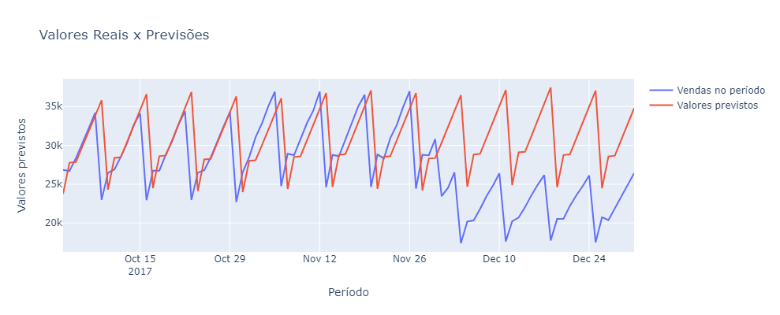

# Store Item Demand Forecasting Challenge
#### Predict 3 months of item sales at different stores

### Sumário

* <a href="#intro">1) DEFINIÇÃO DO PROBLEMA</a>
    * <a href="#">1.1) Objetivos da competição</a>
    * <a href="#">1.2) O que são séries temporais?</a>
    * <a href="#">1.3) Import das bibliotecas e carregando os dados de treino e teste</a>
<br/><br/>

* <a href="#analise">2) ANÁLISE EXPLORATÓRIA DOS DADOS</a>
    * <a href="#">Visão Geral</a>
    * <a href="#">Métrica de Avaliação</a>
        * <a href="#">Stationarity Test (Dickey Fuller)</a>
    * <a href="#">Variação de vendas entre as lojas</a>
    * <a href="#">Variação de vendas entre os itens</a>
    * <a href="#">Variabilidade por ano</a>
    * <a href="#">Variabilidade por meses</a>
    * <a href="#">Variabilidade por dia da semana</a>
    * <a href="#">Os padrões são degenerados?</a>
    * <a href="#">E a relação item-loja</a>
    * <a href="#">Visualização por Time Series</a>
<br/><br/>

* <a href="#model">3) MODELAGEM</a>
    * <a href="#">3.1) Construindo nosso primeiro modelo (Linear x Quadrático)</a>
    * <a href="#">3.2) Models ARIMA (Dados semanais agrupados)</a>
    * <a href="#">3.3) Models ARIMA (Dados semanais não agrupados)</a>
    * <a href="#">3.4) XGB Regressor (Extreme Boosting Gradient Regressor)</a>
<br/><br/>

* <a href="#final">4) CONSIDERAÇÕES FINAIS</a>

<hr/>

<h3 id="intro"> 1) DEFINIÇÃO DO PROBLEMA </h3>
&emsp;&emsp;Para comerciantes varejistas e atacadistas, realizar a projeção de vendas dos seus produtos e também estimar as vendas de seus concorrentes é uma tarefa comum. É importante para que os gestores das empresas possam tomar decisões a respeito de quais produtos a empresa deve ter mais em estoque, os melhores produtos para trabalhar o marketing, os produtos que devem ser deixados de lado, quais produtos colocar em promoções, além de várias outras medidas a serem tomadas a fim de obter um maior lucro para a empresa. <br/>
&emsp;&emsp;Essa missão normalmente é designada aos gestores que confiam em suas análises e vivências para tentar realizar a estimativa de vendas. O intuito deste projeto é realizar um modelo capaz de prever as vendas futuras com base nos dados históricos utilizando técnicas estatísticas, machine learning e deep learning. Com isso, fornecer mais uma ferramenta para auxilizar os gestores em suas tomadas de decisões sem necessariamente confiar em seus "feelings" do negócio, e sim em um modelo matemática capaz de explicar o que vai acontecer baseado nos eventos que já ocorreram.

<h5 id="intro11">1.1) Objetivos da competição</h5>
&emsp;&emsp;Esta competição é fornecida como uma forma de explorar diferentes técnicas de séries temporais em um conjunto de dados relativamente simples e limpo. O analista recebe 5 anos de dados de vendas de itens da loja e é solicitado a prever 3 meses de vendas para 50 itens diferentes em 10 lojas diferentes.<br/>
&emsp;&emsp;Qual é a melhor maneira de lidar com a sazonalidade? As lojas devem ser modeladas separadamente ou você pode agrupá-las? O aprendizado profundo funciona melhor que o ARIMA? Qualquer um pode vencer o xgboost?</br>
&emsp;&emsp;Esta é uma grande competição para explorar diferentes modelos e melhorar as habilidades com previsão. Aqui você encontra o link para a competição: https://www.kaggle.com/competitions/demand-forecasting-kernels-only/overview


<h5 id="intro12">1.2) O que são séries temporais?</h5>
Quando uma variável é medida e registrada sequencialmente em tempo durante ou em um intervalo fixo, chamado de intervalo amostral, os dados resultantes são chamados de série temporal. Observações coletadas em um intervalo amostral no passado recebem o nome de série temporal histórica e são usadas para analisar e entender o passado e para prever o futuro.<br/>

Séries temporais possuem três tipos de padrões, também chamados de componentes:
* **Tendência**: ocorre quando a variável da série temporal apresenta um aumento ou diminuição a longo prazo;
* **Sazonalidade**: corresponde a um padrão fixo que se repete no mesmo período de tempo (Ex.: aumento das vendas de roupa de praia no verão);
* **Ciclos**: ocorre quando os dados mostram subidas e quedas que não possuem um período fixo;
* **Erro aleatório**: diz respeito aos movimentos irregulares explicados por causas desconhecidas.

Outro importante elemento de uma série temporal é a frequência, que é define o intervalo de tempo que separa uma observação (um dado) de outra: diária, semanal, mensal, trimestral, anual, etc.


<h5 id="intro13">1.3) Import das bibliotecas e carregando os dados de treino e teste</h5>
O primeiro passo será importar todas as bibliotecas que iremos utilizar


```python
#Bibliotecas básicas para trabalhar com python
import pandas as pd
import numpy as np
from datetime import datetime

#Bibliotecas para exibição dos gráficos e afins
import matplotlib.pyplot as plt
import plotly.graph_objs as go
import seaborn as sns

#Bibliotecas para trabalhar com análise estatística dos dados
from scipy.spatial.distance import euclidean #used for fdt
import fastdtw as fdt #fast dynamic time warping
from statsmodels.tsa.arima_model import ARIMA
from statsmodels.tsa.arima_model import ARIMAResults
from statsmodels.tsa.stattools import adfuller #test if series is stationary (then can perform ARIMA)
import statsmodels.api as sm
from statsmodels.tsa.seasonal import seasonal_decompose

#Bibliocetas para utilização de modelos de Machine Learning
from sklearn.metrics import mean_squared_error, mean_absolute_error, r2_score, mean_squared_log_error
import xgboost as xgb
from xgboost import plot_importance
from sklearn.model_selection import train_test_split
```


```python
import warnings
warnings.filterwarnings("ignore")
```


```python
df_train = pd.read_csv('data/train.csv')
df_test = pd.read_csv('data/test.csv')
```

<hr/>

<h3 id="analise">2) ANÁLISE EXPLORATÓRIA DOS DADOS</h3>

Vamos começar fazendo uma análise exploratória dos dados, para ter uma ideia de quantas colunas os dados possuem, quantos registros, agrupamentos, se há dados missing/nulos, além de outras análises.<br/>
Como primeiro passo, vamos exibir quantos registros e quantas colunas há em ambos os datasets, o de treino e o de teste.

<h5 id="analise21">2.1) Visão Geral</h5>


```python
print('Shape Treino: {}'.format(df_train.shape))
print('Shape Teste: {}'.format(df_test.shape))
```

    Shape Treino: (913000, 4)
    Shape Teste: (45000, 4)
    


```python
df_train.head(5)
```


<div>
<style scoped>
    .dataframe tbody tr th:only-of-type {
        vertical-align: middle;
    }

    .dataframe tbody tr th {
        vertical-align: top;
    }

    .dataframe thead th {
        text-align: right;
    }
</style>
<table border="1" class="dataframe">
  <thead>
    <tr style="text-align: right;">
      <th></th>
      <th>date</th>
      <th>store</th>
      <th>item</th>
      <th>sales</th>
    </tr>
  </thead>
  <tbody>
    <tr>
      <th>0</th>
      <td>2013-01-01</td>
      <td>1</td>
      <td>1</td>
      <td>13</td>
    </tr>
    <tr>
      <th>1</th>
      <td>2013-01-02</td>
      <td>1</td>
      <td>1</td>
      <td>11</td>
    </tr>
    <tr>
      <th>2</th>
      <td>2013-01-03</td>
      <td>1</td>
      <td>1</td>
      <td>14</td>
    </tr>
    <tr>
      <th>3</th>
      <td>2013-01-04</td>
      <td>1</td>
      <td>1</td>
      <td>13</td>
    </tr>
    <tr>
      <th>4</th>
      <td>2013-01-05</td>
      <td>1</td>
      <td>1</td>
      <td>10</td>
    </tr>
  </tbody>
</table>
</div>


```python
df_test.head(5)
```


<div>
<style scoped>
    .dataframe tbody tr th:only-of-type {
        vertical-align: middle;
    }

    .dataframe tbody tr th {
        vertical-align: top;
    }

    .dataframe thead th {
        text-align: right;
    }
</style>
<table border="1" class="dataframe">
  <thead>
    <tr style="text-align: right;">
      <th></th>
      <th>id</th>
      <th>date</th>
      <th>store</th>
      <th>item</th>
    </tr>
  </thead>
  <tbody>
    <tr>
      <th>0</th>
      <td>0</td>
      <td>2018-01-01</td>
      <td>1</td>
      <td>1</td>
    </tr>
    <tr>
      <th>1</th>
      <td>1</td>
      <td>2018-01-02</td>
      <td>1</td>
      <td>1</td>
    </tr>
    <tr>
      <th>2</th>
      <td>2</td>
      <td>2018-01-03</td>
      <td>1</td>
      <td>1</td>
    </tr>
    <tr>
      <th>3</th>
      <td>3</td>
      <td>2018-01-04</td>
      <td>1</td>
      <td>1</td>
    </tr>
    <tr>
      <th>4</th>
      <td>4</td>
      <td>2018-01-05</td>
      <td>1</td>
      <td>1</td>
    </tr>
  </tbody>
</table>
</div>


Analisando pelo cabeçalho vemos que o dataset de treino possui quantro colunas:
* **date**: Data que o item foi vendido;
* **store**: Id da loja;
* **item**: Id do item;
* **sales**: Quantidade de vendas (Nossa variável target)

E no conjunto do teste, não temos a quantidade de sales, porém temos um atributo **id** do registro.


```python
df_train.describe()
```


<div>
<style scoped>
    .dataframe tbody tr th:only-of-type {
        vertical-align: middle;
    }

    .dataframe tbody tr th {
        vertical-align: top;
    }

    .dataframe thead th {
        text-align: right;
    }
</style>
<table border="1" class="dataframe">
  <thead>
    <tr style="text-align: right;">
      <th></th>
      <th>store</th>
      <th>item</th>
      <th>sales</th>
    </tr>
  </thead>
  <tbody>
    <tr>
      <th>count</th>
      <td>913000.000000</td>
      <td>913000.000000</td>
      <td>913000.000000</td>
    </tr>
    <tr>
      <th>mean</th>
      <td>5.500000</td>
      <td>25.500000</td>
      <td>52.250287</td>
    </tr>
    <tr>
      <th>std</th>
      <td>2.872283</td>
      <td>14.430878</td>
      <td>28.801144</td>
    </tr>
    <tr>
      <th>min</th>
      <td>1.000000</td>
      <td>1.000000</td>
      <td>0.000000</td>
    </tr>
    <tr>
      <th>25%</th>
      <td>3.000000</td>
      <td>13.000000</td>
      <td>30.000000</td>
    </tr>
    <tr>
      <th>50%</th>
      <td>5.500000</td>
      <td>25.500000</td>
      <td>47.000000</td>
    </tr>
    <tr>
      <th>75%</th>
      <td>8.000000</td>
      <td>38.000000</td>
      <td>70.000000</td>
    </tr>
    <tr>
      <th>max</th>
      <td>10.000000</td>
      <td>50.000000</td>
      <td>231.000000</td>
    </tr>
  </tbody>
</table>
</div>


Aqui temos algumas informações interessantes. A média de vendas é de 52.25, enquanto que a mediana é de 47. Isso significa que a presença de outliers não está impactando o resultado, dado que a amplitude da variável target é de : 0 vendas a 231 vendas, enquanto que a diferença entre média e mediana é de apenas 5.


```python
print('Dados nulos conjunto de treino')
print(df_train.isnull().sum())
print('\nDados nulos conjunto de testes')
print(df_test.isnull().sum())
```

    Dados nulos conjunto de treino
    date     0
    store    0
    item     0
    sales    0
    dtype: int64
    
    Dados nulos conjunto de testes
    id       0
    date     0
    store    0
    item     0
    dtype: int64
    

Vamos dividir as datas nos nossos dataset, assim vamos ter mais possibilidades de análises.


```python
def expand_df(df):
    data = df.copy()
    data['date'] = pd.to_datetime(data['date'])
    data['day'] = data['date'].dt.day
    data['month'] = data['date'].dt.month
    data['year'] = data['date'].dt.year
    data['dayofweek'] = data['date'].dt.dayofweek
    return data

df_train = expand_df(df_train)
df_test = expand_df(df_test)
```


```python
df_train.head()
```


<div>
<style scoped>
    .dataframe tbody tr th:only-of-type {
        vertical-align: middle;
    }

    .dataframe tbody tr th {
        vertical-align: top;
    }

    .dataframe thead th {
        text-align: right;
    }
</style>
<table border="1" class="dataframe">
  <thead>
    <tr style="text-align: right;">
      <th></th>
      <th>date</th>
      <th>store</th>
      <th>item</th>
      <th>sales</th>
      <th>day</th>
      <th>month</th>
      <th>year</th>
      <th>dayofweek</th>
    </tr>
  </thead>
  <tbody>
    <tr>
      <th>0</th>
      <td>2013-01-01</td>
      <td>1</td>
      <td>1</td>
      <td>13</td>
      <td>1</td>
      <td>1</td>
      <td>2013</td>
      <td>1</td>
    </tr>
    <tr>
      <th>1</th>
      <td>2013-01-02</td>
      <td>1</td>
      <td>1</td>
      <td>11</td>
      <td>2</td>
      <td>1</td>
      <td>2013</td>
      <td>2</td>
    </tr>
    <tr>
      <th>2</th>
      <td>2013-01-03</td>
      <td>1</td>
      <td>1</td>
      <td>14</td>
      <td>3</td>
      <td>1</td>
      <td>2013</td>
      <td>3</td>
    </tr>
    <tr>
      <th>3</th>
      <td>2013-01-04</td>
      <td>1</td>
      <td>1</td>
      <td>13</td>
      <td>4</td>
      <td>1</td>
      <td>2013</td>
      <td>4</td>
    </tr>
    <tr>
      <th>4</th>
      <td>2013-01-05</td>
      <td>1</td>
      <td>1</td>
      <td>10</td>
      <td>5</td>
      <td>1</td>
      <td>2013</td>
      <td>5</td>
    </tr>
  </tbody>
</table>
</div>


Esse conjunto de dados está bem limpo, não há registros missing/nulos, portanto não precisaremos realizar esta etapa no pré processamento dos dados.


```python
df_sales = df_train.copy()
df_sales['bins_sales'] = pd.cut(df_sales['sales'], [-1, 50, 100, 150, 200, 250, 300])
total_sales = df_sales.shape[0]
df_percent = pd.DataFrame(pd.value_counts(df_sales['bins_sales']).apply(lambda s: round((s/total_sales)*100, 2)))
df_percent.reset_index(inplace=True)
df_percent.columns = ['Grupo', 'Porcentagem']
df_percent
```


<div>
<style scoped>
    .dataframe tbody tr th:only-of-type {
        vertical-align: middle;
    }

    .dataframe tbody tr th {
        vertical-align: top;
    }

    .dataframe thead th {
        text-align: right;
    }
</style>
<table border="1" class="dataframe">
  <thead>
    <tr style="text-align: right;">
      <th></th>
      <th>Grupo</th>
      <th>Porcentagem</th>
    </tr>
  </thead>
  <tbody>
    <tr>
      <th>0</th>
      <td>(-1, 50]</td>
      <td>54.59</td>
    </tr>
    <tr>
      <th>1</th>
      <td>(50, 100]</td>
      <td>38.39</td>
    </tr>
    <tr>
      <th>2</th>
      <td>(100, 150]</td>
      <td>6.71</td>
    </tr>
    <tr>
      <th>3</th>
      <td>(150, 200]</td>
      <td>0.31</td>
    </tr>
    <tr>
      <th>4</th>
      <td>(200, 250]</td>
      <td>0.00</td>
    </tr>
    <tr>
      <th>5</th>
      <td>(250, 300]</td>
      <td>0.00</td>
    </tr>
  </tbody>
</table>
</div>


Aqui geramos um dataset temporário para agrupar as vendas por grupos e exibir a porcentagem correspondente a cada grupo:
* 0-50 vendas: 54.59% dos dados estão agrupados neste grupo.
* 50-100 vendas: 38.39% dos dados estão agrupados aqui.
* 100-250 vendas: Somente 7% dos dados compõem o restante dos grupos. <br/>

Isso implica que os modelos que iremos desenvolver deverão lidar com a assimetria (skewness) dos dados.

<h5 id="analise22">2.2) Métrica de Avaliação</h5>

<h5 id="analise221">2.2.1) Stationarity Test (Dickey Fuller)</h5>
Os dados da série temporal devem ser estacionários antes de aplicar um modelo ARIMA. Estacionário significa que a média, o desvio padrão e a variância não mudam ao longo do tempo. A função abaixo testa se uma Série Temporal é estacionária ou não.


```python
def Fuller(TimeSeries):
    """Fornece resultados de teste mais completos para séries temporais"""
    stationary_test = adfuller(TimeSeries)
    print('ADF Statistic: %f' % stationary_test[0])
    print('p-value: %f' % stationary_test[1])
    print('Critical Values:')
    for key, value in stationary_test[4].items():
        print('\t%s: %.3f' % (key, value))

```

<h5 id="analise23">2.3) Variação de vendas entre as lojas</h5>
Agora vamos observar como as vendas variam entre cada loja e obter uma visão geral da distribuição de vendas em todos os dados.


```python
df_train.head()
```


<div>
<style scoped>
    .dataframe tbody tr th:only-of-type {
        vertical-align: middle;
    }

    .dataframe tbody tr th {
        vertical-align: top;
    }

    .dataframe thead th {
        text-align: right;
    }
</style>
<table border="1" class="dataframe">
  <thead>
    <tr style="text-align: right;">
      <th></th>
      <th>date</th>
      <th>store</th>
      <th>item</th>
      <th>sales</th>
      <th>day</th>
      <th>month</th>
      <th>year</th>
      <th>dayofweek</th>
    </tr>
  </thead>
  <tbody>
    <tr>
      <th>0</th>
      <td>2013-01-01</td>
      <td>1</td>
      <td>1</td>
      <td>13</td>
      <td>1</td>
      <td>1</td>
      <td>2013</td>
      <td>1</td>
    </tr>
    <tr>
      <th>1</th>
      <td>2013-01-02</td>
      <td>1</td>
      <td>1</td>
      <td>11</td>
      <td>2</td>
      <td>1</td>
      <td>2013</td>
      <td>2</td>
    </tr>
    <tr>
      <th>2</th>
      <td>2013-01-03</td>
      <td>1</td>
      <td>1</td>
      <td>14</td>
      <td>3</td>
      <td>1</td>
      <td>2013</td>
      <td>3</td>
    </tr>
    <tr>
      <th>3</th>
      <td>2013-01-04</td>
      <td>1</td>
      <td>1</td>
      <td>13</td>
      <td>4</td>
      <td>1</td>
      <td>2013</td>
      <td>4</td>
    </tr>
    <tr>
      <th>4</th>
      <td>2013-01-05</td>
      <td>1</td>
      <td>1</td>
      <td>10</td>
      <td>5</td>
      <td>1</td>
      <td>2013</td>
      <td>5</td>
    </tr>
  </tbody>
</table>
</div>


```python
# Vamos entender como as vendas estão distribuídas por lojas, vamos realizar o pivot dos dados e aplicar a função média de vendas por item.
df_store = df_train.copy()
df_sales_pivoted = pd.pivot_table(df_store, index='store', values=['sales'], columns='item', aggfunc=np.sum)
# Dataframe com Pivot
display(df_sales_pivoted)
```


<div>
<style scoped>
    .dataframe tbody tr th:only-of-type {
        vertical-align: middle;
    }

    .dataframe tbody tr th {
        vertical-align: top;
    }

    .dataframe thead tr th {
        text-align: left;
    }

    .dataframe thead tr:last-of-type th {
        text-align: right;
    }
</style>
<table border="1" class="dataframe">
  <thead>
    <tr>
      <th></th>
      <th colspan="21" halign="left">sales</th>
    </tr>
    <tr>
      <th>item</th>
      <th>1</th>
      <th>2</th>
      <th>3</th>
      <th>4</th>
      <th>5</th>
      <th>6</th>
      <th>7</th>
      <th>8</th>
      <th>9</th>
      <th>10</th>
      <th>...</th>
      <th>41</th>
      <th>42</th>
      <th>43</th>
      <th>44</th>
      <th>45</th>
      <th>46</th>
      <th>47</th>
      <th>48</th>
      <th>49</th>
      <th>50</th>
    </tr>
    <tr>
      <th>store</th>
      <th></th>
      <th></th>
      <th></th>
      <th></th>
      <th></th>
      <th></th>
      <th></th>
      <th></th>
      <th></th>
      <th></th>
      <th></th>
      <th></th>
      <th></th>
      <th></th>
      <th></th>
      <th></th>
      <th></th>
      <th></th>
      <th></th>
      <th></th>
      <th></th>
    </tr>
  </thead>
  <tbody>
    <tr>
      <th>1</th>
      <td>36468</td>
      <td>97050</td>
      <td>60638</td>
      <td>36440</td>
      <td>30335</td>
      <td>96889</td>
      <td>96383</td>
      <td>126856</td>
      <td>84918</td>
      <td>121163</td>
      <td>...</td>
      <td>36525</td>
      <td>60451</td>
      <td>84439</td>
      <td>48561</td>
      <td>132788</td>
      <td>96495</td>
      <td>36181</td>
      <td>84993</td>
      <td>48319</td>
      <td>108360</td>
    </tr>
    <tr>
      <th>2</th>
      <td>51445</td>
      <td>137528</td>
      <td>85808</td>
      <td>51557</td>
      <td>42985</td>
      <td>136850</td>
      <td>137057</td>
      <td>180939</td>
      <td>119563</td>
      <td>171822</td>
      <td>...</td>
      <td>51255</td>
      <td>86494</td>
      <td>120124</td>
      <td>68997</td>
      <td>188774</td>
      <td>137351</td>
      <td>51471</td>
      <td>120568</td>
      <td>68862</td>
      <td>154520</td>
    </tr>
    <tr>
      <th>3</th>
      <td>45778</td>
      <td>121985</td>
      <td>76274</td>
      <td>45862</td>
      <td>38086</td>
      <td>122355</td>
      <td>121699</td>
      <td>159807</td>
      <td>106797</td>
      <td>152266</td>
      <td>...</td>
      <td>45630</td>
      <td>76322</td>
      <td>106269</td>
      <td>60963</td>
      <td>167720</td>
      <td>121882</td>
      <td>45870</td>
      <td>107188</td>
      <td>60732</td>
      <td>136874</td>
    </tr>
    <tr>
      <th>4</th>
      <td>41886</td>
      <td>112692</td>
      <td>70389</td>
      <td>42156</td>
      <td>35653</td>
      <td>111880</td>
      <td>112528</td>
      <td>147577</td>
      <td>98684</td>
      <td>140689</td>
      <td>...</td>
      <td>42305</td>
      <td>70374</td>
      <td>98638</td>
      <td>56519</td>
      <td>154639</td>
      <td>112153</td>
      <td>42207</td>
      <td>98176</td>
      <td>56315</td>
      <td>125851</td>
    </tr>
    <tr>
      <th>5</th>
      <td>30566</td>
      <td>81236</td>
      <td>50828</td>
      <td>30634</td>
      <td>25722</td>
      <td>81375</td>
      <td>81322</td>
      <td>106941</td>
      <td>70917</td>
      <td>101361</td>
      <td>...</td>
      <td>30733</td>
      <td>50636</td>
      <td>71512</td>
      <td>40930</td>
      <td>112166</td>
      <td>81686</td>
      <td>30493</td>
      <td>71728</td>
      <td>40851</td>
      <td>91883</td>
    </tr>
    <tr>
      <th>6</th>
      <td>30527</td>
      <td>81319</td>
      <td>50783</td>
      <td>30593</td>
      <td>25369</td>
      <td>81264</td>
      <td>81438</td>
      <td>106612</td>
      <td>72054</td>
      <td>101462</td>
      <td>...</td>
      <td>30325</td>
      <td>50933</td>
      <td>71277</td>
      <td>40761</td>
      <td>111647</td>
      <td>81330</td>
      <td>30510</td>
      <td>71310</td>
      <td>40503</td>
      <td>92243</td>
    </tr>
    <tr>
      <th>7</th>
      <td>27681</td>
      <td>74351</td>
      <td>46620</td>
      <td>28044</td>
      <td>23252</td>
      <td>74325</td>
      <td>74336</td>
      <td>98100</td>
      <td>65557</td>
      <td>93412</td>
      <td>...</td>
      <td>28251</td>
      <td>46446</td>
      <td>64688</td>
      <td>37335</td>
      <td>102084</td>
      <td>74553</td>
      <td>28265</td>
      <td>65050</td>
      <td>37262</td>
      <td>83674</td>
    </tr>
    <tr>
      <th>8</th>
      <td>49272</td>
      <td>130845</td>
      <td>82309</td>
      <td>49208</td>
      <td>40953</td>
      <td>131396</td>
      <td>130980</td>
      <td>172486</td>
      <td>115391</td>
      <td>164008</td>
      <td>...</td>
      <td>49368</td>
      <td>82433</td>
      <td>115002</td>
      <td>66091</td>
      <td>180667</td>
      <td>131481</td>
      <td>49576</td>
      <td>114558</td>
      <td>65800</td>
      <td>147855</td>
    </tr>
    <tr>
      <th>9</th>
      <td>42593</td>
      <td>112833</td>
      <td>70365</td>
      <td>42272</td>
      <td>35191</td>
      <td>112139</td>
      <td>112869</td>
      <td>148431</td>
      <td>98797</td>
      <td>140794</td>
      <td>...</td>
      <td>42347</td>
      <td>70563</td>
      <td>98883</td>
      <td>56548</td>
      <td>155381</td>
      <td>113232</td>
      <td>42004</td>
      <td>98562</td>
      <td>56702</td>
      <td>126557</td>
    </tr>
    <tr>
      <th>10</th>
      <td>45168</td>
      <td>119725</td>
      <td>75073</td>
      <td>45141</td>
      <td>37684</td>
      <td>119808</td>
      <td>120165</td>
      <td>157359</td>
      <td>105701</td>
      <td>150156</td>
      <td>...</td>
      <td>45020</td>
      <td>75273</td>
      <td>105803</td>
      <td>60106</td>
      <td>165601</td>
      <td>120601</td>
      <td>45204</td>
      <td>105570</td>
      <td>60317</td>
      <td>135192</td>
    </tr>
  </tbody>
</table>
<p>10 rows × 50 columns</p>
</div>


```python
for i in range(len(df_sales_pivoted.index)):
    fig = go.Figure()
    fig.add_trace(go.Bar(
        x=np.arange(0, len(df_sales_pivoted.values[i])) + 1,
        y=df_sales_pivoted.values[i],
    ))

    fig.update_layout(
        title='<span>Vendas da loja {}</span>'.format(str(i)), 
        autosize=False,
        width=1200,
        height=300,
        yaxis=dict(title='<span>Quantidade</span>'),
        xaxis=dict(title='<span>Itens</span>')
        )

    fig.show()

```


    

    


    

    


    

    


    

    


    

    


    

    


    

    


    

    


    

    


    

    


Podemos perceber que a proporção de produtos vendidos para cada loja segue um padrão, por exemplo o produto 1 vende menos que o produto 2 em todas as lojas e assim sucessivamente.


```python
sr_sales = df_sales.groupby('store')['sales'].sum()

fig = go.Figure()
fig.add_trace(go.Bar(
    x=sr_sales.index.astype(str), 
    y=sr_sales.values,
    text=sr_sales.values,
))

fig.update_layout(
        title='<span>Total de vendas por loja</span>', 
        autosize=False,
        width=1000,
        height=500,
        yaxis=dict(title='<span>Quantidade</span>'),
        xaxis=dict(title='<span>Loja</span>')
    )

fig.show()
```


    

    


Com os dados que temos podemos notar que a loja 2 é a campeã em vendas, seguida da loja 8, enquanto que as lojas 5, 6 e 7 estão bem atrás na quantidade de itens vendidos.


```python
df_store = df_train.copy()
df_storeMean = pd.pivot_table(df_store, index='store', values=['sales'], columns='item', aggfunc=np.mean)
df_storeMean['avg_sale'] = df_storeMean.apply(lambda r: r.mean(), axis=1)
df_storeMean.head(10)
```


<div>
<style scoped>
    .dataframe tbody tr th:only-of-type {
        vertical-align: middle;
    }

    .dataframe tbody tr th {
        vertical-align: top;
    }

    .dataframe thead tr th {
        text-align: left;
    }

    .dataframe thead tr:last-of-type th {
        text-align: right;
    }
</style>
<table border="1" class="dataframe">
  <thead>
    <tr>
      <th></th>
      <th colspan="20" halign="left">sales</th>
      <th>avg_sale</th>
    </tr>
    <tr>
      <th>item</th>
      <th>1</th>
      <th>2</th>
      <th>3</th>
      <th>4</th>
      <th>5</th>
      <th>6</th>
      <th>7</th>
      <th>8</th>
      <th>9</th>
      <th>10</th>
      <th>...</th>
      <th>42</th>
      <th>43</th>
      <th>44</th>
      <th>45</th>
      <th>46</th>
      <th>47</th>
      <th>48</th>
      <th>49</th>
      <th>50</th>
      <th></th>
    </tr>
    <tr>
      <th>store</th>
      <th></th>
      <th></th>
      <th></th>
      <th></th>
      <th></th>
      <th></th>
      <th></th>
      <th></th>
      <th></th>
      <th></th>
      <th></th>
      <th></th>
      <th></th>
      <th></th>
      <th></th>
      <th></th>
      <th></th>
      <th></th>
      <th></th>
      <th></th>
      <th></th>
    </tr>
  </thead>
  <tbody>
    <tr>
      <th>1</th>
      <td>19.971522</td>
      <td>53.148959</td>
      <td>33.208105</td>
      <td>19.956188</td>
      <td>16.612815</td>
      <td>53.060789</td>
      <td>52.783680</td>
      <td>69.472070</td>
      <td>46.504929</td>
      <td>66.354326</td>
      <td>...</td>
      <td>33.105696</td>
      <td>46.242607</td>
      <td>26.594195</td>
      <td>72.720701</td>
      <td>52.845016</td>
      <td>19.814348</td>
      <td>46.546002</td>
      <td>26.461665</td>
      <td>59.342826</td>
      <td>47.268379</td>
    </tr>
    <tr>
      <th>2</th>
      <td>28.173604</td>
      <td>75.316539</td>
      <td>46.992333</td>
      <td>28.234940</td>
      <td>23.540526</td>
      <td>74.945235</td>
      <td>75.058598</td>
      <td>99.090361</td>
      <td>65.478094</td>
      <td>94.097481</td>
      <td>...</td>
      <td>47.368018</td>
      <td>65.785323</td>
      <td>37.785871</td>
      <td>103.381161</td>
      <td>75.219606</td>
      <td>28.187842</td>
      <td>66.028478</td>
      <td>37.711939</td>
      <td>84.622125</td>
      <td>67.033165</td>
    </tr>
    <tr>
      <th>3</th>
      <td>25.070099</td>
      <td>66.804491</td>
      <td>41.771084</td>
      <td>25.116101</td>
      <td>20.857612</td>
      <td>67.007119</td>
      <td>66.647864</td>
      <td>87.517525</td>
      <td>58.486857</td>
      <td>83.387733</td>
      <td>...</td>
      <td>41.797371</td>
      <td>58.197700</td>
      <td>33.386090</td>
      <td>91.851041</td>
      <td>66.748083</td>
      <td>25.120482</td>
      <td>58.700986</td>
      <td>33.259584</td>
      <td>74.958379</td>
      <td>59.530602</td>
    </tr>
    <tr>
      <th>4</th>
      <td>22.938664</td>
      <td>61.715225</td>
      <td>38.548193</td>
      <td>23.086528</td>
      <td>19.525192</td>
      <td>61.270537</td>
      <td>61.625411</td>
      <td>80.819825</td>
      <td>54.043812</td>
      <td>77.047645</td>
      <td>...</td>
      <td>38.539978</td>
      <td>54.018620</td>
      <td>30.952355</td>
      <td>84.687295</td>
      <td>61.420044</td>
      <td>23.114458</td>
      <td>53.765608</td>
      <td>30.840635</td>
      <td>68.921687</td>
      <td>54.902946</td>
    </tr>
    <tr>
      <th>5</th>
      <td>16.739321</td>
      <td>44.488499</td>
      <td>27.835706</td>
      <td>16.776561</td>
      <td>14.086528</td>
      <td>44.564622</td>
      <td>44.535597</td>
      <td>58.565717</td>
      <td>38.837349</td>
      <td>55.509858</td>
      <td>...</td>
      <td>27.730559</td>
      <td>39.163198</td>
      <td>22.415115</td>
      <td>61.427163</td>
      <td>44.734940</td>
      <td>16.699343</td>
      <td>39.281490</td>
      <td>22.371851</td>
      <td>50.319277</td>
      <td>39.770164</td>
    </tr>
    <tr>
      <th>6</th>
      <td>16.717963</td>
      <td>44.533954</td>
      <td>27.811062</td>
      <td>16.754107</td>
      <td>13.893209</td>
      <td>44.503834</td>
      <td>44.599124</td>
      <td>58.385542</td>
      <td>39.460022</td>
      <td>55.565170</td>
      <td>...</td>
      <td>27.893209</td>
      <td>39.034502</td>
      <td>22.322563</td>
      <td>61.142935</td>
      <td>44.539978</td>
      <td>16.708653</td>
      <td>39.052574</td>
      <td>22.181271</td>
      <td>50.516429</td>
      <td>39.733516</td>
    </tr>
    <tr>
      <th>7</th>
      <td>15.159365</td>
      <td>40.717963</td>
      <td>25.531216</td>
      <td>15.358160</td>
      <td>12.733844</td>
      <td>40.703724</td>
      <td>40.709748</td>
      <td>53.723987</td>
      <td>35.901972</td>
      <td>51.156627</td>
      <td>...</td>
      <td>25.435926</td>
      <td>35.426068</td>
      <td>20.446331</td>
      <td>55.905805</td>
      <td>40.828587</td>
      <td>15.479189</td>
      <td>35.624315</td>
      <td>20.406353</td>
      <td>45.823658</td>
      <td>36.363735</td>
    </tr>
    <tr>
      <th>8</th>
      <td>26.983571</td>
      <td>71.656627</td>
      <td>45.076123</td>
      <td>26.948521</td>
      <td>22.427711</td>
      <td>71.958379</td>
      <td>71.730559</td>
      <td>94.461117</td>
      <td>63.193319</td>
      <td>89.818182</td>
      <td>...</td>
      <td>45.144031</td>
      <td>62.980285</td>
      <td>36.194414</td>
      <td>98.941402</td>
      <td>72.004929</td>
      <td>27.150055</td>
      <td>62.737130</td>
      <td>36.035049</td>
      <td>80.972070</td>
      <td>64.142048</td>
    </tr>
    <tr>
      <th>9</th>
      <td>23.325849</td>
      <td>61.792442</td>
      <td>38.535049</td>
      <td>23.150055</td>
      <td>19.272180</td>
      <td>61.412377</td>
      <td>61.812158</td>
      <td>81.287514</td>
      <td>54.105696</td>
      <td>77.105148</td>
      <td>...</td>
      <td>38.643483</td>
      <td>54.152793</td>
      <td>30.968237</td>
      <td>85.093647</td>
      <td>62.010953</td>
      <td>23.003286</td>
      <td>53.976999</td>
      <td>31.052574</td>
      <td>69.308324</td>
      <td>55.049025</td>
    </tr>
    <tr>
      <th>10</th>
      <td>24.736035</td>
      <td>65.566813</td>
      <td>41.113363</td>
      <td>24.721249</td>
      <td>20.637459</td>
      <td>65.612267</td>
      <td>65.807777</td>
      <td>86.176889</td>
      <td>57.886637</td>
      <td>82.232202</td>
      <td>...</td>
      <td>41.222892</td>
      <td>57.942497</td>
      <td>32.916758</td>
      <td>90.690581</td>
      <td>66.046550</td>
      <td>24.755750</td>
      <td>57.814896</td>
      <td>33.032311</td>
      <td>74.037240</td>
      <td>58.709288</td>
    </tr>
  </tbody>
</table>
<p>10 rows × 51 columns</p>
</div>


```python
fig = go.Figure()
fig.add_trace(go.Scatter(
    y = df_storeMean['avg_sale'].values,
    mode='markers',
    marker=dict(
        size = df_storeMean['avg_sale'].values,
        color = df_storeMean['avg_sale'].values,
        colorscale = 'Viridis',
        showscale = True

    ),
    text = df_storeMean.index.values
))

fig.update_layout(
        title='<span>Média de vendas por loja</span>', 
        autosize=False,
        width=700,
        height=500,
        yaxis=dict(title='<span>Média de vendas</span>'),
        xaxis=dict(title='<span>Lojas</span>')
    )

fig.show()
```


    

    


Outra forma de visualizar a informação que tinhamos visto anteriormente. O gráfico só confirma que as lojas 2 e 8 são as que mais vendem enquanto que as lojas 4, 5 e 6 são as que estão vendendo menos.

<h5 id="analise24">2.4) Variação de vendas entre os itens</h5>


```python
sr_sales = df_sales.groupby('item')['sales'].sum()
sr_sales.sort_values(ascending=False, inplace=True)

fig = go.Figure()
fig.add_trace(go.Bar(
    x=sr_sales.index.astype(str)[0:15], 
    y=sr_sales.values[0:15],
    text=sr_sales.values[0:15],
))

fig.update_layout(
        title='<span>Total de vendas por item</span>', 
        autosize=False,
        width=1300,
        height=500,
        yaxis=dict(title='<span>Quantidade</span>'),
        xaxis=dict(title='<span>Item</span>')
    )

fig.show()
```


    

    


Observamos que os dez produtos mais vendidos são: 15, 28, 13, 18, 25, 45, 38, 22, 36 e 8, respectivamente.

<h5 id="analise25">2.5) Variabilidade por ano</h5>
Vamos ver como os itens e lojas crescem ao longo dos anos.


```python
dfAggYearItem = pd.pivot_table(df_train, index='year', columns='item', values='sales', aggfunc=np.mean).values
dfAggYearStore = pd.pivot_table(df_train, index='year', columns='store', values='sales', aggfunc=np.mean).values

plt.figure(figsize=(12, 5))
plt.subplot(121)
plt.plot(dfAggYearItem / dfAggYearItem.mean(0)[np.newaxis])
plt.title("Items")
plt.xlabel("Year")
plt.ylabel("Relative Sales")
plt.subplot(122)
plt.plot(dfAggYearStore / dfAggYearStore.mean(0)[np.newaxis])
plt.title("Stores")
plt.xlabel("Year")
plt.ylabel("Relative Sales")
plt.show()
```


    

    


<h5 id="analise26">2.6) Variabilidade por meses</h5>

Vejamos como as vendas dos itens por loja se comportam no decorrer dos meses. 


```python
dfAggMonthItem = pd.pivot_table(df_train, index='month', columns='item', values='sales', aggfunc=np.mean).values
dfAggMonthStore = pd.pivot_table(df_train, index='month', columns='store', values='sales', aggfunc=np.mean).values

plt.figure(figsize=(12, 5))
plt.subplot(121)
plt.plot(dfAggMonthItem / dfAggMonthItem.mean(0)[np.newaxis])
plt.title("Items")
plt.xlabel("Month")
plt.ylabel("Relative Sales")
plt.subplot(122)
plt.plot(dfAggMonthStore / dfAggMonthStore.mean(0)[np.newaxis])
plt.title("Stores")
plt.xlabel("Month")
plt.ylabel("Relative Sales")
plt.show()
```


    

    


<h5 id="analise27">2.7) Variabilidade por dia da semana</h5>

Assim como os dois tópicos anteriores, agora é hora de ver como as vendas por lojas se comportam nos dias da semana. Como as vendas variam por dia da semana? Existe sazonalidade também? As lojas compartilham as mesmas tendências?


```python
df_day = df_train.copy()
df_day.set_index(pd.to_datetime(df_day['date']), inplace=True) 
df_day.drop(columns='date', inplace=True)
df_day['Day'] = df_day.index.to_series().dt.day_name()

df_day.head()
```


<div>
<style scoped>
    .dataframe tbody tr th:only-of-type {
        vertical-align: middle;
    }

    .dataframe tbody tr th {
        vertical-align: top;
    }

    .dataframe thead th {
        text-align: right;
    }
</style>
<table border="1" class="dataframe">
  <thead>
    <tr style="text-align: right;">
      <th></th>
      <th>store</th>
      <th>item</th>
      <th>sales</th>
      <th>day</th>
      <th>month</th>
      <th>year</th>
      <th>dayofweek</th>
      <th>Day</th>
    </tr>
    <tr>
      <th>date</th>
      <th></th>
      <th></th>
      <th></th>
      <th></th>
      <th></th>
      <th></th>
      <th></th>
      <th></th>
    </tr>
  </thead>
  <tbody>
    <tr>
      <th>2013-01-01</th>
      <td>1</td>
      <td>1</td>
      <td>13</td>
      <td>1</td>
      <td>1</td>
      <td>2013</td>
      <td>1</td>
      <td>Tuesday</td>
    </tr>
    <tr>
      <th>2013-01-02</th>
      <td>1</td>
      <td>1</td>
      <td>11</td>
      <td>2</td>
      <td>1</td>
      <td>2013</td>
      <td>2</td>
      <td>Wednesday</td>
    </tr>
    <tr>
      <th>2013-01-03</th>
      <td>1</td>
      <td>1</td>
      <td>14</td>
      <td>3</td>
      <td>1</td>
      <td>2013</td>
      <td>3</td>
      <td>Thursday</td>
    </tr>
    <tr>
      <th>2013-01-04</th>
      <td>1</td>
      <td>1</td>
      <td>13</td>
      <td>4</td>
      <td>1</td>
      <td>2013</td>
      <td>4</td>
      <td>Friday</td>
    </tr>
    <tr>
      <th>2013-01-05</th>
      <td>1</td>
      <td>1</td>
      <td>10</td>
      <td>5</td>
      <td>1</td>
      <td>2013</td>
      <td>5</td>
      <td>Saturday</td>
    </tr>
  </tbody>
</table>
</div>


```python
df_dow_store = df_day.groupby(['store','Day']).sum()['sales'].groupby(level=0).apply(lambda x: 100* x/ x.sum()).unstack().loc[:,['Monday',
    'Tuesday',
    'Wednesday',
    'Thursday',
    'Friday',
    'Saturday',
    'Sunday']]

plt.rcParams["figure.figsize"] = [10,6]

sns.heatmap(df_dow_store, cmap='Blues', linewidths=0.01, linecolor='gray', annot=True).set_title('% do dia do total de vendas por loja')
plt.show()
```


    

    


O gráfico acima mostra o % mix de vendas da loja por dia. Podemos ver que as lojas são muito parecidas em quais dias são populares.

Vamos fazer o mesmo para os itens.


```python
df_dow_item = df_day.groupby(['item','Day']).sum()['sales'].groupby(level=0).apply( lambda x: 100* x/ x.sum()).unstack().loc[:,['Monday', 
    'Tuesday', 
    'Wednesday',
    'Thursday', 
    'Friday', 
    'Saturday', 
    'Sunday']]

plt.rcParams["figure.figsize"] = [10,16]
sns.heatmap(df_dow_item, cmap='Blues', linewidths=0.01, linecolor='gray', annot=True).set_title('Dia % do total de vendas por item')
plt.show()
```


    

    


Esse gráfico nos diz que as vendas de cada item são quase idênticas em termos de quais dias são mais populares.

Agora vamos ver se cada dia geralmente tende a mesma que a semana total.


```python
df_dow = pd.DataFrame(df_day.groupby(['date','Day']).sum()['sales']).unstack()['sales'].loc[:,['Monday', 
    'Tuesday', 
    'Wednesday', 
    'Thursday', 
    'Friday', 
    'Saturday', 
    'Sunday']]
df_dow = df_dow.resample('7D',label='left').sum()
df_dow.sort_index(inplace = True)
```


```python
fig = go.Figure()

for column in df_dow:
    fig.add_trace(go.Scatter(
        x=df_dow.index,
        y=df_dow[column],
        name=column
    ))

fig.update_layout(
    title='<span>Vendas por dias da semana</span>', 
    autosize=False,
    width=1250,
    height=400,
    xaxis=dict(title='<span>Período</span>'),
    yaxis=dict(title='<span>Quantidade de vendas</span>')
)
fig.show()
```


    

    


```python
dfAggDowItem = pd.pivot_table(df_train, index='dayofweek', columns='item', values='sales', aggfunc=np.mean).values
dfAggDowStore = pd.pivot_table(df_train, index='dayofweek', columns='store', values='sales', aggfunc=np.mean).values

plt.figure(figsize=(12, 5))
plt.subplot(121)
plt.plot(dfAggDowItem / dfAggDowItem.mean(0)[np.newaxis])
plt.title("Items")
plt.xlabel("Day of Week")
plt.ylabel("Relative Sales")
plt.subplot(122)
plt.plot(dfAggDowStore / dfAggDowStore.mean(0)[np.newaxis])
plt.title("Stores")
plt.xlabel("Day of Week")
plt.ylabel("Relative Sales")
plt.show()
```


    

    


**Conclusão do dia da semana**<br/>
O dia da semana afeta as vendas, no entanto, todas as lojas e itens têm distribuições semelhantes. As tendências do dia da semana seguem a tendência semanal geral. são mais populares. O dia geralmente tende a mesma que a semana total.

<h5 id="analise28">2.8) Os padrões são degenerados?</h5>

Esses padrões são degenerados?
Esta é uma importante questão. A não verificação de degenerações nos dados pode levar à perda de tendências importantes em conjuntos de dados complexos. Por exemplo, ao analisar os padrões mensais, calculamos a média de todos os dias do mês, anos e itens ou lojas. Mas e se as vendas tiverem uma dependência multidimensional de dois desses parâmetros que não são facilmente separáveis? Portanto, sempre verifique se há degenerações nos dados!


```python
dfAggDowMonth = pd.pivot_table(df_train, index='dayofweek', columns='month', values='sales', aggfunc=np.mean).values
dfAggMonthYear = pd.pivot_table(df_train, index='month', columns='year', values='sales', aggfunc=np.mean).values
dfAggDowYear = pd.pivot_table(df_train, index='dayofweek', columns='year', values='sales', aggfunc=np.mean).values

plt.figure(figsize=(18, 5))
plt.subplot(131)
plt.plot(dfAggDowMonth / dfAggDowMonth.mean(0)[np.newaxis])
plt.title("Months")
plt.xlabel("Day of Week")
plt.ylabel("Relative Sales")
plt.subplot(132)
plt.plot(dfAggMonthYear / dfAggMonthYear.mean(0)[np.newaxis])
plt.title("Years")
plt.xlabel("Months")
plt.ylabel("Relative Sales")
plt.subplot(133)
plt.plot(dfAggDowYear / dfAggDowYear.mean(0)[np.newaxis])
plt.title("Years")
plt.xlabel("Day of Week")
plt.ylabel("Relative Sales")
plt.show()
```


    

    


Neste caso, no entanto, não parece haver nenhuma degeneração sorrateira. Podemos efetivamente tratar o "mês", "ano", "dia da semana", "item" e "loja" como modificadores completamente independentes da previsão de vendas. Isso leva a um modelo de previsão muito simples.

"Vendas relativas" nos gráficos acima são as vendas relativas à média. Uma vez que existem padrões muito regulares nas tendências "mês", "dia da semana" e "ano". Tudo o que temos a fazer é simplesmente memorizar essas tendências e aplicá-las às nossas previsões, multiplicando-as pelas vendas médias esperadas. Obtemos as vendas médias esperadas de um item em uma loja a partir dos números históricos no conjunto de treinamento.

<h5 id="analise29">2.9) E a relação item-loja</h5>
Vimos como as lojas e os itens tendem por si só, mas algumas lojas vendem mais de um item? Ou seja: as lojas têm o mesmo mix de vendas? Os itens são vendidos uniformemente (em porcentagem) em todas as lojas?

Abaixo está um gráfico para a distribuição percentual das vendas de cada item nas lojas (cada linha soma 100%). Como podemos ver, é muito uniforme. A vantagem aqui é que os itens são vendidos uniformemente nas lojas.


```python
plt.rcParams["figure.figsize"] = [20,16]
df_store_item = df_train.groupby(by=['item','store']).sum()['sales'].groupby(level=0).apply(lambda x: 100* x/ x.sum()).unstack()
sns.heatmap(df_store_item, cmap='Blues', linewidths=0.01, linecolor='gray', annot=True).set_title('Store % of Total Sales by Item')
plt.show()
```


    

    


Agora, para confirmar, vamos ver a % de distribuição das vendas de cada loja nos diferentes itens (cada linha soma 100%).

Podemos ver que cada loja vendeu aproximadamente a mesma porcentagem de cada item.


```python
plt.rcParams["figure.figsize"] = [26,6]
df_item_store = df_train.groupby(by=['store','item']).sum()['sales'].groupby(level=0).apply(lambda x: 100* x/ x.sum()).unstack()
sns.heatmap(df_item_store , cmap='Blues', linewidths=0.01, linecolor='gray', annot=True).set_title('Item % of Total Sales by Store')
plt.show()
```


    

    


```python
dfAggStoreItem = pd.pivot_table(df_train, index='store', columns='item', values='sales', aggfunc=np.mean).values

plt.figure(figsize=(14, 5))
plt.subplot(121)
plt.plot(dfAggStoreItem / dfAggStoreItem.mean(0)[np.newaxis])
plt.title("Items")
plt.xlabel("Store")
plt.ylabel("Relative Sales")
plt.subplot(122)
plt.plot(dfAggStoreItem.T / dfAggStoreItem.T.mean(0)[np.newaxis])
plt.title("Stores")
plt.xlabel("Item")
plt.ylabel("Relative Sales")
plt.show()
```


    

    


Mesmo aqui. Apenas um padrão constante e sem degenerações. Então, você só precisa de um modelo de como os itens são vendidos em diferentes lojas, o que é facilmente capturado por uma tabela de pesquisa de vendas médias ou ainda outro modelo de padrão de "vendas relativas".

> Nota: Com base na extrema regularidade dos dados, quão limpos e quão poucas degenerações existem - estou bastante confiante de que provavelmente são dados simulados.

<h5 id="timeSeries">2.5) Visualização por Time Series</h5>

Agora que fizemos uma análise para ter uma visão geral sobre o conjunto de dados, além disso, fizemos análises das variações de vendas por lojas e por produtos. Vamos fazer uma análise por Time Series para extrair outras informações.


```python
def timeSerie(x, y, xaxis = 'x', yaxis = 'y', title = 'default'):
    fig = go.Figure()
    fig.add_trace(go.Scatter(
        x=x,
        y=y
    ))

    fig.update_layout(
            title='<span>{}</span>'.format(title), 
            autosize=False,
            width=1300,
            height=400,
            xaxis=dict(title='<span>{}</span>'.format(xaxis)),
            yaxis=dict(title='<span>{}</span>'.format(yaxis))
        )

    fig.show()
    #return fig
```


```python
df_week = df_train.copy()
df_week = pd.DataFrame(df_week.groupby(['date', 'store']).sum()['sales']).unstack()
df_week.index = pd.to_datetime(df_week.index)
df_week = df_week.resample('7D', label='left').sum()
```


```python
df_week.head()
```


<div>
<style scoped>
    .dataframe tbody tr th:only-of-type {
        vertical-align: middle;
    }

    .dataframe tbody tr th {
        vertical-align: top;
    }

    .dataframe thead tr th {
        text-align: left;
    }

    .dataframe thead tr:last-of-type th {
        text-align: right;
    }
</style>
<table border="1" class="dataframe">
  <thead>
    <tr>
      <th></th>
      <th colspan="10" halign="left">sales</th>
    </tr>
    <tr>
      <th>store</th>
      <th>1</th>
      <th>2</th>
      <th>3</th>
      <th>4</th>
      <th>5</th>
      <th>6</th>
      <th>7</th>
      <th>8</th>
      <th>9</th>
      <th>10</th>
    </tr>
    <tr>
      <th>date</th>
      <th></th>
      <th></th>
      <th></th>
      <th></th>
      <th></th>
      <th></th>
      <th></th>
      <th></th>
      <th></th>
      <th></th>
    </tr>
  </thead>
  <tbody>
    <tr>
      <th>2013-01-01</th>
      <td>9461</td>
      <td>13209</td>
      <td>11658</td>
      <td>10918</td>
      <td>7704</td>
      <td>8025</td>
      <td>7028</td>
      <td>12684</td>
      <td>10633</td>
      <td>11516</td>
    </tr>
    <tr>
      <th>2013-01-08</th>
      <td>9325</td>
      <td>13459</td>
      <td>11959</td>
      <td>10859</td>
      <td>7898</td>
      <td>7897</td>
      <td>7316</td>
      <td>12663</td>
      <td>10869</td>
      <td>11634</td>
    </tr>
    <tr>
      <th>2013-01-15</th>
      <td>9266</td>
      <td>13306</td>
      <td>11633</td>
      <td>10778</td>
      <td>7865</td>
      <td>7851</td>
      <td>7104</td>
      <td>12754</td>
      <td>10798</td>
      <td>11558</td>
    </tr>
    <tr>
      <th>2013-01-22</th>
      <td>9247</td>
      <td>13286</td>
      <td>11871</td>
      <td>10729</td>
      <td>7782</td>
      <td>7950</td>
      <td>7271</td>
      <td>12726</td>
      <td>10957</td>
      <td>11618</td>
    </tr>
    <tr>
      <th>2013-01-29</th>
      <td>9967</td>
      <td>14210</td>
      <td>12567</td>
      <td>11743</td>
      <td>8333</td>
      <td>8453</td>
      <td>7536</td>
      <td>13402</td>
      <td>11518</td>
      <td>12448</td>
    </tr>
  </tbody>
</table>
</div>


```python
fig = go.Figure()

for i in range(df_week.shape[1]):
    fig.add_trace(go.Scatter(
        x=df_week.index,
        y=df_week[('sales',  i + 1)],
        name='Loja ' + str(i + 1)
    ))

fig.update_layout(
    title='<span>Vendas totais de produtos por semana ao longo do tempo</span>', 
    autosize=False,
    width=1250,
    height=400,
    xaxis=dict(title='<span>Período</span>'),
    yaxis=dict(title='<span>Quantidade de vendas</span>')
)
fig.show()

```


    

    


```python
df_date = df_train.copy()
df_date = df_date.groupby('date')['date', 'sales'].sum()

timeSerie(df_date.index, df_date['sales'], 'Período', 'Quantidade de vendas', 'Vendas totais de produtos por dia ao longo do tempo')

```


    

    


```python
df_decomposicao = seasonal_decompose(df_date[['sales']], period=50, extrapolate_trend=50)
timeSerie(df_decomposicao.trend.index, df_decomposicao.trend.values, 'Período', 'Quantidade de vendas', 'Linha de tendência')
timeSerie(df_decomposicao.seasonal.index, df_decomposicao.seasonal.values, 'Período', 'Quantidade de vendas', 'Gráfico de sazonalidade')
timeSerie(df_decomposicao.resid.index, df_decomposicao.resid.values, 'Período', 'Quantidade de vendas', 'Gráfico de resíduos')
```


    

    


    

    


    

    


```python
Fuller(df_date[['sales']])
```

    ADF Statistic: -3.060244
    p-value: 0.029639
    Critical Values:
    	1%: -3.434
    	5%: -2.863
    	10%: -2.568
    

<h3 id="model"> 3) MODELAGEM </h3>

<h5 id="quad"> 3.1) Construindo nosso primeiro modelo (Linear x Quadrático)</h5>

Precisamos apenas de uma tabela de consulta de venda média de loja de itens e, em seguida, os modelos "dia da semana", "mensal", "anual".


```python
# Tabela de vendas de itens por lojas
dfStoreItemTable = pd.pivot_table(df_train, index='store', columns='item', values='sales', aggfunc=np.mean)
display(dfStoreItemTable)

# Média mensal de vendas
grandAvg = df_train['sales'].mean()
dfMonthTable = pd.pivot_table(df_train, index='month', values='sales', aggfunc=np.mean)
dfMonthTable['sales'] /= grandAvg

# Média diária de vendas
dfDowTable = pd.pivot_table(df_train, index='dayofweek', values='sales', aggfunc=np.mean)
dfDowTable['sales'] /= grandAvg

# Crescimento anual
dfYearTable = pd.pivot_table(df_train, index='year', values='sales', aggfunc=np.mean)
dfYearTable /= grandAvg

years = np.arange(2013, 2019)
annualSalesAvg = dfYearTable.values.squeeze()

p1 = np.poly1d(np.polyfit(years[:-1], annualSalesAvg, 1))
p2 = np.poly1d(np.polyfit(years[:-1], annualSalesAvg, 2))

print(f"P1: Vendas Relativas de 2018 por Grau-1 (Linear) = {p1(2018):.4f}")
print(f"P2: Vendas Relativas de 2018 por Grau-2 (Quadrático) = {p2(2018):.4f}")

# Vamos pegar o crescimento anual
annualGrowth = p2

plt.figure(figsize=(8,6))
plt.plot(years[:-1], annualSalesAvg, 'ko')
plt.plot(years, p1(years), 'C0-')
plt.plot(years, p2(years), 'C1-')
plt.xlim(2012.5, 2018.5)
plt.title("Vendas relativas por ano")
plt.ylabel("Vendas relativas")
plt.xlabel("Ano")
plt.show()
```


<div>
<style scoped>
    .dataframe tbody tr th:only-of-type {
        vertical-align: middle;
    }

    .dataframe tbody tr th {
        vertical-align: top;
    }

    .dataframe thead th {
        text-align: right;
    }
</style>
<table border="1" class="dataframe">
  <thead>
    <tr style="text-align: right;">
      <th>item</th>
      <th>1</th>
      <th>2</th>
      <th>3</th>
      <th>4</th>
      <th>5</th>
      <th>6</th>
      <th>7</th>
      <th>8</th>
      <th>9</th>
      <th>10</th>
      <th>...</th>
      <th>41</th>
      <th>42</th>
      <th>43</th>
      <th>44</th>
      <th>45</th>
      <th>46</th>
      <th>47</th>
      <th>48</th>
      <th>49</th>
      <th>50</th>
    </tr>
    <tr>
      <th>store</th>
      <th></th>
      <th></th>
      <th></th>
      <th></th>
      <th></th>
      <th></th>
      <th></th>
      <th></th>
      <th></th>
      <th></th>
      <th></th>
      <th></th>
      <th></th>
      <th></th>
      <th></th>
      <th></th>
      <th></th>
      <th></th>
      <th></th>
      <th></th>
      <th></th>
    </tr>
  </thead>
  <tbody>
    <tr>
      <th>1</th>
      <td>19.971522</td>
      <td>53.148959</td>
      <td>33.208105</td>
      <td>19.956188</td>
      <td>16.612815</td>
      <td>53.060789</td>
      <td>52.783680</td>
      <td>69.472070</td>
      <td>46.504929</td>
      <td>66.354326</td>
      <td>...</td>
      <td>20.002738</td>
      <td>33.105696</td>
      <td>46.242607</td>
      <td>26.594195</td>
      <td>72.720701</td>
      <td>52.845016</td>
      <td>19.814348</td>
      <td>46.546002</td>
      <td>26.461665</td>
      <td>59.342826</td>
    </tr>
    <tr>
      <th>2</th>
      <td>28.173604</td>
      <td>75.316539</td>
      <td>46.992333</td>
      <td>28.234940</td>
      <td>23.540526</td>
      <td>74.945235</td>
      <td>75.058598</td>
      <td>99.090361</td>
      <td>65.478094</td>
      <td>94.097481</td>
      <td>...</td>
      <td>28.069551</td>
      <td>47.368018</td>
      <td>65.785323</td>
      <td>37.785871</td>
      <td>103.381161</td>
      <td>75.219606</td>
      <td>28.187842</td>
      <td>66.028478</td>
      <td>37.711939</td>
      <td>84.622125</td>
    </tr>
    <tr>
      <th>3</th>
      <td>25.070099</td>
      <td>66.804491</td>
      <td>41.771084</td>
      <td>25.116101</td>
      <td>20.857612</td>
      <td>67.007119</td>
      <td>66.647864</td>
      <td>87.517525</td>
      <td>58.486857</td>
      <td>83.387733</td>
      <td>...</td>
      <td>24.989047</td>
      <td>41.797371</td>
      <td>58.197700</td>
      <td>33.386090</td>
      <td>91.851041</td>
      <td>66.748083</td>
      <td>25.120482</td>
      <td>58.700986</td>
      <td>33.259584</td>
      <td>74.958379</td>
    </tr>
    <tr>
      <th>4</th>
      <td>22.938664</td>
      <td>61.715225</td>
      <td>38.548193</td>
      <td>23.086528</td>
      <td>19.525192</td>
      <td>61.270537</td>
      <td>61.625411</td>
      <td>80.819825</td>
      <td>54.043812</td>
      <td>77.047645</td>
      <td>...</td>
      <td>23.168127</td>
      <td>38.539978</td>
      <td>54.018620</td>
      <td>30.952355</td>
      <td>84.687295</td>
      <td>61.420044</td>
      <td>23.114458</td>
      <td>53.765608</td>
      <td>30.840635</td>
      <td>68.921687</td>
    </tr>
    <tr>
      <th>5</th>
      <td>16.739321</td>
      <td>44.488499</td>
      <td>27.835706</td>
      <td>16.776561</td>
      <td>14.086528</td>
      <td>44.564622</td>
      <td>44.535597</td>
      <td>58.565717</td>
      <td>38.837349</td>
      <td>55.509858</td>
      <td>...</td>
      <td>16.830778</td>
      <td>27.730559</td>
      <td>39.163198</td>
      <td>22.415115</td>
      <td>61.427163</td>
      <td>44.734940</td>
      <td>16.699343</td>
      <td>39.281490</td>
      <td>22.371851</td>
      <td>50.319277</td>
    </tr>
    <tr>
      <th>6</th>
      <td>16.717963</td>
      <td>44.533954</td>
      <td>27.811062</td>
      <td>16.754107</td>
      <td>13.893209</td>
      <td>44.503834</td>
      <td>44.599124</td>
      <td>58.385542</td>
      <td>39.460022</td>
      <td>55.565170</td>
      <td>...</td>
      <td>16.607338</td>
      <td>27.893209</td>
      <td>39.034502</td>
      <td>22.322563</td>
      <td>61.142935</td>
      <td>44.539978</td>
      <td>16.708653</td>
      <td>39.052574</td>
      <td>22.181271</td>
      <td>50.516429</td>
    </tr>
    <tr>
      <th>7</th>
      <td>15.159365</td>
      <td>40.717963</td>
      <td>25.531216</td>
      <td>15.358160</td>
      <td>12.733844</td>
      <td>40.703724</td>
      <td>40.709748</td>
      <td>53.723987</td>
      <td>35.901972</td>
      <td>51.156627</td>
      <td>...</td>
      <td>15.471522</td>
      <td>25.435926</td>
      <td>35.426068</td>
      <td>20.446331</td>
      <td>55.905805</td>
      <td>40.828587</td>
      <td>15.479189</td>
      <td>35.624315</td>
      <td>20.406353</td>
      <td>45.823658</td>
    </tr>
    <tr>
      <th>8</th>
      <td>26.983571</td>
      <td>71.656627</td>
      <td>45.076123</td>
      <td>26.948521</td>
      <td>22.427711</td>
      <td>71.958379</td>
      <td>71.730559</td>
      <td>94.461117</td>
      <td>63.193319</td>
      <td>89.818182</td>
      <td>...</td>
      <td>27.036145</td>
      <td>45.144031</td>
      <td>62.980285</td>
      <td>36.194414</td>
      <td>98.941402</td>
      <td>72.004929</td>
      <td>27.150055</td>
      <td>62.737130</td>
      <td>36.035049</td>
      <td>80.972070</td>
    </tr>
    <tr>
      <th>9</th>
      <td>23.325849</td>
      <td>61.792442</td>
      <td>38.535049</td>
      <td>23.150055</td>
      <td>19.272180</td>
      <td>61.412377</td>
      <td>61.812158</td>
      <td>81.287514</td>
      <td>54.105696</td>
      <td>77.105148</td>
      <td>...</td>
      <td>23.191128</td>
      <td>38.643483</td>
      <td>54.152793</td>
      <td>30.968237</td>
      <td>85.093647</td>
      <td>62.010953</td>
      <td>23.003286</td>
      <td>53.976999</td>
      <td>31.052574</td>
      <td>69.308324</td>
    </tr>
    <tr>
      <th>10</th>
      <td>24.736035</td>
      <td>65.566813</td>
      <td>41.113363</td>
      <td>24.721249</td>
      <td>20.637459</td>
      <td>65.612267</td>
      <td>65.807777</td>
      <td>86.176889</td>
      <td>57.886637</td>
      <td>82.232202</td>
      <td>...</td>
      <td>24.654984</td>
      <td>41.222892</td>
      <td>57.942497</td>
      <td>32.916758</td>
      <td>90.690581</td>
      <td>66.046550</td>
      <td>24.755750</td>
      <td>57.814896</td>
      <td>33.032311</td>
      <td>74.037240</td>
    </tr>
  </tbody>
</table>
<p>10 rows × 50 columns</p>
</div>


    P1: Vendas Relativas de 2018 por Grau-1 (Linear) = 1.2132
    P2: Vendas Relativas de 2018 por Grau-2 (Quadrático) = 1.1509
    


    

    


Podemos fazer uma regressão linear simples nos pontos de dados de crescimento anual. Mas se você olhar com cuidado, pode dizer que o crescimento está desacelerando. O ajuste quadrático funciona melhor, pois captura melhor a curvatura na curva de crescimento. Como temos apenas 5 pontos, este é o ajuste polinomial de grau mais alto que você deve fazer para evitar o overfitting.

Agora, escrevemos o preditor. É bem simples! Quando somos solicitados a prever as vendas do Item X na Loja Y em, digamos, uma segunda-feira de fevereiro - tudo o que precisamos fazer é procurar a média histórica das vendas do Item X na Loja Y e depois multiplicá-la por um fator correspondente a segunda-feira e, em seguida, um fator correspondente a fevereiro para contabilizar as mudanças sazonais e semanais nas vendas de itens nas lojas. Por fim, multiplicamos pelo fator de crescimento anual para o ano para o qual estamos prevendo. E assim, temos uma previsão muito simples das vendas do item.


```python
#df_week.index, pd.to_datetime(x_test['date']).values

#Método para exibir a taxa de erro e também as previsões de maneira gráfica.
def exibeErroEPrevisoes(df, columnPred):
    def adjusted_r2(y_test, y_pred,X_train):
        adj_r2 = (1 - ((1 - r2_score(y_test, y_pred)) * (len(y_test) - 1)) / (len(y_test) - X_train.shape[1] - 1))
        return adj_r2

    print('R²: {}'.format(r2_score(df['sales'], df[columnPred])))
    print('Adjusted R²: {}'.format(adjusted_r2(df['sales'], df[columnPred], df)))
    #print('MSE: {}'.format(mean_squared_error(df['sales'], df['pred'])))
    #print('MSE: {}'.format(mean_squared_error(df['sales'], df['pred']) ** 0.5))
    #print('MAE: {}'.format(mean_absolute_error(df['sales'], df['pred']) ** 0.5))
    #print('MAPE: {}'.format(np.mean(np.abs((df['sales'] - df['pred']) / df['sales'])) * 100))
    #print('RMSLE: {}'.format(mean_squared_log_error(df['sales'], df['pred'])))

    #Referência sobre métricas de avaliação.
    #https://medium.com/turing-talks/como-avaliar-seu-modelo-de-regressão-c2c8d73dab96

    temp = df.groupby('date')['date', columnPred, 'sales'].sum()
    x = temp.index
    y1 = temp['sales']
    y2 = temp[columnPred]

    fig = go.Figure()

    fig.add_trace(go.Scatter(
        x=x,
        y=y1,
        name='Vendas no período'
    ))

    fig.add_trace(go.Scatter(
        x=x,
        y=y2,
        name='Valores previstos'
    ))

    fig.update_layout(
        title='<span>Valores Reais x Previsões</span>', 
        autosize=False,
        width=1250,
        height=400,
        xaxis=dict(title='<span>Período</span>'),
        yaxis=dict(title='<span>Valores previstos</span>')
    )
    fig.show()
```


```python
x_train = df_train.loc[df_train['date'] < pd.to_datetime('October 3, 2017')]
y_train = df_train.loc[df_train['date'] < pd.to_datetime('October 3, 2017'), 'sales']
x_test = df_train.loc[df_train['date'] >= pd.to_datetime('October 3, 2017')]
y_test = df_train.loc[df_train['date'] >= pd.to_datetime('October 3, 2017'), 'sales']
```


```python
def relativeGrowth(test, annualGrowth):
    #submission[['sales']] = submission[['sales']].astype(np.float64)
    lstPreds = []
    for _, row in test.iterrows():
        dow, month, year = row['dayofweek'], row['month'], row['year']
        item, store = row['item'], row['store']
        base_sales = dfStoreItemTable.at[store, item]
        mul = dfMonthTable.at[month, 'sales'] * dfDowTable.at[dow, 'sales']
        pred_sales = base_sales * mul * annualGrowth(year)
        
        lstPreds.append(int(round(pred_sales)))
        #submission.at[row['id'], 'sales'] = pred_sales
    x_test['predStat'] = lstPreds
    return x_test

#dfSampleSub = pd.read_csv("data/sample_submission.csv")
res_test = relativeGrowth(df_test, annualGrowth)
```


```python
exibeErroEPrevisoes(res_test, 'predStat')
```

    R²: 0.4925938801011077
    Adjusted R²: 0.4924923763207324
    


    

    


**Como podemos melhorar nosso modelo?**<br/>
Um dos pequenos ajustes que podemos fazer no modelo é pesar os dados por recência. Assim, pesamos menos os dados mais antigos e muito mais os dados recentes! Uma maneira fácil de fazer isso é usar uma função de decaimento exponencial para o seu peso. Queremos que os pesos fiquem exponencialmente menores quanto mais voltamos no passado.

Como se trata de dados simulados, se a simulação tivesse algumas variáveis ocultas que mudaram com o tempo, talvez essa seja uma maneira simples de codificar isso no modelo sem saber o que é.

Aqui eu uso a seguinte equação para os pesos:


O fator de 5 é escolhido arbitrariamente para dados simulados. Em dados reais, pode fazer sentido, pois você esperaria que as vendas da loja perdessem o poder de previsão após uma década ou mais.


```python
years = np.arange(2013, 2019)
annualSalesAvg = dfYearTable.values.squeeze()

weights = np.exp((years - 2018)/5)

annualGrowth = np.poly1d(np.polyfit(years[:-1], annualSalesAvg, 2, w=weights[:-1]))
print(f"Vendas relativas de 2018 por ajuste de peso: {annualGrowth(2018)}")
res_test = relativeGrowth(df_test, annualGrowth)
```

    Vendas relativas de 2018 por ajuste de peso: 1.1575778494297992
    


```python
exibeErroEPrevisoes(res_test,'predStat')
```

    R²: 0.4975549739541347
    Adjusted R²: 0.4974544626130719
    


    

    


<h5 id="arima1"> 3.2) Models ARIMA (Dados semanais agrupados) </h5>

Será utilizado o quartil de 10% de vendas de itens semanais que foi criado durante a análise exploratória. Como a concorrência está prevendo os próximos 3 meses de vendas, usaremos 3 meses (13 semanas) de dados de teste.

Construiremos um modelo ARIMA e usaremos agrupamento e porcentagens para chegar às vendas diárias de itens por loja.


```python
trainWeek = df_week[:-13]
testWeek = df_week.loc[df_week.index >= pd.to_datetime('October 3, 2017')]
trainWeek.shape, testWeek.shape
```


    ((248, 10), (13, 10))


Treinando o modelo e realizando as previsões


```python
dfPredictionsSARIMAX = pd.DataFrame()

for column in trainWeek:
    print('Treinando coluna: {}'.format(column))
    _dfTemp = pd.DataFrame(list(trainWeek[column]), index=trainWeek.index, columns=['sales'])

    model = sm.tsa.statespace.SARIMAX(_dfTemp['sales'], order=(1, 1, 1), seasonal_order=(1, 1, 1, 12))

    model_fit = model.fit()

    startIndex = trainWeek.shape[0]
    endIndex = trainWeek.shape[0] + testWeek.shape[0]
    dfPredictionsSARIMAX[column[1]] = model_fit.predict(start=startIndex, end=endIndex, dynamic=True)
```

    Treinando coluna: ('sales', 1)
    Treinando coluna: ('sales', 2)
    Treinando coluna: ('sales', 3)
    Treinando coluna: ('sales', 4)
    Treinando coluna: ('sales', 5)
    Treinando coluna: ('sales', 6)
    Treinando coluna: ('sales', 7)
    Treinando coluna: ('sales', 8)
    Treinando coluna: ('sales', 9)
    Treinando coluna: ('sales', 10)
    


```python
dfPredictionsSARIMAX
```


<div>
<style scoped>
    .dataframe tbody tr th:only-of-type {
        vertical-align: middle;
    }

    .dataframe tbody tr th {
        vertical-align: top;
    }

    .dataframe thead th {
        text-align: right;
    }
</style>
<table border="1" class="dataframe">
  <thead>
    <tr style="text-align: right;">
      <th></th>
      <th>1</th>
      <th>2</th>
      <th>3</th>
      <th>4</th>
      <th>5</th>
      <th>6</th>
      <th>7</th>
      <th>8</th>
      <th>9</th>
      <th>10</th>
    </tr>
  </thead>
  <tbody>
    <tr>
      <th>2017-10-03</th>
      <td>18729.946821</td>
      <td>27177.854368</td>
      <td>23734.736612</td>
      <td>22415.364631</td>
      <td>15909.981694</td>
      <td>16277.294133</td>
      <td>14696.487671</td>
      <td>25679.972442</td>
      <td>22314.898887</td>
      <td>23619.373165</td>
    </tr>
    <tr>
      <th>2017-10-10</th>
      <td>19101.992596</td>
      <td>27825.235530</td>
      <td>24315.101000</td>
      <td>22857.508799</td>
      <td>16210.897769</td>
      <td>16647.428192</td>
      <td>15020.249742</td>
      <td>26287.963502</td>
      <td>22817.917850</td>
      <td>24154.382080</td>
    </tr>
    <tr>
      <th>2017-10-17</th>
      <td>19145.871235</td>
      <td>28070.582107</td>
      <td>24539.282309</td>
      <td>23087.982886</td>
      <td>16330.360501</td>
      <td>16737.850642</td>
      <td>15200.774023</td>
      <td>26450.822832</td>
      <td>22974.972191</td>
      <td>24344.824963</td>
    </tr>
    <tr>
      <th>2017-10-24</th>
      <td>18870.388892</td>
      <td>27433.988157</td>
      <td>24183.821751</td>
      <td>22735.650679</td>
      <td>16219.042896</td>
      <td>16513.815195</td>
      <td>14982.436230</td>
      <td>25960.043364</td>
      <td>22646.372860</td>
      <td>23987.342612</td>
    </tr>
    <tr>
      <th>2017-10-31</th>
      <td>18615.136201</td>
      <td>27435.576744</td>
      <td>23973.965920</td>
      <td>22660.994602</td>
      <td>16012.305150</td>
      <td>16436.354205</td>
      <td>14854.665426</td>
      <td>25879.063054</td>
      <td>22510.467176</td>
      <td>23860.734206</td>
    </tr>
    <tr>
      <th>2017-11-07</th>
      <td>18866.739082</td>
      <td>27934.254400</td>
      <td>24435.804571</td>
      <td>23007.077397</td>
      <td>16313.427075</td>
      <td>16730.938397</td>
      <td>15176.844546</td>
      <td>26350.082140</td>
      <td>22922.896741</td>
      <td>24355.848446</td>
    </tr>
    <tr>
      <th>2017-11-14</th>
      <td>19028.336488</td>
      <td>28192.882634</td>
      <td>24682.844367</td>
      <td>23306.402712</td>
      <td>16498.852784</td>
      <td>16878.631999</td>
      <td>15363.636831</td>
      <td>26534.686374</td>
      <td>23109.800349</td>
      <td>24644.358177</td>
    </tr>
    <tr>
      <th>2017-11-21</th>
      <td>18844.184216</td>
      <td>27841.416027</td>
      <td>24507.936473</td>
      <td>23046.894679</td>
      <td>16333.316477</td>
      <td>16723.693747</td>
      <td>15211.405173</td>
      <td>26339.392919</td>
      <td>22933.251956</td>
      <td>24410.407462</td>
    </tr>
    <tr>
      <th>2017-11-28</th>
      <td>18660.152482</td>
      <td>27588.546028</td>
      <td>24242.038949</td>
      <td>22931.679476</td>
      <td>16206.680353</td>
      <td>16580.979063</td>
      <td>15148.982698</td>
      <td>26048.413647</td>
      <td>22752.931167</td>
      <td>24256.294534</td>
    </tr>
    <tr>
      <th>2017-12-05</th>
      <td>19035.628700</td>
      <td>28106.178139</td>
      <td>24707.760087</td>
      <td>23360.426867</td>
      <td>16516.688573</td>
      <td>16934.187324</td>
      <td>15432.462654</td>
      <td>26565.872318</td>
      <td>23161.501032</td>
      <td>24675.172711</td>
    </tr>
    <tr>
      <th>2017-12-12</th>
      <td>19223.664081</td>
      <td>28299.992173</td>
      <td>24947.108475</td>
      <td>23550.692467</td>
      <td>16702.352307</td>
      <td>17110.798083</td>
      <td>15561.395144</td>
      <td>26720.428700</td>
      <td>23366.017384</td>
      <td>24900.355695</td>
    </tr>
    <tr>
      <th>2017-12-19</th>
      <td>19039.070137</td>
      <td>28014.866523</td>
      <td>24673.499187</td>
      <td>23321.944241</td>
      <td>16537.409850</td>
      <td>16913.994282</td>
      <td>15448.325853</td>
      <td>26359.267211</td>
      <td>23108.167574</td>
      <td>24600.587020</td>
    </tr>
    <tr>
      <th>2017-12-26</th>
      <td>18854.622427</td>
      <td>27793.748403</td>
      <td>24491.081636</td>
      <td>23200.217486</td>
      <td>16427.256770</td>
      <td>16832.799050</td>
      <td>15376.473667</td>
      <td>26223.008589</td>
      <td>22986.108414</td>
      <td>24500.707229</td>
    </tr>
    <tr>
      <th>2018-01-02</th>
      <td>19288.492990</td>
      <td>28442.377029</td>
      <td>25051.912938</td>
      <td>23634.631311</td>
      <td>16780.464441</td>
      <td>17197.478956</td>
      <td>15684.870764</td>
      <td>26834.207866</td>
      <td>23483.598944</td>
      <td>25027.087308</td>
    </tr>
  </tbody>
</table>
</div>


Agora que temos nossa previsão para cada semana e para cada loja, vamos reajustar nossos dados e utilizar apenas uma única coluna para todas as lojas


```python
temp = pd.DataFrame()
lstValues = []
lstIndex = []
lstStore = []
for i in range(dfPredictionsSARIMAX.shape[0]):
    for coluna in dfPredictionsSARIMAX:
        lstIndex.append(dfPredictionsSARIMAX.index[i])
        lstValues.append(dfPredictionsSARIMAX[[coluna]].iloc[i].values[0])
        lstStore.append(coluna)
    

temp['date'] = lstIndex
temp['store'] = lstStore
temp['value'] = lstValues
```

Agora vamos obter a quantidade vendida para cada dia item de cada loja baseado na porcentagem de itens vendidas por cada loja por semana.


```python
lstRows = []
for i in range(temp.shape[0]):
    _row = df_item_store.loc[df_item_store.index == temp['store'][i]]
    
    lstColumns = []
    lstColumns.append(temp['date'][i])
    lstColumns.append(temp['store'][i])
    lstColumns.append(temp['value'][i])

    for coluna in _row:
        lstColumns.append(round((_row[coluna].values[0] / 100) * temp['value'][i]))
        #temp[coluna] = _row[coluna].values[0]
        #temp[coluna].apply(lambda x: (x / 100) * temp['value'][i])

    lstRows.append(lstColumns)

lstNameColumns = [i for i in range(1, 51)]
lstNameColumns.insert(0, 'value')
lstNameColumns.insert(0, 'store')
lstNameColumns.insert(0, 'date')

x_testArima = pd.DataFrame(lstRows, columns=lstNameColumns)
```


```python
x_testArima.head(15)
```


<div>
<style scoped>
    .dataframe tbody tr th:only-of-type {
        vertical-align: middle;
    }

    .dataframe tbody tr th {
        vertical-align: top;
    }

    .dataframe thead th {
        text-align: right;
    }
</style>
<table border="1" class="dataframe">
  <thead>
    <tr style="text-align: right;">
      <th></th>
      <th>date</th>
      <th>store</th>
      <th>value</th>
      <th>1</th>
      <th>2</th>
      <th>3</th>
      <th>4</th>
      <th>5</th>
      <th>6</th>
      <th>7</th>
      <th>...</th>
      <th>41</th>
      <th>42</th>
      <th>43</th>
      <th>44</th>
      <th>45</th>
      <th>46</th>
      <th>47</th>
      <th>48</th>
      <th>49</th>
      <th>50</th>
    </tr>
  </thead>
  <tbody>
    <tr>
      <th>0</th>
      <td>2017-10-03</td>
      <td>1</td>
      <td>18729.946821</td>
      <td>158</td>
      <td>421</td>
      <td>263</td>
      <td>158</td>
      <td>132</td>
      <td>421</td>
      <td>418</td>
      <td>...</td>
      <td>159</td>
      <td>262</td>
      <td>366</td>
      <td>211</td>
      <td>576</td>
      <td>419</td>
      <td>157</td>
      <td>369</td>
      <td>210</td>
      <td>470</td>
    </tr>
    <tr>
      <th>1</th>
      <td>2017-10-03</td>
      <td>2</td>
      <td>27177.854368</td>
      <td>228</td>
      <td>611</td>
      <td>381</td>
      <td>229</td>
      <td>191</td>
      <td>608</td>
      <td>609</td>
      <td>...</td>
      <td>228</td>
      <td>384</td>
      <td>533</td>
      <td>306</td>
      <td>838</td>
      <td>610</td>
      <td>229</td>
      <td>535</td>
      <td>306</td>
      <td>686</td>
    </tr>
    <tr>
      <th>2</th>
      <td>2017-10-03</td>
      <td>3</td>
      <td>23734.736612</td>
      <td>200</td>
      <td>533</td>
      <td>333</td>
      <td>200</td>
      <td>166</td>
      <td>534</td>
      <td>531</td>
      <td>...</td>
      <td>199</td>
      <td>333</td>
      <td>464</td>
      <td>266</td>
      <td>732</td>
      <td>532</td>
      <td>200</td>
      <td>468</td>
      <td>265</td>
      <td>598</td>
    </tr>
    <tr>
      <th>3</th>
      <td>2017-10-03</td>
      <td>4</td>
      <td>22415.364631</td>
      <td>187</td>
      <td>504</td>
      <td>315</td>
      <td>189</td>
      <td>159</td>
      <td>500</td>
      <td>503</td>
      <td>...</td>
      <td>189</td>
      <td>315</td>
      <td>441</td>
      <td>253</td>
      <td>692</td>
      <td>502</td>
      <td>189</td>
      <td>439</td>
      <td>252</td>
      <td>563</td>
    </tr>
    <tr>
      <th>4</th>
      <td>2017-10-03</td>
      <td>5</td>
      <td>15909.981694</td>
      <td>134</td>
      <td>356</td>
      <td>223</td>
      <td>134</td>
      <td>113</td>
      <td>357</td>
      <td>356</td>
      <td>...</td>
      <td>135</td>
      <td>222</td>
      <td>313</td>
      <td>179</td>
      <td>491</td>
      <td>358</td>
      <td>134</td>
      <td>314</td>
      <td>179</td>
      <td>403</td>
    </tr>
    <tr>
      <th>5</th>
      <td>2017-10-03</td>
      <td>6</td>
      <td>16277.294133</td>
      <td>137</td>
      <td>365</td>
      <td>228</td>
      <td>137</td>
      <td>114</td>
      <td>365</td>
      <td>365</td>
      <td>...</td>
      <td>136</td>
      <td>229</td>
      <td>320</td>
      <td>183</td>
      <td>501</td>
      <td>365</td>
      <td>137</td>
      <td>320</td>
      <td>182</td>
      <td>414</td>
    </tr>
    <tr>
      <th>6</th>
      <td>2017-10-03</td>
      <td>7</td>
      <td>14696.487671</td>
      <td>123</td>
      <td>329</td>
      <td>206</td>
      <td>124</td>
      <td>103</td>
      <td>329</td>
      <td>329</td>
      <td>...</td>
      <td>125</td>
      <td>206</td>
      <td>286</td>
      <td>165</td>
      <td>452</td>
      <td>330</td>
      <td>125</td>
      <td>288</td>
      <td>165</td>
      <td>370</td>
    </tr>
    <tr>
      <th>7</th>
      <td>2017-10-03</td>
      <td>8</td>
      <td>25679.972442</td>
      <td>216</td>
      <td>574</td>
      <td>361</td>
      <td>216</td>
      <td>180</td>
      <td>576</td>
      <td>574</td>
      <td>...</td>
      <td>216</td>
      <td>361</td>
      <td>504</td>
      <td>290</td>
      <td>792</td>
      <td>577</td>
      <td>217</td>
      <td>502</td>
      <td>289</td>
      <td>648</td>
    </tr>
    <tr>
      <th>8</th>
      <td>2017-10-03</td>
      <td>9</td>
      <td>22314.898887</td>
      <td>189</td>
      <td>501</td>
      <td>312</td>
      <td>188</td>
      <td>156</td>
      <td>498</td>
      <td>501</td>
      <td>...</td>
      <td>188</td>
      <td>313</td>
      <td>439</td>
      <td>251</td>
      <td>690</td>
      <td>503</td>
      <td>186</td>
      <td>438</td>
      <td>252</td>
      <td>562</td>
    </tr>
    <tr>
      <th>9</th>
      <td>2017-10-03</td>
      <td>10</td>
      <td>23619.373165</td>
      <td>199</td>
      <td>528</td>
      <td>331</td>
      <td>199</td>
      <td>166</td>
      <td>528</td>
      <td>530</td>
      <td>...</td>
      <td>198</td>
      <td>332</td>
      <td>466</td>
      <td>265</td>
      <td>730</td>
      <td>531</td>
      <td>199</td>
      <td>465</td>
      <td>266</td>
      <td>596</td>
    </tr>
    <tr>
      <th>10</th>
      <td>2017-10-10</td>
      <td>1</td>
      <td>19101.992596</td>
      <td>161</td>
      <td>430</td>
      <td>268</td>
      <td>161</td>
      <td>134</td>
      <td>429</td>
      <td>427</td>
      <td>...</td>
      <td>162</td>
      <td>268</td>
      <td>374</td>
      <td>215</td>
      <td>588</td>
      <td>427</td>
      <td>160</td>
      <td>376</td>
      <td>214</td>
      <td>480</td>
    </tr>
    <tr>
      <th>11</th>
      <td>2017-10-10</td>
      <td>2</td>
      <td>27825.235530</td>
      <td>234</td>
      <td>625</td>
      <td>390</td>
      <td>234</td>
      <td>195</td>
      <td>622</td>
      <td>623</td>
      <td>...</td>
      <td>233</td>
      <td>393</td>
      <td>546</td>
      <td>314</td>
      <td>858</td>
      <td>624</td>
      <td>234</td>
      <td>548</td>
      <td>313</td>
      <td>703</td>
    </tr>
    <tr>
      <th>12</th>
      <td>2017-10-10</td>
      <td>3</td>
      <td>24315.101000</td>
      <td>205</td>
      <td>546</td>
      <td>341</td>
      <td>205</td>
      <td>170</td>
      <td>547</td>
      <td>544</td>
      <td>...</td>
      <td>204</td>
      <td>341</td>
      <td>475</td>
      <td>273</td>
      <td>750</td>
      <td>545</td>
      <td>205</td>
      <td>480</td>
      <td>272</td>
      <td>612</td>
    </tr>
    <tr>
      <th>13</th>
      <td>2017-10-10</td>
      <td>4</td>
      <td>22857.508799</td>
      <td>191</td>
      <td>514</td>
      <td>321</td>
      <td>192</td>
      <td>163</td>
      <td>510</td>
      <td>513</td>
      <td>...</td>
      <td>193</td>
      <td>321</td>
      <td>450</td>
      <td>258</td>
      <td>705</td>
      <td>511</td>
      <td>192</td>
      <td>448</td>
      <td>257</td>
      <td>574</td>
    </tr>
    <tr>
      <th>14</th>
      <td>2017-10-10</td>
      <td>5</td>
      <td>16210.897769</td>
      <td>136</td>
      <td>363</td>
      <td>227</td>
      <td>137</td>
      <td>115</td>
      <td>363</td>
      <td>363</td>
      <td>...</td>
      <td>137</td>
      <td>226</td>
      <td>319</td>
      <td>183</td>
      <td>501</td>
      <td>365</td>
      <td>136</td>
      <td>320</td>
      <td>182</td>
      <td>410</td>
    </tr>
  </tbody>
</table>
<p>15 rows × 53 columns</p>
</div>


Agora vamos obter a quantidade vendida para cada item de cada loja em cada dia da semana


```python
dfPredSales = x_testArima.drop(columns=['date', 'store', 'value'])
lstTotal = []

for i in range(dfPredSales.shape[0]):
    store = x_testArima.iloc[i]['store']

    for column in dfPredSales:
        date = x_testArima.iloc[i]['date']
        for day in df_dow_item:
            pred = round((df_dow_item.iloc[column - 1][day] / 100) * dfPredSales.iloc[i][column])
            lstTotal.append([date, store, column, pred])
            date += pd.DateOffset(days=1)

dfPredSales = pd.DataFrame(lstTotal, columns=['date', 'store', 'item', 'pred']).sort_values(by=['store', 'item', 'date'])
```


```python
dfPredSales.head()
```


<div>
<style scoped>
    .dataframe tbody tr th:only-of-type {
        vertical-align: middle;
    }

    .dataframe tbody tr th {
        vertical-align: top;
    }

    .dataframe thead th {
        text-align: right;
    }
</style>
<table border="1" class="dataframe">
  <thead>
    <tr style="text-align: right;">
      <th></th>
      <th>date</th>
      <th>store</th>
      <th>item</th>
      <th>pred</th>
    </tr>
  </thead>
  <tbody>
    <tr>
      <th>0</th>
      <td>2017-10-03</td>
      <td>1</td>
      <td>1</td>
      <td>18</td>
    </tr>
    <tr>
      <th>1</th>
      <td>2017-10-04</td>
      <td>1</td>
      <td>1</td>
      <td>21</td>
    </tr>
    <tr>
      <th>2</th>
      <td>2017-10-05</td>
      <td>1</td>
      <td>1</td>
      <td>21</td>
    </tr>
    <tr>
      <th>3</th>
      <td>2017-10-06</td>
      <td>1</td>
      <td>1</td>
      <td>22</td>
    </tr>
    <tr>
      <th>4</th>
      <td>2017-10-07</td>
      <td>1</td>
      <td>1</td>
      <td>24</td>
    </tr>
  </tbody>
</table>
</div>


```python
#x_testWeek = x_test.copy()
dfPredSales = dfPredSales.loc[dfPredSales['date'] <= x_testWeek['date'].max()]
dfPredSales.index = x_test.index

res_test['predARIMA'] = dfPredSales['pred']
res_test.head(10)
```


<div>
<style scoped>
    .dataframe tbody tr th:only-of-type {
        vertical-align: middle;
    }

    .dataframe tbody tr th {
        vertical-align: top;
    }

    .dataframe thead th {
        text-align: right;
    }
</style>
<table border="1" class="dataframe">
  <thead>
    <tr style="text-align: right;">
      <th></th>
      <th>date</th>
      <th>store</th>
      <th>item</th>
      <th>sales</th>
      <th>day</th>
      <th>month</th>
      <th>year</th>
      <th>dayofweek</th>
      <th>predStat</th>
      <th>predARIMA</th>
    </tr>
  </thead>
  <tbody>
    <tr>
      <th>1736</th>
      <td>2017-10-03</td>
      <td>1</td>
      <td>1</td>
      <td>18</td>
      <td>3</td>
      <td>10</td>
      <td>2017</td>
      <td>1</td>
      <td>12</td>
      <td>18</td>
    </tr>
    <tr>
      <th>1737</th>
      <td>2017-10-04</td>
      <td>1</td>
      <td>1</td>
      <td>15</td>
      <td>4</td>
      <td>10</td>
      <td>2017</td>
      <td>2</td>
      <td>15</td>
      <td>21</td>
    </tr>
    <tr>
      <th>1738</th>
      <td>2017-10-05</td>
      <td>1</td>
      <td>1</td>
      <td>20</td>
      <td>5</td>
      <td>10</td>
      <td>2017</td>
      <td>3</td>
      <td>15</td>
      <td>21</td>
    </tr>
    <tr>
      <th>1739</th>
      <td>2017-10-06</td>
      <td>1</td>
      <td>1</td>
      <td>19</td>
      <td>6</td>
      <td>10</td>
      <td>2017</td>
      <td>4</td>
      <td>16</td>
      <td>22</td>
    </tr>
    <tr>
      <th>1740</th>
      <td>2017-10-07</td>
      <td>1</td>
      <td>1</td>
      <td>22</td>
      <td>7</td>
      <td>10</td>
      <td>2017</td>
      <td>5</td>
      <td>17</td>
      <td>24</td>
    </tr>
    <tr>
      <th>1741</th>
      <td>2017-10-08</td>
      <td>1</td>
      <td>1</td>
      <td>19</td>
      <td>8</td>
      <td>10</td>
      <td>2017</td>
      <td>6</td>
      <td>18</td>
      <td>25</td>
    </tr>
    <tr>
      <th>1742</th>
      <td>2017-10-09</td>
      <td>1</td>
      <td>1</td>
      <td>9</td>
      <td>9</td>
      <td>10</td>
      <td>2017</td>
      <td>0</td>
      <td>19</td>
      <td>27</td>
    </tr>
    <tr>
      <th>1743</th>
      <td>2017-10-10</td>
      <td>1</td>
      <td>1</td>
      <td>23</td>
      <td>10</td>
      <td>10</td>
      <td>2017</td>
      <td>1</td>
      <td>12</td>
      <td>18</td>
    </tr>
    <tr>
      <th>1744</th>
      <td>2017-10-11</td>
      <td>1</td>
      <td>1</td>
      <td>14</td>
      <td>11</td>
      <td>10</td>
      <td>2017</td>
      <td>2</td>
      <td>15</td>
      <td>21</td>
    </tr>
    <tr>
      <th>1745</th>
      <td>2017-10-12</td>
      <td>1</td>
      <td>1</td>
      <td>24</td>
      <td>12</td>
      <td>10</td>
      <td>2017</td>
      <td>3</td>
      <td>15</td>
      <td>21</td>
    </tr>
  </tbody>
</table>
</div>


```python
exibeErroEPrevisoes(res_test, 'predARIMA')
```

    R²: -0.9233284751066195
    Adjusted R²: -0.9237559859370685
    


    

    


**Precisão do modelo**<br/>
As previsões foram organizadas da mesma forma que os dados de teste, para que possamos simplesmente conectar ambos à nossa função de erro.

<h5 id="arima2"> 3.3) Models ARIMA (Dados semanais não agrupados) </h5>

Aqui vou deixar o código para realizar o treinamento e a previsão sem realizar qualquer tipo de agrupamento nos dados. Infelizmente realizar o treinamento dessa forma é inviável para a capacidade computacional da minha máquina, mas de qualquer forma aqui está o código. <br/>

Será que vai melhorar o modelo? Acho que não, pois embora o modelo ARIMA tenha tido uma boa precisão, vimos que pelas métricas o modelo não foi capaz de aprender a relação entre os dados e obteve resultados péssimos. E o que isto implica?<br/>

Implica que a medida que formos avançando no tempo, as previsões tendem se tornar cada vez mais imprecisas.

<blockquote>
x_train = df_train.loc[df_train['date'] < pd.to_datetime('October 3, 2017')]<br/>
y_train = df_train.loc[df_train['date'] < pd.to_datetime('October 3, 2017'), 'sales']<br/>
x_test = df_train.loc[df_train['date'] >= pd.to_datetime('October 3, 2017')]<br/>
y_test = df_train.loc[df_train['date'] >= pd.to_datetime('October 3, 2017'), 'sales']<br/>


dfPredictionsSARIMAX = pd.DataFrame()<br/>

for column in x_train:<br/>
&emsp;    print('Treinando coluna: {}'.format(column))
&emsp;    _dfTemp = pd.DataFrame(list(x_train[column]), index=x_train.index, columns=['sales'])

&emsp;    model = sm.tsa.statespace.SARIMAX(_dfTemp['sales'], order=(1, 1, 1), seasonal_order=(1, 1, 1, 12))

&emsp;    model_fit = model.fit()

&emsp;    startIndex = x_train.shape[0]
&emsp;    endIndex = x_train.shape[0] + x_test.shape[0]
&emsp;    dfPredictionsSARIMAX[column[1]] = model_fit.predict(start=startIndex, end=endIndex, dynamic=True)

</blockquote>

<h5 id="xgb"> 3.4) XGB Regressor (Extreme Boosting Gradient Regressor) </h5>

Agora iremos utilizar um famoso algoritmo de Machine Learning, o XGBoosting regressor e verificar como ele se sai para esse conjunto de dados.


```python
x_train = df_train.loc[df_train['date'] < pd.to_datetime('October 3, 2017'), ['store', 'item', 'day', 'month', 'year']]
y_train = df_train.loc[df_train['date'] < pd.to_datetime('October 3, 2017'), 'sales'].values
x_test = df_train.loc[df_train['date'] >= pd.to_datetime('October 3, 2017'), ['store', 'item', 'day', 'month', 'year']]
y_test = df_train.loc[df_train['date'] >= pd.to_datetime('October 3, 2017'), 'sales'].values
```


```python
reg = xgb.XGBRegressor(n_estimators=1000)
reg.fit(x_train, y_train, eval_set=[(x_train, y_train), (x_test, y_test)], early_stopping_rounds=50, verbose=False)
```


    XGBRegressor(base_score=0.5, booster='gbtree', callbacks=None,
                 colsample_bylevel=1, colsample_bynode=1, colsample_bytree=1,
                 early_stopping_rounds=None, enable_categorical=False,
                 eval_metric=None, gamma=0, gpu_id=-1, grow_policy='depthwise',
                 importance_type=None, interaction_constraints='',
                 learning_rate=0.300000012, max_bin=256, max_cat_to_onehot=4,
                 max_delta_step=0, max_depth=6, max_leaves=0, min_child_weight=1,
                 missing=nan, monotone_constraints='()', n_estimators=1000,
                 n_jobs=0, num_parallel_tree=1, predictor='auto', random_state=0,
                 reg_alpha=0, reg_lambda=1, ...)


```python
_ = plot_importance(reg, height=0.9)
```


    

    


```python
x_test
```


<div>
<style scoped>
    .dataframe tbody tr th:only-of-type {
        vertical-align: middle;
    }

    .dataframe tbody tr th {
        vertical-align: top;
    }

    .dataframe thead th {
        text-align: right;
    }
</style>
<table border="1" class="dataframe">
  <thead>
    <tr style="text-align: right;">
      <th></th>
      <th>store</th>
      <th>item</th>
      <th>day</th>
      <th>month</th>
      <th>year</th>
    </tr>
  </thead>
  <tbody>
    <tr>
      <th>1736</th>
      <td>1</td>
      <td>1</td>
      <td>3</td>
      <td>10</td>
      <td>2017</td>
    </tr>
    <tr>
      <th>1737</th>
      <td>1</td>
      <td>1</td>
      <td>4</td>
      <td>10</td>
      <td>2017</td>
    </tr>
    <tr>
      <th>1738</th>
      <td>1</td>
      <td>1</td>
      <td>5</td>
      <td>10</td>
      <td>2017</td>
    </tr>
    <tr>
      <th>1739</th>
      <td>1</td>
      <td>1</td>
      <td>6</td>
      <td>10</td>
      <td>2017</td>
    </tr>
    <tr>
      <th>1740</th>
      <td>1</td>
      <td>1</td>
      <td>7</td>
      <td>10</td>
      <td>2017</td>
    </tr>
    <tr>
      <th>...</th>
      <td>...</td>
      <td>...</td>
      <td>...</td>
      <td>...</td>
      <td>...</td>
    </tr>
    <tr>
      <th>912995</th>
      <td>10</td>
      <td>50</td>
      <td>27</td>
      <td>12</td>
      <td>2017</td>
    </tr>
    <tr>
      <th>912996</th>
      <td>10</td>
      <td>50</td>
      <td>28</td>
      <td>12</td>
      <td>2017</td>
    </tr>
    <tr>
      <th>912997</th>
      <td>10</td>
      <td>50</td>
      <td>29</td>
      <td>12</td>
      <td>2017</td>
    </tr>
    <tr>
      <th>912998</th>
      <td>10</td>
      <td>50</td>
      <td>30</td>
      <td>12</td>
      <td>2017</td>
    </tr>
    <tr>
      <th>912999</th>
      <td>10</td>
      <td>50</td>
      <td>31</td>
      <td>12</td>
      <td>2017</td>
    </tr>
  </tbody>
</table>
<p>45000 rows × 5 columns</p>
</div>


```python
len(np.round(preds))
```


    45000


```python
preds = reg.predict(x_test)
res_test['predXGB'] = np.round(preds)
```


```python
exibeErroEPrevisoes(res_test, 'predXGB')
```

    R²: 0.8441217528713869
    Adjusted R²: 0.8440836391362039
    


    

    


<hr/>

<h3 id="final"> 4) CONSIDERAÇÕES FINAIS </h3>


```python
print("Primeiros 10 registros")
display(res_test[['date', 'store', 'item', 'sales', 'predStat', 'predARIMA', 'predXGB']].head(10))
print("Últimos 10 registros")
display(res_test[['date', 'store', 'item', 'sales', 'predStat', 'predARIMA', 'predXGB']].tail(10))
```

    Primeiros 10 registros
    


<div>
<style scoped>
    .dataframe tbody tr th:only-of-type {
        vertical-align: middle;
    }

    .dataframe tbody tr th {
        vertical-align: top;
    }

    .dataframe thead th {
        text-align: right;
    }
</style>
<table border="1" class="dataframe">
  <thead>
    <tr style="text-align: right;">
      <th></th>
      <th>date</th>
      <th>store</th>
      <th>item</th>
      <th>sales</th>
      <th>predStat</th>
      <th>predARIMA</th>
      <th>predXGB</th>
    </tr>
  </thead>
  <tbody>
    <tr>
      <th>1736</th>
      <td>2017-10-03</td>
      <td>1</td>
      <td>1</td>
      <td>18</td>
      <td>12</td>
      <td>18</td>
      <td>20.0</td>
    </tr>
    <tr>
      <th>1737</th>
      <td>2017-10-04</td>
      <td>1</td>
      <td>1</td>
      <td>15</td>
      <td>15</td>
      <td>21</td>
      <td>21.0</td>
    </tr>
    <tr>
      <th>1738</th>
      <td>2017-10-05</td>
      <td>1</td>
      <td>1</td>
      <td>20</td>
      <td>15</td>
      <td>21</td>
      <td>20.0</td>
    </tr>
    <tr>
      <th>1739</th>
      <td>2017-10-06</td>
      <td>1</td>
      <td>1</td>
      <td>19</td>
      <td>16</td>
      <td>22</td>
      <td>20.0</td>
    </tr>
    <tr>
      <th>1740</th>
      <td>2017-10-07</td>
      <td>1</td>
      <td>1</td>
      <td>22</td>
      <td>17</td>
      <td>24</td>
      <td>20.0</td>
    </tr>
    <tr>
      <th>1741</th>
      <td>2017-10-08</td>
      <td>1</td>
      <td>1</td>
      <td>19</td>
      <td>18</td>
      <td>25</td>
      <td>20.0</td>
    </tr>
    <tr>
      <th>1742</th>
      <td>2017-10-09</td>
      <td>1</td>
      <td>1</td>
      <td>9</td>
      <td>19</td>
      <td>27</td>
      <td>20.0</td>
    </tr>
    <tr>
      <th>1743</th>
      <td>2017-10-10</td>
      <td>1</td>
      <td>1</td>
      <td>23</td>
      <td>12</td>
      <td>18</td>
      <td>20.0</td>
    </tr>
    <tr>
      <th>1744</th>
      <td>2017-10-11</td>
      <td>1</td>
      <td>1</td>
      <td>14</td>
      <td>15</td>
      <td>21</td>
      <td>20.0</td>
    </tr>
    <tr>
      <th>1745</th>
      <td>2017-10-12</td>
      <td>1</td>
      <td>1</td>
      <td>24</td>
      <td>15</td>
      <td>21</td>
      <td>20.0</td>
    </tr>
  </tbody>
</table>
</div>


    Últimos 10 registros
    


<div>
<style scoped>
    .dataframe tbody tr th:only-of-type {
        vertical-align: middle;
    }

    .dataframe tbody tr th {
        vertical-align: top;
    }

    .dataframe thead th {
        text-align: right;
    }
</style>
<table border="1" class="dataframe">
  <thead>
    <tr style="text-align: right;">
      <th></th>
      <th>date</th>
      <th>store</th>
      <th>item</th>
      <th>sales</th>
      <th>predStat</th>
      <th>predARIMA</th>
      <th>predXGB</th>
    </tr>
  </thead>
  <tbody>
    <tr>
      <th>912990</th>
      <td>2017-12-22</td>
      <td>10</td>
      <td>50</td>
      <td>75</td>
      <td>77</td>
      <td>88</td>
      <td>63.0</td>
    </tr>
    <tr>
      <th>912991</th>
      <td>2017-12-23</td>
      <td>10</td>
      <td>50</td>
      <td>70</td>
      <td>82</td>
      <td>93</td>
      <td>62.0</td>
    </tr>
    <tr>
      <th>912992</th>
      <td>2017-12-24</td>
      <td>10</td>
      <td>50</td>
      <td>76</td>
      <td>87</td>
      <td>99</td>
      <td>62.0</td>
    </tr>
    <tr>
      <th>912993</th>
      <td>2017-12-25</td>
      <td>10</td>
      <td>50</td>
      <td>51</td>
      <td>92</td>
      <td>105</td>
      <td>64.0</td>
    </tr>
    <tr>
      <th>912994</th>
      <td>2017-12-26</td>
      <td>10</td>
      <td>50</td>
      <td>41</td>
      <td>62</td>
      <td>70</td>
      <td>60.0</td>
    </tr>
    <tr>
      <th>912995</th>
      <td>2017-12-27</td>
      <td>10</td>
      <td>50</td>
      <td>63</td>
      <td>72</td>
      <td>81</td>
      <td>60.0</td>
    </tr>
    <tr>
      <th>912996</th>
      <td>2017-12-28</td>
      <td>10</td>
      <td>50</td>
      <td>59</td>
      <td>72</td>
      <td>82</td>
      <td>60.0</td>
    </tr>
    <tr>
      <th>912997</th>
      <td>2017-12-29</td>
      <td>10</td>
      <td>50</td>
      <td>74</td>
      <td>77</td>
      <td>88</td>
      <td>63.0</td>
    </tr>
    <tr>
      <th>912998</th>
      <td>2017-12-30</td>
      <td>10</td>
      <td>50</td>
      <td>62</td>
      <td>82</td>
      <td>93</td>
      <td>65.0</td>
    </tr>
    <tr>
      <th>912999</th>
      <td>2017-12-31</td>
      <td>10</td>
      <td>50</td>
      <td>82</td>
      <td>87</td>
      <td>99</td>
      <td>64.0</td>
    </tr>
  </tbody>
</table>
</div>


Ao longo deste notebook foram apresentados várias análises dos dados vistos de vários ângulos diferentes. Além disso, apresentei três formas diferentes de realizar a previsão:
* Modelo relativo quadrático;
* Modelo ARIMA;
* Modelo de Machine Learning: XGBoosting.

Vendo os primeiros 10 registros e também o últimos 10 podemos perceber que todas as previsões ficam próximas dos valores reais, com isso, temos uma margem de erro bastante baixa, que torna nosso modelo bem confiável.
