<h1 style="font-weight:bold">Qual o Efeito da Legalização da Maconha na Taxa de Criminalidade ao Longo do Tempo?</h1>

<hr/>
<h2>Parte 1 - Definição do Problema, Coleta, Pipeline e Limpeza de Dados</h2>
<hr/>

<h2>1) INTRODUÇÃO</h2>

<h3>1.1)  Definição do Problema </h3>

Em 2016, os eleitores da Califórnia nos EUA aprovaram a Proposição 64, que legalizou o uso recreativo da maconha no estado. Neste link você encontra os detalhes sobre a aprovação da Proposição 64:

<a href="https://ballotpedia.org/California_Proposition_64,_Marijuana_Legalization_(2016)">California Proposition 64, Marijuana Legalization (2016)</a>

Os opositores à medida apresentaram cinco principais objeções à mudança no Guia Oficial de Informações do Eleitor do estado. Eles argumentaram que a legalização:

- (1) Dobraria o número de mortes nas rodovias.
- (2) Permitiria o cultivo de maconha perto de escolas e parques.
- (3) Aumentaria a atividade do mercado negro e do cartel.
- (4) Prejudicaria as comunidades pobres com problemas de dependência por meio do influxo de novos pontos de vendas de maconha.
- (5) Aumentaria a criminalidade ao longo do tempo, especialmente nas áreas próximas aos pontos de venda de maconha legalizada (cada ponto de venda de maconha legalizada é chamado de marijuana dispensary). 


Vamos realizar uma análise de dados com base em séries temporais e análises geoespaciais, além de outras técnicas exploratórias mais gerais, para examinar se essas previsões se tornaram realidade em Los Angeles desde que a legalização entrou em vigor. Nosso foco principal será nos dados disponíveis sobre detenções por crimes relacionados à maconha e na taxa geral de crimes nas proximidades de dispensários. Vamos focar principalmente nos itens 2, 4 e 5 acima.

Os dados usados neste projeto estão disponíveis publicamente e são oferecidos pelo portal de dados abertos do governo de Los Angeles.

Você é favor ou contra à legalização da Maconha? Vamos emitir uma opinião com base nos dados.

<h3>1.2) Divisão do Projeto Final</h3>

Neste projeto iremos trabalhar com dados de 4 fontes diferentes. Teremos que extrair, limpar, organizar, relacionar e explorar os dados e definir um Pipeline de Dados. Aplicaremos Modelagem Estatística, iremos validar suposições e hipóteses e identificar as variáveis relevantes para nossa análise durante a Modelagem Preditiva. Por fim, vamos construir um modelo de Análise de Séries Temporais, interpretar as estatísticas e emitir nossa conclusão através de um Sumário Executivo.

Como este é um projeto extenso, que envolve muito trabalho e muitas etapas, será dividido em 3 etapas:
* **Parte 1**: Definição do Problema, Coleta, Pipeline e Limpeza de Dados.
* **Parte 2**: Análise Exploratória com Geolocalização e Modelagem Estatística.
* **Parte 3**: Modelagem Preditiva, Análise de Séries Temporais, Conclusões Finais e Apresentação do Sumário Executivo do Projeto. 

Trabalharemos com dados reais disponíveis publicamente e de diferentes fontes, totalizando cerca de 4 milhões de registros.

<h3>1.3) Fontes de Dados</h3>

Os dados necessários para nosso trabalho não podem ser encontrados em uma única fonte. Precisamos dos seguintes dados:
1. Dados sobre lojas que vendem maconha legalizada em Los Angeles. Esses dados serão coletados do Yelp via API.
2. Dados sobre os crimes em Los Angeles. O portal <a href="https://data.lacity.org/">Los Angeles Open Data</a> fornece esses dados com fácil acesso para download no formato csv ou via API. Faremos o download do arquivo com os crimes entre 2010 e 2019.
3. Dados sobre prisões em Los Angeles. O mesmo portal no item 2 fornece os dados e faremos o download.
4. Dados demográficos de escolas em Los Angeles. Esses dados estão disponíveis publicamente no <a href="http://www.lausd.k12.ca.us/lausd/offices/bulletins/">School Information Branch</a>, de onde faremos o download.

Para cada conjunto de dados, teremos que fazer o download, limpar os dados e deixá-los organizados para as Partes 2 e 3 do nosso projeto.

<h3>1.4) Carregando os Pacotes Usados Neste Jupyter Notebook</h3>


```python
# Instala o pacote yelp
#!pip install -q yelp
# Instala o pacote yelpapi
#!pip install -q yelpapi

import warnings
warnings.filterwarnings("ignore")

# Imports para manipulação de dados
import re
import json
import time
import numpy as np
import pandas as pd
from yelp.client import Client
from yelpapi import YelpAPI
```

<hr/>

<h2>2) DATASET 1 - LOJAS QUE VENDEM MACONHA EM LOS ANGELES</h2>

Vamos coletar os dados utilizando o <a target="blank" href="https://www.yelp.com/">Yelp</a>. O Yelp é serviço que contém avaliações (reviews) e informações sobre empresas em várias regiões do mundo. Nosso objetivo é buscar as lojas de venda de maconha legalizada (chamadas dispensários) na região de Los Angeles. 

Vamos cruzar esses dados com a taxa de crimes e prisões nas mesmas regiões, além de dados sobre escolas. 

Para usar o Yelp, é ncessário instalar os pacotes yelp e yelpapi. Depois isso, acessamos os endereços abaixo, vamos criar uma conta Yelp e então criar uma app para obter a API de acesso. O processo é bem simples.

Aqui tem os detalhes da API:
> https://www.yelp.com/developers/documentation/v3/get_started

E aqui o cadastro da app:
> https://www.yelp.com/developers/documentation/v3/authentication

Ao criar a conta, é necessário confirmar por e-mail antes de criar a app. Assim que a app é criada, é gerada uma API (uma chave). Lembre-se de copiar e salvar em um local seguro na sua máquina e então inserir a API na célula abaixo onde está 'sua_api_key'.

Não é possível seguir adiante se não criarmos a API. 

Não exagere no número de solicitações à API (execuções do código mais abaixo) pois há um limite de 5000 chamadas diárias da API na conta gratuita que você irá criar. Se ultrapassar o limite diário, sua conta pode ser bloqueada.


```python
# Aqui você deve incluir sua API Yelp
# client_id = S3Q8rdxLg5kyCv0Mw38vXA
minha_api = "QUexjUmHdWUOjabZGlGZfE0ZnK0rMWik3zkYTxprTdI9CYMEdhFgcOjW2jDteGPDwxXKqWl1Qqz6lesAGKa6mhjDNsDPmYLPA221gkSA1qYFQejz_Qoe5McOUs6pYnYx"

# Com a API definida, criamos um cliente de acesso
cliente_acesso = Client(minha_api)
```

A função abaixo é para formatar o arquivo retornado com as consultas da API e gerar um arquivo de log da execução (uma espécie de histórico). Usaremos expressões regulares para limpar e formatar o arquivo.


```python
# Função para formatar o arquivo com as consultas à API
def formata_arquivo(file_path, logfile = './dados/arquivo_log.txt', file_description = None): 
   
    # Com o nome completo do arquivo, aplicamos expressões regulares para a limpeza
    # Aqui ajustamos a extensão do arquivo
    try:
        ext = re.search('(?<!^)(?<!\.)\.(?!\.)', file_path).start() 
    except:
        raise NameError('Digite um caminho de onde o arquivo pode ser encontrado.') 
    
    # Com o nome completo do arquivo, aplicamos expressões regulares para a limpeza
    # Aqui ajustamos timestamp para o nome do arquivo
    try:
        stamp = re.search('(?<!^)(?<!\.)[a-z]+_[a-z]+(?=\.)', file_path).start()
    except:
        raise NameError('Digite um caminho de onde o arquivo pode ser encontrado.') 
        
    # Formata o nome do arquivo adicionando o timestamp
    formatted_name = f'{file_path[:stamp]}{round(time.time())}_{file_path[stamp:]}' 
    
    # Se não tiver descrição no arquivo, adicionamos uma
    if not file_description:
        file_description = f'Arquivo gerado em: {time.asctime(time.gmtime(round(time.time())))}'
        
    # Abrimos o arquivo de log e gravamos o arquivo de dados formatado e a descrição
    with open(logfile, 'a+') as f:
        f.write(f'{formatted_name}: {file_description}\n')
        
    # Retornamos o arquivo de dados formatado e a descrição
    return formatted_name, file_description
```

A próxima função vai conectar ao Yelp com via API e retornar 1000 amostras, ou seja, 1000 registros de lojas que estão classificadas como "dispensaries" (lojas que vendem maconha legalizada em Los Angeles).


```python
# Função de busca das lojas que vendem maconha legalizada em Los Angeles
def busca_yelp(category, location, offset_number = 0, n_samples = 1000):
    
    yelp_api = YelpAPI(minha_api) # API
    last_result = round(time.time()) # Registro do último resultado
    resultados = [] # Lista para gravar os resultados
    size = 50 # Tamanho
    loops = 0 # Inicializa o número de loops
    run = 1 # Inicializa o número de execuções
    offset_count = offset_number # Inicializa o offset
   
    # Loop para retonar os dados
    while loops < n_samples:
        print(f'Iniciando consulta {run}')
        
        posts = yelp_api.search_query(categories = category, location = location, offset = offset_count, limit = size) # Fazendo a consulta
        resultados.extend(posts['businesses']) # Posts ligados a business
        
        loops += size # Incrementa o número de loops
        offset_count += 50 # Incrementa o offset
        time.sleep(3) # Aguarda 3 segundos para executar a próxima consulta 
        run += 1 # Incrementa o número de execuções
       
    # Finalizado o loop, vamos retornar o nome do arquivo formatado e a descrição
    formatted_name, file_description = formata_arquivo(file_path =f'./dados/arquivo_{category}.json')
    
    # Abrimos o arquivo formatado e fazemos o dump (gravação) dos resultados da consulta em formato JSON
    with open(formatted_name, 'w+') as f:
        json.dump(resultados, f)
    
    print(f'\nConsulta concluída. Encontramos esse número de lojas: {len(resultados)} {category}s.')
    
    return print(f'\nEsse foi o último timestamp {round(time.time())}.')
```


```python
# Executamos a busca com o tipo de estabelecimento e a cidade
busca_yelp('cannabisdispensaries', 'los angeles', n_samples = 1000)
```

A última linha acima o número do timestamp. Esse código representa o momento exato (hora, minuto, segundo) que o arquivo foi gerado. Pegamos o código e incluímos como prefixo no nome do arquivo na célula abaixo.

Isso tem que ser feito cada vez que executar este Jupyter Notebook. Mas é claro que poderíamos automatizar esse processo de outra forma.


```python
# Abre o arquivo JSON para leitura e geração da lista final
with open(f'dados/1655350078_arquivo_cannabisdispensaries.json', 'r') as f:
    lista_lojas_la = json.load(f)
```


```python
# Vamos visualizar um registro da lista
lista_lojas_la[0]
```

Dados extraídos com sucesso! Vamos organizar e limpar esses dados.


```python
# Essa função vai organizar os dados da lista de lojas em um dataframe do pandas
def organiza_dados(lista_lojas, df):
    
    # Converte a lista de lojas em dataframe do pandas
    df = pd.DataFrame(lista_lojas)
    
    # Lista com nos nomes de colunas que nos interessam
    col_list = ['name',
                'is_closed',
                'url',
                'rating',
                'coordinates',
                'location',
                'price',
                'review_count']
    
    # Define a lista de colunas acima como nome de cada coluna
    df = df[col_list]

    return df
```


```python
# Aplica a função e cria nosso dataframe
df_lojas = organiza_dados(lista_lojas_la, df = 'df_lojas')
```


```python
# Shape
df_lojas.shape
```


```python
# Visualizamos uma amostra de dados
df_lojas.head()
```

Vamos extrair a lista de latitudes e longitudes de cada loja, pois usaremos geolocalização mais tarde. Em seguida vamos adicionar essas informações ao nosso DataFrame


```python
# Extrai a lista de latitudes e longitudes
lista_latitude = [lista_lojas_la[i]['coordinates']['latitude'] for i in range(len(lista_lojas_la))]
lista_longitude = [lista_lojas_la[i]['coordinates']['longitude'] for i in range(len(lista_lojas_la))]


# Adiciona latitude e longitude ao dataframe de lojas
df_lojas['latitude'] = lista_latitude
df_lojas['longitude'] = lista_longitude


# Visualizamos uma amostra de dados
df_lojas.head()
```


```python
# Com latitude e longitude, a coluna location com o endereço completo não é mais necessária e removemos do dataframe
df_lojas.drop('location', axis = 1, inplace = True)

# E então criamos uma nova coluna location contendo uma tupla com latitude e longitude
df_lojas['location'] = list(zip(df_lojas['latitude'], df_lojas['longitude']))

# Visualizamos uma amostra de dados
df_lojas.head()
```


```python
# E removemos a coluna com as coordenadas
df_lojas.drop(labels = ['coordinates'], axis = 1, inplace = True)

# Conferimos o shape
df_lojas.shape
```


```python
# Visualizamos uma amostra de dados
df_lojas.head()
```

Por hora nosso primeiro dataset está concluído. Vamos salvá-lo em disco.


```python
# Salva o dataframe de lojas em um arquivo csv
df_lojas.to_csv('dados/df_lojas.csv')
```

<hr/>

<h2>3) DATASET 2 - CRIMES EM LOS ANGELES DE 2010 A 2019</h2>

Nosso segundo dataset é sobre os crimes que ocorreram em Los Angeles entre 2010 e 2019. Para o download dos dados, siga os passos abaixo:

1. Acesse o endereço: https://data.lacity.org/
2. Descendo um pouco na página, use a caixa de busca de datasets e pesquise por "Crime Data".
3. O que você precisa deve ser a primeira opção: "Crime Data from 2010 to 2019". Clique no nome do dataset.
4. Na página seguinte clique no botão azul "View Data". Clique então em "Export" - "Download" - "CSV".
5. Coloque o arquivo na pasta dados no mesmo diretório onde está este Jupyter Notebook. O arquivo tem mais de 2 milhões de registros.


```python
# Vamos carregar o arquivo com os crimes em LA entre 2010 e 2019
df_crimes = pd.read_csv('dados/Crime_Data_from_2010_to_2019.csv')
```


```python
# Shape
df_crimes.shape
```


```python
# Visualizamos uma amostra de dados
df_crimes.head()
```


```python
# Vamos verificar se temos valores nulos
df_crimes.isnull().sum()
```

Vamos fazer uma limpeza geral removendo colunas que não serão necessárias. Antes, um ajuste simples no nome de cada coluna.


```python
# Se tiver espaço no nome da coluna, vamos substituir por underline, para poder usar os nomes das colunas 
# como filtro de indexação.
df_crimes.columns = [column.lower().replace(' ', '_') for column in df_crimes.columns]
```

Aqui estão colunas que não serão necessárias e podemos remover do dataset. O dicionário de dados está na página onde você fez o download do arquivo.

Vamos remover por grupos para facilitar a identificação do que está sendo removido. Observe que usamos comandos diferentes para remover as colunas para você aprender diferentes alternativas.


```python
colunas_drop = ['crm_cd_1', 'crm_cd_2', 'crm_cd_3', 'crm_cd_4', 
                'premis_cd', 'premis_desc', 'vict_descent', 'vict_sex','status', 
                'dr_no', 'area_', 'date_rptd', 'rpt_dist_no', 'crm_cd','part_1-2',
                'mocodes', 'cross_street',
                'weapon_used_cd',
                'status_desc', 'time_occ', 'vict_age']
df_crimes.drop(labels = colunas_drop, axis = 1, inplace = True)

```


```python
# A coluna weapon_desc vamos manter e preencher valores NA com 'desconhecido'
df_crimes.weapon_desc.fillna('desconhecido', inplace = True)
```


```python
# Vamos checar se ainda sobrou valor nulo
df_crimes.isnull().sum()
```


```python
# Visualizamos uma amostra de dados
df_crimes.head()
```


```python
# Salva o dataframe de crimes em um arquivo csv
df_crimes.to_csv('dados/df_crimes.csv')
```

<hr/>

<h2>4) DATASET 3 - PRISÕES EM LOS ANGELES DE 2010 A 2019</h2>

Já temos o dataset de crimes, mas precisamos do dataset de prisões em LA. Os dados podem ser obtidos com o mesmo procedimento descrito no Dataset 2, com apenas uma mudança:
1. Acesse o endereço: https://data.lacity.org/
2. Descendo um pouco na página, use a caixa de busca de datasets e pesquise por "Arrests".
3. O que você precisa deve ser a primeira opção: "Arrest Data from 2010 to Present". Clique no nome do dataset.
4. Na página seguinte clique no botão azul "View Data". Clique então em "Export" - "Download" - "CSV".
5. Coloque o arquivo na pasta dados no mesmo diretório onde está este Jupyter Notebook. O arquivo tem mais de 1 milhão de registros.

O arquivo csv contém aproximadamente 1,2 milhão de prisões. O conjunto de dados é fornecido pelo Departamento de Polícia de Los Angeles (LAPD). Cada linha é o registro de um detido e cada coluna contém detalhes sobre o incidente da prisão. Para os fins deste projeto, examinaremos apenas as detenções relacionadas à maconha aplicando um filtro à `Charge Description` se a coluna contiver a palavra `marijuana` (maconha em inglês).

Calcularemos então a distância entre cada prisão e dispensário de maconha e examinaremos o número de prisões por maconha a menos de 800 quilômetros de um dispensário a cada ano (faremos isso na Análise Exploratória).


```python
# Vamos carregar o arquivo com as prisoes em LA de 2010 ao momento presente
df_prisoes = pd.read_csv('dados/Arrest_Data_from_2010_to_Present.csv')
```


```python
# Shape
df_prisoes.shape
```


```python
# Visualizamos uma amostra de dados
df_prisoes.head()
```


```python
# Tipos de dados
df_prisoes.dtypes
```


```python
# Vamos converter a coluna 'Arrest Date' de string (object) para Datetime, para facilitar a manipulação
df_prisoes['Arrest Date'] = pd.to_datetime(df_prisoes['Arrest Date'])
```


```python
# Vamos usar expressões regulares para limpar a coluna Location (convertemos a tupla em lista)
df_prisoes['Location'] = df_prisoes['Location'].map(lambda x: re.sub('[(),°]', '', x)).str.split()
```


```python
# Visualizamos uma amostra de dados
df_prisoes.head()
```


```python
# Vamos criar as variáveis latitude e longitude
# Como convertemos a coluna Location de tupla para lista, agora é mais fácil indexar pela coluna, 0 ou 1
df_prisoes['latitude'] = df_prisoes['Location'].map(lambda x: x[0])
df_prisoes['longitude'] = df_prisoes['Location'].map(lambda x: x[1])
```


```python
# Convertemos latitude e longitude para o tipo float para não perder a precisão
df_prisoes['latitude'] = df_prisoes['latitude'].map(lambda x: float(x))
df_prisoes['longitude'] = df_prisoes['longitude'].map(lambda x: float(x))
```


```python
# Convertemos os registros da coluna 'Charge Description' em string e minúsculo
df_prisoes['Charge Description'] = df_prisoes['Charge Description'].map(lambda x: str(x))
df_prisoes['Charge Description'] = df_prisoes['Charge Description'].map(lambda x: x.lower())
```


```python
# Shape
df_prisoes.shape
```


```python
# Visualizamos uma amostra de dados
df_prisoes.head()
```

Agora, vamos extrair prisões relacionadas à maconha, já que este é o tema principal do projeto. Mas um bom exercício seria você estudar a relação de outros tipos de prisões.

**Obs: Maconha tem muitas denominações em inglês, mas nesses datasets está registrada como marijuana**.


```python
# Vamos extrair todos os tipos de prisões e colocar em uma lista
lista_prisoes = list(df_prisoes['Charge Description'].value_counts().index.sort_values())

# Vamos colocar em minúsculo para usar os dados no mesmo padrão
lista_prisoes = [x.lower() for x in lista_prisoes]
```


```python
#Vamos checar os tipos de prisões.
# Tipos de prisões
lista_prisoes
```


```python
# Vamos filtrar somente prisões por marijuana. Vamos usar 'mari' na pesquisa pois pode haver abreviações.
# Uma list comprehenion sempre ajuda nessas horas.
[x for x in lista_prisoes if 'mari' in x]
```


```python
# Qual o total?
len([x for x in lista_prisoes if 'mari' in x])
```

Existem 34 tipos diferentes de prisões por causa de maconha que tratam de cultivar, possuir, vender, fumar em público e lidar com menores.


```python
# Criamos uma lista com as razões de prisão por maconha
prisoes_maconha = [x for x in lista_prisoes if 'mari' in x]

# Criamos uma coluna no dataframe que identifica as prisões se elas estiverem relacionadas à maconha
df_prisoes['marijuana_related'] = df_prisoes['Charge Description'].map(lambda x: x if x in prisoes_maconha else np.NaN)

# Visualizamos uma amostra de dados
df_prisoes.head()
```

Valores nulos foram gerados. Vamos contar o que NÃO é valor nulo.


```python
qtd_prisoes = len(df_prisoes[~df_prisoes['marijuana_related'].isnull()])

print('Foram {} prisões por razões relacionadas à maconha!'.format(qtd_prisoes))

```


```python
# Deixamos apenas os registros não nulos
df_prisoes = df_prisoes[~df_prisoes['marijuana_related'].isnull()]

# Shape
df_prisoes.shape
```


```python
# Visualizamos uma amostra de dados
df_prisoes.head()
```


```python
# Salva o dataframe de prisões em um arquivo csv
df_prisoes.to_csv('dados/df_prisoes.csv')
```

<hr/>

<h2>5) DATASET 4 - ESCOLAS E INSTITUIÇÕES DE ENSINO EM LOS ANGELES</h2>

Iremos calcular a distância entre todas as prisões por maconha e as escolas do Distrito Escolar Unificado de Los Angeles (LAUSD), examinando o número de prisões por maconha a menos de 800 quilômetros de uma escola a cada ano.

Logo, do que precisamos? Dos dados das escolas, certo? Para nossa sorte, LA é uma cidade que já está no futuro e vive orientada a dados (data-driven). 

Os dados que precisamos estão disponíveis neste endereço:

> http://www.lausd.k12.ca.us/lausd/offices/bulletins/

E este é o arquivo que precisamos:

> http://www.lausd.k12.ca.us/lausd/offices/bulletins/lausdk12.tab


```python
# Carregamos o arquivo com dados de escolas de LA
df_escolas = pd.read_csv('dados/lausdk12.tab', sep = '\t')
```


```python
# Shape
df_escolas.shape
```


    (1386, 14)


```python
# Visualizamos uma amostra de dados
df_escolas.head()
```


<div>
<style scoped>
    .dataframe tbody tr th:only-of-type {
        vertical-align: middle;
    }

    .dataframe tbody tr th {
        vertical-align: top;
    }

    .dataframe thead th {
        text-align: right;
    }
</style>
<table border="1" class="dataframe">
  <thead>
    <tr style="text-align: right;">
      <th></th>
      <th>Cost Center Code</th>
      <th>Legacy Code</th>
      <th>School</th>
      <th>Address</th>
      <th>City</th>
      <th>State</th>
      <th>Zip Code</th>
      <th>Telephone</th>
      <th>Fax</th>
      <th>Grades</th>
      <th>Calendar</th>
      <th>Local District</th>
      <th>Board District</th>
      <th>File Build Date</th>
    </tr>
  </thead>
  <tbody>
    <tr>
      <th>0</th>
      <td>1585701</td>
      <td>5857</td>
      <td>107th Street Elementary</td>
      <td>147 E 107th St</td>
      <td>Los Angeles</td>
      <td>CA</td>
      <td>90003</td>
      <td>323-756-8137</td>
      <td>323-779-6942</td>
      <td>K- 5</td>
      <td>1 Trk</td>
      <td>S</td>
      <td>7-Dr Richard A Vladovic</td>
      <td>2020-05-14</td>
    </tr>
    <tr>
      <th>1</th>
      <td>1585702</td>
      <td>5858</td>
      <td>107th Street Elementary Science/Tech/Eng/Arts/...</td>
      <td>147 E 107th St</td>
      <td>Los Angeles</td>
      <td>CA</td>
      <td>90003</td>
      <td>323-756-8137</td>
      <td>323-779-6942</td>
      <td>1- 5</td>
      <td>1 Trk</td>
      <td>S</td>
      <td>7-Dr Richard A Vladovic</td>
      <td>2020-05-14</td>
    </tr>
    <tr>
      <th>2</th>
      <td>1583601</td>
      <td>5836</td>
      <td>109th Street Elementary</td>
      <td>10915 S Mc Kinley Ave</td>
      <td>Los Angeles</td>
      <td>CA</td>
      <td>90059</td>
      <td>323-756-9206</td>
      <td>323-755-2307</td>
      <td>K- 5</td>
      <td>1 Trk</td>
      <td>S</td>
      <td>7-Dr Richard A Vladovic</td>
      <td>2020-05-14</td>
    </tr>
    <tr>
      <th>3</th>
      <td>1708201</td>
      <td>7082</td>
      <td>10th Street Elementary</td>
      <td>1000 Grattan St</td>
      <td>Los Angeles</td>
      <td>CA</td>
      <td>90015</td>
      <td>213-380-8990</td>
      <td>213-480-6732</td>
      <td>1- 5</td>
      <td>1 Trk</td>
      <td>C</td>
      <td>2-Monica Garcia</td>
      <td>2020-05-14</td>
    </tr>
    <tr>
      <th>4</th>
      <td>1588401</td>
      <td>5884</td>
      <td>112th Street Elementary</td>
      <td>1265 E 112th St</td>
      <td>Los Angeles</td>
      <td>CA</td>
      <td>90059</td>
      <td>323-567-2108</td>
      <td>323-567-2611</td>
      <td>K- 5</td>
      <td>1 Trk</td>
      <td>S</td>
      <td>7-Dr Richard A Vladovic</td>
      <td>2020-05-14</td>
    </tr>
  </tbody>
</table>
</div>


Vamos combinar as colunas `Address`, `City`, `State`, `CEP` para criar uma variável `complete_address` que será usada para obter as coordenadas de cada escola, que usaremos na geolocalização.


```python
# Combinando dados de endereços para gerar as coordenadas mais tarde
df_escolas['complete_address'] = df_escolas['Address'] +' '+ df_escolas['City'] +' '+ df_escolas['State'] +' '+ df_escolas['Zip Code'].astype(str)

# Podemos deletar colunas que não serão necessárias
df_escolas = df_escolas.drop(['Address', 'City', 'State', 'Cost Center Code', 'Legacy Code', 'Telephone', 'Fax', 'Calendar', 'File Build Date'], 1)
```

Agora vamos verificar escolas duplicadas com base no endereço completo e remover as duplicatas. 

Essas escolas podem ter nomes diferentes ou ser separadas em escolas diferentes, como "107th Street Elementary" e "107th Street Elementary Science/Tech/Eng/Arts/". Se o endereço for o mesmo, a duplicata será removida.


```python
# Removemos duplicatas, se existirem
df_escolas = df_escolas[~df_escolas.duplicated(subset = 'complete_address')].sort_values('complete_address')

# Reset do índice do dataframe, pois registros podem ter sido removidos
df_escolas.reset_index(drop = True, inplace = True)

# Shape
df_escolas.shape
```


    (947, 6)


```python
# Visualizamos uma amostra de dados
df_escolas.head()
```


<div>
<style scoped>
    .dataframe tbody tr th:only-of-type {
        vertical-align: middle;
    }

    .dataframe tbody tr th {
        vertical-align: top;
    }

    .dataframe thead th {
        text-align: right;
    }
</style>
<table border="1" class="dataframe">
  <thead>
    <tr style="text-align: right;">
      <th></th>
      <th>School</th>
      <th>Zip Code</th>
      <th>Grades</th>
      <th>Local District</th>
      <th>Board District</th>
      <th>complete_address</th>
    </tr>
  </thead>
  <tbody>
    <tr>
      <th>0</th>
      <td>Frank Del Olmo Elementary</td>
      <td>90004</td>
      <td>K- 5</td>
      <td>C</td>
      <td>2-Monica Garcia</td>
      <td>100 N New Hampshire Ave Los Angeles CA 90004</td>
    </tr>
    <tr>
      <th>1</th>
      <td>10th Street Elementary</td>
      <td>90015</td>
      <td>1- 5</td>
      <td>C</td>
      <td>2-Monica Garcia</td>
      <td>1000 Grattan St Los Angeles CA 90015</td>
    </tr>
    <tr>
      <th>2</th>
      <td>Elementary Community Day School</td>
      <td>91311</td>
      <td>K- 6</td>
      <td>XS</td>
      <td>3-Scott M Schmerelson</td>
      <td>10001 Jumilla Ave Chatsworth CA 91311</td>
    </tr>
    <tr>
      <th>3</th>
      <td>Cesar E Chavez Learning Academy - Arts/Theatre...</td>
      <td>91340</td>
      <td>9-12</td>
      <td>NE</td>
      <td>6-Kelly Gonez</td>
      <td>1001 Arroyo Ave San Fernando CA 91340</td>
    </tr>
    <tr>
      <th>4</th>
      <td>San Pedro Senior High Gifted STEAM Magnet</td>
      <td>90731</td>
      <td>9-12</td>
      <td>S</td>
      <td>7-Dr Richard A Vladovic</td>
      <td>1001 W 15th St San Pedro CA 90731</td>
    </tr>
  </tbody>
</table>
</div>


```python
# Salva o dataframe de escolas em um arquivo csv
df_escolas.to_csv('dados/df_escolas.csv')
```

Agora temos 4 arquivos csv, um para cada dataset após a limpeza. Alguns ajustes ainda terão que ser feitos, mas precisamos das ferramentas da Análise Exploratória para isso.

Vamos fazer isso no próximo notebook.


<h1 style="font-weight:bold">Qual o Efeito da Legalização da Maconha na Taxa de Criminalidade ao Longo do Tempo?</h1>

<hr/>
<h2>Parte 2 - Análise Exploratória com Geolocalização e Modelagem Estatística</h2>
<hr/>

<h2>1) INTRODUÇÃO</2>

Para começar a parte 2 precisaremos dos 4 datasets gerados na primeira parte deste projeto:
* df_crimes.csv
* df_escolas.csv
* df_lojas.csv
* df_prisoes.csv

<h3>1.1) O que faremos na Parte 2:</h3>

* Análise exploratória dos dados.
* Construção de gráficos com Geolocalização, mostrando a localidade exata de ocorrência de cada evento.
* Transformação e segmentação dos dados por período de tempo.
* Cálculo de distância entre os eventos com base na geolocalização usando o pacote geopy.
* Resumo estatístico das variáveis.
* Análise e interpretação das distribuição das variáveis.
* Teste de normalidade para verificar se as amostras de dados foram extraídas de uma população que segue uma distribuição normal.
* Análise e interpretação do valor-p.
* Conclusões da análise exploratória.

<h3>1.2) Carregando os Pacotes Usados Neste Jupyter Notebook</h3>


```python
import warnings
warnings.filterwarnings("ignore")

# Imports para manipulação e visualização de dados
import scipy
import pandas as pd
from scipy import stats

#Imports para realizar os gráficos
import matplotlib as mpl
import matplotlib.pyplot as plt
import seaborn as sns
from plotly import graph_objs as go
import plotly.express as px
import plotly.figure_factory as ff

# Imports para formatação dos gráficos
mpl.rcParams['axes.labelsize'] = 14
mpl.rcParams['xtick.labelsize'] = 12
mpl.rcParams['ytick.labelsize'] = 12
from matplotlib.pylab import rcParams 
rcParams['figure.figsize'] = 15,7
plt.style.use('fivethirtyeight')
%matplotlib inline
```

<hr/>
<h2>2) ANÁLISE EXPLORATÓRIA</h2>

Na Parte 1 do projeto trabalhamos na extração dos dados. Fizemos uma série de limpezas e transformações e deixamos os dados organizados para a etapa seguinte, na qual trabalharemos agora: análise exploratória e modelagem estatística. Nosso objetivo é compreender os dados, identificar e corrigir eventuais problemas que eles possam apresentar.

<h3>2.1) Número de Prisões Associadas à Maconha </h3>

Nossa primeira tarefa será analisar as prisões associadas à maconha, o objetivo principal do nosso estudo.


```python
# Carregando os dados sobre prisões
df_prisoes = pd.read_csv('dados/df_prisoes.csv')
# Shape
df_prisoes.shape
```


    (20673, 21)


```python
df_prisoes.head()
```


<div>
<style scoped>
    .dataframe tbody tr th:only-of-type {
        vertical-align: middle;
    }

    .dataframe tbody tr th {
        vertical-align: top;
    }

    .dataframe thead th {
        text-align: right;
    }
</style>
<table border="1" class="dataframe">
  <thead>
    <tr style="text-align: right;">
      <th></th>
      <th>Unnamed: 0</th>
      <th>Report ID</th>
      <th>Arrest Date</th>
      <th>Time</th>
      <th>Area ID</th>
      <th>Area Name</th>
      <th>Reporting District</th>
      <th>Age</th>
      <th>Sex Code</th>
      <th>Descent Code</th>
      <th>...</th>
      <th>Charge Group Description</th>
      <th>Arrest Type Code</th>
      <th>Charge</th>
      <th>Charge Description</th>
      <th>Address</th>
      <th>Cross Street</th>
      <th>Location</th>
      <th>latitude</th>
      <th>longitude</th>
      <th>marijuana_related</th>
    </tr>
  </thead>
  <tbody>
    <tr>
      <th>0</th>
      <td>340</td>
      <td>5568617</td>
      <td>2019-03-09</td>
      <td>2015.0</td>
      <td>6</td>
      <td>Hollywood</td>
      <td>646</td>
      <td>29</td>
      <td>M</td>
      <td>O</td>
      <td>...</td>
      <td>Narcotic Drug Laws</td>
      <td>F</td>
      <td>11359HS</td>
      <td>possession marijuana for sale</td>
      <td>CHEROKEE</td>
      <td>HOLLYWOOD</td>
      <td>['34.1016', '-118.335']</td>
      <td>34.1016</td>
      <td>-118.3350</td>
      <td>possession marijuana for sale</td>
    </tr>
    <tr>
      <th>1</th>
      <td>342</td>
      <td>5568629</td>
      <td>2019-03-09</td>
      <td>2015.0</td>
      <td>6</td>
      <td>Hollywood</td>
      <td>646</td>
      <td>25</td>
      <td>M</td>
      <td>B</td>
      <td>...</td>
      <td>Narcotic Drug Laws</td>
      <td>F</td>
      <td>11359HS</td>
      <td>possession marijuana for sale</td>
      <td>CHEROKEE</td>
      <td>HOLLYWOOD</td>
      <td>['34.1016', '-118.335']</td>
      <td>34.1016</td>
      <td>-118.3350</td>
      <td>possession marijuana for sale</td>
    </tr>
    <tr>
      <th>2</th>
      <td>983</td>
      <td>5607178</td>
      <td>2019-04-21</td>
      <td>2115.0</td>
      <td>7</td>
      <td>Wilshire</td>
      <td>702</td>
      <td>42</td>
      <td>M</td>
      <td>B</td>
      <td>...</td>
      <td>Narcotic Drug Laws</td>
      <td>F</td>
      <td>11359(D)HS</td>
      <td>poss/sale marij ovr 21 employ per 20/belw</td>
      <td>MELROSE                      AV</td>
      <td>FAIRFAX                      AV</td>
      <td>['34.0838', '-118.3614']</td>
      <td>34.0838</td>
      <td>-118.3614</td>
      <td>poss/sale marij ovr 21 employ per 20/belw</td>
    </tr>
    <tr>
      <th>3</th>
      <td>1249</td>
      <td>200608837</td>
      <td>2020-03-17</td>
      <td>2200.0</td>
      <td>6</td>
      <td>Hollywood</td>
      <td>646</td>
      <td>21</td>
      <td>F</td>
      <td>B</td>
      <td>...</td>
      <td>Narcotic Drug Laws</td>
      <td>I</td>
      <td>11362.3A1HS</td>
      <td>smoke/ingest marijuana in public place</td>
      <td>HOLLYWOOD</td>
      <td>VINE</td>
      <td>['34.1016', '-118.3267']</td>
      <td>34.1016</td>
      <td>-118.3267</td>
      <td>smoke/ingest marijuana in public place</td>
    </tr>
    <tr>
      <th>4</th>
      <td>1255</td>
      <td>200608903</td>
      <td>2020-03-19</td>
      <td>2320.0</td>
      <td>6</td>
      <td>Hollywood</td>
      <td>645</td>
      <td>25</td>
      <td>M</td>
      <td>W</td>
      <td>...</td>
      <td>Narcotic Drug Laws</td>
      <td>I</td>
      <td>11362.3A1HS</td>
      <td>smoke/ingest marijuana in public place</td>
      <td>HOLLYWOOD</td>
      <td>HIGHLAND</td>
      <td>['34.1016', '-118.3387']</td>
      <td>34.1016</td>
      <td>-118.3387</td>
      <td>smoke/ingest marijuana in public place</td>
    </tr>
  </tbody>
</table>
<p>5 rows × 21 columns</p>
</div>


```python
# Resumo estatístico
df_prisoes.describe().T
```


<div>
<style scoped>
    .dataframe tbody tr th:only-of-type {
        vertical-align: middle;
    }

    .dataframe tbody tr th {
        vertical-align: top;
    }

    .dataframe thead th {
        text-align: right;
    }
</style>
<table border="1" class="dataframe">
  <thead>
    <tr style="text-align: right;">
      <th></th>
      <th>count</th>
      <th>mean</th>
      <th>std</th>
      <th>min</th>
      <th>25%</th>
      <th>50%</th>
      <th>75%</th>
      <th>max</th>
    </tr>
  </thead>
  <tbody>
    <tr>
      <th>Unnamed: 0</th>
      <td>20673.0</td>
      <td>5.421069e+05</td>
      <td>3.585493e+05</td>
      <td>340.0000</td>
      <td>1.968940e+05</td>
      <td>5.307320e+05</td>
      <td>8.068310e+05</td>
      <td>1.349967e+06</td>
    </tr>
    <tr>
      <th>Report ID</th>
      <td>20673.0</td>
      <td>5.327595e+07</td>
      <td>5.941124e+07</td>
      <td>2586.0000</td>
      <td>3.119415e+06</td>
      <td>4.815994e+06</td>
      <td>1.103068e+08</td>
      <td>2.019007e+08</td>
    </tr>
    <tr>
      <th>Time</th>
      <td>20670.0</td>
      <td>1.523880e+03</td>
      <td>5.301552e+02</td>
      <td>1.0000</td>
      <td>1.245000e+03</td>
      <td>1.615000e+03</td>
      <td>1.905000e+03</td>
      <td>2.358000e+03</td>
    </tr>
    <tr>
      <th>Area ID</th>
      <td>20673.0</td>
      <td>1.098094e+01</td>
      <td>6.080943e+00</td>
      <td>1.0000</td>
      <td>6.000000e+00</td>
      <td>1.200000e+01</td>
      <td>1.600000e+01</td>
      <td>2.100000e+01</td>
    </tr>
    <tr>
      <th>Reporting District</th>
      <td>20673.0</td>
      <td>1.146309e+03</td>
      <td>6.065064e+02</td>
      <td>100.0000</td>
      <td>6.450000e+02</td>
      <td>1.239000e+03</td>
      <td>1.656000e+03</td>
      <td>2.197000e+03</td>
    </tr>
    <tr>
      <th>Age</th>
      <td>20673.0</td>
      <td>2.903749e+01</td>
      <td>1.124652e+01</td>
      <td>11.0000</td>
      <td>2.000000e+01</td>
      <td>2.600000e+01</td>
      <td>3.500000e+01</td>
      <td>7.900000e+01</td>
    </tr>
    <tr>
      <th>Charge Group Code</th>
      <td>20673.0</td>
      <td>1.600000e+01</td>
      <td>0.000000e+00</td>
      <td>16.0000</td>
      <td>1.600000e+01</td>
      <td>1.600000e+01</td>
      <td>1.600000e+01</td>
      <td>1.600000e+01</td>
    </tr>
    <tr>
      <th>latitude</th>
      <td>20673.0</td>
      <td>3.405314e+01</td>
      <td>7.200008e-01</td>
      <td>0.0000</td>
      <td>3.399330e+01</td>
      <td>3.404820e+01</td>
      <td>3.416760e+01</td>
      <td>3.454770e+01</td>
    </tr>
    <tr>
      <th>longitude</th>
      <td>20673.0</td>
      <td>-1.183042e+02</td>
      <td>2.471156e+00</td>
      <td>-118.6647</td>
      <td>-1.184345e+02</td>
      <td>-1.183306e+02</td>
      <td>-1.182762e+02</td>
      <td>0.000000e+00</td>
    </tr>
  </tbody>
</table>
</div>


Vejamos qual é o range de data das prisões.


```python
print('As prisões ocorreram entre {} e {}'.format(df_prisoes['Arrest Date'].min(), df_prisoes['Arrest Date'].max()))
```

    As prisões ocorreram entre 2010-01-01 e 2020-05-08
    

Não precisamos analisar as prisões em todas as datas. Vamos considerar somente as prisões entre 2014 e 2019, pois esse período compreende o antes e depois da data de legalização da maconha. A maconha foi legalizada em 2016 e liberação entrou em vigor em 2017. Assim teremos dados de 3 anos antes da liberação e 3 anos depois. Isso deve ser suficiente para a análise.


```python
# Filtra o dataframe mantendo apenas os registros entre 2014 e 2019.
df_prisoes = df_prisoes[(df_prisoes['Arrest Date'] >= '2014-01-01') & (df_prisoes['Arrest Date'] <= '2019-12-31')]

# Shape
df_prisoes.shape
```


    (6226, 21)


Agora vamos salvar o resultado em um arquivo csv.


```python
# Salva o arquivo em disco (agora sem o índice)
df_prisoes.to_csv('dados/df_prisoes_parte2.csv', index = False)
```

Criaremos um gráfico de prisões considerando Geolocalização, ou seja, dados de latitude e longitude. Isso é mais fácil do que parece, desde que os dados estejam disponíveis.


```python
df_prisoes.head()
```


<div>
<style scoped>
    .dataframe tbody tr th:only-of-type {
        vertical-align: middle;
    }

    .dataframe tbody tr th {
        vertical-align: top;
    }

    .dataframe thead th {
        text-align: right;
    }
</style>
<table border="1" class="dataframe">
  <thead>
    <tr style="text-align: right;">
      <th></th>
      <th>Unnamed: 0</th>
      <th>Report ID</th>
      <th>Arrest Date</th>
      <th>Time</th>
      <th>Area ID</th>
      <th>Area Name</th>
      <th>Reporting District</th>
      <th>Age</th>
      <th>Sex Code</th>
      <th>Descent Code</th>
      <th>...</th>
      <th>Charge Group Description</th>
      <th>Arrest Type Code</th>
      <th>Charge</th>
      <th>Charge Description</th>
      <th>Address</th>
      <th>Cross Street</th>
      <th>Location</th>
      <th>latitude</th>
      <th>longitude</th>
      <th>marijuana_related</th>
    </tr>
  </thead>
  <tbody>
    <tr>
      <th>0</th>
      <td>340</td>
      <td>5568617</td>
      <td>2019-03-09</td>
      <td>2015.0</td>
      <td>6</td>
      <td>Hollywood</td>
      <td>646</td>
      <td>29</td>
      <td>M</td>
      <td>O</td>
      <td>...</td>
      <td>Narcotic Drug Laws</td>
      <td>F</td>
      <td>11359HS</td>
      <td>possession marijuana for sale</td>
      <td>CHEROKEE</td>
      <td>HOLLYWOOD</td>
      <td>['34.1016', '-118.335']</td>
      <td>34.1016</td>
      <td>-118.3350</td>
      <td>possession marijuana for sale</td>
    </tr>
    <tr>
      <th>1</th>
      <td>342</td>
      <td>5568629</td>
      <td>2019-03-09</td>
      <td>2015.0</td>
      <td>6</td>
      <td>Hollywood</td>
      <td>646</td>
      <td>25</td>
      <td>M</td>
      <td>B</td>
      <td>...</td>
      <td>Narcotic Drug Laws</td>
      <td>F</td>
      <td>11359HS</td>
      <td>possession marijuana for sale</td>
      <td>CHEROKEE</td>
      <td>HOLLYWOOD</td>
      <td>['34.1016', '-118.335']</td>
      <td>34.1016</td>
      <td>-118.3350</td>
      <td>possession marijuana for sale</td>
    </tr>
    <tr>
      <th>2</th>
      <td>983</td>
      <td>5607178</td>
      <td>2019-04-21</td>
      <td>2115.0</td>
      <td>7</td>
      <td>Wilshire</td>
      <td>702</td>
      <td>42</td>
      <td>M</td>
      <td>B</td>
      <td>...</td>
      <td>Narcotic Drug Laws</td>
      <td>F</td>
      <td>11359(D)HS</td>
      <td>poss/sale marij ovr 21 employ per 20/belw</td>
      <td>MELROSE                      AV</td>
      <td>FAIRFAX                      AV</td>
      <td>['34.0838', '-118.3614']</td>
      <td>34.0838</td>
      <td>-118.3614</td>
      <td>poss/sale marij ovr 21 employ per 20/belw</td>
    </tr>
    <tr>
      <th>6</th>
      <td>2410</td>
      <td>5616516</td>
      <td>2019-05-01</td>
      <td>1045.0</td>
      <td>14</td>
      <td>Pacific</td>
      <td>1494</td>
      <td>26</td>
      <td>M</td>
      <td>B</td>
      <td>...</td>
      <td>Narcotic Drug Laws</td>
      <td>F</td>
      <td>11360A3DHS</td>
      <td>sale/trans &gt;28.5g marijuana or &gt;4g</td>
      <td>500    WORLD                        WY</td>
      <td>NaN</td>
      <td>['33.9428', '-118.4054']</td>
      <td>33.9428</td>
      <td>-118.4054</td>
      <td>sale/trans &gt;28.5g marijuana or &gt;4g</td>
    </tr>
    <tr>
      <th>8</th>
      <td>2913</td>
      <td>5616188</td>
      <td>2019-05-01</td>
      <td>5.0</td>
      <td>15</td>
      <td>N Hollywood</td>
      <td>1543</td>
      <td>27</td>
      <td>M</td>
      <td>B</td>
      <td>...</td>
      <td>Narcotic Drug Laws</td>
      <td>F</td>
      <td>11360A3DHS</td>
      <td>sale/trans &gt;28.5g marijuana or &gt;4g</td>
      <td>LAUREL CANYON                BL</td>
      <td>WEDDINGTON</td>
      <td>['34.1667', '-118.3965']</td>
      <td>34.1667</td>
      <td>-118.3965</td>
      <td>sale/trans &gt;28.5g marijuana or &gt;4g</td>
    </tr>
  </tbody>
</table>
<p>5 rows × 21 columns</p>
</div>


```python
df_prisoes['Arrest Date'] = pd.to_datetime(df_prisoes['Arrest Date'])
df_prisoes['Year'] = df_prisoes['Arrest Date'].dt.year.astype(str)
```


```python
fig = px.scatter(df_prisoes, x='latitude', y='longitude', color='Year')
fig.update_layout(
    title_text="<span>Total de prisões por ano</span>",
    autosize=False,
    width=1300,
    height=700,
)

fig.show()
```


    
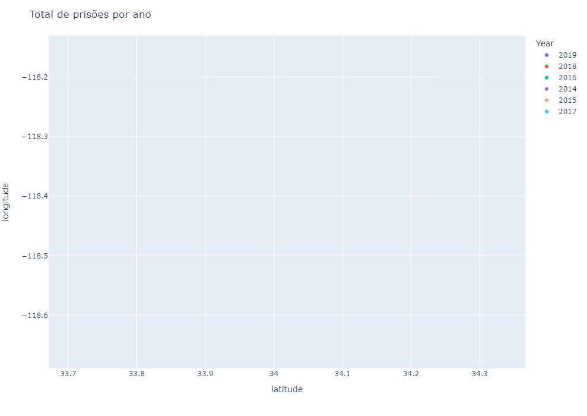
    


```python
df_prisoes.groupby('Year')['Year'].count()
```


    Year
    2014    1705
    2015    1535
    2016    1386
    2017     528
    2018     564
    2019     508
    Name: Year, dtype: int64


Os números (e os gráficos) mostram que o total de prisões diminuiu de 2014 a 2019. Não podemos afirmar categoricamente que foi devido à legalização da maconha, mas considerando que este foi o grande evento ocorrido no período (aprovado em 2016 e em vigor a partir de 01/01/2017), já podemos perceber uma tendência, afinal, o uso recreativo da maconha deixou de ser ocorrência de polícia.

Vejamos o que aconteceu nas áreas próximas aos pontos de venda legalizada de maconha.

<h3>2.2) Prisões Associadas à Maconha e Que Ocorreram Próximo a Pontos de Venda Legalizada de Maconha</3>


```python
# Carrega o dataset
df_lojas = pd.read_csv('dados/df_lojas.csv')

# Shape
df_lojas.shape
```


    (385, 10)


```python
# Dados
df_lojas.head(3)
```


<div>
<style scoped>
    .dataframe tbody tr th:only-of-type {
        vertical-align: middle;
    }

    .dataframe tbody tr th {
        vertical-align: top;
    }

    .dataframe thead th {
        text-align: right;
    }
</style>
<table border="1" class="dataframe">
  <thead>
    <tr style="text-align: right;">
      <th></th>
      <th>Unnamed: 0</th>
      <th>name</th>
      <th>is_closed</th>
      <th>url</th>
      <th>rating</th>
      <th>price</th>
      <th>review_count</th>
      <th>latitude</th>
      <th>longitude</th>
      <th>location</th>
    </tr>
  </thead>
  <tbody>
    <tr>
      <th>0</th>
      <td>0</td>
      <td>California Caregivers Alliance</td>
      <td>False</td>
      <td>https://www.yelp.com/biz/california-caregivers...</td>
      <td>4.5</td>
      <td>$$</td>
      <td>364</td>
      <td>34.08236</td>
      <td>-118.271930</td>
      <td>(34.08236, -118.27193)</td>
    </tr>
    <tr>
      <th>1</th>
      <td>1</td>
      <td>Herbarium</td>
      <td>False</td>
      <td>https://www.yelp.com/biz/herbarium-los-angeles...</td>
      <td>4.5</td>
      <td>$$</td>
      <td>417</td>
      <td>34.08854</td>
      <td>-118.344699</td>
      <td>(34.08854, -118.344699)</td>
    </tr>
    <tr>
      <th>2</th>
      <td>2</td>
      <td>MedMen- Los Angeles - DTLA</td>
      <td>False</td>
      <td>https://www.yelp.com/biz/medmen-los-angeles-dt...</td>
      <td>4.0</td>
      <td>$$</td>
      <td>451</td>
      <td>34.04460</td>
      <td>-118.254440</td>
      <td>(34.0446, -118.25444)</td>
    </tr>
  </tbody>
</table>
</div>


Uma das colunas indica se o ponto de venda está fechado ou não (is_closed). Pontos de venda fechados não trazem informação útil. Vamos checar.


```python
# Verificando se há pontos de venda com status "fechado"
df_lojas['is_closed'].value_counts()
```


    False    385
    Name: is_closed, dtype: int64


Não há nenhum ponto de venda com status de fechado, portanto não teremos que nos preocupar com esse fator.

A variável **is_closed** já não fornece nenhuma informação valiosa e a variável **location** é redundante devido às variáveis **latitude** e **longitude**. Além disso, a coluna **url** não é necessária para fins de análise exploratória de dados, portanto as três variáveis serão descartadas. As variáveis rating, price e review_count também não são úteis para esta análise.

De fato, precisamos somente do nome, latitude e longitude.


```python
# Filtrando o dataframe e mantendo somente as colunas necessárias para análise
df_lojas = df_lojas[['name', 'latitude', 'longitude']]

# Dados
df_lojas.head(5)
```


<div>
<style scoped>
    .dataframe tbody tr th:only-of-type {
        vertical-align: middle;
    }

    .dataframe tbody tr th {
        vertical-align: top;
    }

    .dataframe thead th {
        text-align: right;
    }
</style>
<table border="1" class="dataframe">
  <thead>
    <tr style="text-align: right;">
      <th></th>
      <th>name</th>
      <th>latitude</th>
      <th>longitude</th>
    </tr>
  </thead>
  <tbody>
    <tr>
      <th>0</th>
      <td>California Caregivers Alliance</td>
      <td>34.082360</td>
      <td>-118.271930</td>
    </tr>
    <tr>
      <th>1</th>
      <td>Herbarium</td>
      <td>34.088540</td>
      <td>-118.344699</td>
    </tr>
    <tr>
      <th>2</th>
      <td>MedMen- Los Angeles - DTLA</td>
      <td>34.044600</td>
      <td>-118.254440</td>
    </tr>
    <tr>
      <th>3</th>
      <td>Kushfly</td>
      <td>34.127617</td>
      <td>-118.346710</td>
    </tr>
    <tr>
      <th>4</th>
      <td>The Higher Path</td>
      <td>34.149266</td>
      <td>-118.439963</td>
    </tr>
  </tbody>
</table>
</div>


```python
# Resumo estatístico
df_lojas.describe()
```


<div>
<style scoped>
    .dataframe tbody tr th:only-of-type {
        vertical-align: middle;
    }

    .dataframe tbody tr th {
        vertical-align: top;
    }

    .dataframe thead th {
        text-align: right;
    }
</style>
<table border="1" class="dataframe">
  <thead>
    <tr style="text-align: right;">
      <th></th>
      <th>latitude</th>
      <th>longitude</th>
    </tr>
  </thead>
  <tbody>
    <tr>
      <th>count</th>
      <td>385.000000</td>
      <td>385.000000</td>
    </tr>
    <tr>
      <th>mean</th>
      <td>34.080912</td>
      <td>-118.115188</td>
    </tr>
    <tr>
      <th>std</th>
      <td>0.412341</td>
      <td>2.801934</td>
    </tr>
    <tr>
      <th>min</th>
      <td>33.766730</td>
      <td>-118.848091</td>
    </tr>
    <tr>
      <th>25%</th>
      <td>34.007280</td>
      <td>-118.378990</td>
    </tr>
    <tr>
      <th>50%</th>
      <td>34.048006</td>
      <td>-118.322359</td>
    </tr>
    <tr>
      <th>75%</th>
      <td>34.094340</td>
      <td>-118.253020</td>
    </tr>
    <tr>
      <th>max</th>
      <td>40.752290</td>
      <td>-73.990005</td>
    </tr>
  </tbody>
</table>
</div>


```python
# Salva o arquivo em disco (agora sem o índice)
df_lojas.to_csv('dados/df_lojas_parte2.csv', index = False)
```


```python
df_lojas = df_lojas.loc[df_lojas['longitude'] < -100]
```

Vamos colocar no gráfico a Geolocalização das prisões e das lojas e avaliamos se há algum padrão a considerar.


```python
# Função para o plot das prisões e das lojas, considerando Geolocalização pela latitude e longitude
def grafico_prisoes_lojas(year):
    
    df_lojas_temp = df_lojas[['latitude', 'longitude']]
    df_lojas_temp['Type'] = 'store'

    df_prisoes_temp = df_prisoes.loc[df_prisoes['Year'] == year, ['latitude', 'longitude']]
    df_prisoes_temp['Type'] = 'prison'

    df_lojas_prisoes = pd.concat([df_prisoes_temp, df_lojas_temp], ignore_index=True)


    fig = px.scatter(df_lojas_prisoes, x='latitude', y='longitude', color='Type', color_discrete_map={'store': '#00bf33', 'prison': '#F00'})


    fig.update_layout(
        title_text="<span>Total de prisões e lojas no ano de {}</span>".format(year),
        autosize=False,
        width=1200,
        height=600,
    )

    fig.show()  


```


```python
df_prisoes.loc[df_prisoes['Year'] == '2014']
```


<div>
<style scoped>
    .dataframe tbody tr th:only-of-type {
        vertical-align: middle;
    }

    .dataframe tbody tr th {
        vertical-align: top;
    }

    .dataframe thead th {
        text-align: right;
    }
</style>
<table border="1" class="dataframe">
  <thead>
    <tr style="text-align: right;">
      <th></th>
      <th>Unnamed: 0</th>
      <th>Report ID</th>
      <th>Arrest Date</th>
      <th>Time</th>
      <th>Area ID</th>
      <th>Area Name</th>
      <th>Reporting District</th>
      <th>Age</th>
      <th>Sex Code</th>
      <th>Descent Code</th>
      <th>...</th>
      <th>Arrest Type Code</th>
      <th>Charge</th>
      <th>Charge Description</th>
      <th>Address</th>
      <th>Cross Street</th>
      <th>Location</th>
      <th>latitude</th>
      <th>longitude</th>
      <th>marijuana_related</th>
      <th>Year</th>
    </tr>
  </thead>
  <tbody>
    <tr>
      <th>283</th>
      <td>44052</td>
      <td>4076177</td>
      <td>2014-08-27</td>
      <td>730.0</td>
      <td>15</td>
      <td>N Hollywood</td>
      <td>1513</td>
      <td>19</td>
      <td>F</td>
      <td>H</td>
      <td>...</td>
      <td>F</td>
      <td>11360(A)HS</td>
      <td>transport/sell/furnish/etc marijuana</td>
      <td>6800    WHITSETT                     AV</td>
      <td>NaN</td>
      <td>['34.194', '-118.4052']</td>
      <td>34.1940</td>
      <td>-118.4052</td>
      <td>transport/sell/furnish/etc marijuana</td>
      <td>2014</td>
    </tr>
    <tr>
      <th>284</th>
      <td>44056</td>
      <td>4128545</td>
      <td>2014-10-16</td>
      <td>2125.0</td>
      <td>10</td>
      <td>West Valley</td>
      <td>1024</td>
      <td>19</td>
      <td>M</td>
      <td>H</td>
      <td>...</td>
      <td>F</td>
      <td>11359HS</td>
      <td>possession marijuana for sale</td>
      <td>RESEDA                       AV</td>
      <td>VANOWEN                      ST</td>
      <td>['34.1939', '-118.536']</td>
      <td>34.1939</td>
      <td>-118.5360</td>
      <td>possession marijuana for sale</td>
      <td>2014</td>
    </tr>
    <tr>
      <th>299</th>
      <td>45273</td>
      <td>141005328</td>
      <td>2014-02-02</td>
      <td>940.0</td>
      <td>10</td>
      <td>West Valley</td>
      <td>1079</td>
      <td>40</td>
      <td>F</td>
      <td>W</td>
      <td>...</td>
      <td>M</td>
      <td>11357BHS</td>
      <td>possess 28.5 grams or less of marijuana**</td>
      <td>15400    VENTURA                      BL</td>
      <td>NaN</td>
      <td>['34.1599', '-118.4766']</td>
      <td>34.1599</td>
      <td>-118.4766</td>
      <td>possess 28.5 grams or less of marijuana**</td>
      <td>2014</td>
    </tr>
    <tr>
      <th>642</th>
      <td>96985</td>
      <td>141013196</td>
      <td>2014-08-04</td>
      <td>2030.0</td>
      <td>10</td>
      <td>West Valley</td>
      <td>1061</td>
      <td>21</td>
      <td>M</td>
      <td>H</td>
      <td>...</td>
      <td>I</td>
      <td>11357(B)HS</td>
      <td>possess 28.5 grams or less of marijuana</td>
      <td>19800    VENTURA                      BL</td>
      <td>NaN</td>
      <td>['34.1725', '-118.5638']</td>
      <td>34.1725</td>
      <td>-118.5638</td>
      <td>possess 28.5 grams or less of marijuana</td>
      <td>2014</td>
    </tr>
    <tr>
      <th>667</th>
      <td>99556</td>
      <td>3829907</td>
      <td>2014-01-10</td>
      <td>1950.0</td>
      <td>5</td>
      <td>Harbor</td>
      <td>513</td>
      <td>31</td>
      <td>M</td>
      <td>W</td>
      <td>...</td>
      <td>F</td>
      <td>11359HS</td>
      <td>possession marijuana for sale</td>
      <td>1200 W  255TH                        ST</td>
      <td>NaN</td>
      <td>['33.7928', '-118.2975']</td>
      <td>33.7928</td>
      <td>-118.2975</td>
      <td>possession marijuana for sale</td>
      <td>2014</td>
    </tr>
    <tr>
      <th>...</th>
      <td>...</td>
      <td>...</td>
      <td>...</td>
      <td>...</td>
      <td>...</td>
      <td>...</td>
      <td>...</td>
      <td>...</td>
      <td>...</td>
      <td>...</td>
      <td>...</td>
      <td>...</td>
      <td>...</td>
      <td>...</td>
      <td>...</td>
      <td>...</td>
      <td>...</td>
      <td>...</td>
      <td>...</td>
      <td>...</td>
      <td>...</td>
    </tr>
    <tr>
      <th>17683</th>
      <td>1008398</td>
      <td>4196674</td>
      <td>2014-12-31</td>
      <td>2325.0</td>
      <td>14</td>
      <td>Pacific</td>
      <td>1441</td>
      <td>21</td>
      <td>M</td>
      <td>W</td>
      <td>...</td>
      <td>F</td>
      <td>11359HS</td>
      <td>possession marijuana for sale</td>
      <td>2600    GRAND CANAL</td>
      <td>NaN</td>
      <td>['33.9825', '-118.4667']</td>
      <td>33.9825</td>
      <td>-118.4667</td>
      <td>possession marijuana for sale</td>
      <td>2014</td>
    </tr>
    <tr>
      <th>17684</th>
      <td>1008421</td>
      <td>4196499</td>
      <td>2014-12-31</td>
      <td>2200.0</td>
      <td>6</td>
      <td>Hollywood</td>
      <td>643</td>
      <td>22</td>
      <td>M</td>
      <td>B</td>
      <td>...</td>
      <td>F</td>
      <td>11359HS</td>
      <td>possession marijuana for sale</td>
      <td>LA BREA</td>
      <td>HOLLYWOOD</td>
      <td>['34.1016', '-118.3452']</td>
      <td>34.1016</td>
      <td>-118.3452</td>
      <td>possession marijuana for sale</td>
      <td>2014</td>
    </tr>
    <tr>
      <th>17690</th>
      <td>1008867</td>
      <td>4195937</td>
      <td>2014-12-31</td>
      <td>330.0</td>
      <td>20</td>
      <td>Olympic</td>
      <td>2022</td>
      <td>33</td>
      <td>M</td>
      <td>O</td>
      <td>...</td>
      <td>F</td>
      <td>11360(A)HS</td>
      <td>transport/sell/furnish/etc marijuana</td>
      <td>WESTERN</td>
      <td>4TH</td>
      <td>['34.0672', '-118.3091']</td>
      <td>34.0672</td>
      <td>-118.3091</td>
      <td>transport/sell/furnish/etc marijuana</td>
      <td>2014</td>
    </tr>
    <tr>
      <th>17694</th>
      <td>1009080</td>
      <td>4195723</td>
      <td>2014-12-30</td>
      <td>2110.0</td>
      <td>11</td>
      <td>Northeast</td>
      <td>1159</td>
      <td>46</td>
      <td>M</td>
      <td>H</td>
      <td>...</td>
      <td>F</td>
      <td>11359HS</td>
      <td>possession marijuana for sale</td>
      <td>SYCAMORE</td>
      <td>FIGUEROA</td>
      <td>['34.0994', '-118.2035']</td>
      <td>34.0994</td>
      <td>-118.2035</td>
      <td>possession marijuana for sale</td>
      <td>2014</td>
    </tr>
    <tr>
      <th>17697</th>
      <td>1009277</td>
      <td>4195821</td>
      <td>2014-12-30</td>
      <td>1750.0</td>
      <td>15</td>
      <td>N Hollywood</td>
      <td>1555</td>
      <td>21</td>
      <td>M</td>
      <td>O</td>
      <td>...</td>
      <td>F</td>
      <td>11359HS</td>
      <td>possession marijuana for sale</td>
      <td>4700    LANKERSHIM                   BL</td>
      <td>NaN</td>
      <td>['34.1557', '-118.3691']</td>
      <td>34.1557</td>
      <td>-118.3691</td>
      <td>possession marijuana for sale</td>
      <td>2014</td>
    </tr>
  </tbody>
</table>
<p>1705 rows × 22 columns</p>
</div>


```python
for year in sorted(df_prisoes['Year'].unique()):
    display(grafico_prisoes_lojas(str(year)))
```


    
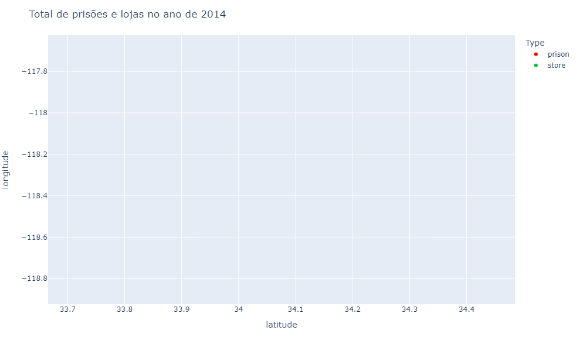
    


    None


    
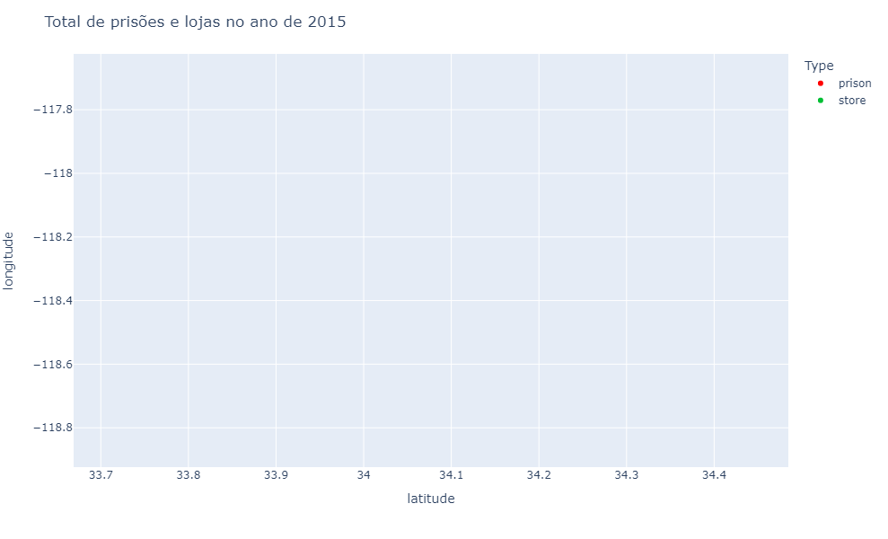
    


    None


    

    


    None


    
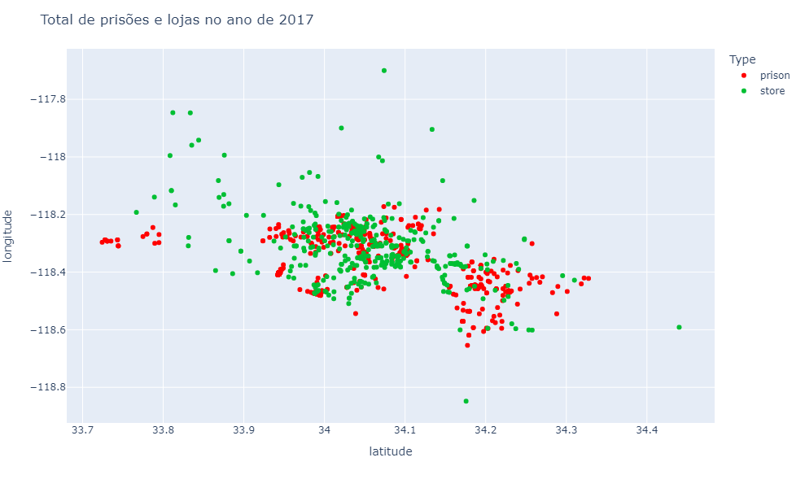
    


    None


    

    


    None


    
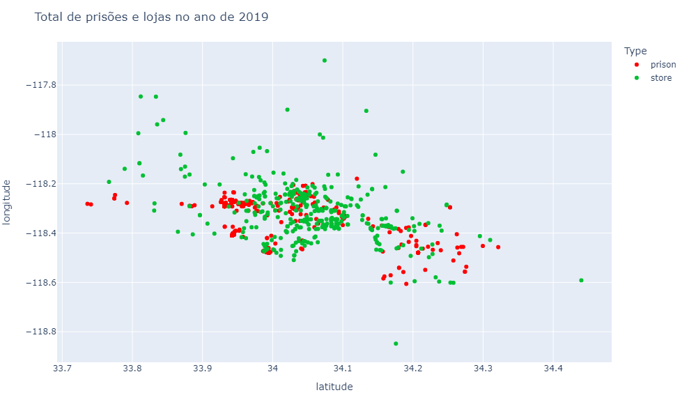
    


    None


As prisões foram concentradas em uma região da cidade e claramente próximas a pontos de vendas, antes e depois da legalização da maconha. As lojas não mudaram de lugar e ao longo dos anos mais lojas surgiram. Se houve redução do volume de prisões, isso deve-se provavelmente à legalização da maconha.

E com relação às escolas? Vamos checar.

<h3>2.3) Prisões Associadas à Maconha e Que Ocorreram Próximo a Escolas </h3>


```python
# Carregando os dados
df_escolas = pd.read_csv('dados/df_escolas.csv')

# Shape
df_escolas.shape
```


    (947, 7)


```python
# Dados
df_escolas.head()
```


<div>
<style scoped>
    .dataframe tbody tr th:only-of-type {
        vertical-align: middle;
    }

    .dataframe tbody tr th {
        vertical-align: top;
    }

    .dataframe thead th {
        text-align: right;
    }
</style>
<table border="1" class="dataframe">
  <thead>
    <tr style="text-align: right;">
      <th></th>
      <th>Unnamed: 0</th>
      <th>School</th>
      <th>Zip Code</th>
      <th>Grades</th>
      <th>Local District</th>
      <th>Board District</th>
      <th>complete_address</th>
    </tr>
  </thead>
  <tbody>
    <tr>
      <th>0</th>
      <td>0</td>
      <td>Frank Del Olmo Elementary</td>
      <td>90004</td>
      <td>K- 5</td>
      <td>C</td>
      <td>2-Monica Garcia</td>
      <td>100 N New Hampshire Ave Los Angeles CA 90004</td>
    </tr>
    <tr>
      <th>1</th>
      <td>1</td>
      <td>10th Street Elementary</td>
      <td>90015</td>
      <td>1- 5</td>
      <td>C</td>
      <td>2-Monica Garcia</td>
      <td>1000 Grattan St Los Angeles CA 90015</td>
    </tr>
    <tr>
      <th>2</th>
      <td>2</td>
      <td>Elementary Community Day School</td>
      <td>91311</td>
      <td>K- 6</td>
      <td>XS</td>
      <td>3-Scott M Schmerelson</td>
      <td>10001 Jumilla Ave Chatsworth CA 91311</td>
    </tr>
    <tr>
      <th>3</th>
      <td>3</td>
      <td>Cesar E Chavez Learning Academy - Arts/Theatre...</td>
      <td>91340</td>
      <td>9-12</td>
      <td>NE</td>
      <td>6-Kelly Gonez</td>
      <td>1001 Arroyo Ave San Fernando CA 91340</td>
    </tr>
    <tr>
      <th>4</th>
      <td>4</td>
      <td>San Pedro Senior High Gifted STEAM Magnet</td>
      <td>90731</td>
      <td>9-12</td>
      <td>S</td>
      <td>7-Dr Richard A Vladovic</td>
      <td>1001 W 15th St San Pedro CA 90731</td>
    </tr>
  </tbody>
</table>
</div>


Temos um pequeno problema aqui. Precisamos da latitude e longitude para poder criar os gráficos, mas temos apenas o endereço completo. Vamos resolver isso com **Geolocalização**. Precisamos da latitude e longitude e temos apenas o endereço completo. A partir do endereço, buscaremos latitude e longitude.

Eu criei um dataset contendo toda a latitude e longitude das escolas.


```python
# Carregando os dados
df_escolas = pd.read_csv('dados/df_escolas_parte2.csv')
# Dados
df_escolas.head()
```


<div>
<style scoped>
    .dataframe tbody tr th:only-of-type {
        vertical-align: middle;
    }

    .dataframe tbody tr th {
        vertical-align: top;
    }

    .dataframe thead th {
        text-align: right;
    }
</style>
<table border="1" class="dataframe">
  <thead>
    <tr style="text-align: right;">
      <th></th>
      <th>School</th>
      <th>Zip Code</th>
      <th>Grades</th>
      <th>Local District</th>
      <th>Board District</th>
      <th>complete_address</th>
      <th>latitude</th>
      <th>longitude</th>
      <th>prisao_0.5_milha</th>
      <th>prisao_1_milha</th>
    </tr>
  </thead>
  <tbody>
    <tr>
      <th>0</th>
      <td>Frank Del Olmo Elementary</td>
      <td>90004</td>
      <td>K- 5</td>
      <td>C</td>
      <td>2-Monica Garcia</td>
      <td>100 N New Hampshire Ave Los Angeles CA 90004</td>
      <td>34.072925</td>
      <td>-118.292591</td>
      <td>28</td>
      <td>95</td>
    </tr>
    <tr>
      <th>1</th>
      <td>10th Street Elementary</td>
      <td>90015</td>
      <td>1- 5</td>
      <td>C</td>
      <td>2-Monica Garcia</td>
      <td>1000 Grattan St Los Angeles CA 90015</td>
      <td>34.048284</td>
      <td>-118.273264</td>
      <td>26</td>
      <td>141</td>
    </tr>
    <tr>
      <th>2</th>
      <td>Elementary Community Day School</td>
      <td>91311</td>
      <td>K- 6</td>
      <td>XS</td>
      <td>3-Scott M Schmerelson</td>
      <td>10001 Jumilla Ave Chatsworth CA 91311</td>
      <td>34.251825</td>
      <td>-118.563377</td>
      <td>1</td>
      <td>3</td>
    </tr>
    <tr>
      <th>3</th>
      <td>Cesar E Chavez Learning Academy - Arts/Theatre...</td>
      <td>91340</td>
      <td>9-12</td>
      <td>NE</td>
      <td>6-Kelly Gonez</td>
      <td>1001 Arroyo Ave San Fernando CA 91340</td>
      <td>34.288514</td>
      <td>-118.421011</td>
      <td>1</td>
      <td>16</td>
    </tr>
    <tr>
      <th>4</th>
      <td>San Pedro Senior High Gifted STEAM Magnet</td>
      <td>90731</td>
      <td>9-12</td>
      <td>S</td>
      <td>7-Dr Richard A Vladovic</td>
      <td>1001 W 15th St San Pedro CA 90731</td>
      <td>33.730370</td>
      <td>-118.299342</td>
      <td>18</td>
      <td>74</td>
    </tr>
  </tbody>
</table>
</div>


```python
# Função para os gráficos de prisões que ocorreram nas proximidas de escolas
def grafico_prisoes_escolas(year):
    
    df_escolas_temp = df_escolas[['latitude', 'longitude']]
    df_escolas_temp['Type'] = 'school'

    df_prisoes_temp = df_prisoes.loc[df_prisoes['Year'] == year, ['latitude', 'longitude']]
    df_prisoes_temp['Type'] = 'prison'

    df_escolas_prisoes = pd.concat([df_prisoes_temp, df_escolas_temp], ignore_index=True)


    fig = px.scatter(df_escolas_prisoes, x='latitude', y='longitude', color='Type', color_discrete_map={'school': '#00bf33', 'prison': '#F00'})


    fig.update_layout(
        title_text="<span>Total de escolas e lojas no ano de {}</span>".format(year),
        autosize=False,
        width=1200,
        height=600,
    )

    fig.show()  


```


```python
for year in sorted(df_prisoes['Year'].unique()):
    display(grafico_prisoes_escolas(str(year)))
```


    
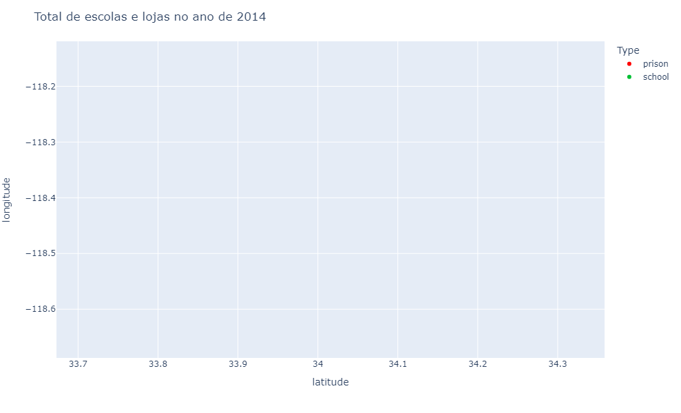
    


    None


    

    


    None


    

    


    None


    

    


    None


    

    


    None


    

    


    None


Podemos ver mais pontinhos verdes do que vermelhos, isso quer dizer que há mais escolas do que prisões relacionadas a maconha!

Fica claro que as prisões ocorreram por diversas regiões, em localidades próximas ou não a escolas. Para informação mais precisa, teremos que calcular as distâncias entre cada prisão e os pontos de venda e escolas. O pacote geopy será útil para essa tarefa.

https://geopy.readthedocs.io/en/stable/

Vai dar trabalho. Mas estamos aqui para isso.

<h3>2.4) Distâncias Entre Locais Que Ocorreram Prisões e Pontos de Vendas e Escolas</h3>

Sem essa informação, teríamos apenas os gráficos acima. Visualmente temos apenas uma ideia geral. Precisamos de dados reais de distância. É o que faremos agora.

<h4>2.4.1) Distância Entre Locais Que Ocorreram Prisões e Pontos (Legalizados) de Venda de Maconha</h4>

Começaremos com o cálculo de distância entre cada prisão e cada ponto de venda. Com Geolocalização conseguimos extrair dados e padrões de forma bem mais precisa.


```python
# Criamos um dataframe para usar no cálculo de distâncias
df_lojas_dist = df_lojas[['name', 'latitude', 'longitude']]

# Shape
df_lojas_dist.shape
```


    (383, 3)


```python
# Dados
df_lojas_dist.head(3)
```


<div>
<style scoped>
    .dataframe tbody tr th:only-of-type {
        vertical-align: middle;
    }

    .dataframe tbody tr th {
        vertical-align: top;
    }

    .dataframe thead th {
        text-align: right;
    }
</style>
<table border="1" class="dataframe">
  <thead>
    <tr style="text-align: right;">
      <th></th>
      <th>name</th>
      <th>latitude</th>
      <th>longitude</th>
    </tr>
  </thead>
  <tbody>
    <tr>
      <th>0</th>
      <td>California Caregivers Alliance</td>
      <td>34.08236</td>
      <td>-118.271930</td>
    </tr>
    <tr>
      <th>1</th>
      <td>Herbarium</td>
      <td>34.08854</td>
      <td>-118.344699</td>
    </tr>
    <tr>
      <th>2</th>
      <td>MedMen- Los Angeles - DTLA</td>
      <td>34.04460</td>
      <td>-118.254440</td>
    </tr>
  </tbody>
</table>
</div>


```python
# Criamos um dataframe para usar no cálculo de distâncias
df_prisoes_dist = df_prisoes[['Report ID', 'latitude', 'longitude']]

# Reset do índice (organiza o índice no novo dataframe
df_prisoes_dist.reset_index(drop = True, inplace = True)

# Shape
df_prisoes_dist.shape
```


    (6226, 3)


```python
# Dados
df_prisoes_dist.head(3)
```


<div>
<style scoped>
    .dataframe tbody tr th:only-of-type {
        vertical-align: middle;
    }

    .dataframe tbody tr th {
        vertical-align: top;
    }

    .dataframe thead th {
        text-align: right;
    }
</style>
<table border="1" class="dataframe">
  <thead>
    <tr style="text-align: right;">
      <th></th>
      <th>Report ID</th>
      <th>latitude</th>
      <th>longitude</th>
    </tr>
  </thead>
  <tbody>
    <tr>
      <th>0</th>
      <td>5568617</td>
      <td>34.1016</td>
      <td>-118.3350</td>
    </tr>
    <tr>
      <th>1</th>
      <td>5568629</td>
      <td>34.1016</td>
      <td>-118.3350</td>
    </tr>
    <tr>
      <th>2</th>
      <td>5607178</td>
      <td>34.0838</td>
      <td>-118.3614</td>
    </tr>
  </tbody>
</table>
</div>


Para calcular a distância entre as coordenadas precisamos da função geodesic() do pacote geopy.


```python
#!pip install geopy

# Imports
import geopy
from geopy.distance import geodesic
```


```python
# Essa função vai calcular a distância entre as coordenadas de cada prisão e de cada ponto de venda
def calcula_distancia(loja_lat, loja_long, prisao_lat, prisao_long):
    
    # Coordenadas do ponto de venda
    coord_loja = (loja_lat, loja_long)
    
    # Coordenadas da prisão
    coord_prisao = (prisao_lat, prisao_long)
    
    # Calcula a distância com a função do pacote geopy 
    # O cálculo será em milhas, pois é o padrão nos EUA
    try:
        distancia = geodesic(coord_loja, coord_prisao).miles
        return distancia
    except:
        pass
```

Agora aplicamos a função.

Loop para o cálculo da distância de pontos de vendas para locais de prisões (a execução da célula abaixo é demorada)


```python
%%time

# Para cada nome do ponto de venda calcula a distância para todas as prisões
for loja_name, position in zip(list(df_lojas_dist['name'].values), range(len(df_lojas_dist))):

    # Criamos uma lista de distâncias
    distance_list = []

    # Para cada prisão no dataframe de prisões...
    for prisao in range(len(df_prisoes_dist)):
        
        # Atribui os valores às variáveis
        loja_lat = df_lojas_dist[df_lojas_dist['name'] == loja_name]['latitude'].values
        loja_long = df_lojas_dist[df_lojas_dist['name'] == loja_name]['longitude'].values
        prisao_lat = df_prisoes_dist['latitude'][prisao]
        prisao_long = df_prisoes_dist['longitude'][prisao]
        
        # Calcula a distância com a função criada na célula anterior
        distance = calcula_distancia(loja_lat, loja_long, prisao_lat, prisao_long)

        # Faz o append da distância à lista de distâncias
        distance_list.append(distance)

    # Adicionamos ao dataframe de prisões a lista de distâncias
    df_prisoes_dist[loja_name] = distance_list
```


```python
# Dados
df_prisoes_dist.head()
```


<div>
<style scoped>
    .dataframe tbody tr th:only-of-type {
        vertical-align: middle;
    }

    .dataframe tbody tr th {
        vertical-align: top;
    }

    .dataframe thead th {
        text-align: right;
    }
</style>
<table border="1" class="dataframe">
  <thead>
    <tr style="text-align: right;">
      <th></th>
      <th>Report ID</th>
      <th>latitude</th>
      <th>longitude</th>
    </tr>
  </thead>
  <tbody>
    <tr>
      <th>0</th>
      <td>5568617</td>
      <td>34.1016</td>
      <td>-118.3350</td>
    </tr>
    <tr>
      <th>1</th>
      <td>5568629</td>
      <td>34.1016</td>
      <td>-118.3350</td>
    </tr>
    <tr>
      <th>2</th>
      <td>5607178</td>
      <td>34.0838</td>
      <td>-118.3614</td>
    </tr>
    <tr>
      <th>3</th>
      <td>5616516</td>
      <td>33.9428</td>
      <td>-118.4054</td>
    </tr>
    <tr>
      <th>4</th>
      <td>5616188</td>
      <td>34.1667</td>
      <td>-118.3965</td>
    </tr>
  </tbody>
</table>
</div>


Agora vamos criar duas colunas, **loja_0.5_milha** e **loja_1_milha**, que contarão o número de pontos de vendas que estão dentro de 0,5 milhas e 1 milha respectivamente para cada prisão.


```python
# Cria o dataframe
df_prisao_dist_loja = df_prisoes_dist.drop(['Report ID', 'latitude', 'longitude'], axis = 1).T
```


```python
# Dados
df_prisao_dist_loja.head(3)
```


<div>
<style scoped>
    .dataframe tbody tr th:only-of-type {
        vertical-align: middle;
    }

    .dataframe tbody tr th {
        vertical-align: top;
    }

    .dataframe thead th {
        text-align: right;
    }
</style>
<table border="1" class="dataframe">
  <thead>
    <tr style="text-align: right;">
      <th></th>
      <th>0</th>
      <th>1</th>
      <th>2</th>
      <th>3</th>
      <th>4</th>
      <th>5</th>
      <th>6</th>
      <th>7</th>
      <th>8</th>
      <th>9</th>
      <th>...</th>
      <th>6216</th>
      <th>6217</th>
      <th>6218</th>
      <th>6219</th>
      <th>6220</th>
      <th>6221</th>
      <th>6222</th>
      <th>6223</th>
      <th>6224</th>
      <th>6225</th>
    </tr>
  </thead>
  <tbody>
  </tbody>
</table>
<p>0 rows × 6226 columns</p>
</div>


```python
# Para cada prisão calculamos o total de pontos de venda em um raio de 0.5 milhas ou menos
# E criamos uma coluna no dataframe df_prisoes_dist
df_prisoes_dist['loja_0.5_milha'] = (df_prisao_dist_loja < 0.5).sum()


# Para cada prisão calculamos o total de pontos de venda em um raio de 1 milha ou menos
# E criamos uma coluna no dataframe df_prisoes_dist
df_prisoes_dist['loja_1_milha'] = (df_prisao_dist_loja < 1).sum()
```

Vamos adicionar as duas colunas criadas, no dataset de prisões. Mas antes temos que checar se a coluna Report ID é a mesma nos dois dataframes.


```python
# A coluna Report ID deve ser a mesma nos dois dataframes. Vamos checar.
len(df_prisoes_dist['Report ID'].unique()) == len(df_prisoes['Report ID'].unique())
```


    True


```python
# E então fazemos o merge
df_prisoes = df_prisoes.merge(df_prisoes_dist[['Report ID', 'loja_0.5_milha', 'loja_1_milha']], left_on = 'Report ID', right_on = 'Report ID')
```


```python
# Dados
df_prisoes.head(3)
```


<div>
<style scoped>
    .dataframe tbody tr th:only-of-type {
        vertical-align: middle;
    }

    .dataframe tbody tr th {
        vertical-align: top;
    }

    .dataframe thead th {
        text-align: right;
    }
</style>
<table border="1" class="dataframe">
  <thead>
    <tr style="text-align: right;">
      <th></th>
      <th>Unnamed: 0</th>
      <th>Report ID</th>
      <th>Arrest Date</th>
      <th>Time</th>
      <th>Area ID</th>
      <th>Area Name</th>
      <th>Reporting District</th>
      <th>Age</th>
      <th>Sex Code</th>
      <th>Descent Code</th>
      <th>...</th>
      <th>Charge Description</th>
      <th>Address</th>
      <th>Cross Street</th>
      <th>Location</th>
      <th>latitude</th>
      <th>longitude</th>
      <th>marijuana_related</th>
      <th>Year</th>
      <th>loja_0.5_milha</th>
      <th>loja_1_milha</th>
    </tr>
  </thead>
  <tbody>
    <tr>
      <th>0</th>
      <td>340</td>
      <td>5568617</td>
      <td>2019-03-09</td>
      <td>2015.0</td>
      <td>6</td>
      <td>Hollywood</td>
      <td>646</td>
      <td>29</td>
      <td>M</td>
      <td>O</td>
      <td>...</td>
      <td>possession marijuana for sale</td>
      <td>CHEROKEE</td>
      <td>HOLLYWOOD</td>
      <td>['34.1016', '-118.335']</td>
      <td>34.1016</td>
      <td>-118.3350</td>
      <td>possession marijuana for sale</td>
      <td>2019</td>
      <td>0.0</td>
      <td>0.0</td>
    </tr>
    <tr>
      <th>1</th>
      <td>342</td>
      <td>5568629</td>
      <td>2019-03-09</td>
      <td>2015.0</td>
      <td>6</td>
      <td>Hollywood</td>
      <td>646</td>
      <td>25</td>
      <td>M</td>
      <td>B</td>
      <td>...</td>
      <td>possession marijuana for sale</td>
      <td>CHEROKEE</td>
      <td>HOLLYWOOD</td>
      <td>['34.1016', '-118.335']</td>
      <td>34.1016</td>
      <td>-118.3350</td>
      <td>possession marijuana for sale</td>
      <td>2019</td>
      <td>0.0</td>
      <td>0.0</td>
    </tr>
    <tr>
      <th>2</th>
      <td>983</td>
      <td>5607178</td>
      <td>2019-04-21</td>
      <td>2115.0</td>
      <td>7</td>
      <td>Wilshire</td>
      <td>702</td>
      <td>42</td>
      <td>M</td>
      <td>B</td>
      <td>...</td>
      <td>poss/sale marij ovr 21 employ per 20/belw</td>
      <td>MELROSE                      AV</td>
      <td>FAIRFAX                      AV</td>
      <td>['34.0838', '-118.3614']</td>
      <td>34.0838</td>
      <td>-118.3614</td>
      <td>poss/sale marij ovr 21 employ per 20/belw</td>
      <td>2019</td>
      <td>0.0</td>
      <td>0.0</td>
    </tr>
  </tbody>
</table>
<p>3 rows × 24 columns</p>
</div>


É uma boa ideia salvar o dataframe em disco. Antes, vamos remover a coluna "Unnamed: 0", pois ela é o índice que foi salvo no arquivo csv na Parte 1.


```python
# Salva o arquivo em disco (agora sem salvar o índice)
df_prisoes.to_csv('dados/df_prisoes_parte2.csv', index = False)
```

<h4>2.4.2) Distância Entre Locais Que Ocorreram Prisões e Escolas</h4>

Repetimos o procesos anterior para as escolas.


```python
# Dataframe para calcular as distâncias
df_escolas_dist = df_escolas[['School', 'latitude', 'longitude']]

# Shape
df_escolas_dist.shape
```


    (914, 3)


```python
# Dados
df_escolas_dist.head(3)
```


<div>
<style scoped>
    .dataframe tbody tr th:only-of-type {
        vertical-align: middle;
    }

    .dataframe tbody tr th {
        vertical-align: top;
    }

    .dataframe thead th {
        text-align: right;
    }
</style>
<table border="1" class="dataframe">
  <thead>
    <tr style="text-align: right;">
      <th></th>
      <th>School</th>
      <th>latitude</th>
      <th>longitude</th>
    </tr>
  </thead>
  <tbody>
    <tr>
      <th>0</th>
      <td>Frank Del Olmo Elementary</td>
      <td>34.072925</td>
      <td>-118.292591</td>
    </tr>
    <tr>
      <th>1</th>
      <td>10th Street Elementary</td>
      <td>34.048284</td>
      <td>-118.273264</td>
    </tr>
    <tr>
      <th>2</th>
      <td>Elementary Community Day School</td>
      <td>34.251825</td>
      <td>-118.563377</td>
    </tr>
  </tbody>
</table>
</div>


```python
# Dataframe para calcular as distâncias
df_prisoes_dist_escola = df_prisoes[['Report ID', 'latitude', 'longitude']]

# Reset do índice
df_prisoes_dist_escola.reset_index(drop = True, inplace = True)

# Dados
df_prisoes_dist_escola.head()
```


<div>
<style scoped>
    .dataframe tbody tr th:only-of-type {
        vertical-align: middle;
    }

    .dataframe tbody tr th {
        vertical-align: top;
    }

    .dataframe thead th {
        text-align: right;
    }
</style>
<table border="1" class="dataframe">
  <thead>
    <tr style="text-align: right;">
      <th></th>
      <th>Report ID</th>
      <th>latitude</th>
      <th>longitude</th>
    </tr>
  </thead>
  <tbody>
    <tr>
      <th>0</th>
      <td>5568617</td>
      <td>34.1016</td>
      <td>-118.3350</td>
    </tr>
    <tr>
      <th>1</th>
      <td>5568629</td>
      <td>34.1016</td>
      <td>-118.3350</td>
    </tr>
    <tr>
      <th>2</th>
      <td>5607178</td>
      <td>34.0838</td>
      <td>-118.3614</td>
    </tr>
    <tr>
      <th>3</th>
      <td>5616516</td>
      <td>33.9428</td>
      <td>-118.4054</td>
    </tr>
    <tr>
      <th>4</th>
      <td>5616188</td>
      <td>34.1667</td>
      <td>-118.3965</td>
    </tr>
  </tbody>
</table>
</div>


Loop para cálculo das distâncias entre prisões e escolas (a execução da célula abaixo é demorada).


```python
%%time
for escola_name, position in zip(list(df_escolas_dist['School'].values), range(len(df_escolas_dist))):

    # Lista de distâncias
    distance_list = []

    # Loop pelas prisões
    for prisao in range(len(df_prisoes_dist_escola)):
        
        # Atribui os valores às variáveis
        loja_lat2 = df_escolas_dist[df_escolas_dist['School'] == escola_name]['latitude'].values
        loja_long2 = df_escolas_dist[df_escolas_dist['School'] == escola_name]['longitude'].values
        prisao_lat2 = df_prisoes_dist_escola['latitude'][prisao]
        prisao_long2 = df_prisoes_dist_escola['longitude'][prisao]
        
        # Calcula a distância com a função criada na célula anterior
        distance = calcula_distancia(loja_lat2, loja_long2, prisao_lat2, prisao_long2)
    
        # Append à lista de distâncias
        distance_list.append(distance)

    df_prisoes_dist_escola[escola_name] = distance_list
```


```python
# Shape
df_prisoes_dist_escola.shape
```


    (6226, 4)


```python
# Dados
df_prisoes_dist_escola.head()
```


<div>
<style scoped>
    .dataframe tbody tr th:only-of-type {
        vertical-align: middle;
    }

    .dataframe tbody tr th {
        vertical-align: top;
    }

    .dataframe thead th {
        text-align: right;
    }
</style>
<table border="1" class="dataframe">
  <thead>
    <tr style="text-align: right;">
      <th></th>
      <th>Report ID</th>
      <th>latitude</th>
      <th>longitude</th>
      <th>Frank Del Olmo Elementary</th>
    </tr>
  </thead>
  <tbody>
    <tr>
      <th>0</th>
      <td>5568617</td>
      <td>34.1016</td>
      <td>-118.3350</td>
      <td>3.133832</td>
    </tr>
    <tr>
      <th>1</th>
      <td>5568629</td>
      <td>34.1016</td>
      <td>-118.3350</td>
      <td>3.133832</td>
    </tr>
    <tr>
      <th>2</th>
      <td>5607178</td>
      <td>34.0838</td>
      <td>-118.3614</td>
      <td>4.016920</td>
    </tr>
    <tr>
      <th>3</th>
      <td>5616516</td>
      <td>33.9428</td>
      <td>-118.4054</td>
      <td>11.061959</td>
    </tr>
    <tr>
      <th>4</th>
      <td>5616188</td>
      <td>34.1667</td>
      <td>-118.3965</td>
      <td>8.789582</td>
    </tr>
  </tbody>
</table>
</div>


```python
# Transposta da matriz (dataframe)
df_prisoes_dist_escola_T = df_prisoes_dist_escola[df_escolas_dist['School']].T

# Dados
df_prisoes_dist_escola_T.head()
```


```python
# Para cada escola calculamos o total de prisões em um raio de 0.5 milhas ou menos
# E criamos uma coluna no dataframe df_escolas_dist
df_escolas_dist['prisao_0.5_milha'] = df_escolas_dist['School'].map((df_prisoes_dist_escola_T < 0.5).sum(1))

# Para cada prisão calculamos o total de pontos de venda em um raio de 0.5 milhas ou menos
# E criamos uma coluna no dataframe df_escolas_dist
df_escolas_dist['prisao_1_milha'] = df_escolas_dist['School'].map((df_prisoes_dist_escola_T < 1).sum(1))
```


```python
# Dados
df_escolas_dist.head()
```


<div>
<style scoped>
    .dataframe tbody tr th:only-of-type {
        vertical-align: middle;
    }

    .dataframe tbody tr th {
        vertical-align: top;
    }

    .dataframe thead th {
        text-align: right;
    }
</style>
<table border="1" class="dataframe">
  <thead>
    <tr style="text-align: right;">
      <th></th>
      <th>School</th>
      <th>latitude</th>
      <th>longitude</th>
    </tr>
  </thead>
  <tbody>
    <tr>
      <th>0</th>
      <td>Frank Del Olmo Elementary</td>
      <td>34.072925</td>
      <td>-118.292591</td>
    </tr>
    <tr>
      <th>1</th>
      <td>10th Street Elementary</td>
      <td>34.048284</td>
      <td>-118.273264</td>
    </tr>
    <tr>
      <th>2</th>
      <td>Elementary Community Day School</td>
      <td>34.251825</td>
      <td>-118.563377</td>
    </tr>
    <tr>
      <th>3</th>
      <td>Cesar E Chavez Learning Academy - Arts/Theatre...</td>
      <td>34.288514</td>
      <td>-118.421011</td>
    </tr>
    <tr>
      <th>4</th>
      <td>San Pedro Senior High Gifted STEAM Magnet</td>
      <td>33.730370</td>
      <td>-118.299342</td>
    </tr>
  </tbody>
</table>
</div>


Legal. Temos o número de prisões no raio de 0.5 e 1 milha de cada escola.


```python
# Compara os dataframes
list(df_escolas_dist['School']) == list(df_escolas['School'])
```


    True


```python
# Merge
df_escolas = df_escolas.merge(df_escolas_dist[['School', 'prisao_0.5_milha', 'prisao_1_milha']], left_on = 'School', right_on = 'School')
```


```python
# Não precisamos mais dessa coluna
#df_escolas = df_escolas.drop('coordenadas', 1)
#df_escolas
```


```python
# Dados dataframe escolas
display(df_escolas.head())

# Dados dataframe prisões
display(df_prisoes.head())
```


<div>
<style scoped>
    .dataframe tbody tr th:only-of-type {
        vertical-align: middle;
    }

    .dataframe tbody tr th {
        vertical-align: top;
    }

    .dataframe thead th {
        text-align: right;
    }
</style>
<table border="1" class="dataframe">
  <thead>
    <tr style="text-align: right;">
      <th></th>
      <th>School</th>
      <th>Zip Code</th>
      <th>Grades</th>
      <th>Local District</th>
      <th>Board District</th>
      <th>complete_address</th>
      <th>latitude</th>
      <th>longitude</th>
      <th>prisao_0.5_milha</th>
      <th>prisao_1_milha</th>
    </tr>
  </thead>
  <tbody>
    <tr>
      <th>0</th>
      <td>Frank Del Olmo Elementary</td>
      <td>90004</td>
      <td>K- 5</td>
      <td>C</td>
      <td>2-Monica Garcia</td>
      <td>100 N New Hampshire Ave Los Angeles CA 90004</td>
      <td>34.072925</td>
      <td>-118.292591</td>
      <td>28</td>
      <td>95</td>
    </tr>
    <tr>
      <th>1</th>
      <td>10th Street Elementary</td>
      <td>90015</td>
      <td>1- 5</td>
      <td>C</td>
      <td>2-Monica Garcia</td>
      <td>1000 Grattan St Los Angeles CA 90015</td>
      <td>34.048284</td>
      <td>-118.273264</td>
      <td>26</td>
      <td>141</td>
    </tr>
    <tr>
      <th>2</th>
      <td>Elementary Community Day School</td>
      <td>91311</td>
      <td>K- 6</td>
      <td>XS</td>
      <td>3-Scott M Schmerelson</td>
      <td>10001 Jumilla Ave Chatsworth CA 91311</td>
      <td>34.251825</td>
      <td>-118.563377</td>
      <td>1</td>
      <td>3</td>
    </tr>
    <tr>
      <th>3</th>
      <td>Cesar E Chavez Learning Academy - Arts/Theatre...</td>
      <td>91340</td>
      <td>9-12</td>
      <td>NE</td>
      <td>6-Kelly Gonez</td>
      <td>1001 Arroyo Ave San Fernando CA 91340</td>
      <td>34.288514</td>
      <td>-118.421011</td>
      <td>1</td>
      <td>16</td>
    </tr>
    <tr>
      <th>4</th>
      <td>San Pedro Senior High Gifted STEAM Magnet</td>
      <td>90731</td>
      <td>9-12</td>
      <td>S</td>
      <td>7-Dr Richard A Vladovic</td>
      <td>1001 W 15th St San Pedro CA 90731</td>
      <td>33.730370</td>
      <td>-118.299342</td>
      <td>18</td>
      <td>74</td>
    </tr>
  </tbody>
</table>
</div>


<div>
<style scoped>
    .dataframe tbody tr th:only-of-type {
        vertical-align: middle;
    }

    .dataframe tbody tr th {
        vertical-align: top;
    }

    .dataframe thead th {
        text-align: right;
    }
</style>
<table border="1" class="dataframe">
  <thead>
    <tr style="text-align: right;">
      <th></th>
      <th>Unnamed: 0</th>
      <th>Report ID</th>
      <th>Arrest Date</th>
      <th>Time</th>
      <th>Area ID</th>
      <th>Area Name</th>
      <th>Reporting District</th>
      <th>Age</th>
      <th>Sex Code</th>
      <th>Descent Code</th>
      <th>...</th>
      <th>Charge Description</th>
      <th>Address</th>
      <th>Cross Street</th>
      <th>Location</th>
      <th>latitude</th>
      <th>longitude</th>
      <th>marijuana_related</th>
      <th>Year</th>
      <th>loja_0.5_milha</th>
      <th>loja_1_milha</th>
    </tr>
  </thead>
  <tbody>
    <tr>
      <th>0</th>
      <td>340</td>
      <td>5568617</td>
      <td>2019-03-09</td>
      <td>2015.0</td>
      <td>6</td>
      <td>Hollywood</td>
      <td>646</td>
      <td>29</td>
      <td>M</td>
      <td>O</td>
      <td>...</td>
      <td>possession marijuana for sale</td>
      <td>CHEROKEE</td>
      <td>HOLLYWOOD</td>
      <td>['34.1016', '-118.335']</td>
      <td>34.1016</td>
      <td>-118.3350</td>
      <td>possession marijuana for sale</td>
      <td>2019</td>
      <td>0.0</td>
      <td>0.0</td>
    </tr>
    <tr>
      <th>1</th>
      <td>342</td>
      <td>5568629</td>
      <td>2019-03-09</td>
      <td>2015.0</td>
      <td>6</td>
      <td>Hollywood</td>
      <td>646</td>
      <td>25</td>
      <td>M</td>
      <td>B</td>
      <td>...</td>
      <td>possession marijuana for sale</td>
      <td>CHEROKEE</td>
      <td>HOLLYWOOD</td>
      <td>['34.1016', '-118.335']</td>
      <td>34.1016</td>
      <td>-118.3350</td>
      <td>possession marijuana for sale</td>
      <td>2019</td>
      <td>0.0</td>
      <td>0.0</td>
    </tr>
    <tr>
      <th>2</th>
      <td>983</td>
      <td>5607178</td>
      <td>2019-04-21</td>
      <td>2115.0</td>
      <td>7</td>
      <td>Wilshire</td>
      <td>702</td>
      <td>42</td>
      <td>M</td>
      <td>B</td>
      <td>...</td>
      <td>poss/sale marij ovr 21 employ per 20/belw</td>
      <td>MELROSE                      AV</td>
      <td>FAIRFAX                      AV</td>
      <td>['34.0838', '-118.3614']</td>
      <td>34.0838</td>
      <td>-118.3614</td>
      <td>poss/sale marij ovr 21 employ per 20/belw</td>
      <td>2019</td>
      <td>0.0</td>
      <td>0.0</td>
    </tr>
    <tr>
      <th>3</th>
      <td>2410</td>
      <td>5616516</td>
      <td>2019-05-01</td>
      <td>1045.0</td>
      <td>14</td>
      <td>Pacific</td>
      <td>1494</td>
      <td>26</td>
      <td>M</td>
      <td>B</td>
      <td>...</td>
      <td>sale/trans &gt;28.5g marijuana or &gt;4g</td>
      <td>500    WORLD                        WY</td>
      <td>NaN</td>
      <td>['33.9428', '-118.4054']</td>
      <td>33.9428</td>
      <td>-118.4054</td>
      <td>sale/trans &gt;28.5g marijuana or &gt;4g</td>
      <td>2019</td>
      <td>0.0</td>
      <td>0.0</td>
    </tr>
    <tr>
      <th>4</th>
      <td>2913</td>
      <td>5616188</td>
      <td>2019-05-01</td>
      <td>5.0</td>
      <td>15</td>
      <td>N Hollywood</td>
      <td>1543</td>
      <td>27</td>
      <td>M</td>
      <td>B</td>
      <td>...</td>
      <td>sale/trans &gt;28.5g marijuana or &gt;4g</td>
      <td>LAUREL CANYON                BL</td>
      <td>WEDDINGTON</td>
      <td>['34.1667', '-118.3965']</td>
      <td>34.1667</td>
      <td>-118.3965</td>
      <td>sale/trans &gt;28.5g marijuana or &gt;4g</td>
      <td>2019</td>
      <td>0.0</td>
      <td>0.0</td>
    </tr>
  </tbody>
</table>
<p>5 rows × 24 columns</p>
</div>


```python
# Adicionamos mais 2 colunas ao dataframe de prisões com o número de escolas no raio de 0.5 e 1 milha
df_prisoes['escola_0.5_milha'] = (df_prisoes_dist_escola_T < 0.5).sum()
df_prisoes['escola_1_milha'] = (df_prisoes_dist_escola_T < 1).sum()
```


```python
# Dados
df_prisoes.head()
```


<div>
<style scoped>
    .dataframe tbody tr th:only-of-type {
        vertical-align: middle;
    }

    .dataframe tbody tr th {
        vertical-align: top;
    }

    .dataframe thead th {
        text-align: right;
    }
</style>
<table border="1" class="dataframe">
  <thead>
    <tr style="text-align: right;">
      <th></th>
      <th>Unnamed: 0</th>
      <th>Report ID</th>
      <th>Arrest Date</th>
      <th>Time</th>
      <th>Area ID</th>
      <th>Area Name</th>
      <th>Reporting District</th>
      <th>Age</th>
      <th>Sex Code</th>
      <th>Descent Code</th>
      <th>...</th>
      <th>Charge Description</th>
      <th>Address</th>
      <th>Cross Street</th>
      <th>Location</th>
      <th>latitude</th>
      <th>longitude</th>
      <th>marijuana_related</th>
      <th>Year</th>
      <th>loja_0.5_milha</th>
      <th>loja_1_milha</th>
    </tr>
  </thead>
  <tbody>
    <tr>
      <th>0</th>
      <td>340</td>
      <td>5568617</td>
      <td>2019-03-09</td>
      <td>2015.0</td>
      <td>6</td>
      <td>Hollywood</td>
      <td>646</td>
      <td>29</td>
      <td>M</td>
      <td>O</td>
      <td>...</td>
      <td>possession marijuana for sale</td>
      <td>CHEROKEE</td>
      <td>HOLLYWOOD</td>
      <td>['34.1016', '-118.335']</td>
      <td>34.1016</td>
      <td>-118.3350</td>
      <td>possession marijuana for sale</td>
      <td>2019</td>
      <td>0.0</td>
      <td>0.0</td>
    </tr>
    <tr>
      <th>1</th>
      <td>342</td>
      <td>5568629</td>
      <td>2019-03-09</td>
      <td>2015.0</td>
      <td>6</td>
      <td>Hollywood</td>
      <td>646</td>
      <td>25</td>
      <td>M</td>
      <td>B</td>
      <td>...</td>
      <td>possession marijuana for sale</td>
      <td>CHEROKEE</td>
      <td>HOLLYWOOD</td>
      <td>['34.1016', '-118.335']</td>
      <td>34.1016</td>
      <td>-118.3350</td>
      <td>possession marijuana for sale</td>
      <td>2019</td>
      <td>0.0</td>
      <td>0.0</td>
    </tr>
    <tr>
      <th>2</th>
      <td>983</td>
      <td>5607178</td>
      <td>2019-04-21</td>
      <td>2115.0</td>
      <td>7</td>
      <td>Wilshire</td>
      <td>702</td>
      <td>42</td>
      <td>M</td>
      <td>B</td>
      <td>...</td>
      <td>poss/sale marij ovr 21 employ per 20/belw</td>
      <td>MELROSE                      AV</td>
      <td>FAIRFAX                      AV</td>
      <td>['34.0838', '-118.3614']</td>
      <td>34.0838</td>
      <td>-118.3614</td>
      <td>poss/sale marij ovr 21 employ per 20/belw</td>
      <td>2019</td>
      <td>0.0</td>
      <td>0.0</td>
    </tr>
    <tr>
      <th>3</th>
      <td>2410</td>
      <td>5616516</td>
      <td>2019-05-01</td>
      <td>1045.0</td>
      <td>14</td>
      <td>Pacific</td>
      <td>1494</td>
      <td>26</td>
      <td>M</td>
      <td>B</td>
      <td>...</td>
      <td>sale/trans &gt;28.5g marijuana or &gt;4g</td>
      <td>500    WORLD                        WY</td>
      <td>NaN</td>
      <td>['33.9428', '-118.4054']</td>
      <td>33.9428</td>
      <td>-118.4054</td>
      <td>sale/trans &gt;28.5g marijuana or &gt;4g</td>
      <td>2019</td>
      <td>0.0</td>
      <td>0.0</td>
    </tr>
    <tr>
      <th>4</th>
      <td>2913</td>
      <td>5616188</td>
      <td>2019-05-01</td>
      <td>5.0</td>
      <td>15</td>
      <td>N Hollywood</td>
      <td>1543</td>
      <td>27</td>
      <td>M</td>
      <td>B</td>
      <td>...</td>
      <td>sale/trans &gt;28.5g marijuana or &gt;4g</td>
      <td>LAUREL CANYON                BL</td>
      <td>WEDDINGTON</td>
      <td>['34.1667', '-118.3965']</td>
      <td>34.1667</td>
      <td>-118.3965</td>
      <td>sale/trans &gt;28.5g marijuana or &gt;4g</td>
      <td>2019</td>
      <td>0.0</td>
      <td>0.0</td>
    </tr>
  </tbody>
</table>
<p>5 rows × 24 columns</p>
</div>


```python
# Não precisamos mais dessas colunas
df_prisoes = df_prisoes.drop(['Report ID',
                              'Area ID',
                              'Reporting District',
                              'Charge Group Code',
                              'Charge Group Description',
                              'Charge',
                              'Address',
                              'Cross Street',
                              'Location',
                              'marijuana_related'], 1)
```


```python
# Dados
df_prisoes.head()
```


<div>
<style scoped>
    .dataframe tbody tr th:only-of-type {
        vertical-align: middle;
    }

    .dataframe tbody tr th {
        vertical-align: top;
    }

    .dataframe thead th {
        text-align: right;
    }
</style>
<table border="1" class="dataframe">
  <thead>
    <tr style="text-align: right;">
      <th></th>
      <th>Unnamed: 0</th>
      <th>Arrest Date</th>
      <th>Time</th>
      <th>Area Name</th>
      <th>Age</th>
      <th>Sex Code</th>
      <th>Descent Code</th>
      <th>Arrest Type Code</th>
      <th>Charge Description</th>
      <th>latitude</th>
      <th>longitude</th>
      <th>Year</th>
      <th>loja_0.5_milha</th>
      <th>loja_1_milha</th>
    </tr>
  </thead>
  <tbody>
    <tr>
      <th>0</th>
      <td>340</td>
      <td>2019-03-09</td>
      <td>2015.0</td>
      <td>Hollywood</td>
      <td>29</td>
      <td>M</td>
      <td>O</td>
      <td>F</td>
      <td>possession marijuana for sale</td>
      <td>34.1016</td>
      <td>-118.3350</td>
      <td>2019</td>
      <td>0.0</td>
      <td>0.0</td>
    </tr>
    <tr>
      <th>1</th>
      <td>342</td>
      <td>2019-03-09</td>
      <td>2015.0</td>
      <td>Hollywood</td>
      <td>25</td>
      <td>M</td>
      <td>B</td>
      <td>F</td>
      <td>possession marijuana for sale</td>
      <td>34.1016</td>
      <td>-118.3350</td>
      <td>2019</td>
      <td>0.0</td>
      <td>0.0</td>
    </tr>
    <tr>
      <th>2</th>
      <td>983</td>
      <td>2019-04-21</td>
      <td>2115.0</td>
      <td>Wilshire</td>
      <td>42</td>
      <td>M</td>
      <td>B</td>
      <td>F</td>
      <td>poss/sale marij ovr 21 employ per 20/belw</td>
      <td>34.0838</td>
      <td>-118.3614</td>
      <td>2019</td>
      <td>0.0</td>
      <td>0.0</td>
    </tr>
    <tr>
      <th>3</th>
      <td>2410</td>
      <td>2019-05-01</td>
      <td>1045.0</td>
      <td>Pacific</td>
      <td>26</td>
      <td>M</td>
      <td>B</td>
      <td>F</td>
      <td>sale/trans &gt;28.5g marijuana or &gt;4g</td>
      <td>33.9428</td>
      <td>-118.4054</td>
      <td>2019</td>
      <td>0.0</td>
      <td>0.0</td>
    </tr>
    <tr>
      <th>4</th>
      <td>2913</td>
      <td>2019-05-01</td>
      <td>5.0</td>
      <td>N Hollywood</td>
      <td>27</td>
      <td>M</td>
      <td>B</td>
      <td>F</td>
      <td>sale/trans &gt;28.5g marijuana or &gt;4g</td>
      <td>34.1667</td>
      <td>-118.3965</td>
      <td>2019</td>
      <td>0.0</td>
      <td>0.0</td>
    </tr>
  </tbody>
</table>
</div>


```python
# Salva o arquivo em disco (agora sem salvar o índice)
df_prisoes.to_csv('dados/df_prisoes_parte2.csv', index = False)

# Salva o arquivo em disco (agora sem salvar o índice)
df_escolas.to_csv('dados/df_escolas_parte2.csv', index = False)
```

<h3>2.5) Qual Crime Levou ao Maior Número de Prisões?</h3>

Vamos investigar qual foi o principal crime e o total de prisões por ano. 


```python
df_prisoes.groupby(['Charge Description'])['Charge Description'].count()[0:20]
```


    Charge Description
    attempt - sell/furnish/etc marijuana            5
    cultivate >6 marij plants viol envrnt law       2
    cultivating <6 marijuana plants                97
    furnishing marijuana to minor over 14 yrs      13
    give/transport/etc < 28.5 grams marijuana      53
    induce/etc minor to use/sell marijuana          5
    minor poss 28.5+ grams marijuana/school        19
    minor poss < 28.5 grams marijuana/school        8
    poss for sale of marijuana to a minor           1
    poss marijuana or concentrated cannabis        22
    poss of more than 28.5 grams of marijuana     134
    poss open cont/packg marij drivr/passnger       1
    poss/sale marij ovr 21 employ per 20/belw       6
    poss/smoke/ingest marij school/daycare/yc       2
    possess 28.5 grams or less of marijuana       876
    possess 28.5 grams or less of marijuana**     619
    possess marijuana for sale                    261
    possess marijuana for sale under age 18         1
    possess of marijuana while driving veh         22
    possession marijuana for sale                1714
    Name: Charge Description, dtype: int64


Há um problema no gráfico. Um mesmo tipo de crime aparece duas vezes, apenas com ** no final do nome como diferença. Sabe o que é isso? "Sujeira" nos dados, provavelmente erro de digitação de quem cadastrou o crime no sistema. Vamos resolver o problema.


```python
# Limpeza nos dados
# Usamos a função map() para corrigir os registros
df_prisoes['Charge Description'] = df_prisoes['Charge Description'].map(lambda x: 'possess 28.5 grams or less of marijuana' if x == 'possess 28.5 grams or less of marijuana**' else x)
```


```python
#df_prisoes['Year'] = pd.to_datetime(df_prisoes['Arrest Date']).dt.year
def totalPrisonByCrimeType(year):

    temp = df_prisoes.loc[df_prisoes['Year'] == year]
    temp = temp.groupby('Charge Description')['Charge Description'].count().sort_values(ascending=False)[0:8]

    fig = px.bar(x=temp.index, y=temp.values, text=temp.values)
    fig.update_layout(
        title_text="<span>Total de prisões por tipos de crimes no ano de {}</span>".format(year),
        autosize=False,
        width=1200,
        height=600,
        xaxis=dict(title='<span>Tipo de crime</span>'),
        yaxis=dict(title='<span>Quantidade</span>')
    )

    fig.show()

```


```python
for year in sorted(df_prisoes['Year'].unique()):
    totalPrisonByCrimeType(year)
```


    
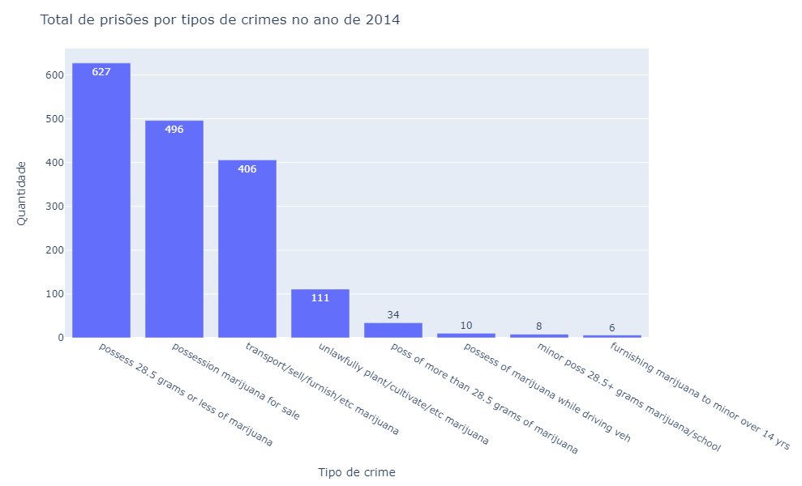
    


    
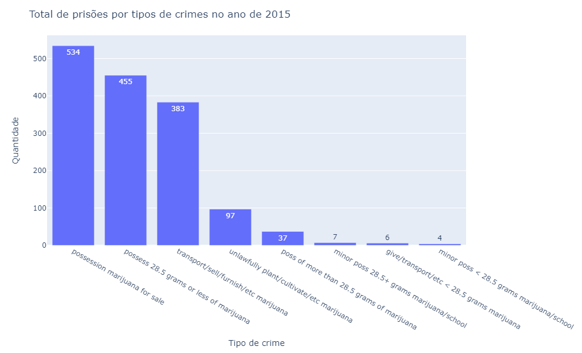
    


    
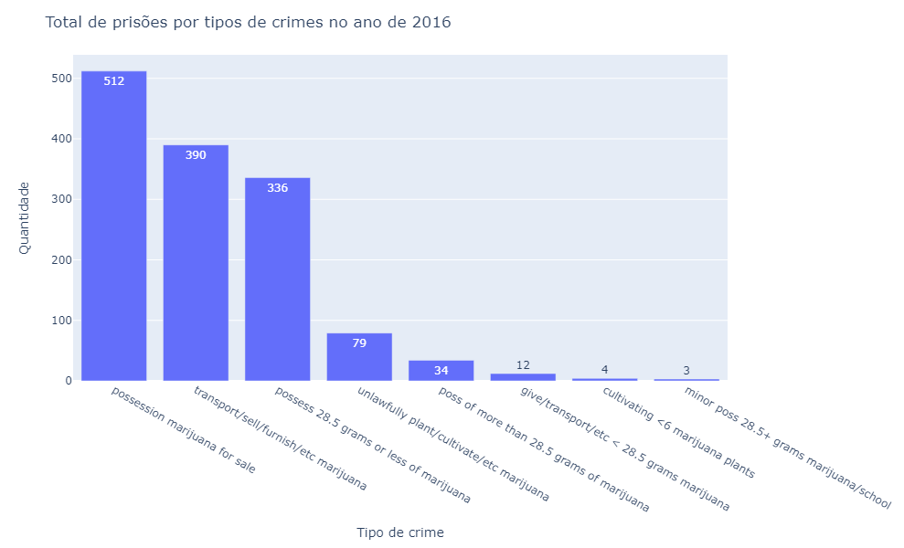
    


    
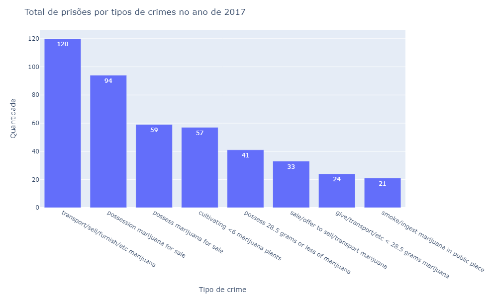
    


    

    


    

    


Além da clara redução no número de prisões, tivemos uma alternância no tipo de crime ao longo dos anos. Desde que a legalização da maconha entrou em vigor em 1º de janeiro de 2017, a principal causa de prisões relacionadas à maconha mudou.

<hr/>

<h2>3) ANÁLISE POR TIME SERIES</h2>


```python
df_escolas = pd.read_csv('dados/df_escolas_parte2.csv')
df_prisoes = pd.read_csv('dados/df_prisoes_parte2.csv')
```


```python
# Range de datas para o índice
indices_datas = pd.date_range('2014-01-01', '2019-12-31')
```


```python
# Dados
df_prisoes.head()
```


<div>
<style scoped>
    .dataframe tbody tr th:only-of-type {
        vertical-align: middle;
    }

    .dataframe tbody tr th {
        vertical-align: top;
    }

    .dataframe thead th {
        text-align: right;
    }
</style>
<table border="1" class="dataframe">
  <thead>
    <tr style="text-align: right;">
      <th></th>
      <th>Arrest Date</th>
      <th>Time</th>
      <th>Area Name</th>
      <th>Age</th>
      <th>Sex Code</th>
      <th>Descent Code</th>
      <th>Arrest Type Code</th>
      <th>Charge Description</th>
      <th>latitude</th>
      <th>longitude</th>
      <th>loja_0.5_milha</th>
      <th>loja_1_milha</th>
      <th>escola_0.5_milha</th>
      <th>escola_1_milha</th>
    </tr>
  </thead>
  <tbody>
    <tr>
      <th>0</th>
      <td>2019-03-09</td>
      <td>2015.0</td>
      <td>Hollywood</td>
      <td>29</td>
      <td>M</td>
      <td>O</td>
      <td>F</td>
      <td>possession marijuana for sale</td>
      <td>34.1016</td>
      <td>-118.3350</td>
      <td>7</td>
      <td>8</td>
      <td>2</td>
      <td>5</td>
    </tr>
    <tr>
      <th>1</th>
      <td>2019-03-09</td>
      <td>2015.0</td>
      <td>Hollywood</td>
      <td>25</td>
      <td>M</td>
      <td>B</td>
      <td>F</td>
      <td>possession marijuana for sale</td>
      <td>34.1016</td>
      <td>-118.3350</td>
      <td>7</td>
      <td>8</td>
      <td>2</td>
      <td>5</td>
    </tr>
    <tr>
      <th>2</th>
      <td>2019-04-21</td>
      <td>2115.0</td>
      <td>Wilshire</td>
      <td>42</td>
      <td>M</td>
      <td>B</td>
      <td>F</td>
      <td>poss/sale marij ovr 21 employ per 20/belw</td>
      <td>34.0838</td>
      <td>-118.3614</td>
      <td>4</td>
      <td>13</td>
      <td>4</td>
      <td>8</td>
    </tr>
    <tr>
      <th>3</th>
      <td>2019-05-01</td>
      <td>1045.0</td>
      <td>Pacific</td>
      <td>26</td>
      <td>M</td>
      <td>B</td>
      <td>F</td>
      <td>sale/trans &gt;28.5g marijuana or &gt;4g</td>
      <td>33.9428</td>
      <td>-118.4054</td>
      <td>0</td>
      <td>0</td>
      <td>0</td>
      <td>0</td>
    </tr>
    <tr>
      <th>4</th>
      <td>2019-05-01</td>
      <td>5.0</td>
      <td>N Hollywood</td>
      <td>27</td>
      <td>M</td>
      <td>B</td>
      <td>F</td>
      <td>sale/trans &gt;28.5g marijuana or &gt;4g</td>
      <td>34.1667</td>
      <td>-118.3965</td>
      <td>0</td>
      <td>1</td>
      <td>3</td>
      <td>4</td>
    </tr>
  </tbody>
</table>
</div>


```python
# Agrupamos por data
df_prisoes_g = df_prisoes.groupby('Arrest Date').sum()
```


```python
df_prisoes_g.head()
```


<div>
<style scoped>
    .dataframe tbody tr th:only-of-type {
        vertical-align: middle;
    }

    .dataframe tbody tr th {
        vertical-align: top;
    }

    .dataframe thead th {
        text-align: right;
    }
</style>
<table border="1" class="dataframe">
  <thead>
    <tr style="text-align: right;">
      <th></th>
      <th>Time</th>
      <th>Age</th>
      <th>latitude</th>
      <th>longitude</th>
      <th>loja_0.5_milha</th>
      <th>loja_1_milha</th>
      <th>escola_0.5_milha</th>
      <th>escola_1_milha</th>
    </tr>
    <tr>
      <th>Arrest Date</th>
      <th></th>
      <th></th>
      <th></th>
      <th></th>
      <th></th>
      <th></th>
      <th></th>
      <th></th>
    </tr>
  </thead>
  <tbody>
    <tr>
      <th>2014-01-01</th>
      <td>5550.0</td>
      <td>140</td>
      <td>136.2076</td>
      <td>-473.3962</td>
      <td>3</td>
      <td>10</td>
      <td>14</td>
      <td>39</td>
    </tr>
    <tr>
      <th>2014-01-02</th>
      <td>8115.0</td>
      <td>146</td>
      <td>170.1532</td>
      <td>-591.8466</td>
      <td>1</td>
      <td>6</td>
      <td>15</td>
      <td>48</td>
    </tr>
    <tr>
      <th>2014-01-03</th>
      <td>4340.0</td>
      <td>86</td>
      <td>102.6021</td>
      <td>-355.0223</td>
      <td>8</td>
      <td>18</td>
      <td>1</td>
      <td>10</td>
    </tr>
    <tr>
      <th>2014-01-04</th>
      <td>3460.0</td>
      <td>64</td>
      <td>68.1614</td>
      <td>-236.6081</td>
      <td>8</td>
      <td>12</td>
      <td>8</td>
      <td>32</td>
    </tr>
    <tr>
      <th>2014-01-05</th>
      <td>5645.0</td>
      <td>74</td>
      <td>102.3616</td>
      <td>-355.4024</td>
      <td>0</td>
      <td>0</td>
      <td>6</td>
      <td>20</td>
    </tr>
  </tbody>
</table>
</div>


```python
# Total de prisões nas proximidades das escolas de até uma 1 milha de distância
df_prisoes_g['escola_1_milha'].head()
```


    Arrest Date
    2014-01-01    39
    2014-01-02    48
    2014-01-03    10
    2014-01-04    32
    2014-01-05    20
    Name: escola_1_milha, dtype: int64


```python
# Total de prisões nas proximidades das escolas de até uma 0.5 milha de distância
df_prisoes_g['escola_0.5_milha'].head()
```


    Arrest Date
    2014-01-01    14
    2014-01-02    15
    2014-01-03     1
    2014-01-04     8
    2014-01-05     6
    Name: escola_0.5_milha, dtype: int64


```python
# Vamos salvar em dataframes
df_prisoes_uma_milha_escolas = pd.DataFrame(df_prisoes_g['escola_1_milha'])
df_prisoes_meia_milha_escolas = pd.DataFrame(df_prisoes_g['escola_0.5_milha'])
df_prisoes_milhas = df_prisoes_g[['escola_0.5_milha', 'escola_1_milha']]
```


```python
# Dados uma milha
display(df_prisoes_uma_milha_escolas.head(3))

# Dados meia milha
display(df_prisoes_meia_milha_escolas.head(3))
```


<div>
<style scoped>
    .dataframe tbody tr th:only-of-type {
        vertical-align: middle;
    }

    .dataframe tbody tr th {
        vertical-align: top;
    }

    .dataframe thead th {
        text-align: right;
    }
</style>
<table border="1" class="dataframe">
  <thead>
    <tr style="text-align: right;">
      <th></th>
      <th>escola_1_milha</th>
    </tr>
    <tr>
      <th>Arrest Date</th>
      <th></th>
    </tr>
  </thead>
  <tbody>
    <tr>
      <th>2014-01-01</th>
      <td>39</td>
    </tr>
    <tr>
      <th>2014-01-02</th>
      <td>48</td>
    </tr>
    <tr>
      <th>2014-01-03</th>
      <td>10</td>
    </tr>
  </tbody>
</table>
</div>


<div>
<style scoped>
    .dataframe tbody tr th:only-of-type {
        vertical-align: middle;
    }

    .dataframe tbody tr th {
        vertical-align: top;
    }

    .dataframe thead th {
        text-align: right;
    }
</style>
<table border="1" class="dataframe">
  <thead>
    <tr style="text-align: right;">
      <th></th>
      <th>escola_0.5_milha</th>
    </tr>
    <tr>
      <th>Arrest Date</th>
      <th></th>
    </tr>
  </thead>
  <tbody>
    <tr>
      <th>2014-01-01</th>
      <td>14</td>
    </tr>
    <tr>
      <th>2014-01-02</th>
      <td>15</td>
    </tr>
    <tr>
      <th>2014-01-03</th>
      <td>1</td>
    </tr>
  </tbody>
</table>
</div>


O índice do dataframe é do tipo Index, mas para poder calcular o total por mês, precisamos transformar para o tipo DateTimeIndex.


```python
# O índice do dataframe é do tipo Index
df_prisoes_uma_milha_escolas.index
```


    Index(['2014-01-01', '2014-01-02', '2014-01-03', '2014-01-04', '2014-01-05',
           '2014-01-06', '2014-01-07', '2014-01-08', '2014-01-09', '2014-01-10',
           ...
           '2019-12-15', '2019-12-16', '2019-12-17', '2019-12-18', '2019-12-19',
           '2019-12-20', '2019-12-22', '2019-12-26', '2019-12-28', '2019-12-29'],
          dtype='object', name='Arrest Date', length=1691)


```python
# Precisamos ajustar o índice para agrupar a série com totais mensais
df_prisoes_uma_milha_escolas.index = pd.to_datetime(df_prisoes_uma_milha_escolas.index)

# Precisamos ajustar o índice para agrupar a série com totais mensais
df_prisoes_meia_milha_escolas.index = pd.to_datetime(df_prisoes_uma_milha_escolas.index)
```


```python
temp_index = df_prisoes_uma_milha_escolas.resample('M').sum().index
temp_values = df_prisoes_uma_milha_escolas.resample('M').sum().values.reshape(-1)

fig = px.line(x=temp_index, y=temp_values)

fig.update_layout(
    title_text="<span>Número de Prisões com Escolas em Até 1 Milha de Distância</span>".format(year),
    autosize=False,
    width=1200,
    height=600,
    xaxis=dict(title='<span>Evolução Mensal</span>'),
    yaxis=dict(title='<span>Número de Prisões</span>')
)

fig.show()  

```


Alguma coisa aconteceu em 2017. O que foi? A legalização da maconha. Não podemos afirmar categoricamente ainda, mas tudo leva a crer que a legalização da maconha contribuiu para a redução das prisões. Mas os crimes foram reduzidos mesmo ou apenas mudaram a forma de contabilizar (o que antes era crime, deixou de ser)? Criaremos um modelo para estudar isso na Parte 3.

**Qual terá sido o padrão das prisões com escolas até 0.5 milha de distância?**


```python
temp_index = df_prisoes_meia_milha_escolas.resample('M').sum().index
temp_values = df_prisoes_meia_milha_escolas.resample('M').sum().values.reshape(-1)

fig = px.line(x=temp_index, y=temp_values)

fig.update_layout(
    title_text="<span>Número de Prisões com Escolas em Até 0.5 Milha de Distância</span>".format(year),
    autosize=False,
    width=1200,
    height=600,
    xaxis=dict(title='<span>Evolução Mensal</span>'),
    yaxis=dict(title='<span>Número de Prisões</span>')
)

fig.show()  

```


Exatamente o mesmo padrão!

<hr/>

<h2>4) MODELAGEM ESTATÍSTICA</h2>

Vamos agora extrair alguns detalhes estatísticos dos dados e na sequência aplicar um teste de normalidade.


```python
df_prisoes.head(5)
```


<div>
<style scoped>
    .dataframe tbody tr th:only-of-type {
        vertical-align: middle;
    }

    .dataframe tbody tr th {
        vertical-align: top;
    }

    .dataframe thead th {
        text-align: right;
    }
</style>
<table border="1" class="dataframe">
  <thead>
    <tr style="text-align: right;">
      <th></th>
      <th>Arrest Date</th>
      <th>Time</th>
      <th>Area Name</th>
      <th>Age</th>
      <th>Sex Code</th>
      <th>Descent Code</th>
      <th>Arrest Type Code</th>
      <th>Charge Description</th>
      <th>latitude</th>
      <th>longitude</th>
      <th>loja_0.5_milha</th>
      <th>loja_1_milha</th>
      <th>escola_0.5_milha</th>
      <th>escola_1_milha</th>
      <th>Year</th>
    </tr>
  </thead>
  <tbody>
    <tr>
      <th>0</th>
      <td>2019-03-09</td>
      <td>2015.0</td>
      <td>Hollywood</td>
      <td>29</td>
      <td>M</td>
      <td>O</td>
      <td>F</td>
      <td>possession marijuana for sale</td>
      <td>34.1016</td>
      <td>-118.3350</td>
      <td>7</td>
      <td>8</td>
      <td>2</td>
      <td>5</td>
      <td>2019</td>
    </tr>
    <tr>
      <th>1</th>
      <td>2019-03-09</td>
      <td>2015.0</td>
      <td>Hollywood</td>
      <td>25</td>
      <td>M</td>
      <td>B</td>
      <td>F</td>
      <td>possession marijuana for sale</td>
      <td>34.1016</td>
      <td>-118.3350</td>
      <td>7</td>
      <td>8</td>
      <td>2</td>
      <td>5</td>
      <td>2019</td>
    </tr>
    <tr>
      <th>2</th>
      <td>2019-04-21</td>
      <td>2115.0</td>
      <td>Wilshire</td>
      <td>42</td>
      <td>M</td>
      <td>B</td>
      <td>F</td>
      <td>poss/sale marij ovr 21 employ per 20/belw</td>
      <td>34.0838</td>
      <td>-118.3614</td>
      <td>4</td>
      <td>13</td>
      <td>4</td>
      <td>8</td>
      <td>2019</td>
    </tr>
    <tr>
      <th>3</th>
      <td>2019-05-01</td>
      <td>1045.0</td>
      <td>Pacific</td>
      <td>26</td>
      <td>M</td>
      <td>B</td>
      <td>F</td>
      <td>sale/trans &gt;28.5g marijuana or &gt;4g</td>
      <td>33.9428</td>
      <td>-118.4054</td>
      <td>0</td>
      <td>0</td>
      <td>0</td>
      <td>0</td>
      <td>2019</td>
    </tr>
    <tr>
      <th>4</th>
      <td>2019-05-01</td>
      <td>5.0</td>
      <td>N Hollywood</td>
      <td>27</td>
      <td>M</td>
      <td>B</td>
      <td>F</td>
      <td>sale/trans &gt;28.5g marijuana or &gt;4g</td>
      <td>34.1667</td>
      <td>-118.3965</td>
      <td>0</td>
      <td>1</td>
      <td>3</td>
      <td>4</td>
      <td>2019</td>
    </tr>
  </tbody>
</table>
</div>


```python
df_prisoes.describe().T
```


<div>
<style scoped>
    .dataframe tbody tr th:only-of-type {
        vertical-align: middle;
    }

    .dataframe tbody tr th {
        vertical-align: top;
    }

    .dataframe thead th {
        text-align: right;
    }
</style>
<table border="1" class="dataframe">
  <thead>
    <tr style="text-align: right;">
      <th></th>
      <th>count</th>
      <th>mean</th>
      <th>std</th>
      <th>min</th>
      <th>25%</th>
      <th>50%</th>
      <th>75%</th>
      <th>max</th>
    </tr>
  </thead>
  <tbody>
    <tr>
      <th>Time</th>
      <td>6226.0</td>
      <td>1510.445551</td>
      <td>532.154330</td>
      <td>1.0000</td>
      <td>1255.0000</td>
      <td>1600.0000</td>
      <td>1900.00000</td>
      <td>2358.0000</td>
    </tr>
    <tr>
      <th>Age</th>
      <td>6226.0</td>
      <td>30.492130</td>
      <td>11.340485</td>
      <td>12.0000</td>
      <td>22.0000</td>
      <td>27.0000</td>
      <td>36.00000</td>
      <td>78.0000</td>
    </tr>
    <tr>
      <th>latitude</th>
      <td>6226.0</td>
      <td>34.060416</td>
      <td>0.114515</td>
      <td>33.7096</td>
      <td>33.9875</td>
      <td>34.0477</td>
      <td>34.13495</td>
      <td>34.3286</td>
    </tr>
    <tr>
      <th>longitude</th>
      <td>6226.0</td>
      <td>-118.357139</td>
      <td>0.095218</td>
      <td>-118.6574</td>
      <td>-118.4335</td>
      <td>-118.3337</td>
      <td>-118.27830</td>
      <td>-118.1624</td>
    </tr>
    <tr>
      <th>loja_0.5_milha</th>
      <td>6226.0</td>
      <td>1.482814</td>
      <td>2.169843</td>
      <td>0.0000</td>
      <td>0.0000</td>
      <td>0.0000</td>
      <td>2.00000</td>
      <td>11.0000</td>
    </tr>
    <tr>
      <th>loja_1_milha</th>
      <td>6226.0</td>
      <td>3.820430</td>
      <td>4.417185</td>
      <td>0.0000</td>
      <td>0.0000</td>
      <td>2.0000</td>
      <td>6.00000</td>
      <td>22.0000</td>
    </tr>
    <tr>
      <th>escola_0.5_milha</th>
      <td>6226.0</td>
      <td>2.087536</td>
      <td>1.854347</td>
      <td>0.0000</td>
      <td>1.0000</td>
      <td>2.0000</td>
      <td>3.00000</td>
      <td>11.0000</td>
    </tr>
    <tr>
      <th>escola_1_milha</th>
      <td>6226.0</td>
      <td>7.874398</td>
      <td>5.695285</td>
      <td>0.0000</td>
      <td>4.0000</td>
      <td>7.0000</td>
      <td>11.00000</td>
      <td>33.0000</td>
    </tr>
    <tr>
      <th>Year</th>
      <td>6226.0</td>
      <td>2015.716511</td>
      <td>1.563162</td>
      <td>2014.0000</td>
      <td>2014.0000</td>
      <td>2015.0000</td>
      <td>2017.00000</td>
      <td>2019.0000</td>
    </tr>
  </tbody>
</table>
</div>


```python
# Tipos de dados
df_prisoes.nunique()
```


    Arrest Date           1691
    Time                   430
    Area Name               21
    Age                     66
    Sex Code                 2
    Descent Code            10
    Arrest Type Code         3
    Charge Description      31
    latitude              1737
    longitude             1654
    loja_0.5_milha          12
    loja_1_milha            22
    escola_0.5_milha        12
    escola_1_milha          34
    Year                     6
    dtype: int64


Vamos remover as colunas latitude e longitude, pois para o nosso propósito, análise estatística dessas variáveis não faz muito sentido.


```python
# Remove duas variáveis
df_prisoes_var = df_prisoes.describe().drop(['latitude','longitude'],1).columns
```


```python
# Histogramas

# Figura
fig = plt.figure(figsize = (16,8))

# Loop pelas variáveis e plot do histograma
for i, col in enumerate(df_prisoes_var): 
    fig.add_subplot(2,4,1+i) 
    col_data = df_prisoes[col] 
    plt.hist(col_data, bins = 15, color = 'green')
    plt.title(col)
```


    
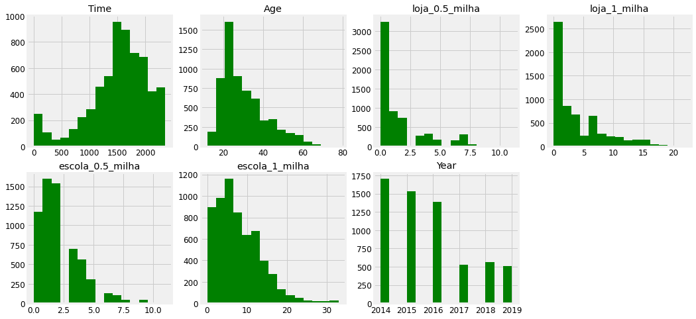
    


Parece que nenhuma variável segue uma distribuição normal. Checamos isso daqui a pouco. Vamos conferir o dataframe de escolas.


```python
df_escolas.head()
```


<div>
<style scoped>
    .dataframe tbody tr th:only-of-type {
        vertical-align: middle;
    }

    .dataframe tbody tr th {
        vertical-align: top;
    }

    .dataframe thead th {
        text-align: right;
    }
</style>
<table border="1" class="dataframe">
  <thead>
    <tr style="text-align: right;">
      <th></th>
      <th>School</th>
      <th>Zip Code</th>
      <th>Grades</th>
      <th>Local District</th>
      <th>Board District</th>
      <th>complete_address</th>
      <th>latitude</th>
      <th>longitude</th>
      <th>prisao_0.5_milha</th>
      <th>prisao_1_milha</th>
    </tr>
  </thead>
  <tbody>
    <tr>
      <th>0</th>
      <td>Frank Del Olmo Elementary</td>
      <td>90004</td>
      <td>K- 5</td>
      <td>C</td>
      <td>2-Monica Garcia</td>
      <td>100 N New Hampshire Ave Los Angeles CA 90004</td>
      <td>34.072925</td>
      <td>-118.292591</td>
      <td>28</td>
      <td>95</td>
    </tr>
    <tr>
      <th>1</th>
      <td>10th Street Elementary</td>
      <td>90015</td>
      <td>1- 5</td>
      <td>C</td>
      <td>2-Monica Garcia</td>
      <td>1000 Grattan St Los Angeles CA 90015</td>
      <td>34.048284</td>
      <td>-118.273264</td>
      <td>26</td>
      <td>141</td>
    </tr>
    <tr>
      <th>2</th>
      <td>Elementary Community Day School</td>
      <td>91311</td>
      <td>K- 6</td>
      <td>XS</td>
      <td>3-Scott M Schmerelson</td>
      <td>10001 Jumilla Ave Chatsworth CA 91311</td>
      <td>34.251825</td>
      <td>-118.563377</td>
      <td>1</td>
      <td>3</td>
    </tr>
    <tr>
      <th>3</th>
      <td>Cesar E Chavez Learning Academy - Arts/Theatre...</td>
      <td>91340</td>
      <td>9-12</td>
      <td>NE</td>
      <td>6-Kelly Gonez</td>
      <td>1001 Arroyo Ave San Fernando CA 91340</td>
      <td>34.288514</td>
      <td>-118.421011</td>
      <td>1</td>
      <td>16</td>
    </tr>
    <tr>
      <th>4</th>
      <td>San Pedro Senior High Gifted STEAM Magnet</td>
      <td>90731</td>
      <td>9-12</td>
      <td>S</td>
      <td>7-Dr Richard A Vladovic</td>
      <td>1001 W 15th St San Pedro CA 90731</td>
      <td>33.730370</td>
      <td>-118.299342</td>
      <td>18</td>
      <td>74</td>
    </tr>
  </tbody>
</table>
</div>


```python
# Vamos criar o histograma dessas duas variáveis
df_escolas_var = df_escolas[['prisao_0.5_milha', 'prisao_1_milha']]

# Describe
df_escolas_var.describe()
```


<div>
<style scoped>
    .dataframe tbody tr th:only-of-type {
        vertical-align: middle;
    }

    .dataframe tbody tr th {
        vertical-align: top;
    }

    .dataframe thead th {
        text-align: right;
    }
</style>
<table border="1" class="dataframe">
  <thead>
    <tr style="text-align: right;">
      <th></th>
      <th>prisao_0.5_milha</th>
      <th>prisao_1_milha</th>
    </tr>
  </thead>
  <tbody>
    <tr>
      <th>count</th>
      <td>914.000000</td>
      <td>914.000000</td>
    </tr>
    <tr>
      <th>mean</th>
      <td>14.219912</td>
      <td>53.638950</td>
    </tr>
    <tr>
      <th>std</th>
      <td>28.074045</td>
      <td>68.279071</td>
    </tr>
    <tr>
      <th>min</th>
      <td>0.000000</td>
      <td>0.000000</td>
    </tr>
    <tr>
      <th>25%</th>
      <td>1.000000</td>
      <td>12.000000</td>
    </tr>
    <tr>
      <th>50%</th>
      <td>7.000000</td>
      <td>32.000000</td>
    </tr>
    <tr>
      <th>75%</th>
      <td>19.000000</td>
      <td>73.000000</td>
    </tr>
    <tr>
      <th>max</th>
      <td>552.000000</td>
      <td>677.000000</td>
    </tr>
  </tbody>
</table>
</div>


```python
# Histogramas

# Figura
fig = plt.figure(figsize = (20,10))

# Loop pelas variáveis e plot do histograma
for i, col in enumerate(df_escolas_var):  
    fig.add_subplot(2, 4, 1 + i)
    col_data = df_escolas[col] 
    plt.hist(col_data, bins = 20, color = 'green')
    plt.title(col)
```


    
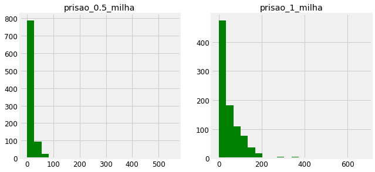
    


Parece que nenhuma variável segue uma distribuição normal. Vamos checar então.

### Teste de Normalidade das Variáveis

Muitos algoritmos de Machine Learning fazem suposições sobre os dados. Em geral, consideramos que essas suposições são verdadeiras, mas devemos tomar cuidado com isso, pois se uma suposição estiver sendo violada estaremos extraindo conclusões equivocadas de todo o processo de Ciência de Dados.

E uma das suposições mais comuns é a de normalidade, ou seja, que a variável segue uma distribuição normal. Isso significa que a distribuição de probabilidades da variável (todos os possíveis valores que a variável pode assumir), tem o formato como da imagem abaixo, a categoria Mesocurtica:


**Distribuição Normal**

Uma distribuição normal (ou gaussiana) é uma distribuição de probabilidade contínua que possui uma função de densidade de probabilidade em forma de sino. É a distribuição de probabilidade mais proeminente em Estatística.

As distribuições normais são uma família de distribuições com a mesma curva geral simétrica em forma de sino, com mais valores concentrados no meio do que nas caudas. Dois parâmetros descrevem uma distribuição normal, a média e o desvio padrão. A média é a localização central (o pico) e o desvio padrão é a dispersão. A assimetria e curtose são zero para uma distribuição normal.

A distribuição normal é a base de muitas teorias estatísticas. Testes estatísticos e estimadores baseados na distribuição normal costumam ser mais poderosos do que seus equivalentes não paramétricos. Quando a suposição de distribuição pode ser atendida, elas são as melhores opções, pois isso permite usar um tamanho de amostra menor para detectar a mesma diferença.

E podemos usar uma das mais úteis ferramentas da Inferência Estatística para testar essa suposição: o Teste de Hipóteses.

**Teste de Hipóteses**

O teste de hipóteses é o processo formal de fazer inferências a partir de uma amostra, se uma afirmação sobre a população parece ou não verdadeira.

Um teste de hipóteses é um método de tomada de decisões. Você deve declarar uma hipótese nula e uma hipótese alternativa para executar um teste de hipóteses. A hipótese nula afirma o que o estudo pretende rejeitar e refutar. A hipótese alternativa é geralmente a negação da hipótese nula e afirma o que o estudo está tentando provar.

Quando as hipóteses são declaradas, um teste estatístico calcula uma estatística e um valor-p. O valor-p é a probabilidade de obter uma estatística de teste pelo menos tão extrema quanto a observada quando a hipótese nula é verdadeira. É uma medida de evidência contra a hipótese nula. Quando o valor-p é pequeno, é improvável que os dados tenham ocorrido se a hipótese nula for verdadeira, para que você possa rejeitar a hipótese nula e aceitar a hipótese alternativa. Quando o valor-p é grande, você não pode rejeitar a hipótese nula; não há evidências suficientes contra isso. 

Não é possível provar a hipótese nula, apenas refutá-la. O valor-p não permite que você faça afirmações sobre a probabilidade da hipótese nula ser verdadeira; é uma declaração baseada na observação dos dados.

Um Teste de Hipóteses testa formalmente se a população que a amostra representa é normalmente distribuída.

A hipótese nula (H0) afirma que a população é normalmente distribuída, contra a hipótese alternativa (H1) de que não é normalmente distribuída. 

Se o valor-p do teste for menor que o nível de significância predefinido, você poderá rejeitar a hipótese nula e concluir que os dados não são de uma população com uma distribuição normal. Se o valor-p for maior que o nível de significância predefinido, você não poderá rejeitar a hipótese nula.

Observe que pequenos desvios da normalidade podem produzir um valor-p estatisticamente significativo quando o tamanho da amostra é grande e, inversamente, pode ser impossível detectar a não normalidade com uma amostra pequena. Você sempre deve examinar o gráfico normal e usar seu julgamento, em vez de confiar apenas no teste de hipóteses. Muitos testes estatísticos e estimadores são robustos contra partidas moderadas na normalidade devido ao teorema central do limite limite central.

Vamos criar uma função e testar a normalidade das variáveis.


```python
# Função para testar a normalidade das variáveis
def testa_normalidade(dataframe, list_of_cols ,sig_level = 0.05):
    
    # Lista de colunas do dataframe
    total_variables = len(list_of_cols)
    
    # Inicializa o contador de variáveis que forem 'não normais'
    not_normal_variables = 0
    
    # Loop em cada coluna da lista de colunas
    for col in list_of_cols:
        
        # Executa o teste de normalidade para a variável
        p_val = stats.normaltest(dataframe[col])[1]
        
        # Nível de Significância
        sig_lvl = 0.05
        
        # Verifica o valor-p
        if p_val < sig_lvl:
            print(f'{col}')
            print(f'Valor-p: {p_val}\nNível de Significância: {sig_lvl}\n')
            print("Como o Valor-p é menor que o Nível de Significância, rejeitamos a hipótese nula e concluímos que a variável não segue uma distribuição normal.\n")
            not_normal_variables += 1
        elif p_val > sig_lvl:
            print(f'{col}')
            print(f'Valor-p: {p_val}\nNível de Significância: {sig_lvl}\n')
            print("Como o Valor-p é maior que o Nível de Significância, nós falhamos em rejeitar a hipótese nula.\n")
    
    if not_normal_variables/total_variables == 1:
        print('Para cada variável, como o valor-p é menor que o nível de significância, rejeite a hipótese nula e conclua que a variável não segue a distribuição normal.')
    else:
        print(f'{not_normal_variables} varáveis que não seguem uma distribuição normal')

```


```python
# Executa a função
testa_normalidade(df_prisoes, df_prisoes_var)
```

    Time
    Valor-p: 3.7075045947738646e-165
    Nível de Significância: 0.05
    
    Como o Valor-p é menor que o Nível de Significância, rejeitamos a hipótese nula e concluímos que a variável não segue uma distribuição normal.
    
    Age
    Valor-p: 1.1205894980358965e-190
    Nível de Significância: 0.05
    
    Como o Valor-p é menor que o Nível de Significância, rejeitamos a hipótese nula e concluímos que a variável não segue uma distribuição normal.
    
    loja_0.5_milha
    Valor-p: 0.0
    Nível de Significância: 0.05
    
    Como o Valor-p é menor que o Nível de Significância, rejeitamos a hipótese nula e concluímos que a variável não segue uma distribuição normal.
    
    loja_1_milha
    Valor-p: 4.4033558398110414e-263
    Nível de Significância: 0.05
    
    Como o Valor-p é menor que o Nível de Significância, rejeitamos a hipótese nula e concluímos que a variável não segue uma distribuição normal.
    
    escola_0.5_milha
    Valor-p: 5.0694706410973965e-291
    Nível de Significância: 0.05
    
    Como o Valor-p é menor que o Nível de Significância, rejeitamos a hipótese nula e concluímos que a variável não segue uma distribuição normal.
    
    escola_1_milha
    Valor-p: 3.0549557307258627e-231
    Nível de Significância: 0.05
    
    Como o Valor-p é menor que o Nível de Significância, rejeitamos a hipótese nula e concluímos que a variável não segue uma distribuição normal.
    
    Year
    Valor-p: 1.621262148164662e-125
    Nível de Significância: 0.05
    
    Como o Valor-p é menor que o Nível de Significância, rejeitamos a hipótese nula e concluímos que a variável não segue uma distribuição normal.
    
    Para cada variável, como o valor-p é menor que o nível de significância, rejeite a hipótese nula e conclua que a variável não segue a distribuição normal.
    


```python
# Executa a função
testa_normalidade(df_escolas, df_escolas_var)
```

    prisao_0.5_milha
    Valor-p: 0.0
    Nível de Significância: 0.05
    
    Como o Valor-p é menor que o Nível de Significância, rejeitamos a hipótese nula e concluímos que a variável não segue uma distribuição normal.
    
    prisao_1_milha
    Valor-p: 2.89834664499081e-162
    Nível de Significância: 0.05
    
    Como o Valor-p é menor que o Nível de Significância, rejeitamos a hipótese nula e concluímos que a variável não segue uma distribuição normal.
    
    2 varáveis que não seguem uma distribuição normal
    

**Conclusão**: Nenhuma variável segue uma distribuição normal, o que significa que devemos ser cautelosos ao criar nossos modelos preditivos na Parte 3.

### Conclusão Final

Claramente parece haver um padrão entre o volume de prisões e a legalização da maconha. A proximidade das prisões com pontos de vendas ou com escolas não parece variar de um ano para o outro, o que leva a crer que que pontos de venda ou escolas não estão ligados às prisões. Talvez outro fator explique melhor a redução das prisões. Acho que Machine Learning poderá ajudar nisso. Até a Parte 3.


<h1 style="font-weight:bold">Qual o Efeito da Legalização da Maconha na Taxa de Criminalidade ao Longo do Tempo?</h1>

<hr/>
<h2>Parte 3 - Construção e avaliação do modelo</h2>
<hr/>

<h3>1) INTRODUÇÃO</h3>

<h3>1.1) Carregando os Pacotes Usados Neste Jupyter Notebook</h3>


```python
import warnings
warnings.filterwarnings("ignore")

# Imports para manipulação e visualização de dados
import math
import numpy as np
import pandas as pd
import matplotlib as mpl
import seaborn as sns
import matplotlib.pyplot as plt
from scipy import stats

# Imports para Machine Learning
import sklearn
from sklearn.linear_model import LogisticRegression
from sklearn.model_selection import train_test_split, GridSearchCV
from sklearn.feature_extraction.text import CountVectorizer
from sklearn.pipeline import Pipeline
from sklearn.metrics import confusion_matrix
from sklearn.metrics import roc_auc_score
from sklearn.preprocessing import StandardScaler

# Imports para Análise de Séries Temporais
import pickle
import calendar
import statsmodels
from statsmodels.tsa.arima_model import ARIMA, ARMA
from sklearn.metrics import mean_squared_error
from statsmodels.tsa.stattools import adfuller 
from statsmodels.tsa.stattools import acf, pacf

# Imports para formatação dos gráficos
mpl.rcParams['axes.labelsize'] = 14
mpl.rcParams['xtick.labelsize'] = 12
mpl.rcParams['ytick.labelsize'] = 12
from matplotlib.pylab import rcParams 
rcParams['figure.figsize'] = 15,7
plt.style.use('fivethirtyeight')
%matplotlib inline
```

<hr/>

<h3>2) MODELAGEM PREDITIVA </h3>

Vamos iniciar nosso trabalho criando um modelo de Machine Learning para classificação e compreendendo quais são as variáveis mais relevantes para prever a ocorrência de prisões.


```python
# Carregando os dados
df_prisoes = pd.read_csv('dados/df_prisoes_parte2.csv')
```


```python
# Shape
df_prisoes.shape
```


    (6226, 14)


```python
# Dados
df_prisoes.head()
```


<div>
<style scoped>
    .dataframe tbody tr th:only-of-type {
        vertical-align: middle;
    }

    .dataframe tbody tr th {
        vertical-align: top;
    }

    .dataframe thead th {
        text-align: right;
    }
</style>
<table border="1" class="dataframe">
  <thead>
    <tr style="text-align: right;">
      <th></th>
      <th>Arrest Date</th>
      <th>Time</th>
      <th>Area Name</th>
      <th>Age</th>
      <th>Sex Code</th>
      <th>Descent Code</th>
      <th>Arrest Type Code</th>
      <th>Charge Description</th>
      <th>latitude</th>
      <th>longitude</th>
      <th>loja_0.5_milha</th>
      <th>loja_1_milha</th>
      <th>escola_0.5_milha</th>
      <th>escola_1_milha</th>
    </tr>
  </thead>
  <tbody>
    <tr>
      <th>0</th>
      <td>2019-03-09</td>
      <td>2015.0</td>
      <td>Hollywood</td>
      <td>29</td>
      <td>M</td>
      <td>O</td>
      <td>F</td>
      <td>possession marijuana for sale</td>
      <td>34.1016</td>
      <td>-118.3350</td>
      <td>7</td>
      <td>8</td>
      <td>2</td>
      <td>5</td>
    </tr>
    <tr>
      <th>1</th>
      <td>2019-03-09</td>
      <td>2015.0</td>
      <td>Hollywood</td>
      <td>25</td>
      <td>M</td>
      <td>B</td>
      <td>F</td>
      <td>possession marijuana for sale</td>
      <td>34.1016</td>
      <td>-118.3350</td>
      <td>7</td>
      <td>8</td>
      <td>2</td>
      <td>5</td>
    </tr>
    <tr>
      <th>2</th>
      <td>2019-04-21</td>
      <td>2115.0</td>
      <td>Wilshire</td>
      <td>42</td>
      <td>M</td>
      <td>B</td>
      <td>F</td>
      <td>poss/sale marij ovr 21 employ per 20/belw</td>
      <td>34.0838</td>
      <td>-118.3614</td>
      <td>4</td>
      <td>13</td>
      <td>4</td>
      <td>8</td>
    </tr>
    <tr>
      <th>3</th>
      <td>2019-05-01</td>
      <td>1045.0</td>
      <td>Pacific</td>
      <td>26</td>
      <td>M</td>
      <td>B</td>
      <td>F</td>
      <td>sale/trans &gt;28.5g marijuana or &gt;4g</td>
      <td>33.9428</td>
      <td>-118.4054</td>
      <td>0</td>
      <td>0</td>
      <td>0</td>
      <td>0</td>
    </tr>
    <tr>
      <th>4</th>
      <td>2019-05-01</td>
      <td>5.0</td>
      <td>N Hollywood</td>
      <td>27</td>
      <td>M</td>
      <td>B</td>
      <td>F</td>
      <td>sale/trans &gt;28.5g marijuana or &gt;4g</td>
      <td>34.1667</td>
      <td>-118.3965</td>
      <td>0</td>
      <td>1</td>
      <td>3</td>
      <td>4</td>
    </tr>
  </tbody>
</table>
</div>


```python
# Criamos uma lista de razões para as prisões
charge_description_list = list(df_prisoes['Charge Description'].unique())
```


```python
# Ordenamos a lista
charge_description_list.sort()
```


```python
# Dados
charge_description_list
```


    ['attempt - sell/furnish/etc marijuana',
     'cultivate >6 marij plants viol envrnt law',
     'cultivating <6 marijuana plants',
     'furnishing marijuana to minor over 14 yrs',
     'give/transport/etc < 28.5 grams marijuana',
     'induce/etc minor to use/sell marijuana',
     'minor poss 28.5+ grams marijuana/school',
     'minor poss < 28.5 grams marijuana/school',
     'poss for sale of marijuana to a minor',
     'poss marijuana or concentrated cannabis',
     'poss of more than 28.5 grams of marijuana',
     'poss open cont/packg marij drivr/passnger',
     'poss/sale marij ovr 21 employ per 20/belw',
     'poss/smoke/ingest marij school/daycare/yc',
     'possess 28.5 grams or less of marijuana',
     'possess 28.5 grams or less of marijuana**',
     'possess marijuana for sale',
     'possess marijuana for sale under age 18',
     'possess of marijuana while driving veh',
     'possession marijuana for sale',
     'possession of marijuana in school',
     'sale/offer to sell/transport marijuana',
     'sale/trans >28.5g marijuana or >4g',
     'sale/transport marijuana to a minor',
     'sale/transport marijuana w/priors',
     'sell/furnish/etc marij/hash over 1 oz',
     'smoke marij loc where smoke tobacco proh',
     'smoke/ingest marijuana in public place',
     'transport/etc marijuana',
     'transport/sell/furnish/etc marijuana',
     'unlawfully plant/cultivate/etc marijuana',
     'use minor under 14 trans/sell marijuana']


Agora criaremos nossa variável target (venda ou não de maconha).


```python
# Aplicamos função map para identificar venda de maconha
target = df_prisoes['Charge Description'].map(lambda x: 'sell' if 'sale' in x else x)
```


```python
# Então identificamos venda ou não de maconha
target = target.map(lambda x: 'sell' if 'sell' in x else x)
target = target.map(lambda x: 'not sell' if 'sell' not in x else x)
```


```python
# Contamos os registros de cada classe e mostramos como proporção
target.value_counts(normalize = True)
```


    sell        0.616929
    not sell    0.383071
    Name: Charge Description, dtype: float64


Como as classes são um pouco desequilibradas, vamos estratificá-las para que haja a mesma proporção de observações de 'venda' e 'não venda' nos conjuntos de dados de treino e teste, mais a frente.


```python
# Inclui a variável no dataframe
df_prisoes['target'] = target
```


```python
# Fazemos o encoding substituindo as classes por valores 0 ou 1
df_prisoes['target'] = df_prisoes['target'].map(lambda x: 1 if x == 'sell' else 0)
```


```python
# Dados
df_prisoes.head()
```


<div>
<style scoped>
    .dataframe tbody tr th:only-of-type {
        vertical-align: middle;
    }

    .dataframe tbody tr th {
        vertical-align: top;
    }

    .dataframe thead th {
        text-align: right;
    }
</style>
<table border="1" class="dataframe">
  <thead>
    <tr style="text-align: right;">
      <th></th>
      <th>Arrest Date</th>
      <th>Time</th>
      <th>Area Name</th>
      <th>Age</th>
      <th>Sex Code</th>
      <th>Descent Code</th>
      <th>Arrest Type Code</th>
      <th>Charge Description</th>
      <th>latitude</th>
      <th>longitude</th>
      <th>loja_0.5_milha</th>
      <th>loja_1_milha</th>
      <th>escola_0.5_milha</th>
      <th>escola_1_milha</th>
      <th>target</th>
    </tr>
  </thead>
  <tbody>
    <tr>
      <th>0</th>
      <td>2019-03-09</td>
      <td>2015.0</td>
      <td>Hollywood</td>
      <td>29</td>
      <td>M</td>
      <td>O</td>
      <td>F</td>
      <td>possession marijuana for sale</td>
      <td>34.1016</td>
      <td>-118.3350</td>
      <td>7</td>
      <td>8</td>
      <td>2</td>
      <td>5</td>
      <td>1</td>
    </tr>
    <tr>
      <th>1</th>
      <td>2019-03-09</td>
      <td>2015.0</td>
      <td>Hollywood</td>
      <td>25</td>
      <td>M</td>
      <td>B</td>
      <td>F</td>
      <td>possession marijuana for sale</td>
      <td>34.1016</td>
      <td>-118.3350</td>
      <td>7</td>
      <td>8</td>
      <td>2</td>
      <td>5</td>
      <td>1</td>
    </tr>
    <tr>
      <th>2</th>
      <td>2019-04-21</td>
      <td>2115.0</td>
      <td>Wilshire</td>
      <td>42</td>
      <td>M</td>
      <td>B</td>
      <td>F</td>
      <td>poss/sale marij ovr 21 employ per 20/belw</td>
      <td>34.0838</td>
      <td>-118.3614</td>
      <td>4</td>
      <td>13</td>
      <td>4</td>
      <td>8</td>
      <td>1</td>
    </tr>
    <tr>
      <th>3</th>
      <td>2019-05-01</td>
      <td>1045.0</td>
      <td>Pacific</td>
      <td>26</td>
      <td>M</td>
      <td>B</td>
      <td>F</td>
      <td>sale/trans &gt;28.5g marijuana or &gt;4g</td>
      <td>33.9428</td>
      <td>-118.4054</td>
      <td>0</td>
      <td>0</td>
      <td>0</td>
      <td>0</td>
      <td>1</td>
    </tr>
    <tr>
      <th>4</th>
      <td>2019-05-01</td>
      <td>5.0</td>
      <td>N Hollywood</td>
      <td>27</td>
      <td>M</td>
      <td>B</td>
      <td>F</td>
      <td>sale/trans &gt;28.5g marijuana or &gt;4g</td>
      <td>34.1667</td>
      <td>-118.3965</td>
      <td>0</td>
      <td>1</td>
      <td>3</td>
      <td>4</td>
      <td>1</td>
    </tr>
  </tbody>
</table>
</div>


Variável target incluída. Vamos checar algumas correlações.


```python
# Correlação entre as variáves de distância do ponto de venda
df_corr = df_prisoes[['target', 'Time', 'Age', 'loja_0.5_milha', 'loja_1_milha', 'escola_0.5_milha', 'escola_1_milha']]

plt.figure(figsize=(14, 6))
sns.heatmap(df_corr.corr(), annot=True)
```


    <AxesSubplot:>


    
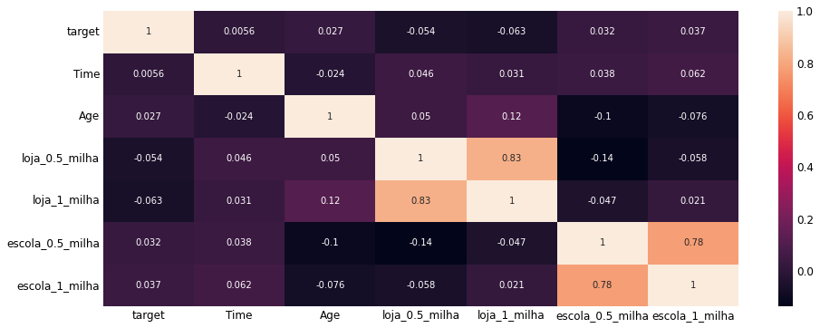
    


As variáveis que nós criamos `loja_0.5_milha`, `loja_1_milha`, `escola_0.5_milha`, `escola_1_milha`  estão altamente correlacionadas e isso é ruim para o modelo.


```python
# Remove variáveis e coloca o restante em X
X = df_prisoes.drop(['Arrest Date', 'Charge Description', 'target', 'loja_0.5_milha', 'escola_0.5_milha'], 1)
```


```python
# Remove variáveis e coloca o restante em X
X = df_prisoes.drop(['Arrest Date', 'Charge Description', 'target', 'loja_0.5_milha', 'escola_0.5_milha'], 1)
```


```python
# Criamos variáveis dummy para as variáveis categóricas, pois assim trabalhamos apenas com variáveis numéricas
X = pd.get_dummies(X)
```


```python
# Dados
X.head()
```


<div>
<style scoped>
    .dataframe tbody tr th:only-of-type {
        vertical-align: middle;
    }

    .dataframe tbody tr th {
        vertical-align: top;
    }

    .dataframe thead th {
        text-align: right;
    }
</style>
<table border="1" class="dataframe">
  <thead>
    <tr style="text-align: right;">
      <th></th>
      <th>Time</th>
      <th>Age</th>
      <th>latitude</th>
      <th>longitude</th>
      <th>loja_1_milha</th>
      <th>escola_1_milha</th>
      <th>Area Name_77th Street</th>
      <th>Area Name_Central</th>
      <th>Area Name_Devonshire</th>
      <th>Area Name_Foothill</th>
      <th>...</th>
      <th>Descent Code_F</th>
      <th>Descent Code_G</th>
      <th>Descent Code_H</th>
      <th>Descent Code_O</th>
      <th>Descent Code_P</th>
      <th>Descent Code_W</th>
      <th>Descent Code_X</th>
      <th>Arrest Type Code_F</th>
      <th>Arrest Type Code_I</th>
      <th>Arrest Type Code_M</th>
    </tr>
  </thead>
  <tbody>
    <tr>
      <th>0</th>
      <td>2015.0</td>
      <td>29</td>
      <td>34.1016</td>
      <td>-118.3350</td>
      <td>8</td>
      <td>5</td>
      <td>0</td>
      <td>0</td>
      <td>0</td>
      <td>0</td>
      <td>...</td>
      <td>0</td>
      <td>0</td>
      <td>0</td>
      <td>1</td>
      <td>0</td>
      <td>0</td>
      <td>0</td>
      <td>1</td>
      <td>0</td>
      <td>0</td>
    </tr>
    <tr>
      <th>1</th>
      <td>2015.0</td>
      <td>25</td>
      <td>34.1016</td>
      <td>-118.3350</td>
      <td>8</td>
      <td>5</td>
      <td>0</td>
      <td>0</td>
      <td>0</td>
      <td>0</td>
      <td>...</td>
      <td>0</td>
      <td>0</td>
      <td>0</td>
      <td>0</td>
      <td>0</td>
      <td>0</td>
      <td>0</td>
      <td>1</td>
      <td>0</td>
      <td>0</td>
    </tr>
    <tr>
      <th>2</th>
      <td>2115.0</td>
      <td>42</td>
      <td>34.0838</td>
      <td>-118.3614</td>
      <td>13</td>
      <td>8</td>
      <td>0</td>
      <td>0</td>
      <td>0</td>
      <td>0</td>
      <td>...</td>
      <td>0</td>
      <td>0</td>
      <td>0</td>
      <td>0</td>
      <td>0</td>
      <td>0</td>
      <td>0</td>
      <td>1</td>
      <td>0</td>
      <td>0</td>
    </tr>
    <tr>
      <th>3</th>
      <td>1045.0</td>
      <td>26</td>
      <td>33.9428</td>
      <td>-118.4054</td>
      <td>0</td>
      <td>0</td>
      <td>0</td>
      <td>0</td>
      <td>0</td>
      <td>0</td>
      <td>...</td>
      <td>0</td>
      <td>0</td>
      <td>0</td>
      <td>0</td>
      <td>0</td>
      <td>0</td>
      <td>0</td>
      <td>1</td>
      <td>0</td>
      <td>0</td>
    </tr>
    <tr>
      <th>4</th>
      <td>5.0</td>
      <td>27</td>
      <td>34.1667</td>
      <td>-118.3965</td>
      <td>1</td>
      <td>4</td>
      <td>0</td>
      <td>0</td>
      <td>0</td>
      <td>0</td>
      <td>...</td>
      <td>0</td>
      <td>0</td>
      <td>0</td>
      <td>0</td>
      <td>0</td>
      <td>0</td>
      <td>0</td>
      <td>1</td>
      <td>0</td>
      <td>0</td>
    </tr>
  </tbody>
</table>
<p>5 rows × 42 columns</p>
</div>


```python
# Separamos y
y = df_prisoes['target']

# Dados
y.head()
```


    0    1
    1    1
    2    1
    3    1
    4    1
    Name: target, dtype: int64


```python
# Divisão em dados de treino e teste
X_treino, X_teste, y_treino, y_teste = train_test_split(X, y, random_state = 42, stratify = y)
```


```python
# Cria o modelo
modelo_lr = LogisticRegression()
```


```python
# Treinamento do modelo
modelo_lr.fit(X_treino, y_treino)
```


    LogisticRegression()


```python
# Avalia a acurácia em treino
acc_treino = modelo_lr.score(X_treino, y_treino)
print(f'Acurácia em Treino: {round(acc_treino, 2) * 100}')
```

    Acurácia em Treino: 88.0
    


```python
# Avalia a acurácia em teste
acc_teste = modelo_lr.score(X_teste, y_teste)
print(f'Acurácia em Teste: {round(acc_teste, 2) * 100}')
```

    Acurácia em Teste: 90.0
    

Estamos com boa acurácia. Vamos extrair os coeficientes e realizar mais algumas análises.


```python
# Coeficientes beta do modelo
beta = modelo_lr.coef_[0]

# Atributos
atributos = list(X.columns)


# Criamos um dataframe associando os coeficientes aos atributos e ajustamos o índice
beta_df = pd.DataFrame({'atributos': atributos, 'beta' :beta})
beta_df.set_index('atributos', inplace = True)

# Dados
beta_df.head()
```


<div>
<style scoped>
    .dataframe tbody tr th:only-of-type {
        vertical-align: middle;
    }

    .dataframe tbody tr th {
        vertical-align: top;
    }

    .dataframe thead th {
        text-align: right;
    }
</style>
<table border="1" class="dataframe">
  <thead>
    <tr style="text-align: right;">
      <th></th>
      <th>beta</th>
    </tr>
    <tr>
      <th>atributos</th>
      <th></th>
    </tr>
  </thead>
  <tbody>
    <tr>
      <th>Time</th>
      <td>-0.000316</td>
    </tr>
    <tr>
      <th>Age</th>
      <td>-0.026792</td>
    </tr>
    <tr>
      <th>latitude</th>
      <td>-0.384416</td>
    </tr>
    <tr>
      <th>longitude</th>
      <td>-0.122456</td>
    </tr>
    <tr>
      <th>loja_1_milha</th>
      <td>-0.104165</td>
    </tr>
  </tbody>
</table>
</div>


```python
# Vamos extrair o Log ODD
beta_df['log_odds'] = beta_df['beta'].map(lambda x: np.exp(x))

# Ordenamos os dados
beta_df = beta_df.sort_values('log_odds', ascending = False)

# Dados
beta_df.head(10)
```


<div>
<style scoped>
    .dataframe tbody tr th:only-of-type {
        vertical-align: middle;
    }

    .dataframe tbody tr th {
        vertical-align: top;
    }

    .dataframe thead th {
        text-align: right;
    }
</style>
<table border="1" class="dataframe">
  <thead>
    <tr style="text-align: right;">
      <th></th>
      <th>beta</th>
      <th>log_odds</th>
    </tr>
    <tr>
      <th>atributos</th>
      <th></th>
      <th></th>
    </tr>
  </thead>
  <tbody>
    <tr>
      <th>Arrest Type Code_F</th>
      <td>3.533070</td>
      <td>34.228896</td>
    </tr>
    <tr>
      <th>Area Name_Southeast</th>
      <td>0.891613</td>
      <td>2.439061</td>
    </tr>
    <tr>
      <th>Descent Code_B</th>
      <td>0.837634</td>
      <td>2.310893</td>
    </tr>
    <tr>
      <th>Area Name_Pacific</th>
      <td>0.522064</td>
      <td>1.685503</td>
    </tr>
    <tr>
      <th>Sex Code_F</th>
      <td>0.327264</td>
      <td>1.387168</td>
    </tr>
    <tr>
      <th>Area Name_Central</th>
      <td>0.194716</td>
      <td>1.214965</td>
    </tr>
    <tr>
      <th>Area Name_Harbor</th>
      <td>0.183709</td>
      <td>1.201666</td>
    </tr>
    <tr>
      <th>Area Name_77th Street</th>
      <td>0.166752</td>
      <td>1.181461</td>
    </tr>
    <tr>
      <th>Area Name_Hollywood</th>
      <td>0.123011</td>
      <td>1.130897</td>
    </tr>
    <tr>
      <th>Area Name_Southwest</th>
      <td>0.060034</td>
      <td>1.061872</td>
    </tr>
  </tbody>
</table>
</div>


Todas as variáveis são relevantes para a previsão de prisão por venda de maconha.


```python
# Vamos verificar os registros de escolas a 1 milha de distância
beta_df[beta_df.index == 'escola_1_milha']
```


<div>
<style scoped>
    .dataframe tbody tr th:only-of-type {
        vertical-align: middle;
    }

    .dataframe tbody tr th {
        vertical-align: top;
    }

    .dataframe thead th {
        text-align: right;
    }
</style>
<table border="1" class="dataframe">
  <thead>
    <tr style="text-align: right;">
      <th></th>
      <th>beta</th>
      <th>log_odds</th>
    </tr>
    <tr>
      <th>atributos</th>
      <th></th>
      <th></th>
    </tr>
  </thead>
  <tbody>
    <tr>
      <th>escola_1_milha</th>
      <td>0.005502</td>
      <td>1.005517</td>
    </tr>
  </tbody>
</table>
</div>


O modelo de Regressão Logística permite extrair não apenas previsões de classe, mas também as probabilidades. Vejamos que análises podemos fazer com isso.


```python
# Probabilidades da prisão por venda de maconha (classe target = 1)
prob_prisao_venda = modelo_lr.predict_proba(X_teste)[:,1]

# Probabilidades
prob_prisao_venda
```


    array([0.1241772 , 0.93640364, 0.97823587, ..., 0.97812515, 0.98510637,
           0.93686608])


```python
# Cria um dataframe com valores reais e probabilidades previstas
pred_df = pd.DataFrame({'valores_reais': y_teste, 'valores_previstos':prob_prisao_venda})

# Dados
pred_df.head()
```


<div>
<style scoped>
    .dataframe tbody tr th:only-of-type {
        vertical-align: middle;
    }

    .dataframe tbody tr th {
        vertical-align: top;
    }

    .dataframe thead th {
        text-align: right;
    }
</style>
<table border="1" class="dataframe">
  <thead>
    <tr style="text-align: right;">
      <th></th>
      <th>valores_reais</th>
      <th>valores_previstos</th>
    </tr>
  </thead>
  <tbody>
    <tr>
      <th>1780</th>
      <td>0</td>
      <td>0.124177</td>
    </tr>
    <tr>
      <th>2379</th>
      <td>0</td>
      <td>0.936404</td>
    </tr>
    <tr>
      <th>3731</th>
      <td>1</td>
      <td>0.978236</td>
    </tr>
    <tr>
      <th>6068</th>
      <td>1</td>
      <td>0.964818</td>
    </tr>
    <tr>
      <th>4958</th>
      <td>1</td>
      <td>0.967546</td>
    </tr>
  </tbody>
</table>
</div>


Um Plot facilita análise e compreensão.


```python
# Plot da Distribuição de Probabilidades

# Figura
plt.figure(figsize = (18,10))

# Histograma dos valores reais x valores previstos para a classe 1
plt.hist(pred_df[pred_df['valores_reais'] == 1]['valores_previstos'], 
         bins = 30, 
         color = 'r', 
         alpha = 0.6, 
         label = 'Venda de Maconha')

# Histograma dos valores reais x valores previstos para a classe 0
plt.hist(pred_df[pred_df['valores_reais'] == 0]['valores_previstos'],
         bins = 30,
         color = 'blue',
         alpha = 0.6,
         label = 'Sem Venda de Maconha')

# Linha central do gráfico - vline - vertical line
plt.vlines(x = 0.5, ymin = 0, ymax = 200, color = 'green', linestyle = '--')

# Labels e Legenda
plt.title('\nDistribuição de Probabilidade\n', fontsize = 20)
plt.ylabel('\nFrequência\n', fontsize = 20)
plt.xlabel('\nProbabilidade Prevista de Prisões Por Venda de Maconha\n', fontsize = 18)
plt.legend(fontsize = 20);
```


    
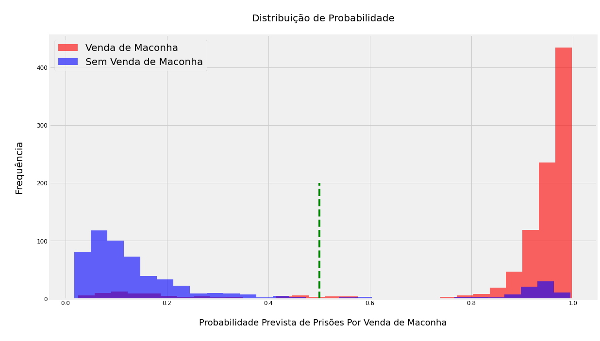
    


Será que a proximidade de um Departamento de Polícia altera o resultado? Vamos analisar.


```python
# Extrai os coeficientes por nome da área
beta_df = beta_df[beta_df.index.str.contains('Area Name')].head(8)

# Dados
beta_df.head()
```


<div>
<style scoped>
    .dataframe tbody tr th:only-of-type {
        vertical-align: middle;
    }

    .dataframe tbody tr th {
        vertical-align: top;
    }

    .dataframe thead th {
        text-align: right;
    }
</style>
<table border="1" class="dataframe">
  <thead>
    <tr style="text-align: right;">
      <th></th>
      <th>beta</th>
      <th>log_odds</th>
    </tr>
    <tr>
      <th>atributos</th>
      <th></th>
      <th></th>
    </tr>
  </thead>
  <tbody>
    <tr>
      <th>Area Name_Southeast</th>
      <td>0.891613</td>
      <td>2.439061</td>
    </tr>
    <tr>
      <th>Area Name_Pacific</th>
      <td>0.522064</td>
      <td>1.685503</td>
    </tr>
    <tr>
      <th>Area Name_Central</th>
      <td>0.194716</td>
      <td>1.214965</td>
    </tr>
    <tr>
      <th>Area Name_Harbor</th>
      <td>0.183709</td>
      <td>1.201666</td>
    </tr>
    <tr>
      <th>Area Name_77th Street</th>
      <td>0.166752</td>
      <td>1.181461</td>
    </tr>
  </tbody>
</table>
</div>


Os Departamentos de Polícia na cidade de Los Angeles estão registrados aqui:
    
http://www.lapdonline.org/our_communities/content_basic_view/6279 
   
Precisamos das coordenadas para os gráficos.


```python
# Latitude dos Departamentos de Polícia na cidade de Los Angeles
beta_df['latitude'] = [33.9383761, 34.097986, 33.9920067, 34.0443028, 33.7584097, 34.050264, 34.1195162, 34.1842023]

# Longitude dos Departamentos de Polícia na cidade de Los Angeles
beta_df['longitude'] = [-118.2749244, -118.331013, -118.4199295, -118.4509833, -118.2880336, -118.291531, -118.2497385, -118.3021552]

```

Criamos o Plot.


```python
# Plot da classe 1 com principais atributos versus prisões por maconha

# Figura
fig, ax = plt.subplots(figsize = (14,8))

# Plot
plt.scatter(df_prisoes[df_prisoes['target'] == 1]['latitude'], 
            df_prisoes[df_prisoes['target'] == 1]['longitude'], 
            s = 15, 
            alpha = 0.4,
            label = 'Prisões Por Venda de Maconha')

# Títulos, labels e legenda
ax.scatter(beta_df['latitude'], beta_df['longitude'], color = 'red', label = 'Departamentos de Polícia em LA', s = 100)
plt.title('\nPrisões Por Venda de Maconha x Departamentos de Polícia em LA\n', fontsize = 24)
plt.xlabel('\nLatitude\n', fontsize = 20)
plt.ylabel('\nLongitude\n', fontsize = 20)
ax.legend(fontsize = 20)
plt.tight_layout()
```


    
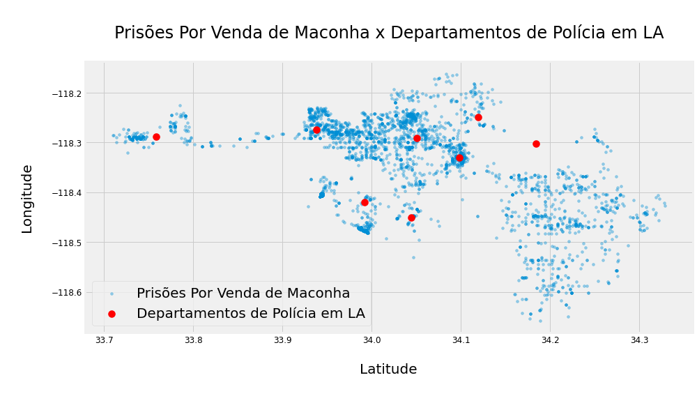
    


```python
    # Plot da classe 0 com principais atributos versus prisões por maconha

# Figura
fig, ax = plt.subplots(figsize = (16,8))

# Plot
plt.scatter(df_prisoes[df_prisoes['target'] ==0]['latitude'], 
            df_prisoes[df_prisoes['target'] ==0]['longitude'], 
            s = 15, 
            alpha = 0.4,
            label = 'Prisões Por Outras Razões')

# Títulos, labels e legenda
ax.scatter(beta_df['latitude'], beta_df['longitude'], color = 'red', label = 'Departamentos de Polícia em LA', s = 100)
plt.title('\nPrisões Por Outras Razões x Departamentos de Polícia em LA\n', fontsize = 24)
plt.xlabel('\nLatitude\n', fontsize = 20)
plt.ylabel('\nLongitude\n', fontsize = 20)
ax.legend(fontsize = 20)
plt.tight_layout()
```


    
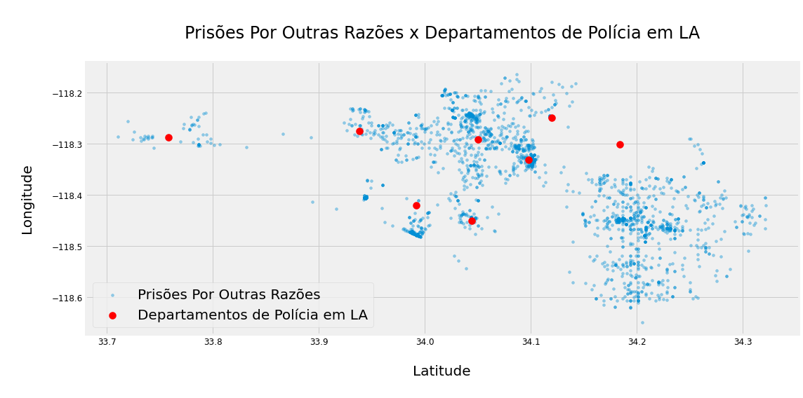
    


Como resultado, o medo de exposição à maconha para crianças e menores parece não ser um fator. Existem duas classes: vender maconha e não vender maconha, e argumenta-se que a venda de maconha expõe mais crianças à maconha. A variável **escola_1_milha** é a contagem de escolas que estão dentro de 1 milha de cada prisão. Devido às chances de log de 'escola_1_milha' iguais a uma, ter uma escola a menos de 1,6 km de uma prisão é tão provável quanto a prisão por maconha estar relacionada à venda e a não venda.
