# Marketing Analytics

Projeto completo de Marketing Analytics com técnicas avançadas de Análise Descritiva, Análise Estatística, Clusterização, Regressão e Business Analytics com o objetivo de explicar e realizar previsões para as areas de Marketing, Vendas e Gestão do negócio da empresa.

---

<h2>SUMÁRIO</h2>

* <a href="#id_1">1) DEFINIÇÃO DO PROJETO</a>
    * <a href="#id_1">1.1) Introdução ao Marketing Analytics</a>
    * <a href="#id_2">1.2) Como o Marketing Analytics Funciona?</a>
    * <a href="#id_3">1.3) Objetivo do Projeto</a>
    * <a href="#id_4">1.4) Objetivo Pessoal</a>


* <a href="#id_2">2) ANÁLISE EXPLORATÓRIA DOS DADOS</a>
    * <a href="#id_2-0">2.0) Importações</a>
    * <a href="#id_2-1">2.1) Visão Geral</a>
    * <a href="#id_2-2">2.2) Análise por atributo individual</a>
        * <a href="#id_2-2-1">2.2.1) Cliente (client_id)</a>
        * <a href="#id_2-2-2">2.2.2) Valores (value)</a>
        * <a href="#id_2-2-3">2.2.3) Ano (year)</a>
        * <a href="#id_2-2-4">2.2.4) Mês (month)</a>
        * <a href="#id_2-2-5">2.2.5) Dia do mês (day) e mês (month)</a>
        * <a href="#id_2-2-6">2.2.6) Dia da semana (day_week e day_week_name)</a>
        * <a href="#id_2-2-7">2.2.7) Semana do ano (week)</a>
    * <a href="#id_2-3">2.3) Análise de Variabilidade e Crescimento das vendas</a>
        * <a href="#id_2-3-1">2.3.1) Variabilidade por ano</a>
        * <a href="#id_2-3-2">2.3.2) Variabilidade por meses</a>
        * <a href="#id_2-3-3">2.3.3) Variabilidade por dias</a>
        * <a href="#id_2-3-4">2.3.4) Variabilidade por semana</a>


* <a href="#id_3">3) SEGMENTAÇÃO ESTATÍSTICA E HIERÁRQUICA PARA EQUIPE DE MARKETING</a>
    * <a href="#id_3-0">3.0) Importações</a>
    * <a href="#id_3-1">3.1) Análise Exploratória</a>
    * <a href="#id_3-2">3.2) Pré Processamento</a>
        * <a href="#id_3-2-1">3.2.1) Distribuição Normal</a>
        * <a href="#id_3-2-2">3.2.2) Padronização e escala dos dados</a>
    * <a href="#id_3-3">3.3) Técnicas de Clustering</a>
        * <a href="#id_3-3-1">3.3.1) Escolhando a quantidade de Clusters</a>
        * <a href="#id_3-3-2">3.3.2) Clustering Hierárquico</a>
        * <a href="#id_3-3-3">3.3.3) Clustering Hierárquico com PCA</a>
    * <a href="#id_3-4">3.4) Análise de Resultados</a>
        * <a href="#id_3-4-1">3.4.1) Resultados obtidos sem PCA</a>
        * <a href="#id_3-4-2">3.4.2) Resultados obtidos com PCA</a>


* <a href="#id_4">4) SEGMENTAÇÃO GERENCIAL PARA EQUIPES DE VENDAS</a>
    * <a href="#id_4-1">4.1) Pre Processamento</a>
    * <a href="#id_4-2">4.2) Analisando Resultados</a>
    * <a href="#id_4-3">4.3) Computando faturamento em 2015</a>


* <a href="#id_5">5) PREVISÃO DE FATURAMENTO</a>
    * <a href="#id_5-0">5.0) Importações</a>
    * <a href="#id_5-1">5.1) Previsão para cada Cliente</a>
        * <a href="#id_5-1-1">5.1.1) Pré processamento</a>
        * <a href="#id_5-1-2">5.1.2) Divisão em Treino e Teste</a>
        * <a href="#id_5-1-3">5.1.3) Padronização e Escala</a>
        * <a href="#id_5-1-4">5.1.4) Validação Cruzada</a>
        * <a href="#id_5-1-5">5.1.5) Modelagem inicial</a>
        * <a href="#id_5-1-6">5.1.6) Auto Model Machine Learning</a>
        * <a href="#id_5-1-7">5.1.7) Aplicando o melhor modelo</a>


* <a href="#id_6">6) CALCULANDO O LIFE TIME VALUE</a>
    * <a href="#id_6-1">6.1) Quantidade de clientes por segmento para os próximos anos</a>
        * <a href="#id_6-1-1">6.1.1) Calculo dos Segmentos para os Clientes de 2014</a>
        * <a href="#id_6-1-2">6.1.2) Calculo dos Segmentos para os Clientes de 2015</a>
        * <a href="#id_6-1-3">6.1.3) Calculo do Faturamento por Cliente nos Anos de 2014 e 2015</a>
        * <a href="#id_6-1-4">6.1.4) Criando a Tabela Cruzada dos Dados (Cross Table)</a>
        * <a href="#id_6-1-5">6.1.5) Criação da Tabela de Previsões para os Próximos 10 Anos</a>
        * <a href="#id_6-1-6">6.1.6) Previsão da quantidade de Clientes para os Próximos 10 Anos</a>
    * <a href="#id_6-2">6.2) Valor dos Clientes por Segmento</a>
        * <a href="#id_6-2-1">6.2.1) Faturamento Anul por Segmento</a>
        * <a href="#id_6-2-2">6.2.2) Faturamento Acumulado</a>


* <a href="#id_7">7) RESULTADOS OBTIDOS</a>


* <a href="#id_8">8) CONSIDERAÇÕES FINAIS</a>


---

<h2 id="id_1">1) DEFINIÇÃO DO PROJETO</h2>

<h2 id="id_1-1">1.1) Introdução ao Marketing Analytics</h2>

A análise de marketing é o estudo de dados para avaliar o desempenho de uma atividade de marketing. Ao aplicar tecnologia e processos analíticos aos dados relacionados ao marketing, as empresas podem entender o que impulsiona as ações do consumidor, refinar suas campanhas de marketing e otimizar o retorno do investimento.

Com a análise de marketing podes responder perguntas como essa:
* Como estão nossas atividades de marketing hoje? Que tal a longo prazo? O que podemos fazer para melhorá-los?
* Como nossas atividades de marketing se comparam com nossos concorrentes? Onde eles estão gastando seus dólares de marketing? 
* Nossos recursos de marketing estão alocados adequadamente?
* Estamos dedicando tempo e dinheiro aos canais certos? 
* Como devemos priorizar nossos investimentos em um determinado período de tempo?

---

<h2 id="id_1-2">1.2) Como o Marketing Analytics Funciona?</h2>

1. **Identifique o que você deseja medir**: 
Defina exatamente o que você espera realizar por meio de seu marketing. Comece com o objetivo geral da sua estratégia de marketing e, em seguida, comece a detalhar campanhas e canais de marketing específicos. As métricas podem incluir retorno do investimento, taxa de conversão, taxa de cliques ou reconhecimento da marca. Você também deseja definir benchmarks e marcos ao longo do caminho que o ajudarão a avaliar e adaptar suas técnicas de marketing.
<br/>

2. **Use uma variedade equilibrada de técnicas e ferramentas analíticas**: Para obter o máximo benefício da análise de marketing, você precisará de uma variedade equilibrada de técnicas e ferramentas. Use a análise para:
    * **Relatório sobre o passado**: Ao usar técnicas que analisam o passado, você pode responder a perguntas como: Quais elementos da campanha geraram mais receita no último trimestre? Qual foi o desempenho da campanha de mídia social A em relação à campanha de mala direta B? Quantos leads geramos desta série de webinars versus aquela temporada de podcasts?
    * **Analise o presente**: Determine o desempenho de suas iniciativas de marketing no momento. Como os clientes estão se relacionando conosco? Quais canais nossos clientes mais lucrativos preferem? Quem está falando sobre nós e onde?
    * **Prever ou influenciar o futuro**: A análise de marketing pode fornecer previsões orientadas por dados que ajudam você a moldar o futuro. Você pode responder a perguntas como: Como as vitórias de curto prazo podem ser moldadas em lealdade? Como adicionar mais representantes de vendas em regiões de baixo desempenho afetará a receita? Quais cidades devemos segmentar em seguida?
<br/>
<br/>

3. **Avalie suas capacidades analíticas e preencha as lacunas**: A tecnologia de análise de marketing é abundante, por isso pode ser difícil saber de quais ferramentas você realmente precisa. Mas não comece por aí; comece com sua capacidade geral. Avalie seus recursos atuais para determinar onde você está no espectro analítico. Em seguida, comece a identificar onde estão as lacunas e desenvolva uma estratégia para preenchê-las.

4. **Aja de acordo com o que você aprende**: O uso de dados é um dos maiores desafios enfrentados pelos profissionais de marketing atualmente. Há apenas assim. Muito. Dados! É por isso que o Passo 1 é tão importante: se você sabe que o que está fazendo atualmente não está ajudando você a alcançar seus objetivos, então você sabe que é hora de testar e iterar.<br/>
Aplicada de forma holística, a análise de marketing permite campanhas de marketing mais bem-sucedidas e uma melhor experiência geral do cliente. Especificamente, quando posta em prática, a análise de marketing pode levar a um melhor planejamento de oferta e demanda, otimização de preços e nutrição e gerenciamento robustos de leads – tudo isso leva a uma maior lucratividade.

Referências: 
* [1] **Marketing Analytics** - What it is and why it matters. SAS. Disponível em: <a target="_blank" href="https://www.sas.com/en_us/insights/marketing/marketing-analytics.html#:~:text=Marketing%20analytics%20is%20the%20study,optimize%20their%20return%20on%20investment.">sas.com</a>

---

<h2 id="id_1-3">1.3) Objetivo do Projeto</h2>

Dado o contexto sobre Marketing Analytics, este projeto tem por objetivo realizar uma análise de marketing completa utilizando várias técnicas para responder a perguntas de negócio. Responderemos perguntas de modo que os gestores, a equipe de marketing e a equipe de vendas tenham em mãos um relatório completo sobre como direcionar os esforços da empresa para obter maiores resultados em suas respectivas areas.

Como citado, este projeto contempla uma análise multidisciplinar e abrange diversas areas da empresa, com diferentes tipos de análises, tais como:
* **Análise exploratória dos dados**: Vamos ter uma visão geral sobre como os dados estão distribuídos, faremos uma análise para cada atributo a fim de identificar padrões, relações e fazer algumas inferências.
* **Análise de Variabilidade**: O objetivo desta análise é observar como os dados variam ao longo dos meses e dos dias. Vamos observar quais meses são mais lucrativos para a empresa, quais dias da semana têm mais vendas e como os dados se comportam ao longo do tempo.

* **Segmentação Estatística e Hierárquica para Equipe de Marketing**: Nesta estapa do projeto vamos aplicar técnicas de Machine Learning para agrupar os dados de modo a formar grupos (clusters) de clientes semelhantes, possibilitando que a equipe de Marketing possa tomar as ações necessárias para cada grupo de cliente. Iremos utilizar o algoritmo Kmeans para escolher a melhor quantidade de clusters e depois o método do Cluster Hierárquico para separar os dados em grupos de interesse.

* **Segmentação Gerencial para Equipe de Vendas**: Aqui vamos rotular os clientes em alguns grupos, de acordo com o quão ativo este cliente é para a empresa. Dessa forma teremos classificações informando se o cliente é *ativo*, *novo ativo*, *quente*, *frio* ou *inativo*. Vamos obter as informações de quantidade, média de valor gasto, somatório de compra, dentre outras informações releventas para o negócio para cada segmento de cliente. Permitindo que a equipe de vendas saiba para qual grupo de clientes ela deve direcionar os esforços de vendas com base nos dados.

* **Previsão de Faturamento**: E se criarmos um modelo de Machine Learning capaz de prever quanto o cliente vai gastar? Vamos fazer isso aplicando técnicas avançadas de Machine Learning e teremos um modelo que seja capaz de prever qual o valor que o cliente vai gastar com base no que ele já gastou na nossa loja.

* **Life Time Value (LTV)**: Para finalizar com chave de ouro, vamos calcular o Life Time Value dos clientes, isto é, o período que o cliente vai passar sendo nosso cliente e o quanto ele vai gastar nesse tempo. Também vamos calcular o faturamento médio anual previsto para os próximos 10 anos da empresa e o faturamento acumulado da empresa.

* **Apresentação Final do Resultado**: Por fim, vamos extrair todos os resultados e insights obtidos para apresentar para os nossos gestores para que possam tomar as decisões baseadas em dados e muita análise.

---

<h2 id="id_1-4">1.4) Objetivo Pessoal</h2>

Como o objetivo pessoal acredito que a realização deste projeto vai engrandecer meu conhecimento a cerca do tema de Marketing Analytics, uma área muito vasta e incrível, com possibilidades quase que infinitas.

Eu decidi pegar um dataset simples para ver o quanto de informação relevante eu pude tirar em um dataset com apenas três atributos. Além disso, foi uma forma de compilar vários conceitos que eu tenho estudado nos últimos meses sobre vários temas: Análise de dados, estatística, Machine Learning, além do próprio Marketing Analytics e vários outros.

Contudo, ainda há muita coisa a se fazer com este conjunto de dados. Eu poderia aplicar técnicas de Time Series para realizar previsões de faturamentos futuros, eu poderia ter aplicado o conceito de redes neurais no modelo de classificação, ou ainda, ter explorado mais a parte de Machine Learning, aplicando mais algoritmos de regressão.

Como aprendizado técnico vou citar as diferentes técnicas para manipualação de DataFrames utilizando o pacote Pandas, acredito que evolui muuuito com esse pacote tão vasto em possibilidades, além disso, as técnicas utilizadas para a clusterização dos dados, já que esse tipo de aprendizado é um ponto de melhoria para mim.

---

<h2 id="id_2">2) ANÁLISE EXPLORATÓRIA DOS DADOS</h2>

Neste capítulo vou fazer uma análise para ter uma visão geral dos dados, verificar os valores, ranges e como as variáveis estão se comportando. Vou também adicionar novas colunas que serão relevantes para a análise.

<h2 id="id_2-0">2.0) Importações</h2>

Começando com as importações que utilizaremos nessa etapa. Nada de novo, vamos utilizar a trindade imprescindível do Python: Pandas, Numpy e bibliotecas gráficos (Matplotlib, Seaborn e Plotly).


```python
#Bibliotecas principais do python
import pandas as pd
import numpy as np

#Bibliotecas gráficos
import seaborn as sns 
import matplotlib.pyplot as plt
import plotly.graph_objs as go
import plotly.express as px

#Vamos ignorar os avisos, para deixar o código mais limpo
import warnings
warnings.filterwarnings("ignore")
```

<h2 id="id_2-1">2.1) Visão Geral</h2>


```python
#Realizando o carregamento dos dados e atribuindo nome as colunas.
df = pd.read_csv('data/compras.txt', sep='\t', header=None)
df.columns = ['client_id', 'value', 'date']
```

Aqui vamos realizar um mapeamento e algumas transformações. Eu quero obter as vendas separadas por dia, semana, mês e ano. Além disso, quero saber é o dia da semana: Segunda-feira, terça-feira, etc..., por isso o mapeamento utilizando `weekday_map`.


```python
weekday_map = {
    0: 'monday',
    1: 'tuesday',
    2: 'wednesday',
    3: 'thursday',
    4: 'friday',
    5: 'saturday',
    6: 'sunday'
}

df['date'] = pd.to_datetime(df['date'])

df['day'] = df['date'].dt.day
df['month'] = df['date'].dt.month
df['year'] = df['date'].dt.year
df['day_week'] = df['date'].dt.dayofweek
df['week'] = df['date'].dt.weekofyear
df['day_week_name'] = df['day_week'].map(weekday_map)
```


```python
df.head()
```


<div>
<style scoped>
    .dataframe tbody tr th:only-of-type {
        vertical-align: middle;
    }

    .dataframe tbody tr th {
        vertical-align: top;
    }

    .dataframe thead th {
        text-align: right;
    }
</style>
<table border="1" class="dataframe">
  <thead>
    <tr style="text-align: right;">
      <th></th>
      <th>client_id</th>
      <th>value</th>
      <th>date</th>
      <th>day</th>
      <th>month</th>
      <th>year</th>
      <th>day_week</th>
      <th>week</th>
      <th>day_week_name</th>
    </tr>
  </thead>
  <tbody>
    <tr>
      <th>0</th>
      <td>760</td>
      <td>25.0</td>
      <td>2009-11-06</td>
      <td>6</td>
      <td>11</td>
      <td>2009</td>
      <td>4</td>
      <td>45</td>
      <td>friday</td>
    </tr>
    <tr>
      <th>1</th>
      <td>860</td>
      <td>50.0</td>
      <td>2012-09-28</td>
      <td>28</td>
      <td>9</td>
      <td>2012</td>
      <td>4</td>
      <td>39</td>
      <td>friday</td>
    </tr>
    <tr>
      <th>2</th>
      <td>1200</td>
      <td>100.0</td>
      <td>2005-10-25</td>
      <td>25</td>
      <td>10</td>
      <td>2005</td>
      <td>1</td>
      <td>43</td>
      <td>tuesday</td>
    </tr>
    <tr>
      <th>3</th>
      <td>1420</td>
      <td>50.0</td>
      <td>2009-07-09</td>
      <td>9</td>
      <td>7</td>
      <td>2009</td>
      <td>3</td>
      <td>28</td>
      <td>thursday</td>
    </tr>
    <tr>
      <th>4</th>
      <td>1940</td>
      <td>70.0</td>
      <td>2013-01-25</td>
      <td>25</td>
      <td>1</td>
      <td>2013</td>
      <td>4</td>
      <td>4</td>
      <td>friday</td>
    </tr>
  </tbody>
</table>
</div>


Agora nosso dataset possui muito mais informações, quebrar as informações dessa forma como fizemos irá nos permitir realizar uma análise bem mais completa.


```python
df.describe().T
```


<div>
<style scoped>
    .dataframe tbody tr th:only-of-type {
        vertical-align: middle;
    }

    .dataframe tbody tr th {
        vertical-align: top;
    }

    .dataframe thead th {
        text-align: right;
    }
</style>
<table border="1" class="dataframe">
  <thead>
    <tr style="text-align: right;">
      <th></th>
      <th>count</th>
      <th>mean</th>
      <th>std</th>
      <th>min</th>
      <th>25%</th>
      <th>50%</th>
      <th>75%</th>
      <th>max</th>
    </tr>
  </thead>
  <tbody>
    <tr>
      <th>client_id</th>
      <td>51243.0</td>
      <td>108934.547938</td>
      <td>67650.610139</td>
      <td>10.0</td>
      <td>57720.0</td>
      <td>102440.0</td>
      <td>160525.0</td>
      <td>264200.0</td>
    </tr>
    <tr>
      <th>value</th>
      <td>51243.0</td>
      <td>62.337195</td>
      <td>156.606801</td>
      <td>5.0</td>
      <td>25.0</td>
      <td>30.0</td>
      <td>60.0</td>
      <td>4500.0</td>
    </tr>
    <tr>
      <th>day</th>
      <td>51243.0</td>
      <td>18.157992</td>
      <td>9.259684</td>
      <td>1.0</td>
      <td>10.0</td>
      <td>19.0</td>
      <td>26.0</td>
      <td>31.0</td>
    </tr>
    <tr>
      <th>month</th>
      <td>51243.0</td>
      <td>8.395761</td>
      <td>3.526799</td>
      <td>1.0</td>
      <td>5.0</td>
      <td>10.0</td>
      <td>12.0</td>
      <td>12.0</td>
    </tr>
    <tr>
      <th>year</th>
      <td>51243.0</td>
      <td>2010.869699</td>
      <td>2.883072</td>
      <td>2005.0</td>
      <td>2009.0</td>
      <td>2011.0</td>
      <td>2013.0</td>
      <td>2015.0</td>
    </tr>
    <tr>
      <th>day_week</th>
      <td>51243.0</td>
      <td>3.106044</td>
      <td>1.420202</td>
      <td>0.0</td>
      <td>2.0</td>
      <td>3.0</td>
      <td>4.0</td>
      <td>6.0</td>
    </tr>
    <tr>
      <th>week</th>
      <td>51243.0</td>
      <td>32.205491</td>
      <td>16.857996</td>
      <td>1.0</td>
      <td>17.0</td>
      <td>38.0</td>
      <td>48.0</td>
      <td>53.0</td>
    </tr>
  </tbody>
</table>
</div>


Aqui temos algumas informações importantes e relevantes para continuar a análise. Vamos observar as colunas `value` e `year`. A média do valor de vendas totais é de $62.60, já a mediana fica com $30.00. Sabe o que isso indica? Outliers!

Veja que até o quartil 75% o valor está em $60, mas o valor máximo é de $4500, isso representa uma diferença muito grande. É possível mesmo que tenhoa havido uma venda com o valor de $4500, mas com certeza, foi uma venda atípica, portanto teremos que tomar cuidado ao trabalhar com estes dados.


```python
#O dataset possui 51243 registros
df.shape
```


    (51243, 9)


```python
#Não há valores missing, é um dataset bastante limpo.
df.isnull().sum()
```


    client_id        0
    value            0
    date             0
    day              0
    month            0
    year             0
    day_week         0
    week             0
    day_week_name    0
    dtype: int64


<h2 id="id_2-2">2.2) Análise por atributo individual</h2>

Agora iremos observar informações mais detalhadas para cada atributo individualmente. É um passo importante para temos ideia do que significa cada variável e seus respetivos valores. 

<h3 id="id_2-2-1">2.2.1) Cliente (client_id)</h3>

Começando pelo cliente, veremos que a base de dados possui registros de mais de 18400 clientes. São bastante clientes! Para obter informações detalhadas de cada cliente vamos fazer um agrupamento dos dados por cliente e realizar um `count` (contagem), conceito muito importante originado da linguagem SQL e que o Pandas oferece excelentes recursos para fazer isso.

> A consulta em SQL seria: `SELECT client_id, COUNT(*) FROM df_client GROUP BY client_id ORDER BY value DESC`


```python
df_client = df.copy() #Fazendo uma copia do dataset original.
df_client = pd.DataFrame(df_client.groupby('client_id', as_index=False)['value'].count().sort_values(by='value', ascending=False))
df_client['client_id'] = df_client['client_id'].astype(str)
print(f'A base de dados possui {df_client.shape[0]} clientes')
```

    A base de dados possui 18417 clientes
    


```python
df_client.head(5)
```


<div>
<style scoped>
    .dataframe tbody tr th:only-of-type {
        vertical-align: middle;
    }

    .dataframe tbody tr th {
        vertical-align: top;
    }

    .dataframe thead th {
        text-align: right;
    }
</style>
<table border="1" class="dataframe">
  <thead>
    <tr style="text-align: right;">
      <th></th>
      <th>client_id</th>
      <th>value</th>
    </tr>
  </thead>
  <tbody>
    <tr>
      <th>457</th>
      <td>9720</td>
      <td>45</td>
    </tr>
    <tr>
      <th>6978</th>
      <td>109370</td>
      <td>41</td>
    </tr>
    <tr>
      <th>7868</th>
      <td>119430</td>
      <td>38</td>
    </tr>
    <tr>
      <th>534</th>
      <td>10720</td>
      <td>37</td>
    </tr>
    <tr>
      <th>526</th>
      <td>10640</td>
      <td>34</td>
    </tr>
  </tbody>
</table>
</div>


```python
df_client = df_client.head(20)
fig = px.bar(x=df_client['client_id'], y=df_client['value'].values, text=df_client['value'].values)

fig.update_layout(
    title='<span>Quantidade de compras por clientes (Top 20)</span>', 
    autosize=False,
    width=1200,
    height=400,
    yaxis=dict(title='<span>Quantidade</span>'),
    xaxis=dict(title='<span>Clientes</span>')
)

fig.show()
```


    
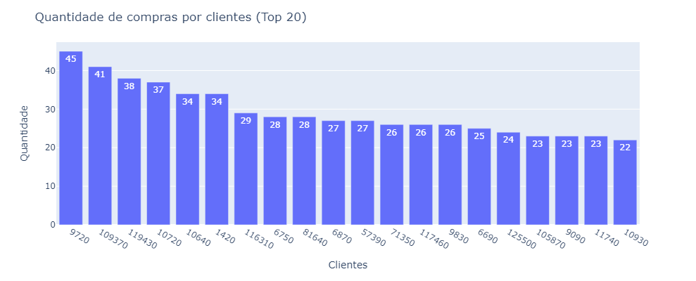
    


Pelo gráfico vemos o top 20 clientes que mais realizaram compras na nossa loja. Só com isso já podemos tomar algumas medidas, como por exemplo, tomar medidas para que esses clientes continuem comprando na loja.


Abaixo estou realizando o mesmo agrupamento, mas dessa vez estou fazendo o `sum` (somatório) dos valores para obter o quanto o cliente está gastando na nossa loja.
> Nota: Poderia ter feito tudo em um único agrupamento (`count` e `sum`), mas eu quis fazer separado para ficar mais didático, mais a frente vamos fazer tudo um único group by.


> A consulta em SQL: `SELECT client_id, SUM(*) FROM df_client GROUP BY client_id ORDER BY value DESC`


```python
df_client = df.copy()
df_client = df_client.groupby(['client_id'], as_index=False)['value'].sum().sort_values(by='value', ascending=False).head(20)
df_client['client_id'] = df_client['client_id'].astype(str)
df_client.head(5)
```


<div>
<style scoped>
    .dataframe tbody tr th:only-of-type {
        vertical-align: middle;
    }

    .dataframe tbody tr th {
        vertical-align: top;
    }

    .dataframe thead th {
        text-align: right;
    }
</style>
<table border="1" class="dataframe">
  <thead>
    <tr style="text-align: right;">
      <th></th>
      <th>client_id</th>
      <th>value</th>
    </tr>
  </thead>
  <tbody>
    <tr>
      <th>734</th>
      <td>13610</td>
      <td>24350.0</td>
    </tr>
    <tr>
      <th>9913</th>
      <td>144610</td>
      <td>17000.0</td>
    </tr>
    <tr>
      <th>6020</th>
      <td>98550</td>
      <td>15507.0</td>
    </tr>
    <tr>
      <th>11383</th>
      <td>164930</td>
      <td>14000.0</td>
    </tr>
    <tr>
      <th>9621</th>
      <td>141340</td>
      <td>13351.0</td>
    </tr>
  </tbody>
</table>
</div>


```python
fig = px.bar(x=df_client['client_id'], y=df_client['value'].values, text=df_client['value'].values)

fig.update_layout(
    title='<span>Clientes que mais gastaram na loja (Top 20)</span>', 
    autosize=False,
    width=1400,
    height=400,
    yaxis=dict(title='<span>Valor $</span>'),
    xaxis=dict(title='<span>Clientes</span>')
)

fig.show()
```


    
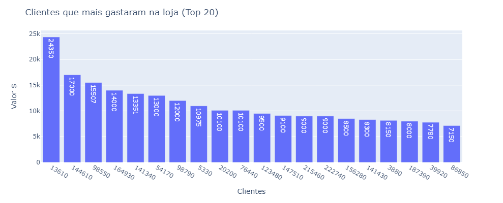
    


Opa, aqui podemos ter insights diferentes. Vemos que embora o cliente 9720 tenha sido o que mais comprou na nossa loja, foi o cliente 13610 que mais gastou. Se analisarmos apenas o top 20, poucos dados se repetem, portanto, os clientes que mais compram na loja não necessariamente são os que mais dão lucro.

Temos que ligar o alerta para cada um desse grupo.

<h3 id="id_2-2-2">2.2.2) Valores (value)</h3>

Podemos agora analisar a variável `value`que representa os valores da compra pelos clientes. Essa é uma variável numérica contínua, logo poderemos fazer algumas análises estatísticas bem interessantes.


```python
df_value = df.copy()
df_value['value'].describe()
```


    count    51243.000000
    mean        62.337195
    std        156.606801
    min          5.000000
    25%         25.000000
    50%         30.000000
    75%         60.000000
    max       4500.000000
    Name: value, dtype: float64


Como já havia dito anteriormente, é nítido a presença de outliers nesse dataset. Vou ressaltar, o outliers não necessáriamente indicam um erro, é possível que um cliente tenha feito uma compra de $4500 na loja.


```python
fig = px.box(df_value, y='value')

fig.update_layout(
    title='<span>Boxplot para verificar outliers</span>', 
    autosize=False,
    width=600,
    height=600,
)

fig.show()
```


    
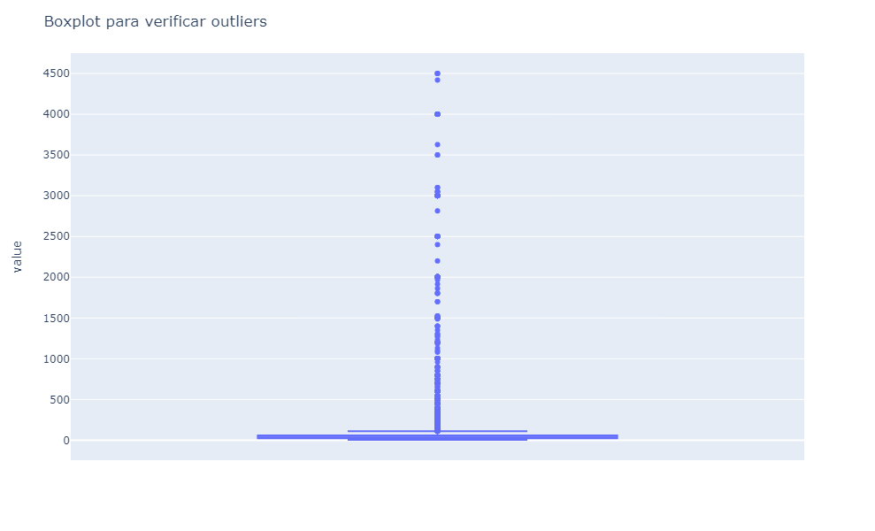
    


O `boxplot` é uma ferramente gráfica muito interessante para verificar os outliers. Vamos analisar o gráfico:
* As bolinhas indicam a presença de outliers;
* A partir do valor 115 o gráfico considerou outlier;
* O valor mínimo é 5;
* A mediana está muito próxima do Q1 (Quartil 1);
* A diferença entre o limite superior e o Q3 (Quartil 3) é bem maior que a diferença entre o limite inferior e o Q1 (Quartil 1)

Concluímos que o conjunto de dados está muito desbalanceado, e teremos que aplicar técnicas para tratar isso, pois basicamente todos os modelos de Machine Learning trabalham com Distribuições Normais.


```python
df_value_filter = df_value.loc[df_value['value'] <= 115]

plt.figure(figsize=(12, 6))
sns.histplot(df_value_filter['value'], kde=True, bins=10).set(title='Histograma de valores (sem outliers)')
```


    [Text(0.5, 1.0, 'Histograma de valores (sem outliers)')]


    
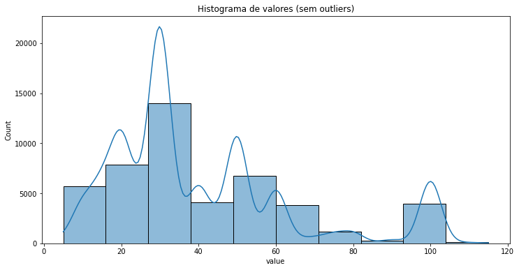
    


```python
df_value_filter['value'].skew()
```


    1.203762147428507


Removendo os outliers e analisando o restante do conjunto de dados podemos perceber que o dataset já deu uma boa melhorada e a distribuição parece mais "normal". Porém, ao observar o Skewness notamos que o valor é 1.2, que indica que os dados ainda sim estão assimétricos e o que queremos é que esse valor seja o mais próximo de zero possível. Abaixo uma breve descrição do que estou falando.

> **Skewness (Distorção)**<br/>
> Na teoria da probabilidade e estatística, a assimetria é uma medida da assimetria da distribuição de probabilidade de uma variável aleatória de valor real em relação à sua média. O valor de assimetria pode ser positivo, zero, negativo ou indefinido.
> * Se v>0, então a distribuição tem uma cauda direita mais pesada (valores acima da média)
> * Se v<0, então a distribuição tem uma cauda esquerda mais pesada (valores abaixo da média)
> * Se v=0, então a distribuição é aproximadamente simétrica (na terceira potência do desvio da média).


```python
sns.pairplot(df_value[['value', 'day', 'month', 'year', 'week']])
```


    <seaborn.axisgrid.PairGrid at 0x1edd1cd7eb0>


    
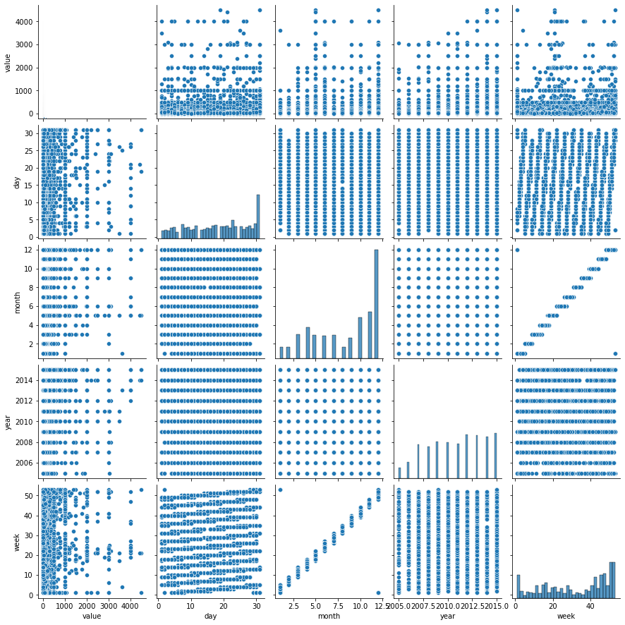
    


Observando o pairplot notamos que aparentemente não há uma relação clara entre o valor da compra e as variáveis dia, mês, ano e semana. Talvez a melhor relação é que a medida que o ano passa os clientes gastam mais. Mas é muito cedo para tirar qualquer conclusão, não vamos nos precipitar. Até porque um fator externo corrobora para essa tese, a inflação dos preços, ou seja, o que custava $10 em 2005, em 2015 pode estar custando $50.

Ou seja, não necessariamente implica que o cliente passou a gastar mais ao longo do tempo.


```python
df_value_filter = df_value[['value', 'day', 'month', 'year', 'week']].corr()

plt.figure(figsize=(10,6))
sns.heatmap(df_value_filter, annot=True).set(title='Matriz de Correlação')
```


    [Text(0.5, 1.0, 'Matriz de Correlação')]


    
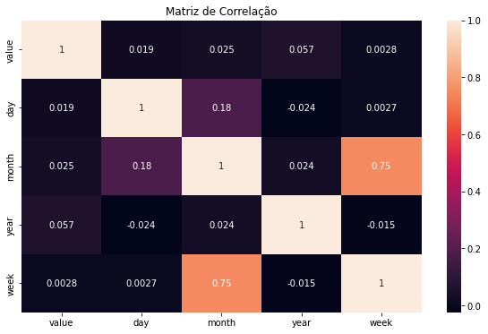
    


Observando a matriz de correlação, veja que realmente não há uma correlação entre o atributo `value` e os demais atributos.

<h3 id="id_2-2-3">2.2.3) Ano (year)</h3>

Vejamos a análise por ano, veremos que a loja realmente teve um aumento de vendas no decorrer dos anos, o que representa um crescimento.


```python
df_year = df.copy()
df_year = df.groupby(['year'], as_index=False)['value'].count().sort_values(by='year', ascending=True)
df_year['year'] = df_year['year'].astype(str)
df_year.sort_values(by='value', ascending=False)
```


<div>
<style scoped>
    .dataframe tbody tr th:only-of-type {
        vertical-align: middle;
    }

    .dataframe tbody tr th {
        vertical-align: top;
    }

    .dataframe thead th {
        text-align: right;
    }
</style>
<table border="1" class="dataframe">
  <thead>
    <tr style="text-align: right;">
      <th></th>
      <th>year</th>
      <th>value</th>
    </tr>
  </thead>
  <tbody>
    <tr>
      <th>10</th>
      <td>2015</td>
      <td>6197</td>
    </tr>
    <tr>
      <th>7</th>
      <td>2012</td>
      <td>5960</td>
    </tr>
    <tr>
      <th>8</th>
      <td>2013</td>
      <td>5912</td>
    </tr>
    <tr>
      <th>9</th>
      <td>2014</td>
      <td>5739</td>
    </tr>
    <tr>
      <th>4</th>
      <td>2009</td>
      <td>5054</td>
    </tr>
    <tr>
      <th>5</th>
      <td>2010</td>
      <td>4939</td>
    </tr>
    <tr>
      <th>6</th>
      <td>2011</td>
      <td>4785</td>
    </tr>
    <tr>
      <th>2</th>
      <td>2007</td>
      <td>4674</td>
    </tr>
    <tr>
      <th>3</th>
      <td>2008</td>
      <td>4331</td>
    </tr>
    <tr>
      <th>1</th>
      <td>2006</td>
      <td>2182</td>
    </tr>
    <tr>
      <th>0</th>
      <td>2005</td>
      <td>1470</td>
    </tr>
  </tbody>
</table>
</div>


```python
fig = px.bar(x=df_year['year'], y=df_year['value'].values, text=df_year['value'].values)

fig.update_layout(
    title='<span>Quantidade de vendas por ano</span>', 
    autosize=False,
    width=1200,
    height=400,
    yaxis=dict(title='<span>Quantidade</span>'),
    xaxis=dict(title='<span>Anos</span>')
)

fig.show()
```


    
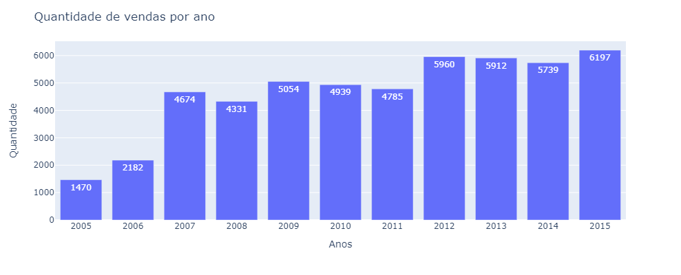
    


Realmente há crescimento, e o crescimento parece estar próximo de convergir e estagnar. Isso não é bom para uma empresa que quer continuar crescendo a adquirindo novos clientes.


```python
df_year = df.copy()
df_year = df.groupby(['year'], as_index=False)['value'].sum().sort_values(by='year', ascending=True)
df_year['year'] = df_year['year'].astype(str)
df_year.sort_values(by='value', ascending=False)
```


<div>
<style scoped>
    .dataframe tbody tr th:only-of-type {
        vertical-align: middle;
    }

    .dataframe tbody tr th {
        vertical-align: top;
    }

    .dataframe thead th {
        text-align: right;
    }
</style>
<table border="1" class="dataframe">
  <thead>
    <tr style="text-align: right;">
      <th></th>
      <th>year</th>
      <th>value</th>
    </tr>
  </thead>
  <tbody>
    <tr>
      <th>10</th>
      <td>2015</td>
      <td>478394.13</td>
    </tr>
    <tr>
      <th>9</th>
      <td>2014</td>
      <td>432665.20</td>
    </tr>
    <tr>
      <th>8</th>
      <td>2013</td>
      <td>401610.18</td>
    </tr>
    <tr>
      <th>7</th>
      <td>2012</td>
      <td>374963.34</td>
    </tr>
    <tr>
      <th>6</th>
      <td>2011</td>
      <td>303939.85</td>
    </tr>
    <tr>
      <th>5</th>
      <td>2010</td>
      <td>290116.92</td>
    </tr>
    <tr>
      <th>4</th>
      <td>2009</td>
      <td>256466.51</td>
    </tr>
    <tr>
      <th>2</th>
      <td>2007</td>
      <td>230260.00</td>
    </tr>
    <tr>
      <th>3</th>
      <td>2008</td>
      <td>229853.88</td>
    </tr>
    <tr>
      <th>1</th>
      <td>2006</td>
      <td>114010.49</td>
    </tr>
    <tr>
      <th>0</th>
      <td>2005</td>
      <td>82064.40</td>
    </tr>
  </tbody>
</table>
</div>


```python
fig = px.bar(x=df_year['year'], y=df_year['value'].values, text=df_year['value'].values)

fig.update_layout(
    title='<span>Valor total de vendas por ano</span>', 
    autosize=False,
    width=1200,
    height=400,
    yaxis=dict(title='<span>Valor $</span>'),
    xaxis=dict(title='<span>Anos</span>')
)

fig.show()
```


    
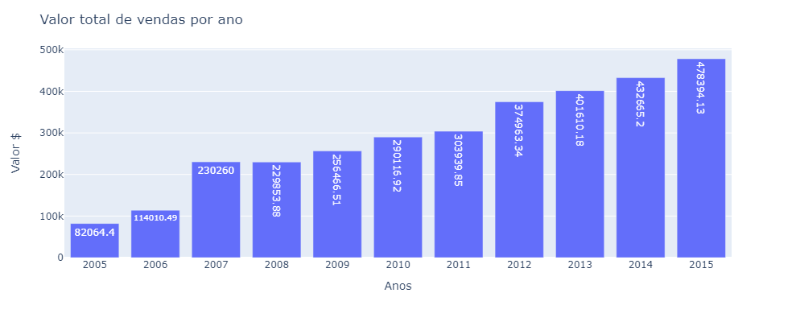
    


A loja está crescendo, ano após ano ela vem faturando cada vez mais, exceto em 2008, que houve uma queda no faturamento em relação ao ano anterior. Podemos fazer algumas análises com iss:
* De 2006 para 2007 houve um aumento significativo no faturamento;
* Esse fenômeno só foi se repetir de novo de 2011 para 2012;
* Uma explicação bem pertinente para explicar a queda que aconteceu em 2008 foi a crise de 2008 que assolou o mercado financeiro mundial. Faz sentido, já que a massa da população perdeu poder de compra nesse período, e foi retomando aos poucos.

<h3 id="id_2-2-4">2.2.4) Mês (month)</h3>

Vejamos a análise por mês, veremos quais meses vendem mais e quais vendem menos, isso é muuito importante para que a empresa possa direcionar os esforços das equipes de marketing e vendas no período que os seus clientes tendem a compra mais, ou ainda, direcionar esforços para convencer os clientes a comprarem nos períodos de baixa.


```python
month_map = {
    1: 'January', 2: 'February', 3: 'March', 4: 'April', 5: 'May', 6: 'June',
    7: 'July', 8: 'August', 9: 'September', 10: 'October', 11: 'November', 12: 'December'
}
```


```python
df_month = df.copy()
df_month = df_month.groupby(['month'], as_index=False)['value'].count()
df_month['month_name'] = df_month['month'].map(month_map)

df_month.sort_values(by='value', ascending=False)
```


<div>
<style scoped>
    .dataframe tbody tr th:only-of-type {
        vertical-align: middle;
    }

    .dataframe tbody tr th {
        vertical-align: top;
    }

    .dataframe thead th {
        text-align: right;
    }
</style>
<table border="1" class="dataframe">
  <thead>
    <tr style="text-align: right;">
      <th></th>
      <th>month</th>
      <th>value</th>
      <th>month_name</th>
    </tr>
  </thead>
  <tbody>
    <tr>
      <th>11</th>
      <td>12</td>
      <td>14888</td>
      <td>December</td>
    </tr>
    <tr>
      <th>10</th>
      <td>11</td>
      <td>6384</td>
      <td>November</td>
    </tr>
    <tr>
      <th>9</th>
      <td>10</td>
      <td>5570</td>
      <td>October</td>
    </tr>
    <tr>
      <th>3</th>
      <td>4</td>
      <td>4234</td>
      <td>April</td>
    </tr>
    <tr>
      <th>2</th>
      <td>3</td>
      <td>3278</td>
      <td>March</td>
    </tr>
    <tr>
      <th>4</th>
      <td>5</td>
      <td>3206</td>
      <td>May</td>
    </tr>
    <tr>
      <th>6</th>
      <td>7</td>
      <td>3159</td>
      <td>July</td>
    </tr>
    <tr>
      <th>5</th>
      <td>6</td>
      <td>3126</td>
      <td>June</td>
    </tr>
    <tr>
      <th>8</th>
      <td>9</td>
      <td>2768</td>
      <td>September</td>
    </tr>
    <tr>
      <th>1</th>
      <td>2</td>
      <td>1562</td>
      <td>February</td>
    </tr>
    <tr>
      <th>7</th>
      <td>8</td>
      <td>1553</td>
      <td>August</td>
    </tr>
    <tr>
      <th>0</th>
      <td>1</td>
      <td>1515</td>
      <td>January</td>
    </tr>
  </tbody>
</table>
</div>


```python
fig = px.bar(df_month, x='month_name', y='value', text='value')

fig.update_layout(
    title='<span>Quantidade de vendas por mês</span>', 
    autosize=False,
    width=1200,
    height=400,
    yaxis=dict(title='<span>Quantidade</span>'),
    xaxis=dict(title='<span>Meses</span>')
)

fig.show()
```


    
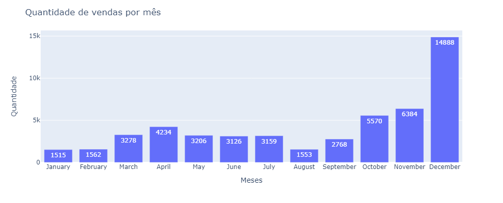
    


Uau, que lavada. Que o mês de Dezembro seria o principal candidato a mês com mais vendas era normal, agora eu não esparava que fosse tão desproporcional em relação a venda nos outros meses. Vamos as observações:
* O mês de Dezembro é o principal mês de vendas. Isso se dá ao fato de que é o mês mais festivo do ano, com o principal evento para o comércio, o Natal. Também podemos considerar as compras para o ano novo.
* Janeiro, Fevereiro e Agosto são os piores meses em termos de vendas no ano. Em Janeiro os clientes ainda esão se recuperando do quanto gastaram no mês anterior, concluímos que é péssimo para direcionar esforços de vendas.
* A partir de Setembro as vendas começam a melhorar, é uma boa hora para se esforçar e direcionar os esforços para a equipe de vendas e marketing.

Fui pesquisar sobre as datas comemorativas nos EUA para tentar entender os fenômenos que acontecem nos meses de Março-Abril e Outubro-Novembro:
* 08 de março – International Women’s Day (Dia Internacional da Mulher)
* 17 de março – Saint Patrick’s Day.
* **17 de abril – Easter (Domingo de Páscoa).**
* **08 de maio – Mothers Day (Dia das Mães).**
* 21 de maio – Armed Forces Day (Dia das Forças Armadas Americanas)
* 30 de maio – Memorial Day
* **19 de junho – Dia dos Pais**
* 04 de julho – Independence Day (Dia da Independência)
* 05 de Setembro – Labor Day (Dia do trabalhador)
* 10 de Outubro – Columbus Day (Dia de Cristóvão Colombo)
* **31 de Outubro – Halloween (Dia das Bruxas)**
* 11 de Novembro – Veteran’s Day (Dia do Veterano Militar das Forças Armadas)
* **24 de Novembro – Thanksgiving (Dia de Ação de Graças)**
* **25 de novembro – Black Friday**
* **25 de dezembro – Christmas Day (Natal)**

As datas em negrito representam datas que movimentam mais o comércio. Agora os dados fazem muito mais sentido, em Abril temos a Páscoa, é uma data que movimenta o comércio. Em maio temos o dia das mães e em junho o dia dos pais que são datas comemorativas bem relevantes para o comércio.

Nos meses de outubro e novembro temos o evento de Haloween (bem tradicional nos EUA) e também dia de ação de graças juntamente com o Black Friday, respectivamente.


```python
df_month = df.copy()
df_month = df_month.groupby(['month'], as_index=False)['value'].sum()
df_month['month_name'] = df_month['month'].map(month_map)

df_month.sort_values(by='value', ascending=False)
```


<div>
<style scoped>
    .dataframe tbody tr th:only-of-type {
        vertical-align: middle;
    }

    .dataframe tbody tr th {
        vertical-align: top;
    }

    .dataframe thead th {
        text-align: right;
    }
</style>
<table border="1" class="dataframe">
  <thead>
    <tr style="text-align: right;">
      <th></th>
      <th>month</th>
      <th>value</th>
      <th>month_name</th>
    </tr>
  </thead>
  <tbody>
    <tr>
      <th>11</th>
      <td>12</td>
      <td>1068698.89</td>
      <td>December</td>
    </tr>
    <tr>
      <th>10</th>
      <td>11</td>
      <td>351456.99</td>
      <td>November</td>
    </tr>
    <tr>
      <th>9</th>
      <td>10</td>
      <td>303177.34</td>
      <td>October</td>
    </tr>
    <tr>
      <th>4</th>
      <td>5</td>
      <td>279160.43</td>
      <td>May</td>
    </tr>
    <tr>
      <th>5</th>
      <td>6</td>
      <td>219930.37</td>
      <td>June</td>
    </tr>
    <tr>
      <th>3</th>
      <td>4</td>
      <td>214535.13</td>
      <td>April</td>
    </tr>
    <tr>
      <th>8</th>
      <td>9</td>
      <td>190297.85</td>
      <td>September</td>
    </tr>
    <tr>
      <th>2</th>
      <td>3</td>
      <td>169040.47</td>
      <td>March</td>
    </tr>
    <tr>
      <th>6</th>
      <td>7</td>
      <td>165185.74</td>
      <td>July</td>
    </tr>
    <tr>
      <th>1</th>
      <td>2</td>
      <td>80822.48</td>
      <td>February</td>
    </tr>
    <tr>
      <th>0</th>
      <td>1</td>
      <td>76192.36</td>
      <td>January</td>
    </tr>
    <tr>
      <th>7</th>
      <td>8</td>
      <td>75846.85</td>
      <td>August</td>
    </tr>
  </tbody>
</table>
</div>


```python
fig = px.bar(df_month, x='month_name', y='value', text='value')

fig.update_layout(
    title='<span>Quantidade de vendas por mês</span>', 
    autosize=False,
    width=1400,
    height=400,
    yaxis=dict(title='<span>Quantidade</span>'),
    xaxis=dict(title='<span>Meses</span>')
)

fig.show()
```


    
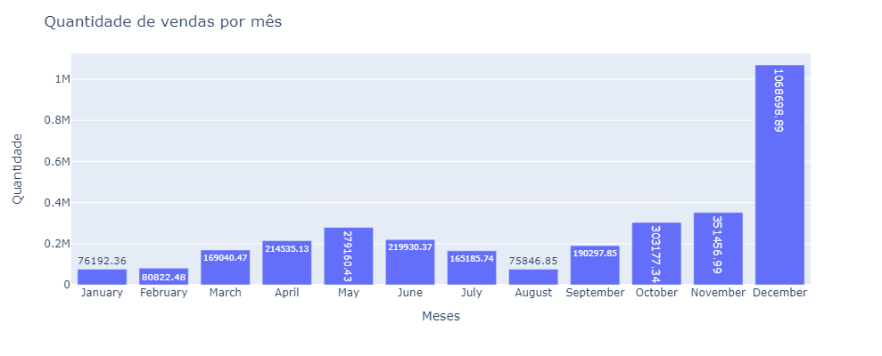
    


Como já era de se esperar, o somatório total no valor de vendas é proporcional a quantidade de vendas por mês, portanto, os meses que mais vendem são também os que mais dão resultados financeiros para a empresa.

<h3 id="id_2-2-5">2.2.5) Dia do mês (day) e mês (month)</h3>

Numa análise mais aprofundada veremos quais são os dias do mês que mais geram vendas e lucros para a empresa.


```python
df_day = df.copy()
df_day = df_day.groupby(['day', 'month'], as_index=False)['value'].agg(['count', 'sum'])

df_day.reset_index().sort_values(by='count', ascending=False).head(10)
```


<div>
<style scoped>
    .dataframe tbody tr th:only-of-type {
        vertical-align: middle;
    }

    .dataframe tbody tr th {
        vertical-align: top;
    }

    .dataframe thead th {
        text-align: right;
    }
</style>
<table border="1" class="dataframe">
  <thead>
    <tr style="text-align: right;">
      <th></th>
      <th>day</th>
      <th>month</th>
      <th>count</th>
      <th>sum</th>
    </tr>
  </thead>
  <tbody>
    <tr>
      <th>361</th>
      <td>31</td>
      <td>12</td>
      <td>5196</td>
      <td>420638.19</td>
    </tr>
    <tr>
      <th>272</th>
      <td>23</td>
      <td>12</td>
      <td>804</td>
      <td>42642.00</td>
    </tr>
    <tr>
      <th>141</th>
      <td>12</td>
      <td>12</td>
      <td>619</td>
      <td>34802.00</td>
    </tr>
    <tr>
      <th>200</th>
      <td>17</td>
      <td>12</td>
      <td>564</td>
      <td>34609.00</td>
    </tr>
    <tr>
      <th>320</th>
      <td>27</td>
      <td>12</td>
      <td>553</td>
      <td>40920.00</td>
    </tr>
    <tr>
      <th>236</th>
      <td>20</td>
      <td>12</td>
      <td>527</td>
      <td>32862.00</td>
    </tr>
    <tr>
      <th>81</th>
      <td>7</td>
      <td>12</td>
      <td>500</td>
      <td>33138.00</td>
    </tr>
    <tr>
      <th>354</th>
      <td>30</td>
      <td>12</td>
      <td>478</td>
      <td>33801.00</td>
    </tr>
    <tr>
      <th>224</th>
      <td>19</td>
      <td>12</td>
      <td>457</td>
      <td>28695.00</td>
    </tr>
    <tr>
      <th>294</th>
      <td>25</td>
      <td>10</td>
      <td>449</td>
      <td>20447.00</td>
    </tr>
  </tbody>
</table>
</div>


```python
df_day.reset_index().sort_values(by='sum', ascending=False).head(10)
```


<div>
<style scoped>
    .dataframe tbody tr th:only-of-type {
        vertical-align: middle;
    }

    .dataframe tbody tr th {
        vertical-align: top;
    }

    .dataframe thead th {
        text-align: right;
    }
</style>
<table border="1" class="dataframe">
  <thead>
    <tr style="text-align: right;">
      <th></th>
      <th>day</th>
      <th>month</th>
      <th>count</th>
      <th>sum</th>
    </tr>
  </thead>
  <tbody>
    <tr>
      <th>361</th>
      <td>31</td>
      <td>12</td>
      <td>5196</td>
      <td>420638.19</td>
    </tr>
    <tr>
      <th>272</th>
      <td>23</td>
      <td>12</td>
      <td>804</td>
      <td>42642.00</td>
    </tr>
    <tr>
      <th>320</th>
      <td>27</td>
      <td>12</td>
      <td>553</td>
      <td>40920.00</td>
    </tr>
    <tr>
      <th>141</th>
      <td>12</td>
      <td>12</td>
      <td>619</td>
      <td>34802.00</td>
    </tr>
    <tr>
      <th>200</th>
      <td>17</td>
      <td>12</td>
      <td>564</td>
      <td>34609.00</td>
    </tr>
    <tr>
      <th>354</th>
      <td>30</td>
      <td>12</td>
      <td>478</td>
      <td>33801.00</td>
    </tr>
    <tr>
      <th>81</th>
      <td>7</td>
      <td>12</td>
      <td>500</td>
      <td>33138.00</td>
    </tr>
    <tr>
      <th>236</th>
      <td>20</td>
      <td>12</td>
      <td>527</td>
      <td>32862.00</td>
    </tr>
    <tr>
      <th>343</th>
      <td>29</td>
      <td>12</td>
      <td>412</td>
      <td>31433.00</td>
    </tr>
    <tr>
      <th>284</th>
      <td>24</td>
      <td>12</td>
      <td>293</td>
      <td>30091.00</td>
    </tr>
  </tbody>
</table>
</div>


Com já era esperado, os dias que mais vendem e também os que mais dão lucros para a empresa são do mês de dezembro, mês que é muito acima da média com relação aos demais meses do ano.

Mas vamos dar uma olhada nos dias que mais têm vendas desconsiderando o mês de dezembro.


```python
df_day
```


<div>
<style scoped>
    .dataframe tbody tr th:only-of-type {
        vertical-align: middle;
    }

    .dataframe tbody tr th {
        vertical-align: top;
    }

    .dataframe thead th {
        text-align: right;
    }
</style>
<table border="1" class="dataframe">
  <thead>
    <tr style="text-align: right;">
      <th></th>
      <th></th>
      <th>count</th>
      <th>sum</th>
    </tr>
    <tr>
      <th>day</th>
      <th>month</th>
      <th></th>
      <th></th>
    </tr>
  </thead>
  <tbody>
    <tr>
      <th rowspan="5" valign="top">1</th>
      <th>2</th>
      <td>34</td>
      <td>2660.00</td>
    </tr>
    <tr>
      <th>3</th>
      <td>117</td>
      <td>5300.00</td>
    </tr>
    <tr>
      <th>4</th>
      <td>80</td>
      <td>3500.00</td>
    </tr>
    <tr>
      <th>5</th>
      <td>2</td>
      <td>3550.00</td>
    </tr>
    <tr>
      <th>6</th>
      <td>164</td>
      <td>8905.00</td>
    </tr>
    <tr>
      <th>...</th>
      <th>...</th>
      <td>...</td>
      <td>...</td>
    </tr>
    <tr>
      <th rowspan="5" valign="top">31</th>
      <th>5</th>
      <td>111</td>
      <td>8178.00</td>
    </tr>
    <tr>
      <th>7</th>
      <td>66</td>
      <td>3115.00</td>
    </tr>
    <tr>
      <th>8</th>
      <td>48</td>
      <td>2043.00</td>
    </tr>
    <tr>
      <th>10</th>
      <td>333</td>
      <td>21162.00</td>
    </tr>
    <tr>
      <th>12</th>
      <td>5196</td>
      <td>420638.19</td>
    </tr>
  </tbody>
</table>
<p>362 rows × 2 columns</p>
</div>


```python
df_day2 = df_day.reset_index().sort_values(by='count', ascending=False).copy()
df_day2 = df_day2.loc[df_day2['month'] != 12]
```


```python
df_day2.head(15)
```


<div>
<style scoped>
    .dataframe tbody tr th:only-of-type {
        vertical-align: middle;
    }

    .dataframe tbody tr th {
        vertical-align: top;
    }

    .dataframe thead th {
        text-align: right;
    }
</style>
<table border="1" class="dataframe">
  <thead>
    <tr style="text-align: right;">
      <th></th>
      <th>day</th>
      <th>month</th>
      <th>count</th>
      <th>sum</th>
    </tr>
  </thead>
  <tbody>
    <tr>
      <th>294</th>
      <td>25</td>
      <td>10</td>
      <td>449</td>
      <td>20447.00</td>
    </tr>
    <tr>
      <th>352</th>
      <td>30</td>
      <td>10</td>
      <td>409</td>
      <td>19560.00</td>
    </tr>
    <tr>
      <th>56</th>
      <td>5</td>
      <td>11</td>
      <td>384</td>
      <td>19614.00</td>
    </tr>
    <tr>
      <th>92</th>
      <td>8</td>
      <td>11</td>
      <td>358</td>
      <td>19785.44</td>
    </tr>
    <tr>
      <th>247</th>
      <td>21</td>
      <td>11</td>
      <td>348</td>
      <td>24006.00</td>
    </tr>
    <tr>
      <th>191</th>
      <td>17</td>
      <td>3</td>
      <td>345</td>
      <td>17810.24</td>
    </tr>
    <tr>
      <th>211</th>
      <td>18</td>
      <td>11</td>
      <td>333</td>
      <td>18473.00</td>
    </tr>
    <tr>
      <th>360</th>
      <td>31</td>
      <td>10</td>
      <td>333</td>
      <td>21162.00</td>
    </tr>
    <tr>
      <th>295</th>
      <td>25</td>
      <td>11</td>
      <td>330</td>
      <td>20967.04</td>
    </tr>
    <tr>
      <th>104</th>
      <td>9</td>
      <td>11</td>
      <td>320</td>
      <td>13520.00</td>
    </tr>
    <tr>
      <th>210</th>
      <td>18</td>
      <td>10</td>
      <td>318</td>
      <td>14890.75</td>
    </tr>
    <tr>
      <th>152</th>
      <td>13</td>
      <td>11</td>
      <td>308</td>
      <td>16976.24</td>
    </tr>
    <tr>
      <th>44</th>
      <td>4</td>
      <td>11</td>
      <td>302</td>
      <td>18071.42</td>
    </tr>
    <tr>
      <th>271</th>
      <td>23</td>
      <td>11</td>
      <td>300</td>
      <td>13969.00</td>
    </tr>
    <tr>
      <th>204</th>
      <td>18</td>
      <td>4</td>
      <td>294</td>
      <td>11666.90</td>
    </tr>
  </tbody>
</table>
</div>


Veja que interessante. Os dias que mais temos vendas é no final de outubro. Isso corrobora com a nossa tese, são datas próximas ao evento de Haloween. Outro ponto muito pertinente é que temos bastante vendas no final de Novembro. Muito provavelmente são vendas no dia de Black Friday, já que esse é um evento que acontece todos os anos em dias diferentes, sempre próximo ao final de Novembro.

<h3 id="id_2-2-6">2.2.6) Dia da semana (day_week e day_week_name)</h3>

Em linhas gerais, existe algum dia da semana que é mais produtivo para a loja?<br/>
A resposta é SIM. Veremos que as pessoas tendem a comprar mais em alguns dias da semana do que outros.


```python
df_day = df.copy()
df_day = df_day.groupby(['day_week_name', 'day_week'], as_index=False)['value'].agg(['count', 'sum'])

df_day.sort_values(by='count', ascending=False)
```


<div>
<style scoped>
    .dataframe tbody tr th:only-of-type {
        vertical-align: middle;
    }

    .dataframe tbody tr th {
        vertical-align: top;
    }

    .dataframe thead th {
        text-align: right;
    }
</style>
<table border="1" class="dataframe">
  <thead>
    <tr style="text-align: right;">
      <th></th>
      <th></th>
      <th>count</th>
      <th>sum</th>
    </tr>
    <tr>
      <th>day_week_name</th>
      <th>day_week</th>
      <th></th>
      <th></th>
    </tr>
  </thead>
  <tbody>
    <tr>
      <th>wednesday</th>
      <th>2</th>
      <td>13970</td>
      <td>832852.47</td>
    </tr>
    <tr>
      <th>friday</th>
      <th>4</th>
      <td>12828</td>
      <td>727430.95</td>
    </tr>
    <tr>
      <th>thursday</th>
      <th>3</th>
      <td>8292</td>
      <td>560034.88</td>
    </tr>
    <tr>
      <th>saturday</th>
      <th>5</th>
      <td>8023</td>
      <td>481037.66</td>
    </tr>
    <tr>
      <th>tuesday</th>
      <th>1</th>
      <td>5626</td>
      <td>403088.66</td>
    </tr>
    <tr>
      <th>sunday</th>
      <th>6</th>
      <td>1549</td>
      <td>107991.28</td>
    </tr>
    <tr>
      <th>monday</th>
      <th>0</th>
      <td>955</td>
      <td>81909.00</td>
    </tr>
  </tbody>
</table>
</div>


Nota que quarta-feira é o dia que mais temos vendas e também o que mais temos lucros, seguido por sexta-feira, depois quinta-feira.<br/>
Essa é uma informação muito relevante para as equipes de Marketing e de Vendas, pois elas podem concentrar seus esforços principalmente nesses dias da semana.

<h3 id="id_2-2-7">2.2.7) Semana do ano (week)</h3>

Por fim, a análise por semana do ano. Veremos que há um fato curioso nestes dados, que com certeza estava passando batido nas últimas análises. Vamos tirar um insight muito relevante para a empresa.


```python
df_week = df.copy()

df_week = df_week.groupby(['week'], as_index=False)['value'].agg(['count', 'sum'])
df_week.sort_values(by='count', ascending=False).head(10)
```


<div>
<style scoped>
    .dataframe tbody tr th:only-of-type {
        vertical-align: middle;
    }

    .dataframe tbody tr th {
        vertical-align: top;
    }

    .dataframe thead th {
        text-align: right;
    }
</style>
<table border="1" class="dataframe">
  <thead>
    <tr style="text-align: right;">
      <th></th>
      <th>count</th>
      <th>sum</th>
    </tr>
    <tr>
      <th>week</th>
      <th></th>
      <th></th>
    </tr>
  </thead>
  <tbody>
    <tr>
      <th>52</th>
      <td>3647</td>
      <td>275303.71</td>
    </tr>
    <tr>
      <th>1</th>
      <td>2897</td>
      <td>236555.48</td>
    </tr>
    <tr>
      <th>51</th>
      <td>2821</td>
      <td>174568.70</td>
    </tr>
    <tr>
      <th>50</th>
      <td>2091</td>
      <td>132455.00</td>
    </tr>
    <tr>
      <th>45</th>
      <td>1843</td>
      <td>98662.54</td>
    </tr>
    <tr>
      <th>48</th>
      <td>1706</td>
      <td>94940.40</td>
    </tr>
    <tr>
      <th>49</th>
      <td>1700</td>
      <td>115945.00</td>
    </tr>
    <tr>
      <th>47</th>
      <td>1700</td>
      <td>94918.04</td>
    </tr>
    <tr>
      <th>43</th>
      <td>1610</td>
      <td>83512.00</td>
    </tr>
    <tr>
      <th>44</th>
      <td>1368</td>
      <td>72079.44</td>
    </tr>
  </tbody>
</table>
</div>


```python
df_week.sort_values(by='sum', ascending=False).head(10)
```


<div>
<style scoped>
    .dataframe tbody tr th:only-of-type {
        vertical-align: middle;
    }

    .dataframe tbody tr th {
        vertical-align: top;
    }

    .dataframe thead th {
        text-align: right;
    }
</style>
<table border="1" class="dataframe">
  <thead>
    <tr style="text-align: right;">
      <th></th>
      <th>count</th>
      <th>sum</th>
    </tr>
    <tr>
      <th>week</th>
      <th></th>
      <th></th>
    </tr>
  </thead>
  <tbody>
    <tr>
      <th>52</th>
      <td>3647</td>
      <td>275303.71</td>
    </tr>
    <tr>
      <th>1</th>
      <td>2897</td>
      <td>236555.48</td>
    </tr>
    <tr>
      <th>51</th>
      <td>2821</td>
      <td>174568.70</td>
    </tr>
    <tr>
      <th>50</th>
      <td>2091</td>
      <td>132455.00</td>
    </tr>
    <tr>
      <th>49</th>
      <td>1700</td>
      <td>115945.00</td>
    </tr>
    <tr>
      <th>53</th>
      <td>1282</td>
      <td>109520.00</td>
    </tr>
    <tr>
      <th>45</th>
      <td>1843</td>
      <td>98662.54</td>
    </tr>
    <tr>
      <th>48</th>
      <td>1706</td>
      <td>94940.40</td>
    </tr>
    <tr>
      <th>47</th>
      <td>1700</td>
      <td>94918.04</td>
    </tr>
    <tr>
      <th>21</th>
      <td>760</td>
      <td>90072.00</td>
    </tr>
  </tbody>
</table>
</div>


Ao analisar os dados, vimos que a primeira semana do ano é uma semana muito importante em termos de quantidade de vendas e no somatório total das vendas. Esse fato não foi obtido nas análises anteriores, pois provavelmente a partir da segunda semana de Janeira o volume de vendas é péssimo. 

De resto, as semanas com as maiores quantidade de vendas são as que já eram esperadas: Final de Dezembro e final de Novembro.

Outra semana que apareceu no nosso top 10 em somatório do valor total de vendas foi a semana 21 que corresponde a data próxima ao dia 21 de maio. Uma data também comemorativa nos EUA: Armed Forces Day (Dia das Forças Armadas Americanas).

> Eu particularmente não imaginava que essa seria uma data muito movimentada, pois não tenho dimensão do quão relevante é essa data para os norte-americanos.

<h2 id="id_2-3">2.3) Análise de Variabilidade e Crescimento das vendas</h2>

Agora vamos começar outro tipo de análises. A análise de variabilidade e crescimento de vendas. Veremos o quanto os dados variam ao longo do tempo e como se comportam no decorrer dos anos.

<h3 id="id_2-3-1">2.3.1) Variabilidade por ano</h3>

Vejamos como os dados se desenvolvem ao longo dos anos, vamos verificar a quantidade total de vendas por ano e valor total de vendas por ano.

Aqui eu utilizei uma outra forma de trabalhar com agrupamentos de dados. Utilizei o `pivot`, é um conceito bastante utilizado na area de BI, para ter uma outra perspectiva sobre os dados. É sinônimo do groupby, mas eu quis trazer dessa forma até para poder aprender mais sobre essa técnica.


```python
df_agg_year = pd.pivot_table(df, index='year', values='value', aggfunc=[np.count_nonzero, np.sum])
# Poderia ter sido escrito da seguinte maneira:
# df_agg_year = df.groupby(['year'])['value'].count()
# Utilizei o pivot_table para exercitar outra forma de visualização dos dados por outro ângulo

df_agg_year.head(10)
```


<div>
<style scoped>
    .dataframe tbody tr th:only-of-type {
        vertical-align: middle;
    }

    .dataframe tbody tr th {
        vertical-align: top;
    }

    .dataframe thead tr th {
        text-align: left;
    }

    .dataframe thead tr:last-of-type th {
        text-align: right;
    }
</style>
<table border="1" class="dataframe">
  <thead>
    <tr>
      <th></th>
      <th>count_nonzero</th>
      <th>sum</th>
    </tr>
    <tr>
      <th></th>
      <th>value</th>
      <th>value</th>
    </tr>
    <tr>
      <th>year</th>
      <th></th>
      <th></th>
    </tr>
  </thead>
  <tbody>
    <tr>
      <th>2005</th>
      <td>1470</td>
      <td>82064.40</td>
    </tr>
    <tr>
      <th>2006</th>
      <td>2182</td>
      <td>114010.49</td>
    </tr>
    <tr>
      <th>2007</th>
      <td>4674</td>
      <td>230260.00</td>
    </tr>
    <tr>
      <th>2008</th>
      <td>4331</td>
      <td>229853.88</td>
    </tr>
    <tr>
      <th>2009</th>
      <td>5054</td>
      <td>256466.51</td>
    </tr>
    <tr>
      <th>2010</th>
      <td>4939</td>
      <td>290116.92</td>
    </tr>
    <tr>
      <th>2011</th>
      <td>4785</td>
      <td>303939.85</td>
    </tr>
    <tr>
      <th>2012</th>
      <td>5960</td>
      <td>374963.34</td>
    </tr>
    <tr>
      <th>2013</th>
      <td>5912</td>
      <td>401610.18</td>
    </tr>
    <tr>
      <th>2014</th>
      <td>5739</td>
      <td>432665.20</td>
    </tr>
  </tbody>
</table>
</div>


```python
index = list(df_agg_year.index.astype(str))
values_count = (df_agg_year['count_nonzero'].values / df_agg_year['count_nonzero'].values.mean()[np.newaxis]).reshape(-1)
values_sum = (df_agg_year['sum'].values / df_agg_year['sum'].values.mean()[np.newaxis]).reshape(-1)

fig = go.Figure()
fig.add_trace(go.Line(
    x=index, 
    y=values_count,
    name='Quantidade de vendas'
    #text=values_count
))

fig.add_trace(go.Line(
    x=index, 
    y=values_sum,
    name='Somatório do valor de vendas'
    #text=values_count,
))


fig.update_layout(
    title='<span>Crescimento relativo anual por quantidade e somatório de vendas</span>', 
    autosize=False,
    width=1200,
    height=500,
    yaxis=dict(title='<span>Crescimento</span>'),
    xaxis=dict(title='<span>Anos</span>')
)

fig.show()
```

    c:\ProgramData\Anaconda3\lib\site-packages\plotly\graph_objs\_deprecations.py:378: DeprecationWarning:
    
    plotly.graph_objs.Line is deprecated.
    Please replace it with one of the following more specific types
      - plotly.graph_objs.scatter.Line
      - plotly.graph_objs.layout.shape.Line
      - etc.
    
    
    


    
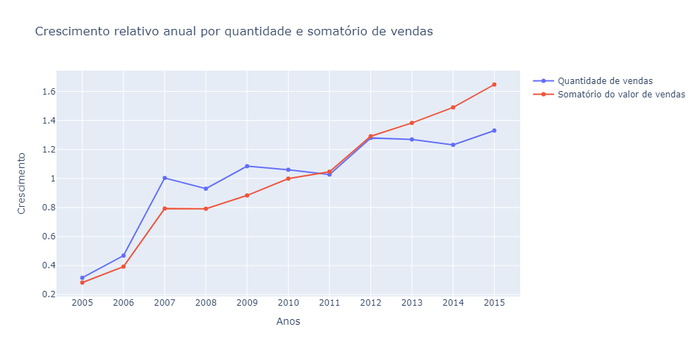
    


Observamos que os lucros da empresa só crescem ano após ano, exceto no ano de 2008. Em contrapartida, a quantidade de vendas tem uma maior variação entre os anos. Veja que em várias situações ocorreram de a quantidade de vendas ser menor que no ano anterior.

<h3 id="id_2-3-2">2.3.2) Variabilidade por meses</h3>


```python
df_agg_month = pd.pivot_table(df, index=['month'], values='value', aggfunc=[np.count_nonzero, np.sum]).reset_index()
df_agg_month['month_name'] = df_agg_month['month'].map(month_map)
df_agg_month
```


<div>
<style scoped>
    .dataframe tbody tr th:only-of-type {
        vertical-align: middle;
    }

    .dataframe tbody tr th {
        vertical-align: top;
    }

    .dataframe thead tr th {
        text-align: left;
    }
</style>
<table border="1" class="dataframe">
  <thead>
    <tr>
      <th></th>
      <th>month</th>
      <th>count_nonzero</th>
      <th>sum</th>
      <th>month_name</th>
    </tr>
    <tr>
      <th></th>
      <th></th>
      <th>value</th>
      <th>value</th>
      <th></th>
    </tr>
  </thead>
  <tbody>
    <tr>
      <th>0</th>
      <td>1</td>
      <td>1515</td>
      <td>76192.36</td>
      <td>January</td>
    </tr>
    <tr>
      <th>1</th>
      <td>2</td>
      <td>1562</td>
      <td>80822.48</td>
      <td>February</td>
    </tr>
    <tr>
      <th>2</th>
      <td>3</td>
      <td>3278</td>
      <td>169040.47</td>
      <td>March</td>
    </tr>
    <tr>
      <th>3</th>
      <td>4</td>
      <td>4234</td>
      <td>214535.13</td>
      <td>April</td>
    </tr>
    <tr>
      <th>4</th>
      <td>5</td>
      <td>3206</td>
      <td>279160.43</td>
      <td>May</td>
    </tr>
    <tr>
      <th>5</th>
      <td>6</td>
      <td>3126</td>
      <td>219930.37</td>
      <td>June</td>
    </tr>
    <tr>
      <th>6</th>
      <td>7</td>
      <td>3159</td>
      <td>165185.74</td>
      <td>July</td>
    </tr>
    <tr>
      <th>7</th>
      <td>8</td>
      <td>1553</td>
      <td>75846.85</td>
      <td>August</td>
    </tr>
    <tr>
      <th>8</th>
      <td>9</td>
      <td>2768</td>
      <td>190297.85</td>
      <td>September</td>
    </tr>
    <tr>
      <th>9</th>
      <td>10</td>
      <td>5570</td>
      <td>303177.34</td>
      <td>October</td>
    </tr>
    <tr>
      <th>10</th>
      <td>11</td>
      <td>6384</td>
      <td>351456.99</td>
      <td>November</td>
    </tr>
    <tr>
      <th>11</th>
      <td>12</td>
      <td>14888</td>
      <td>1068698.89</td>
      <td>December</td>
    </tr>
  </tbody>
</table>
</div>


```python
index = df_agg_month['month_name']
values_count = (df_agg_month['count_nonzero'].values / df_agg_month['count_nonzero'].values.mean()[np.newaxis]).reshape(-1)
values_sum = (df_agg_month['sum'].values / df_agg_month['sum'].values.mean()[np.newaxis]).reshape(-1)

fig = go.Figure()
fig.add_trace(go.Line(
    x=index, 
    y=values_count,
    name='Quantidade de vendas'
    #text=values_count
))

fig.add_trace(go.Line(
    x=index, 
    y=values_sum,
    name='Somatório do valor total de vendas'
    #text=values_count,
))


fig.update_layout(
    title='<span>Variabilidade mensal por quantidade e somatório de vendas</span>', 
    autosize=False,
    width=1200,
    height=400,
    yaxis=dict(title='<span>Variabilidade</span>'),
    xaxis=dict(title='<span>Meses</span>')
)

fig.show()
```

    c:\ProgramData\Anaconda3\lib\site-packages\plotly\graph_objs\_deprecations.py:378: DeprecationWarning:
    
    plotly.graph_objs.Line is deprecated.
    Please replace it with one of the following more specific types
      - plotly.graph_objs.scatter.Line
      - plotly.graph_objs.layout.shape.Line
      - etc.
    
    
    


    
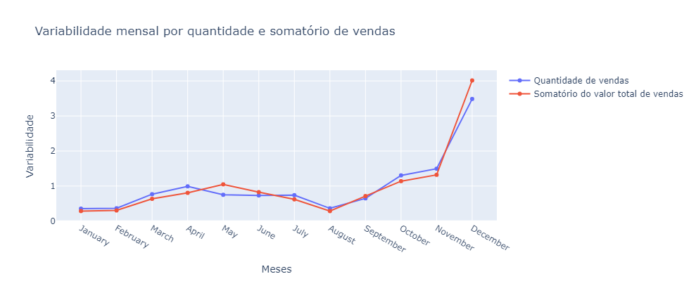
    


Observamos o mesmo fenômeno de antes: O mês de Janeiro é péssimo para as vendas, vai aumentando gradativamente até em maio, depois cai até agosto, quando começa a aumentar de novo, no mês de Dezembro é quando as vendas decolam e vão lá em cima. 

<h3 id="id_2-3-3">2.3.3) Variabilidade por dias</h3>


```python
df_agg_day = pd.DataFrame(df.groupby(['day_week_name', 'day_week'])['value'].sum()).apply(lambda x: 100 * x/ x.sum())
df_agg_day.sort_values(by='value', ascending=False)
```


<div>
<style scoped>
    .dataframe tbody tr th:only-of-type {
        vertical-align: middle;
    }

    .dataframe tbody tr th {
        vertical-align: top;
    }

    .dataframe thead th {
        text-align: right;
    }
</style>
<table border="1" class="dataframe">
  <thead>
    <tr style="text-align: right;">
      <th></th>
      <th></th>
      <th>value</th>
    </tr>
    <tr>
      <th>day_week_name</th>
      <th>day_week</th>
      <th></th>
    </tr>
  </thead>
  <tbody>
    <tr>
      <th>wednesday</th>
      <th>2</th>
      <td>26.072716</td>
    </tr>
    <tr>
      <th>friday</th>
      <th>4</th>
      <td>22.772461</td>
    </tr>
    <tr>
      <th>thursday</th>
      <th>3</th>
      <td>17.532073</td>
    </tr>
    <tr>
      <th>saturday</th>
      <th>5</th>
      <td>15.059039</td>
    </tr>
    <tr>
      <th>tuesday</th>
      <th>1</th>
      <td>12.618821</td>
    </tr>
    <tr>
      <th>sunday</th>
      <th>6</th>
      <td>3.380702</td>
    </tr>
    <tr>
      <th>monday</th>
      <th>0</th>
      <td>2.564188</td>
    </tr>
  </tbody>
</table>
</div>


```python
df_agg_day = df_agg_day.sort_values(by='day_week', ascending=True)
df_agg_day = df_agg_day.reset_index()

index = df_agg_day['day_week_name']
values = df_agg_day['value']

fig = px.line(x=index, y=values)

fig.update_layout(
    title='<span>Porcentagem de vendas por dia da semana</span>', 
    autosize=False,
    width=1000,
    height=400,
    yaxis=dict(title='<span>Porcentagem de vendas</span>'),
    xaxis=dict(title='<span>Dias da semana</span>')
)

fig.show()
```


    
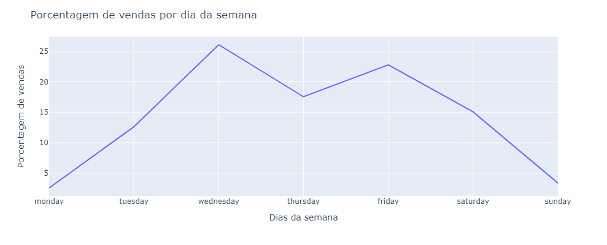
    


O mesmo vale para os dias da semana. Quarta-feira e Sexta-feira são os melhores dias em termos de quantidade de vendas.

<h3 id="id_2-3-4">2.3.4) Variabilidade por semana</h3>


```python
df_agg_week = pd.pivot_table(df, index='week', values='value', aggfunc=[np.count_nonzero, np.sum]).reset_index()

index = df_agg_week['week'].astype(str)
values_count = (df_agg_week['count_nonzero'].values / df_agg_week['count_nonzero'].values.mean()[np.newaxis]).reshape(-1)
values_sum = (df_agg_week['sum'].values / df_agg_week['sum'].values.mean()[np.newaxis]).reshape(-1)

fig = go.Figure()
fig.add_trace(go.Line(
    x=index, 
    y=values_count,
    name='Quantidade de vendas'
    #text=values_count
))

fig.add_trace(go.Line(
    x=index, 
    y=values_sum,
    name='Somatório do valor total de vendas'
    #text=values_count,
))


fig.update_layout(
    title='<span>Variabilidade semanal por quantidade e somatório do valor total de vendas</span>', 
    autosize=False,
    width=1400,
    height=400,
    yaxis=dict(title='<span>Variabilidade</span>'),
    xaxis=dict(title='<span>Semanas do ano</span>')
)

fig.show()
```

    c:\ProgramData\Anaconda3\lib\site-packages\plotly\graph_objs\_deprecations.py:378: DeprecationWarning:
    
    plotly.graph_objs.Line is deprecated.
    Please replace it with one of the following more specific types
      - plotly.graph_objs.scatter.Line
      - plotly.graph_objs.layout.shape.Line
      - etc.
    
    
    


    
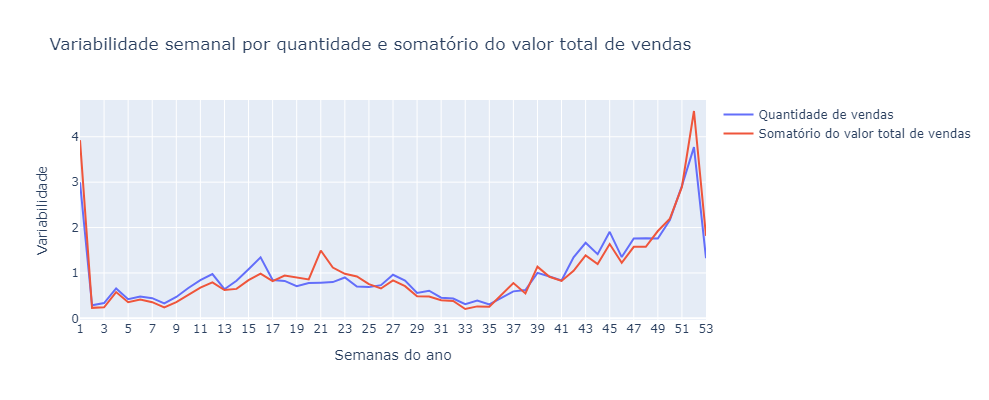
    


Por fim, podemos observar de maneira visual que as semanas mais para o final do ano são as que geram maiores quantidades de vendas. Aquilo que observamos anteriormente sobre a primeira semana ser uma semana muito movimentada se confirma novamente, da mesma forma que temos um pico no somatório do valor total de vendas na semana 21.

--- 

<h2 id="id_3">3) SEGMENTAÇÃO ESTATÍSTICA E HIERÁRQUICA PARA EQUIPE DE MARKETING</h2>

O objetivo neste capítulo é aplicar técnicas de Machine Learning com o intuito de realizar a clusterização dos dados, isto é, vamos encontrar relações entre os dados e agrupá-los de forma que a equipe de Marketing tenha diferentes grupos de clientes, possibilitando que eles adotem as estratégias necessárias para cada grupo individualmente.

<h2 id="id_3-0">3.0) Importações</h2>


```python
from sklearn.preprocessing import StandardScaler
from sklearn.cluster import AgglomerativeClustering 
from sklearn.decomposition import PCA
import sklearn.cluster as cluster
from tqdm import tqdm
from sklearn.metrics import silhouette_score
```

<h2 id="id_3-1">3.1) Análise Exploratória</h2>

Agora vamos fazer análises diferentes com propósitos diferentes. Vamos aplicar mais conceitos de estatística para obter informações relevantes e fazer inferências sobre os dados, bem como prepará-los para o nosso modelo de clustering.

Além disso, vamos criar um novo atributo na tabela `days_since`. Este atributo vai nos dizer quantos dias se passaram desde a última compra do cliente, considerando o dia atual como um dia após o máximo do dataset.


```python
current_date = df['date'].max() + pd.Timedelta(days=1)

df['days_since'] = (current_date - df['date']).dt.days

df.head()
```


<div>
<style scoped>
    .dataframe tbody tr th:only-of-type {
        vertical-align: middle;
    }

    .dataframe tbody tr th {
        vertical-align: top;
    }

    .dataframe thead th {
        text-align: right;
    }
</style>
<table border="1" class="dataframe">
  <thead>
    <tr style="text-align: right;">
      <th></th>
      <th>client_id</th>
      <th>value</th>
      <th>date</th>
      <th>day</th>
      <th>month</th>
      <th>year</th>
      <th>day_week</th>
      <th>week</th>
      <th>day_week_name</th>
      <th>days_since</th>
    </tr>
  </thead>
  <tbody>
    <tr>
      <th>0</th>
      <td>760</td>
      <td>25.0</td>
      <td>2009-11-06</td>
      <td>6</td>
      <td>11</td>
      <td>2009</td>
      <td>4</td>
      <td>45</td>
      <td>friday</td>
      <td>2247</td>
    </tr>
    <tr>
      <th>1</th>
      <td>860</td>
      <td>50.0</td>
      <td>2012-09-28</td>
      <td>28</td>
      <td>9</td>
      <td>2012</td>
      <td>4</td>
      <td>39</td>
      <td>friday</td>
      <td>1190</td>
    </tr>
    <tr>
      <th>2</th>
      <td>1200</td>
      <td>100.0</td>
      <td>2005-10-25</td>
      <td>25</td>
      <td>10</td>
      <td>2005</td>
      <td>1</td>
      <td>43</td>
      <td>tuesday</td>
      <td>3720</td>
    </tr>
    <tr>
      <th>3</th>
      <td>1420</td>
      <td>50.0</td>
      <td>2009-07-09</td>
      <td>9</td>
      <td>7</td>
      <td>2009</td>
      <td>3</td>
      <td>28</td>
      <td>thursday</td>
      <td>2367</td>
    </tr>
    <tr>
      <th>4</th>
      <td>1940</td>
      <td>70.0</td>
      <td>2013-01-25</td>
      <td>25</td>
      <td>1</td>
      <td>2013</td>
      <td>4</td>
      <td>4</td>
      <td>friday</td>
      <td>1071</td>
    </tr>
  </tbody>
</table>
</div>


Inserimos o atributo `days_since` como dito anteriormente.

Abaixo vamos agrupar os dados de maneira a obter as principais medidas estatística do conjunto de dados: `count` (quantidade), `mean` (média), `median` (mediana) e `sum` (somatório).


```python
#df_temp = df.loc[df['value'] < 200]
df_temp = df

df_seg = df_temp.groupby(['client_id'], as_index=False)['value'].agg(['count', 'mean', 'median', 'sum'])
df_seg.head(5)
```


<div>
<style scoped>
    .dataframe tbody tr th:only-of-type {
        vertical-align: middle;
    }

    .dataframe tbody tr th {
        vertical-align: top;
    }

    .dataframe thead th {
        text-align: right;
    }
</style>
<table border="1" class="dataframe">
  <thead>
    <tr style="text-align: right;">
      <th></th>
      <th>count</th>
      <th>mean</th>
      <th>median</th>
      <th>sum</th>
    </tr>
    <tr>
      <th>client_id</th>
      <th></th>
      <th></th>
      <th></th>
      <th></th>
    </tr>
  </thead>
  <tbody>
    <tr>
      <th>10</th>
      <td>1</td>
      <td>30.000000</td>
      <td>30.0</td>
      <td>30.0</td>
    </tr>
    <tr>
      <th>80</th>
      <td>7</td>
      <td>71.428571</td>
      <td>80.0</td>
      <td>500.0</td>
    </tr>
    <tr>
      <th>90</th>
      <td>10</td>
      <td>115.800000</td>
      <td>100.0</td>
      <td>1158.0</td>
    </tr>
    <tr>
      <th>120</th>
      <td>1</td>
      <td>20.000000</td>
      <td>20.0</td>
      <td>20.0</td>
    </tr>
    <tr>
      <th>130</th>
      <td>2</td>
      <td>50.000000</td>
      <td>50.0</td>
      <td>100.0</td>
    </tr>
  </tbody>
</table>
</div>


```python
df_seg.sort_values(by='sum', ascending=False).head(5)
```


<div>
<style scoped>
    .dataframe tbody tr th:only-of-type {
        vertical-align: middle;
    }

    .dataframe tbody tr th {
        vertical-align: top;
    }

    .dataframe thead th {
        text-align: right;
    }
</style>
<table border="1" class="dataframe">
  <thead>
    <tr style="text-align: right;">
      <th></th>
      <th>count</th>
      <th>mean</th>
      <th>median</th>
      <th>sum</th>
    </tr>
    <tr>
      <th>client_id</th>
      <th></th>
      <th></th>
      <th></th>
      <th></th>
    </tr>
  </thead>
  <tbody>
    <tr>
      <th>13610</th>
      <td>8</td>
      <td>3043.750000</td>
      <td>3050.0</td>
      <td>24350.0</td>
    </tr>
    <tr>
      <th>144610</th>
      <td>18</td>
      <td>944.444444</td>
      <td>1000.0</td>
      <td>17000.0</td>
    </tr>
    <tr>
      <th>98550</th>
      <td>7</td>
      <td>2215.285714</td>
      <td>2000.0</td>
      <td>15507.0</td>
    </tr>
    <tr>
      <th>164930</th>
      <td>5</td>
      <td>2800.000000</td>
      <td>3000.0</td>
      <td>14000.0</td>
    </tr>
    <tr>
      <th>141340</th>
      <td>6</td>
      <td>2225.166667</td>
      <td>2000.0</td>
      <td>13351.0</td>
    </tr>
  </tbody>
</table>
</div>


```python
df_seg.sort_values(by='median', ascending=False).head(5)
```


<div>
<style scoped>
    .dataframe tbody tr th:only-of-type {
        vertical-align: middle;
    }

    .dataframe tbody tr th {
        vertical-align: top;
    }

    .dataframe thead th {
        text-align: right;
    }
</style>
<table border="1" class="dataframe">
  <thead>
    <tr style="text-align: right;">
      <th></th>
      <th>count</th>
      <th>mean</th>
      <th>median</th>
      <th>sum</th>
    </tr>
    <tr>
      <th>client_id</th>
      <th></th>
      <th></th>
      <th></th>
      <th></th>
    </tr>
  </thead>
  <tbody>
    <tr>
      <th>222740</th>
      <td>2</td>
      <td>4500.0</td>
      <td>4500.0</td>
      <td>9000.0</td>
    </tr>
    <tr>
      <th>246480</th>
      <td>1</td>
      <td>4500.0</td>
      <td>4500.0</td>
      <td>4500.0</td>
    </tr>
    <tr>
      <th>247870</th>
      <td>1</td>
      <td>4000.0</td>
      <td>4000.0</td>
      <td>4000.0</td>
    </tr>
    <tr>
      <th>187390</th>
      <td>2</td>
      <td>4000.0</td>
      <td>4000.0</td>
      <td>8000.0</td>
    </tr>
    <tr>
      <th>126120</th>
      <td>1</td>
      <td>4000.0</td>
      <td>4000.0</td>
      <td>4000.0</td>
    </tr>
  </tbody>
</table>
</div>


```python
df_seg.sort_values(by='mean', ascending=False).head(5)
```


<div>
<style scoped>
    .dataframe tbody tr th:only-of-type {
        vertical-align: middle;
    }

    .dataframe tbody tr th {
        vertical-align: top;
    }

    .dataframe thead th {
        text-align: right;
    }
</style>
<table border="1" class="dataframe">
  <thead>
    <tr style="text-align: right;">
      <th></th>
      <th>count</th>
      <th>mean</th>
      <th>median</th>
      <th>sum</th>
    </tr>
    <tr>
      <th>client_id</th>
      <th></th>
      <th></th>
      <th></th>
      <th></th>
    </tr>
  </thead>
  <tbody>
    <tr>
      <th>222740</th>
      <td>2</td>
      <td>4500.0</td>
      <td>4500.0</td>
      <td>9000.0</td>
    </tr>
    <tr>
      <th>246480</th>
      <td>1</td>
      <td>4500.0</td>
      <td>4500.0</td>
      <td>4500.0</td>
    </tr>
    <tr>
      <th>126120</th>
      <td>1</td>
      <td>4000.0</td>
      <td>4000.0</td>
      <td>4000.0</td>
    </tr>
    <tr>
      <th>216730</th>
      <td>1</td>
      <td>4000.0</td>
      <td>4000.0</td>
      <td>4000.0</td>
    </tr>
    <tr>
      <th>247870</th>
      <td>1</td>
      <td>4000.0</td>
      <td>4000.0</td>
      <td>4000.0</td>
    </tr>
  </tbody>
</table>
</div>


Após ver os dados por média e mediana, vemos que mais de um cliente fez compra de $4000 e $4500, e mais de uma vez inclusive. Temos indícios de que a loja vende um produto com esse valor e que esse valores outliers não são erros de digitação no sistema.


```python
df_seg.sort_values(by='count', ascending=False).head(5)
```


<div>
<style scoped>
    .dataframe tbody tr th:only-of-type {
        vertical-align: middle;
    }

    .dataframe tbody tr th {
        vertical-align: top;
    }

    .dataframe thead th {
        text-align: right;
    }
</style>
<table border="1" class="dataframe">
  <thead>
    <tr style="text-align: right;">
      <th></th>
      <th>count</th>
      <th>mean</th>
      <th>median</th>
      <th>sum</th>
    </tr>
    <tr>
      <th>client_id</th>
      <th></th>
      <th></th>
      <th></th>
      <th></th>
    </tr>
  </thead>
  <tbody>
    <tr>
      <th>9720</th>
      <td>45</td>
      <td>44.555556</td>
      <td>50.0</td>
      <td>2005.0</td>
    </tr>
    <tr>
      <th>109370</th>
      <td>41</td>
      <td>16.951220</td>
      <td>15.0</td>
      <td>695.0</td>
    </tr>
    <tr>
      <th>119430</th>
      <td>38</td>
      <td>14.760526</td>
      <td>6.0</td>
      <td>560.9</td>
    </tr>
    <tr>
      <th>10720</th>
      <td>37</td>
      <td>26.216216</td>
      <td>30.0</td>
      <td>970.0</td>
    </tr>
    <tr>
      <th>10640</th>
      <td>34</td>
      <td>16.564706</td>
      <td>15.0</td>
      <td>563.2</td>
    </tr>
  </tbody>
</table>
</div>


Agora que temos um dataset agrupado por cliente e contendo todas as principais medidas estatisticas de cada um deles, vamos adicionar por meio de um join a menor quantidade de dias que se passaram desde a última compra do cliente.


```python
df_days = pd.DataFrame(df.groupby('client_id')['days_since'].min())
df_seg = df_seg.join(df_days, lsuffix='client_id', rsuffix='client_id')
df_seg.head()
```


<div>
<style scoped>
    .dataframe tbody tr th:only-of-type {
        vertical-align: middle;
    }

    .dataframe tbody tr th {
        vertical-align: top;
    }

    .dataframe thead th {
        text-align: right;
    }
</style>
<table border="1" class="dataframe">
  <thead>
    <tr style="text-align: right;">
      <th></th>
      <th>count</th>
      <th>mean</th>
      <th>median</th>
      <th>sum</th>
      <th>days_since</th>
    </tr>
    <tr>
      <th>client_id</th>
      <th></th>
      <th></th>
      <th></th>
      <th></th>
      <th></th>
    </tr>
  </thead>
  <tbody>
    <tr>
      <th>10</th>
      <td>1</td>
      <td>30.000000</td>
      <td>30.0</td>
      <td>30.0</td>
      <td>3829</td>
    </tr>
    <tr>
      <th>80</th>
      <td>7</td>
      <td>71.428571</td>
      <td>80.0</td>
      <td>500.0</td>
      <td>343</td>
    </tr>
    <tr>
      <th>90</th>
      <td>10</td>
      <td>115.800000</td>
      <td>100.0</td>
      <td>1158.0</td>
      <td>758</td>
    </tr>
    <tr>
      <th>120</th>
      <td>1</td>
      <td>20.000000</td>
      <td>20.0</td>
      <td>20.0</td>
      <td>1401</td>
    </tr>
    <tr>
      <th>130</th>
      <td>2</td>
      <td>50.000000</td>
      <td>50.0</td>
      <td>100.0</td>
      <td>2970</td>
    </tr>
  </tbody>
</table>
</div>


<h2 id="id_3-2">3.2) Pré Processamento</h2>

Temos nosso dataset com as medidas estatística, é hora de aplicar técnicas de modo que os dados fiquem bons para o modelo de Clustering. Para isso precisamos que os dados estejam normalmente distribuídos, já vimos anteriormente que isso não acontece, portanto o que vamos fazer é aplicar funções que permitam realizar essas transformações.

<h3 id="id_3-2-1">3.2.1) Distribuição Normal</h3>

**3.2.1.1) Média (mean)**


```python
df_seg = df_seg.reset_index(drop=True)
```


```python
sns.histplot(df_seg['mean'], kde=True, bins=10).set(title='Distribuição da média')
```


    [Text(0.5, 1.0, 'Distribuição da média')]


    
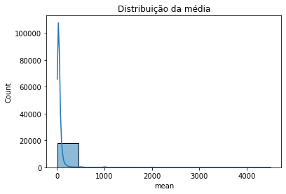
    


Distribuição da variável `mean`. Os dados estão muito mal distribuídos. Vamos aplicar a função `log` para transformar os dados em uma escala logarítmica, dessa forma os dados mais distantes vão se aproximar dos dados com valores menores.


```python
df_seg['mean_log'] = df_seg['mean'].apply(np.log)
display(df_seg.head())
sns.histplot(df_seg['mean_log'], kde=True, bins=10).set(title='Distribuição normal da média com log')
```


<div>
<style scoped>
    .dataframe tbody tr th:only-of-type {
        vertical-align: middle;
    }

    .dataframe tbody tr th {
        vertical-align: top;
    }

    .dataframe thead th {
        text-align: right;
    }
</style>
<table border="1" class="dataframe">
  <thead>
    <tr style="text-align: right;">
      <th></th>
      <th>count</th>
      <th>mean</th>
      <th>median</th>
      <th>sum</th>
      <th>days_since</th>
      <th>mean_log</th>
    </tr>
  </thead>
  <tbody>
    <tr>
      <th>0</th>
      <td>1</td>
      <td>30.000000</td>
      <td>30.0</td>
      <td>30.0</td>
      <td>3829</td>
      <td>3.401197</td>
    </tr>
    <tr>
      <th>1</th>
      <td>7</td>
      <td>71.428571</td>
      <td>80.0</td>
      <td>500.0</td>
      <td>343</td>
      <td>4.268698</td>
    </tr>
    <tr>
      <th>2</th>
      <td>10</td>
      <td>115.800000</td>
      <td>100.0</td>
      <td>1158.0</td>
      <td>758</td>
      <td>4.751865</td>
    </tr>
    <tr>
      <th>3</th>
      <td>1</td>
      <td>20.000000</td>
      <td>20.0</td>
      <td>20.0</td>
      <td>1401</td>
      <td>2.995732</td>
    </tr>
    <tr>
      <th>4</th>
      <td>2</td>
      <td>50.000000</td>
      <td>50.0</td>
      <td>100.0</td>
      <td>2970</td>
      <td>3.912023</td>
    </tr>
  </tbody>
</table>
</div>


    [Text(0.5, 1.0, 'Distribuição normal da média com log')]


    
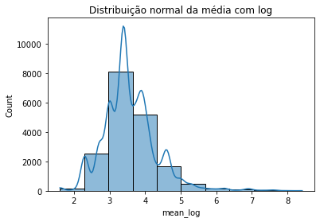
    


**3.2.1.2: Mediana (median)**

Vamos aplicar a mesma transformação logarítmica para a mediana e para o somatório.


```python
plt.figure(figsize=(10, 6))
sns.histplot(df_seg['median'], kde=True, bins=10)
```


    <AxesSubplot:xlabel='median', ylabel='Count'>


    
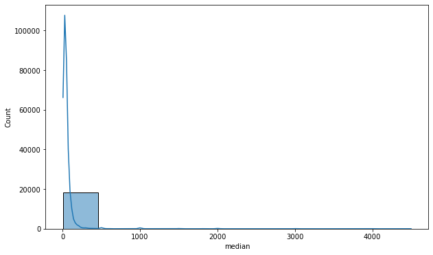
    


```python
df_seg['median_log'] = df_seg['median'].apply(np.log)

plt.figure(figsize=(10, 6))
sns.histplot(df_seg['median_log'], kde=True, bins=10)
```


    <AxesSubplot:xlabel='median_log', ylabel='Count'>


    
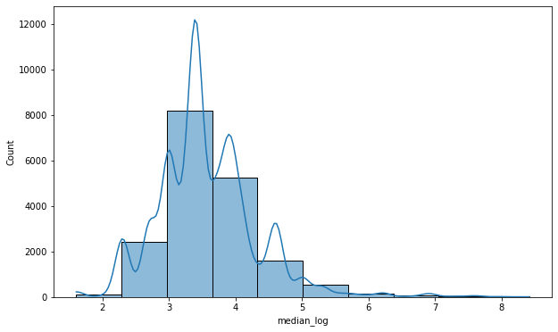
    


**3.2.1.3: Somatório (sum)**


```python
plt.figure(figsize=(10, 6))
sns.histplot(df_seg['sum'], kde=True, bins=10)
```


    <AxesSubplot:xlabel='sum', ylabel='Count'>


    
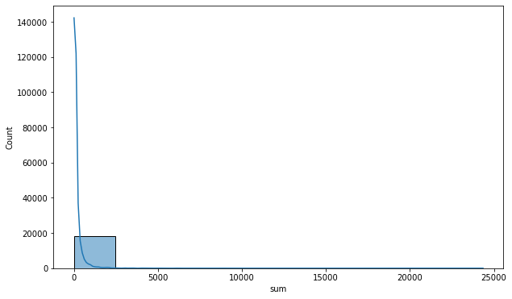
    


```python
df_seg['sum_log'] = df_seg['sum'].apply(np.log)

plt.figure(figsize=(10, 6))
sns.histplot(df_seg['sum_log'], kde=True, bins=10)
```


    <AxesSubplot:xlabel='sum_log', ylabel='Count'>


    
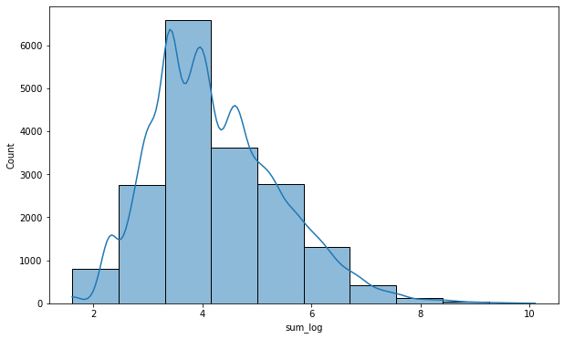
    


**Skewness**<br/>
Vamos checar o skewness. Skewness próximo de zero indica que os dados estão normalmenete distribuídos. Caso o valor seja maior que zero significa que os dados estão mais a esquerda da distribuição normal, caso seja negativo, os dados estão mais a direita.


```python
df_seg.skew()
```


    count          2.948291
    mean          14.619921
    median        14.886556
    sum           16.589933
    days_since     0.534059
    mean_log       1.172518
    median_log     1.151319
    sum_log        0.678704
    dtype: float64


Veja que o Skewness caiu consideravelmente, os dados ainda estão assimétricos, mas para o nosso modelo vai servir. 

Como sugestão, tente remover os outliers para você ver a diferença no restante do projeto.

<h3 id="id_3-2-2">3.2.2) Padronização e escala dos dados</h3>

É hora de padronizar os dados, vamos aplicar a técnica de StandardScaler.


```python
stand = StandardScaler()
#columns = ['count', 'mean_log', 'median_log', 'sum_log', 'days_since']
columns = ['count', 'mean_log', 'sum_log', 'days_since']

df_seg_scale = stand.fit_transform(df_seg[columns])
df_seg_scale[0:5] # Observando os primeiros registros
```


    array([[-0.60690881, -0.23580188, -0.71836697,  2.38204349],
           [ 1.43612529,  0.89438649,  1.66882675, -0.84153018],
           [ 2.45764235,  1.52386076,  2.38143671, -0.45777141],
           [-0.60690881, -0.76404585, -1.06240624,  0.1368235 ],
           [-0.26640313,  0.42970683,  0.30321025,  1.58770907]])


<h2 id="id_3-3">3.3) Técnicas de Clustering</h2>

Após ter feito todas as padronizações e transformações necessárias, vamos aplicar finalmente aplicar a clusterização, mas calma aí! Primeiro vamos fazer o teste de inertia do Kmeans para escolher a melhor quantidade de clusters para o nosso projeto.

Vamos testar o Kmeans com cluster no range de 2 a 10 e adicionar numa lista o resultado de todos eles.

<h3 id="id_3-3-1">3.3.1) Escolhando a quantidade de Clusters</h3>


```python
inertia = []
for i in tqdm(range(2,11)):
    kmeans = cluster.KMeans(n_clusters=i, init='k-means++', n_init=15, max_iter=500, random_state=17)
    kmeans.fit(df_seg_scale)
    inertia.append(kmeans.inertia_)
```

    100%|██████████| 9/9 [00:05<00:00,  1.59it/s]
    

Agora vamos computar o score de silhoueta. Aqui quanto maior o score, melhor.


```python
silhouette = {}
for i in tqdm(range(2,10)):
    kmeans = cluster.KMeans(n_clusters=i, init='k-means++', n_init=15, max_iter=500, random_state=17)
    kmeans.fit(df_seg_scale)
    silhouette[i] = silhouette_score(df_seg_scale, kmeans.labels_, metric='euclidean')
```

    100%|██████████| 8/8 [00:35<00:00,  4.48s/it]
    


```python
plt.figure(figsize=(12,6))
plt.subplot(1, 2, 1)

plt.plot(range(2,len(inertia)+2), inertia, marker='o',lw=2,ms=8)
plt.xlabel('Número de clusters')
plt.title('K-means Inertia',fontweight='bold')
plt.grid(True)

plt.subplot(1, 2, 2)

plt.bar(range(len(silhouette)), list(silhouette.values()), align='center',width=0.5)
plt.xticks(range(len(silhouette)), list(silhouette.keys()))
plt.grid()
plt.title('Silhouette Score',fontweight='bold')
plt.xlabel('Número de clusters')
```


    Text(0.5, 0, 'Número de clusters')


    
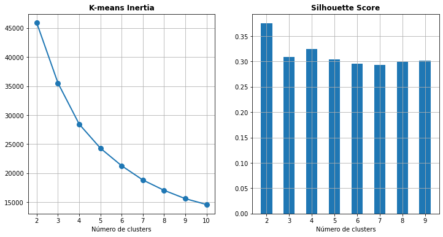
    


Após ter realizado todos os cálculos, o algoritmo nos diz que a melhor quantidade de clustes são dois clusters. Porém, queremos agrupar os dados em mais clusters, por isso vamos aplicar o segundo melhor valor segundo o score de silhoueta. Logo, vou definir 4 clusters para a continuidade do projeto.

<h3 id="id_3-3-2">3.3.2) Clustering Hierárquico</h3>

Após ter definido a quantidade de clusters igual a 4, vamos finalmente construir o modelo utilizando a técnica de clustering hierárquico, dessa forma vamos obter os melhores clusters do conjunto de dados.


```python
n_clusters = 4

hc = AgglomerativeClustering(n_clusters = n_clusters, affinity = 'euclidean', linkage ='ward')
y_hc=hc.fit_predict(df_seg_scale)

df_seg['cluster_hc'] = y_hc
df_seg.head(3)
```


<div>
<style scoped>
    .dataframe tbody tr th:only-of-type {
        vertical-align: middle;
    }

    .dataframe tbody tr th {
        vertical-align: top;
    }

    .dataframe thead th {
        text-align: right;
    }
</style>
<table border="1" class="dataframe">
  <thead>
    <tr style="text-align: right;">
      <th></th>
      <th>count</th>
      <th>mean</th>
      <th>median</th>
      <th>sum</th>
      <th>days_since</th>
      <th>mean_log</th>
      <th>median_log</th>
      <th>sum_log</th>
      <th>cluster_hc</th>
    </tr>
  </thead>
  <tbody>
    <tr>
      <th>0</th>
      <td>1</td>
      <td>30.000000</td>
      <td>30.0</td>
      <td>30.0</td>
      <td>3829</td>
      <td>3.401197</td>
      <td>3.401197</td>
      <td>3.401197</td>
      <td>2</td>
    </tr>
    <tr>
      <th>1</th>
      <td>7</td>
      <td>71.428571</td>
      <td>80.0</td>
      <td>500.0</td>
      <td>343</td>
      <td>4.268698</td>
      <td>4.382027</td>
      <td>6.214608</td>
      <td>1</td>
    </tr>
    <tr>
      <th>2</th>
      <td>10</td>
      <td>115.800000</td>
      <td>100.0</td>
      <td>1158.0</td>
      <td>758</td>
      <td>4.751865</td>
      <td>4.605170</td>
      <td>7.054450</td>
      <td>1</td>
    </tr>
  </tbody>
</table>
</div>


Vamos visualizar no gráfico 2D como os clusters se comportam na relação de duas variáveis.


```python
fig = px.scatter(df_seg, x='mean', y='sum', color='cluster_hc')

fig.update_layout(
    title='<span>Clusters de média por somatório</span>', 
    autosize=False,
    width=1200,
    height=600,
)

fig.show()
```


```python
fig = px.scatter(df_seg, x='mean', y='count', color='cluster_hc')

fig.update_layout(
    title='<span>Clusters de média por somatório</span>', 
    autosize=False,
    width=1200,
    height=600,
)

fig.show()
```


Legal, podemos perceber que os dados estão agrupados seguindo uma lógica.

<h3 id="id_3-3-3">3.3.3) Clustering Hierárquico com PCA</h3>

Uma técnica bastante comum quando se trabalha com Machine Learning, é aplicar a redução da dimensionalidade, com o intuito de unir vários atributos em apenas um. Dessa forma conseguimos reduzir a complexidade do problema e ganhar bastante em termos de performance também.

Este projeto não possui muitas variáveis, mas vamos aplicar esta técnica para reduzir o problema em uma plano bidimensional e verificar como o mesmo algoritmo de Clustering Hierárquico se comporta em ploblema com duas dimensões.


```python
pca_2 = PCA(2)
pca_2_result = pca_2.fit_transform(df_seg_scale)

n_clusters = 4
hc_pca = AgglomerativeClustering(n_clusters = n_clusters, affinity = 'euclidean', linkage ='ward')
y_hc_pca=hc_pca.fit_predict(pca_2_result)

df_seg['cluster_pca'] = y_hc_pca
```


```python
fig = px.scatter(x=pca_2_result.transpose()[0], y=pca_2_result.transpose()[1], color=y_hc_pca)

fig.update_layout(
    title='<span>Dados Clusterizados (Hierarchical Clustering Model - PCA)</span>', 
    autosize=False,
    width=1000,
    height=600,
    xaxis=dict(title='<span>PCA 1</span>'),
    yaxis=dict(title='<span>PCA 2</span>')
)

fig.show()
```


Visualizando o problema em apenas duas dimensões fica nítido que a divisão entre os grupos que o algoritmo realizou.

> Nota: Embora graficamente tenha ficado mais aparente o agrupamento, isso não quer dizer que o algoritmo conseguiu agrupar de maneira melhor os dados utilizando apenas duas dimensões. 

<h2 id="id_3-4">3.4) Análise de Resultados</h2>

Uma das dificuldades na aprendizagem não-supervisionada é que a inferência e classificação dos dados fica a cargo do cientista de dados, ou seja, o algoritmo agrupou os dados e definiu os grupos. Mas há algumas questões que devemos levar em consideração.
* O que os grupos querem dizer?
* Qual o padrão nos dados?
* Como isso ajuda a equipe de Marketing?
* Esses grupos realmente são relevantes para os problemas da vida real?

Vamos analisar as informações estatísticas e tentar responder essas perguntas.

<h3 id="id_3-4-1">3.4.1) Resultados obtidos sem PCA</h3>


```python
df_res = df_seg.groupby(['cluster_hc'])['count', 'mean', 'sum', 'days_since'].agg(['mean', 'median', 'sum'])
df_res
```


<div>
<style scoped>
    .dataframe tbody tr th:only-of-type {
        vertical-align: middle;
    }

    .dataframe tbody tr th {
        vertical-align: top;
    }

    .dataframe thead tr th {
        text-align: left;
    }

    .dataframe thead tr:last-of-type th {
        text-align: right;
    }
</style>
<table border="1" class="dataframe">
  <thead>
    <tr>
      <th></th>
      <th colspan="3" halign="left">count</th>
      <th colspan="3" halign="left">mean</th>
      <th colspan="3" halign="left">sum</th>
      <th colspan="3" halign="left">days_since</th>
    </tr>
    <tr>
      <th></th>
      <th>mean</th>
      <th>median</th>
      <th>sum</th>
      <th>mean</th>
      <th>median</th>
      <th>sum</th>
      <th>mean</th>
      <th>median</th>
      <th>sum</th>
      <th>mean</th>
      <th>median</th>
      <th>sum</th>
    </tr>
    <tr>
      <th>cluster_hc</th>
      <th></th>
      <th></th>
      <th></th>
      <th></th>
      <th></th>
      <th></th>
      <th></th>
      <th></th>
      <th></th>
      <th></th>
      <th></th>
      <th></th>
    </tr>
  </thead>
  <tbody>
    <tr>
      <th>0</th>
      <td>1.881651</td>
      <td>1.0</td>
      <td>14500</td>
      <td>32.339062</td>
      <td>30.0</td>
      <td>249204.815556</td>
      <td>59.403162</td>
      <td>50.0</td>
      <td>457760.77</td>
      <td>654.193486</td>
      <td>623.0</td>
      <td>5041215</td>
    </tr>
    <tr>
      <th>1</th>
      <td>7.954750</td>
      <td>7.0</td>
      <td>24787</td>
      <td>65.215370</td>
      <td>47.5</td>
      <td>203211.091554</td>
      <td>506.054111</td>
      <td>325.0</td>
      <td>1576864.61</td>
      <td>399.504493</td>
      <td>176.0</td>
      <td>1244856</td>
    </tr>
    <tr>
      <th>2</th>
      <td>1.480147</td>
      <td>1.0</td>
      <td>8872</td>
      <td>32.616292</td>
      <td>30.0</td>
      <td>195502.052000</td>
      <td>47.962698</td>
      <td>35.0</td>
      <td>287488.41</td>
      <td>2567.608609</td>
      <td>2561.0</td>
      <td>15390246</td>
    </tr>
    <tr>
      <th>3</th>
      <td>1.926296</td>
      <td>2.0</td>
      <td>3084</td>
      <td>260.122078</td>
      <td>100.0</td>
      <td>416455.447511</td>
      <td>544.803941</td>
      <td>200.0</td>
      <td>872231.11</td>
      <td>875.004372</td>
      <td>731.0</td>
      <td>1400882</td>
    </tr>
  </tbody>
</table>
</div>


```python
df_res = df_res[[['count', 'mean'], ['count', 'sum'], ['mean', 'mean'], ['sum', 'sum'], ['days_since', 'median']]]
df_res.columns = ['count_mean', 'count_sum', 'mean', 'sum', 'days_since_median']

#Vamos arredondar as médias para facilitar a nossa análise.
df_res['count_mean'] = df_res['count_mean'].apply(lambda x: np.round(x))
df_res['count_mean'] = df_res['count_mean'].apply(lambda x: np.round(x, 2))
```

Após algumas transformações e conversões vamos realizar ver os que os grupos nos dizem.


```python
df_res
```


<div>
<style scoped>
    .dataframe tbody tr th:only-of-type {
        vertical-align: middle;
    }

    .dataframe tbody tr th {
        vertical-align: top;
    }

    .dataframe thead th {
        text-align: right;
    }
</style>
<table border="1" class="dataframe">
  <thead>
    <tr style="text-align: right;">
      <th></th>
      <th>count_mean</th>
      <th>count_sum</th>
      <th>mean</th>
      <th>sum</th>
      <th>days_since_median</th>
    </tr>
    <tr>
      <th>cluster_hc</th>
      <th></th>
      <th></th>
      <th></th>
      <th></th>
      <th></th>
    </tr>
  </thead>
  <tbody>
    <tr>
      <th>0</th>
      <td>2.0</td>
      <td>14500</td>
      <td>32.339062</td>
      <td>457760.77</td>
      <td>623.0</td>
    </tr>
    <tr>
      <th>1</th>
      <td>8.0</td>
      <td>24787</td>
      <td>65.215370</td>
      <td>1576864.61</td>
      <td>176.0</td>
    </tr>
    <tr>
      <th>2</th>
      <td>1.0</td>
      <td>8872</td>
      <td>32.616292</td>
      <td>287488.41</td>
      <td>2561.0</td>
    </tr>
    <tr>
      <th>3</th>
      <td>2.0</td>
      <td>3084</td>
      <td>260.122078</td>
      <td>872231.11</td>
      <td>731.0</td>
    </tr>
  </tbody>
</table>
</div>


Fazendo uma análise para cada grupo de cliente:
* **Grupo 0**: O cliente vai em média 2 vezes na loja e gasta em média $32.34. No total, temos 14500 vendas com um lucro de R$457760. Pegando a mediana dos dias desde a última compra temos 623 dias.<br/>
**Conclusão**: Possui muitos clientes nesse grupo. É um perfil de cliente que a equipe de Marketing pode traçar alguma estratégia para tentar fidelizá-lo para que se tornem clientes como o do grupo 1.
<br/><br/>

* **Grupo 1**: É possível afirmar que este é o principal grupo para a empresa, é onde estão concentrados os clientes mais fiéis, que possuem a média de compras mais alta. É também o grupo que gerou o maior lucro para a empresa, com mais de 1 bilhão em vendas. Esse grupo tem a mediana de dias desde a última compra mais baixa dentre todos os outros grupos.<br/>
**Conclusão**: O grupo 1 possui os clientes mais fiéis, então talvez valha a pena empenhar um certo esforço para que os clientes continuem sempre comprando na nossa loja.
<br/><br/>

* **Grupo 2**: É o grupo mais inativo para a empresa, com a menor quantidade de vendas e média, o período mais longo desde a última compra e o que gerou a menor receita dentre todos os outros.<br/>
**Conclusão**: Se trata dos clientes que a empresa provavelmente já perdeu para algum concorrente. A equipe de Marketing deve decidir se tenta recuperar estes clientes ou se deixa este grupo de lado e foca nos outros. 
<br/><br/>


* **Grupo 3**: Assim como no grupo 0, neste grupo o cliente também vai em média duas vezes na loja, porém esse grupo contempla a maior média de valor gasto. O cliente gasta em média $260 por compra. É a segunda maior receita da empresa.<br/>
**Conclusão**: Com certeza vale a pena aplicar alguma estratégia para que esses clientes voltem para a loja e para atrair novos clientes desse tipo.
<br/><br/>


<h3 id="id_3-4-2">3.4.2) Resultados obtidos com PCA</h3>


```python
df_res = df_seg.groupby(['cluster_pca'])['count', 'mean', 'sum', 'days_since'].agg(['mean', 'median', 'sum'])
df_res
```


<div>
<style scoped>
    .dataframe tbody tr th:only-of-type {
        vertical-align: middle;
    }

    .dataframe tbody tr th {
        vertical-align: top;
    }

    .dataframe thead tr th {
        text-align: left;
    }

    .dataframe thead tr:last-of-type th {
        text-align: right;
    }
</style>
<table border="1" class="dataframe">
  <thead>
    <tr>
      <th></th>
      <th colspan="3" halign="left">count</th>
      <th colspan="3" halign="left">mean</th>
      <th colspan="3" halign="left">sum</th>
      <th colspan="3" halign="left">days_since</th>
    </tr>
    <tr>
      <th></th>
      <th>mean</th>
      <th>median</th>
      <th>sum</th>
      <th>mean</th>
      <th>median</th>
      <th>sum</th>
      <th>mean</th>
      <th>median</th>
      <th>sum</th>
      <th>mean</th>
      <th>median</th>
      <th>sum</th>
    </tr>
    <tr>
      <th>cluster_pca</th>
      <th></th>
      <th></th>
      <th></th>
      <th></th>
      <th></th>
      <th></th>
      <th></th>
      <th></th>
      <th></th>
      <th></th>
      <th></th>
      <th></th>
    </tr>
  </thead>
  <tbody>
    <tr>
      <th>0</th>
      <td>3.522159</td>
      <td>3.0</td>
      <td>23366</td>
      <td>38.988296</td>
      <td>37.5</td>
      <td>258648.355216</td>
      <td>123.364931</td>
      <td>95.0</td>
      <td>818402.95</td>
      <td>702.556226</td>
      <td>428.0</td>
      <td>4660758</td>
    </tr>
    <tr>
      <th>1</th>
      <td>1.250422</td>
      <td>1.0</td>
      <td>10381</td>
      <td>25.167710</td>
      <td>25.0</td>
      <td>208942.327857</td>
      <td>30.320122</td>
      <td>30.0</td>
      <td>251717.65</td>
      <td>1864.073115</td>
      <td>2032.0</td>
      <td>15475535</td>
    </tr>
    <tr>
      <th>2</th>
      <td>11.091356</td>
      <td>10.0</td>
      <td>11291</td>
      <td>95.645834</td>
      <td>57.5</td>
      <td>97367.458864</td>
      <td>963.971876</td>
      <td>587.5</td>
      <td>981323.37</td>
      <td>163.275049</td>
      <td>58.0</td>
      <td>166214</td>
    </tr>
    <tr>
      <th>3</th>
      <td>2.519285</td>
      <td>2.0</td>
      <td>6205</td>
      <td>202.767058</td>
      <td>100.0</td>
      <td>499415.264683</td>
      <td>464.027986</td>
      <td>210.0</td>
      <td>1142900.93</td>
      <td>1126.549736</td>
      <td>828.0</td>
      <td>2774692</td>
    </tr>
  </tbody>
</table>
</div>


```python
df_res = df_res[[['count', 'mean'], ['count', 'sum'], ['mean', 'mean'], ['sum', 'sum'], ['days_since', 'median']]]
df_res.columns = ['count_mean', 'count_sum', 'mean', 'sum', 'days_since_median']

#Vamos arredondar as médias para facilitar a nossa análise.
df_res['count_mean'] = df_res['count_mean'].apply(lambda x: np.round(x))
df_res['count_mean'] = df_res['count_mean'].apply(lambda x: np.round(x, 2))
```


```python
df_res
```


<div>
<style scoped>
    .dataframe tbody tr th:only-of-type {
        vertical-align: middle;
    }

    .dataframe tbody tr th {
        vertical-align: top;
    }

    .dataframe thead th {
        text-align: right;
    }
</style>
<table border="1" class="dataframe">
  <thead>
    <tr style="text-align: right;">
      <th></th>
      <th>count_mean</th>
      <th>count_sum</th>
      <th>mean</th>
      <th>sum</th>
      <th>days_since_median</th>
    </tr>
    <tr>
      <th>cluster_pca</th>
      <th></th>
      <th></th>
      <th></th>
      <th></th>
      <th></th>
    </tr>
  </thead>
  <tbody>
    <tr>
      <th>0</th>
      <td>4.0</td>
      <td>23366</td>
      <td>38.988296</td>
      <td>818402.95</td>
      <td>428.0</td>
    </tr>
    <tr>
      <th>1</th>
      <td>1.0</td>
      <td>10381</td>
      <td>25.167710</td>
      <td>251717.65</td>
      <td>2032.0</td>
    </tr>
    <tr>
      <th>2</th>
      <td>11.0</td>
      <td>11291</td>
      <td>95.645834</td>
      <td>981323.37</td>
      <td>58.0</td>
    </tr>
    <tr>
      <th>3</th>
      <td>3.0</td>
      <td>6205</td>
      <td>202.767058</td>
      <td>1142900.93</td>
      <td>828.0</td>
    </tr>
  </tbody>
</table>
</div>


Agora a análise pelos grupos gerados pelo PCA.

* **Grupo 0**: São os clientes inativos. Também os que possuem a menor média de valor gasto e o menor somatório total de valor total.
<br/>
**Conclusão**: Se trata dos clientes que a empresa provavelmente já perdeu para algum concorrente. A equipe de Marketing deve decidir se tenta recuperar estes clientes ou se deixa este grupo de lado e foca nos outros. 
<br/><br/>

* **Grupo 1**: É um grupo de clientes ativos, que vão em compram em média quatro vezes, possuem uma média de valor gasto baixo, mas compensa pela quantidade total de clientes.
<br/>
**Conclusão**: É uma base de clientes interessante para se trabalhar, pois corresponde a maior base da empresa. Vale a penas fidelizá-los de vez e traçar estratégias para que estes clientes comprem cada vez mais.
<br/><br/>

* **Grupo 2**: Neste grupo os clientes vão as compras em média três vezes. É o grupo com a maior média de valor gasto por cliente. Mas é um grupo cujo os clientes não estão muito ativos no momento, pois a mediana de dias passados desde a última compra é de 828 dias.
<br/>
**Conclusão**: A equipe de Marketing precisa trabalhar nesse grupo, trazê-los de volta, torná-los ativos é a melhor maneira de obter lucros, dado que é a base de dados que gerou a maior receita para a empresa. 
<br/><br/>

* **Grupo 3**: São os clientes mais ativos para a empresa. Estes compram em média 11 vezes e têm uma média bem alta de valor gasto, $95 por compra. 
<br/>
**Conclusão**: Utilizar estratégias que possibilitem manter estes clientes fiéis na empresa, ativos e gastando cada vez mais. 
<br/><br/>

---
<h2 id="id_4">4) SEGMENTAÇÃO GERENCIAL PARA EQUIPES DE VENDAS</h2>

Após ter definido os grupos para os clientes da area de Marketing, é hora de agrupar os clientes de outra maneira, de modo que a equipe de vendas consiga aplicar estratégias de vendas com base nos dados históricos dos clientes.

<h2 id="id_4-1">4.1) Pre Processamento</h2>

Primeiro vamos agrupar os clientes por Id, e pegar alguns valores, como quantidade de compras, média de valor gasto, mediana e somarório total. Outra informação relevante são as datas de compra, vamos pegar os dias desde a última compra do cliente e também a data desde a primeira compra deste cliente.


```python
df_ger = df.groupby(['client_id'], as_index=False)['value'].agg(['count', 'mean', 'median', 'sum'])
df_days = df.groupby(['client_id'], as_index=False)['date'].agg(['min', 'max'])

current_date = df['date'].max() + pd.Timedelta(days=1)
df_days['min'] = (current_date - df_days['min']).dt.days
df_days['max'] = (current_date - df_days['max']).dt.days

df_ger = df_ger.join(df_days, lsuffix='client_id', rsuffix='client_id')
df_ger.columns = ['quantidade', 'valor_medio', 'mediana', 'total_gasto', 'primeira_compra', 'ultima_compra']

df_ger.head()
```


<div>
<style scoped>
    .dataframe tbody tr th:only-of-type {
        vertical-align: middle;
    }

    .dataframe tbody tr th {
        vertical-align: top;
    }

    .dataframe thead th {
        text-align: right;
    }
</style>
<table border="1" class="dataframe">
  <thead>
    <tr style="text-align: right;">
      <th></th>
      <th>quantidade</th>
      <th>valor_medio</th>
      <th>mediana</th>
      <th>total_gasto</th>
      <th>primeira_compra</th>
      <th>ultima_compra</th>
    </tr>
    <tr>
      <th>client_id</th>
      <th></th>
      <th></th>
      <th></th>
      <th></th>
      <th></th>
      <th></th>
    </tr>
  </thead>
  <tbody>
    <tr>
      <th>10</th>
      <td>1</td>
      <td>30.000000</td>
      <td>30.0</td>
      <td>30.0</td>
      <td>3829</td>
      <td>3829</td>
    </tr>
    <tr>
      <th>80</th>
      <td>7</td>
      <td>71.428571</td>
      <td>80.0</td>
      <td>500.0</td>
      <td>3751</td>
      <td>343</td>
    </tr>
    <tr>
      <th>90</th>
      <td>10</td>
      <td>115.800000</td>
      <td>100.0</td>
      <td>1158.0</td>
      <td>3783</td>
      <td>758</td>
    </tr>
    <tr>
      <th>120</th>
      <td>1</td>
      <td>20.000000</td>
      <td>20.0</td>
      <td>20.0</td>
      <td>1401</td>
      <td>1401</td>
    </tr>
    <tr>
      <th>130</th>
      <td>2</td>
      <td>50.000000</td>
      <td>50.0</td>
      <td>100.0</td>
      <td>3710</td>
      <td>2970</td>
    </tr>
  </tbody>
</table>
</div>


Aqui eu vou criar uma função que retorna se o cliente é `inativo`, `frio`, `quente` ou `ativo`. É uma forma bem interessante de atribuir status para os clientes. E como serão feitos esses calculos?
* Inativo: Clientes que não compram há mais de 3 anos;
* Frio: Clientes que não compram há mais de 2 anos;
* Quente: Clientes que não compram há mais de um ano; 
* Ativo: Clientes que compram há menos de um ano;


```python
def calculaSegmento(dias):
    if dias > 365 * 3 or dias < 0:
        return  'inativo'
    elif dias > 365 * 2:
        return 'frio'
    elif dias > 365:
        return 'quente'
    elif dias <= 365:
        return 'ativo'   

```

Além do mapeamento de inativo, frio, quente e ativo, vou atribuir também se o cliente é `valor baixo`, `valor alto` ou ainda se é um `novo cliente`. 


```python
df_ger['segmento'] = df_ger['ultima_compra'].apply(calculaSegmento)

df_ger.loc[(df_ger['segmento'] == 'quente') & (df_ger['valor_medio'] < 80), 'segmento'] = 'quente - valor baixo'
df_ger.loc[(df_ger['segmento'] == 'quente') & (df_ger['valor_medio'] >= 80), 'segmento'] = 'quente - valor alto'

df_ger.loc[(df_ger['segmento'] == 'ativo') & (df_ger['quantidade'] == 1), 'segmento'] = 'ativo - novo'

df_ger.loc[(df_ger['segmento'] == 'ativo') & (df_ger['valor_medio'] < 80), 'segmento'] = 'ativo - valor baixo'
df_ger.loc[(df_ger['segmento'] == 'ativo') & (df_ger['valor_medio'] >= 80), 'segmento'] = 'ativo - valor alto'

```


```python
df_ger.head()
```


<div>
<style scoped>
    .dataframe tbody tr th:only-of-type {
        vertical-align: middle;
    }

    .dataframe tbody tr th {
        vertical-align: top;
    }

    .dataframe thead th {
        text-align: right;
    }
</style>
<table border="1" class="dataframe">
  <thead>
    <tr style="text-align: right;">
      <th></th>
      <th>quantidade</th>
      <th>valor_medio</th>
      <th>mediana</th>
      <th>total_gasto</th>
      <th>primeira_compra</th>
      <th>ultima_compra</th>
      <th>segmento</th>
    </tr>
    <tr>
      <th>client_id</th>
      <th></th>
      <th></th>
      <th></th>
      <th></th>
      <th></th>
      <th></th>
      <th></th>
    </tr>
  </thead>
  <tbody>
    <tr>
      <th>10</th>
      <td>1</td>
      <td>30.000000</td>
      <td>30.0</td>
      <td>30.0</td>
      <td>3829</td>
      <td>3829</td>
      <td>inativo</td>
    </tr>
    <tr>
      <th>80</th>
      <td>7</td>
      <td>71.428571</td>
      <td>80.0</td>
      <td>500.0</td>
      <td>3751</td>
      <td>343</td>
      <td>ativo - valor baixo</td>
    </tr>
    <tr>
      <th>90</th>
      <td>10</td>
      <td>115.800000</td>
      <td>100.0</td>
      <td>1158.0</td>
      <td>3783</td>
      <td>758</td>
      <td>frio</td>
    </tr>
    <tr>
      <th>120</th>
      <td>1</td>
      <td>20.000000</td>
      <td>20.0</td>
      <td>20.0</td>
      <td>1401</td>
      <td>1401</td>
      <td>inativo</td>
    </tr>
    <tr>
      <th>130</th>
      <td>2</td>
      <td>50.000000</td>
      <td>50.0</td>
      <td>100.0</td>
      <td>3710</td>
      <td>2970</td>
      <td>inativo</td>
    </tr>
  </tbody>
</table>
</div>


<h2 id="id_4-2">4.2) Analisando Resultados<h2>

Agora que temos os segmentos dos clientes, vamos agrupar por segmento aplicando as técnicas de `pivot` da tabela. Dessa forma teremos informações detalhadas a respeito de cada segmento. 


```python
df_pivot = pd.pivot_table(df_ger, index='segmento', aggfunc=[np.count_nonzero, np.mean, np.sum, np.min, np.max])
df_pivot = df_pivot[[['count_nonzero', 'quantidade'], ['mean', 'valor_medio'], ['sum', 'total_gasto'], ['amax', 'primeira_compra'], ['amin', 'ultima_compra']]]

display(df_pivot)
```


<div>
<style scoped>
    .dataframe tbody tr th:only-of-type {
        vertical-align: middle;
    }

    .dataframe tbody tr th {
        vertical-align: top;
    }

    .dataframe thead tr th {
        text-align: left;
    }

    .dataframe thead tr:last-of-type th {
        text-align: right;
    }
</style>
<table border="1" class="dataframe">
  <thead>
    <tr>
      <th></th>
      <th>count_nonzero</th>
      <th>mean</th>
      <th>sum</th>
      <th>amax</th>
      <th>amin</th>
    </tr>
    <tr>
      <th></th>
      <th>quantidade</th>
      <th>valor_medio</th>
      <th>total_gasto</th>
      <th>primeira_compra</th>
      <th>ultima_compra</th>
    </tr>
    <tr>
      <th>segmento</th>
      <th></th>
      <th></th>
      <th></th>
      <th></th>
      <th></th>
    </tr>
  </thead>
  <tbody>
    <tr>
      <th>ativo - novo</th>
      <td>1464</td>
      <td>77.819816</td>
      <td>113928.21</td>
      <td>360</td>
      <td>1</td>
    </tr>
    <tr>
      <th>ativo - valor alto</th>
      <td>762</td>
      <td>203.232845</td>
      <td>898156.45</td>
      <td>4010</td>
      <td>1</td>
    </tr>
    <tr>
      <th>ativo - valor baixo</th>
      <td>3172</td>
      <td>37.926008</td>
      <td>706291.47</td>
      <td>4012</td>
      <td>1</td>
    </tr>
    <tr>
      <th>frio</th>
      <td>1903</td>
      <td>51.739893</td>
      <td>232402.29</td>
      <td>4016</td>
      <td>731</td>
    </tr>
    <tr>
      <th>inativo</th>
      <td>9158</td>
      <td>48.112771</td>
      <td>850306.56</td>
      <td>4016</td>
      <td>1096</td>
    </tr>
    <tr>
      <th>quente - valor alto</th>
      <td>286</td>
      <td>273.873023</td>
      <td>224935.20</td>
      <td>4004</td>
      <td>366</td>
    </tr>
    <tr>
      <th>quente - valor baixo</th>
      <td>1672</td>
      <td>34.614243</td>
      <td>168324.72</td>
      <td>4011</td>
      <td>366</td>
    </tr>
  </tbody>
</table>
</div>


Agora sim, vamos analisar cada segmento:
* **Ativo - novo**: Este são os novos clientes adquiridos pela empresa, vale um esforço para a equipe de vendas para mantê-los como clientes da empresa. Veja que a quantidade de novos clientes é uma boa quantidade, mas o objetivo é sempre atrair novos clientes.
<br/>

* **Ativo - valor alto**: Este grupo contém os clientes que normalmente gastam mais na nossa loja, mesmo sendo um grupo com menos clientes é um grupo que gera mais receita para a empresa do que o próximo grupo.
<br/>

* **Ativo - valor baixo**: Dos grupos de ativos, é o grupo com a maior quantidade de clientes. São normalmente clientes que fazem compras com valores mais baixos.
<br/>

* **Quente - valor alto e Quente valor baixo**: São os clientes que não compram há mais de um ano. Veja que a empresa não perdeu tantos clientes em relação ao grupo de *inativos* e até o grupo de *frio*. Quer dizer que o trabalho de Marketing e Vendas vem melhorando no passar dos anos. Porém, ainda sim, é um valor considerável de clientes que estão deixando de comprar na loja.
<br/>

* **frio e inativo**:  São os clientes que não compram há mais de dois e três anos, respectivamente. Veja a quantidade de clientes inativos! Isso é um problema sério, são mais de 10000 de clientes somando os dois grupos com clientes que deixaram de comprar na nossa loja. Vemos que do grupo de inativos para o grupo de frios houve uma queda (tudo bem que o range dos dados no grupo de inativos é bem maior), mas a empresa bem conseguindo minimizar a perda de clientes ao longo dos anos medidos. 
<br/>


<h2 id="id_4-3">4.3) Computando faturamento em 2015</h2>

Veremos o faturamento do ano atual do ano de 2015 (último ano no conjunto de dados). Vamos analisar quanto a empresa vendeu para cada segmento de clientes.


```python
df_faturamento = df.loc[df['date'] >= '2015-01-01']
df_faturamento = pd.DataFrame(df_faturamento.groupby('client_id')['value'].sum())

df_ger_fat = df_ger.merge(df_faturamento, left_index=True, right_index=True, how='left')


df_ger_fat.rename(columns={'value': 'faturamento_2015'}, inplace = True)

df_ger_fat['faturamento_2015'].fillna(0, inplace=True)

df_ger_fat.head()
```


<div>
<style scoped>
    .dataframe tbody tr th:only-of-type {
        vertical-align: middle;
    }

    .dataframe tbody tr th {
        vertical-align: top;
    }

    .dataframe thead th {
        text-align: right;
    }
</style>
<table border="1" class="dataframe">
  <thead>
    <tr style="text-align: right;">
      <th></th>
      <th>quantidade</th>
      <th>valor_medio</th>
      <th>mediana</th>
      <th>total_gasto</th>
      <th>primeira_compra</th>
      <th>ultima_compra</th>
      <th>segmento</th>
      <th>faturamento_2015</th>
    </tr>
    <tr>
      <th>client_id</th>
      <th></th>
      <th></th>
      <th></th>
      <th></th>
      <th></th>
      <th></th>
      <th></th>
      <th></th>
    </tr>
  </thead>
  <tbody>
    <tr>
      <th>10</th>
      <td>1</td>
      <td>30.000000</td>
      <td>30.0</td>
      <td>30.0</td>
      <td>3829</td>
      <td>3829</td>
      <td>inativo</td>
      <td>0.0</td>
    </tr>
    <tr>
      <th>80</th>
      <td>7</td>
      <td>71.428571</td>
      <td>80.0</td>
      <td>500.0</td>
      <td>3751</td>
      <td>343</td>
      <td>ativo - valor baixo</td>
      <td>80.0</td>
    </tr>
    <tr>
      <th>90</th>
      <td>10</td>
      <td>115.800000</td>
      <td>100.0</td>
      <td>1158.0</td>
      <td>3783</td>
      <td>758</td>
      <td>frio</td>
      <td>0.0</td>
    </tr>
    <tr>
      <th>120</th>
      <td>1</td>
      <td>20.000000</td>
      <td>20.0</td>
      <td>20.0</td>
      <td>1401</td>
      <td>1401</td>
      <td>inativo</td>
      <td>0.0</td>
    </tr>
    <tr>
      <th>130</th>
      <td>2</td>
      <td>50.000000</td>
      <td>50.0</td>
      <td>100.0</td>
      <td>3710</td>
      <td>2970</td>
      <td>inativo</td>
      <td>0.0</td>
    </tr>
  </tbody>
</table>
</div>


```python
df_faturamento = df_ger_fat.groupby(['segmento'], as_index=False)['faturamento_2015'].agg(['sum', 'mean']).sort_values(by='sum', ascending=False)

df_faturamento.head(10)
```


<div>
<style scoped>
    .dataframe tbody tr th:only-of-type {
        vertical-align: middle;
    }

    .dataframe tbody tr th {
        vertical-align: top;
    }

    .dataframe thead th {
        text-align: right;
    }
</style>
<table border="1" class="dataframe">
  <thead>
    <tr style="text-align: right;">
      <th></th>
      <th>sum</th>
      <th>mean</th>
    </tr>
    <tr>
      <th>segmento</th>
      <th></th>
      <th></th>
    </tr>
  </thead>
  <tbody>
    <tr>
      <th>ativo - valor alto</th>
      <td>209437.00</td>
      <td>274.851706</td>
    </tr>
    <tr>
      <th>ativo - valor baixo</th>
      <td>155028.92</td>
      <td>48.874187</td>
    </tr>
    <tr>
      <th>ativo - novo</th>
      <td>113928.21</td>
      <td>77.819816</td>
    </tr>
    <tr>
      <th>frio</th>
      <td>0.00</td>
      <td>0.000000</td>
    </tr>
    <tr>
      <th>inativo</th>
      <td>0.00</td>
      <td>0.000000</td>
    </tr>
    <tr>
      <th>quente - valor alto</th>
      <td>0.00</td>
      <td>0.000000</td>
    </tr>
    <tr>
      <th>quente - valor baixo</th>
      <td>0.00</td>
      <td>0.000000</td>
    </tr>
  </tbody>
</table>
</div>


Observe que legal. A empresa está se saindo bem em adquirir novos e bons clientes. A maior receita dentre os grupos de ativos vem dos novos clientes.

---
<h2 id="id_5">5) PREVISÃO DE FATURAMENTO</h2>

Neste capítulo iremos aplicar as principais técnicas de Machine Learning criar um modelo capaz de prever o valor gasto para cada cliente. Primeiro iremos padronizar os dados, depois realizar a divisão entre dados de treino e dados de teste, em seguida submenter ao modelo.<br/>
Iremos fazer em duas etapas:
* A primeira etapa é a uma criação de um modelo dumb com intuito apenas de ter um direcionamento de como o modelo se comporta com essa base de dados;
* A segunda etapa criaremos uma função mais robusta que testa várias combinações de algoritmos em várias escalas de dados e teremos um resultado mais preciso;


No final teremos um modelo um modelo capaz de prever o valor gasto para cada cliente de acordo com as informações históricas no nosso dataset

<h2 id="id_5-0">5.0) Importações</h2>

Começando pela importação das bibliotecas que vamos utilizar


```python
#Para padronizar os dados
from sklearn.preprocessing import StandardScaler
from sklearn.preprocessing import Normalizer
from sklearn.preprocessing import RobustScaler

#Para realizar a validação cruzada em vários folds e também o pipeline de passos.
from sklearn.model_selection import KFold, cross_val_score, GridSearchCV
from sklearn.pipeline import Pipeline

#Utilidade para a nossa função
import re

#Nossa métrica de avaliação
from sklearn.metrics import r2_score

#Os algoritmos que iremos testar
from sklearn.ensemble import GradientBoostingRegressor
from sklearn.linear_model import ElasticNet, Lasso
from sklearn.svm import SVR
import xgboost as xgb
import lightgbm as lgb
```

<h2 id="id_5-1">5.1) Previsão para cada Cliente</h2>

<h3 id="id_5-1-1">5.1.1) Pré processamento</h3>

Primeiro de tudo, vamos fazer um merge com o dataframe original com o dataframe de faturamento gerado anteriormente. Queremos as seguintes informações:
* **Client_id**: Se queremos prever para cada cliente, precisaremos saber de qual cliente se trata;
* **Year**: O ano da compra
* **primeira_compra**: Dias desde a primeira compra
* **ultima_compra**: Dias desde a última compra
* **valor_medio**: Valor médio que esse cliente gasta na loja;
* **total_gasto**: O quanto o cliente já gastou na loja;
* **segmento**: Queremos saber qual é o engajamento do cliente atualmente;
* **value**: O valor de cada compra do cliente. É justamente nossa variável target;


```python
df_pred = df.merge(df_ger_fat, left_on='client_id', right_index=True, how='inner')[['client_id', 'year', 'primeira_compra', 'ultima_compra', 'valor_medio', 'total_gasto', 'segmento', 'value']]
df_pred.reset_index(drop=True, inplace=True)
df_pred.head()
```


<div>
<style scoped>
    .dataframe tbody tr th:only-of-type {
        vertical-align: middle;
    }

    .dataframe tbody tr th {
        vertical-align: top;
    }

    .dataframe thead th {
        text-align: right;
    }
</style>
<table border="1" class="dataframe">
  <thead>
    <tr style="text-align: right;">
      <th></th>
      <th>client_id</th>
      <th>year</th>
      <th>primeira_compra</th>
      <th>ultima_compra</th>
      <th>valor_medio</th>
      <th>total_gasto</th>
      <th>segmento</th>
      <th>value</th>
    </tr>
  </thead>
  <tbody>
    <tr>
      <th>0</th>
      <td>760</td>
      <td>2009</td>
      <td>3293</td>
      <td>1273</td>
      <td>38.0</td>
      <td>190.0</td>
      <td>inativo</td>
      <td>25.0</td>
    </tr>
    <tr>
      <th>1</th>
      <td>760</td>
      <td>2008</td>
      <td>3293</td>
      <td>1273</td>
      <td>38.0</td>
      <td>190.0</td>
      <td>inativo</td>
      <td>50.0</td>
    </tr>
    <tr>
      <th>2</th>
      <td>760</td>
      <td>2007</td>
      <td>3293</td>
      <td>1273</td>
      <td>38.0</td>
      <td>190.0</td>
      <td>inativo</td>
      <td>60.0</td>
    </tr>
    <tr>
      <th>3</th>
      <td>760</td>
      <td>2006</td>
      <td>3293</td>
      <td>1273</td>
      <td>38.0</td>
      <td>190.0</td>
      <td>inativo</td>
      <td>30.0</td>
    </tr>
    <tr>
      <th>4</th>
      <td>760</td>
      <td>2012</td>
      <td>3293</td>
      <td>1273</td>
      <td>38.0</td>
      <td>190.0</td>
      <td>inativo</td>
      <td>25.0</td>
    </tr>
  </tbody>
</table>
</div>


Precisamos converter essa variável categórica `segmento` em valores. Eu decidi atribuir uma nota para cada segmento, quero privilegiar os clientes mais ativos, depois os quentes com notas próximas de 1, e penalizar os frios e inativos com valores mais baixos, portanto:
* **ativo (novo, valor alto e valor baixo):** 1
* **quente (valor alto e valor baixo):** 0.5
* **frio:** 0.25
* **inativo:** 0


```python
segmento_map = {
    'ativo - novo': 1,
    'ativo - valor baixo': 1,
    'ativo - valor alto': 1,
    'quente - valor alto': 0.5,
    'quente - valor baixo':0.5,
    'frio': 0.25,
    'inativo': 0,
}

df_pred['segmento_map'] = df_pred['segmento'].map(segmento_map)

df_pred.head()
```


<div>
<style scoped>
    .dataframe tbody tr th:only-of-type {
        vertical-align: middle;
    }

    .dataframe tbody tr th {
        vertical-align: top;
    }

    .dataframe thead th {
        text-align: right;
    }
</style>
<table border="1" class="dataframe">
  <thead>
    <tr style="text-align: right;">
      <th></th>
      <th>client_id</th>
      <th>year</th>
      <th>primeira_compra</th>
      <th>ultima_compra</th>
      <th>valor_medio</th>
      <th>total_gasto</th>
      <th>segmento</th>
      <th>value</th>
      <th>segmento_map</th>
    </tr>
  </thead>
  <tbody>
    <tr>
      <th>0</th>
      <td>760</td>
      <td>2009</td>
      <td>3293</td>
      <td>1273</td>
      <td>38.0</td>
      <td>190.0</td>
      <td>inativo</td>
      <td>25.0</td>
      <td>0.0</td>
    </tr>
    <tr>
      <th>1</th>
      <td>760</td>
      <td>2008</td>
      <td>3293</td>
      <td>1273</td>
      <td>38.0</td>
      <td>190.0</td>
      <td>inativo</td>
      <td>50.0</td>
      <td>0.0</td>
    </tr>
    <tr>
      <th>2</th>
      <td>760</td>
      <td>2007</td>
      <td>3293</td>
      <td>1273</td>
      <td>38.0</td>
      <td>190.0</td>
      <td>inativo</td>
      <td>60.0</td>
      <td>0.0</td>
    </tr>
    <tr>
      <th>3</th>
      <td>760</td>
      <td>2006</td>
      <td>3293</td>
      <td>1273</td>
      <td>38.0</td>
      <td>190.0</td>
      <td>inativo</td>
      <td>30.0</td>
      <td>0.0</td>
    </tr>
    <tr>
      <th>4</th>
      <td>760</td>
      <td>2012</td>
      <td>3293</td>
      <td>1273</td>
      <td>38.0</td>
      <td>190.0</td>
      <td>inativo</td>
      <td>25.0</td>
      <td>0.0</td>
    </tr>
  </tbody>
</table>
</div>


<h3 id="id_5-1-2">5.1.2) Divisão em Treino e Teste</h3>

Para realizar a etapa de divisão em treinamento e teste vou utilizar a seguinte lógica: Vendas de 2014 para baixo serão utilizados como treinamento do nosso modelo, e vamos utilizar os dados de 2015 para realizar a previsão e avaliação do quão bom o modelo se saiu.


```python
df_pred.sort_values(by=['year', 'client_id'], inplace=True)

df_treino = df_pred.loc[df_pred['year'] < 2015]
df_target = df_pred.loc[df_pred['year'] >= 2015]


colunas = ['client_id', 'year', 'primeira_compra', 'ultima_compra', 'valor_medio',
       'total_gasto', 'segmento_map']

X_train = df_treino[colunas]
Y_train = df_treino['value']

X_test = df_target[colunas]
Y_test = df_target['value']

```

<h3 id="id_5-1-3">5.1.3) Padronização e Escala</h3>

Etapa de padronização dos dados, é uma etapa muito importante para que o modelo tenha todos os valores na mesma escala, com isso, evita de o modelo privilegiar uma variável mais do que outra.

Realizamos esta etapa anteriormente na parte de clusterização para segmentação dos dados.


```python
stand = StandardScaler()

X_stand_train = stand.fit_transform(X_train)
X_stand_test = stand.transform(X_test)
```

<h3 id="id_5-1-4">5.1.4) Validação Cruzada</h3>

Cross Validation é uma técnica muito utilizada para avaliação de desempenho de modelos de aprendizado de máquina. O CV consiste em particionar os dados em conjuntos(partes), onde um conjunto é utilizado para treino e outro conjunto é utilizado para teste e avaliação do desempenho do modelo. A utilização do CV tem altas chances de detectar se o seu modelo está sobreajustado aos seus dados de treinamento, ou seja, sofrendo overfitting. Existem mais de um método de aplicação de CV, nesse projeto utilizarei o método K-fold.


```python
k_fold = KFold(n_splits=10, shuffle=True, random_state=0)
```

<h3 id="id_5-1-5">5.1.5) Modelagem inicial</h3>

Vou escolher arbitrariamente dois modelos para testar a nossa primeira modelagem. O intuito dessa primeira versão é apenas ter uma noção geral de como o modelo se comporta com esse conjunto de dados, sem muitas pretensões.

**LASSO Regression**<br/>
Essa técnica é um tipo de regressão linear e ajuda a diminuir a limitação do modelo. Os valores dos dados são reduzidos ao centro ou à média para evitar o ajuste excessivo dos dados. Este modelo pode ser muito sensível a outliers. 


```python
lasso = Lasso(alpha =0.0005, random_state=1)

score = cross_val_score(lasso, X_stand_train, Y_train, cv=k_fold, n_jobs=1, scoring='r2')
print(score)

lasso = lasso.fit(X_stand_train, Y_train)
preds_lasso = lasso.predict(X_stand_test)
R2 = r2_score(Y_test, preds_lasso)
print(R2)
```

    [0.77743294 0.78003646 0.85279818 0.85075408 0.84225274 0.79332792
     0.72896979 0.87238683 0.78517877 0.81475805]
    0.8665104169768425
    

**XGB Regressor**<br/>

XGBoost é um dos algoritmos mais utilizados por cientistas de dados, apresentando resultados superiores, principalmente em problemas de previsão envolvendo dados estruturados/tabulares. Representa uma categoria de algoritmo baseada em Decision Trees (árvores de decisão) com Gradient Boosting (aumento de gradiente).


```python
model_xgb = xgb.XGBRegressor()

score = cross_val_score(model_xgb, X_stand_train, Y_train, cv=k_fold, n_jobs=1, scoring='r2')
print(score)


model_xgb.fit(X_stand_train, Y_train)

preds_xgb = model_xgb.predict(X_stand_test)
R2 = r2_score(Y_test, preds_xgb)
print(R2)
```

    [0.68255187 0.8296068  0.57575733 0.68803751 0.67956886 0.572063
     0.71957558 0.69460921 0.75597626 0.68711074]
    0.8512760204616033
    

<h3 id="id_5-1-6">5.1.6) Auto Model Machine Learning</h3>

Legal, o nosso modelo inicial, segundo as métrica do R² score conseguiu descrever 85% dos dados, é um valor bastante positivo. Mas será que ele pode melhorar testando diferentes combinações de algoritmos?

Vamos testar isso com uma modelagem mais automatizada. Vou criar uma lista contendo o nome do algoritmo, a instância do modelo e os parâmetros a serem testados. Vou adicionar vários algoritmos para testá-los.<br/>
Em seguida vou criar uma função que eu chamei de `autoModel`. Essa função testa todos os algoritmos em todos os parâmetros que foram definidos, além disso, ela faz isso para todas os tipos de escalas que foram definidos.<br/>
O retorno da função são o melhor modelo e também uma lista contendo o score de todos os outros que foram testados para podermos comparar.


```python
list_estimators = [
    {'name': 'Lasso Regressor',
     'model': Lasso(),
     'params': {}
    },
    
    {'name': 'ElasticNet',
     'model': ElasticNet(),
     'params': {}
    },
    
    {'name': 'Gradient Boosting',
     'model': GradientBoostingRegressor(),
     'params': {}
    },
    
    {'name': 'Light GBM',
     'model': lgb.LGBMRegressor(),
     'params': {}
    },

    {'name': 'XGB Regressor',
     'model': xgb.XGBRegressor(),
     'params': {}
    }

]
```


```python
def autoModel(X_train, Y_train, X_test, Y_test):

    #Inicializando variáveis
    list_all_results = []
    list_standardization = [StandardScaler(), RobustScaler()]

    best_acc = 0
    best_model = {
        'name': 'null',
        'model_grid': 'null',
        'best_params': 'null',
        'stand': 'null',
        'r2_train': 0,
        'r2_test': 0
    }

    #Para cada tipo de padronização iteramos
    for stand in list_standardization:

        #Para cada algoritmo na lista de algoritmos
        for estimator in list_estimators:
            
            #Criação do objeto GridSearch
            model_grid = GridSearchCV(estimator=estimator['model'], param_grid=estimator['params'], cv=2)
            
            #Criação do pipeline de execução
            pipe = Pipeline(steps=[('scale', stand), ('grid', model_grid)])
            pipe.fit(X_train, Y_train)

            #Realizando as previsões para cada dataset. Treino e teste
            preds_train = pipe.predict(X_train)
            preds_test = pipe.predict(X_test)
            
            #Otendo os resultados para a métrica definida
            r2_train = r2_score(preds_train, Y_train)
            r2_test = r2_score(preds_test, Y_test)

            #Exibindo os resultados de treino e teste para cada algoritmo.
            print('Algoritmo: [{}]'.format(estimator['name'])) 
            print('stand:[{}] [R2 Score] train:[{}%]  test:[{}%]'.format(stand, round(r2_train * 100, 2), round(r2_test * 100, 2)))
            print('\n')

            #Armazenando sempre o melhor resultado
            if r2_test > best_model['r2_test']:
                best_model['name'] = estimator['name'],
                best_model['model_grid'] = pipe['grid'].estimator,
                best_model['best_params'] =  pipe[1].best_params_,
                best_model['stand'] = stand
                best_model['r2_train'] = r2_train
                best_model['r2_test'] = r2_test

            #Armazenando todos os resultados em uma lista para exibir em um dataframe final
            list_all_results.append(
                {'name': estimator['name'],
                'standardization': re.sub(r'[()]', '', str(stand)),
                'R2 Score': round(r2_test * 100, 2)
                })

    return best_model, list_all_results
```


```python
#Chamando a função para treinar o modelo, esta célula pode demorar um tempo para ser executada,
#vai depender da quantidade de algoritmos, parâmetros e métodos de padronização dos dados,
#além da capacidade computacional da máquina que estiver executando o algoritmo.

best_model, list_all_results = autoModel(X_train, Y_train, X_test, Y_test)
```

    Algoritmo: [Lasso Regressor]
    stand:[StandardScaler()] [R2 Score] train:[76.55%]  test:[82.47%]
    
    
    Algoritmo: [ElasticNet]
    stand:[StandardScaler()] [R2 Score] train:[39.4%]  test:[24.75%]
    
    
    Algoritmo: [Gradient Boosting]
    stand:[StandardScaler()] [R2 Score] train:[82.13%]  test:[80.55%]
    
    
    Algoritmo: [Light GBM]
    stand:[StandardScaler()] [R2 Score] train:[84.5%]  test:[72.55%]
    
    
    Algoritmo: [XGB Regressor]
    stand:[StandardScaler()] [R2 Score] train:[95.02%]  test:[82.92%]
    
    
    Algoritmo: [Lasso Regressor]
    stand:[RobustScaler()] [R2 Score] train:[76.73%]  test:[82.65%]
    
    
    Algoritmo: [ElasticNet]
    stand:[RobustScaler()] [R2 Score] train:[75.37%]  test:[81.04%]
    
    
    Algoritmo: [Gradient Boosting]
    stand:[RobustScaler()] [R2 Score] train:[82.13%]  test:[80.47%]
    
    
    Algoritmo: [Light GBM]
    stand:[RobustScaler()] [R2 Score] train:[85.1%]  test:[75.45%]
    
    
    Algoritmo: [XGB Regressor]
    stand:[RobustScaler()] [R2 Score] train:[95.02%]  test:[82.92%]
    
    
    


```python
name = best_model['name'][0]
score_train = round(best_model['r2_train'] * 100, 2)
score_test = round(best_model['r2_test'] * 100, 2) 

print (f'O modelo escolhido foi {name} com o R² score de {score_train} nos dados de treino e {score_test} no conjunto de testes')
```

    O modelo escolhido foi XGB Regressor com o R² score de 95.02 nos dados de treino e 82.92 no conjunto de testes
    

<h3 id="id_5-1-7">5.1.7) Aplicando o melhor modelo</h3>

Agora que sabemos qual é o melhor modelo, com os melhores parâmetros e a melhor padronização, vamos treinar esse modelo com todos os dados disponíveis no nosso dataset. Com isso, teremos um modelo capaz de fazer previsão para os dados dos anos seguintes, 2016 em diante.


```python
#Selecionando o melhor algoritmo e seus melhores parâmetros
estimator = best_model['model_grid'][0]
params = best_model['best_params'][0].copy()

#Seleção da melhor padronização
stand = best_model['stand']

#Convertendo para o formato que o GridSearch aceita. Formato de lista.
for key in params:
    lst = [params[key]]
    params[key] = lst

    
#Criação do modelo GridSearch final
final_model = GridSearchCV(estimator=estimator, param_grid=params, cv=10)

#Criação do pipeline de execução
pipe = Pipeline(steps=[('scale', stand), ('grid', final_model)])
```


```python
#Treinamento e previsões tanto para o conjunto de treino quanto para o conjunto de testes final.
X = df_pred[colunas]
Y = df_pred['value']

pipe.fit(X, Y)
preds_train = pipe.predict(X)
```


```python
r2_train = round(r2_score(preds_train, Y) * 100, 2)
print(f'O score utilizando todo o conjunto de dados foi de: {r2_train}%')
```

    O score utilizando todo o conjunto de dados foi de: 95.25%
    

Agora temos o modelo final desde capítulo. Obviamente o score desta última versão é maior que na versão anterior, pois agora utilizamos os mesmo dados para treinar e para testar. Portanto, leve em consideração a métrica obtida anteriormente.

Quando se trata de modelos de Machine Learning, sempre há ajustes a serem feitos de modo a melhorar a performance e precisão do modelo. Poderíamos ter adicionado e aplicado mais técnicas, como por exemplo:
* Aplicar diferentes combinações de parâmetros para cada algoritmo;
* Usar mais métodos de padronização dos dados;
* Usar mais ou menos variáveis no modelo;
* Aplicar outros algoritmos de Regressão;
* Utilizar um modelo ensemble de regressão, isto é, combinar mais de um algoritmo e ponderar as saídas de cada um deles, e no final somar todos os resultados;
* Utilizar redes neurais;
* Talvez uma previsão por Time Series;

Enfim, as possibilidades são infinitas, mas para esse projeto já temos uma boa ideia e um bom modelo.

---
<h2 id="id_6">6) CALCULANDO O LIFE TIME VALUE</h2>

O LTV é uma métrica essencial para o planejamento estratégico de uma empresa, que determina qual o valor de um cliente para aquela empresa. Isso significa que você conseguirá entender quanto um cliente gasta com seus produtos/serviços durante todo o seu relacionamento com ele.

O Lifetime Value pode ser traduzido como o valor no ciclo de vida, ou seja, quanto em média seus clientes investem em seus produtos ou serviços durante o período em que eles se relacionam com sua empresa.

Saber o potencial de investimento de cada cliente é um dos diagnósticos da saúde do negócio. E a análise do Lifetime Value está sempre ligada à comparação com o Custo de Aquisição por Cliente (CAC): quanto maior o LTV nesta equação, melhor para sua empresa, que está lucrando em relação ao investimento na conquista dos leads.

Neste capítulo vamos calcular o LTV dos clientes para cada segmento da nossa base de dados.

<h2 id="id_6-1">6.1) Quantidade de clientes por segmento para os próximos anos</h2>

Primeiro de tudo iremos calcular e segmentar os clientes do ano de 2014, repetindo o processo que fizemos anteriormente para os clientes do ano de 2015. Então vamos atribuir os rótulos: inativo, frio, quente e ativo para cada cliente no ano de 2014.
Dessa forma teremos como calcular a variabilidade dos clientes em cada segmento de um ano para o outro.

<h3 id="id_6-1-1">6.1.1) Calculo dos Segmentos para os Clientes de 2014</h3>

Como citado, iremos criar a tabela segmentando os clientes com os mesmos rótulos que foram utilizados anteriormente, mas dessa vez, considerando o ano atual como um ano anterior ao atual do nosso dataset, isto é, o ano de 2014. 


```python
df_ltv_2014 = df_ger.copy()
df_ltv_2014['ultima_compra'] = df_ltv_2014['ultima_compra'] - 365

df_ltv_2014['segmento'] = df_ltv_2014['ultima_compra'].apply(calculaSegmento)

df_ltv_2014.loc[(df_ltv_2014['segmento'] == 'quente') & (df_ltv_2014['valor_medio'] < 80), 'segmento'] = 'quente - valor baixo'
df_ltv_2014.loc[(df_ltv_2014['segmento'] == 'quente') & (df_ltv_2014['valor_medio'] >= 80), 'segmento'] = 'quente - valor alto'

df_ltv_2014.loc[(df_ltv_2014['segmento'] == 'ativo') & (df_ltv_2014['quantidade'] == 1), 'segmento'] = 'ativo - novo'

df_ltv_2014.loc[(df_ltv_2014['segmento'] == 'ativo') & (df_ltv_2014['valor_medio'] < 80), 'segmento'] = 'ativo - valor baixo'
df_ltv_2014.loc[(df_ltv_2014['segmento'] == 'ativo') & (df_ltv_2014['valor_medio'] >= 80), 'segmento'] = 'ativo - valor alto'

df_ltv_2014.head()
```


<div>
<style scoped>
    .dataframe tbody tr th:only-of-type {
        vertical-align: middle;
    }

    .dataframe tbody tr th {
        vertical-align: top;
    }

    .dataframe thead th {
        text-align: right;
    }
</style>
<table border="1" class="dataframe">
  <thead>
    <tr style="text-align: right;">
      <th></th>
      <th>quantidade</th>
      <th>valor_medio</th>
      <th>mediana</th>
      <th>total_gasto</th>
      <th>primeira_compra</th>
      <th>ultima_compra</th>
      <th>segmento</th>
    </tr>
    <tr>
      <th>client_id</th>
      <th></th>
      <th></th>
      <th></th>
      <th></th>
      <th></th>
      <th></th>
      <th></th>
    </tr>
  </thead>
  <tbody>
    <tr>
      <th>10</th>
      <td>1</td>
      <td>30.000000</td>
      <td>30.0</td>
      <td>30.0</td>
      <td>3829</td>
      <td>3464</td>
      <td>inativo</td>
    </tr>
    <tr>
      <th>80</th>
      <td>7</td>
      <td>71.428571</td>
      <td>80.0</td>
      <td>500.0</td>
      <td>3751</td>
      <td>-22</td>
      <td>inativo</td>
    </tr>
    <tr>
      <th>90</th>
      <td>10</td>
      <td>115.800000</td>
      <td>100.0</td>
      <td>1158.0</td>
      <td>3783</td>
      <td>393</td>
      <td>quente - valor alto</td>
    </tr>
    <tr>
      <th>120</th>
      <td>1</td>
      <td>20.000000</td>
      <td>20.0</td>
      <td>20.0</td>
      <td>1401</td>
      <td>1036</td>
      <td>frio</td>
    </tr>
    <tr>
      <th>130</th>
      <td>2</td>
      <td>50.000000</td>
      <td>50.0</td>
      <td>100.0</td>
      <td>3710</td>
      <td>2605</td>
      <td>inativo</td>
    </tr>
  </tbody>
</table>
</div>


<h3 id="id_6-1-2">6.1.2) Calculo dos Segmentos para os Clientes de 2015</h3>

Vamos realizar novamente o calculo dos segmentos para o ano de 2015. Já fizemos isso anteriormente, mas eu coloquei aqui de novo para ficar organizado e de fácil entendimento.


```python
df_ltv_2015 = df_ger.copy()

df_ltv_2015['segmento'] = df_ltv_2015['ultima_compra'].apply(calculaSegmento)

df_ltv_2015.loc[(df_ltv_2015['segmento'] == 'quente') & (df_ltv_2015['valor_medio'] < 80), 'segmento'] = 'quente - valor baixo'
df_ltv_2015.loc[(df_ltv_2015['segmento'] == 'quente') & (df_ltv_2015['valor_medio'] >= 80), 'segmento'] = 'quente - valor alto'

df_ltv_2015.loc[(df_ltv_2015['segmento'] == 'ativo') & (df_ltv_2015['quantidade'] == 1), 'segmento'] = 'ativo - novo'

df_ltv_2015.loc[(df_ltv_2015['segmento'] == 'ativo') & (df_ltv_2015['valor_medio'] < 80), 'segmento'] = 'ativo - valor baixo'
df_ltv_2015.loc[(df_ltv_2015['segmento'] == 'ativo') & (df_ltv_2015['valor_medio'] >= 80), 'segmento'] = 'ativo - valor alto'

df_ltv_2015.head()
```


<div>
<style scoped>
    .dataframe tbody tr th:only-of-type {
        vertical-align: middle;
    }

    .dataframe tbody tr th {
        vertical-align: top;
    }

    .dataframe thead th {
        text-align: right;
    }
</style>
<table border="1" class="dataframe">
  <thead>
    <tr style="text-align: right;">
      <th></th>
      <th>quantidade</th>
      <th>valor_medio</th>
      <th>mediana</th>
      <th>total_gasto</th>
      <th>primeira_compra</th>
      <th>ultima_compra</th>
      <th>segmento</th>
    </tr>
    <tr>
      <th>client_id</th>
      <th></th>
      <th></th>
      <th></th>
      <th></th>
      <th></th>
      <th></th>
      <th></th>
    </tr>
  </thead>
  <tbody>
    <tr>
      <th>10</th>
      <td>1</td>
      <td>30.000000</td>
      <td>30.0</td>
      <td>30.0</td>
      <td>3829</td>
      <td>3829</td>
      <td>inativo</td>
    </tr>
    <tr>
      <th>80</th>
      <td>7</td>
      <td>71.428571</td>
      <td>80.0</td>
      <td>500.0</td>
      <td>3751</td>
      <td>343</td>
      <td>ativo - valor baixo</td>
    </tr>
    <tr>
      <th>90</th>
      <td>10</td>
      <td>115.800000</td>
      <td>100.0</td>
      <td>1158.0</td>
      <td>3783</td>
      <td>758</td>
      <td>frio</td>
    </tr>
    <tr>
      <th>120</th>
      <td>1</td>
      <td>20.000000</td>
      <td>20.0</td>
      <td>20.0</td>
      <td>1401</td>
      <td>1401</td>
      <td>inativo</td>
    </tr>
    <tr>
      <th>130</th>
      <td>2</td>
      <td>50.000000</td>
      <td>50.0</td>
      <td>100.0</td>
      <td>3710</td>
      <td>2970</td>
      <td>inativo</td>
    </tr>
  </tbody>
</table>
</div>


<h3 id="id_6-1-3">6.1.3) Calculo do Faturamento por Cliente nos Anos de 2014 e 2015</h3>

Agora que temos os segmentos definidos para 2014 e para 2015, vamos realizar o faturamento total por cliente para cada um desses anos.


```python
df_faturamento = df.loc[(df['date'] >= '2014-01-01') & (df['date'] < '2015-01-01')]
df_faturamento = pd.DataFrame(df_faturamento.groupby('client_id')['value'].sum())

df_clientes_2014 = df_ltv_2014.merge(df_faturamento, left_index=True, right_index=True, how='left')
df_clientes_2014.rename(columns={'value': 'faturamento_2014'}, inplace = True)
df_clientes_2014['faturamento_2014'].fillna(0, inplace=True)
print('Tabela de clientes de 2014')
display(df_clientes_2014.head(5))

##############################################################################################

df_faturamento = df.loc[df['date'] >= '2015-01-01']
df_faturamento = pd.DataFrame(df_faturamento.groupby('client_id')['value'].sum())

df_clientes_2015 = df_ltv_2015.merge(df_faturamento, left_index=True, right_index=True, how='left')
df_clientes_2015.rename(columns={'value': 'faturamento_2015'}, inplace = True)
df_clientes_2015['faturamento_2015'].fillna(0, inplace=True)
print('Tabela de clientes de 2015')
display(df_clientes_2015.head(5))
```

    Tabela de clientes de 2014
    


<div>
<style scoped>
    .dataframe tbody tr th:only-of-type {
        vertical-align: middle;
    }

    .dataframe tbody tr th {
        vertical-align: top;
    }

    .dataframe thead th {
        text-align: right;
    }
</style>
<table border="1" class="dataframe">
  <thead>
    <tr style="text-align: right;">
      <th></th>
      <th>quantidade</th>
      <th>valor_medio</th>
      <th>mediana</th>
      <th>total_gasto</th>
      <th>primeira_compra</th>
      <th>ultima_compra</th>
      <th>segmento</th>
      <th>faturamento_2014</th>
    </tr>
    <tr>
      <th>client_id</th>
      <th></th>
      <th></th>
      <th></th>
      <th></th>
      <th></th>
      <th></th>
      <th></th>
      <th></th>
    </tr>
  </thead>
  <tbody>
    <tr>
      <th>10</th>
      <td>1</td>
      <td>30.000000</td>
      <td>30.0</td>
      <td>30.0</td>
      <td>3829</td>
      <td>3464</td>
      <td>inativo</td>
      <td>0.0</td>
    </tr>
    <tr>
      <th>80</th>
      <td>7</td>
      <td>71.428571</td>
      <td>80.0</td>
      <td>500.0</td>
      <td>3751</td>
      <td>-22</td>
      <td>inativo</td>
      <td>80.0</td>
    </tr>
    <tr>
      <th>90</th>
      <td>10</td>
      <td>115.800000</td>
      <td>100.0</td>
      <td>1158.0</td>
      <td>3783</td>
      <td>393</td>
      <td>quente - valor alto</td>
      <td>0.0</td>
    </tr>
    <tr>
      <th>120</th>
      <td>1</td>
      <td>20.000000</td>
      <td>20.0</td>
      <td>20.0</td>
      <td>1401</td>
      <td>1036</td>
      <td>frio</td>
      <td>0.0</td>
    </tr>
    <tr>
      <th>130</th>
      <td>2</td>
      <td>50.000000</td>
      <td>50.0</td>
      <td>100.0</td>
      <td>3710</td>
      <td>2605</td>
      <td>inativo</td>
      <td>0.0</td>
    </tr>
  </tbody>
</table>
</div>


    Tabela de clientes de 2015
    


<div>
<style scoped>
    .dataframe tbody tr th:only-of-type {
        vertical-align: middle;
    }

    .dataframe tbody tr th {
        vertical-align: top;
    }

    .dataframe thead th {
        text-align: right;
    }
</style>
<table border="1" class="dataframe">
  <thead>
    <tr style="text-align: right;">
      <th></th>
      <th>quantidade</th>
      <th>valor_medio</th>
      <th>mediana</th>
      <th>total_gasto</th>
      <th>primeira_compra</th>
      <th>ultima_compra</th>
      <th>segmento</th>
      <th>faturamento_2015</th>
    </tr>
    <tr>
      <th>client_id</th>
      <th></th>
      <th></th>
      <th></th>
      <th></th>
      <th></th>
      <th></th>
      <th></th>
      <th></th>
    </tr>
  </thead>
  <tbody>
    <tr>
      <th>10</th>
      <td>1</td>
      <td>30.000000</td>
      <td>30.0</td>
      <td>30.0</td>
      <td>3829</td>
      <td>3829</td>
      <td>inativo</td>
      <td>0.0</td>
    </tr>
    <tr>
      <th>80</th>
      <td>7</td>
      <td>71.428571</td>
      <td>80.0</td>
      <td>500.0</td>
      <td>3751</td>
      <td>343</td>
      <td>ativo - valor baixo</td>
      <td>80.0</td>
    </tr>
    <tr>
      <th>90</th>
      <td>10</td>
      <td>115.800000</td>
      <td>100.0</td>
      <td>1158.0</td>
      <td>3783</td>
      <td>758</td>
      <td>frio</td>
      <td>0.0</td>
    </tr>
    <tr>
      <th>120</th>
      <td>1</td>
      <td>20.000000</td>
      <td>20.0</td>
      <td>20.0</td>
      <td>1401</td>
      <td>1401</td>
      <td>inativo</td>
      <td>0.0</td>
    </tr>
    <tr>
      <th>130</th>
      <td>2</td>
      <td>50.000000</td>
      <td>50.0</td>
      <td>100.0</td>
      <td>3710</td>
      <td>2970</td>
      <td>inativo</td>
      <td>0.0</td>
    </tr>
  </tbody>
</table>
</div>


<h3 id="id_6-1-4">6.1.4) Criando a Tabela Cruzada dos Dados (Cross Table)</h3>

Um conceito bastante interessante para esse tipo de análise é o conceito de tabela de transição ou tabela cruzada (em inglês: cross table). 

**O que isso significa na pratica?**
* Vamos criar uma tabela cruzando os os dados de quantidade de clientes por segmento no ano de 2014 e no ano de 2015.
* Com isso teremos informações de quantos clientes de um segmento foram para outro, por exemplo: quantos clientes estavam `inativos` e se tornaram `ativos - valor alto`, ou quantos clientes estavam `frios` e acabaram se tornando `inativos`, assim por diante.
* Logo após vamos dividir o valor de cada célula pelo total de sua respectiva linha, teremos assim a proporção para cada transição.
* Com essa tabela de transição em mãos, iremos aplicar o calculo para prever a quantidade de clientes para os próximos anos.


```python
df_transition = df_clientes_2014.merge(df_clientes_2015, left_index=True, right_index=True, how='inner',suffixes=('_2014', '_2015'))[['segmento_2014', 'segmento_2015']]
df_transition = pd.crosstab(df_transition['segmento_2014'], df_transition['segmento_2015'])

df_transition.head()
```


<div>
<style scoped>
    .dataframe tbody tr th:only-of-type {
        vertical-align: middle;
    }

    .dataframe tbody tr th {
        vertical-align: top;
    }

    .dataframe thead th {
        text-align: right;
    }
</style>
<table border="1" class="dataframe">
  <thead>
    <tr style="text-align: right;">
      <th>segmento_2015</th>
      <th>ativo - novo</th>
      <th>ativo - valor alto</th>
      <th>ativo - valor baixo</th>
      <th>frio</th>
      <th>inativo</th>
      <th>quente - valor alto</th>
      <th>quente - valor baixo</th>
    </tr>
    <tr>
      <th>segmento_2014</th>
      <th></th>
      <th></th>
      <th></th>
      <th></th>
      <th></th>
      <th></th>
      <th></th>
    </tr>
  </thead>
  <tbody>
    <tr>
      <th>ativo - novo</th>
      <td>0</td>
      <td>0</td>
      <td>0</td>
      <td>0</td>
      <td>0</td>
      <td>115</td>
      <td>786</td>
    </tr>
    <tr>
      <th>ativo - valor alto</th>
      <td>0</td>
      <td>0</td>
      <td>0</td>
      <td>0</td>
      <td>0</td>
      <td>171</td>
      <td>0</td>
    </tr>
    <tr>
      <th>ativo - valor baixo</th>
      <td>0</td>
      <td>0</td>
      <td>0</td>
      <td>0</td>
      <td>0</td>
      <td>0</td>
      <td>886</td>
    </tr>
    <tr>
      <th>frio</th>
      <td>0</td>
      <td>0</td>
      <td>0</td>
      <td>0</td>
      <td>1931</td>
      <td>0</td>
      <td>0</td>
    </tr>
    <tr>
      <th>inativo</th>
      <td>1464</td>
      <td>762</td>
      <td>3172</td>
      <td>0</td>
      <td>7227</td>
      <td>0</td>
      <td>0</td>
    </tr>
  </tbody>
</table>
</div>


```python
#Aplicando o calculo de proporção.
df_transition = df_transition.apply(lambda x: x / df_transition.sum(axis=1))

df_transition.head(10)
```


<div>
<style scoped>
    .dataframe tbody tr th:only-of-type {
        vertical-align: middle;
    }

    .dataframe tbody tr th {
        vertical-align: top;
    }

    .dataframe thead th {
        text-align: right;
    }
</style>
<table border="1" class="dataframe">
  <thead>
    <tr style="text-align: right;">
      <th>segmento_2015</th>
      <th>ativo - novo</th>
      <th>ativo - valor alto</th>
      <th>ativo - valor baixo</th>
      <th>frio</th>
      <th>inativo</th>
      <th>quente - valor alto</th>
      <th>quente - valor baixo</th>
    </tr>
    <tr>
      <th>segmento_2014</th>
      <th></th>
      <th></th>
      <th></th>
      <th></th>
      <th></th>
      <th></th>
      <th></th>
    </tr>
  </thead>
  <tbody>
    <tr>
      <th>ativo - novo</th>
      <td>0.00000</td>
      <td>0.000000</td>
      <td>0.000000</td>
      <td>0.0</td>
      <td>0.000000</td>
      <td>0.127636</td>
      <td>0.872364</td>
    </tr>
    <tr>
      <th>ativo - valor alto</th>
      <td>0.00000</td>
      <td>0.000000</td>
      <td>0.000000</td>
      <td>0.0</td>
      <td>0.000000</td>
      <td>1.000000</td>
      <td>0.000000</td>
    </tr>
    <tr>
      <th>ativo - valor baixo</th>
      <td>0.00000</td>
      <td>0.000000</td>
      <td>0.000000</td>
      <td>0.0</td>
      <td>0.000000</td>
      <td>0.000000</td>
      <td>1.000000</td>
    </tr>
    <tr>
      <th>frio</th>
      <td>0.00000</td>
      <td>0.000000</td>
      <td>0.000000</td>
      <td>0.0</td>
      <td>1.000000</td>
      <td>0.000000</td>
      <td>0.000000</td>
    </tr>
    <tr>
      <th>inativo</th>
      <td>0.11596</td>
      <td>0.060356</td>
      <td>0.251248</td>
      <td>0.0</td>
      <td>0.572436</td>
      <td>0.000000</td>
      <td>0.000000</td>
    </tr>
    <tr>
      <th>quente - valor alto</th>
      <td>0.00000</td>
      <td>0.000000</td>
      <td>0.000000</td>
      <td>1.0</td>
      <td>0.000000</td>
      <td>0.000000</td>
      <td>0.000000</td>
    </tr>
    <tr>
      <th>quente - valor baixo</th>
      <td>0.00000</td>
      <td>0.000000</td>
      <td>0.000000</td>
      <td>1.0</td>
      <td>0.000000</td>
      <td>0.000000</td>
      <td>0.000000</td>
    </tr>
  </tbody>
</table>
</div>


<h3 id="id_6-1-5">6.1.5) Criação da Tabela de Previsões para os Próximos 10 Anos</h3>

Outra etapa que faremos é criar a tabela de previsões. Por aqui nenhum segredo. A primeira coluna será o último ano do nosso dataset, ou seja, o ano de 2015. Essa coluna vamos simplesmente preencher pela quantidade de clientes por segmento, sendo cada linha igual ao segmento específico.

Daí criamos mais dez colunas, que serão as colunas de previsões, com os anos de 2016 até 2025 preenchidos com zero.


```python
df_pred = pd.DataFrame(df_clientes_2015['segmento'].value_counts()).sort_index()

df_pred.columns = ['2015']

df_pred['2016'] = 0; df_pred['2017'] = 0; df_pred['2018'] = 0; df_pred['2019'] = 0; df_pred['2020'] = 0
df_pred['2021'] = 0; df_pred['2022'] = 0; df_pred['2023'] = 0; df_pred['2024'] = 0; df_pred['2025'] = 0

df_pred.head(10)
```


<div>
<style scoped>
    .dataframe tbody tr th:only-of-type {
        vertical-align: middle;
    }

    .dataframe tbody tr th {
        vertical-align: top;
    }

    .dataframe thead th {
        text-align: right;
    }
</style>
<table border="1" class="dataframe">
  <thead>
    <tr style="text-align: right;">
      <th></th>
      <th>2015</th>
      <th>2016</th>
      <th>2017</th>
      <th>2018</th>
      <th>2019</th>
      <th>2020</th>
      <th>2021</th>
      <th>2022</th>
      <th>2023</th>
      <th>2024</th>
      <th>2025</th>
    </tr>
  </thead>
  <tbody>
    <tr>
      <th>ativo - novo</th>
      <td>1464</td>
      <td>0</td>
      <td>0</td>
      <td>0</td>
      <td>0</td>
      <td>0</td>
      <td>0</td>
      <td>0</td>
      <td>0</td>
      <td>0</td>
      <td>0</td>
    </tr>
    <tr>
      <th>ativo - valor alto</th>
      <td>762</td>
      <td>0</td>
      <td>0</td>
      <td>0</td>
      <td>0</td>
      <td>0</td>
      <td>0</td>
      <td>0</td>
      <td>0</td>
      <td>0</td>
      <td>0</td>
    </tr>
    <tr>
      <th>ativo - valor baixo</th>
      <td>3172</td>
      <td>0</td>
      <td>0</td>
      <td>0</td>
      <td>0</td>
      <td>0</td>
      <td>0</td>
      <td>0</td>
      <td>0</td>
      <td>0</td>
      <td>0</td>
    </tr>
    <tr>
      <th>frio</th>
      <td>1903</td>
      <td>0</td>
      <td>0</td>
      <td>0</td>
      <td>0</td>
      <td>0</td>
      <td>0</td>
      <td>0</td>
      <td>0</td>
      <td>0</td>
      <td>0</td>
    </tr>
    <tr>
      <th>inativo</th>
      <td>9158</td>
      <td>0</td>
      <td>0</td>
      <td>0</td>
      <td>0</td>
      <td>0</td>
      <td>0</td>
      <td>0</td>
      <td>0</td>
      <td>0</td>
      <td>0</td>
    </tr>
    <tr>
      <th>quente - valor alto</th>
      <td>286</td>
      <td>0</td>
      <td>0</td>
      <td>0</td>
      <td>0</td>
      <td>0</td>
      <td>0</td>
      <td>0</td>
      <td>0</td>
      <td>0</td>
      <td>0</td>
    </tr>
    <tr>
      <th>quente - valor baixo</th>
      <td>1672</td>
      <td>0</td>
      <td>0</td>
      <td>0</td>
      <td>0</td>
      <td>0</td>
      <td>0</td>
      <td>0</td>
      <td>0</td>
      <td>0</td>
      <td>0</td>
    </tr>
  </tbody>
</table>
</div>


```python
#Removendo o nome dos index de linha e coluna da tabela de transição somente para facilitar a leitura.
df_transition.index.name = None
df_transition.columns.name = None
df_transition.head(10)
```


<div>
<style scoped>
    .dataframe tbody tr th:only-of-type {
        vertical-align: middle;
    }

    .dataframe tbody tr th {
        vertical-align: top;
    }

    .dataframe thead th {
        text-align: right;
    }
</style>
<table border="1" class="dataframe">
  <thead>
    <tr style="text-align: right;">
      <th></th>
      <th>ativo - novo</th>
      <th>ativo - valor alto</th>
      <th>ativo - valor baixo</th>
      <th>frio</th>
      <th>inativo</th>
      <th>quente - valor alto</th>
      <th>quente - valor baixo</th>
    </tr>
  </thead>
  <tbody>
    <tr>
      <th>ativo - novo</th>
      <td>0.00000</td>
      <td>0.000000</td>
      <td>0.000000</td>
      <td>0.0</td>
      <td>0.000000</td>
      <td>0.127636</td>
      <td>0.872364</td>
    </tr>
    <tr>
      <th>ativo - valor alto</th>
      <td>0.00000</td>
      <td>0.000000</td>
      <td>0.000000</td>
      <td>0.0</td>
      <td>0.000000</td>
      <td>1.000000</td>
      <td>0.000000</td>
    </tr>
    <tr>
      <th>ativo - valor baixo</th>
      <td>0.00000</td>
      <td>0.000000</td>
      <td>0.000000</td>
      <td>0.0</td>
      <td>0.000000</td>
      <td>0.000000</td>
      <td>1.000000</td>
    </tr>
    <tr>
      <th>frio</th>
      <td>0.00000</td>
      <td>0.000000</td>
      <td>0.000000</td>
      <td>0.0</td>
      <td>1.000000</td>
      <td>0.000000</td>
      <td>0.000000</td>
    </tr>
    <tr>
      <th>inativo</th>
      <td>0.11596</td>
      <td>0.060356</td>
      <td>0.251248</td>
      <td>0.0</td>
      <td>0.572436</td>
      <td>0.000000</td>
      <td>0.000000</td>
    </tr>
    <tr>
      <th>quente - valor alto</th>
      <td>0.00000</td>
      <td>0.000000</td>
      <td>0.000000</td>
      <td>1.0</td>
      <td>0.000000</td>
      <td>0.000000</td>
      <td>0.000000</td>
    </tr>
    <tr>
      <th>quente - valor baixo</th>
      <td>0.00000</td>
      <td>0.000000</td>
      <td>0.000000</td>
      <td>1.0</td>
      <td>0.000000</td>
      <td>0.000000</td>
      <td>0.000000</td>
    </tr>
  </tbody>
</table>
</div>


<h3 id="id_6-1-6">6.1.6) Previsão da quantidade de Clientes para os Próximos 10 Anos</h3>

Agora que temos a tabela de previsão e a tabela de transição estamos com a faca e o queijo na mão. É só realizar um calculo simples de multiplicação de matrizes para cada ano e teremos as nossas previsões.

A entrada do ano atual será a matriz de transição multiplicada pela coluna do ano anterior, e assim segue para todos os 10 anos.


```python
for i in range(len(df_pred.columns) - 1):
    df_pred.iloc[:, i + 1] = pd.Series(np.dot(df_pred.iloc[:, i], df_transition.values.T), index=df_pred.index)

df_pred = df_pred.round()
df_pred = df_pred.astype(int)

df_pred.head(10)
```


<div>
<style scoped>
    .dataframe tbody tr th:only-of-type {
        vertical-align: middle;
    }

    .dataframe tbody tr th {
        vertical-align: top;
    }

    .dataframe thead th {
        text-align: right;
    }
</style>
<table border="1" class="dataframe">
  <thead>
    <tr style="text-align: right;">
      <th></th>
      <th>2015</th>
      <th>2016</th>
      <th>2017</th>
      <th>2018</th>
      <th>2019</th>
      <th>2020</th>
      <th>2021</th>
      <th>2022</th>
      <th>2023</th>
      <th>2024</th>
      <th>2025</th>
    </tr>
  </thead>
  <tbody>
    <tr>
      <th>ativo - novo</th>
      <td>1464</td>
      <td>1495</td>
      <td>1903</td>
      <td>9158</td>
      <td>6255</td>
      <td>4191</td>
      <td>3213</td>
      <td>5755</td>
      <td>5969</td>
      <td>5209</td>
      <td>4355</td>
    </tr>
    <tr>
      <th>ativo - valor alto</th>
      <td>762</td>
      <td>286</td>
      <td>1903</td>
      <td>9158</td>
      <td>6255</td>
      <td>4191</td>
      <td>3213</td>
      <td>5755</td>
      <td>5969</td>
      <td>5209</td>
      <td>4355</td>
    </tr>
    <tr>
      <th>ativo - valor baixo</th>
      <td>3172</td>
      <td>1672</td>
      <td>1903</td>
      <td>9158</td>
      <td>6255</td>
      <td>4191</td>
      <td>3213</td>
      <td>5755</td>
      <td>5969</td>
      <td>5209</td>
      <td>4355</td>
    </tr>
    <tr>
      <th>frio</th>
      <td>1903</td>
      <td>9158</td>
      <td>6255</td>
      <td>4191</td>
      <td>3213</td>
      <td>5755</td>
      <td>5969</td>
      <td>5209</td>
      <td>4355</td>
      <td>4954</td>
      <td>5388</td>
    </tr>
    <tr>
      <th>inativo</th>
      <td>9158</td>
      <td>6255</td>
      <td>4191</td>
      <td>3213</td>
      <td>5755</td>
      <td>5969</td>
      <td>5209</td>
      <td>4355</td>
      <td>4954</td>
      <td>5388</td>
      <td>5311</td>
    </tr>
    <tr>
      <th>quente - valor alto</th>
      <td>286</td>
      <td>1903</td>
      <td>9158</td>
      <td>6255</td>
      <td>4191</td>
      <td>3213</td>
      <td>5755</td>
      <td>5969</td>
      <td>5209</td>
      <td>4355</td>
      <td>4954</td>
    </tr>
    <tr>
      <th>quente - valor baixo</th>
      <td>1672</td>
      <td>1903</td>
      <td>9158</td>
      <td>6255</td>
      <td>4191</td>
      <td>3213</td>
      <td>5755</td>
      <td>5969</td>
      <td>5209</td>
      <td>4355</td>
      <td>4954</td>
    </tr>
  </tbody>
</table>
</div>


```python
fig = go.Figure()

df_pred_T = df_pred.T
for column in df_pred_T:

    x = df_pred_T.index
    y = df_pred_T[column].values

    fig.add_traces(go.Bar(
        x = x,
        y = y,
        name = column,
        text = y
    ))

fig.update_layout(
    title='<span>Previsões de Clientes para cada Segmento nos próximos 10 anos</span>', 
    autosize=False,
    width=1400,
    height=450,
    yaxis=dict(title='<span>Quantidade</span>'),
    xaxis=dict(title='<span>Anos</span>')
)

fig.show()
```


Nota que a diferença entre os segmentos a partir do ano de 2022 começam a dar uma balanceada e ficar equilibridado. Isso se dá pelo fato de que quanto mais longe tentamos prever, mais incerto as coisas são, em outras palavras, fica cada vez mais difícil prever. Por isso os dados tendem a se balancear.

<h2 id="id_6-2">6.2) Valor dos Clientes por Segmento</h2>

Depois de prever quantos clientes teremos em cada segmento para os próximos 10 anos da empresa, vamos calcular o faturamento previsto de acordo com a quantidade de clientes por segmento.

Isso é simples, é só pegar a média de faturamento para cada segmento e multiplicar pela quantidade de clientes em cada segmento para todos os anos. Pronto!

Abaixo estou criando uma função simples, apenas para converter o valor numérico em um valor monetário para ficar mais fácil a interpretação


```python
def currencyFormatting(value):
    if value / 1000000 > 1:
        return f'$ {str(round(value/1000000, 2))}M'
    elif value / 100000 > 1:
        return f'$ {str(round(value/100000, 2))}KK'
    elif value / 1000 > 1:
        return f'$ {str(round(value/10000, 2))}k'
    else: 
        return f'$ {str(round(value, 2))}'
```

<h3 id="id_6-2-1">6.2.1) Faturamento Anul por Segmento</h3>


```python
#Média de faturamento por segmento em 2015.
df_faturamento_2015 = df_clientes_2015.groupby('segmento')['faturamento_2015'].mean()
df_faturamento_2015.head()
```


    segmento
    ativo - novo            77.819816
    ativo - valor alto     274.851706
    ativo - valor baixo     48.874187
    frio                     0.000000
    inativo                  0.000000
    Name: faturamento_2015, dtype: float64


```python
# Realizando a previsão
df_faturamento_final = df_pred.copy()
for i in range(len(df_faturamento_final.columns)):
    df_faturamento_final.iloc[:, i] = df_faturamento_final.iloc[:, i] * df_faturamento_2015

df_faturamento_final.head(10)
```


<div>
<style scoped>
    .dataframe tbody tr th:only-of-type {
        vertical-align: middle;
    }

    .dataframe tbody tr th {
        vertical-align: top;
    }

    .dataframe thead th {
        text-align: right;
    }
</style>
<table border="1" class="dataframe">
  <thead>
    <tr style="text-align: right;">
      <th></th>
      <th>2015</th>
      <th>2016</th>
      <th>2017</th>
      <th>2018</th>
      <th>2019</th>
      <th>2020</th>
      <th>2021</th>
      <th>2022</th>
      <th>2023</th>
      <th>2024</th>
      <th>2025</th>
    </tr>
  </thead>
  <tbody>
    <tr>
      <th>ativo - novo</th>
      <td>113928.21</td>
      <td>116340.624283</td>
      <td>148091.109037</td>
      <td>7.126739e+05</td>
      <td>4.867629e+05</td>
      <td>3.261428e+05</td>
      <td>250035.067439</td>
      <td>4.478530e+05</td>
      <td>4.645065e+05</td>
      <td>4.053634e+05</td>
      <td>3.389053e+05</td>
    </tr>
    <tr>
      <th>ativo - valor alto</th>
      <td>209437.00</td>
      <td>78607.587927</td>
      <td>523042.796588</td>
      <td>2.517092e+06</td>
      <td>1.719197e+06</td>
      <td>1.151904e+06</td>
      <td>883098.531496</td>
      <td>1.581772e+06</td>
      <td>1.640590e+06</td>
      <td>1.431703e+06</td>
      <td>1.196979e+06</td>
    </tr>
    <tr>
      <th>ativo - valor baixo</th>
      <td>155028.92</td>
      <td>81717.640050</td>
      <td>93007.577163</td>
      <td>4.475898e+05</td>
      <td>3.057080e+05</td>
      <td>2.048317e+05</td>
      <td>157032.761652</td>
      <td>2.812709e+05</td>
      <td>2.917300e+05</td>
      <td>2.545856e+05</td>
      <td>2.128471e+05</td>
    </tr>
    <tr>
      <th>frio</th>
      <td>0.00</td>
      <td>0.000000</td>
      <td>0.000000</td>
      <td>0.000000e+00</td>
      <td>0.000000e+00</td>
      <td>0.000000e+00</td>
      <td>0.000000</td>
      <td>0.000000e+00</td>
      <td>0.000000e+00</td>
      <td>0.000000e+00</td>
      <td>0.000000e+00</td>
    </tr>
    <tr>
      <th>inativo</th>
      <td>0.00</td>
      <td>0.000000</td>
      <td>0.000000</td>
      <td>0.000000e+00</td>
      <td>0.000000e+00</td>
      <td>0.000000e+00</td>
      <td>0.000000</td>
      <td>0.000000e+00</td>
      <td>0.000000e+00</td>
      <td>0.000000e+00</td>
      <td>0.000000e+00</td>
    </tr>
    <tr>
      <th>quente - valor alto</th>
      <td>0.00</td>
      <td>0.000000</td>
      <td>0.000000</td>
      <td>0.000000e+00</td>
      <td>0.000000e+00</td>
      <td>0.000000e+00</td>
      <td>0.000000</td>
      <td>0.000000e+00</td>
      <td>0.000000e+00</td>
      <td>0.000000e+00</td>
      <td>0.000000e+00</td>
    </tr>
    <tr>
      <th>quente - valor baixo</th>
      <td>0.00</td>
      <td>0.000000</td>
      <td>0.000000</td>
      <td>0.000000e+00</td>
      <td>0.000000e+00</td>
      <td>0.000000e+00</td>
      <td>0.000000</td>
      <td>0.000000e+00</td>
      <td>0.000000e+00</td>
      <td>0.000000e+00</td>
      <td>0.000000e+00</td>
    </tr>
  </tbody>
</table>
</div>


```python
fig = go.Figure()
df_faturamento_final_T = df_faturamento_final.T
columns  = ['ativo - novo', 'ativo - valor alto', 'ativo - valor baixo']

for column in columns:

    x = df_faturamento_final_T.index
    y = df_faturamento_final_T[column].values
    y_text = list(map(currencyFormatting, y))

    fig.add_traces(go.Bar(
        x = x,
        y = y,
        name = column,
        text = y_text
    ))

fig.update_layout(
    title='<span>Previsões de Faturamento para cada Segmento nos próximos 10 anos</span>', 
    autosize=False,
    width=1400,
    height=450,
    yaxis=dict(title='<span>Quantidade</span>'),
    xaxis=dict(title='<span>Anos</span>')
)

fig.show()
```


Temos o faturamento esperado para cada grupo de clientes nos próximos 10 anos.


```python
df_temp = df_faturamento_final.copy()

for column in df_temp:
    df_temp[column] = df_temp[column].apply(currencyFormatting)
```


```python
df_temp.head()
```


<div>
<style scoped>
    .dataframe tbody tr th:only-of-type {
        vertical-align: middle;
    }

    .dataframe tbody tr th {
        vertical-align: top;
    }

    .dataframe thead th {
        text-align: right;
    }
</style>
<table border="1" class="dataframe">
  <thead>
    <tr style="text-align: right;">
      <th></th>
      <th>2015</th>
      <th>2016</th>
      <th>2017</th>
      <th>2018</th>
      <th>2019</th>
      <th>2020</th>
      <th>2021</th>
      <th>2022</th>
      <th>2023</th>
      <th>2024</th>
      <th>2025</th>
    </tr>
  </thead>
  <tbody>
    <tr>
      <th>ativo - novo</th>
      <td>$ 1.14KK</td>
      <td>$ 1.16KK</td>
      <td>$ 1.48KK</td>
      <td>$ 7.13KK</td>
      <td>$ 4.87KK</td>
      <td>$ 3.26KK</td>
      <td>$ 2.5KK</td>
      <td>$ 4.48KK</td>
      <td>$ 4.65KK</td>
      <td>$ 4.05KK</td>
      <td>$ 3.39KK</td>
    </tr>
    <tr>
      <th>ativo - valor alto</th>
      <td>$ 2.09KK</td>
      <td>$ 7.86k</td>
      <td>$ 5.23KK</td>
      <td>$ 2.52M</td>
      <td>$ 1.72M</td>
      <td>$ 1.15M</td>
      <td>$ 8.83KK</td>
      <td>$ 1.58M</td>
      <td>$ 1.64M</td>
      <td>$ 1.43M</td>
      <td>$ 1.2M</td>
    </tr>
    <tr>
      <th>ativo - valor baixo</th>
      <td>$ 1.55KK</td>
      <td>$ 8.17k</td>
      <td>$ 9.3k</td>
      <td>$ 4.48KK</td>
      <td>$ 3.06KK</td>
      <td>$ 2.05KK</td>
      <td>$ 1.57KK</td>
      <td>$ 2.81KK</td>
      <td>$ 2.92KK</td>
      <td>$ 2.55KK</td>
      <td>$ 2.13KK</td>
    </tr>
    <tr>
      <th>frio</th>
      <td>$ 0.0</td>
      <td>$ 0.0</td>
      <td>$ 0.0</td>
      <td>$ 0.0</td>
      <td>$ 0.0</td>
      <td>$ 0.0</td>
      <td>$ 0.0</td>
      <td>$ 0.0</td>
      <td>$ 0.0</td>
      <td>$ 0.0</td>
      <td>$ 0.0</td>
    </tr>
    <tr>
      <th>inativo</th>
      <td>$ 0.0</td>
      <td>$ 0.0</td>
      <td>$ 0.0</td>
      <td>$ 0.0</td>
      <td>$ 0.0</td>
      <td>$ 0.0</td>
      <td>$ 0.0</td>
      <td>$ 0.0</td>
      <td>$ 0.0</td>
      <td>$ 0.0</td>
      <td>$ 0.0</td>
    </tr>
  </tbody>
</table>
</div>


<h3 id="id_6-2-2">6.2.2) Faturamento Acumulado</h3>

Por fim, vamos fazer o calculo do faturamento acumulado total esperado para os próximos 10 anos.


```python
#Gerando a lista com o valor acumulado.
df_acum = df_faturamento_final.sum().cumsum()
```


```python
#Aplicando a função de conversão para valores monetários
mil_val = df_acum.map(currencyFormatting)
```


```python
#Exibindo o gráfico de valor acumulado
px.bar(x = df_acum.index, y=df_acum.values, text=mil_val.values)
```


---
<h2 id="id_7">7) RESULTADOS OBTIDOS</h2>

Finalmente chegamos ao final deste projeto, mas não se engange, ainda há bastanta coisas que podem ser feitas, como eu citei diversas vezes e dei diversas sugestões no decorrer deste notebook.

Agora iremos compilar os resultados para apresentar para os nossos gestores todas os insights obtidos desde a primeira análise até a última.

**Análise exploratória dos dados**

* **Year**: Pudemos ver que a empresa vem crescendo ano após ano, exceto em 2008, muito provavelmente por conta da crise daquele ano;

* **Month**: 
    * O mês de `Dezembro` é o principal mês de vendas, com um total de quase 15000 vendas. Esse número representa mais que o dobro do mês que ficou com o segundo lugar, que foi `Novembro`, com  aproximadamente 6400 vendas.
    * `Janeiro`, `Fevereivo` e `Agosto` são os piores meses em termos de vendas, ficaram com a média de 1500 vendas para cada mês.
    * As vendas voltam a crescer em Setembro, crescendo mês após mês até em Dezembro.
    <br/><br/>

* **Day**: Os dias com mais vendas obviamente são em Dezembro, porém, desconsiderando o mês de dezembro, temos que os dias com maiores taxas de vendas são dias próximos no final de Outubro, quando acontece o evento de Haloween e dias no final de Novembro, muito provavelmente por causa da Black Friday, que todos os anos caem em dias diferentes, mas sempre em datas próximas.

* **Week Day**: Um insight importante para a equipe de Vendas. As pessoas compram na maioria das vezes na quarta-feira e na sexta-feira, portanto esses são os dias mais movimentados para a empresa.
    * Segunda-feira e Domingo são os piores dias em vendas.
    <br/><br/>

* **Week Year**: 
    * Um insight interessante que quase passou desapercebido foi que, embora o mês de Janeiro seja péssimo para as vendas, a primeira semana desse mês foi a semana com a segunda maior quantidade de vendas, ou seja, vale a pena continuar os esforços de vendas mesmo no começo do ano, pelo menos até a primeira semana.
    * Outra observação importante que fizemos foi a que há um pico de valor total de vendas na semana 21. Pesquisando mais a fundo, notamos que nessa semana há uma data comemorativa nos EUA. É o dia das Forças Armadas Americanas (EUA: Armed Forces Day).
---

**Análise por Variabilidade de Crescimento das Vendas**


* **Year**: Pudemos observar que os lucros da empresa só crescem, ano após ano. Porém, a quantidade de vendas tem uma maior variação entre os anos. Em várias situações ocorrem de a quantidade de vendas ser menor que no ano anterior.

* **Month**: O mês de Janeiro é péssimo para as vendas, vai aumentando gradativamente até em maio, depois cai até agosto, quando começa a aumentar de novo, no mês de Dezembro é quando as vendas decolam e vão lá em cima.

* **Week**: Por fim, concluir que as semanas mais para o final do ano são as que geram maiores quantidades de vendas. Aquilo que observamos anteriormente sobre a primeira semana ser uma semana muito movimentada se confirma novamente, da mesma forma que temos um pico no somatório do valor total de vendas na semana 21.

---

**Segmentação Estatística e Hierárquica para Equipe de Marketing**

Nessa análise nós geramos quatro grupos diferentes de clientes por meio de uma aprendizagem não supervisionada. Com os resultados em mãos podemos fazer algumas inferências sobre cada grupo de cliente

* **Grupo 0**: São os clientes inativos. Também os que possuem a menor média de valor gasto e o menor somatório total de valor total.<br/>
**Conclusão**: Se trata dos clientes que a empresa provavelmente já perdeu para algum concorrente. A equipe de Marketing deve decidir se tenta recuperar estes clientes ou se deixa este grupo de lado e foca nos outros.
<br/><br/>

* **Grupo 1**: É um grupo de clientes ativos, que vão em compram em média quatro vezes, possuem uma média de valor gasto baixo, mas compensa pela quantidade total de clientes.<br/>
**Conclusão**: É uma base de clientes interessante para se trabalhar, pois corresponde a maior base da empresa. Vale a penas fidelizá-los de vez e traçar estratégias para que estes clientes comprem cada vez mais.
<br/><br/>

* **Grupo 2**: Neste grupo os clientes vão as compras em média três vezes. É o grupo com a maior média de valor gasto por cliente. Mas é um grupo cujo os clientes não estão muito ativos no momento, pois a mediana de dias passados desde a última compra é de 828 dias.<br/>
**Conclusão**: A equipe de Marketing precisa trabalhar nesse grupo, trazê-los de volta, torná-los ativos é a melhor maneira de obter lucros, dado que é a base de dados que gerou a maior receita para a empresa.
<br/><br/>

* **Grupo 3**: São os clientes mais ativos para a empresa. Estes compram em média 11 vezes e têm uma média bem alta de valor gasto, $95 por compra.<br/>
**Conclusão**: Utilizar estratégias que possibilitem manter estes clientes fiéis na empresa, ativos e gastando cada vez mais.
<br/><br/>

---

**Segmentação Gerencial para Equipe de Vendas**

Aqui nós agrupamos os clientes de uma maneira diferente. Definimos graus de engajamento para cada cliente de acordo com o tempo que ele passou desde a última compra. 
> Os grupos definidos foram: 
> * `inativo`: Não compra há mais de três anos;
> * `frio`: Não compra há mais de dois anos;
> * `quente - valor alto`: Não compra há um ano, mas era um cliente que normalmente tinha média de compra acima de $80;
> * `quente - valor baixo`: Não compra há um ano, mas com valor médio abaixo de $80
> * `ativo - valor alto`: Fez compras no último ano, com média de gasto acima de $80;
> * `ativo - valor baixo`: Fez compras no último ano, com média de gasto abaixo de $80;
> * `novo ativo`: Fez compras no último ano e foi a priemeira vez que comprou na loja;

Os resultados que obtive para cada segmento com as análises foram:
* **Ativo - novo**: Este são os novos clientes adquiridos pela empresa, vale um esforço para a equipe de vendas para mantê-los como clientes da empresa. Veja que a quantidade de novos clientes é uma boa quantidade, mas o objetivo é sempre atrair novos clientes.

* **Ativo - valor alto**: Este grupo contém os clientes que normalmente gastam mais na nossa loja, mesmo sendo um grupo com menos clientes é um grupo que gera mais receita para a empresa do que o próximo grupo.

* **Ativo - valor baixo**: Dos grupos de ativos, é o grupo com a maior quantidade de clientes. São normalmente clientes que fazem compras com valores mais baixos.

* **Quente - valor alto e Quente valor baixo**: São os clientes que não compram há mais de um ano. Veja que a empresa não perdeu tantos clientes em relação ao grupo de inativos e até o grupo de frio. Quer dizer que o trabalho de Marketing e Vendas vem melhorando no passar dos anos. Porém, ainda sim, é um valor considerável de clientes que estão deixando de comprar na loja.

* **frio e inativo**: São os clientes que não compram há mais de dois e três anos, respectivamente. Veja a quantidade de clientes inativos! Isso é um problema sério, são mais de 10000 de clientes somando os dois grupos com clientes que deixaram de comprar na nossa loja. Vemos que do grupo de inativos para o grupo de frios houve uma queda (tudo bem que o range dos dados no grupo de inativos é bem maior), mas a empresa bem conseguindo minimizar a perda de clientes ao longo dos anos medidos.

---

**Faturamento em 2015 para cada segmento**

| **SEGMENTO**        | **VALOR TOTAL DE VENDAS** | **MÉDIA DE VENDAS** | **QUANTIDADE DE CLIENTES** |
|---------------------|---------------------------|---------------------|----------------------------|
| ativo - valor alto  | $209437.00                | $274.85             | 762                        |
| ativo - valor baixo | $155028.92                | $48.87              | 3172                       |
| ativo - novo        | $113928.21                | $77.82              | 1464                       |

A maior receita da empresa vem dos clientes ativos cujo os valores de compra são acima de $80, mesmo que esses clientes não representem a maioria dentre os grupos de clientes.

**Previsão de faturamento para os próximos anos por cliente**

Criamos um modelo de Machine Learning que obteve um score de 85% em prever o quanto o cliente vai gastar na loja no próximo ano baseado nos dados históricos que temos para cada cliente.

---


**Life Time Value (LTV)**

Após fazer o relacionamento da quantidade de clientes que eram classificados em um segmento no ano de 2014 e que mudaram de segmento no ano seguinte (2015), podemos por meio de matrizes de transição e multiplicação de matrizes encontrar o valor previsto para cada segmento.<br/>
Realizamos a previsão para os próximos 10 anos. Veja:

| **SEGMENTO**			| 2015	| 2016	| 2017	| 2018	| 2019	| 2020	| 2021	| 2022	| 2023	| 2024	| 2025 |
|-----------------------|-------|-------|-------|-------|-------|-------|-------|-------|-------|-------|------|
| ativo - novo			| 1464	| 1495	| 1903	| 9158	| 6255	| 4191	| 3213	| 5755	| 5969	| 5209	| 4355 |
| ativo - valor alto	| 762	| 286	| 1903	| 9158	| 6255	| 4191	| 3213	| 5755	| 5969	| 5209	| 4355 |
| ativo - valor baixo	| 3172	| 1672	| 1903	| 9158	| 6255	| 4191	| 3213	| 5755	| 5969	| 5209	| 4355 |
| frio					| 1903	| 9158	| 6255	| 4191	| 3213	| 5755	| 5969	| 5209	| 4355	| 4954	| 5388 |
| inativo				| 9158	| 6255	| 4191	| 3213	| 5755	| 5969	| 5209	| 4355	| 4954	| 5388	| 5311 |
| quente - valor alto	| 286	| 1903	| 9158	| 6255	| 4191	| 3213	| 5755	| 5969	| 5209	| 4355	| 4954 |
| quente - valor baixo	| 1672	| 1903	| 9158	| 6255	| 4191	| 3213	| 5755	| 5969	| 5209	| 4355	| 4954 |

Temos o LTV para os próximos 10 anos.

---


**Faturamento anual por segmento**


Abaixo temos o faturamento anual por segmento de clientes. Fizemos isso multiplicando os valores da tabela acima pela média de valor gasto por cliente nos segmentos ativos.

|                     | 2015     | 2016     | 2017     | 2018     | 2019     | 2020     | 2021     | 2022     | 2023     | 2024     | 2025     |
|---------------------|----------|----------|----------|----------|----------|----------|----------|----------|----------|----------|----------|
| ativo - novo        | $ 1.14KK | $ 1.16KK | $ 1.48KK | $ 7.13KK | $ 4.87KK | $ 3.26KK | $ 2.5KK  | $ 4.48KK | $ 4.65KK | $ 4.05KK | $ 3.39KK |
| ativo - valor alto  | $ 2.09KK | $ 7.86k  | $ 5.23KK | $ 2.52M  | $ 1.72M  | $ 1.15M  | $ 8.83KK | $ 1.58M  | $ 1.64M  | $ 1.43M  | $ 1.2M   |
| ativo - valor baixo | $ 1.55KK | $ 8.17k  | $ 9.3k   | $ 4.48KK | $ 3.06KK | $ 2.05KK | $ 1.57KK | $ 2.81KK | $ 2.92KK | $ 2.55KK | $ 2.13KK |

---

<h2 id="id_8">8) CONSIDERAÇÕES FINAIS</h2>

Este foi um projeto extenso com diversas análises para diferentes propósitos. Eu fiz análises descritivas e estatísticas para entender o comporatamento dos dados, fiz diferentes segmentações dos dados utilzando Machine Learning e conhecimento do negócio para as areas de Marketing e Vendas da empresa.

Realizei uma análsie preditiva para prever o valor gasto por cliente para os próximos anos, calculei o Life Time Value para cada segmento para os próximos 10 anos com o intuito de entender o futuro da empresa como um todo.

Por fim, fiz uma previsão de faturamento para cada segmento para os próximos 10 anos.

Foi um estudo bastante proveitoso, consegui desenvolver minhas técnicas nos mais variados assuntos:
* Análise descritiva;
* Estatística;
* Clusterização com Machine Learning e também com o entendimento do negócio;
* Regressão;
* Business Analytics;

Além do uso avançado das bibliotecas Python: Pandas, Numpy, Seaborn, Scikit Learn, Plotly, Matplotlib, etc...

---

Se chegou até aqui, espero que tenha gostado do projeto. Abraços! 😉

**FIM**
